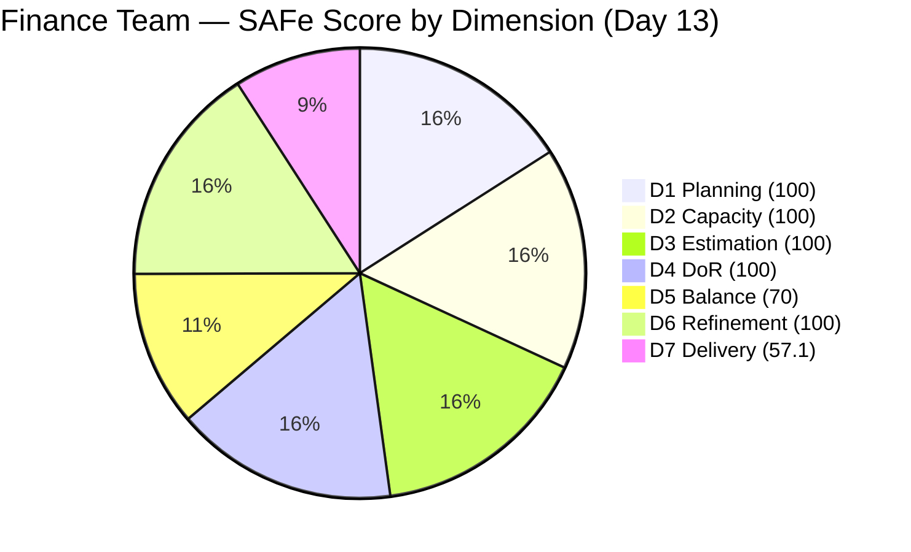
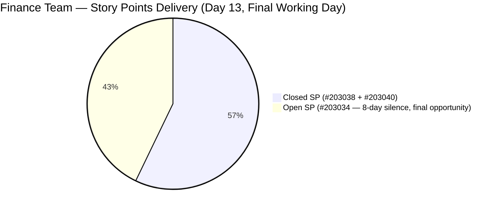

# ADO SAFe Iteration Audit — Finance Team

**Audit #46 | Iteration 7.2 (Apr 20 – May 3, 2026) | Day 13 of 14**

---

## 1. Audit Metadata

| Field | Value |
|---|---|
| **Audit Date** | May 2, 2026 — 09:02 UTC |
| **Auditor** | Claude Code (ADO SAFe Audit Agent) |
| **Workspace** | `ado_fin` |
| **ADO Project** | Jairosoft FINOPS (`e0bb302f-40f9-46c3-8164-6f1acb317d63`) |
| **Team** | Finance Team (`1f4b45fa-82e8-4a36-aedc-6c1bc8f51070`) |
| **Iteration** | Iteration 7.2 — Apr 20 to May 3, 2026 |
| **Iteration ID** | `a9888bc5-48df-40dd-bcc8-6926a11aa7c7` |
| **Sprint Day** | Day 13 of 14 |
| **Prior Audit** | AUDIT_20260501_0903.md (Audit #45, 89.6 — Low Risk, PI7.2 Day 12) |
| **Scoring Model** | ADO SAFe v1 (7-dimension rubric) |
| **Overall Score** | **89.6 / 100** |
| **Risk Band** | **Low Risk** (≥ 80) |

> **Live ADO data confirmed.** 2 visible root backlog items in scope (Finance Team, `Microsoft.RequirementCategory`). 3 current iteration root items confirmed via `wit_get_work_items_for_iteration` (IterationPath = Iteration 7.2). Capacity and work item details confirmed via ADO batch APIs at 09:02 UTC May 2, 2026.

---

## 2. Executive Summary

The Finance Team holds at **89.6 / 100 — Low Risk** on Day 13 of Iteration 7.2, **unchanged from Audit #45** (89.6). Today is the final working day of the sprint (May 3 = Sunday).

**Critical — last chance to close #203034:**
Item **#203034** ("Encoding payroll for automation – phase 2", User Story, 3 SP) has now been silent for **8 days** — last changed Apr 24, 11:54 UTC. This is the longest unbroken silence on any open item across all tracked teams in this sprint. With today being the final working day and approximately 4 hours of capacity remaining, this is the last opportunity to recover the 3 SP.

**Sprint close scenarios:**
- If #203034 closes today: D7 = 100.0; overall = **95.5** (sprint ceiling — Low Risk)
- If #203034 remains Active: D7 = 57.1; overall = **89.6** (current state — Low Risk)

Both scenarios end in Low Risk. The sprint is secured. Closing #203034 today is the sole remaining high-value action.

---

## 3. Previous Audit Delta

| Dimension | Audit #45 (May 1, 09:03) | Audit #46 (May 2, 09:02) | Delta | Driver |
|---|---|---|---|---|
| Iteration Planning | 100.0 | 100.0 | 0.0 | Unchanged |
| Team Capacity | 100.0 | 100.0 | 0.0 | Unchanged |
| Estimation | 100.0 | 100.0 | 0.0 | Unchanged |
| DoR Compliance | 100.0 | 100.0 | 0.0 | Unchanged |
| Work Item Balance | 70.0 | 70.0 | 0.0 | Unchanged |
| Backlog Refinement | 100.0 | 100.0 | 0.0 | Unchanged |
| Delivery Predictability | 57.1 | 57.1 | 0.0 | #203034 still Active; 8-day silence |
| **Overall** | **89.6** | **89.6** | **0.0** | Stable; sprint close imminent |

**ADO changes detected since Audit #45 (09:03 UTC May 1):**
- **None.** #203034 last changed Apr 24, 11:54 UTC. Eight consecutive days with no update. No state transitions, no new items, no field changes detected on any sprint item.

### Score Trajectory — Iteration 7.2 Series

| Audit # | Date | Score | Band | Sprint Day |
|---|---|---|---|---|
| #33–#42 | Apr 20–28 | 77.9 | Moderate | 7.2 D1–D9 |
| #43 | Apr 29 (Day 10) | 89.6 | Low Risk | 7.2 D10 |
| #44 | Apr 30 (Day 11) | 89.6 | Low Risk | 7.2 D11 |
| #45 | May 1 (Day 12) | 89.6 | Low Risk | 7.2 D12 |
| **#46** | **May 2 (Day 13)** | **89.6** | **Low Risk** | **7.2 D13** |

The team has plateaued at 89.6 for four consecutive audits (Days 10–13). The only remaining path to improvement is closing #203034. The sprint closes tomorrow (Sunday). Today is the final working day.

---

## 4. Current Iteration Snapshot

| Metric | Value |
|---|---|
| **Visible root backlog items** | 2 (#203034 Active, #203043 unscoped) |
| **Current iteration root items (Iter 7.2)** | 3 (#203034, #203038, #203040) |
| **Committed story points** | 7 SP |
| **Closed story points** | 4 SP (#203038 + #203040) |
| **Remaining open SP** | 3 SP (#203034) |
| **Sprint progress** | Day 13 of 14 (93% elapsed) |
| **Effective work window remaining** | Today (May 2) — final working day |
| **Capacity remaining** | ~4 hours (Grace: 4 hrs/day × 1 remaining day) |
| **#203034 feasibility** | High — 3 SP in 4 hours is achievable *if not blocked* |
| **#203034 silence** | **8 days** (last changed Apr 24, 11:54 UTC) |
| **Team capacity per day** | 4 hrs/day (Grace: Documentation 3 + Requirements 1) |
| **Days off this sprint** | 2 (Apr 21–22, elapsed) |
| **Assignees on sprint items** | Grace (sole contributor) |
| **Bus factor** | 1 — critical single-person dependency |

### State Distribution — Current Iteration Items

| State | Count | SP | Items |
|---|---|---|---|
| Closed | 2 | 4 | #203038, #203040 |
| Active | 1 | 3 | #203034 |
| **Total** | **3** | **7** | |

---

## 5. Work Item Analysis

### Current Iteration Root Items (3 items)

| ID | Title | Type | State | SP | DoR | AssignedTo | Changed | Silence |
|---|---|---|---|---|---|---|---|---|
| 203038 | Explore market rates in references for Career Mapping | User Story | **Closed** | 3 | PASS | Grace | Apr 28 | — |
| 203040 | AA Escalation of Payment Settlement | Issue | **Closed** | 1 | PASS | Grace | Apr 28 | — |
| 203034 | Encoding payroll for automation – phase 2 | User Story | **Active** | 3 | PASS | Grace | Apr 24 | **8 days** |

### DoR Detail — Current Sprint Items

| ID | Description | Acceptance Criteria | DoR |
|---|---|---|---|
| 203034 | Payroll Administrator narrative; auto-flag discrepancies between encoded rates and contract terms. PASS (≥30 chars) | System blocks Submit on missing mandatory fields; real-time/Pre-check validation. PASS (≥20 chars) | **PASS** |
| 203038 | As-a/I-want/So-that format; career path planning narrative. PASS | 5 criteria: filterable data, visual benchmarks, currency conversion, source transparency, Career Map integration. PASS | **PASS** |
| 203040 | Finance Manager narrative; auto-notify on unpaid invoices >15 days. PASS | 3 criteria: QB alert at 5 days, notification at 15 days, status update to "Escalated". PASS | **PASS** |

### #203034 — 8-Day Silence Analysis

| Field | Value |
|---|---|
| Last Changed | Apr 24, 11:54 UTC |
| Days Silent (as of May 2) | **8 days** |
| Silence started | Audit #38 — first flagged at 2-day silence |
| Progression | 2 days (Apr 26 audit) → 4 days (Apr 28) → 7 days (May 1) → **8 days (May 2)** |
| Sprint closes | Tomorrow (May 3, Sunday) |
| Capacity remaining | 4 hours (Grace, today only) |
| Feasibility | 3 SP achievable in 4 hours if unblocked |
| Risk | Unknown status for 8 days — item may be complete, blocked, or deprioritized |

This item has been the primary risk flag for four consecutive audits with no resolution. The silence is now at its maximum — no further audits will occur before the sprint closes. Grace must act today.

### #203034 — Possible Interpretations (unchanged from prior audits)

1. **Work complete but not closed** — The payroll encoding automation (auto-flag discrepancies, block Submit on missing fields, real-time/Pre-check validation) may be fully implemented and tested. Grace has not updated the ADO item to reflect completion. This is the most recoverable scenario and can be resolved in minutes.
2. **Blocked by a system dependency** — Payroll system access, sign-off from a stakeholder, or environment availability may be preventing validation. No blocker is documented in ADO.
3. **Deprioritized** — Work shifted to non-ADO tracked activities. Item will close at sprint end as incomplete.

### Unscoped PI7 Item

| ID | Title | Type | State | SP | DoR | Changed | Age |
|---|---|---|---|---|---|---|---|
| 203043 | FTC HR for signed APEF | User Story | New | 2 | FAIL | Apr 20 | 12 days |

#203043 has been unscoped for 12 days (since Apr 20) with no description or acceptance criteria. Must be refined before Iter 7.3 commitment.

---

## 6. SAFe Compliance Scorecard

| Dimension | Score | Evidence | Notes |
|---|---|---|---|
| D1 Iteration Planning | 100.0 | 3 sprint items / 2 visible backlog → capped at 100 | Full commitment against available ready backlog |
| D2 Team Capacity | 100.0 | 1 / 1 contributor with positive capacity | Grace: 4 hrs/day; 2 days off (elapsed); ~4 hrs remaining today |
| D3 Estimation | 100.0 | 3 / 3 sprint items have SP > 0 | Full estimation hygiene maintained |
| D4 DoR Compliance | 100.0 | 3 / 3 sprint items pass Desc + AC check | #203043 unscoped — correctly excluded from denominator |
| D5 Work Item Balance | 70.0 | 2 US (66.7%) + 1 Issue; dominant type > 60% | Has User Story ✓; dominant type penalty -30; small sprint limits diversification |
| D6 Backlog Refinement | 100.0 | 2/2 visible items changed within 45-day window | #203034 Apr 24 (within window); #203043 Apr 20 (within window) |
| D7 Delivery Predictability | 57.1 | 4 / 7 SP closed | #203034 (3 SP) Active; 8-day silence; sprint closes tomorrow |
| **Overall** | **89.6** | **(100+100+100+100+70+100+57.1)/7** | **Low Risk** |

---

## 7. Dimension Findings

### D1 — Iteration Planning (100.0 — unchanged)

Full commitment against the available ready backlog. The formula result of 3/2 × 100 = 150 is capped at 100.0. Two of three sprint items are closed. D1 will remain at 100.0 for the sprint close.

For Iteration 7.3: #203043 must receive Description and Acceptance Criteria before being committed to the sprint. Any new items should also enter with full DoR documentation.

### D2 — Team Capacity (100.0 — unchanged)

Grace's capacity is fully configured: 4 hours/day (Documentation 3 + Requirements 1). The two days off (Apr 21–22) are elapsed. Today is the final working day with approximately 4 hours of available capacity. If #203034 is to be closed, it must happen within today's 4-hour window.

### D3 — Estimation (100.0 — unchanged)

All three sprint items carry Story Points (3 + 1 + 3 = 7 SP total). Estimation hygiene has been perfect throughout the sprint.

### D4 — DoR Compliance (100.0 — unchanged)

All three sprint items pass DoR. The Finance Team has maintained 100% DoR compliance on sprint-scoped items for the entire sprint.

### D5 — Work Item Balance (70.0 — unchanged, structurally locked)

Two User Stories (66.7%) and one Issue. The 66.7% User Story share exceeds the 60% dominant-type threshold, triggering the -30 penalty. With only 3 items in the sprint, type diversification is structurally limited. For Iteration 7.3, including an Enabler or Spike alongside User Story work would reduce the penalty.

### D6 — Backlog Refinement (100.0 — unchanged)

Both visible backlog items were changed within the 45-day fresh window (cutoff: Mar 18, 2026). #203034 (Apr 24) and #203043 (Apr 20) both qualify. No stale_90 or stale_180 items exist. No untouched-current penalty applies — #203034 was changed after the Apr 20 sprint start.

**D6 forward consideration:** When Iteration 7.3 begins, #203034's Apr 24 ChangedDate will be approximately 13 days old — still fresh. However, if the item rolls over to Iter 7.3 (if not closed this sprint), the untouched-current penalty would apply for Iter 7.3 if no update occurs after the Iter 7.3 start date.

### D7 — Delivery Predictability (57.1 — unchanged, final day)

D7 has been static at 57.1 since Audit #43 (Apr 29). Eight days of silence on #203034. The sprint closes tomorrow (Sunday, May 3). Today is the final opportunity to raise D7 to 100.0.

**Projection:**
- Close #203034 today: D7 = round(7/7 × 100, 1) = **100.0**; overall = **(100+100+100+100+70+100+100)/7 = 95.5**
- #203034 remains Active: D7 = **57.1**; overall stays at **89.6**

Both outcomes are Low Risk. Closing is a strong improvement but not survival-critical.

---

## 8. Risks and Bottlenecks

| Risk | Severity | Status |
|---|---|---|
| #203034 not updated for **8 days** — Apr 24 to May 2 | **Critical** | Longest silence on any open item across all tracked teams; final working day; must be addressed today |
| Sprint closes May 3 (Sunday); no recovery after today | **High** | May 2 is the last opportunity to close #203034 and achieve D7 = 100 |
| Grace capacity: only 4 hours remaining today | Moderate | Item is 3 SP — achievable in 4 hours if unblocked |
| #203043 unscoped for 12 days — no Desc/AC | Low | Not in current sprint; must be refined before Iter 7.3 commitment |
| Single contributor (Grace) — bus factor 1 | Moderate | Structural; unchanged all sprint |
| D5 capped at 70 — small sprint limits type diversification | Low | Structural; plan for Iter 7.3 |

---

## 9. Prioritized Recommendations

1. **[TODAY — CRITICAL] Re-engage immediately on #203034 (Encoding payroll automation – phase 2, 3 SP)** — This is the last opportunity. Grace must update the item today with one of two outcomes:
   - **If work is complete:** Document the completed Acceptance Criteria (Submit blocked on missing mandatory fields; Pre-check/real-time validation functional) and close the item. D7 rises to 100.0; overall to 95.5.
   - **If blocked:** Document the specific blocker clearly so it can be escalated or carried to Iter 7.3 with a defined resolution path. Silence is worse than a documented blocker.
2. **[Before sprint close] Refine #203043 (FTC HR for signed APEF, 2 SP)** — Add Description (≥30 non-whitespace chars) and Acceptance Criteria (≥20 non-whitespace chars) before Iteration 7.3 planning. This item has been in PI7-root for 12 days without documentation.
3. **[Iter 7.3 Planning] Diversify work item types** — Include at least one Enabler or Spike alongside User Story work. A 5-item sprint with 2 Enablers/Issues and 3 User Stories brings User Story share to 60%, eliminating the D5 -30 penalty.
4. **[Iter 7.3 Planning] Define #203043 scope before commitment** — If the item carries to Iter 7.3, assign a specific Grace-updated ChangedDate (by updating the item after Iter 7.3 start) to avoid the untouched-current penalty.
5. **[PI 8 Planning] Address bus factor** — Grace is the sole Finance Team contributor. Consider cross-training or co-ownership arrangements for PI 8.

---

## 10. Evidence Gaps and Limitations

| Gap | Impact | Mitigation |
|---|---|---|
| #203034 last changed Apr 24, 11:54 UTC — 8-day silence | D7 correctly reflects 4/7 SP closed; work status unknown | Grace must update today; sprint closes tomorrow |
| #203043 DoR: FAIL (rev=1; no Description/AC fields) | Correctly excluded from D4 denominator (not in sprint) | Must be refined before Iter 7.3 commitment |
| D1 cap applied: 3 sprint items / 2 visible backlog = 150 → capped at 100 | Formula cap is correct per rubric | Documented; no scoring error |
| 2 days off (Apr 21–22) reduce available sprint hours from ~56 to ~48 | No direct D7 impact (SP-based, not hours-based) | Capacity correctly reflected in team capacity API |
| Sprint end May 3 = Sunday | Effective work window ends today (May 2) | Grace must target #203034 closure or status update by end of business today |
