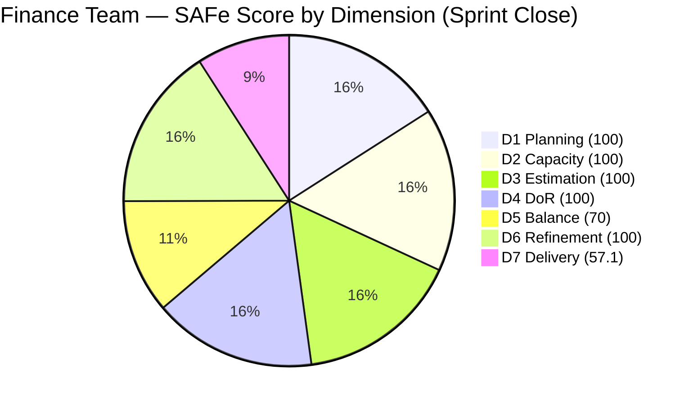
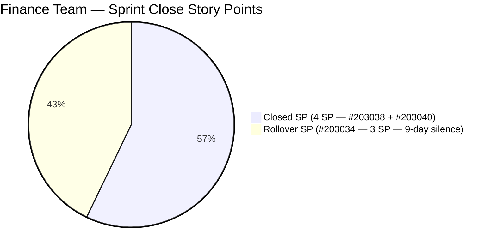

# ADO SAFe Iteration Audit — Finance Team

**Audit #47 | Iteration 7.2 (Apr 20 – May 3, 2026) | Day 14 of 14 — SPRINT CLOSE**

---

## 1. Audit Metadata

| Field | Value |
|---|---|
| **Audit Date** | May 3, 2026 — 09:03 UTC |
| **Auditor** | Claude Code (ADO SAFe Audit Agent) |
| **Workspace** | `ado_fin` |
| **ADO Project** | Jairosoft FINOPS (`e0bb302f-40f9-46c3-8164-6f1acb317d63`) |
| **Team** | Finance Team (`1f4b45fa-82e8-4a36-aedc-6c1bc8f51070`) |
| **Iteration** | Iteration 7.2 — Apr 20 to May 3, 2026 |
| **Iteration ID** | `a9888bc5-48df-40dd-bcc8-6926a11aa7c7` |
| **Sprint Day** | Day 14 of 14 — FINAL DAY (Sprint Closes Today) |
| **Prior Audit** | AUDIT_20260502_0902.md (Audit #46, 89.6 — Low Risk, PI7.2 Day 13) |
| **Scoring Model** | ADO SAFe v1 (7-dimension rubric) |
| **Overall Score** | **89.6 / 100** |
| **Risk Band** | **Low Risk** (≥ 80) |

> **Live ADO data confirmed.** 2 visible root backlog items in scope (Finance Team, `Microsoft.RequirementCategory`). 3 current iteration root items confirmed via `wit_get_work_items_for_iteration` (IterationPath = Iteration 7.2). Item #203034 remains **Active** with no change since Apr 24. Capacity and work item details confirmed via ADO batch APIs at 09:03 UTC May 3, 2026.

---

## 2. Executive Summary

The Finance Team closes Iteration 7.2 at **89.6 / 100 — Low Risk**, **unchanged from the last four consecutive audits** (Days 10–14). The sprint ends today with a confirmed delivery shortfall.

**Sprint close status:**
- **#203034** ("Encoding payroll for automation – phase 2", User Story, 3 SP): **Remains Active** — last changed Apr 24, 11:54 UTC. The item was not closed during the sprint despite being the sole open item for 9 days. This is now a **confirmed sprint rollover**.
- **#203038** (Explore market rates for Career Mapping, User Story, 3 SP): **Closed** — Apr 28.
- **#203040** (AA Escalation of Payment Settlement, Issue, 1 SP): **Closed** — Apr 28.

Final sprint delivery: **4 of 7 SP closed (57.1%)**. D7 = 57.1. Despite the delivery gap, all other dimensions scored 100, anchoring the team at Low Risk (89.6) for the sprint close.

**Iteration 7.3 planning note:** #203034 must be reviewed before re-commitment. Its 9-day silence without a documented blocker is the team's most critical process gap entering the new sprint.

---

## 3. Previous Audit Delta

| Dimension | Audit #46 (May 2, 09:02) | Audit #47 (May 3, 09:03) | Delta | Driver |
|---|---|---|---|---|
| Iteration Planning | 100.0 | 100.0 | 0.0 | Unchanged |
| Team Capacity | 100.0 | 100.0 | 0.0 | Unchanged |
| Estimation | 100.0 | 100.0 | 0.0 | Unchanged |
| DoR Compliance | 100.0 | 100.0 | 0.0 | Unchanged |
| Work Item Balance | 70.0 | 70.0 | 0.0 | Unchanged |
| Backlog Refinement | 100.0 | 100.0 | 0.0 | Unchanged |
| Delivery Predictability | 57.1 | 57.1 | 0.0 | #203034 not closed; sprint ends today |
| **Overall** | **89.6** | **89.6** | **0.0** | Sprint close — Low Risk held; D7 gap confirmed |

**ADO changes since Audit #46 (09:02 UTC May 2):**
- **None detected.** #203034 last changed Apr 24, 11:54 UTC — **9 consecutive days of silence** through sprint close. No state transitions, no field changes, no comments detected on any sprint item.

### Score Trajectory — Iteration 7.2 Full Series

| Audit # | Date | Score | Band | Sprint Day |
|---|---|---|---|---|
| #33–#42 | Apr 20–28 | 77.9 | Moderate | 7.2 D1–D9 |
| #43 | Apr 29 (Day 10) | 89.6 | Low Risk | 7.2 D10 |
| #44 | Apr 30 (Day 11) | 89.6 | Low Risk | 7.2 D11 |
| #45 | May 1 (Day 12) | 89.6 | Low Risk | 7.2 D12 |
| #46 | May 2 (Day 13) | 89.6 | Low Risk | 7.2 D13 |
| **#47** | **May 3 (Day 14)** | **89.6** | **Low Risk** | **7.2 Close** |

The team plateaued at 89.6 from Day 10 through sprint close — four consecutive unchanged audits. The D7 deficit (57.1) is the final sprint narrative.

---

## 4. Current Iteration Snapshot

| Metric | Value |
|---|---|
| **Visible root backlog items** | 2 (#203034 Active, #203043 unscoped) |
| **Current iteration root items (Iter 7.2)** | 3 (#203034, #203038, #203040) |
| **Committed story points** | 7 SP |
| **Closed story points** | **4 SP** (#203038 + #203040) |
| **Undelivered SP** | **3 SP** (#203034 — rolls to Iter 7.3) |
| **Sprint progress** | Day 14 of 14 — Sprint CLOSED |
| **Final delivery rate** | 4/7 SP = 57.1% |
| **Assignee** | Grace (sole contributor) |
| **Bus factor** | 1 — persistent structural risk |
| **Sprint outcome** | **PARTIAL DELIVERY — 57.1% of committed SP** |

### State Distribution — Final Sprint Close

| State | Count | SP | Items |
|---|---|---|---|
| Closed | 2 | 4 | #203038, #203040 |
| Active (rollover) | 1 | 3 | **#203034** |
| **Total** | **3** | **7** | |

---

## 5. Work Item Analysis

### Current Iteration Root Items — Final State (3 items)

| ID | Title | Type | State | SP | DoR | AssignedTo | Last Changed | Silence |
|---|---|---|---|---|---|---|---|---|
| 203038 | Explore market rates for Career Mapping | User Story | **Closed** | 3 | PASS | Grace | Apr 28 | — |
| 203040 | AA Escalation of Payment Settlement | Issue | **Closed** | 1 | PASS | Grace | Apr 28 | — |
| **203034** | **Encoding payroll for automation – phase 2** | **User Story** | **Active** | **3** | PASS | Grace | **Apr 24** | **9 days** |

### #203034 — Confirmed Rollover Analysis

| Field | Value |
|---|---|
| Last Changed | Apr 24, 11:54 UTC |
| Days Silent | **9 days** (Apr 24 → May 3 sprint close) |
| Sprint Entered | Apr 20 |
| Days in Sprint | 14 |
| First Flagged | Audit #38 (Apr 26 — 2-day silence) |
| Silence Progression | 2d (Apr 26) → 4d (Apr 28) → 7d (May 1) → 8d (May 2) → **9d at close** |
| Sprint Closure Status | **Rolled over to Iter 7.3 as Active** |
| SP Impact | 3 SP undelivered; D7 = 57.1 (vs. potential 100.0) |

The item's acceptance criteria (System blocks Submit on missing mandatory fields; real-time/Pre-check validation) remain unverified in ADO. No blocker was documented during the 9-day silence. This is the team's most significant process failure this sprint — not the delivery gap itself, but the absence of status communication.

### Unscoped Backlog Item

| ID | Title | Type | State | SP | DoR | Changed |
|---|---|---|---|---|---|---|
| 203043 | FTC HR for signed APEF | User Story | New | 2 | **FAIL** | Apr 20 |

#203043 has remained unscoped for the full 14-day sprint with no Description or Acceptance Criteria. Must be refined and documented before any Iter 7.3 commitment.

---

## 6. SAFe Compliance Scorecard

| Dimension | Score | Evidence | Notes |
|---|---|---|---|
| D1 Iteration Planning | 100.0 | 3 sprint items / 2 visible backlog → capped at 100 | Correct per formula; sprint items exceed visible backlog count |
| D2 Team Capacity | 100.0 | 1 / 1 contributor with positive capacity | Grace: 4 hrs/day (Doc 3 + Req 1); 2 days off (Apr 21–22, elapsed) |
| D3 Estimation | 100.0 | 3 / 3 sprint items have SP > 0 | 7 SP total; all items estimated |
| D4 DoR Compliance | 100.0 | 3 / 3 sprint items pass Desc + AC check | #203043 unscoped — correctly excluded from denominator |
| D5 Work Item Balance | 70.0 | 2 User Stories (66.7%) + 1 Issue; dominant type > 60% | Has User Story ✓; dominant type penalty -30; small sprint limits diversification |
| D6 Backlog Refinement | 100.0 | 2/2 visible items within 45-day window | #203034 (Apr 24) and #203043 (Apr 20) both fresh (cutoff Mar 19) |
| D7 Delivery Predictability | **57.1** | **4 / 7 SP closed** | **#203034 rolls over; 9-day silence unresolved at sprint close** |
| **Overall** | **89.6** | **(100+100+100+100+70+100+57.1)/7** | **Low Risk — D7 the sole deficit** |

---

## 7. Dimension Findings

### D1 — Iteration Planning (100.0 — unchanged)

Full commitment against available ready backlog (3 items vs. 2 visible). The cap at 100 applies. For Iteration 7.3: #203043 must be refined before it can be committed. #203034 rolls over as Active and should be reviewed for block identification before re-committing.

### D2 — Team Capacity (100.0 — unchanged)

Grace's capacity (4 hrs/day, Documentation 3 + Requirements 1) was correctly configured throughout the sprint. The two days off (Apr 21–22) were planned. Grace had full capacity available during the 9-day #203034 silence window (Apr 24–May 3), making the lack of status updates more notable.

### D3 — Estimation (100.0 — unchanged)

All three sprint items carried Story Points from day one through close. Estimation hygiene was perfect.

### D4 — DoR Compliance (100.0 — unchanged)

All three sprint items passed DoR on entry and maintained documentation quality throughout. #203043 is correctly excluded (not committed to this sprint).

### D5 — Work Item Balance (70.0 — structurally locked)

Two User Stories (66.7%) and one Issue. User Story share exceeds the 60% dominant-type threshold. With only 3 items, structural diversification is limited. For Iteration 7.3: a 5-item sprint with at least 2 non-User-Story items (e.g., 3 User Stories + 1 Enabler + 1 Spike) would bring the User Story share below 60%, eliminating the -30 penalty.

### D6 — Backlog Refinement (100.0 — unchanged)

Both visible backlog items remain within the 45-day freshness window (cutoff: Mar 19, 2026):
- #203034: Apr 24 (fresh — 39 days old at sprint close)
- #203043: Apr 20 (fresh — 43 days old at sprint close)

No stale_90 or stale_180 items. The untouched-current check: #203034 was last changed Apr 24, which is after the sprint start (Apr 20) — this means it was touched during the sprint and does not trigger the untouched penalty. However, it has been silent for 9 days since that Apr 24 touch.

**D6 forward risk for Iter 7.3:** If #203034 rolls into Iter 7.3 without a new update after the Iter 7.3 start date, it would be classified as untouched-current and trigger a -10 or -20 D6 penalty. Grace must update the item on the first day of Iter 7.3.

### D7 — Delivery Predictability (57.1 — confirmed sprint close deficit)

Final sprint delivery: 4 of 7 SP (57.1%). #203034 (3 SP) is the sole undelivered item. Nine days of silence with no documented blocker, no status comment, no AC update. The sprint closes with this gap unresolved.

**Pattern comparison across sprints:**
- Iter 7.1 (prior sprint): Similar patterns noted in history
- Iter 7.2 final: 57.1% delivery — below team's own Moderate Risk threshold for this dimension in isolation
- Required for next sprint: Early engagement on #203034 in Iter 7.3, with explicit mid-sprint status checkpoints

---

## 8. Risks and Bottlenecks

| Risk | Severity | Status |
|---|---|---|
| #203034 rolled over with 9-day silence and no documented blocker | **Critical** | Confirmed sprint failure item; must be diagnosed in retrospective. Unknown status entering Iter 7.3. |
| No blocker documented for #203034 — unknown completion state | **High** | Grace must clarify within first 2 days of Iter 7.3: is the payroll automation work complete, blocked, or deferred? |
| #203043 unscoped for 14 days — no Desc/AC | **High** | Cannot be committed to Iter 7.3 without full DoR documentation |
| D7 = 57.1 at sprint close — below Moderate Risk threshold in isolation | High | Two consecutive sprints below 70% delivery on D7 would signal a team performance trend requiring escalation |
| Single contributor (Grace) — bus factor 1 | Moderate | Structural; PI 8 planning must address cross-coverage |
| D5 capped at 70 — small sprint limits type diversification | Low | Structural; plan for Iter 7.3 with 5+ items and mixed types |

---

## 9. Prioritized Recommendations

1. **[Iter 7.3 Day 1 — CRITICAL] Diagnose and document #203034 status immediately** — Grace must open the item on the first day of Iter 7.3 and post a status update. The three possible states must be resolved:
   - **Complete:** Document that AC criteria (Submit blocking, real-time/Pre-check validation) are met and close the item.
   - **Blocked:** Document the specific blocker (system dependency, stakeholder, environment) and create a blocker removal plan.
   - **Deferred/Descoped:** Document the decision and update the iteration path accordingly.

2. **[Before Iter 7.3 Planning] Refine #203043 (FTC HR for signed APEF, 2 SP)** — Add a user story-format Description (≥ 30 non-whitespace characters) and Acceptance Criteria (≥ 20 non-whitespace characters). This item has been in PI7-root for 14 days without documentation. It must pass DoR before it can be committed.

3. **[Iter 7.3 Sprint Planning] Include 5+ items with mixed types** — A 5-item sprint with 3 User Stories + 1 Enabler + 1 Spike brings User Story share to 60%, eliminating the D5 -30 penalty. Target: D5 = 100 in Iter 7.3.

4. **[Iter 7.3 Day 1] Update #203034 after Iter 7.3 sprint start** — Regardless of status, Grace must touch the item after the Iter 7.3 start date to avoid the D6 untouched-current penalty. Even a comment update is sufficient.

5. **[Sprint Planning Process] Establish mid-sprint checkpoint protocol** — The 9-day #203034 silence was the sprint's primary risk throughout Days 5–14. Introduce a bi-weekly status rule: any item unchanged for 3+ days triggers a mandatory ADO comment update from the assignee. This protects D6 and surfaces blockers before they become delivery failures.

6. **[PI 8 Planning] Address bus factor** — Grace is the sole Finance Team contributor. A cross-training or co-assignment arrangement for PI 8 would reduce delivery risk from single-person absences or overload.

---

## 10. Evidence Gaps and Limitations

| Gap | Impact | Mitigation |
|---|---|---|
| #203034 last changed Apr 24 — 9-day silence; work status unknown at sprint close | D7 correctly reflects 4/7 SP; no way to determine completion state without Grace input | Grace must resolve status in Iter 7.3 Day 1 |
| #203043 DoR: FAIL — no Description or AC in ADO | Correctly excluded from D4 denominator (not in sprint); no scoring impact | Must be refined before Iter 7.3 commitment |
| D1 cap applied: 3 sprint items / 2 visible backlog = 150 → capped at 100 | Formula cap is correct per rubric; comparison to mid-sprint D1 requires context | Documented; no scoring error |
| 2 days off (Apr 21–22) reduce available sprint hours | No direct D7 impact (SP-based, not hours-based) | Correctly reflected in team capacity API |
| D7 = 57.1 is confirmed final — no further ADO activity detected since Apr 28 | Sprint closes with this score; no recovery path exists | #203034 status review required in Iter 7.3 |
