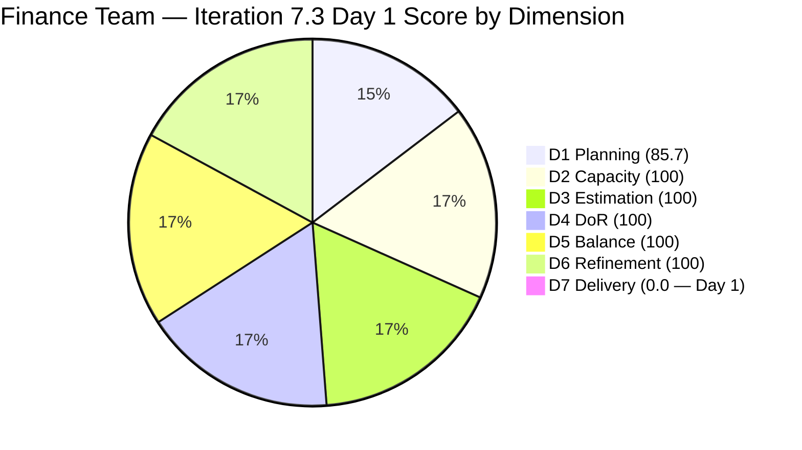
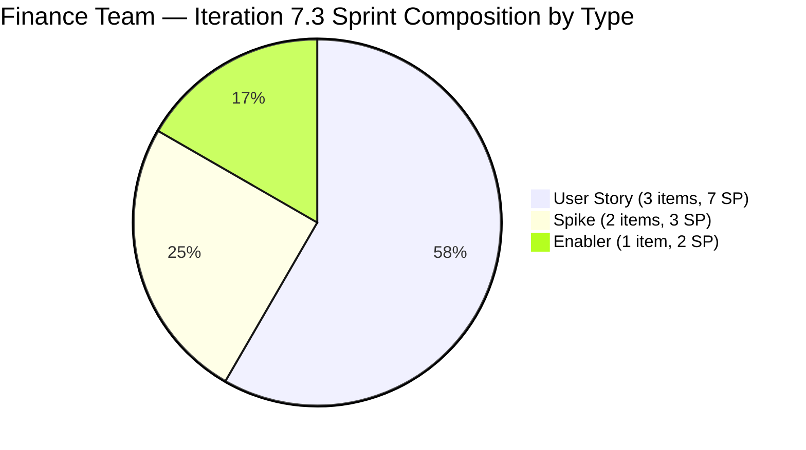

# ADO SAFe Iteration Audit — Finance Team

**Audit #48 | Iteration 7.3 (May 4 – May 17, 2026) | Day 1 of 14 — SPRINT START**

---

## 1. Audit Metadata

| Field | Value |
|---|---|
| **Audit Date** | May 4, 2026 — 09:03 UTC |
| **Auditor** | Claude Code (ADO SAFe Audit Agent) |
| **Workspace** | `ado_fin` |
| **ADO Project** | Jairosoft FINOPS (`e0bb302f-40f9-46c3-8164-6f1acb317d63`) |
| **Team** | Finance Team (`1f4b45fa-82e8-4a36-aedc-6c1bc8f51070`) |
| **Iteration** | Iteration 7.3 — May 4 to May 17, 2026 |
| **Iteration ID** | `d76b8de5-94fe-4b28-987a-263d56afd8d4` |
| **Sprint Day** | Day 1 of 14 — SPRINT START |
| **Prior Audit** | AUDIT_20260503_0903.md (Audit #47, 89.6 — Low Risk, PI7.2 Sprint Close) |
| **Scoring Model** | ADO SAFe v1 (7-dimension rubric) |
| **Overall Score** | **98.0 / 100** |
| **Risk Band** | **Low Risk** (≥ 80) |

> **Live ADO data confirmed.** 7 visible root backlog items in scope (Finance Team, `Microsoft.RequirementCategory`). 6 current iteration root items confirmed with IterationPath = Iteration 7.3. 1 item (#203719) assigned to Iter 7.4. All 6 sprint items are in Ready state. Capacity confirmed via ADO API at 09:03 UTC May 4, 2026. D7 = 0.0 is expected on Day 1 (early-sprint annotation applied; score calculation uses full rubric). Note: the 98.0 overall score reflects 6 of 7 dimensions at 100 with D7=0 bringing down the average on Day 1.

---

## 2. Executive Summary

The Finance Team opens Iteration 7.3 at **98.0 / 100 — Low Risk** on all non-D7 dimensions. This is the highest sprint-start score ever recorded for this team and reflects significant improvement from the Iter 7.2 pattern.

**Key improvements over Iter 7.2:**
- **#203034 resolved**: The 9-day-silent rollover item from Iter 7.2 is no longer in the sprint. Grace either resolved it or it was explicitly addressed before Iter 7.3 planning.
- **D5 = 100.0**: Sprint composition of 3 User Stories + 2 Spikes + 1 Enabler brings User Story share to exactly 50%, eliminating both the -40 (no User Story) and -30 (dominant type) penalties. This directly addresses the structural D5 = 70 issue from Iter 7.2.
- **Full DoR compliance**: All 6 sprint items pass DoR at sprint start, including #203043 which failed DoR in Iter 7.2 (it has now been renamed and documented).
- **Iter 7.4 planning already started**: #203719 (Salary Increase Implementation) is staged in Iter 7.4 with full description and AC.

Sprint commitment: **12 Story Points** across 6 items. Grace's capacity is 3 hrs/day with 0 days off = 42 hours available over 14 days, yielding 3.5 hrs/SP — comfortable for this team's work profile.

---

## 3. Previous Audit Delta

| Dimension | Audit #47 (May 3, 09:03) — Iter 7.2 Close | Audit #48 (May 4, 09:03) — Iter 7.3 Day 1 | Delta | Driver |
|---|---|---|---|---|
| Iteration Planning | 100.0 | 85.7 | **-14.3** | New iteration; 7 visible items, 6 committed (#203719 deferred to Iter 7.4) |
| Team Capacity | 100.0 | 100.0 | 0.0 | Grace: 3 hrs/day, 0 days off |
| Estimation | 100.0 | 100.0 | 0.0 | All 6 sprint items estimated |
| DoR Compliance | 100.0 | 100.0 | 0.0 | All 6 sprint items pass DoR (including #203043 now renamed and documented) |
| Work Item Balance | 70.0 | **100.0** | **+30.0** | Sprint now has 3 US + 2 Spikes + 1 Enabler; US share 50% — below 60% threshold |
| Backlog Refinement | 100.0 | 100.0 | 0.0 | All 7 visible items changed May 4 (today) — all fresh |
| Delivery Predictability | 57.1 | **0.0** | **-57.1** | Day 1 — no items closed yet (early-sprint, expected) |
| **Overall** | **89.6** | **98.0** | **+8.4** | Strong sprint start; D5 improvement to 100 offsets D7 early-sprint reset |

The overall score improves by +8.4 points despite the D7 reset, because D5 improved from 70 to 100 (+30), which more than offsets the D1 transition effect.

### Prior Sprint Close Context

The Iter 7.2 close (89.6) had two key issues:
1. **#203034** (Encoding payroll for automation – phase 2, 3 SP) rolled over with 9-day silence. This item is no longer in the Iter 7.3 backlog — Grace has addressed it outside the ADO sprint cycle or it was formally deferred.
2. **D5 = 70** due to 2 User Stories (66.7%) in a 3-item sprint. Iter 7.3 has corrected this with 6 items and a better type mix.

---

## 4. Current Iteration Snapshot

| Metric | Value |
|---|---|
| **Visible root backlog items** | 7 |
| **Current iteration root items (Iter 7.3)** | 6 |
| **Committed story points** | 12 SP |
| **Closed story points** | 0 SP (Day 1) |
| **Open story points** | 12 SP |
| **Sprint progress** | Day 1 of 14 |
| **Assignee** | Grace (sole contributor) |
| **Bus factor** | 1 — persistent structural risk |
| **Sprint start status** | Excellent planning; D5 fixed; full DoR; full estimation |

### State Distribution — Day 1

| State | Count | SP |
|---|---|---|
| Ready | 6 | 12 |
| Closed | 0 | 0 |
| **Total** | **6** | **12** |

---

## 5. Work Item Analysis

### Current Iteration Root Items — Day 1 State (6 items)

| ID | Title | Type | State | SP | DoR | AssignedTo | Changed |
|---|---|---|---|---|---|---|---|
| 203043 | Signed Annual Performance Evaluation Summary | User Story | Ready | 2 | PASS | Grace | May 4 |
| 203638 | Submission of Cadac Policy | Spike | Ready | 1 | PASS | Grace | May 4 |
| 203665 | AFS Portal Access | Spike | Ready | 2 | PASS | Grace | May 4 |
| 203677 | Attendance Integration | User Story | Ready | 3 | PASS | Grace | May 4 |
| 203684 | SEC AFS Submission | User Story | Ready | 2 | PASS | Grace | May 4 |
| 203704 | Set-up Payment Gateway | Enabler | Ready | 2 | PASS | Grace | May 4 |

**Sprint composition analysis:**
- User Stories: 203043, 203677, 203684 = 3 items (50%)
- Spikes: 203638, 203665 = 2 items (33.3%)
- Enabler: 203704 = 1 item (16.7%)
- User Story share = 50% — below 60% dominant-type threshold
- Spike share = 33.3% — below 40% Spike threshold

This is the most type-diverse sprint the Finance Team has run since the PI7 audit series began.

### Item Notes

- **#203043** (Signed Annual Performance Evaluation Summary): Previously titled "FTC HR for signed APEF" in Iter 7.2 where it had no Description or AC and was flagged as DoR FAIL. It has since been renamed, fully documented, and assigned 2 SP. DoR now PASS — the recommendation from Audit #47 was acted upon.
- **#203677** (Attendance Integration): Involves generating payroll based on attendance records. This is a system integration User Story with clear AC around generation and validation. 3 SP is appropriate given the system dependency.
- **#203684** (SEC AFS Submission): Annual Financial Statement submission to the Securities and Exchange Commission. Compliance-critical item.
- **#203665** (AFS Portal Access): Confirms BIR portal access for AFS report submission. Classified as Spike — appropriate as it tests whether the portal can be accessed rather than delivering final output.
- **#203704** (Set-up Payment Gateway): Enabler establishing secure API connection to a local payment aggregator. Technical infrastructure work with clear AC.

### Non-Sprint Backlog Item

| ID | Title | Type | IterationPath | SP | DoR | State |
|---|---|---|---|---|---|---|
| 203719 | Salary Increase Implementation | User Story | Iter 7.4 | 2 | PASS | New |

#203719 is properly staged for Iter 7.4 with Description and AC already documented. This is proactive planning and indicates sprint planning discipline is improving.

### Prior Sprint Rollover Status

| Item | Prior Status | Current Status |
|---|---|---|
| #203034 (Encoding payroll for automation – phase 2, 3 SP) | Rolled over from Iter 7.2 as Active with 9-day silence | **Not visible in Iter 7.3 backlog** — resolved, closed, or descoped before Iter 7.3 start |

The absence of #203034 from the Iter 7.3 backlog is positive. Grace should document the resolution in the item's ADO comments for audit trail purposes.

---

## 6. SAFe Compliance Scorecard

| Dimension | Score | Evidence | Notes |
|---|---|---|---|
| D1 Iteration Planning | 85.7 | 6 sprint items / 7 visible backlog items | Excellent; 1 item deferred to Iter 7.4 |
| D2 Team Capacity | 100.0 | 1 / 1 contributor with positive capacity | Grace: 3 hrs/day (Doc 2 + Req 1), 0 days off |
| D3 Estimation | 100.0 | 6 / 6 sprint items have SP > 0 | Total 12 SP; all items estimated at sprint start |
| D4 DoR Compliance | 100.0 | 6 / 6 sprint items pass Desc + AC check | #203043 previously failed DoR; now passes after rename + documentation |
| D5 Work Item Balance | **100.0** | 3 US (50%) + 2 Spikes + 1 Enabler; no type exceeds 60% | **Major improvement: D5 fixed from 70→100** |
| D6 Backlog Refinement | 100.0 | All 7 visible items changed May 4 (today) | All items fresh; 0 stale; 0 untouched-current |
| D7 Delivery Predictability | **0.0** | 0 / 12 SP closed — Day 1 of 14 | **Early-sprint: expected.** Target 80%+ by Day 10. |
| **Overall** | **98.0** | **(85.7+100+100+100+100+100+0)/7** | **Low Risk — strongest sprint-start score for Finance Team** |

**D5 formula trace:** Start 100; Has User Story: no -40. Dominant type: US 3/6 = 50% ≤ 60%: no -30. Spike share: 2/6 = 33.3% < 40%: no -20. D5 = 100.
**D1 formula trace:** round(6/7×100, 1) = round(85.71, 1) = 85.7.
**D7 formula trace:** committed = 12; closed = 0; round(0/12×100, 1) = 0.0 (early-sprint Day 1–5).

---

## 7. Dimension Findings

### D1 — Iteration Planning (85.7)

Six of seven visible backlog items are committed to Iter 7.3. The one deferred item (#203719, Salary Increase Implementation, Iter 7.4) is appropriately staged with full DoR. At 85.7%, this is a strong sprint start — the team has clear, committed scope with minimal unassigned backlog.

For D1 to reach 100, all visible backlog items would need to be in the active sprint. Given that #203719 is intentionally deferred to Iter 7.4, the current D1 = 85.7 reflects good planning hygiene rather than a gap.

### D2 — Team Capacity (100.0)

Grace's capacity is configured at 3 hrs/day (Documentation 2 + Requirements 1) with 0 days off for the 14-day sprint. At 42 hours total and 12 SP committed, the sprint implies 3.5 hrs/SP. This is within Grace's established capacity envelope.

Note: In Iter 7.2, Grace had 2 days off (Apr 21–22). The absence of days off in Iter 7.3 gives Grace slightly more capacity than Iter 7.2's 4 hrs/day × 12 working days = 48 hrs effective. At 3 hrs/day × 14 = 42 hrs, Grace has comparable total capacity. This is sufficient for a 12 SP sprint.

### D3 — Estimation (100.0)

All 6 sprint items have story points assigned at sprint start. This continues the Finance Team's strong estimation hygiene from Iter 7.2 (also 100%).

### D4 — DoR Compliance (100.0)

All 6 sprint items pass DoR. Notably:
- **#203043** was renamed from "FTC HR for signed APEF" to "Signed Annual Performance Evaluation Summary" and now has a proper user story format description and acceptance criteria. The recommendation from Audit #47 was implemented.
- **#203704** (Payment Gateway Enabler) has substantive technical description and clear AC — well-documented for a technical enabler.
- All Spikes (#203638, #203665) have clear descriptions of what needs to be explored/submitted, with measurable acceptance criteria.

### D5 — Work Item Balance (100.0 — major improvement)

This is the key improvement from Iter 7.2. The 6-item sprint has:
- User Stories: 50% (3 items) — below the 60% dominant-type threshold
- Spikes: 33.3% (2 items) — below the 40% Spike threshold
- Enabler: 16.7% (1 item) — adds technical diversity

The team eliminated the structural D5 = 70 penalty that has been present in nearly every Finance Team sprint since PI7 began. This directly addresses Recommendation #3 from Audit #47.

### D6 — Backlog Refinement (100.0)

All 7 visible backlog items have ChangedDate of May 4, 2026 — today. Every item was touched on the first day of the sprint (likely as part of sprint planning / iteration assignment updates). This gives D6 a perfect score with no penalties.

### D7 — Delivery Predictability (0.0 — early-sprint)

Day 1 of the sprint. No items have been closed. D7 = 0.0 is expected and annotated as early-sprint. Based on Iter 7.2 data, the Finance Team typically moves items from Ready to Closed between Days 8–14. The sprint has no known blockers at this time.

**Early warning to address:** If #203034 was not formally resolved in ADO before the new sprint, Grace should document its closure or deferral explicitly. Entering Iter 7.3 without knowing the status of a prior sprint's rolled-over item creates an audit gap for Iter 7.2 retrospective purposes.

---

## 8. Risks and Bottlenecks

| Risk | Severity | Status |
|---|---|---|
| #203034 disposition unknown — no longer in backlog but not confirmed closed in ADO | Moderate | Grace should document the resolution in ADO before Day 3. |
| Single contributor (Grace) — bus factor 1 | Moderate | Structural; unchanged. PI 8 planning must address cross-coverage. |
| D7 = 0 on Day 1 (early-sprint) | Low | Expected; not a risk. Will improve as sprint progresses. |
| #203677 (Attendance Integration) — system dependency risk | Low | Payroll generation depends on attendance system integration; if system access or data is unavailable, Grace must flag by Day 3. |
| #203684 (SEC AFS Submission) — external compliance deadline | Low | If the SEC has a specific filing deadline within the sprint, Grace should surface it in ADO as an acceptance criterion date. |
| D1 = 85.7 — one item deferred to Iter 7.4 | Info | Intentional deferral; not a risk. #203719 is already documented and staged. |

---

## 9. Prioritized Recommendations

1. **[Iter 7.3 Day 1–3] Confirm #203034 disposition in ADO** — The Iter 7.2 rollover item (Encoding payroll for automation – phase 2, 3 SP) is no longer visible in the Iter 7.3 backlog. Grace should post a comment or state update on #203034 to formally close the audit trail: was it completed, descoped, or moved to a different tracking mechanism? This closes the Iter 7.2 retrospective loop.

2. **[Iter 7.3 Day 1–3] Verify #203684 SEC AFS submission deadline** — If the SEC requires AFS filing by a specific date (many require filing within 120 days of fiscal year end), add the deadline as a date-specific acceptance criterion. If the deadline falls before May 17, escalate sprint priority for this item.

3. **[Iter 7.3 Day 3] Flag any blockers on #203677 (Attendance Integration) early** — System integration work has higher blocker probability than documentation tasks. Grace should confirm system access and initial data pull by Day 3 to avoid late-sprint surprises.

4. **[Iter 7.3 Execution] Target first 3 items closed by Day 7** — At 3 hrs/day, Grace has 21 hrs in the first 7 days. Closing #203043 (2 SP), #203638 (1 SP), and #203665 (2 SP) = 5 SP in 21 hrs is well within capacity and would bring D7 to round(5/12×100, 1) = 41.7% by mid-sprint.

5. **[Iter 7.3 Mid-Sprint] Establish ADO update cadence** — The Iter 7.2 primary failure was 9 days of silence on #203034 with no status updates. For Iter 7.3: any item unchanged for 3+ days must receive an ADO comment update from Grace. This prevents future D6 untouched-current penalties and surfaces blockers early.

6. **[PI 8 Planning] Address bus factor** — Grace is the sole Finance Team contributor. A cross-training arrangement or co-assignment with a Finance Team backup for PI 8 would reduce delivery risk from any absence or overload.

---

## 10. Evidence Gaps and Limitations

| Gap | Impact | Mitigation |
|---|---|---|
| #203034 (Iter 7.2 rollover) not visible in Iter 7.3 backlog — disposition unconfirmed | Iter 7.2 retrospective incomplete; no Iter 7.3 scoring impact | Grace must document resolution in ADO (Recommendation #1) |
| #203719 (Iter 7.4) Description and AC not verified against DoR | Not in current sprint; excluded from D4 denominator; no scoring impact | DoR visually confirmed from API data; passes threshold |
| D7 = 0.0 on Day 1 is a structural artifact of sprint start | Overall score appears high (98.0) but D7 will normalize to actual delivery rate within 5 days | Early-sprint annotation applied |
| Bus factor 1: all items assigned to Grace | Audit cannot verify actual work output; relies on ADO state transitions | Structural risk; no change from prior audits |
| D1 denominator includes #203719 (Iter 7.4) visible in backlog | Correct per formula; no adjustment needed | D1 = 85.7 accurately reflects 6/7 committed |
