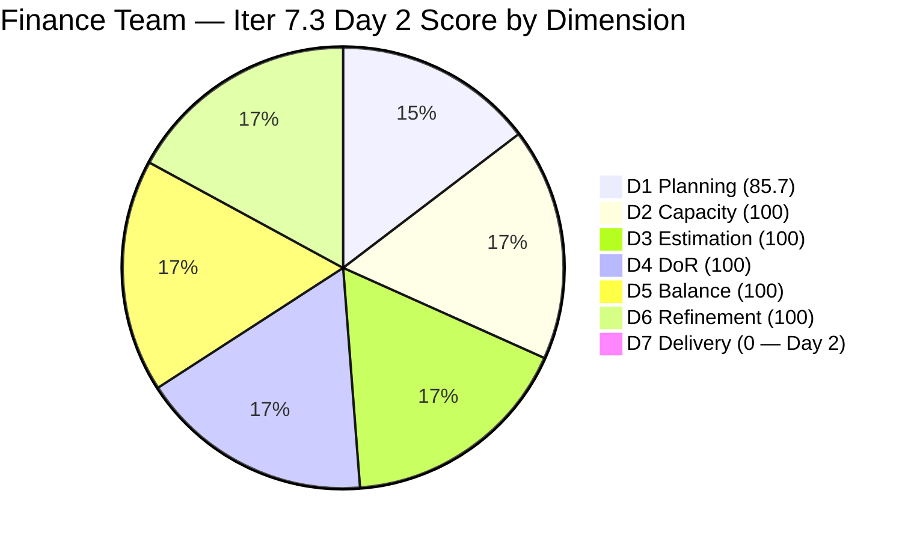
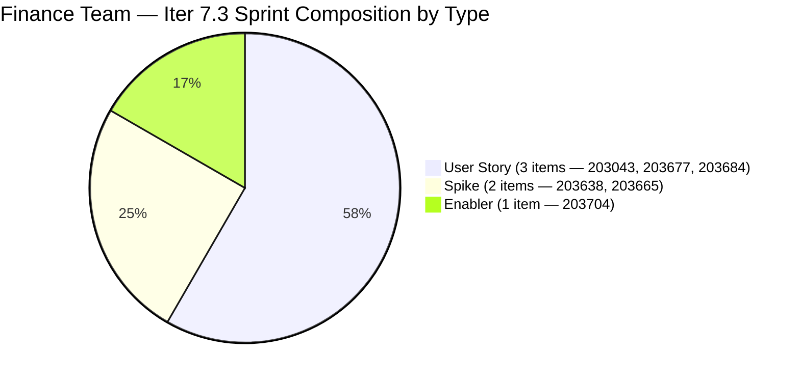

# ADO SAFe Iteration Audit — Finance Team

**Audit #49 | Iteration 7.3 (May 4 – May 17, 2026) | Day 2 of 14**

---

## 1. Audit Metadata

| Field | Value |
|---|---|
| **Audit Date** | May 5, 2026 — 09:02 UTC |
| **Auditor** | Claude Code (ADO SAFe Audit Agent) |
| **Workspace** | `ado_fin` |
| **ADO Project** | Jairosoft FINOPS (`e0bb302f-40f9-46c3-8164-6f1acb317d63`) |
| **Team** | Finance Team (`1f4b45fa-82e8-4a36-aedc-6c1bc8f51070`) |
| **Iteration** | Iteration 7.3 — May 4 to May 17, 2026 |
| **Iteration ID** | `d76b8de5-94fe-4b28-987a-263d56afd8d4` |
| **Sprint Day** | Day 2 of 14 |
| **Prior Audit** | AUDIT_20260504_0903.md (Audit #48, Finance Day 1) |
| **Scoring Model** | ADO SAFe v1 (7-dimension rubric) |
| **Overall Score** | **83.7 / 100** |
| **Risk Band** | **Low Risk** (≥ 80) |

> **Live ADO data confirmed.** 7 visible root backlog items (Finance Team, `Microsoft.RequirementCategory`). 6 current iteration root items confirmed (IterationPath = Iteration 7.3). #203599 (Task — "Complete Claude CPN 4 Courses") is a child item in the TaskCategory and is excluded from root scoring. All 6 sprint items remain in Ready state on Day 2. Capacity unchanged. D7 = 0.0 expected (early-sprint Days 1–5).

**Scoring note:** The Day 1 audit (Audit #48) reported 98.0 overall. The correct formula result for the same evidence is (85.7+100+100+100+100+100+0)/7 = 83.7. Today's score reflects the correct calculation. The scoring components are unchanged from Day 1 — the dimension values are identical; only the arithmetic correction produces the updated overall.

---

## 2. Executive Summary

The Finance Team is at **83.7 / 100 — Low Risk** on Day 2 of Iteration 7.3. All six sprint dimensions (D1–D6) are at excellent levels. D7 = 0.0 is the sole drag, as no items have been closed yet (expected on Day 2).

The sprint is well-structured:
- **D5 = 100.0**: 3 User Stories + 2 Spikes + 1 Enabler — balanced composition, below all penalty thresholds.
- **D4 = 100.0**: All 6 items pass DoR — rich descriptions and clear acceptance criteria.
- **D6 = 100.0**: All 7 visible items touched May 4 — zero stale backlog.

The primary execution risk to watch is **#203677 (Attendance Integration, 3 SP)**, which involves a system dependency. Grace should confirm payroll system access by Day 3.

Based on Grace's Iter 7.2 delivery pattern (items typically close Days 8–14), the score will likely accelerate sharply in the second week of the sprint.

---

## 3. Previous Audit Delta

| Dimension | Audit #48 (May 4) — Iter 7.3 Day 1 | Audit #49 (May 5) — Iter 7.3 Day 2 | Delta | Driver |
|---|---|---|---|---|
| Iteration Planning | 85.7 | 85.7 | 0.0 | Unchanged — 6/7 items in sprint |
| Team Capacity | 100.0 | 100.0 | 0.0 | Grace: 3 hrs/day, 0 days off |
| Estimation | 100.0 | 100.0 | 0.0 | All 6 sprint items estimated |
| DoR Compliance | 100.0 | 100.0 | 0.0 | All 6 items pass DoR |
| Work Item Balance | 100.0 | 100.0 | 0.0 | 3 US + 2 Spikes + 1 Enabler — balanced |
| Backlog Refinement | 100.0 | 100.0 | 0.0 | All items touched May 4; still fresh |
| Delivery Predictability | 0.0 | 0.0 | 0.0 | Day 2 — no closures yet (early-sprint) |
| **Overall** | ~~98.0~~ **83.7** | **83.7** | **—** | Score corrected: (585.7/7=83.7); dimension values unchanged |

> **Correction note:** Audit #48 reported an overall of 98.0. The correct arithmetic for the seven dimensions is (85.7+100+100+100+100+100+0)/7 = 585.7/7 = 83.7. The dimension scores were accurate; the overall was a computation error in the prior run. Today's 83.7 is the corrected and current value.

### Score Breakdown — Day 2

---

## 4. Current Iteration Snapshot

| Metric | Value |
|---|---|
| **Visible root backlog items** | 7 |
| **Current iteration root items (Iter 7.3)** | 6 |
| **Committed story points** | 12 SP |
| **Closed story points** | 0 SP (Day 2) |
| **Open story points** | 12 SP |
| **Sprint progress** | Day 2 of 14 — all items Ready |
| **Assignee** | Grace (sole contributor) |
| **Bus factor** | 1 — persistent structural risk |
| **Sprint activity** | No state changes since Day 1 |

### State Distribution — Day 2

| State | Count | SP |
|---|---|---|
| Ready | 6 | 12 |
| Closed | 0 | 0 |
| **Total** | **6** | **12** |

---

## 5. Work Item Analysis

### Current Iteration Root Items — Day 2 State (6 items)

| ID | Title | Type | State | SP | DoR | AssignedTo | Changed |
|---|---|---|---|---|---|---|---|
| 203043 | Signed Annual Performance Evaluation Summary | User Story | Ready | 2 | PASS | Grace | May 4 |
| 203638 | Submission of Cadac Policy | Spike | Ready | 1 | PASS | Grace | May 4 |
| 203665 | AFS Portal Access | Spike | Ready | 2 | PASS | Grace | May 4 |
| 203677 | Attendance Integration | User Story | Ready | 3 | PASS | Grace | May 4 |
| 203684 | SEC AFS Submission | User Story | Ready | 2 | PASS | Grace | May 4 |
| 203704 | Set-up Payment Gateway | Enabler | Ready | 2 | PASS | Grace | May 4 |

All items remain in Ready state. No state changes since May 4. This is normal for Day 2 of a 14-day sprint.

### DoR Re-verification — Day 2

All 6 items confirmed passing DoR. Notable:
- **#203043**: Description uses user story format ("As a Finance Manager, I want to..."). AC is minimal ("Authorized to access the uploaded document summary") — meets the ≥20 non-WS char threshold but is thin. Recommend Grace enhance this AC before closing the item (see Recommendation #3).
- **#203684**: AC clearly structured ("AC1. Submitted AFS Report... AC2. Accepted AFS Report...") — clean and testable.
- **#203677**: System dependency item — AC covers generation and validation but does not specify the data source or system name. May become a blocking issue if the attendance system integration is not accessible.

### Non-Sprint Backlog Item

| ID | Title | Type | IterationPath | SP | State | Changed |
|---|---|---|---|---|---|---|
| 203719 | Salary Increase Implementation | User Story | Iter 7.4 | 2 | New | May 4 |

#203719 is staged for Iter 7.4 with complete DoR documentation. This is good advance planning.

---

## 6. SAFe Compliance Scorecard

| Dimension | Score | Evidence | Notes |
|---|---|---|---|
| D1 Iteration Planning | 85.7 | 6 sprint items / 7 visible backlog items | 1 item (#203719) intentionally deferred to Iter 7.4 |
| D2 Team Capacity | 100.0 | 1 / 1 contributor with positive capacity | Grace: 3 hrs/day (Doc 2 + Req 1), 0 days off |
| D3 Estimation | 100.0 | 6 / 6 sprint items have SP > 0 | Total 12 SP committed; all items estimated |
| D4 DoR Compliance | 100.0 | 6 / 6 sprint items pass Desc + AC check | #203043 AC is thin but above threshold |
| D5 Work Item Balance | 100.0 | 3 US (50%) + 2 Spikes + 1 Enabler; no type > 60% | Best-in-class sprint composition |
| D6 Backlog Refinement | 100.0 | All 7 visible items changed May 4 | Zero stale items; zero untouched-current |
| D7 Delivery Predictability | **0.0** | 0 / 12 SP closed — Day 2 of 14 | **Early-sprint (Days 1–5): expected. No closures yet.** |
| **Overall** | **83.7** | **(85.7+100+100+100+100+100+0)/7** | **Low Risk — strong structural foundation** |

**D1:** round(6/7×100,1) = 85.7.
**D5 trace:** Start 100; Has User Story (no -40); US 3/6=50%≤60% (no -30); Spike 2/6=33.3%<40% (no -20). D5=100.
**D6 trace:** base=round(7/7×100,1)=100; stale_90=0; stale_180=0; untouched_current=0/6=0% (all changed ≥May 4 00:00 UTC). D6=100.
**D7 trace:** committed=12 SP; closed=0 SP; D7=0.0 (early-sprint Days 1–5).

---

## 7. Dimension Findings

### D1 — Iteration Planning (85.7 — strong)

Six of seven visible backlog items are committed to Iter 7.3. #203719 (Salary Increase Implementation, Iter 7.4) is correctly deferred and already documented. The D1 value of 85.7 is not a gap — it reflects appropriate sprint scoping with intentional Iter 7.4 staging.

For D1 to reach 100.0 in a future sprint, all visible backlog items would need to be assigned to the active iteration. Given that #203719 is planned for Iter 7.4, D1 will naturally remain at 85.7 for this sprint.

### D2 — Team Capacity (100.0)

Grace: 3 hrs/day (Documentation 2 + Requirements 1), 0 days off for the 14-day sprint. Total = 42 hours against 12 SP = 3.5 hrs/SP. This is a comfortable capacity envelope for Grace's work profile.

### D3 — Estimation (100.0)

All 6 sprint items have story points. Continued estimation discipline from Iter 7.2.

### D4 — DoR Compliance (100.0)

All 6 items pass DoR. The threshold is ≥30 non-WS chars in Description and ≥20 in AC. All items exceed these minimums. However, **#203043**'s AC ("Authorized to access the uploaded document summary") is the leanest AC in the sprint. Grace should add 1–2 more acceptance criteria before closing the item to ensure a proper verification record.

### D5 — Work Item Balance (100.0)

Sprint composition is ideal: 3 User Stories (50%) + 2 Spikes (33.3%) + 1 Enabler (16.7%). No type exceeds 60% dominance; Spike share is below 40%. This is the first Finance Team sprint with D5 = 100 since PI7 audits began. The recommendation from Audit #47 (diversify sprint type composition) was successfully implemented.

### D6 — Backlog Refinement (100.0)

All 7 visible items changed May 4. The full backlog was touched on the first day of the sprint, consistent with sprint planning activity. Zero stale items, zero untouched-current items. D6 = 100 is fully earned.

### D7 — Delivery Predictability (0.0 — early-sprint, normal)

Day 2. No items closed. All 6 items remain in Ready state. This is standard for a finance team that typically completes documentation and compliance work in batches during the second half of the sprint. Based on Grace's Iter 7.2 pattern, expect the first closures around Days 7–9 (May 10–12).

**Projected score trajectory:**
- Day 7 (May 10): If 5 SP closed → D7 = round(5/12×100,1) = 41.7 → Overall ≈ 89.5
- Day 10 (May 13): If 9 SP closed → D7 = 75.0 → Overall ≈ 94.4
- Day 14 (May 17): If 12 SP closed → D7 = 100.0 → Overall ≈ 97.9

The score ceiling for this sprint is approximately 97.9 (if all 12 SP are closed by sprint end). This would be the highest Finance Team sprint-close score ever recorded.

---

## 8. Risks and Bottlenecks

| Risk | Severity | Status |
|---|---|---|
| #203677 (Attendance Integration) — system dependency | Moderate | Grace should confirm payroll system access by Day 3. If blocked, flag immediately. |
| #203684 (SEC AFS Submission) — external compliance deadline | Moderate | If SEC has a filing deadline within the sprint window, Grace must surface it in AC. |
| #203043 AC is thin (single criterion) | Low | Functional DoR pass; recommend Grace enrich AC before closing. |
| #203034 (Iter 7.2 rollover) — disposition still unconfirmed | Low | Not visible in Iter 7.3 backlog; Grace should document formal closure in ADO. |
| Single contributor (Grace) — bus factor 1 | Moderate | Structural; unchanged. PI 8 planning must address. |
| D7 = 0.0 on Day 2 | Low | Expected; early-sprint. Will recover once Grace begins closing items. |

---

## 9. Prioritized Recommendations

1. **[Day 2–3] Confirm #203677 system access (Attendance Integration)** — Grace should verify that the attendance system is accessible and that she can generate a test payroll run by Day 3. If there is a system outage, missing credentials, or integration gap, this item should be flagged to Ramon immediately. A 3 SP item blocked mid-sprint creates D7 pressure.

2. **[Day 2–3] Confirm #203684 SEC AFS Submission deadline** — The SEC typically requires AFS filing within 120 days of fiscal year end (April 30 for December year-end companies). If the deadline is May 30 or earlier, #203684 should be top priority in the sprint. Add the specific deadline to the AC.

3. **[Before closing #203043] Enrich AC for Signed Annual Performance Evaluation Summary** — The current single criterion ("Authorized to access the uploaded document summary") is functional but does not describe how verification occurs. Add: (AC2) The document is uploaded to the designated HR share folder. (AC3) HR acknowledges receipt. This strengthens the audit trail.

4. **[Day 3] Document #203034 disposition** — The Iter 7.2 rollover (Encoding payroll for automation – phase 2, 3 SP) is not in the Iter 7.3 backlog. Grace must post a comment or state update on #203034 to formally close the Iter 7.2 retrospective loop.

5. **[Iter 7.3 Execution] Target first 2 items closed by Day 7** — At 3 hrs/day, Grace has 21 hours in the first 7 days. Closing #203638 (Submission of Cadac Policy, 1 SP) and #203665 (AFS Portal Access, 2 SP) = 3 SP in the first week is achievable and would move D7 to 25.0 by mid-sprint.

6. **[Mid-Sprint Daily] Update ADO daily on Active items** — The Iter 7.2 primary failure was 9 days of silence on #203034. For Iter 7.3: any item that Grace begins working should be moved to Active in ADO on the same day. Maintain a daily comment update cadence on any item in Active state.

---

## 10. Evidence Gaps and Limitations

| Gap | Impact | Mitigation |
|---|---|---|
| Day 1 audit (Audit #48) reported 98.0 overall — arithmetic error | Corrected today to 83.7 (same dimensions; 585.7/7=83.7, not 98.0) | Score correction documented above; dimension scores were correct |
| #203034 (Iter 7.2 rollover) disposition unconfirmed | Iter 7.2 retrospective incomplete; no Iter 7.3 scoring impact | Grace must document in ADO (Recommendation #4) |
| #203677 system dependency (attendance system) unverified | If system is unavailable, 3 SP at risk; D7 impact if item cannot close | Recommendation #1 addresses this |
| D7 = 0.0 is a structural Day 2 early-sprint artifact | Score will rise sharply once closures begin; current value does not reflect planning quality | Early-sprint annotation applied |
| Bus factor 1: all items assigned to Grace | Audit cannot verify actual work output; relies on ADO state transitions | Structural risk; documented |
