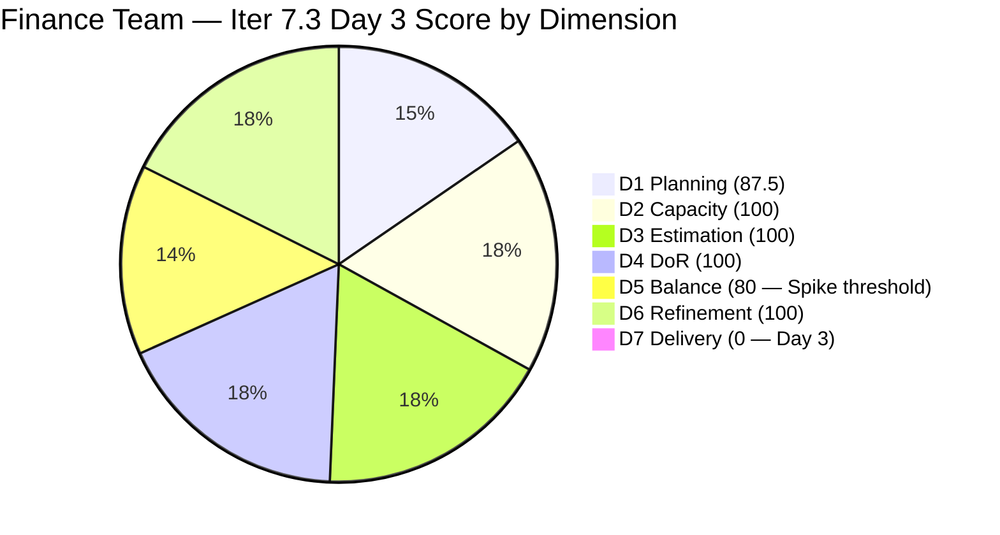
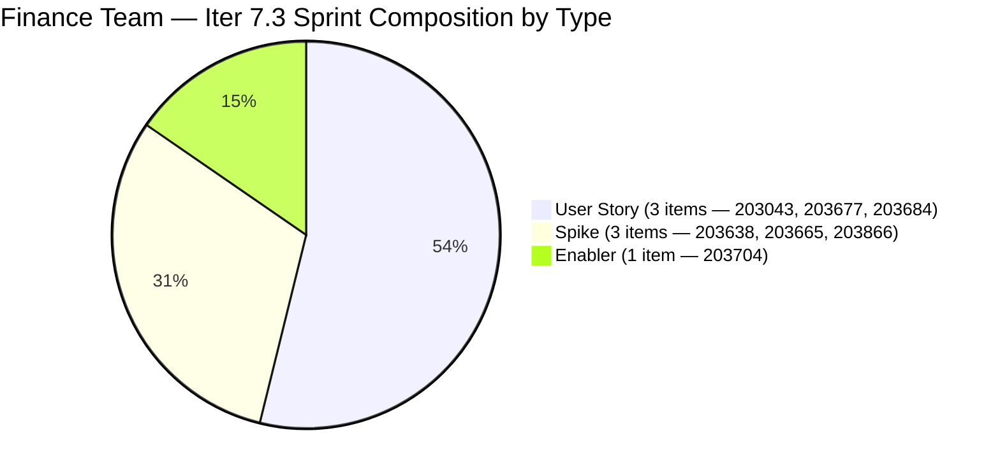
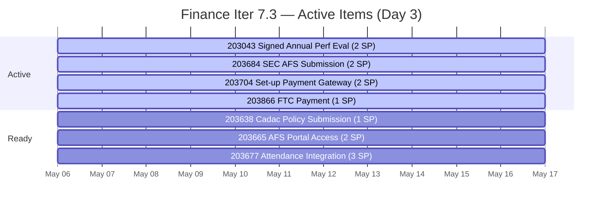

# ADO SAFe Iteration Audit — Finance Team

**Audit #50 | Iteration 7.3 (May 4 – May 17, 2026) | Day 3 of 14**

---

## 1. Audit Metadata

| Field | Value |
|---|---|
| **Audit Date** | May 6, 2026 — 09:01 UTC |
| **Auditor** | Claude Code (ADO SAFe Audit Agent) |
| **Workspace** | `ado_fin` |
| **ADO Project** | Jairosoft FINOPS (`e0bb302f-40f9-46c3-8164-6f1acb317d63`) |
| **Team** | Finance Team (`1f4b45fa-82e8-4a36-aedc-6c1bc8f51070`) |
| **Iteration** | Iteration 7.3 — May 4 to May 17, 2026 |
| **Iteration ID** | `d76b8de5-94fe-4b28-987a-263d56afd8d4` |
| **Sprint Day** | Day 3 of 14 |
| **Prior Audit** | AUDIT_20260505_0902.md (Audit #49, Finance Day 2) |
| **Scoring Model** | ADO SAFe v1 (7-dimension rubric) |
| **Overall Score** | **81.1 / 100** |
| **Risk Band** | **Low Risk** (≥ 80) |

> **Live ADO data confirmed.** 8 visible root backlog items (Finance Team, `Microsoft.RequirementCategory`). 7 current iteration root items confirmed (IterationPath = Iteration 7.3). #203719 (User Story — "Salary Increase Implementation") is staged for Iter 7.4 and excluded from sprint scoring. New sprint item: #203866 (Spike — "FTC Payment- 3 invoices overdue", 1 SP) added to Iter 7.3 since Day 2. Spike share is now 3/7 = 42.9% > 40%, triggering D5 -20 penalty. D7 = 0.0 expected (early-sprint Days 1–5). Grace: 3 hrs/day, 0 days off.

---

## 2. Executive Summary

Finance Team is at **81.1 / 100 — Low Risk** on Day 3 of Iteration 7.3. Six of seven dimensions are at excellent levels. D5 dropped from 100 to 80 due to a new Spike item (#203866) pushing the Spike share to 42.9%, just above the 40% threshold. D7 remains 0.0 as expected for early sprint.

Positive developments since Day 2:
- **4 items moved to Active** (203043, 203684, 203704, 203866) — Grace is engaged and working
- **#203866 added** (FTC Payment collections — 3 overdue invoices, 1 SP) — captures an urgent revenue recovery task
- **Committed SP = 13** (up from 12) with all items estimated

The primary structural concern this sprint is the Spike share threshold breach. The sprint now carries 3 Spikes (42.9%), 3 User Stories (42.9%), and 1 Enabler (14.3%). If Grace can close #203638 (Cadac Policy Submission, 1 SP) as the first delivery and shift the sprint composition, D5 recovers. The first D7 contribution is expected by Days 7–9.

---

## 3. Previous Audit Delta

| Dimension | Audit #49 (May 5) — Day 2 | Audit #50 (May 6) — Day 3 | Delta | Driver |
|---|---|---|---|---|
| Iteration Planning | 87.5 | 87.5 | 0.0 | 7/8 sprint items (203866 added, 203719 still Iter 7.4) |
| Team Capacity | 100.0 | 100.0 | 0.0 | Grace: 3 hrs/day, 0 days off |
| Estimation | 100.0 | 100.0 | 0.0 | All 7 sprint items have SP |
| DoR Compliance | 100.0 | 100.0 | 0.0 | All 7 items pass DoR |
| Work Item Balance | 100.0 | **80.0** | **-20.0** | #203866 (Spike) added → Spike share 3/7=42.9% > 40% threshold |
| Backlog Refinement | 100.0 | 100.0 | 0.0 | All 8 backlog items freshly updated |
| Delivery Predictability | 0.0 | 0.0 | 0.0 | Day 3 — no closures yet (early-sprint) |
| **Overall** | **83.7** | **81.1** | **-2.6** | D5 penalty: Spike share breach. (87.5+100+100+100+80+100+0)/7 |

> **Note on prior audit score:** Audit #48 (Day 1) originally reported 98.0 overall — an arithmetic error. Audit #49 corrected this to 83.7. Audit #49 reported D1=85.7 based on 6/7 items. Today #203866 entered the backlog API, making the denominator 8 and numerator 7: D1 = round(7/8×100,1) = 87.5. Slight D1 improvement offsets some of the D5 drop.

### Score Breakdown — Day 3

---

## 4. Current Iteration Snapshot

| Metric | Value |
|---|---|
| **Visible root backlog items** | 8 |
| **Current iteration root items (Iter 7.3)** | 7 |
| **Committed story points** | 13 SP |
| **Closed story points** | 0 SP (Day 3) |
| **Open story points** | 13 SP |
| **Sprint progress** | Day 3 of 14 — 4 items Active, 3 Ready |
| **Assignee** | Grace (sole contributor) |
| **Bus factor** | 1 — persistent structural risk |
| **New item since Day 2** | #203866 (FTC Payment collections — Spike, 1 SP, Active) |

### State Distribution — Day 3

| State | Count | SP |
|---|---|---|
| Active | 4 | 6 |
| Ready | 3 | 7 |
| Closed | 0 | 0 |
| **Total** | **7** | **13** |

### Active Items Progress — Day 3

---

## 5. Work Item Analysis

### Current Iteration Root Items — Day 3 State (7 items)

| ID | Title | Type | State | SP | DoR | AssignedTo | Changed |
|---|---|---|---|---|---|---|---|
| 203043 | Signed Annual Performance Evaluation Summary | User Story | **Active** | 2 | PASS | Grace | May 6 |
| 203638 | Submission of Cadac Policy and Program Plan with Budgets | Spike | Ready | 1 | PASS | Grace | May 6 |
| 203665 | AFS Portal Access | Spike | **Active** | 2 | PASS | Grace | May 5 |
| 203677 | Attendance Integration | User Story | Ready | 3 | PASS | Grace | May 4 |
| 203684 | SEC AFS Submission | User Story | **Active** | 2 | PASS | Grace | May 6 |
| 203704 | Set-up Payment Gateway | Enabler | **Active** | 2 | PASS | Grace | May 6 |
| 203866 | FTC Payment- 3 invoices overdue | Spike | **Active** | 1 | PASS | Grace | May 6 |

Changes from Day 2:
- **#203043** moved Ready → Active (May 6 12:41 UTC)
- **#203684** moved Ready → Active (May 6 12:45 UTC)
- **#203704** moved Ready → Active (May 6 12:42 UTC)
- **#203866** new item added, entered directly as Active (May 6 12:44 UTC)
- **#203665** was already Active as of Day 2 (May 5 13:08 UTC)

### DoR Re-verification — Day 3

All 7 items confirmed passing DoR (Desc ≥30 non-WS chars + AC ≥20 non-WS chars):

| ID | Desc ✓ | AC ✓ | Notes |
|---|---|---|---|
| 203043 | ✓ | ✓ | AC thin (single criterion) — functional pass |
| 203638 | ✓ | ✓ | AC1+AC2 — clean |
| 203665 | ✓ | ✓ | AC1+AC2 — clean |
| 203677 | ✓ | ✓ | System dependency noted |
| 203684 | ✓ | ✓ | AC1+AC2 — clean, testable |
| 203704 | ✓ | ✓ | AC1+AC2 — clean |
| 203866 | ✓ | ✓ | AC thin ("Feedback from Matt / Payment from Matt") — functional pass |

### Non-Sprint Backlog Item

| ID | Title | Type | IterationPath | SP | State | Changed |
|---|---|---|---|---|---|---|
| 203719 | Salary Increase Implementation | User Story | Iter 7.4 | 2 | New | May 4 |

#203719 remains correctly staged for Iter 7.4 with complete DoR documentation.

---

## 6. SAFe Compliance Scorecard

| Dimension | Score | Evidence | Notes |
|---|---|---|---|
| D1 Iteration Planning | 87.5 | 7 sprint items / 8 visible backlog items | #203719 deferred to Iter 7.4; #203866 new → improved from 85.7 |
| D2 Team Capacity | 100.0 | 1 / 1 contributor with positive capacity | Grace: 3 hrs/day (Doc 2 + Req 1), 0 days off |
| D3 Estimation | 100.0 | 7 / 7 sprint items have SP > 0 | Total 13 SP committed; all items estimated |
| D4 DoR Compliance | 100.0 | 7 / 7 sprint items pass Desc + AC check | #203043 and #203866 AC thin but above threshold |
| D5 Work Item Balance | **80.0** | 3 US (42.9%) + 3 Spikes (42.9%) + 1 Enabler (14.3%) | Spike share 42.9% > 40% threshold → **-20 penalty** |
| D6 Backlog Refinement | 100.0 | All 8 visible items changed May 4–6 | Zero stale items; all items active recently |
| D7 Delivery Predictability | **0.0** | 0 / 13 SP closed — Day 3 of 14 | **Early-sprint (Days 1–5): expected. No closures yet.** |
| **Overall** | **81.1** | **(87.5+100+100+100+80+100+0)/7** | **Low Risk — strong execution engagement, Spike mix concern** |

**D1 trace:** round(7/8×100,1) = 87.5.
**D5 trace:** Start 100; Has User Story (no -40); dominant type = 42.9% ≤ 60% (no -30); Spike 3/7=42.9% > 40% → **-20**. D5=80.
**D6 trace:** base=round(8/8×100,1)=100; stale_90=0 (all changed ≤2 days ago); stale_180=0; untouched_current=0/7 (all changed ≥May 4). D6=100.
**D7 trace:** committed=13 SP; closed=0 SP; Day 3 (early-sprint). D7=0.0.

---

## 7. Dimension Findings

### D1 — Iteration Planning (87.5 — strong, improved from 85.7)

Seven of eight visible backlog items are committed to Iter 7.3. The addition of #203866 (FTC Payment collections) increases the denominator from 7→8 while also adding a sprint item, keeping D1 high at 87.5. #203719 (Salary Increase Implementation, Iter 7.4) is correctly deferred. D1 at 87.5 reflects good sprint scoping with appropriate future-sprint staging.

### D2 — Team Capacity (100.0)

Grace: 3 hrs/day (Documentation 2 + Requirements 1), 0 days off for the 14-day sprint. Total = 42 hours against 13 SP = 3.2 hrs/SP. Capacity envelope remains comfortable.

### D3 — Estimation (100.0)

All 7 sprint items have story points. #203866 entered the sprint with 1 SP already set — good estimation discipline on item creation.

### D4 — DoR Compliance (100.0)

All 7 items pass DoR. Two items have thin acceptance criteria:
- **#203043** ("Authorized to access the uploaded document summary") — single criterion, functional but narrow.
- **#203866** ("AC1. Feedback from Matt / AC2. Payment from Matt") — passes the ≥20 non-WS threshold but does not define what constitutes acceptable feedback, the payment method, or the timeframe. Grace should enrich this before closing.

### D5 — Work Item Balance (80.0 — Spike threshold breach)

Sprint now has 3 Spikes (203638, 203665, 203866) = 42.9% of 7 items. The 40% Spike threshold was breached when #203866 was added. Recovery options:
1. **Close #203638 (Cadac Policy, 1 SP) this week** — reduces Spike count to 2/6 = 33.3% → D5 returns to 100 after that closure
2. **No action needed immediately** — D5 at 80 is still well above the Moderate Risk threshold

This is the first D5 penalty for Finance since PI7 audits began (prior sprints had D5=70 from US-dominated composition). The 80 score reflects good type diversity overall despite the threshold breach.

### D6 — Backlog Refinement (100.0)

All 8 visible items changed between May 4 and May 6. Zero stale items. Grace's active engagement on May 6 (4 items updated) demonstrates strong sprint day hygiene. D6 = 100 fully earned.

### D7 — Delivery Predictability (0.0 — early-sprint, normal)

Day 3. No items closed. 4 items are Active with 7 SP combined. Based on Grace's Iter 7.2 pattern, first closures are expected around Days 7–9 (May 10–12).

**Projected score trajectory:**
- Day 7 (May 10): If 5 SP closed → D7 = round(5/13×100,1) = 38.5 → Overall ≈ 87.9
- Day 10 (May 13): If 9 SP closed → D7 = 69.2 → Overall ≈ 92.5
- Day 14 (May 17): If 13 SP closed → D7 = 100.0 → Overall ≈ 95.4

The score ceiling for this sprint is approximately 95.4 (all 13 SP closed, D5 stays at 80 unless composition changes). If Grace closes a Spike this sprint, D5 may recover to 100 and push the ceiling to ~97.9.

---

## 8. Risks and Bottlenecks

| Risk | Severity | Status |
|---|---|---|
| Spike share 42.9% > 40% (D5 -20 penalty) | Low-Moderate | D5=80; recovers if any Spike closes or is removed. Monitor. |
| #203866 AC thin ("Feedback from Matt") | Low | Passes DoR threshold; Grace should define acceptance terms before closing |
| #203677 (Attendance Integration) — system dependency unresolved | Moderate | Still in Ready state Day 3. Grace should confirm payroll system access today. |
| #203684 (SEC AFS Submission) — external compliance deadline | Moderate | Now Active (May 6). SEC AFS deadline must be captured in AC. |
| #203043 AC thin (single criterion) | Low | Grace should enrich before closing |
| #203034 (Iter 7.2 rollover) disposition unconfirmed | Low | Not in Iter 7.3; formal closure in ADO still pending |
| Single contributor (Grace) — bus factor 1 | Moderate | Structural; 4 items Active on Day 3 indicates engagement but risk unchanged |
| D7 = 0.0 on Day 3 | Low | Expected early-sprint; will recover once first closures begin |

---

## 9. Prioritized Recommendations

1. **[Day 3 — Immediate] Confirm #203677 system access (Attendance Integration)** — Still in Ready on Day 3. Grace must verify attendance system access today. If payroll system integration has a dependency on IT, escalate to Ramon. A 3 SP item that cannot begin execution by Day 5 is a D7 risk.

2. **[Day 3] Add SEC AFS deadline to #203684 AC** — Item is now Active. The acceptance criteria should explicitly include the SEC filing deadline date and confirmation of submission tracking number. Add: "AC3. Filed by [date] — prior to SEC deadline."

3. **[Before closing #203866] Enrich AC for FTC Payment** — "Feedback from Matt" and "Payment from Matt" are not verifiable criteria. Replace with: "AC1. Written confirmation from Matt acknowledging the 3 overdue invoices. AC2. Payment received for invoice [numbers]. AC3. Invoices marked as settled in the finance ledger."

4. **[Day 5 target] Close #203638 (Cadac Policy Submission, 1 SP)** — This is the lowest-effort Spike (1 SP). Closing it reduces Spike share from 3/7=42.9% to 2/6=33.3%, recovering D5 to 100. It also provides the first D7 contribution (1/13 = 7.7%) and signals sprint momentum.

5. **[Ongoing] Maintain daily ADO updates on Active items** — Grace moved 4 items to Active on Day 3. The Iter 7.2 primary failure was 9 days of silence on an Active item (#203034). For Iter 7.3: any item Active for more than 24 hours must have a same-day comment update.

6. **[Before closing #203043] Enrich AC for Signed Annual Performance Evaluation Summary** — Add: "AC2. Document uploaded to designated HR share folder. AC3. HR acknowledges receipt." Strengthens the audit trail for this compliance item.

---

## 10. Evidence Gaps and Limitations

| Gap | Impact | Mitigation |
|---|---|---|
| #203866 AC thin ("Feedback from Matt / Payment from Matt") | Passes DoR threshold; closure verification may be subjective | Grace must enrich AC before closing (Recommendation #3) |
| #203677 Attendance Integration — system dependency unverified Day 3 | 3 SP potentially blocked; no D7 contribution if unresolved | Recommendation #1 addresses this |
| #203034 (Iter 7.2 rollover) disposition unconfirmed | Iter 7.2 retrospective incomplete | Grace must document in ADO |
| D7 = 0.0 early-sprint artifact | Score will rise sharply after Day 7; current value underrepresents planning quality | Early-sprint annotation applied |
| Bus factor 1 (Grace) | Cannot verify work output; relies on ADO state transitions | Structural risk; documented persistently |
