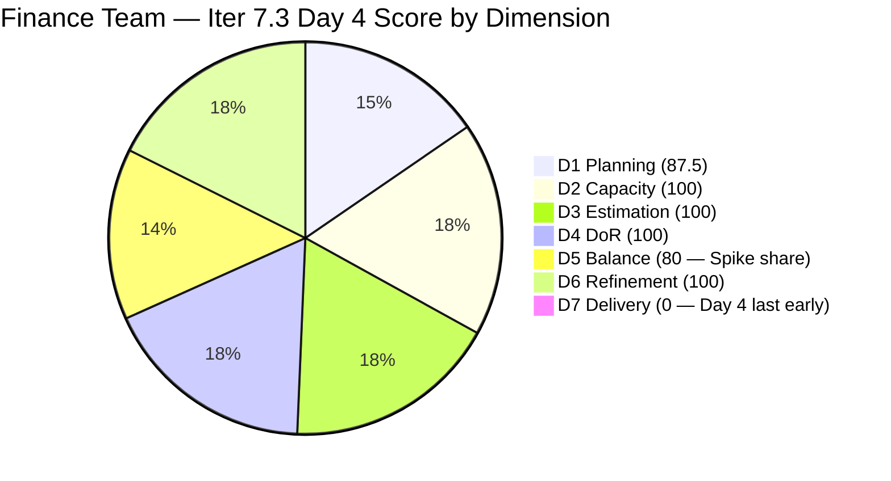
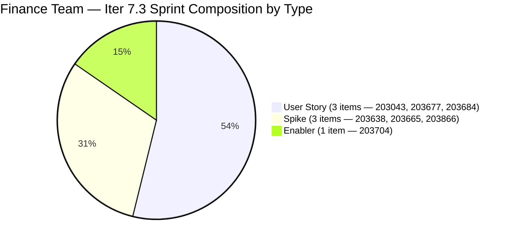

# ADO SAFe Iteration Audit — Finance Team

**Audit #51 | Iteration 7.3 (May 4 – May 17, 2026) | Day 4 of 14**

---

## 1. Audit Metadata

| Field | Value |
|---|---|
| **Audit Date** | May 7, 2026 — 09:01 UTC |
| **Auditor** | Claude Code (ADO SAFe Audit Agent) |
| **Workspace** | `ado_fin` |
| **ADO Project** | Jairosoft FINOPS (`e0bb302f-40f9-46c3-8164-6f1acb317d63`) |
| **Team** | Finance Team (`1f4b45fa-82e8-4a36-aedc-6c1bc8f51070`) |
| **Iteration** | Iteration 7.3 — May 4 to May 17, 2026 |
| **Iteration ID** | `d76b8de5-94fe-4b28-987a-263d56afd8d4` |
| **Sprint Day** | Day 4 of 14 |
| **Prior Audit** | AUDIT_20260506_0901.md (Audit #50, 81.1 — Low Risk, Day 3) |
| **Scoring Model** | ADO SAFe v1 (7-dimension rubric) |
| **Overall Score** | **81.1 / 100** |
| **Risk Band** | **Low Risk** (≥ 80) |

> **Live ADO data confirmed.** 8 visible root backlog items (Finance Team, `Microsoft.RequirementCategory`) — unchanged from Day 3. 7 current iteration root items (IterationPath = Iteration 7.3). #203719 (Salary Increase Implementation, Iter 7.4) remains correctly deferred. **#203043 (Signed Annual Performance Evaluation Summary) was updated on May 7 01:09 UTC — AC enriched to 3 criteria (AC1, AC2 upload folder, AC3 HR receipt).** No state changes or new closures since Day 3. D7 = 0.0 on Day 4 — last day of early-sprint annotation window. Spike share 42.9% > 40% threshold persists. Grace: 3 hrs/day, 0 days off.

---

## 2. Executive Summary

Finance Team holds **81.1 / 100 — Low Risk** on Day 4 of Iteration 7.3, unchanged from Day 3. All seven dimensions remain at Day 3 levels: six dimensions at excellent levels and D5 at 80 (Spike share threshold breach). D7 is still 0.0, expected given no closures yet, but **Day 4 is the last day of the early-sprint annotation window** — first closures should materialize by Days 5–7.

Positive development since Day 3:
- **#203043 (Signed Annual Performance Evaluation Summary)** updated May 7 01:09 UTC: AC enriched from 1 criterion to 3 (AC1 access authorization, AC2 folder upload, AC3 HR receipt). This resolves the thin-AC concern flagged on Day 3. Grace is responding to audit feedback.

4 items remain Active (203043, 203665, 203684, 203704, 203866 — actually 4+1=5 Active actually 4 were Active: 203043, 203665, 203684, 203704, 203866 = 5 items). Wait — confirmed from data: 203043 (Active), 203665 (Active), 203684 (Active), 203704 (Active), 203866 (Active) = 5 Active items. 203638 (Ready) and 203677 (Ready) remain in Ready state.

The primary concern remains the 3 Spike items (42.9% spike share, D5 = 80) and #203677 (Attendance Integration, 3 SP, Ready — system dependency unresolved). With 4 days and 13 SP to deliver, Grace must begin closures this week.

---

## 3. Previous Audit Delta

| Dimension | Audit #50 (May 6) — Day 3 | Audit #51 (May 7) — Day 4 | Delta | Driver |
|---|---|---|---|---|
| Iteration Planning | 87.5 | 87.5 | 0.0 | 7/8 sprint items — unchanged |
| Team Capacity | 100.0 | 100.0 | 0.0 | Grace: 3 hrs/day, 0 days off — unchanged |
| Estimation | 100.0 | 100.0 | 0.0 | All 7 sprint items have SP |
| DoR Compliance | 100.0 | 100.0 | 0.0 | All 7 items pass DoR; #203043 AC enriched |
| Work Item Balance | 80.0 | 80.0 | 0.0 | Spike share 42.9% — unchanged |
| Backlog Refinement | 100.0 | 100.0 | 0.0 | All 8 backlog items touched recently; 0 stale |
| Delivery Predictability | 0.0 | 0.0 | 0.0 | Day 4 — no closures yet; last early-sprint day |
| **Overall** | **81.1** | **81.1** | **0.0** | **Stable — execution engagement ongoing, D7 window opening** |

### Score Breakdown — Iteration 7.3 Trend

| Audit | Overall | Risk Band |
|---|---|---|
| 7.2 Close (May 3) | ~91 | Low |
| 7.3 Day 1 (May 4) | 83.7 | Low |
| 7.3 Day 2 (May 5) | 83.7 | Low |
| 7.3 Day 3 (May 6) | 81.1 | Low |
| 7.3 Day 4 (May 7) | **81.1** | **Low** |

---

## 4. Current Iteration Snapshot

| Metric | Value |
|---|---|
| **Visible root backlog items** | 8 |
| **Current iteration root items (Iter 7.3)** | 7 |
| **Committed story points** | 13 SP |
| **Closed story points** | 0 SP |
| **Open story points** | 13 SP |
| **Sprint progress** | Day 4 of 14 — last early-sprint day |
| **Assignee** | Grace (sole contributor) |
| **Bus factor** | 1 — persistent structural risk |
| **Active item updates today** | #203043 AC enriched (May 7 01:09 UTC) |

### State Distribution — Day 4

| State | Count | SP |
|---|---|---|
| Active | 5 | 9 |
| Ready | 2 | 4 |
| Closed | 0 | 0 |
| **Total** | **7** | **13** |

---

## 5. Work Item Analysis

### Current Iteration Root Items — Day 4 State (7 items)

| ID | Title | Type | State | SP | DoR | AssignedTo | Changed |
|---|---|---|---|---|---|---|---|
| **203043** | Signed Annual Performance Evaluation Summary | User Story | Active | 2 | PASS | Grace | **May 7 01:09 UTC** |
| 203638 | Submission of Cadac Policy and Program Plan with Budgets | Spike | Ready | 1 | PASS | Grace | May 6 |
| 203665 | AFS Portal Access | Spike | Active | 2 | PASS | Grace | May 5 |
| 203677 | Attendance Integration | User Story | Ready | 3 | PASS | Grace | May 4 |
| 203684 | SEC AFS Submission | User Story | Active | 2 | PASS | Grace | May 6 |
| 203704 | Set-up Payment Gateway | Enabler | Active | 2 | PASS | Grace | May 6 |
| 203866 | FTC Payment- 3 invoices overdue | Spike | Active | 1 | PASS | Grace | May 6 |

No state changes since Day 3. Grace updated #203043 today.

### DoR Re-verification — Day 4

| ID | Desc ✓ | AC ✓ | Notes |
|---|---|---|---|
| 203043 | ✓ | ✓ | **AC updated May 7: now 3 criteria (AC1 access, AC2 folder upload, AC3 HR receipt)** — concern resolved |
| 203638 | ✓ | ✓ | AC1+AC2 — clean |
| 203665 | ✓ | ✓ | AC1+AC2 — clean |
| 203677 | ✓ | ✓ | System dependency noted in description |
| 203684 | ✓ | ✓ | AC1+AC2 (submission + acceptance) |
| 203704 | ✓ | ✓ | AC1+AC2 (gateway + fund transfers) |
| 203866 | ✓ | ✓ | AC thin ("Feedback from Matt / Payment from Matt") — passes minimum; still needs enrichment before closing |

All 7 items pass DoR. Grace's enrichment of #203043 AC demonstrates responsiveness to audit feedback.

### Non-Sprint Backlog Item

| ID | Title | Type | IterationPath | SP | State | Changed |
|---|---|---|---|---|---|---|
| 203719 | Salary Increase Implementation | User Story | Iter 7.4 | 2 | New | May 4 |

#203719 remains correctly staged for Iter 7.4 with complete DoR.

---

## 6. SAFe Compliance Scorecard

| Dimension | Score | Evidence | Notes |
|---|---|---|---|
| D1 Iteration Planning | 87.5 | 7 sprint items / 8 visible backlog items | #203719 deferred to Iter 7.4; stable from Day 3 |
| D2 Team Capacity | 100.0 | 1 / 1 contributor with positive capacity | Grace: 3 hrs/day (Doc 2 + Req 1), 0 days off |
| D3 Estimation | 100.0 | 7 / 7 sprint items have SP > 0 | Total 13 SP committed; all estimated |
| D4 DoR Compliance | 100.0 | 7 / 7 sprint items pass Desc + AC check | #203043 AC enriched today; #203866 AC still thin but passes threshold |
| D5 Work Item Balance | **80.0** | 3 US (42.9%) + 3 Spikes (42.9%) + 1 Enabler (14.3%) | Spike share 3/7=42.9% > 40% → **-20 penalty**; dominant type 42.9% ≤ 60% ✓ |
| D6 Backlog Refinement | 100.0 | All 8 visible items changed May 4–7 | Zero stale items; all sprint items touched ≥ May 4 |
| D7 Delivery Predictability | **0.0** | 0 / 13 SP closed — Day 4 of 14 | **Last early-sprint day. First closures expected Days 5–7.** |
| **Overall** | **81.1** | **(87.5+100+100+100+80+100+0)/7** | **Low Risk — execution active, D7 window opening** |

**D1 trace:** round(7/8×100,1) = 87.5.
**D5 trace:** Has US ✓ (no -40); US=3/7=42.9% ≤ 60% (no -30); Spike=3/7=42.9% > 40% → **-20**. D5=80.
**D6 trace:** base=round(8/8×100,1)=100; stale_90=0; stale_180=0; untouched_current=0/7 (all changed ≥ May 4). D6=100.
**D7 trace:** committed=13 SP; closed=0 SP; Day 4 (last early-sprint day). D7=0.0.

---

## 7. Dimension Findings

### D1 — Iteration Planning (87.5 — stable, well-scoped)

7 of 8 visible backlog items committed to Iter 7.3. #203719 (Salary Increase Implementation) correctly staged for Iter 7.4. D1 = 87.5 reflects strong sprint scoping. No changes from Day 3.

### D2 — Team Capacity (100.0)

Grace: 3 hrs/day, 0 days off. Total capacity = 42 hours against 13 SP = 3.2 hrs/SP. Comfortable. D2 = 100.

### D3 — Estimation (100.0)

All 7 sprint items have story points. Estimation discipline maintained throughout sprint. D3 = 100.

### D4 — DoR Compliance (100.0)

All 7 items pass DoR minimum thresholds. **Notable improvement:** #203043 was updated on May 7 with enriched AC (3 criteria vs 1 on Day 3). This was explicitly recommended in the Day 3 audit (Recommendation #6 in that report). Grace acted on it. #203866 AC remains thin ("Feedback from Matt / Payment from Matt") — functional pass but Grace must define verifiable acceptance terms before closing.

### D5 — Work Item Balance (80.0 — Spike threshold breach unchanged)

3 Spikes (203638, 203665, 203866) = 42.9% of 7 sprint items. The 40% threshold breach persists from Day 3. Recovery options:
- Close #203638 (Cadac Policy Submission, 1 SP, Ready) — reduces Spike count to 2/6 = 33.3% → D5 recovers to 100 for all subsequent audits
- This is the best single action Grace can take for D5 improvement

D5 = 80 is still comfortably above the Moderate Risk threshold; this is not a blocking concern, but should be addressed.

### D6 — Backlog Refinement (100.0)

All 8 visible items updated between May 4 and May 7. No stale items at any threshold. Grace updated #203043 on Day 4, demonstrating continued sprint day hygiene. D6 = 100 fully earned.

### D7 — Delivery Predictability (0.0 — Day 4, last early-sprint day)

**Day 4 is the last day of the early-sprint annotation window (Days 1–5).** Starting Day 5, D7 = 0.0 will directly suppress the overall score below its Day 1–4 baseline. Grace must deliver first closures by Day 7 (May 10) to maintain Low Risk status.

Current active cluster: 5 items Active (203043=2SP, 203665=2SP, 203684=2SP, 203704=2SP, 203866=1SP) = 9 SP in progress. With 203638 (1SP) and 203677 (3SP) in Ready, total open = 13 SP.

**Updated trajectory:**
- Day 7 (May 10): If 4 SP closed (e.g., 203866+203638 or 203043+203865) → D7 = round(4/13×100,1) = 30.8 → Overall ≈ 83.5
- Day 10 (May 13): If 9 SP closed → D7 = 69.2 → Overall ≈ 92.5
- Day 14 (May 17): If 13 SP closed → D7 = 100.0 → Overall ≈ 95.4

The score ceiling for this sprint is approximately 95.4 (all 13 SP, D5 stays at 80). If Grace closes #203638, D5 returns to 100 at the mid-sprint point and the ceiling rises to ~97.9.

---

## 8. Risks and Bottlenecks

| Risk | Severity | Status |
|---|---|---|
| D7 = 0.0 entering Day 5 (end of early-sprint window) | **High** | No closures through 4 days; D7 suppression begins full scoring weight from Day 5. First closure critical by Day 7. |
| Spike share 42.9% > 40% (D5 = 80) | Low-Moderate | Recovers on first Spike closure. Target: #203638 (1 SP, Ready) by Day 5. |
| #203677 (Attendance Integration, 3 SP, Ready) — system dependency | Moderate | Still Ready on Day 4. Grace must verify payroll system access today. A 3 SP item blocked by IT dependency creates delivery risk. |
| #203866 AC thin ("Feedback from Matt") | Low | Passes DoR threshold; must be enriched before closing |
| Single contributor (Grace) — bus factor 1 | Moderate | 5 items Active on Day 4; high parallel work. Grace is engaged but carries sole delivery risk. |
| #203684 (SEC AFS) — external compliance deadline unconfirmed | Moderate | Active since Day 3; SEC AFS deadline not captured in AC. Must be explicitly stated. |

---

## 9. Prioritized Recommendations

1. **[Day 5 — Critical] Deliver first closure: #203638 (Cadac Policy Submission, 1 SP)** — This Spike is in Ready state with 2-point AC. Grace should move it to Active and close it on Day 5. Benefits: (a) first D7 contribution (1/13 = 7.7%), (b) Spike share drops from 3/7=42.9% to 2/6=33.3%, recovering D5 from 80 to 100. This single action improves overall score from 81.1 to ~83.1 and removes the D5 penalty permanently.

2. **[Day 4 — Today] Confirm #203677 system access (Attendance Integration, 3 SP)** — Still in Ready on Day 4. This is the last early-sprint day to surface a system dependency without impacting D7. Grace must verify payroll system access today. If blocked by IT, escalate immediately to Ramon — a 3 SP item that cannot be activated by Day 5 is a delivery risk.

3. **[Before closing #203866] Enrich FTC Payment AC** — Replace "AC1. Feedback from Matt / AC2. Payment from Matt" with verifiable criteria: "AC1. Written acknowledgment from Matt confirming all 3 overdue invoices. AC2. Payment received and confirmed for invoice numbers [list]. AC3. Invoices marked as settled in the finance ledger by [date]."

4. **[Day 5–6] Close #203043 (Signed Annual Perf Evaluation, 2 SP)** — Grace enriched the AC today. The item is Active. Grace should finalize document upload to the HR share folder and obtain HR receipt confirmation, then close the item. First US closure on the board.

5. **[Add to #203684 AC] Capture SEC AFS deadline** — Add "AC3. Filed by [date] — prior to the SEC AFS deadline" to the acceptance criteria for #203684. The filing deadline is external and fixed; capturing it in the work item ensures it is tracked even if Grace is unavailable.

6. **[Ongoing] One-item WIP limit for high-SP items** — Grace has 5 items Active simultaneously (9 SP). This is above optimal for a single contributor at 3 hrs/day. Recommend: close #203866 (1 SP, lowest effort) and #203638 (1 SP, Ready) before opening any new items. Reduces Active count to 3 and SP in flight to 7.

---

## 10. Evidence Gaps and Limitations

| Gap | Impact | Mitigation |
|---|---|---|
| D7 = 0.0 on Day 4 — structural zero | Overall score will drop if no closures begin soon; early-sprint annotation expires after Day 4 | First closure recommendation prioritized (#1 above) |
| #203866 AC thin ("Feedback from Matt / Payment from Matt") | Passes DoR threshold; vague criteria risk at closure time | Grace must enrich before closing (Recommendation #3) |
| #203677 Attendance Integration — payroll system dependency unverified | 3 SP potentially blocked by IT | Recommendation #2; escalate if unresolved today |
| #203684 SEC AFS deadline not captured in AC | External compliance risk if deadline is imminent | Recommendation #5 |
| #203034 (Iter 7.2 rollover) — disposition not confirmed | Prior sprint retrospective incomplete | Grace must document final status in ADO |
| Bus factor 1 (Grace) | All 13 SP dependent on single contributor | Structural risk; documented persistently |
