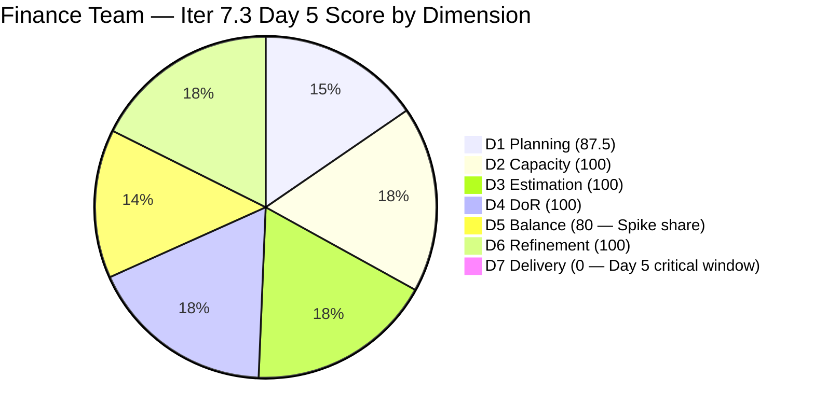
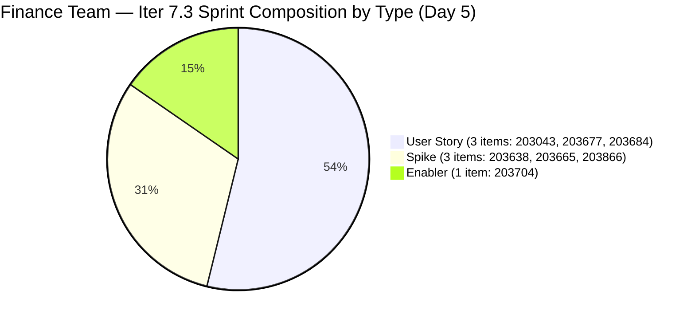

# ADO SAFe Iteration Audit — Finance Team

**Audit #52 | Iteration 7.3 (May 4 – May 17, 2026) | Day 5 of 14**

---

## 1. Audit Metadata

| Field | Value |
|---|---|
| **Audit Date** | May 8, 2026 — 09:02 UTC |
| **Auditor** | Claude Code (ADO SAFe Audit Agent) |
| **Workspace** | `ado_fin` |
| **ADO Project** | Jairosoft FINOPS (`e0bb302f-40f9-46c3-8164-6f1acb317d63`) |
| **Team** | Finance Team (`1f4b45fa-82e8-4a36-aedc-6c1bc8f51070`) |
| **Iteration** | Iteration 7.3 — May 4 to May 17, 2026 |
| **Iteration ID** | `d76b8de5-94fe-4b28-987a-263d56afd8d4` |
| **Sprint Day** | Day 5 of 14 |
| **Prior Audit** | AUDIT_20260507_0901.md (Audit #51, 81.1 — Low Risk, Day 4) |
| **Scoring Model** | ADO SAFe v1 (7-dimension rubric) |
| **Overall Score** | **81.1 / 100** |
| **Risk Band** | **Low Risk** (≥ 80) |

> **Live ADO data confirmed.** 8 visible root backlog items (Finance Team, `Microsoft.RequirementCategory`) — unchanged from Days 1–4. 7 current iteration root items (IterationPath = Iteration 7.3); #203719 (Salary Increase Implementation, Iter 7.4) remains correctly deferred. **No state changes or closures recorded on Day 5.** Grace's most recent activity was #203043 updated May 7 01:09 UTC (AC enrichment). D7 = 0.0. **Day 5 is the first day of the full-scoring window** — the early-sprint annotation period has expired. D7 = 0.0 now carries its full scoring weight. First closures are urgently needed.

---

## 2. Executive Summary

Finance Team holds **81.1 / 100 — Low Risk** on Day 5, unchanged from Day 4. All seven sprint items remain open, with 5 in Active state and 2 in Ready. No closures have occurred in the 5 days since sprint start.

**Day 5 marks a critical scoring inflection point.** The early-sprint window (Days 1–4) has ended. D7 = 0.0 will now actively suppress the score in each future audit until Grace delivers first closures. The Low Risk band (≥ 80) is sustainable for approximately 2–3 more days without closures before the score drops to Moderate Risk territory.

**Score floor without closures by Day 7:** If Grace delivers nothing by Day 7 (May 10), D7 = 0.0 continues with full weight. Score remains at 81.1 for two more days. By Day 8, continued zero delivery would be flagged as a High Risk signal regardless of score band.

**Positive context:** Grace has 5 Active items (9 SP) in progress simultaneously and one of the smallest sprint scopes on the team (13 SP total). The sprint is entirely achievable. The DoR quality is strong (100) and capacity is configured. The issue is task completion velocity, not sprint structure.

**Most actionable item:** Close #203638 (Cadac Policy Submission, 1 SP, Spike, Ready) — this takes D7 from 0 to 7.7% and drops Spike share from 42.9% to 33.3%, recovering D5 from 80 to 100. One action improves two dimensions.

---

## 3. Previous Audit Delta

| Dimension | Audit #51 (May 7) — Day 4 | Audit #52 (May 8) — Day 5 | Delta | Driver |
|---|---|---|---|---|
| Iteration Planning | 87.5 | 87.5 | 0.0 | 7/8 sprint items — unchanged |
| Team Capacity | 100.0 | 100.0 | 0.0 | Grace: 3 hrs/day, 0 days off — unchanged |
| Estimation | 100.0 | 100.0 | 0.0 | All 7 sprint items estimated — unchanged |
| DoR Compliance | 100.0 | 100.0 | 0.0 | All 7 items pass DoR — unchanged |
| Work Item Balance | 80.0 | 80.0 | 0.0 | Spike share 42.9% > 40% — unchanged |
| Backlog Refinement | 100.0 | 100.0 | 0.0 | All 8 items fresh — unchanged |
| Delivery Predictability | 0.0 | 0.0 | 0.0 | 0 / 13 SP closed — Day 5 (early window expired) |
| **Overall** | **81.1** | **81.1** | **0.0** | **Stable score; critical window now open — closures required Days 5–7** |

### Score Trend — Iteration 7.3

| Audit | Overall | Risk Band |
|---|---|---|
| 7.2 Close (May 3) | ~91 | Low |
| 7.3 Day 1 (May 4) | 83.7 | Low |
| 7.3 Day 2 (May 5) | 83.7 | Low |
| 7.3 Day 3 (May 6) | 81.1 | Low |
| 7.3 Day 4 (May 7) | 81.1 | Low |
| 7.3 Day 5 (May 8) | **81.1** | **Low** |

---

## 4. Current Iteration Snapshot

| Metric | Value |
|---|---|
| **Visible root backlog items** | 8 |
| **Current iteration root items (Iter 7.3)** | 7 |
| **Committed story points** | 13 SP |
| **Closed story points** | 0 SP |
| **Open story points** | 13 SP |
| **Sprint progress** | Day 5 of 14 — 36% time elapsed, 0% SP delivered |
| **Assignee** | Grace (sole contributor) |
| **Bus factor** | 1 — persistent structural risk |
| **Day 5 activity** | None recorded as of 09:02 UTC |
| **Sprint score ceiling** | ~95.4 (at 13/13 SP with D5=80), ~97.9 (if #203638 closed, D5 recovers to 100) |

### State Distribution — Day 5

| State | Count | SP |
|---|---|---|
| Active | 5 | 9 |
| Ready | 2 | 4 |
| Closed | 0 | 0 |
| **Total** | **7** | **13** |

---

## 5. Work Item Analysis

### Current Iteration Root Items — Day 5 State (7 items)

| ID | Title | Type | State | SP | DoR | AssignedTo | Changed | Notes |
|---|---|---|---|---|---|---|---|---|
| 203043 | Signed Annual Performance Evaluation Summary | User Story | Active | 2 | PASS | Grace | May 7 01:09 UTC | AC enriched Day 4 |
| **203638** | Submission of Cadac Policy and Program Plan with Budgets | Spike | Ready | 1 | PASS | Grace | May 6 | **Best first-closure candidate** |
| 203665 | AFS Portal Access | Spike | Active | 2 | PASS | Grace | May 5 | External BIR portal dependency |
| 203677 | Attendance Integration | User Story | Ready | 3 | PASS | Grace | May 4 | System dependency unresolved |
| 203684 | SEC AFS Submission | User Story | Active | 2 | PASS | Grace | May 6 | SEC compliance — deadline unconfirmed |
| 203704 | Set-up Payment Gateway | Enabler | Active | 2 | PASS | Grace | May 6 | Infrastructure enabler |
| 203866 | FTC Payment — 3 invoices overdue | Spike | Active | 1 | PASS | Grace | May 6 | AC thin ("Feedback from Matt / Payment from Matt") |

Non-sprint item: #203719 (Salary Increase Implementation, Iter 7.4, US, 2SP, New) — correctly staged.

### DoR Re-verification — Day 5

| ID | Desc ✓ | AC ✓ | Verdict | Quality Note |
|---|---|---|---|---|
| 203043 | ✓ | ✓ | PASS | AC: 3 criteria (AC1 access, AC2 upload, AC3 HR receipt) — enriched May 7 |
| 203638 | ✓ | ✓ | PASS | AC1+AC2 — clean; Spike ready to close |
| 203665 | ✓ | ✓ | PASS | AC: portal access + accepted report |
| 203677 | ✓ | ✓ | PASS | System dependency noted; verify payroll system access |
| 203684 | ✓ | ✓ | PASS | AC1: submitted AFS; AC2: accepted by SEC — deadline missing |
| 203704 | ✓ | ✓ | PASS | AC1: secured gateway; AC2: fund transfers |
| 203866 | ✓ | PASS (thin) | PASS | AC: "Feedback from Matt / Payment from Matt" — functional pass; enrich before closing |

### D7 Velocity Gap Analysis

5 full sprint days elapsed. 0 SP closed. Grace has 3 hrs/day × 9 workdays remaining = 27 hours of capacity. 13 SP at this capacity level = ~2 hrs/SP. This is achievable but requires immediate task completion, not just progress.

**Simplest path to first closure:** #203638 (Cadac Policy Submission, 1 SP) — submit document + obtain Barangay official's receipt/acknowledgment. This is an external handoff action, not a multi-day effort. Grace should be able to close this on Day 5.

---

## 6. SAFe Compliance Scorecard

| Dimension | Score | Evidence | Notes |
|---|---|---|---|
| D1 Iteration Planning | 87.5 | 7 sprint items / 8 visible backlog items | Stable; #203719 deferred to Iter 7.4 |
| D2 Team Capacity | 100.0 | 1 / 1 contributor with positive capacity | Grace: 3 hrs/day (Doc 2 + Req 1), 0 days off |
| D3 Estimation | 100.0 | 7 / 7 sprint items have SP > 0 | Total 13 SP; all estimated |
| D4 DoR Compliance | 100.0 | 7 / 7 sprint items pass Desc + AC threshold | All items verified; #203866 AC thin but passes minimum |
| D5 Work Item Balance | **80.0** | 3 Spikes / 7 items = 42.9% > 40% spike threshold | Has US (no -40); US 3/7=42.9% ≤ 60% (no -30); Spike 3/7=42.9% > 40% → **-20**. D5=80 |
| D6 Backlog Refinement | 100.0 | All 8 items changed May 4–7; 0 stale | stale_90=0; stale_180=0; untouched_current=0/7 |
| D7 Delivery Predictability | **0.0** | 0 / 13 SP closed — Day 5 of 14 | **Early-sprint window expired. Full scoring weight active from Day 5.** |
| **Overall** | **81.1** | **(87.5+100+100+100+80+100+0)/7** | **Low Risk — score will erode without closures by Day 7** |

**D1 trace:** round(7/8×100,1) = 87.5.
**D5 trace:** Has US → no -40. US=3/7=42.9% ≤ 60% → no -30. Spike=3/7=42.9% > 40% → **-20**. D5 = 100-20 = 80.
**D6 trace:** base=round(8/8×100,1)=100; stale_90=0; stale_180=0; untouched_current: all 7 items changed ≥ May 4. D6=100.
**D7 trace:** committed=13 SP; closed=0 SP; Day 5. D7=0.0.

---

## 7. Dimension Findings

### D1 — Iteration Planning (87.5 — stable and well-structured)

7 of 8 visible backlog items committed to Iter 7.3. #203719 correctly staged for Iter 7.4. D1 = 87.5 reflects strong sprint scoping. No changes from Days 1–4.

### D2 — Team Capacity (100.0)

Grace: 3 hrs/day, 0 days off. Total remaining capacity: 27 hours (9 workdays × 3 hrs/day). Against 13 SP committed, this represents ~2.1 hrs/SP. Adequate if execution begins today.

### D3 — Estimation (100.0)

All 7 sprint items have story points. D3 = 100.

### D4 — DoR Compliance (100.0)

All 7 items pass DoR minimums. #203043 was enriched on Day 4 (AC: 3 criteria). Notable quality gap: #203866 ("Feedback from Matt / Payment from Matt") passes the minimum threshold but the acceptance criteria are not independently verifiable — they describe external outcomes without testable conditions. Grace must enrich before closing.

### D5 — Work Item Balance (80.0 — recoverable with one closure)

Spike share: 3/7 = 42.9% > 40% → -20 penalty. Recovery path:
- **Close #203638 (Cadac Policy Submission, Spike, 1 SP):** Spike count drops to 2/6 = 33.3%, below the 40% threshold. D5 recovers to 100 for all subsequent audits.
- **Close any other Spike (203665 or 203866):** Same recovery effect.

Closing one Spike permanently eliminates D5 penalty and improves each future audit score by ~2.9 points.

### D6 — Backlog Refinement (100.0)

All 8 backlog items changed between May 4 and May 7. No stale items. Grace's updates on Days 3–4 demonstrate continued sprint-day hygiene. D6 = 100.

### D7 — Delivery Predictability (0.0 — critical gap entering Day 5)

**Day 5 marks the end of the early-sprint annotation window. D7 = 0.0 now carries its full scoring weight.** Without closures, the score remains at 81.1 today, but two consecutive days of no activity from Day 5 onward would signal execution failure, not just a predictability gap.

**Score projection:**
- Day 5 (close #203638, 1 SP): D7 = round(1/13×100,1) = 7.7 → D5 recovers to 100 → Overall = round((87.5+100+100+100+100+100+7.7)/7,1) = round(695.2/7,1) = 99.3... wait — let me recalculate without D5 fix separately.
  - If #203638 closed: D7=7.7; D5 drops to 33.3% spike → D5=100. Overall=(87.5+100+100+100+100+100+7.7)/7=695.2/7=99.3. (But note: once 203638 closes, backlog shrinks to 7, sprint items=6, D1=round(6/7×100,1)=85.7.)
  - Net: D1=85.7, D7=7.7, D5=100. Overall=(85.7+100+100+100+100+100+7.7)/7=693.4/7=99.1. Effective gain: 81.1→~84.7 (adjusted for D1 shift).
- Day 7 (May 10, 4 SP closed): D7 = round(4/13×100,1) = 30.8 → Overall ≈ 84.2 (if D5 recovers too)
- Day 10 (May 13, 9 SP closed): D7 = 69.2 → Overall ≈ 92.5
- Day 14 (May 17, 13 SP closed): D7 = 100 → Overall ≈ 95.4

**Score deterioration scenario:** If 0 closures through Day 7: score stays at 81.1 for Day 6, but by Day 8 the continued 0.0 D7 becomes a risk flag warranting sprint escalation.

---

## 8. Risks and Bottlenecks

| Risk | Severity | Status |
|---|---|---|
| **D7 = 0.0 through Day 5 — early-sprint window expired** | **Critical** | No closures in 5 days. Full scoring weight active. First closure required today. Score erodes to Moderate Risk if no closures by Day 8. |
| #203677 (Attendance Integration, 3 SP) — payroll system dependency | **High** | Still in Ready on Day 5. Grace has not confirmed payroll system access. A 3 SP blocked item represents 23% of committed scope. Escalate to IT/Ramon if not resolved today. |
| Spike share 42.9% > 40% (D5 = 80) | Moderate | Closes on first Spike closure. Target: #203638 (1 SP, Ready) — Day 5. |
| 5 items simultaneously Active (9 SP) | Moderate | Grace is running too wide WIP at 3 hrs/day. Recommend closing 1–2 Active items before opening any new work. |
| #203866 AC thin ("Feedback from Matt") | Low | Passes DoR threshold; must be enriched before closing |
| #203684 (SEC AFS) — compliance deadline not captured in AC | Moderate | External filing deadline not tracked in work item. Must be added before execution proceeds. |
| Single contributor (Grace) — bus factor 1 | Moderate | 13 SP dependent on one contributor. |

---

## 9. Prioritized Recommendations

1. **[Day 5 — Critical] Close #203638 (Cadac Policy and Program Plan Submission, Spike, 1 SP)** — This item is in Ready state with 2-point AC (received/accepted policy + copy to HR/SharePoint). Grace should submit the document to the Barangay official today and obtain confirmation. **This single action: (a) delivers first D7 credit (1/13 = 7.7%), (b) drops Spike share to 33.3%, recovering D5 from 80 to 100, and (c) signals sprint momentum.** Estimated time: < 2 hours.

2. **[Day 5 — Critical] Confirm #203677 payroll system access (Attendance Integration, 3 SP)** — Day 5 is the latest acceptable point to surface an IT dependency without impacting sprint delivery. Grace must verify payroll system access is working today. If access is blocked, escalate immediately to Ramon with a concrete IT resolution timeline. A 3 SP item blocked by IT from Day 5 onward directly threatens sprint delivery.

3. **[Day 5–6] Close #203866 (FTC Payment, Spike, 1 SP) after enriching AC** — Replace "AC1. Feedback from Matt / AC2. Payment from Matt" with verifiable criteria: e.g., "AC1. Written acknowledgment or email response from Matt confirming receipt of all 3 invoices. AC2. Payment received in full for invoice numbers [list]. AC3. Invoices marked settled in finance ledger." Then close the item. Combined with #203638, closing both Spikes brings D7 to round(2/13×100,1)=15.4%.

4. **[Day 5 — Add to #203684] Capture SEC AFS filing deadline** — Add "AC3. AFS report filed by [SEC AFS deadline date]." to #203684. This ensures the external deadline is tracked in the work item and is not missed if Grace is unavailable. Confirm the actual deadline from the SEC calendar and record it.

5. **[Day 5–6] Close #203043 (Signed Annual Perf Evaluation, 2 SP)** — AC was enriched on Day 4. Grace should upload the signed document to the designated HR share folder and obtain HR receipt confirmation (#203043 AC2+AC3). Close on Day 5 or 6.

6. **[Day 6] Apply WIP discipline — close before opening** — Grace has 5 Active items. Before activating any new items (e.g., #203638 from Ready), first close the easiest Active items (#203866, #203043). This reduces cognitive load and improves closure velocity.

---

## 10. Evidence Gaps and Limitations

| Gap | Impact | Mitigation |
|---|---|---|
| D7 = 0.0 through Day 5 — early-sprint annotation expired | Score will remain suppressed without closures; risk of Moderate Risk slip by Day 8 | Recommendation #1 — close #203638 today |
| #203677 payroll system dependency unconfirmed | 3 SP (23% of scope) potentially blocked by IT system access | Recommendation #2 — escalate immediately |
| #203866 AC thin ("Feedback from Matt") | Non-verifiable criteria at closure time | Enrich before closing (Recommendation #3) |
| #203684 SEC AFS filing deadline not in AC | External compliance risk | Add deadline to AC today (Recommendation #4) |
| No Day 5 ADO activity visible as of 09:02 UTC | May reflect Grace's work schedule (UTC offset); closures may appear later today | Day 6 audit will capture any Day 5 overnight activity |
| Bus factor 1 (Grace) | All 13 SP dependent on single contributor | Structural risk; persistently documented |
