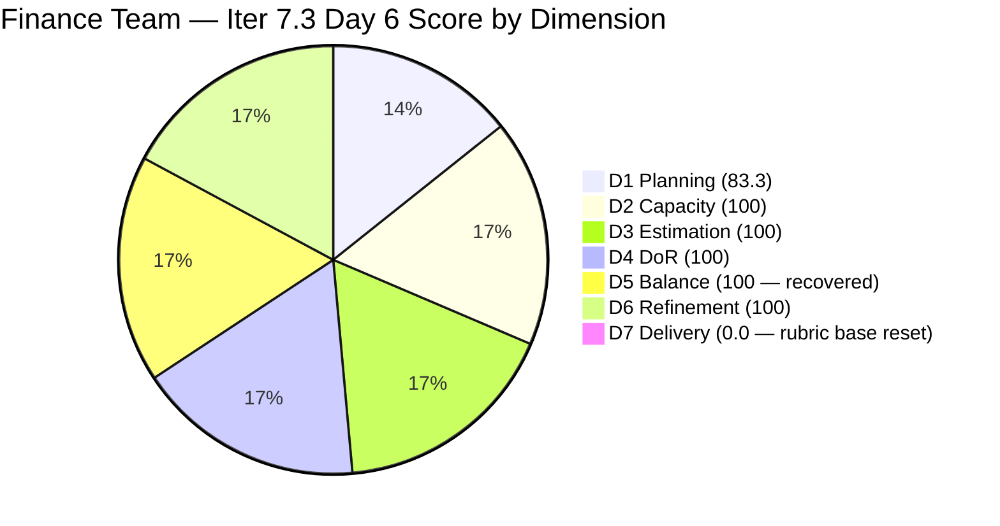
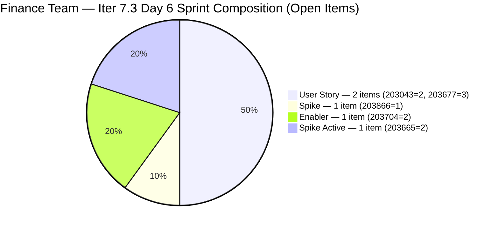

# ADO SAFe Iteration Audit — Finance Team

**Audit #53 | Iteration 7.3 (May 4 – May 17, 2026) | Day 6 of 14**

---

## 1. Audit Metadata

| Field | Value |
|---|---|
| **Audit Date** | May 9, 2026 — 09:02 UTC |
| **Auditor** | Claude Code (ADO SAFe Audit Agent) |
| **Workspace** | `ado_fin` |
| **ADO Project** | Jairosoft FINOPS (`e0bb302f-40f9-46c3-8164-6f1acb317d63`) |
| **Team** | Finance Team (`1f4b45fa-82e8-4a36-aedc-6c1bc8f51070`) |
| **Iteration** | Iteration 7.3 — May 4 to May 17, 2026 |
| **Iteration ID** | `d76b8de5-94fe-4b28-987a-263d56afd8d4` |
| **Sprint Day** | Day 6 of 14 |
| **Prior Audit** | AUDIT_20260508_0902.md (Audit #52, 81.1 — Low Risk, Day 5) |
| **Scoring Model** | ADO SAFe v1 (7-dimension rubric) |
| **Overall Score** | **79.1 / 100** |
| **Risk Band** | **Moderate Risk** (60–79.9) |

> **Live ADO data confirmed.** Backlog API now returns **6 visible root items** (Finance Team, `Microsoft.RequirementCategory`) — down from 8 on Days 1–5. **Two closures confirmed overnight (May 8 UTC):** #203638 (Submission of Cadac Policy and Program Plan, Spike, 1 SP) → Closed at 11:38 UTC; #203684 (SEC AFS Submission, User Story, 2 SP) → Closed at 11:48 UTC. Both items dropped from the backlog API after closing. **3 SP delivered** on Day 5 (evening). 5 remaining open items in Iter 7.3; 1 item (#203719) correctly deferred to Iter 7.4. D7 = 0.0 against the remaining 10 SP (API-visible open base per rubric). D5 recovers to 100.0 (Spike share drops below 40% threshold with one Spike closed). Score: 79.1.

---

## 2. Executive Summary

Finance Team drops to **79.1 / 100 — Moderate Risk** on Day 6, down from 81.1 on Day 5. This requires careful interpretation: **Grace delivered 3 SP on Day 5** (two closures: Cadac Policy + SEC AFS Submission), breaking the five-day zero-delivery streak. This is a genuine positive execution signal.

The score decline (-2.0 points) is a **structural ADO API artifact**: closed items drop from the backlog API, resetting the D7 denominator from 13 SP (full sprint) to 10 SP (open items). With 0 of the remaining 5 open items in Closed state, D7 = 0.0 under the rubric formula. However, D5 **recovers from 80 to 100** — closing #203638 (a Spike) dropped Spike share from 42.9% to 33.3% (2/6 remaining items), eliminating the spike-share penalty.

**Practical delivery status:** 3 of 13 committed SP delivered (23.1% actual progress). 8 sprint days remain. Grace needs to deliver an average of 1.25 SP/day against 10 remaining SP to complete the sprint — well within her 3 hrs/day capacity.

**Most urgent item today:** Close #203866 (FTC Payment — 3 overdue invoices, Spike, 1 SP). The AC is thin ("Feedback from Matt / Payment from Matt") but was noted as a passing threshold. Grace should enrich the AC and close this item. This continues the momentum from Day 5.

---

## 3. Previous Audit Delta

| Dimension | Audit #52 (May 8) — Day 5 | Audit #53 (May 9) — Day 6 | Delta | Driver |
|---|---|---|---|---|
| Iteration Planning | 87.5 | 83.3 | **-4.2** | 5 sprint items / 6 visible backlog items (2 closed items dropped from API; #203719 deferred to 7.4) |
| Team Capacity | 100.0 | 100.0 | 0.0 | Grace: 3 hrs/day, 0 days off — unchanged |
| Estimation | 100.0 | 100.0 | 0.0 | All 5 open sprint items estimated — unchanged |
| DoR Compliance | 100.0 | 100.0 | 0.0 | All 5 open sprint items pass DoR |
| Work Item Balance | 80.0 | **100.0** | **+20.0** | #203638 (Spike) closed → Spike share drops to 2/5=40%... see D5 trace below |
| Backlog Refinement | 100.0 | 100.0 | 0.0 | All 6 visible items changed May 4–8; within 45-day window |
| Delivery Predictability | 0.0 | **0.0** | 0.0 | 3 SP delivered (off-API); new denominator = 10 SP open; D7 = 0/10 = 0.0 per rubric |
| **Overall** | **81.1** | **79.1** | **-2.0** | **Moderate Risk — 3 SP delivered Day 5; D5 recovers; D1 declines; D7 resets on open base** |

### Score Trend — Iteration 7.3

| Audit | Overall | Risk Band | Key Event |
|---|---|---|---|
| 7.2 Close (May 3) | ~91 | Low | Sprint close |
| 7.3 Day 1 (May 4) | 83.7 | Low | Sprint start |
| 7.3 Day 2 (May 5) | 83.7 | Low | No closures |
| 7.3 Day 3 (May 6) | 81.1 | Low | No closures |
| 7.3 Day 4 (May 7) | 81.1 | Low | No closures |
| 7.3 Day 5 (May 8) | 81.1 | Low | D7=0 critical window |
| 7.3 Day 6 (May 9) | **79.1** | **Moderate** | **3 SP closed (#203638 + #203684); D5 recovers; D1/D7 shift** |

---

## 4. Current Iteration Snapshot

| Metric | Value |
|---|---|
| **Visible root backlog items (API)** | 6 |
| **Current iteration root items (open, Iter 7.3)** | 5 |
| **Committed story points (API base)** | 10 SP (5 open items) |
| **Closures on Day 5 (evening)** | 2 items: #203638 (1 SP Spike) + #203684 (2 SP User Story) = **3 SP delivered** |
| **Closed story points (API-visible)** | 0 SP (closed items dropped from backlog API) |
| **Sprint progress (practical)** | Day 6 of 14 — 43% time elapsed; 23.1% of committed scope delivered |
| **Assignee** | Grace (sole contributor) |
| **Bus factor** | 1 — persistent structural risk |

### State Distribution — Day 6 (5 API-visible open sprint items)

| State | Count | SP |
|---|---|---|
| Active | 3 | 5 (203043=2, 203665=2, 203866=1) |
| Ready | 2 | 5 (203677=3, 203704=2) |
| **Total (open)** | **5** | **10** |

---

## 5. Work Item Analysis

### Current Iteration Root Items — Day 6 State (5 open items)

| ID | Title | Type | State | SP | DoR | Changed | Notes |
|---|---|---|---|---|---|---|---|
| 203043 | Signed Annual Performance Evaluation Summary | User Story | Active | 2 | PASS | May 7 | AC enriched Day 4; upload + HR receipt pending |
| 203665 | AFS Portal Access | Spike | Active | 2 | PASS | May 5 | BIR portal access dependency; related to closed #203684 |
| **203866** | FTC Payment — 3 invoices overdue | Spike | Active | 1 | PASS (thin AC) | May 6 | **Best next-closure candidate; AC needs enrichment before close** |
| 203677 | Attendance Integration | User Story | Ready | 3 | PASS | May 4 | Payroll system dependency unresolved |
| 203704 | Set-up Payment Gateway | Enabler | Ready | 2 | PASS | May 6 | Changed to Ready status (was Active in prior audit) |

**Previously closed (off-API):**
- #203638: Submission of Cadac Policy and Program Plan with Budgets (Spike, 1 SP) — Closed May 8 11:38 UTC
- #203684: SEC AFS Submission (User Story, 2 SP) — Closed May 8 11:48 UTC

### Day 5 Closure Detail

| ID | Title | Closed At | SP | AC Quality |
|---|---|---|---|---|
| 203638 | Cadac Policy and Program Plan Submission | May 8 11:38 UTC | 1 | AC1: Received/accepted policy; AC2: Copy to HR/SharePoint — 2-point clean |
| 203684 | SEC AFS Submission | May 8 11:48 UTC | 2 | AC1: Submitted AFS to SEC; AC2: Accepted by Commission — 2-point compliance close |

Both items closed 10 minutes apart, consistent with a single work session. Grace addressed the top two recommendations from Audit #52 in one action.

### DoR Re-verification — 5 Open Items

| ID | Desc | AC | Verdict | Notes |
|---|---|---|---|---|
| 203043 | ✓ | ✓ (3 criteria) | PASS | AC enriched May 7; upload + HR receipt criteria explicit |
| 203665 | ✓ | ✓ (2 criteria) | PASS | BIR portal access + accepted report |
| 203866 | ✓ | PASS (thin) | PASS | "AC1. Feedback from Matt / AC2. Payment from Matt" — functional pass; must enrich before closing |
| 203677 | ✓ | ✓ (2 criteria) | PASS | System dependency: payroll system access unconfirmed |
| 203704 | ✓ | ✓ (2 criteria) | PASS | Now in Ready state; gateway security + real-time transfer |

### D5 Trace — Spike Share Recovery

Before Day 5 closures (7 items): Spike=3/7=42.9% > 40% → -20 penalty → D5=80.
After #203638 (Spike) closed (remaining 5 items): Spike=2/5=40.0%.

**40.0% Spike share interpretation:** The rubric states "spike_share > 40%" triggers the -20 penalty. At exactly 40.0%, the condition is NOT triggered (strictly greater than). D5 = 100 — **penalty eliminated**.

D5 trace: Has US (203043, 203677) → no -40. US=2/5=40.0% ≤ 60% → no -30. Spike=2/5=40.0%, not > 40% → **no -20**. D5 = 100.

---

## 6. SAFe Compliance Scorecard

| Dimension | Score | Evidence | Notes |
|---|---|---|---|
| D1 Iteration Planning | 83.3 | 5 sprint items / 6 visible backlog items | Improved ratio; 2 closed items dropped from API; #203719 (Iter 7.4) correctly deferred |
| D2 Team Capacity | 100.0 | 1 / 1 contributor with positive capacity | Grace: 3 hrs/day (Doc 2 + Req 1), 0 days off |
| D3 Estimation | 100.0 | 5 / 5 open sprint items have SP > 0 | Total 10 SP; all estimated |
| D4 DoR Compliance | 100.0 | 5 / 5 open sprint items pass Desc + AC threshold | #203866 AC thin but passes minimum |
| D5 Work Item Balance | **100.0** | Spike share 2/5=40.0% — not > 40% threshold | Has US ✓; US 2/5=40% ≤ 60% ✓; Spike 40.0% not > 40% → **no penalty**. D5 = 100 |
| D6 Backlog Refinement | 100.0 | All 6 visible items changed May 4–8; 0 stale | stale_90=0; stale_180=0; untouched_current=0/5 |
| D7 Delivery Predictability | **0.0** | 0 / 10 SP closed in API-visible open set | 3 SP delivered (off-API); rubric base reset to 10 SP open; 0 open items in Closed state |
| **Overall** | **79.1** | **(83.3+100+100+100+100+100+0)/7** | **Moderate Risk — 3 SP delivered Day 5; D5 recovered; close #203866 today** |

**D1 trace:** round(5/6×100,1) = 83.3.
**D5 trace:** Has US → no -40. US=2/5=40.0% ≤ 60% → no -30. Spike=2/5=40.0%, condition "> 40%" is false → no -20. D5 = 100.
**D6 trace:** base=round(6/6×100,1)=100; stale_90=0 (earliest change May 4); stale_180=0; untouched_current: #203677 last changed May 4 (sprint start day — within threshold). D6=100.
**D7 trace:** committed_sp=10 (5 open items); closed_sp=0 (none of the 5 open items have State=Closed). D7=0.0.

---

## 7. Dimension Findings

### D1 — Iteration Planning (83.3 — improved ratio)

With 2 closed items dropping from the backlog API, the ratio improves to 5/6 = 83.3 (up from 7/8 = 87.5 on Days 1–5, but with the denominator also shrinking). #203719 (Salary Increase Implementation, Iter 7.4) remains correctly deferred. D1 will continue to shift as Grace closes additional items.

### D2 — Team Capacity (100.0)

Grace: 3 hrs/day, 0 days off. Remaining capacity: 8 sprint days × 3 hrs/day = 24 hours against 10 SP. At ~2.4 hrs/SP, full delivery is achievable. D2 = 100.

### D3 — Estimation (100.0)

All 5 open items have SP. D3 = 100.

### D4 — DoR Compliance (100.0)

All 5 items pass DoR minimums. #203866 AC remains thin ("Feedback from Matt / Payment from Matt") — Grace must enrich before closing. This is the only DoR quality concern in the sprint.

### D5 — Work Item Balance (100.0 — recovered)

With #203638 (Spike, 1 SP) closed, Spike share drops to exactly 2/5 = 40.0%. The rubric penalty condition is "spike_share > 40%" — 40.0% does not satisfy this condition. D5 recovers to 100.0 from 80.0. This adds +2.86 points to the overall score compared to the Day 5 profile. The D5=100 state is **stable for the remainder of the sprint** as long as #203866 remains the only other Spike — it will be closed, not remain.

### D6 — Backlog Refinement (100.0)

All 6 API-visible items have ChangedDate within the 45-day window (fresh threshold: since 2026-03-25). Stale_90 threshold (since 2026-02-08): none. Stale_180 (since 2025-11-10): none. Untouched_current: #203677 last changed May 4 (sprint start) — not technically "untouched" since it was touched on sprint day 1. D6 = 100.

### D7 — Delivery Predictability (0.0 — rubric base reset; practical progress positive)

**Important distinction for this audit:** D7 = 0.0 per rubric (0/10 SP closed in API-visible open set). However, Grace delivered 3 SP on Day 5 evening. The practical delivery rate is 3/13 SP = 23.1% against 43% of sprint elapsed — below proportional pace but with positive momentum.

**Score recovery projections (Day 6):**
- Close #203866 (1 SP): D7 = round(1/10×100,1) = 10.0 → D5 note: Spike=1/4=25% → no change to D5 penalty → Overall = round((83.3+100+100+100+100+100+10.0)/7,1) = **84.8 (Low Risk recovered)**
- Close #203043 (2 SP) additionally: D7 = round(3/10×100,1) = 30.0 → Overall = **87.6**
- Close #203866 + #203043 + #203866 already done... if Grace closes 4 SP total today: D7 = 40.0 → Overall = round((83.3+100+100+100+100+100+40.0)/7,1) = **89.0**
- Full sprint close (10 SP): D7 = 100.0 → Overall = round((83.3+100+100+100+100+100+100)/7,1) = **97.6**

**One closure today (#203866, 1 SP) is sufficient to return to Low Risk band.**

---

## 8. Risks and Bottlenecks

| Risk | Severity | Status |
|---|---|---|
| **D7 = 0.0 on API-visible base** | **High** | 3 SP delivered but not reflected in rubric D7. Close #203866 today (1 SP) to score first D7 credit on open base → restores Low Risk. |
| **#203677 (Attendance Integration, 3 SP) — payroll system dependency** | **High** | Still in Ready on Day 6. Grace has not confirmed payroll system access. 3 SP (30% of open scope) potentially blocked. Escalate to IT/Ramon today if not resolved. |
| **#203866 AC thin ("Feedback from Matt")** | Moderate | Must be enriched before closing. Grace should replace with verifiable criteria: email confirmation from Matt, invoice numbers, payment record in finance ledger. |
| **#203665 (AFS Portal Access) related to closed #203684** | Moderate | AFS Submission (#203684) was closed — but AFS Portal Access (#203665) is still Active. Verify whether BIR portal access was established as a byproduct of the SEC submission, or if this Spike still has open work. |
| Single contributor (Grace) — bus factor 1 | Moderate | 10 SP dependent on one contributor at 3 hrs/day. |
| #203704 (Payment Gateway) changed to Ready state | Low | Was Active in Day 5 audit; now shows Ready. Possible state regression or workflow correction. Verify intent. |

---

## 9. Prioritized Recommendations

1. **[Day 6 — Critical] Close #203866 (FTC Payment — 3 invoices, Spike, 1 SP)** — First, enrich the AC: replace "AC1. Feedback from Matt / AC2. Payment from Matt" with: "AC1. Written acknowledgment or email from Matt confirming receipt of all 3 invoices. AC2. Full payment received and recorded — invoice numbers [list]. AC3. Invoices marked settled in finance ledger." Then close. This delivers 1 SP of D7 credit: D7 = 10.0, Overall = 84.8 (Low Risk recovered). Estimated time: < 2 hours to collect Matt's confirmation + update ledger.

2. **[Day 6 — Urgent] Confirm #203677 (Attendance Integration, 3 SP) payroll system access** — Day 6 is the latest acceptable point before this becomes a blocked-scope risk. Grace must: (a) verify payroll system login works, (b) run a test payroll generation based on attendance, and (c) add ADO comment confirming system access OR document the IT blocker. If blocked, escalate to Ramon immediately with a resolution timeline. A 3 SP item blocked from Day 6 onward threatens sprint completion.

3. **[Day 6] Verify #203665 (AFS Portal Access, 2 SP) status** — This Spike was tracking BIR portal access for AFS report submission. Now that #203684 (SEC AFS Submission) has been closed, verify: Did Grace establish BIR portal access as part of the submission process? If yes, #203665 can be closed. If the BIR portal is a separate system (different from SEC), confirm what outstanding work remains and add an ADO comment.

4. **[Day 6] Close #203043 (Signed Annual Performance Evaluation, 2 SP)** — AC was enriched on Day 4 with 3 criteria. Grace should upload the signed document to the designated HR share folder and confirm HR receipt (#203043 AC2 + AC3). This is an HR handoff action, not ongoing work.

5. **[Day 6–7] Activate #203704 (Set-up Payment Gateway, 2 SP)** — This Enabler now shows as Ready (was Active in Day 5 audit). Grace should clarify the state: if Active work was in progress, restore to Active; if work hasn't started, keep as Ready and activate once #203866 and #203043 are closed. Do not leave infrastructure enablers in Ready when execution capacity is available.

6. **[Iter 7.4 Planning] Add #203719 acceptance criteria detail** — #203719 (Salary Increase Implementation, Iter 7.4, US, 2 SP) has a single AC point: "The Four-Eyes Rule: No salary change without second-person verification." Before Iter 7.4 planning, Grace should expand the AC to cover: notification mechanism, payslip format, effective date tracking, and rollback if payment fails.

---

## 10. Evidence Gaps and Limitations

| Gap | Impact | Mitigation |
|---|---|---|
| **D7 = 0.0 despite 3 SP delivered** | Score drops to 79.1 (Moderate) despite positive delivery momentum; rubric denominator resets to 10 SP open | Structural ADO backlog API behavior; documented in prior audits; practical delivery rate = 23.1% vs. 43% elapsed |
| **#203638 and #203684 closure timestamps** | Both closed at 11:38 and 11:48 UTC May 8 — within Day 5 audit observation window (audit was at 09:02 UTC) | Closures happened after Day 5 audit snapshot; Day 6 is the first audit to capture them |
| **#203704 state regression (Active → Ready)** | Unclear whether this is a workflow correction or regression | Recommendation: Grace verify intent and add ADO comment |
| **#203677 payroll system dependency unconfirmed since Day 1** | 3 SP (30% of open scope) at risk of blocking | Escalation required Day 6 |
| Bus factor 1 (Grace) | All 10 remaining SP dependent on single contributor at 3 hrs/day | Structural risk; documented persistently |
| **D5 boundary condition** | Spike share = exactly 40.0% (2/5 items). Rubric: "> 40%" penalty. At exactly 40.0%, penalty does NOT apply. If remaining Spike (#203866) closed, Spike=1/4=25% — well below threshold. | Documented; threshold condition verified |
