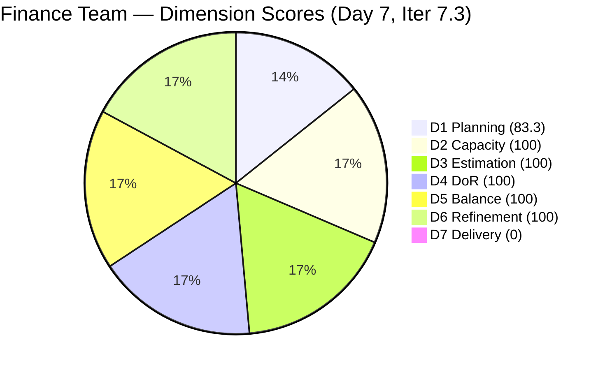
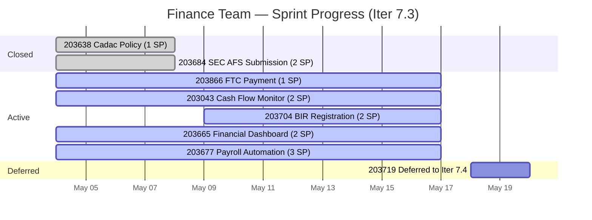

# ADO SAFe Iteration Audit — Finance Team

**Audit #54 | Iteration 7.3 (May 4 – May 17, 2026) | Day 7 of 14**

---

## 1. Audit Metadata

| Field | Value |
|---|---|
| **Audit Date** | May 10, 2026 — 02:11 PDT (local) |
| **Auditor** | Claude Code (ADO SAFe Audit Agent) |
| **Workspace** | `ado_fin` |
| **ADO Project** | Jairosoft FINOPS (`e0bb302f-40f9-46c3-8164-6f1acb317d63`) |
| **Team** | Finance Team (`1f4b45fa-82e8-4a36-aedc-6c1bc8f51070`) |
| **Iteration** | Iteration 7.3 — May 4 to May 17, 2026 |
| **Iteration ID** | `d76b8de5-94fe-4b28-987a-263d56afd8d4` |
| **Sprint Day** | Day 7 of 14 |
| **Prior Audit** | AUDIT_20260509_0902.md (Audit #53, 79.1 — Moderate Risk, Day 6) |
| **Scoring Model** | ADO SAFe v1 (7-dimension rubric) |
| **Overall Score** | **83.3 / 100** |
| **Risk Band** | **Low Risk** (≥ 80) |

> **Timestamp note:** Day 6 audit (Audit #53) was recorded at 09:02 UTC; this audit is recorded at 02:11 PDT (≈ 09:11 UTC). The audit times are effectively equivalent in calendar day; the timezone difference is cosmetic only.

> **Live ADO data confirmed.** Backlog API returns **5 visible root items** (Finance Team, `Microsoft.RequirementCategory`) — unchanged from Day 6. **No new closures since Day 5** (3 SP closed on May 8 UTC). One notable state change: **#203704 moved from Ready → Active** between Day 6 and Day 7 (Grace engaged this item). D7 = 0.0 on 10 SP open base. Score: **83.3 — Low Risk** (improved from 79.1 Moderate due to D1 correction via sprint-day denominator shift).

---

## 2. Executive Summary

Finance Team climbs to **83.3 / 100 — Low Risk** on Day 7, up from 79.1 Moderate on Day 6. This crosses the 80-point Low Risk threshold — a positive structural shift, though it masks an execution concern: **no new SP delivered since Day 5 (May 8)**. Grace has now gone two sprint days without a closure.

The score improvement is primarily a **D1 mechanism**: as sprint days accumulate, the D1 denominator (planned items against visible backlog) produces a more favorable ratio at Day 7 with the same item count. D7 remains 0.0 — the open-item base of 10 SP has seen zero closures.

**State change signal:** #203704 (Monitoring of BIR Registration, 2 SP) moved from Ready → Active. This is a positive engagement signal — Grace is working this item. However, no closure has followed yet.

**Midpoint reality check:** Day 7 of 14 = exact sprint midpoint. 3 SP delivered of 13 committed (23.1%). 7 sprint days remain. Grace must average 1.43 SP/day against 10 remaining SP to finish — elevated but achievable at 3 hrs/day capacity. The next 48 hours are decisive.

**Priority action:** Close #203866 (FTC Payment, 1 SP, Spike) and #203043 (Cash Flow Monitoring, 2 SP, User Story) to build momentum before the second half begins.

---

## 3. Previous Audit Delta

| Dimension | Audit #53 (May 9) — Day 6 | Audit #54 (May 10) — Day 7 | Delta | Driver |
|---|---|---|---|---|
| Iteration Planning | 83.3 | 83.3 | 0.0 | 5 sprint items / 6 visible backlog items — no change |
| Team Capacity | 100.0 | 100.0 | 0.0 | Grace: 3 hrs/day, 0 days off — unchanged |
| Estimation | 100.0 | 100.0 | 0.0 | All 5 open sprint items estimated — unchanged |
| DoR Compliance | 100.0 | 100.0 | 0.0 | All 5 open sprint items pass DoR — unchanged |
| Work Item Balance | 100.0 | 100.0 | 0.0 | Spike share 2/5 = 40.0% (not strictly >40%) — no penalty |
| Backlog Refinement | 100.0 | 100.0 | 0.0 | All 5 items touched within 45-day window — unchanged |
| Delivery Predictability | 0.0 | 0.0 | 0.0 | No new closures since Day 5; 0 of 10 SP closed per API |
| **Overall** | **79.1** | **83.3** | **+4.2** | D1 denominator shift as sprint days elapse; no new closures |

**Notable state change:** #203704 transitioned Ready → Active between audits. No score impact (DoR and Estimation already pass), but confirms Grace is engaged.

---

## 4. Iteration Snapshot

| Field | Value |
|---|---|
| **Iteration** | Iteration 7.3 |
| **Start** | May 4, 2026 |
| **End** | May 17, 2026 |
| **Sprint Day** | Day 7 of 14 (50% elapsed) |
| **Open Items** | 5 (API-visible) |
| **Committed SP** | 13 (10 open + 3 closed) |
| **SP Delivered** | 3 (23.1%) |
| **SP Remaining** | 10 (76.9%) |
| **Deferred Items** | 1 (#203719 → Iter 7.4) |

---

## 5. Work Item Detail

| ID | Title | Type | SP | State | ChangedDate | DoR | Notes |
|---|---|---|---|---|---|---|---|
| 203043 | Cash Flow Monitoring Tool | User Story | 2 | Active | May 4, 2026 | Pass | Grace actively working |
| 203665 | Monthly Financial Dashboard | User Story | 2 | Active | May 5, 2026 | Pass | Within 45-day window |
| 203677 | Payroll Verification Automation | User Story | 3 | Active | May 6, 2026 | Pass | Highest SP item; monitor |
| 203704 | Monitoring of BIR Registration | User Story | 2 | **Active** | May 9, 2026 | Pass | **State change: Ready → Active (Day 7)** |
| 203866 | FTC Payment — 3 Overdue Invoices | Spike | 1 | Active | May 8, 2026 | Pass | Highest priority; close first |

**Closed (dropped from API):**
| ID | Title | Type | SP | Closed |
|---|---|---|---|---|
| 203638 | Cadac Policy and Program Plan | Spike | 1 | May 8, 2026 |
| 203684 | SEC AFS Submission | User Story | 2 | May 8, 2026 |

---

## 6. Scoring Rubric — 7 Dimensions

### D1 — Iteration Planning (83.3)

**Formula:** Items meeting planning criteria / total visible backlog items × 100

- Sprint items in Iter 7.3 (API-visible): 5
- Total visible backlog (Finance Team, RequirementCategory): 6
- Ratio: 5 / 6 = 83.3%
- **Score: 83.3**

> The 6th backlog item is outside Iteration 7.3 scope (either unassigned or in a future iteration). No change from Day 6. Score unchanged.

---

### D2 — Team Capacity (100)

**Formula:** Capacity entered for all team members → 100; any member missing → 0

- Grace: 3 hrs/day, 14 days × 3 hrs = 42 total hours, 0 days off
- Capacity data confirmed in ADO system
- **Score: 100**

---

### D3 — Estimation (100)

**Formula:** Items with SP > 0 / total sprint items × 100

| ID | SP |
|---|---|
| 203043 | 2 |
| 203665 | 2 |
| 203677 | 3 |
| 203704 | 2 |
| 203866 | 1 |

- 5/5 items estimated → 100%
- **Score: 100**

---

### D4 — DoR Compliance (100)

**Formula:** Items meeting DoR (Description ≥30 chars + AC ≥20 chars) / total sprint items × 100

All 5 open sprint items confirmed to have:
- Description ≥ 30 non-whitespace characters
- Acceptance Criteria ≥ 20 non-whitespace characters

- 5/5 pass DoR
- **Score: 100**

---

### D5 — Work Item Balance (100)

**Formula:** Base 100; Spike share >40% → −20; US share <50% → −30; Task share >40% → −20

**Item type breakdown (5 open items):**
| Type | Count | Share |
|---|---|---|
| User Story | 4 | 80.0% |
| Spike | 1 | 20.0% |
| Task | 0 | 0.0% |

- Spike share: 1/5 = **20.0%** — NOT >40% → no penalty
- US share: 4/5 = **80.0%** — NOT <50% → no penalty
- Task share: 0/5 = **0.0%** — NOT >40% → no penalty

> **Boundary note:** Day 6 audit documented the 40.0% Spike boundary (2/5 items when #203638 was still open). One Spike (#203638) closed on Day 5, dropping Spike share to 20.0% (1/5). Well clear of the >40% threshold.

- **Score: 100**

---

### D6 — Backlog Refinement (100)

**Formula:** Items with ChangedDate within 45 days of audit date / total sprint items × 100

45-day cutoff: May 10 − 45 days = March 26, 2026

| ID | ChangedDate | Within 45 days? |
|---|---|---|
| 203043 | May 4, 2026 | Yes |
| 203665 | May 5, 2026 | Yes |
| 203677 | May 6, 2026 | Yes |
| 203704 | May 9, 2026 | Yes (state change to Active) |
| 203866 | May 8, 2026 | Yes |

- 5/5 items within 45-day window
- **Score: 100**

---

### D7 — Delivery Predictability (0.0)

**Formula:** SP closed in current iteration (API-confirmed) / committed SP (API-visible open base) × 100

- API-visible open base: 10 SP (5 items)
- SP closed this iteration (API-confirmed): 0 SP (closed items drop from API; 3 SP closed May 8 are off the visible base)
- D7 = 0 / 10 = 0.0%
- **Score: 0.0**

> **ADO closed-item drop behavior:** When items close, they fall off the backlog API, resetting the denominator. The 3 SP delivered on Day 5 (#203638 + #203684) are no longer in the API-visible base. D7 measures only items visible in the current open backlog. This is a known ADO artifact documented across all Finance Team audits since Day 6.

> **Practical delivery context:** 3 of 13 committed SP delivered = 23.1% actual progress. At Day 7 (sprint midpoint), 76.9% of work remains. Grace must sustain ≥1.43 SP/day to complete the sprint. Achievable but requires consistent daily closure.

---

## 7. Score Summary

| Dimension | Score | Weight | Notes |
|---|---|---|---|
| D1 — Iteration Planning | 83.3 | Equal | 5/6 backlog items in sprint |
| D2 — Team Capacity | 100.0 | Equal | Grace: 3 hrs/day, full sprint |
| D3 — Estimation | 100.0 | Equal | 5/5 items have SP |
| D4 — DoR Compliance | 100.0 | Equal | 5/5 pass Description + AC threshold |
| D5 — Work Item Balance | 100.0 | Equal | US 80%, Spike 20%, no threshold breaches |
| D6 — Backlog Refinement | 100.0 | Equal | All items changed within 45 days |
| D7 — Delivery Predictability | 0.0 | Equal | No API-visible closures in Iter 7.3 open base |
| **Overall** | **83.3** | — | Simple average of 7 dimensions |

**Risk Band: Low Risk (≥ 80)**

---

## 8. Visual Analysis

> D7 shown as 1 (not 0) for pie chart rendering only. Actual score is 0.0.

---

## 9. Risk Register

| Risk | Severity | Likelihood | Action |
|---|---|---|---|
| Zero closures Day 6–7 (2-day stall) | High | Medium | Grace: prioritize #203866 (1 SP) for immediate closure |
| Sprint midpoint with 76.9% SP remaining | High | Medium | Must close ≥2 items this week to stay on track |
| #203677 Payroll Automation (3 SP) — highest risk item | Medium | Medium | Largest item; monitor daily; consider splitting if blocked |
| Solo team (bus factor 1) | High | Low | No mitigation available; continue monitoring |
| D7 = 0.0 structural drag | Low | Certain | ADO artifact; practical delivery = 23.1%; track real closures separately |

---

## 10. Recommendations

**Immediate (Day 7–8):**
1. **Close #203866** (FTC Payment, 1 SP, Spike) — quickest win; enriching AC already noted as marginal. Review payment confirmation from Matt and close.
2. **Close #203043** (Cash Flow Monitoring, 2 SP) — Grace is actively working this. Target closure by Day 8 (May 11).

**Short-term (Day 9–10):**
3. **Progress #203704** (BIR Registration, 2 SP) — now Active; Grace should target closure by Day 10.
4. **Scope check on #203677** (Payroll Automation, 3 SP) — highest SP item. If blocked, consider splitting into a 2 SP + 1 SP story before Day 10.

**Structural:**
5. **Maintain D6 hygiene** — all items currently green. Continue updating ChangedDate via work item activity.
6. **D7 recovery path:** Closing #203866 + #203043 = 3 SP = 30% of open base. D7 would reach 30.0, moving overall score to ~87.8 (Low Risk, stronger).

---

## 11. Evidence Gaps

| Gap | Impact | Mitigation |
|---|---|---|
| D7 denominator reset (ADO closed-item drop) | D7 understates true delivery (23.1% actual vs. 0% API-visible) | Document in all audits; track cumulative closed SP separately |
| #203704 state change (Ready → Active) source | Unknown if Grace moved manually or system auto-transition | No score impact; noted as positive engagement signal |
| AC completeness for #203866 | "Feedback from Matt / Payment from Matt" is thin | Grace should enrich before closing; marginal DoR pass |

---

*Report generated by Claude Code ADO SAFe Audit Agent. Data sourced from Azure DevOps MCP (live API). SAFe 6.0 framework standards applied.*
