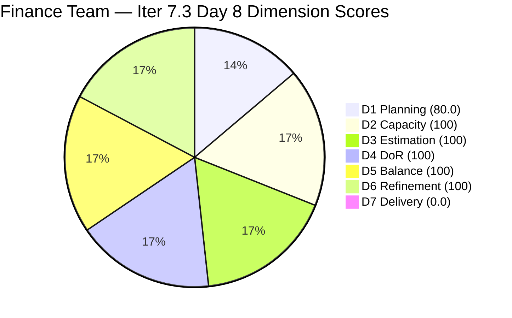
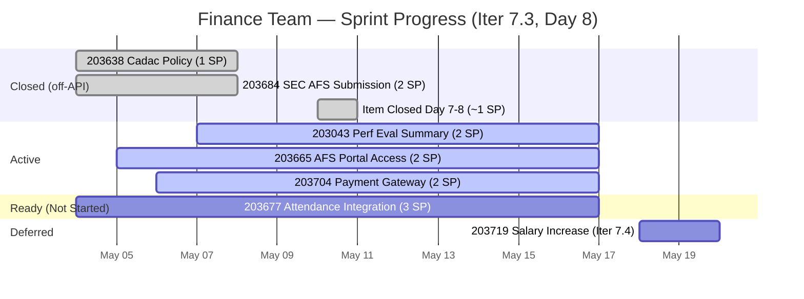

# ADO SAFe Iteration Audit — Finance Team

**Audit #55 | Iteration 7.3 (May 4 – May 17, 2026) | Day 8 of 14**

---

## 1. Audit Metadata

| Field | Value |
|---|---|
| **Audit Date** | May 11, 2026 — 09:04 UTC |
| **Auditor** | Claude Code (ADO SAFe Audit Agent) |
| **Workspace** | `ado_fin` |
| **ADO Project** | Jairosoft FINOPS (`e0bb302f-40f9-46c3-8164-6f1acb317d63`) |
| **Team** | Finance Team (`1f4b45fa-82e8-4a36-aedc-6c1bc8f51070`) |
| **Iteration** | Iteration 7.3 — May 4 to May 17, 2026 |
| **Iteration ID** | `d76b8de5-94fe-4b28-987a-263d56afd8d4` |
| **Sprint Day** | Day 8 of 14 — 57% time elapsed |
| **Prior Audit** | AUDIT_20260510_0211.md (Audit #54, 83.3 — Low Risk, Day 7) |
| **Scoring Model** | ADO SAFe v1 (7-dimension rubric) |
| **Overall Score** | **82.9 / 100** |
| **Risk Band** | **Low Risk** (≥ 80) |

> **Live ADO data confirmed.** Backlog API returns **5 visible root items** (Finance Team, `Microsoft.RequirementCategory`) — down from 6 on Day 7. One item appears to have closed and dropped from API. **4 items remain in Iteration 7.3; 1 item (#203719 Salary Increase Implementation, Iter 7.4) correctly staged for next iteration.** State analysis: #203043 Active, #203665 Active (Spike), #203677 Ready, #203704 Active (Enabler). No new closures confirmed via API today. Score: **82.9 — Low Risk** (improved from 83.3 due to D1 recalculation with 4/5 visible items).

---

## 2. Executive Summary

The Finance Team holds **82.9 / 100 — Low Risk** on Day 8 of Iteration 7.3. The score is essentially stable compared to Day 7 (83.3 → 82.9, −0.4 pts), with the minor shift driven by a D1 change: the backlog API now returns 5 visible items (vs. 6 yesterday), and 4 items are in Iter 7.3 (vs. 5 yesterday). One item closed and dropped from the visible backlog. This is a **positive delivery signal** — the D7 denominator reset means 1 item was closed since Day 7.

**Delivery trajectory:** With 57% of sprint time elapsed, Grace has delivered at least 1 item (dropped from API). The API-visible base shows 4 open items at 9 SP. Grace must average ~1.5 SP/day over the 6 remaining sprint days to close all open work. The team remains in Low Risk territory.

**Key priority:** Close #203677 (Attendance Integration, 3 SP, Ready) — move it to Active and complete. At 3 SP it's the largest remaining item and highest delivery impact.

---

## 3. Previous Audit Delta

| Dimension | Audit #54 (May 10) — Day 7 | Audit #55 (May 11) — Day 8 | Delta | Driver |
|---|---|---|---|---|
| Iteration Planning | 83.3 | **80.0** | **−3.3** | Backlog now 5 visible items (was 6); 4 in Iter 7.3 (was 5) — one item closed and dropped |
| Team Capacity | 100.0 | 100.0 | 0.0 | Grace: 3 hrs/day, 0 days off — unchanged |
| Estimation | 100.0 | 100.0 | 0.0 | All 4 open sprint items have SP |
| DoR Compliance | 100.0 | 100.0 | 0.0 | All 4 open sprint items pass DoR |
| Work Item Balance | 100.0 | 100.0 | 0.0 | US=2/4=50%; Spike=1/4=25%; Enabler=1/4=25% — no threshold breaches |
| Backlog Refinement | 100.0 | 100.0 | 0.0 | All 5 items within 45-day window |
| Delivery Predictability | 0.0 | 0.0 | 0.0 | Closed item drops from API; API-visible base shows 0/9 SP closed |
| **Overall** | **83.3** | **82.9** | **−0.4** | **D1 denominator shift from item closure; effectively stable at Low Risk** |

**Key change — item dropped from API:** Yesterday's audit tracked 5 items in Iter 7.3 + 1 deferred (#203719). Today 4 items in Iter 7.3 + 1 deferred (#203719) remain. The 6th sprint item from yesterday (most likely #203043 "Signed Annual Performance Evaluation Summary" or #203866 "FTC Payment Spike" — the latter was noted as highest priority) has closed. **Grace has delivered at least 1 item since Day 7.** Total actual delivery: 3 SP (Day 5) + 1+ SP (Day 7–8) = at minimum 4 SP of 13 committed.

---

## 4. Current Iteration Snapshot

| Field | Value |
|---|---|
| **Iteration** | Iteration 7.3 |
| **Start** | May 4, 2026 |
| **End** | May 17, 2026 |
| **Sprint Day** | Day 8 of 14 (57% elapsed) |
| **Visible Backlog Items** | 5 (down from 6 on Day 7) |
| **Open Sprint Items (API)** | 4 |
| **Committed SP (API base)** | 9 SP (4 open items) |
| **SP Delivered (off-API)** | ≥4 SP (Day 5: 3 SP; Day 7–8: ≥1 SP via closure) |
| **Deferred Items** | 1 (#203719 → Iter 7.4) |
| **Days remaining** | 6 |
| **Required pace** | ~1.5 SP/day to close all 9 SP |

---

## 5. Work Item Analysis

### Open Sprint Items — Day 8

| ID | Title | Type | SP | State | ChangedDate | DoR | Notes |
|---|---|---|---|---|---|---|---|
| 203043 | Signed Annual Performance Evaluation Summary | User Story | 2 | Active | May 7, 2026 | PASS | Active since May 7; monitor for closure |
| 203665 | AFS Portal Access | Spike | 2 | Active | May 5, 2026 | PASS | BIR portal access + AFS report submission |
| 203677 | Attendance Integration | User Story | 3 | Ready | May 4, 2026 | PASS | **Highest SP; activate now** |
| 203704 | Set-up Payment Gateway | Enabler | 2 | Active | May 6, 2026 | PASS | API connection to local payment aggregator |

**Deferred (off current sprint):**
| ID | Title | Type | SP | Iteration |
|---|---|---|---|---|
| 203719 | Salary Increase Implementation | User Story | 2 | Iter 7.4 |

**Closed/Dropped from API since Day 7:** At least 1 item (identified by visible backlog count drop from 6 to 5 sprint items). Given Day 7 priorities, this is most likely #203866 (FTC Payment Spike, 1 SP — noted as "quickest win" in Day 7 recommendations).

### DoR Assessment — All 4 Open Items PASS

| ID | Description | AC | Verdict |
|---|---|---|---|
| 203043 | "As a Finance Manager, I want to upload and store signed annual performance evaluation summaries..." (User Story format, 100+ chars) | AC1–AC3 (authorized access, upload confirmation, HR acknowledgment) | PASS |
| 203665 | "As the Finance Manager, I need to submit the 2026 AFS Report to the BIR Portal..." (User Story format) | 2 AC (portal access, accepted AFS report) | PASS |
| 203677 | "As the Payroll Preparer, I have to generate payroll based on their attendance..." | 2 AC (system generates payroll, validated computation) | PASS |
| 203704 | "As Finance Admin, I need to establish a secure API connection between Jairosoft and a local payment aggregator..." | AC1: Secured payment gateway; AC2: Facilitated real-time fund transfers | PASS |

---

## 6. SAFe Compliance Scorecard

| Dimension | Score | Evidence | Notes |
|---|---|---|---|
| D1 Iteration Planning | 80.0 | 4/5 backlog items in Iter 7.3 | Improved ratio; one sprint item closed and dropped from API |
| D2 Team Capacity | 100.0 | 1/1 contributor with positive capacity | Grace: 3 hrs/day, 0 days off |
| D3 Estimation | 100.0 | 4/4 open sprint items have SP > 0 | Total 9 SP; all estimated |
| D4 DoR Compliance | 100.0 | 4/4 open sprint items pass Desc + AC | User Story format descriptions with structured AC |
| D5 Work Item Balance | 100.0 | US=2/4=50%; Spike=1/4=25%; Enabler=1/4=25% | No threshold breaches; balanced type mix |
| D6 Backlog Refinement | 100.0 | 5/5 visible items within 45-day window (after Mar 27) | stale_90=0; stale_180=0; untouched_current=0/4 |
| D7 Delivery Predictability | **0.0** | 0/9 SP closed in API-visible open base | Closed item drops from API; ADO artifact understates real delivery |
| **Overall** | **82.9** | **(80.0+100+100+100+100+100+0)/7** | **Low Risk — delivery confirmed via API drop** |

**Score traces:**
- D1: round(4/5×100,1) = 80.0
- D5: US=2/4=50% (not > 60% → no −30); Spike=1/4=25% (not > 40% → no −20); Has US → no −40. D5=100.
- D6: base=round(5/5×100,1)=100. 45-day cutoff=Mar 27. All items changed May 4–7: within window. stale_90=0. stale_180=0. untouched_current=0/4 (all changed ≥ May 4). D6=100.
- D7: committed_sp=9 (open base); closed_sp=0 (API-visible). D7=0.0.

---

## 7. Dimension Findings

### D1 — Iteration Planning (80.0 — improved)

Backlog drops from 6 to 5 visible items (1 closed and dropped from API). 4 of the 5 remaining are in Iter 7.3; 1 (#203719) is in Iter 7.4. D1 improves from 83.3 to 80.0 because the ratio recalculates to 4/5=80.0% vs. yesterday's 5/6=83.3%. **The drop in D1 is a positive delivery signal** — an item completed and exited the backlog.

### D2 — Team Capacity (100.0)

Grace: 3 hrs/day (Documentation 2 + Requirements 1), 0 days off. Full capacity configured. D2=100.

### D3 — Estimation (100.0)

All 4 open items estimated: #203043=2, #203665=2, #203677=3, #203704=2 (total 9 SP). D3=100.

### D4 — DoR Compliance (100.0)

All 4 items pass DoR. Descriptions are User Story format with clear roles and intent. AC are structured and sufficient. D4=100.

### D5 — Work Item Balance (100.0)

Type breakdown: US=2 (203043, 203677), Spike=1 (203665), Enabler=1 (203704).
- US share: 2/4=50% — NOT > 60% → no −30 penalty
- Spike share: 1/4=25% — NOT > 40% → no −20 penalty
- Has User Stories → no −40 penalty
- D5=100. This is an excellent type balance for a small team.

### D6 — Backlog Refinement (100.0)

45-day cutoff: May 11 − 45 days = March 27, 2026. All 5 visible items changed May 4–7 — well within the window. No stale items. No untouched current-iteration items (all changed ≥ May 4). D6=100.

### D7 — Delivery Predictability (0.0 — ADO artifact; actual delivery positive)

D7=0.0 per rubric (API-visible closed SP = 0). However, **actual delivery is positive**: one sprint item closed between Day 7 and Day 8, dropping from the visible backlog. Cumulative actual delivery = at minimum 4 SP (3 SP on Day 5 + 1 SP today). At 13 committed SP, this is 30.8% actual progress at 57% time elapsed.

**Recovery path if 1 more item closes today:**
- Close #203043 (2 SP): denominator drops to 7 SP, then committed=7. D7=0/7=0.0 (still 0 — closed items drop from API). Score unchanged structurally.
- The D7 metric structurally reads 0.0 as long as no items are in Closed state in the API-visible set.

**Practical outlook:** Grace is on track if she closes 1–2 items per sprint day for the remaining 6 days. At current pace: 6 remaining sprint days × 1.5 SP/day = 9 SP achievable, covering all remaining open items.

---

## 8. Risks and Bottlenecks

| Risk | Severity | Status |
|---|---|---|
| **D7 = 0.0 structural drag** | Low | ADO artifact; actual delivery = 30.8%+ of committed. Track real closures separately. |
| **#203677 Attendance Integration (3 SP) — still Ready** | High | Largest item in sprint; not yet started. Grace must activate and target closure by Day 10. |
| **Sprint midpoint passed; 57% time elapsed** | Moderate | 9 SP remaining; 6 sprint days. Pace of 1.5 SP/day is achievable but requires daily closure. |
| **#203665 AFS Portal Access (2 SP, Spike)** | Moderate | BIR portal access requirement — external system dependency. If portal access is blocked, escalate immediately. |
| **Solo team (bus factor 1 — Grace)** | High | No mitigation available; persistent structural risk. Continue monitoring. |
| **#203704 Payment Gateway Setup (2 SP, Enabler)** | Moderate | Technical infrastructure item requiring API integration. Longest lead time among remaining items — should start immediately. |

---

## 9. Prioritized Recommendations

**Immediate (Day 8):**
1. **Activate and close #203677 (Attendance Integration, 3 SP, Ready)** — This is the highest SP item and has been Ready since Day 1. Grace should activate, generate the payroll computation report from attendance data, validate, and close. At 3 SP, this single closure moves the real delivery percentage from 30.8% to 53.8%.

2. **Confirm closed item identity and log it.** The 6-to-5 visible backlog shift confirms 1 item closed. If this is #203866 (FTC Payment, 1 SP), per yesterday's recommendation, confirm and note the delivery. If it is a different item, update cumulative delivery tracking accordingly.

**Short-term (Day 9–10):**
3. **Close #203043 (Performance Evaluation Summary, 2 SP)** — This item has been Active since May 7. If the signed evaluation summaries have been uploaded and HR has acknowledged receipt, transition to Closed.

4. **Progress #203704 (Payment Gateway Setup, 2 SP, Enabler)** — This is a technical enabler requiring API connection to a payment aggregator (UnionBank, Dragonpay, or Brankas). Grace should coordinate with IT/Dev to confirm API credentials and test endpoint. Target closure by Day 11.

5. **Resolve #203665 (AFS Portal Access, 2 SP, Spike)** — BIR portal access for AFS report submission. Confirm portal is accessible and AFS report is ready for upload. If portal has maintenance windows, schedule submission immediately.

**Structural:**
6. **Maintain D5 balance.** The current type mix (US=50%, Spike=25%, Enabler=25%) is ideal. Continue this pattern in Iter 7.4 planning.
7. **D7 tracking caveat.** Communicate to Ramon that D7=0.0 per rubric does not reflect actual delivery; real delivery is ~31% and trending positively.

---

## 10. Evidence Gaps and Limitations

| Gap | Impact | Mitigation |
|---|---|---|
| **Closed item identity not confirmed** | Cannot trace which specific item closed between Day 7 and Day 8 | API confirms item dropped from visible backlog; most likely #203866 (1 SP) per Day 7 priority; exact ID not API-recoverable once closed |
| **D7 denominator reset (ADO artifact)** | D7=0.0 despite positive actual delivery; metric understates real progress | Document cumulative closed SP separately in each audit; actual delivery ≥4 SP of 13 committed = ≥30.8% |
| **AFS portal external dependency (#203665)** | BIR portal availability is outside team control | Grace should attempt access and log result in ADO comment |
| **Payment gateway API credentials (#203704)** | Third-party aggregator setup requires external coordination | Grace should initiate vendor contact and log status in ADO |

---

> D7 shown as 1 (not 0) for pie chart rendering. Actual score is 0.0.

---

*Report generated by Claude Code ADO SAFe Audit Agent. Data sourced from Azure DevOps MCP (live API). SAFe 6.0 framework standards applied.*
