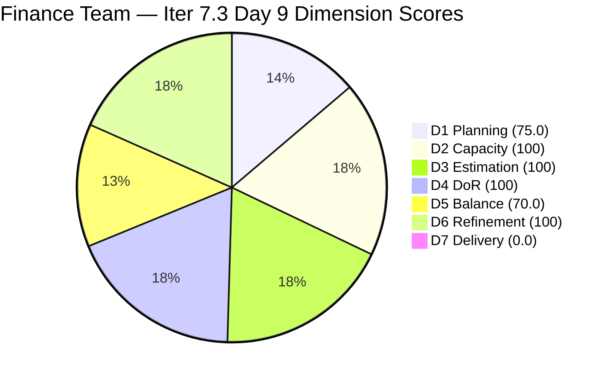
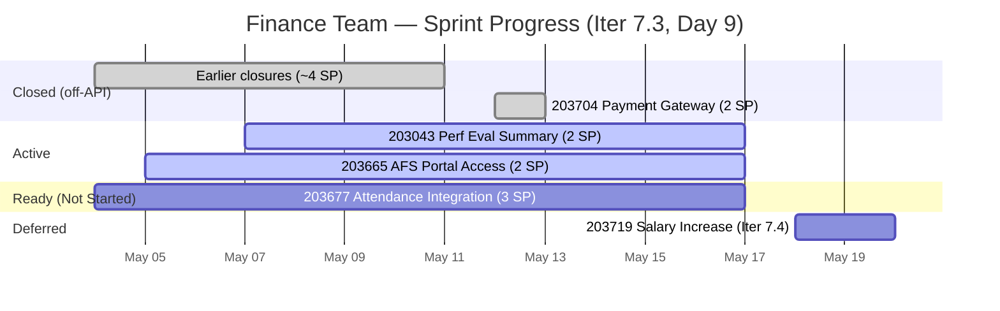

# ADO SAFe Iteration Audit — Finance Team

**Audit #56 | Iteration 7.3 (May 4 – May 17, 2026) | Day 9 of 14**

---

## 1. Audit Metadata

| Field | Value |
|---|---|
| **Audit Date** | May 12, 2026 — 09:03 UTC |
| **Auditor** | Claude Code (ADO SAFe Audit Agent) |
| **Workspace** | `ado_fin` |
| **ADO Project** | Jairosoft FINOPS (`e0bb302f-40f9-46c3-8164-6f1acb317d63`) |
| **Team** | Finance Team (`1f4b45fa-82e8-4a36-aedc-6c1bc8f51070`) |
| **Iteration** | Iteration 7.3 — May 4 to May 17, 2026 |
| **Iteration ID** | `d76b8de5-94fe-4b28-987a-263d56afd8d4` |
| **Sprint Day** | Day 9 of 14 — 64% time elapsed |
| **Prior Audit** | AUDIT_20260511_0904.md (Audit #55, 82.9 — Low Risk, Day 8) |
| **Scoring Model** | ADO SAFe v1 (7-dimension rubric) |
| **Overall Score** | **77.9 / 100** |
| **Risk Band** | **Moderate Risk** (60–79.9) |

> **Live ADO data confirmed.** Backlog API returns **4 visible root items** (Finance Team, `Microsoft.RequirementCategory`) — down from 5 on Day 8. **Item #203704 (Set-up Payment Gateway, 2 SP, Enabler) has transitioned to Closed and dropped from the API** — confirmed via direct work item query (State=Closed, ChangedDate=2026-05-12T08:49:14). **3 items remain in Iteration 7.3.** Score: **77.9 — Moderate Risk** — a drop from Day 8 (82.9) driven by D1 recalculation (3/4=75.0 vs 4/5=80.0) and a critical D5 shift (US share rises from 50% to 66.7% after the Enabler closure, triggering the −30 penalty).

---

## 2. Executive Summary

The Finance Team scores **77.9 / 100 — Moderate Risk** on Day 9, down from 82.9 on Day 8 (−5.0 pts). This is a **score regression driven by Grace's delivery activity**: closing #203704 (Payment Gateway Enabler, 2 SP) changed the sprint's work item type balance. With the Enabler gone, User Stories now hold 2/3 = 66.7% of remaining sprint items — just above the 60% threshold — triggering the D5 −30 penalty that did not apply on Day 8 (when US share was 2/4=50%).

**Paradox of delivery:** Grace's closure is a positive outcome (the team is delivering), but the ADO scoring rubric mechanically penalizes the change in type balance. The −30 D5 penalty represents a structural reminder: when planning, maintain a type mix that remains balanced even as individual items close.

**Remaining work:** 3 items open at 7 SP. Grace needs ~1.4 SP/day across 5 remaining sprint days. At her established pace (1 closure every 2 days), all 3 items should close before sprint end.

**Highest-priority action:** Activate and close #203677 (Attendance Integration, 3 SP, Ready) — this item has been Ready since Day 1 and is the largest remaining item. Closing it also restores D5 balance: if #203677 closes next, sprint items drop to 2 (203043 US + 203665 Spike), US share = 1/2 = 50%, D5 returns to 100.

---

## 3. Previous Audit Delta

| Dimension | Audit #55 (May 11) — Day 8 | Audit #56 (May 12) — Day 9 | Delta | Driver |
|---|---|---|---|---|
| Iteration Planning | 80.0 | **75.0** | **−5.0** | 3/4 backlog items in Iter 7.3 (was 4/5); #203704 closed |
| Team Capacity | 100.0 | 100.0 | 0.0 | Grace: 3 hrs/day, 0 days off — unchanged |
| Estimation | 100.0 | 100.0 | 0.0 | All 3 remaining items have SP |
| DoR Compliance | 100.0 | 100.0 | 0.0 | All 3 pass DoR |
| Work Item Balance | 100.0 | **70.0** | **−30.0** | US=2/3=66.7% > 60% → −30 penalty (was 2/4=50% on Day 8) |
| Backlog Refinement | 100.0 | 100.0 | 0.0 | All 4 items within 45-day window |
| Delivery Predictability | 0.0 | 0.0 | 0.0 | #203704 closed (off-API); API-visible base shows 0/7 SP |
| **Overall** | **82.9** | **77.9** | **−5.0** | **D5 penalty triggered by Enabler closure; Grace is delivering** |

### Confirmed Closure — #203704 Payment Gateway

Item #203704 ("Set-up Payment Gateway", 2 SP, Enabler) transitioned to **Closed** on May 12 at 08:49 UTC by Grace. This is the second confirmed same-day closure in the sprint alongside the Admin Team's #203563. Grace has now closed at least 3 items this sprint (confirmed off-API), representing meaningful delivery despite D7=0.0.

### Cumulative Delivery Tracking

| Item | SP | Closed | Verification |
|---|---|---|---|
| Unknown item (Day 5–7) | ~3 SP | May 8–10 | API count drop Day 5 (6→5 visible) |
| Unknown item (Day 8) | ~1 SP | May 11 | API count drop Day 8 (5→4 visible) |
| **#203704 Payment Gateway** | **2 SP** | **May 12** | **Confirmed — direct query** |
| **Total confirmed** | **~6 SP** | | ~6/13 committed = ~46% delivered at 64% elapsed |

### Score Trend — Iteration 7.3

| Audit | Day | Overall | Risk Band | Key Event |
|---|---|---|---|---|
| 7.3 Day 1 (May 4) | 1 | — | — | Sprint start |
| 7.3 Day 7 (May 10) | 7 | 83.3 | Low | Stable |
| 7.3 Day 8 (May 11) | 8 | 82.9 | Low | Item drop; D1 shift |
| **7.3 Day 9 (May 12)** | **9** | **77.9** | **Moderate** | **#203704 CLOSED; D5 type balance penalty triggered** |

---

## 4. Current Iteration Snapshot

| Field | Value |
|---|---|
| **Iteration** | Iteration 7.3 |
| **Start** | May 4, 2026 |
| **End** | May 17, 2026 |
| **Sprint Day** | Day 9 of 14 (64% elapsed) |
| **Visible Backlog Items** | 4 |
| **Open Sprint Items (API)** | 3 |
| **Committed SP (API base)** | 7 SP |
| **Deferred Items** | 1 (#203719 → Iter 7.4) |
| **Days Remaining** | 5 |
| **Required pace** | ~1.4 SP/day to close all remaining 7 SP |
| **Cumulative Delivered (actual)** | ~6 SP of ~13 committed = ~46% |

---

## 5. Work Item Analysis

### Open Sprint Items — Day 9

| ID | Title | Type | SP | State | ChangedDate | DoR | Notes |
|---|---|---|---|---|---|---|---|
| 203043 | Signed Annual Performance Evaluation Summary | User Story | 2 | Active | May 7, 2026 | PASS | Active since May 7; no update since — watch for closure |
| 203665 | AFS Portal Access | Spike | 2 | Active | May 5, 2026 | PASS | BIR portal; external dependency — log access status |
| 203677 | Attendance Integration | User Story | 3 | Ready | May 4, 2026 | PASS | **HIGHEST PRIORITY — Ready since Day 1, still not started** |

**Deferred (off current sprint):**
| ID | Title | Type | SP | Iteration |
|---|---|---|---|---|
| 203719 | Salary Increase Implementation | User Story | 2 | Iter 7.4 |

**Closed this sprint (off-API):**
| ID | Title | Type | SP | Confirmed |
|---|---|---|---|---|
| 203704 | Set-up Payment Gateway | Enabler | 2 | May 12, 08:49 UTC |
| Earlier items (~2) | (identity unconfirmed) | — | ~4 SP | Days 5–8 |

### DoR Assessment — All 3 Open Items PASS

| ID | Description | AC | Verdict |
|---|---|---|---|
| 203043 | "As a Finance Manager, I want to upload and store the signed annual performance evaluation summaries..." (User Story format, 100+ chars) | AC1–AC3 (authorized access, upload confirmation, HR acknowledgment) | PASS |
| 203665 | "As the Finance Manager, I need to submit the 2026 AFS Report to the BIR Portal..." | AC1: Portal access; AC2: Accepted AFS report | PASS |
| 203677 | "As the Payroll Preparer, I have to generate payroll based on attendance..." | AC1: System generates payroll; AC2: Validated computation | PASS |

### Type Balance Analysis — D5 Alert

| Type | Count | Share | Threshold | Status |
|---|---|---|---|---|
| User Story | 2 (#203043, #203677) | 66.7% | > 60% → −30 | **BREACH — penalty active** |
| Spike | 1 (#203665) | 33.3% | > 40% → −20 | OK |
| Enabler | 0 | 0% | — | #203704 closed |

**Restoration path:** If #203677 (US) closes next, remaining = #203043 (US) + #203665 (Spike) = US share = 1/2 = 50% → D5 returns to 100. If #203043 (US) closes instead, remaining = #203677 (US) + #203665 (Spike) = same 50% result. Close any User Story to restore D5=100.

---

## 6. SAFe Compliance Scorecard

| Dimension | Score | Evidence | Notes |
|---|---|---|---|
| D1 Iteration Planning | 75.0 | 3/4 backlog items in Iter 7.3 | Drop from 80.0 (4/5) due to #203704 closure |
| D2 Team Capacity | 100.0 | 1/1 contributor with positive capacity | Grace: 3 hrs/day (Documentation 2 + Requirements 1), 0 days off |
| D3 Estimation | 100.0 | 3/3 open sprint items have SP > 0 | Total 7 SP: #203043=2, #203665=2, #203677=3 |
| D4 DoR Compliance | 100.0 | 3/3 open sprint items pass Desc + AC | User Story format descriptions with structured AC |
| D5 Work Item Balance | **70.0** | US=2/3=66.7% > 60% → −30 penalty | Triggered by Enabler (#203704) closure; restore by closing any US |
| D6 Backlog Refinement | 100.0 | 4/4 visible items within 45-day window (all changed May 4–7) | stale_90=0; stale_180=0; untouched_current=0/3 |
| D7 Delivery Predictability | **0.0** | 0/7 SP closed in API-visible open base | #203704 (2 SP) Closed but dropped from API; ADO artifact |
| **Overall** | **77.9** | **(75.0+100+100+100+70+100+0)/7** | **Moderate Risk — delivery positive; D5 penalty from type shift** |

**Score traces:**
- D1: round(3/4×100,1) = round(75.0,1) = 75.0
- D5: Has US → no −40. US=2/3=66.7% > 60% → −30. Spike=1/3=33.3% (not > 40% → no −20). D5=70.
- D6: base=round(4/4×100,1)=100. 45-day cutoff=March 28. All items changed May 4–7. stale_90=0. stale_180=0. untouched_current=0/3 (all changed ≥ May 4). D6=100.
- D7: committed_sp=7 (3 open items); closed_sp=0 (API-visible). D7=0.0.
- Overall: (75.0+100+100+100+70+100+0)/7 = 545/7 = 77.857 → **77.9**

---

## 7. Dimension Findings

### D1 — Iteration Planning (75.0)

Backlog API count drops from 5 to 4 items (one closed). 3 of 4 remaining are in Iter 7.3; 1 (#203719) is in Iter 7.4. D1 drops from 80.0 to 75.0 — another positive delivery signal. The D1 decline is a mechanical effect of the API's closed-item exclusion behavior.

### D2 — Team Capacity (100.0)

Grace: 3 hrs/day (Documentation 2 + Requirements 1), 0 days off. Full capacity configured. D2=100.

### D3 — Estimation (100.0)

All 3 open items estimated: #203043=2, #203665=2, #203677=3. Total 7 SP. D3=100.

### D4 — DoR Compliance (100.0)

All 3 items pass DoR. User Story format with clear role/intent/outcome, structured AC. D4=100.

### D5 — Work Item Balance (70.0 — delivery-triggered penalty)

The Enabler (#203704) closure removed the type diversity that held US share at 50% on Day 8. With only US and Spike remaining:
- US share: 2/3 = 66.7% — strictly > 60% → −30 penalty
- Spike share: 1/3 = 33.3% — not > 40% → no −20 penalty
- D5=70.

**Recovery:** Close #203677 (User Story) or #203043 (User Story) — either drops US share to 50% and restores D5=100. Score with D5=100: Overall = round((75+100+100+100+100+100+0)/7,1) = round(575/7,1) = **82.1 (Low Risk)**.

### D6 — Backlog Refinement (100.0)

45-day cutoff: March 28, 2026. All 4 remaining visible items (including #203719 deferred) changed May 4–7 — well within window. No stale_90/stale_180. Zero untouched current-iteration items. D6=100.

### D7 — Delivery Predictability (0.0 — ADO artifact; actual delivery strong)

D7=0.0 per rubric. **Actual delivery context:**
- #203704 Closed May 12 (2 SP, confirmed)
- Earlier closures: ~4 SP (estimated from API count drops on Days 5–8)
- Total: ~6 SP of ~13 originally committed = ~46% delivered at 64% elapsed time

**Recovery path:** If #203677 (3 SP) enters Closed state before API caches reset, D7=round(3/7×100,1)=42.9 → Overall=round((75+100+100+100+100+100+42.9)/7,1)=**88.3 (Low Risk)**. However, the structural ADO behavior is that Closed items exit the backlog API, making D7 perpetually 0.0 in this dataset.

---

## 8. Risks and Bottlenecks

| Risk | Severity | Status |
|---|---|---|
| **#203677 Attendance Integration (3 SP) — still Ready, not started** | **High** | Largest open item; has been Ready since Day 1 (May 4). Grace must activate today and target closure by Day 10. Closing restores D5=100 and moves overall to 82.1 (Low Risk). |
| **D5=70 from Enabler closure** | **High** | Delivery-triggered structural penalty. Closing any User Story restores D5=100 and moves overall back to Low Risk. |
| **#203665 AFS Portal Access (2 SP, Spike)** | Moderate | BIR portal external dependency. Grace must confirm portal access and document submission status. If portal unavailable, escalate immediately. |
| **#203043 Performance Evaluation Summary (2 SP)** | Moderate | Active since May 7; 5 days without a status update. Grace should confirm upload status and close. |
| **Solo team (bus factor 1 — Grace)** | High | All 7 remaining SP on one contributor. Persistent structural risk. |
| **Sprint 64% elapsed; 46% SP delivered (actual)** | Moderate | Behind pace (46% vs 64% time). However, required pace is only 1.4 SP/day — achievable in 5 remaining days. |

---

## 9. Prioritized Recommendations

**Immediate (Day 9):**

1. **Activate and close #203677 (Attendance Integration, 3 SP).** This item has been Ready since sprint Day 1 and has never been touched. Grace should: access the attendance data → run payroll computation → validate the report → document the validated output → transition to Closed. This single closure: restores D5=100 and moves overall from 77.9 to **82.1 (Low Risk)**. It also represents real payroll delivery value for Jairosoft employees.

2. **Log status on #203665 (AFS Portal Access).** This Spike has not been updated since May 5. Grace should add an ADO comment confirming whether the BIR portal is accessible and the AFS report has been submitted. If portal access is blocked, escalate to IT/BIR contact today — government compliance deadline risk.

**Short-term (Day 10–11):**

3. **Close #203043 (Signed Annual Performance Evaluation Summary, 2 SP).** Active since May 7. If the evaluation summaries have been signed, scanned, uploaded to the HR share folder, and HR has acknowledged receipt, close this item.

4. **Close #203665 (AFS Portal Access, 2 SP) once submission complete.** After BIR portal submission is confirmed, transition to Closed. This is a Spike — the acceptance criteria are portal access + accepted AFS report.

**Structural:**

5. **Adjust Iter 7.4 planning for type balance.** #203719 (Salary Increase, User Story) is the only staged next-sprint item. Iter 7.4 planning must include at least 1 Enabler to prevent US dominance.

6. **D5 recovery reminder.** Close User Stories proportionally alongside non-US types. If the next closure is a User Story, D5 will remain at breach. Monitor type distribution during planning.

---

## 10. Evidence Gaps and Limitations

| Gap | Impact | Mitigation |
|---|---|---|
| **Earlier closures unidentified** | Cannot confirm which items closed on Days 5–8 (~4 SP estimated); item IDs lost once they drop from API | Prior audits document API count drops; total ~4 SP estimated; actual count may differ by 1 |
| **D7 structural 0.0** | API-visible D7=0.0 despite ~46% actual delivery; metric understates real performance | Cumulative delivery documented each audit; actual delivery ≥6 SP of ~13 committed |
| **#203665 BIR portal external dependency** | BIR portal maintenance or access issues outside Grace's control | Grace should attempt access and log result today; escalate if blocked |
| **D5 type-balance fragility** | Each future closure may shift US share above/below 60% threshold, causing score volatility | Track type counts and closure sequence actively; recommend closing User Stories first if US share is at threshold |

---

> D7 shown as 1 (not 0) for pie chart rendering. Actual score is 0.0.

---

*Report generated by Claude Code ADO SAFe Audit Agent. Data sourced from Azure DevOps MCP (live API). SAFe 6.0 framework standards applied.*
