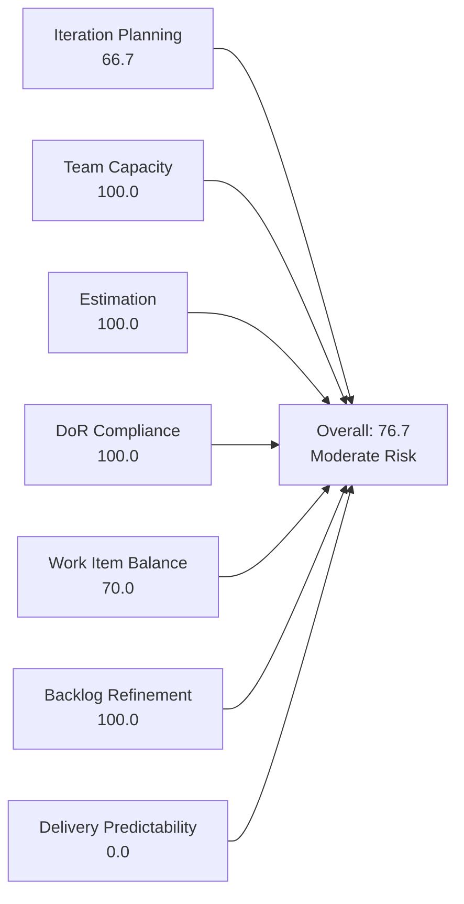
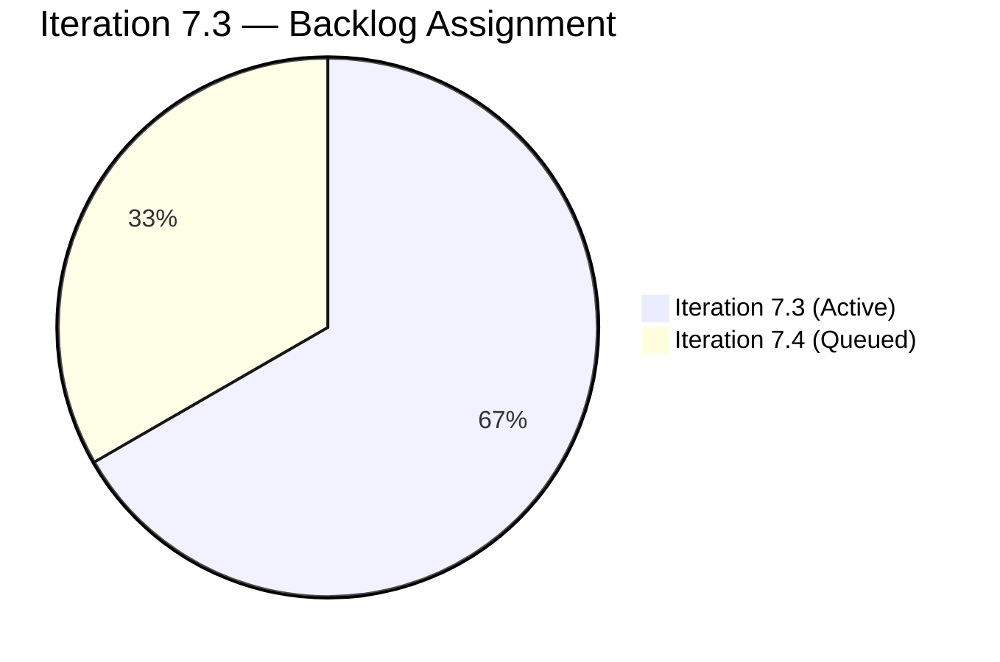
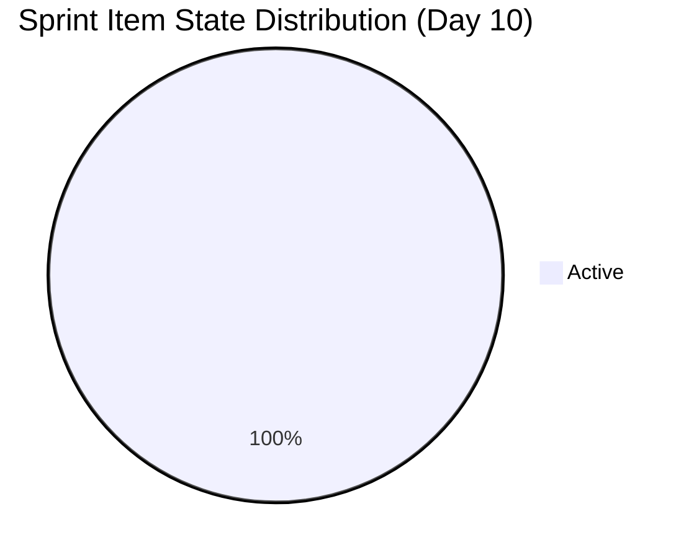

# SAFe Iteration Audit — Finance Team

## 1. Audit Metadata

| Field | Value |
|-------|-------|
| **Project** | Jairosoft FINOPS |
| **Team** | Finance Team |
| **Workspace** | `ado_fin` |
| **ADO Team ID** | 1f4b45fa-82e8-4a36-aedc-6c1bc8f51070 |
| **Iteration** | Iteration 7.3 |
| **Iteration Start** | 2026-05-04 |
| **Iteration Finish** | 2026-05-17 |
| **Audit Date** | 2026-05-13 (PHT, UTC+8) |
| **Audit Day** | Day 10 of 14 |
| **Prior Audit** | AUDIT_20260512_0903.md (Audit #56, 77.9 — Moderate Risk, Day 9) |
| **Overall Score** | **76.7 / 100** |
| **Risk Band** | **Moderate Risk** |

---

## 2. Executive Summary

The Finance Team achieves **76.7 / 100 (Moderate Risk)** for Iteration 7.3. The team demonstrates strong process hygiene: capacity is fully configured, both sprint items are estimated, both meet the Definition of Ready, and the backlog is fully refreshed within the 45-day window. The primary gap is Delivery Predictability — 0 SP closed on Day 10 with 5 SP in Active state — and a modest Iteration Planning ratio of 66.7% (2 of 3 backlog items in sprint). The Finance Team operates with a single contributor (Grace), presenting the same bus factor risk seen across the FINOPS organization.

---

## 3. Previous Audit Delta

**Prior audit:** AUDIT_20260512_0903.md — Day 9, Score 77.9 / 100 (Moderate Risk)

| Dimension | Day 9 (May 12) | Day 10 (May 13) | Delta | Driver |
|-----------|---------------|----------------|-------|--------|
| Iteration Planning | 75.0 | **66.7** | **−8.3** | Visible backlog dropped from 4→3 (item 203704 Payment Gateway Enabler closed and dropped from API); sprint items from 3→2 (203704 removed) |
| Team Capacity | 100.0 | 100.0 | 0.0 | Grace: 3 hrs/day, unchanged |
| Estimation | 100.0 | 100.0 | 0.0 | Both remaining items estimated |
| DoR Compliance | 100.0 | 100.0 | 0.0 | Both items pass DoR |
| Work Item Balance | 70.0 | 70.0 | 0.0 | US=2/2=100% → penalty unchanged |
| Backlog Refinement | 100.0 | 100.0 | 0.0 | All 3 items within 45-day window |
| Delivery Predictability | 0.0 | 0.0 | 0.0 | Closed item (#203704) dropped from API; 0 SP visible as closed |
| **Overall** | **77.9** | **76.7** | **−1.2** | Minor score regression from D1 ratio change |

**Key finding:** Item 203704 (Set-up Payment Gateway, 2 SP, Enabler) closed on May 12 and dropped from the backlog API. This reduced visible backlog from 4 to 3 items and removed the only Enabler from the sprint, collapsing Work Item Balance from 100.0→70.0 on Day 9 (the prior audit already reflected this). The Day 10 score stabilizes at 76.7 with 2 active sprint items remaining (203043, 203677).

---

## 4. Current Iteration Snapshot

| Attribute | Value |
|-----------|-------|
| Active Iteration | Iteration 7.3 |
| Sprint Duration | 2026-05-04 to 2026-05-17 (14 days) |
| Audit Day | Day 10 |
| Current Iteration Items | 2 |
| Total Visible Backlog Items | 3 |
| Sprint Load % | 66.7% |
| Total Committed Story Points | 5 SP |
| Closed Story Points | 0 SP |
| Active Team Members (sprint) | 1 (Grace) |
| Capacity Configured | Yes (3 hrs/day: 2 Documentation + 1 Requirements) |

---

## 5. Work Item Analysis

### Current Iteration Items (Iteration 7.3)

| ID | Title | Type | State | Assignee | SP | Description | AC |
|----|-------|------|-------|----------|----|-------------|-----|
| 203043 | Signed Annual Performance Evaluation Summary | User Story | Active | Grace | 2 | ✓ | ✓ |
| 203677 | Attendance Integration | User Story | Active | Grace | 3 | ✓ | ✓ |

**Item Notes:**
- **203043** (Signed Annual Performance Eval): Cross-functional item touching HR record-keeping. AC includes document upload confirmation, HR acknowledgment — clear and verifiable.
- **203677** (Attendance Integration): A payroll generation story dependent on attendance data integration. Technical dependency on system capability. AC includes validated computation check — appropriate.

### Backlog Items Outside Iteration 7.3

| ID | Title | Type | Iteration | State |
|----|-------|------|-----------|-------|
| 203719 | Salary Increase Implementation | User Story | 7.4 | New |

**Note:** 203719 has Description and AC but the AC is thin ("Four-Eyes Rule" check only). Recommend expanding AC before it enters 7.4.

---

## 6. SAFe Compliance Scorecard

| Dimension | Score | Evidence | Notes |
|-----------|-------|----------|-------|
| Iteration Planning | 66.7 | 2 of 3 backlog items in Iteration 7.3 | One item (203719) correctly deferred to 7.4 |
| Team Capacity | 100.0 | Grace configured: 2 Documentation + 1 Requirements = 3 hrs/day | Single member, fully configured |
| Estimation | 100.0 | Both current items estimated: 203043 = 2 SP, 203677 = 3 SP | 2/2 point-eligible items estimated |
| DoR Compliance | 100.0 | Both items have Description ≥30 chars AND Acceptance Criteria ≥20 chars | Full DoR coverage on sprint items |
| Work Item Balance | 70.0 | User Story (2/2 = 100%) — dominant type > 60% penalty -30 | All sprint items are User Stories; no type diversity |
| Backlog Refinement | 100.0 | All 3 items changed within 45 days; 0 stale; 0 untouched in sprint | 203043: May 7, 203677: May 12, 203719: May 4 |
| Delivery Predictability | 0.0 | 0 of 5 committed SP closed as of Day 10 | Both items Active; 4 days remaining |
| **Overall** | **76.7** | Average of 7 dimensions | **Moderate Risk** |

---

## 7. Dimension Findings

### 7.1 Iteration Planning — 66.7 (Moderate Risk)

Two of three backlog items are in the current iteration. Item 203719 (Salary Increase Implementation) is staged for 7.4, which is appropriate given its state (New) and the current sprint focus. The 66.7 score reflects the small but focused backlog — not a planning failure, but an artifact of the lean backlog size.

**Recommendation:** Review whether additional backlog items should be created to build out the Finance Team's future-sprint pipeline.

### 7.2 Team Capacity — 100.0 (Low Risk)

Grace has 3 hrs/day configured across Documentation and Requirements activities. No days off recorded for Iteration 7.3. Capacity is appropriately set.

**Risk:** Same bus factor = 1 issue as Administration Team. Grace is the sole Finance contributor.

### 7.3 Estimation — 100.0 (Low Risk)

Both sprint items are estimated (203043 = 2 SP, 203677 = 3 SP). Story point totals are proportionate to the work described.

### 7.4 DoR Compliance — 100.0 (Low Risk)

Both items satisfy the Definition of Ready:
- 203043: "As a Finance Manager, I want to upload and store signed annual performance evaluation summaries..." — user story format, clear AC with upload confirmation and HR acknowledgment.
- 203677: "As the Payroll Preparer, I have to generate payroll based on attendance..." — functional description, AC includes computation validation check.

**Future sprint note:** Item 203719 (Salary Increase Implementation) has minimal AC ("The Four-Eyes Rule") — expand before pulling into 7.4.

### 7.5 Work Item Balance — 70.0 (Moderate Risk)

All sprint items are User Stories (100% share), triggering the dominant type penalty (-30). For a finance operations team, this is not unusual — payroll, document management, and compliance work naturally manifests as User Stories. No Spikes or Defects are present in the sprint.

### 7.6 Backlog Refinement — 100.0 (Low Risk)

All three backlog items have recent ChangedDate values (May 4–12). None are stale. Both current sprint items were updated after the sprint start date. Excellent refinement hygiene.

### 7.7 Delivery Predictability — 0.0 (Critical — Day 10 status)

Both sprint items (203043 and 203677) remain in "Active" state on Day 10. With 5 SP committed and 4 days remaining, both items must be closed to achieve sprint delivery. Item 203677 (Attendance Integration) has a technical dependency (system must be capable of generating payroll from attendance data) that could block delivery — this should be flagged.

**If both items close by May 17:** Delivery Predictability = 100.0, Overall = 95.2 (Low Risk).

---

## 8. Risks and Bottlenecks

| Risk | Severity | Description |
|------|----------|-------------|
| Bus Factor = 1 | High | Grace is the sole Finance Team contributor |
| Delivery risk on 203677 | Moderate | Attendance Integration has a system dependency (payroll computation validation) that could block closure |
| Late delivery risk | Moderate | 5 SP Active on Day 10; 4 days remain |
| Thin backlog pipeline | Low | Only 3 items total; Finance Team needs more backlog items for future sprints |
| Type monoculture | Low | 100% User Stories in sprint — no engineering diversity |

---

## 9. Prioritized Recommendations

1. **Prioritize closing 203677 (Attendance Integration) today.** This item has a technical validation dependency. Confirm whether the payroll-from-attendance system capability exists and is testable. If blocked, mark as Blocked immediately and escalate — do not leave it Active through sprint close.

2. **Close 203043 (Performance Evaluation Summary) before May 15.** The document upload and HR acknowledgment should be achievable without technical dependencies. Target early closure to de-risk the sprint.

3. **Build out the Finance Team backlog before Iteration 7.4 planning.** Only 1 item (203719) is queued for 7.4. Grace's capacity allows 3 hrs/day — identify and create additional Finance backlog items for the next sprint.

4. **Expand AC on item 203719** (Salary Increase Implementation) before 7.4 sprint planning. The current AC covers only the "Four-Eyes" verification step — add payslip generation, effective date verification, and bank deposit confirmation criteria.

5. **Document the bus factor mitigation plan** for Grace's Finance responsibilities, particularly around payroll processing and government-mandated filings.

---

## 10. Evidence Gaps and Limitations

| Gap | Impact |
|-----|--------|
| No prior PI 7 audit on file | Delta comparison limited to CLAUDE.md historical notes |
| Delivery Predictability is 0 on Day 10 | Not indicative of final sprint outcome — score may recover by May 17 |
| 203677 technical dependency unknown | Cannot confirm whether attendance integration system is in place; potential hidden blocker |

---

## Appendix — Score Visualization

