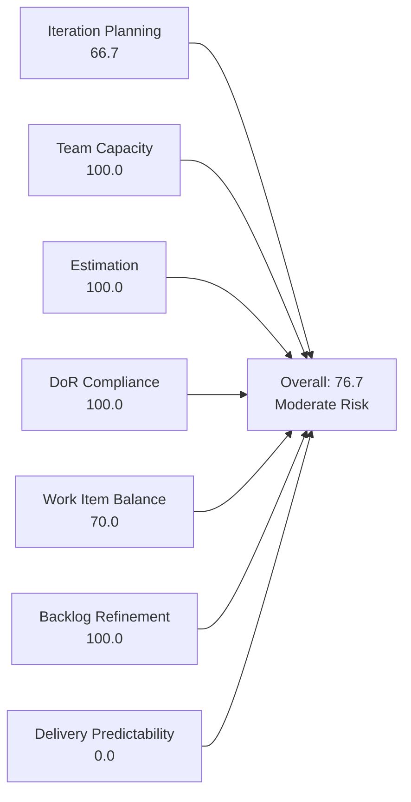
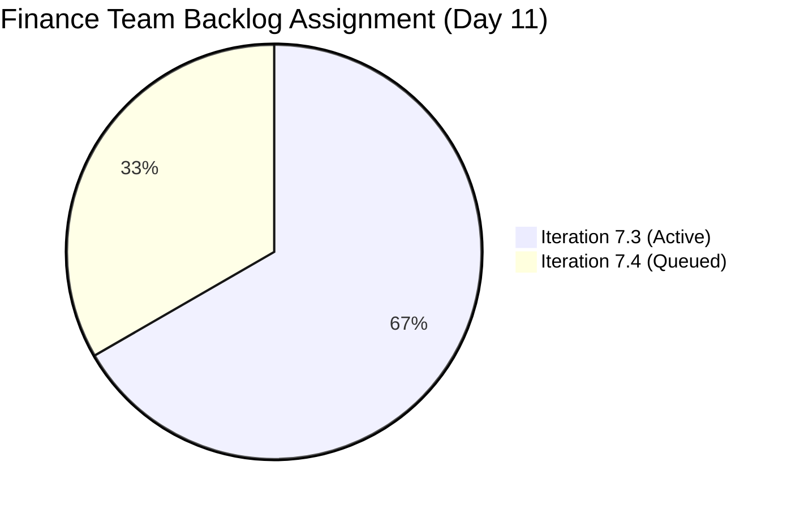
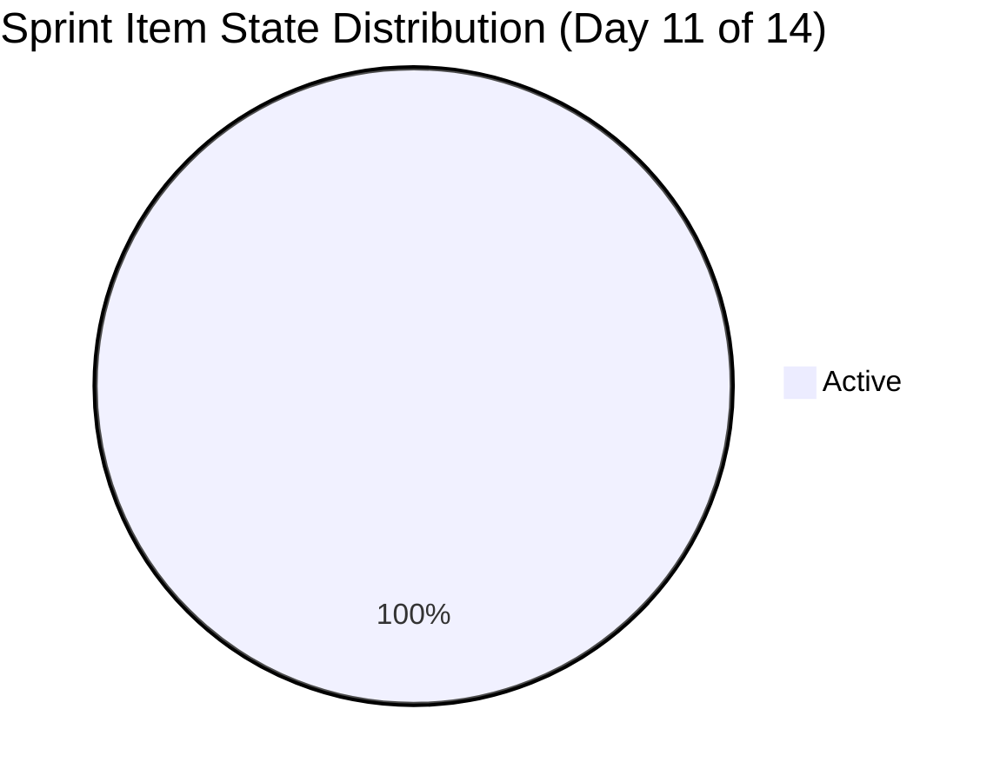
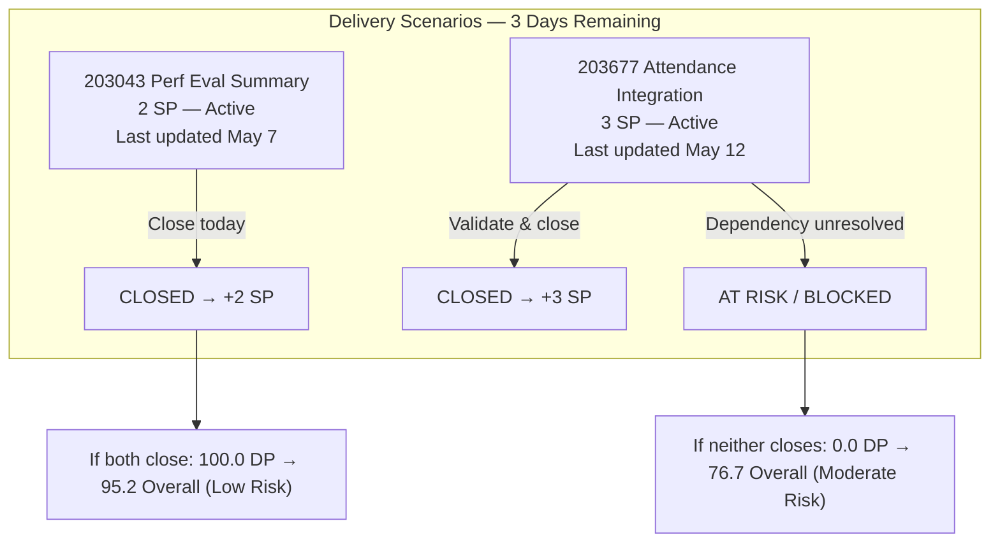

# SAFe Iteration Audit — Finance Team

## 1. Audit Metadata

| Field | Value |
|-------|-------|
| **Project** | Jairosoft FINOPS |
| **Team** | Finance Team |
| **Workspace** | `ado_fin` |
| **ADO Project ID** | e0bb302f-40f9-46c3-8164-6f1acb317d63 |
| **ADO Team ID** | 1f4b45fa-82e8-4a36-aedc-6c1bc8f51070 |
| **Iteration** | Iteration 7.3 |
| **Iteration Start** | 2026-05-04 |
| **Iteration Finish** | 2026-05-17 |
| **Audit Date** | 2026-05-14 (CDT) |
| **Audit Day** | Day 11 of 14 |
| **Prior Audit** | AUDIT_20260513_1200.md (Day 10, 76.7 — Moderate Risk) |
| **Overall Score** | **76.7 / 100** |
| **Risk Band** | **Moderate Risk** |

---

## 2. Executive Summary

The Finance Team holds at **76.7 / 100 (Moderate Risk)** on Day 11 of Iteration 7.3 — unchanged from Day 10. Grace remains the sole contributor with 2 sprint items (203043 and 203677) both in Active state and 0 SP closed. Five story points are committed with three days left to deliver. Team Capacity, Estimation, DoR Compliance, and Backlog Refinement all score 100. Delivery Predictability at 0.0 is the only critical gap. The score will jump to 95.2 (Low Risk) if both items close by May 17. The lean backlog pipeline (only 3 items total, 1 queued for 7.4) remains a structural concern for future sprint sustainability.

---

## 3. Previous Audit Delta

**Prior audit:** AUDIT_20260513_1200.md — Day 10, Score 76.7 / 100 (Moderate Risk)

| Dimension | Day 10 (May 13) | Day 11 (May 14) | Delta | Driver |
|-----------|----------------|----------------|-------|--------|
| Iteration Planning | 66.7 | **66.7** | 0.0 | Backlog unchanged (3 items, 2 in sprint) |
| Team Capacity | 100.0 | **100.0** | 0.0 | Grace configured; unchanged |
| Estimation | 100.0 | **100.0** | 0.0 | Both sprint items estimated; unchanged |
| DoR Compliance | 100.0 | **100.0** | 0.0 | Both sprint items pass DoR |
| Work Item Balance | 70.0 | **70.0** | 0.0 | User Story monoculture; unchanged |
| Backlog Refinement | 100.0 | **100.0** | 0.0 | All 3 items within 45-day window |
| Delivery Predictability | 0.0 | **0.0** | 0.0 | No new closures; both items remain Active |
| **Overall** | **76.7** | **76.7** | **0.0** | No change |

**Key finding (Day 11):** No state changes observed on either sprint item from Day 10. Item 203677 (Attendance Integration) was last changed May 12 and item 203043 (Signed Annual Performance Evaluation Summary) was last changed May 7. Neither has moved since the prior audit. With 3 days remaining, delivery requires immediate action by Grace today.

---

## 4. Current Iteration Snapshot

| Attribute | Value |
|-----------|-------|
| Active Iteration | Iteration 7.3 |
| Sprint Duration | 2026-05-04 to 2026-05-17 (14 days) |
| Audit Day | Day 11 |
| Current Iteration Root Items | 2 |
| Total Visible Backlog Root Items | 3 |
| Sprint Load % | 66.7% |
| Total Committed Story Points | 5 SP |
| Closed Story Points | 0 SP |
| Active Team Members (sprint) | 1 (Grace) |
| Capacity Configured | Yes (3 hrs/day: 2 Documentation + 1 Requirements) |
| Days Off | 0 |

---

## 5. Work Item Analysis

### Current Iteration Items (Iteration 7.3)

| ID | Title | Type | State | Assignee | SP | Description | AC | Last Changed |
|----|-------|------|-------|----------|----|-------------|-----|-------------|
| 203043 | Signed Annual Performance Evaluation Summary | User Story | Active | Grace | 2 | ✓ | ✓ | 2026-05-07 |
| 203677 | Attendance Integration | User Story | Active | Grace | 3 | ✓ | ✓ | 2026-05-12 |

**Item Notes:**
- **203043** (Signed Annual Performance Eval, 2 SP): Last changed May 7 — 7 days ago with no state update. This is a document upload and HR acknowledgment task. No technical dependency. Closure should be achievable immediately if the signed summary is available.
- **203677** (Attendance Integration, 3 SP): Last changed May 12. This item requires the payroll system to generate computations from attendance data. Technical dependency exists. AC includes "validated report if the generated computation is correct" — requires active testing.

### Backlog Items Outside Iteration 7.3

| ID | Title | Type | Iteration | State | SP | Last Changed |
|----|-------|------|-----------|-------|----|-------------|
| 203719 | Salary Increase Implementation | User Story | 7.4 | New | 2 | 2026-05-04 |

**Note:** Item 203719 has a thin AC ("The Four-Eyes Rule" verification only). Recommend expanding AC before 7.4 sprint planning to include payslip generation verification, effective date confirmation, and bank deposit matching.

---

## 6. SAFe Compliance Scorecard

| Dimension | Score | Evidence | Notes |
|-----------|-------|----------|-------|
| Iteration Planning | 66.7 | 2 of 3 backlog items in Iteration 7.3 | 1 item correctly deferred to 7.4; lean but appropriately scoped |
| Team Capacity | 100.0 | Grace: 2 Documentation + 1 Requirements = 3 hrs/day; no days off | Single contributor, fully configured |
| Estimation | 100.0 | 203043 = 2 SP, 203677 = 3 SP | 2/2 point-eligible items estimated |
| DoR Compliance | 100.0 | Both items have Description ≥30 chars AND AC ≥20 chars | Full DoR coverage on sprint items |
| Work Item Balance | 70.0 | User Story: 2/2 = 100% — dominant type >60% penalty −30 | Finance operations naturally produces User Story items |
| Backlog Refinement | 100.0 | All 3 items changed within 45 days; 0 stale >90d; 0 untouched in sprint | 203043: May 7, 203677: May 12, 203719: May 4 |
| Delivery Predictability | 0.0 | 0 of 5 committed SP closed as of Day 11 | Both items Active; 3 days remaining |
| **Overall** | **76.7** | Average of 7 dimensions | **Moderate Risk** |

---

## 7. Dimension Findings

### 7.1 Iteration Planning — 66.7 (Moderate Risk)

Two of three backlog items are assigned to Iteration 7.3. The third (203719 — Salary Increase Implementation) is appropriately staged for 7.4 in New state. The 66.7 score is an artifact of a small but well-managed backlog — not a planning deficiency. The Finance Team consistently maintains a lean backlog with appropriate sprint scoping.

**Structural concern:** The Finance Team has only 3 backlog items total. With 2 closing this sprint (if delivered), only 203719 will remain for 7.4. Additional backlog items need to be identified and created before 7.4 planning.

### 7.2 Team Capacity — 100.0 (Low Risk)

Grace has 3 hrs/day configured across Documentation and Requirements activities. No days off recorded for Iteration 7.3. Capacity planning is fully compliant.

**Persistent structural risk:** Bus factor = 1. Grace is the sole Finance Team contributor. All payroll, compliance, and finance work halts if she is unavailable. No coverage plan has been documented across multiple audit cycles.

### 7.3 Estimation — 100.0 (Low Risk)

Both sprint items are estimated (203043 = 2 SP, 203677 = 3 SP). Total commitment of 5 SP is proportionate to Grace's 3 hrs/day capacity over a 14-day sprint.

### 7.4 DoR Compliance — 100.0 (Low Risk)

Both sprint items satisfy the Definition of Ready:
- **203043**: User story format, clear document upload and HR acknowledgment acceptance criteria. No dependencies.
- **203677**: Functional description of payroll generation from attendance data. AC includes computation validation. Technical dependency on system capability.

**Note on 203043:** Item has been in Active state since at least Day 10 with last change on May 7. If the performance evaluation summary documents are available, this item should already be completable.

### 7.5 Work Item Balance — 70.0 (Moderate Risk)

All sprint items are User Stories (100% share), triggering the dominant type penalty (−30). Finance operations work (payroll, document management, compliance) naturally produces User Story items. No Spikes or Defects are present. This is a structural characteristic of the Finance Team backlog, not a process failure.

### 7.6 Backlog Refinement — 100.0 (Low Risk)

All three backlog items have recent ChangedDate values (earliest: 203719, May 4 = 10 days ago). No items are stale at 90 or 180 days. Both sprint items were updated after the sprint start date. Backlog hygiene remains excellent.

### 7.7 Delivery Predictability — 0.0 (Critical)

Both sprint items remain in "Active" state on Day 11 with 0 SP closed. With 5 SP committed and 3 days remaining:

- **If both items close by May 17:** Delivery Predictability = 100.0, Overall = 95.2 (Low Risk — improvement of +18.5 points).
- **If only 203043 closes:** Delivery Predictability = 40.0, Overall = 82.4 (Low Risk).
- **If neither closes:** Delivery Predictability = 0.0, Overall = 76.7 (Moderate Risk — current trajectory).

**Critical path:** Item 203677 (Attendance Integration) carries a technical dependency — the payroll system must be capable of generating attendance-based computation. If this capability is not confirmed, the item is effectively blocked and should be flagged immediately.

---

## 8. Risks and Bottlenecks

| Risk | Severity | Description |
|------|----------|-------------|
| Zero delivery on Day 11 | High | 5 SP Active with 3 days remaining; no closures recorded this sprint |
| 203677 technical dependency | High | Attendance integration requires payroll system capability; if not available, item is functionally blocked |
| Bus Factor = 1 | High | Grace is the sole Finance Team contributor |
| 203043 stale since May 7 | Moderate | Performance evaluation upload has not been updated in 7 days; potential silent blocker |
| Thin backlog pipeline | Low | Only 1 item (203719) queued for 7.4; Finance Team needs additional backlog grooming before next sprint |

---

## 9. Prioritized Recommendations

1. **Close 203043 (Performance Evaluation Summary) today.** This item has no technical dependency — it requires uploading a signed document to the HR share folder and receiving acknowledgment. If the document exists, Grace should complete this today and close the item. This recovers 2 SP and reduces delivery risk.

2. **Confirm or escalate the 203677 (Attendance Integration) dependency immediately.** Verify whether the payroll system can generate computation from attendance data. If the technical capability exists and the output is testable, Grace should validate and close the item by May 15. If the capability does not exist, mark the item as Blocked and escalate — do not carry it silently to sprint close.

3. **Create at least 3 new Finance Team backlog items before Iteration 7.4 planning.** With only 203719 queued for 7.4, Grace's 3 hrs/day capacity is significantly underutilized in the next sprint. Identify finance operations work: payroll cycles, regulatory compliance tasks, BIR filings, or system improvement items.

4. **Expand AC on 203719 (Salary Increase Implementation) before 7.4 sprint planning.** The current AC covers only the "Four-Eyes" verification step. Add: (a) payslip generation confirming new salary, (b) effective date verification in payroll system, (c) bank deposit confirmation against agreed amount.

5. **Document a Finance Team coverage plan.** Define who can handle payroll and compliance tasks if Grace is unavailable. Identify a secondary contact and document the escalation process in the team CLAUDE.md.

---

## 10. Evidence Gaps and Limitations

| Gap | Impact |
|-----|--------|
| 203677 technical dependency status unknown | Cannot confirm if the attendance-to-payroll system integration exists; potential hidden blocker |
| 203043 unchanged since May 7 | No comment or state update visible in API; could indicate a silent blocking condition |
| Single-contributor team | All metrics reflect one person's work; team-level aggregation is not meaningful here |
| Delivery Predictability = 0.0 on Day 11 | Score may recover to 100.0 by May 17; not indicative of final sprint outcome |

---

## Appendix — Score Visualization

