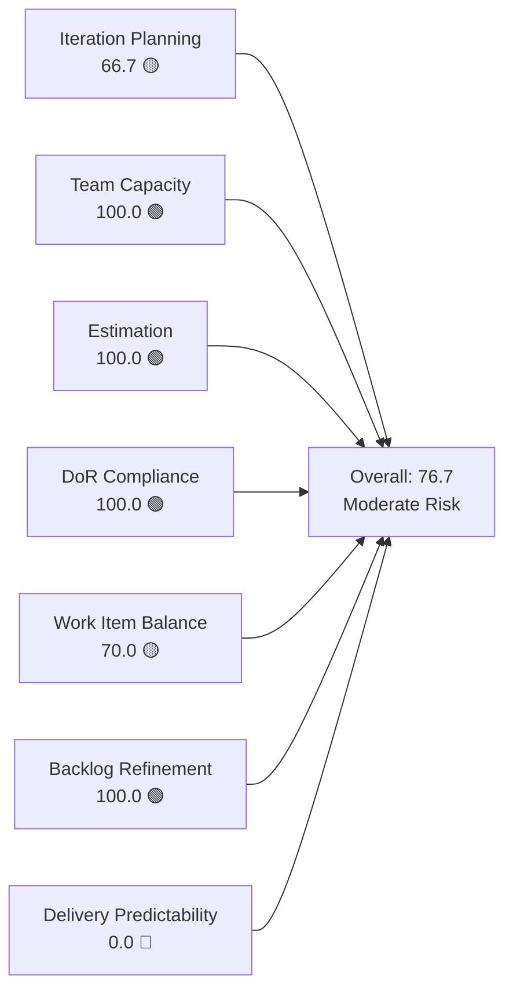
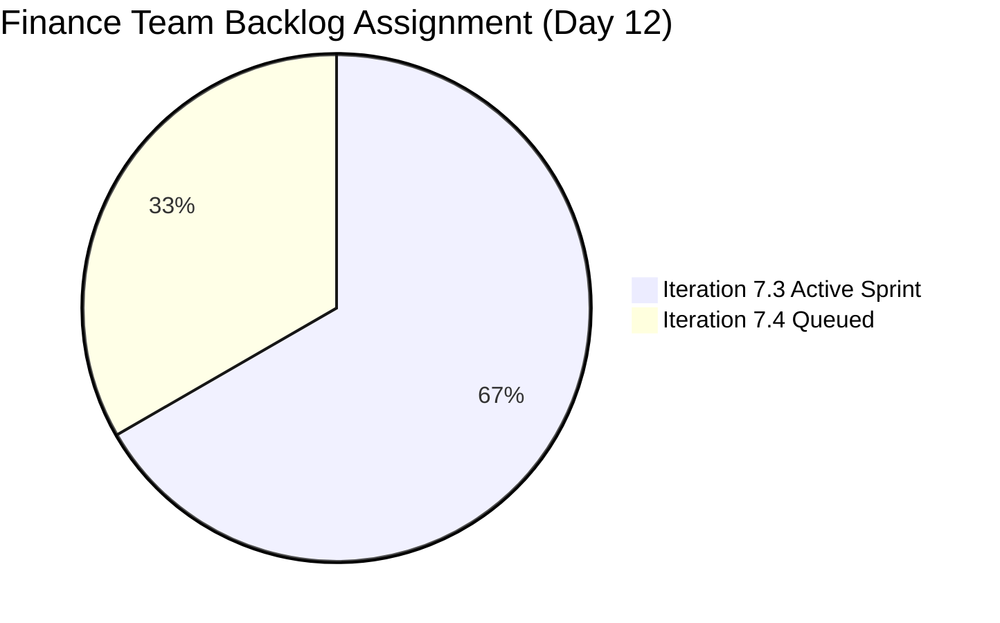
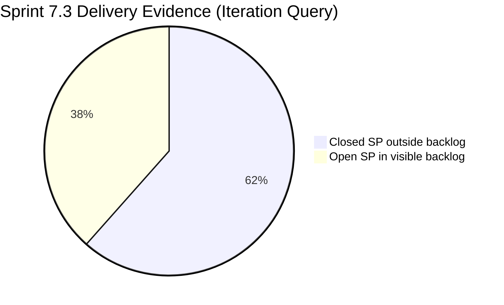
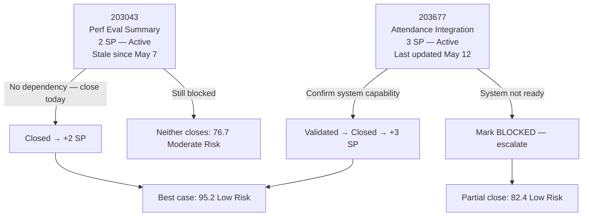

# SAFe Iteration Audit — Finance Team

## 1. Audit Metadata

| Field | Value |
|-------|-------|
| **Project** | Jairosoft FINOPS |
| **Team** | Finance Team |
| **Workspace** | `ado_fin` |
| **ADO Project ID** | e0bb302f-40f9-46c3-8164-6f1acb317d63 |
| **ADO Team ID** | 1f4b45fa-82e8-4a36-aedc-6c1bc8f51070 |
| **Iteration** | Iteration 7.3 |
| **Iteration Start** | 2026-05-04 |
| **Iteration Finish** | 2026-05-17 |
| **Audit Date** | 2026-05-15 (CDT) |
| **Audit Day** | Day 12 of 14 |
| **Prior Audit** | AUDIT_20260514_0207.md (Day 11, 76.7 — Moderate Risk) |
| **Overall Score** | **76.7 / 100** |
| **Risk Band** | **Moderate Risk** |

---

## 2. Executive Summary

The Finance Team holds steady at **76.7 / 100 (Moderate Risk)** on Day 12 of Iteration 7.3 — unchanged from Day 11. Grace remains the sole contributor with both visible sprint items (203043 and 203677) still in Active state. Five story points are committed with 2 days remaining (May 15–17). Delivery Predictability is the lone critical risk: if both items close before sprint end, the overall score jumps to 95.2 (Low Risk).

Five additional items were completed during this sprint — a Spike (CADAC Policy submission), two Spikes (AFS Portal Access and FTC Payments), a User Story (SEC AFS Submission), and an Enabler (Payment Gateway) — totaling 8 SP of delivery that is not captured by the rubric because closed items exit the visible backlog. The Finance Team's actual sprint delivery is stronger than the score indicates; the backlog pipeline risk (thin 7.4 queue) is the most consequential structural issue going into next sprint.

---

## 3. Previous Audit Delta

**Prior audit:** AUDIT_20260514_0207.md — Day 11, Score 76.7 / 100 (Moderate Risk)

| Dimension | Day 11 (May 14) | Day 12 (May 15) | Delta | Driver |
|-----------|----------------|----------------|-------|--------|
| Iteration Planning | 66.7 | **66.7** | 0.0 | Backlog unchanged (3 items, 2 in sprint) |
| Team Capacity | 100.0 | **100.0** | 0.0 | Grace configured; unchanged |
| Estimation | 100.0 | **100.0** | 0.0 | Both sprint items estimated; unchanged |
| DoR Compliance | 100.0 | **100.0** | 0.0 | Both sprint items pass DoR |
| Work Item Balance | 70.0 | **70.0** | 0.0 | User Story monoculture; unchanged |
| Backlog Refinement | 100.0 | **100.0** | 0.0 | All 3 items within 45-day window |
| Delivery Predictability | 0.0 | **0.0** | 0.0 | No new closures; both items remain Active |
| **Overall** | **76.7** | **76.7** | **0.0** | No change |

**Key finding (Day 12):** No state changes to either open sprint item from yesterday. Item 203043 (Signed Annual Performance Evaluation Summary) was last changed May 7 — now 8 days stale. Item 203677 (Attendance Integration) was last changed May 12. Both are effectively idle on the penultimate-to-last day of the sprint. Immediate closure action is required.

---

## 4. Current Iteration Snapshot

| Attribute | Value |
|-----------|-------|
| Active Iteration | Iteration 7.3 |
| Sprint Duration | 2026-05-04 to 2026-05-17 (14 days) |
| Audit Day | Day 12 |
| Current Iteration Root Items (visible backlog) | 2 |
| Total Visible Backlog Root Items | 3 |
| Sprint Load % | 66.7% |
| Total Committed Story Points (visible) | 5 SP |
| Closed Story Points (visible) | 0 SP |
| Closed Items (iteration, outside backlog view) | 5 items / 8 SP closed |
| Active Team Members (sprint) | 1 (Grace) |
| Capacity Configured | Yes (3 hrs/day: 2 Documentation + 1 Requirements) |
| Days Off | 0 |

---

## 5. Work Item Analysis

### 5.1 Current Iteration Items — Visible in Backlog (Iteration 7.3)

| ID | Title | Type | State | Assignee | SP | DoR | Last Changed |
|----|-------|------|-------|----------|----|-----|-------------|
| 203043 | Signed Annual Performance Evaluation Summary | User Story | Active | Grace | 2 | ✓ | 2026-05-07 |
| 203677 | Attendance Integration | User Story | Active | Grace | 3 | ✓ | 2026-05-12 |

**DoR Detail:**
- **203043**: Description — "As a Finance Manager, I want to upload and store the signed annual performance evaluation summaries so that we remain compliant with HR record-keeping policies." (≥30 chars ✓). AC: access authorization, share folder upload, HR receipt acknowledgment (≥20 chars ✓).
- **203677**: Description — "As the Payroll Preparer, I have to generate payroll based on their attendance..." (≥30 chars ✓). AC: system can generate payroll from attendance + validated computation report (≥20 chars ✓).

**Staleness alert:**
- 203043 unchanged since May 7 (8 days). No-dependency item — signed doc upload and HR acknowledgment should be completable without blockers.
- 203677 unchanged since May 12 (3 days). Technical dependency on payroll-attendance system integration.

### 5.2 Closed Iteration Items — Outside Backlog View (Completed in 7.3)

These items were committed to Iteration 7.3 and closed during the sprint. Excluded from rubric scoring per `visible_root_backlog_items` definition; documented here as delivery context.

| ID | Title | Type | State | SP | Changed (approx. close) |
|----|-------|------|-------|----|--------------------------|
| 203638 | Submission of Cadac Policy and Program Plan | Spike | Closed | 1 | 2026-05-08 |
| 203665 | AFS Portal Access | Spike | Closed | 2 | 2026-05-12 |
| 203684 | SEC AFS Submission | User Story | Closed | 2 | 2026-05-08 |
| 203704 | Set-up Payment Gateway | Enabler | Closed | 2 | 2026-05-12 |
| 203866 | FTC Payment — 3 invoices overdue | Spike | Closed | 1 | 2026-05-11 |
| **Total** | | | | **8 SP** | |

### 5.3 Backlog Items Outside Iteration 7.3

| ID | Title | Type | Iteration | State | SP | DoR | Changed |
|----|-------|------|-----------|-------|----|-----|---------|
| 203719 | Salary Increase Implementation | User Story | 7.4 | New | 2 | Partial | 2026-05-04 |

**DoR alert on 203719:** Description uses a proper user story format ✓. Acceptance Criteria covers only the "Four-Eyes" verification step — thin AC. Missing: payslip generation verification, effective date confirmation, bank deposit matching. Must be expanded before 7.4 sprint planning.

---

## 6. SAFe Compliance Scorecard

| Dimension | Score | Evidence | Notes |
|-----------|-------|----------|-------|
| Iteration Planning | 66.7 | 2 of 3 backlog items in Iteration 7.3 | Lean but appropriately scoped; 1 item correctly staged for 7.4 |
| Team Capacity | 100.0 | Grace: 3 hrs/day configured (2 Documentation + 1 Requirements), 0 days off | Single contributor, fully configured |
| Estimation | 100.0 | 203043 = 2 SP, 203677 = 3 SP (2/2 estimated) | All visible sprint items estimated |
| DoR Compliance | 100.0 | Both items: Description ≥30 chars ✓, AC ≥20 chars ✓ | Full DoR coverage |
| Work Item Balance | 70.0 | User Story 2/2 = 100% share; dominant type >60% penalty −30; no Spikes in visible sprint | Finance ops work naturally produces User Story items |
| Backlog Refinement | 100.0 | All 3 items fresh (oldest: 203719, May 4 = 11 days); 0 stale >90d; 0 stale >180d; 0 untouched in sprint | Excellent backlog hygiene |
| Delivery Predictability | 0.0 | 0 of 5 committed SP closed in visible backlog | Both items Active Day 12; 8 SP closed outside backlog view (evidence gap) |
| **Overall** | **76.7** | (66.7+100+100+100+70+100+0) / 7 | **Moderate Risk** |

---

## 7. Dimension Findings

### 7.1 Iteration Planning — 66.7 (Moderate Risk)

Two of three visible backlog items are assigned to Iteration 7.3. The third (203719 — Salary Increase Implementation) is appropriately staged for 7.4. The 66.7 score reflects a lean, focused backlog — not a planning deficiency. However, with only 1 item queued for 7.4, the Finance Team faces a near-empty pipeline after this sprint closes.

**Structural alert:** If 203043 and 203677 close by May 17, only 203719 (2 SP) remains for 7.4. Grace's capacity of 3 hrs/day × 10 working days = ~30 hrs; 2 SP is significantly underloaded. The team needs to identify and groom additional 7.4 backlog items before next sprint planning.

### 7.2 Team Capacity — 100.0 (Low Risk)

Grace has 3 hrs/day configured (2 Documentation + 1 Requirements). No days off recorded for Iteration 7.3. Capacity is fully configured and appropriate for a single-contributor team.

**Persistent structural risk:** Bus factor = 1. All finance operations — payroll, AFS submissions, government compliance, BIR filings — depend on Grace alone. No documented backup or escalation path exists.

### 7.3 Estimation — 100.0 (Low Risk)

Both sprint items are estimated (203043 = 2 SP, 203677 = 3 SP, total 5 SP). Estimation is complete and proportionate to Grace's capacity.

### 7.4 DoR Compliance — 100.0 (Low Risk)

Both active sprint items meet the Definition of Ready with clear user story format, sufficient descriptions, and verifiable acceptance criteria. 203677's AC ("system can generate payroll based on the attendance; validated computation report") implies a technical dependency on system capability — this is a runtime risk, not a DoR failure.

### 7.5 Work Item Balance — 70.0 (Moderate Risk)

Both sprint items are User Stories (100% share), triggering the dominant type −30 penalty. Finance operations work (payroll, document compliance, government submissions) naturally produces User Story items. No Spikes or Defects are present in the visible sprint scope. This is structural, not a process deficiency.

### 7.6 Backlog Refinement — 100.0 (Low Risk)

All three visible backlog items have ChangedDate values within the last 45 days (oldest: 203719, May 4 = 11 days). No items are stale at 90 or 180 days. Both sprint items were updated after the sprint start date (May 4). Backlog hygiene is excellent.

**Watch item:** 203719 (Salary Increase Implementation) was last changed May 4 — same as sprint start. While within the 45-day fresh window, this item needs DoR expansion (thin AC) before 7.4 planning.

### 7.7 Delivery Predictability — 0.0 (Critical)

Both sprint items remain Active on Day 12 with 0 SP closed in the visible backlog. With 2 days remaining:

| Scenario | DP Score | Overall Score | Risk Band |
|----------|----------|---------------|-----------|
| Both items close (5 SP) | 100.0 | 95.2 | Low Risk |
| Only 203043 closes (2 SP) | 40.0 | 82.4 | Low Risk |
| Only 203677 closes (3 SP) | 60.0 | 88.1 | Low Risk |
| Neither closes (0 SP) | 0.0 | 76.7 | Moderate Risk |

**Contextual note:** Five additional items completed during 7.3 (8 SP) are not captured in this score. The Finance Team's actual velocity is substantially higher than the Delivery Predictability score suggests — a structural measurement gap when using the strict visible-backlog rubric.

---

## 8. Risks and Bottlenecks

| Risk | Severity | Description |
|------|----------|-------------|
| 203043 stale since May 7 | High | Performance evaluation upload has not been updated in 8 days; no-dependency item should already be closeable |
| Zero visible delivery on Day 12 | High | 5 SP open with 2 days remaining; both sprint items must close to avoid Moderate Risk at sprint end |
| 203677 technical dependency | High | Attendance integration requires payroll system capability; status unconfirmed in ADO |
| Bus Factor = 1 | High | Grace is the sole Finance Team contributor; all finance ops halts without her |
| Thin 7.4 backlog pipeline | Moderate | Only 1 item (203719, 2 SP) queued for 7.4; well below Grace's 30-hr capacity |
| 203719 thin AC | Low | Salary Increase Implementation has minimal acceptance criteria; not sprint-ready |

---

## 9. Prioritized Recommendations

1. **Close 203043 (Performance Evaluation Summary) immediately.** This item requires uploading a signed document and receiving HR acknowledgment — no system dependency. If the document is available, Grace should complete this task today and move the item to Closed. This recovers 2 of the 5 committed SP.

2. **Resolve 203677 (Attendance Integration) status today.** Confirm whether the payroll system can generate computations from attendance data. If yes: validate the output and close the item by May 15. If no: mark the item Blocked in ADO with a comment explaining the technical constraint, and escalate to the product owner.

3. **Groom at least 3 new Finance Team backlog items before 7.4 planning.** With only 203719 (2 SP) queued, next sprint will be severely underloaded. Candidates include: BIR compliance filings, payroll cycle documentation, EGOV payment processing, or financial reporting improvements.

4. **Expand AC on 203719 (Salary Increase Implementation).** Current AC covers only the Four-Eyes verification step. Add: (a) payslip generation confirming new salary amount, (b) effective date verified in payroll system, (c) bank deposit confirmed against agreed amount, (d) HR record updated.

5. **Document Finance Team coverage plan.** Identify who can handle payroll processing, government compliance filings, and SEC/BIR submissions if Grace is unavailable. Record in the team CLAUDE.md under a `Contingency` section.

---

## 10. Evidence Gaps and Limitations

| Gap | Impact on Scoring |
|-----|------------------|
| 5 closed sprint items (8 SP) not in visible backlog | Delivery Predictability scores 0.0; true sprint delivery is 8/13 SP = 61.5% if both remaining items close; contextual picture is significantly more positive |
| 203677 technical dependency unverified | Cannot confirm if payroll-attendance integration exists; potential hidden blocker |
| 203043 unchanged since May 7 | No comment or state update in API; silent blocking condition cannot be ruled out |
| Single-contributor team | All metrics reflect one person; team-level averages carry no statistical weight |

**Methodology note:** The rubric restricts `current_iteration_root_items` to items in `visible_root_backlog_items`. Closed items that exit the ADO backlog view are excluded regardless of sprint commitment. The Finance Team completed 5 items (8 SP) that are invisible to the scoring engine — a known structural gap for high-velocity sprints with frequent closures.

---

## Appendix — Score Visualization

