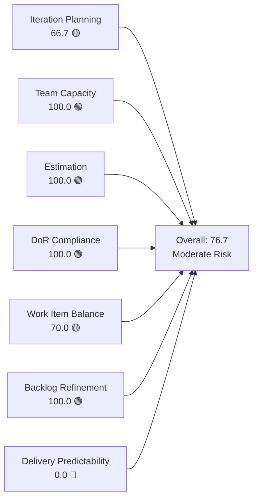
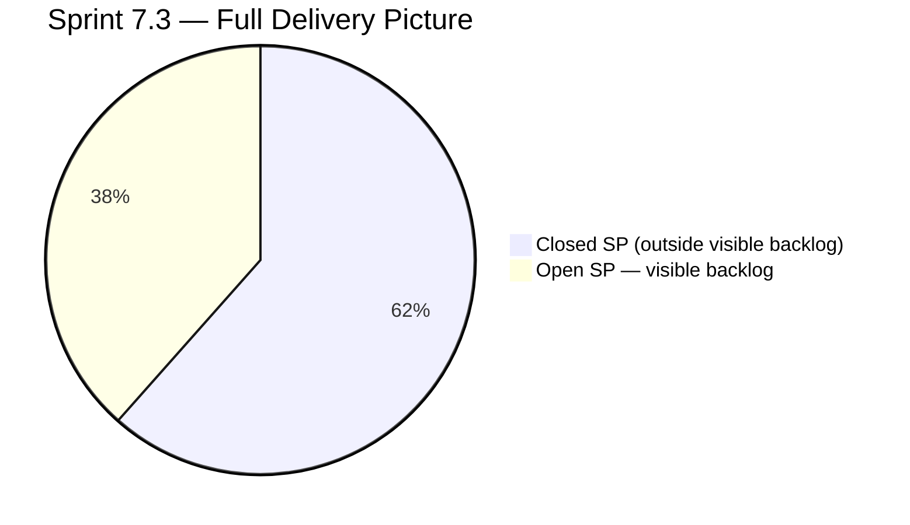
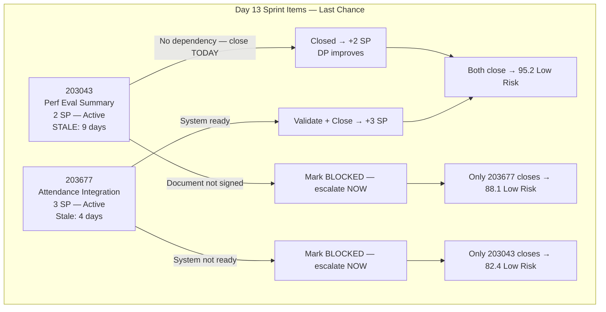
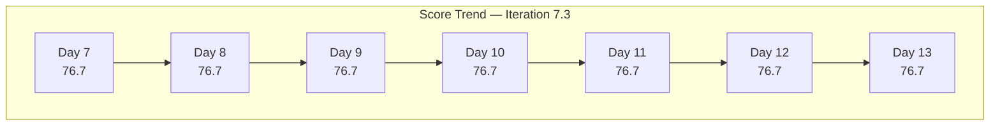

# SAFe Iteration Audit — Finance Team

## 1. Audit Metadata

| Field | Value |
|-------|-------|
| **Project** | Jairosoft FINOPS |
| **Team** | Finance Team |
| **Workspace** | `ado_fin` |
| **ADO Project ID** | e0bb302f-40f9-46c3-8164-6f1acb317d63 |
| **ADO Team ID** | 1f4b45fa-82e8-4a36-aedc-6c1bc8f51070 |
| **Iteration** | Iteration 7.3 |
| **Iteration Start** | 2026-05-04 |
| **Iteration Finish** | 2026-05-17 |
| **Audit Date** | 2026-05-16 (CDT) |
| **Audit Day** | Day 13 of 14 |
| **Prior Audit** | AUDIT_20260515_0202.md (Day 12, 76.7 — Moderate Risk) |
| **Overall Score** | **76.7 / 100** |
| **Risk Band** | **Moderate Risk** |

---

## 2. Executive Summary

The Finance Team holds at **76.7 / 100 (Moderate Risk)** on Day 13 — unchanged from Day 12 for the second consecutive day. Both sprint items (203043 and 203677) remain in Active state with no ADO updates overnight.

**Today is the last full working day of Iteration 7.3.** The sprint closes tomorrow (May 17). With 5 SP still open and 0 SP closed in the visible backlog, Delivery Predictability is 0.0 unless at least one item closes before end of day today or tomorrow morning.

Item 203043 (Signed Annual Performance Evaluation Summary, 2 SP) has not been updated since May 7 — now **9 days idle**. This is a no-dependency task requiring only a document upload and HR acknowledgment. Its continued open state is unexplained and concerning. Item 203677 (Attendance Integration, 3 SP) was last updated May 12 — now 4 days since last activity. If a system dependency is blocking closure, it has not been escalated or documented in ADO.

Five items totaling 8 SP were delivered earlier in this sprint (documented in Section 5.2). Grace's overall sprint delivery picture is materially stronger than the rubric captures — but the two remaining open items must close today to register any measurable improvement before sprint end.

---

## 3. Previous Audit Delta

**Prior audit:** AUDIT_20260515_0202.md — Day 12, Score 76.7 / 100 (Moderate Risk)

| Dimension | Day 12 (May 15) | Day 13 (May 16) | Delta | Driver |
|-----------|----------------|----------------|-------|--------|
| Iteration Planning | 66.7 | **66.7** | 0.0 | Backlog unchanged (3 items, 2 in sprint) |
| Team Capacity | 100.0 | **100.0** | 0.0 | Grace configured; no change |
| Estimation | 100.0 | **100.0** | 0.0 | Both sprint items estimated; unchanged |
| DoR Compliance | 100.0 | **100.0** | 0.0 | Both sprint items pass DoR |
| Work Item Balance | 70.0 | **70.0** | 0.0 | User Story monoculture; unchanged |
| Backlog Refinement | 100.0 | **100.0** | 0.0 | All 3 items remain within 45-day window |
| Delivery Predictability | 0.0 | **0.0** | 0.0 | No new closures; both items remain Active |
| **Overall** | **76.7** | **76.7** | **0.0** | Second consecutive day of no change |

**Key finding (Day 13):** No ADO state changes on either open sprint item overnight. Item 203043 is now the most stale open item in this team's sprint history — 9 days without any update on a task with no known system dependency. This level of inactivity on the penultimate sprint day suggests either a silent blocker, deprioritization, or an oversight. All three require immediate attention.

---

## 4. Current Iteration Snapshot

| Attribute | Value |
|-----------|-------|
| Active Iteration | Iteration 7.3 |
| Sprint Duration | 2026-05-04 to 2026-05-17 (14 days) |
| Audit Day | Day 13 (last full working day) |
| Current Iteration Root Items (visible backlog) | 2 |
| Total Visible Backlog Root Items | 3 |
| Sprint Load % | 66.7% |
| Total Committed Story Points (visible) | 5 SP |
| Closed Story Points (visible) | 0 SP |
| Closed Items (iteration, outside backlog view) | 5 items / 8 SP |
| Active Team Members (sprint) | 1 (Grace) |
| Capacity Configured | Yes (3 hrs/day: 2 Documentation + 1 Requirements) |
| Days Off | 0 |
| **Days Remaining** | **1 (May 17)** |

---

## 5. Work Item Analysis

### 5.1 Current Iteration Items — Visible in Backlog (Iteration 7.3)

| ID | Title | Type | State | Assignee | SP | DoR | Last Changed | Days Idle |
|----|-------|------|-------|----------|----|-----|-------------|-----------|
| 203043 | Signed Annual Performance Evaluation Summary | User Story | Active | Grace | 2 | ✓ | 2026-05-07 | **9 days** |
| 203677 | Attendance Integration | User Story | Active | Grace | 3 | ✓ | 2026-05-12 | 4 days |

**DoR Detail (confirmed):**
- **203043**: Description — "As a Finance Manager, I want to upload and store the signed annual performance evaluation summaries so that we remain compliant with HR record-keeping policies." (≥30 chars ✓). AC: three criteria covering access authorization, HR share folder upload, and HR receipt acknowledgment (≥20 chars ✓).
- **203677**: Description — "As the Payroll Preparer, I have to generate payroll based on their attendance to ensure the correct computation of bi-weekly pay." (≥30 chars ✓). AC: system generates payroll from attendance + validated computation report (≥20 chars ✓).

**Staleness analysis:**
- **203043** (9 days idle): This item requires uploading a signed document to a shared folder and receiving an HR acknowledgment. No external system dependency is documented. Nine days of inactivity is not justified by the task description. Either (a) the document is not yet signed by the relevant manager, (b) Grace has not prioritized this task, or (c) there is a blocking condition not captured in ADO.
- **203677** (4 days idle): Attendance Integration depends on a payroll system capable of generating computations from attendance records. No technical blocker has been logged in ADO since May 12.

### 5.2 Closed Iteration Items — Outside Backlog View (Completed in 7.3)

Delivered during the sprint; not visible in the backlog query; excluded from rubric scoring per the `visible_root_backlog_items` definition.

| ID | Title | Type | State | SP | Closed Date (approx.) |
|----|-------|------|-------|----|----------------------|
| 203638 | Submission of Cadac Policy and Program Plan | Spike | Closed | 1 | 2026-05-08 |
| 203665 | AFS Portal Access | Spike | Closed | 2 | 2026-05-12 |
| 203684 | SEC AFS Submission | User Story | Closed | 2 | 2026-05-08 |
| 203704 | Set-up Payment Gateway | Enabler | Closed | 2 | 2026-05-12 |
| 203866 | FTC Payment — 3 invoices overdue | Spike | Closed | 1 | 2026-05-11 |
| **Total** | | | | **8 SP** | |

### 5.3 Backlog Items Outside Iteration 7.3

| ID | Title | Type | Iteration | State | SP | DoR | Changed |
|----|-------|------|-----------|-------|----|-----|---------|
| 203719 | Salary Increase Implementation | User Story | 7.4 | New | 2 | Partial | 2026-05-04 |

**Status unchanged from Day 12:** 203719 still has thin Acceptance Criteria (only the "Four-Eyes" verification step). Needs expansion before 7.4 sprint planning. Additionally, with only 1 item queued for 7.4, the Finance Team pipeline is critically underloaded for next sprint.

---

## 6. SAFe Compliance Scorecard

| Dimension | Score | Evidence | Notes |
|-----------|-------|----------|-------|
| Iteration Planning | 66.7 | 2 of 3 backlog items in Iteration 7.3 | Lean, appropriate; 1 item staged for 7.4 |
| Team Capacity | 100.0 | Grace: 3 hrs/day (2 Documentation + 1 Requirements), 0 days off | Single contributor, fully configured |
| Estimation | 100.0 | 203043 = 2 SP, 203677 = 3 SP (2/2 estimated) | All visible sprint items estimated |
| DoR Compliance | 100.0 | Both items: Description ≥30 chars ✓, AC ≥20 chars ✓ | Full DoR on both active sprint items |
| Work Item Balance | 70.0 | User Story 2/2 = 100% share; dominant type >60% → −30 penalty; no Spikes | Finance ops naturally produces User Story items |
| Backlog Refinement | 100.0 | All 3 items changed within 45 days (203043: May 7 = 9d, 203677: May 12 = 4d, 203719: May 4 = 12d); 0 stale ≥90d; 0 stale ≥180d; 0 untouched in sprint (both changed after May 4) | Excellent backlog hygiene |
| Delivery Predictability | 0.0 | 0 of 5 committed SP closed in visible backlog | Both items Active; 8 SP closed earlier in sprint outside backlog view |
| **Overall** | **76.7** | (66.7+100+100+100+70+100+0) / 7 | **Moderate Risk** |

---

## 7. Dimension Findings

### 7.1 Iteration Planning — 66.7 (Moderate Risk)

Two of three visible backlog items are assigned to Iteration 7.3. The third (203719 — Salary Increase Implementation) is staged for 7.4. Planning ratio remains stable at 66.7% and reflects a focused, lean sprint scope.

**Structural concern:** With 1 day remaining, if both sprint items close today, only 203719 (2 SP) remains for Iteration 7.4. Grace's 3 hrs/day × ~10 working days = 30 hrs capacity; 2 SP is severely underloaded. The Finance Team must identify and groom at least 3–4 additional 7.4 backlog items before the next sprint planning session.

### 7.2 Team Capacity — 100.0 (Low Risk)

Grace is configured at 3 hrs/day across two activity types. No days off are recorded for Iteration 7.3. Capacity is fully configured and appropriate.

**Persistent structural risk:** Bus factor = 1. All Finance Team deliverables — payroll, SEC filings, AFS submissions, BIR compliance, payment gateway operations — depend on a single contributor. No documented backup or escalation path exists. This finding has appeared in every Finance Team audit.

### 7.3 Estimation — 100.0 (Low Risk)

Both sprint items are estimated (2 SP + 3 SP = 5 SP total). Estimation is complete.

### 7.4 DoR Compliance — 100.0 (Low Risk)

Both active sprint items have clear user story format, sufficient descriptions, and verifiable acceptance criteria. DoR is maintained for Day 13. 203677's AC implies a dependency on the payroll system's generation capability — this is a runtime risk, not a DoR failure.

### 7.5 Work Item Balance — 70.0 (Moderate Risk)

Both sprint items are User Stories (100% share), triggering the dominant type −30 penalty. Finance operations work — document compliance, payroll, government submissions — inherently produces User Story items. This is a structural penalty that does not reflect a process deficiency.

### 7.6 Backlog Refinement — 100.0 (Low Risk)

All three visible backlog items have ChangedDate values within the 45-day freshness window (oldest: 203719, May 4 = 12 days). Neither sprint item is untouched (both were updated after the sprint start date of May 4). No items are stale at 90 or 180 days.

**Watch item:** 203043 is approaching the "untouched in sprint" threshold — it was changed May 7 (3 days into the sprint) but has been silent since. If this pattern continues to the next iteration, items that entered the sprint unchanged would trigger a refinement penalty.

### 7.7 Delivery Predictability — 0.0 (Critical)

Both items remain Active with 0 SP closed in the visible backlog on the penultimate sprint day. With only 1 day remaining, the scenarios are:

| Scenario | DP Score | Overall Score | Risk Band |
|----------|----------|---------------|-----------|
| Both items close (5 SP) | 100.0 | **95.2** | Low Risk |
| Only 203043 closes (2 SP) | 40.0 | **82.4** | Low Risk |
| Only 203677 closes (3 SP) | 60.0 | **88.1** | Low Risk |
| Neither closes (0 SP) | 0.0 | **76.7** | Moderate Risk — sprint closes at this score |

**Contextual delivery note:** Five items (8 SP) were closed earlier in this sprint outside the visible backlog. The Finance Team's total sprint delivery (if both open items close) would be 13 SP across 7 items — a strong outcome for a single-contributor team operating 3 hrs/day.

---

## 8. Risks and Bottlenecks

| Risk | Severity | Description |
|------|----------|-------------|
| 203043 — 9 days idle with 1 day remaining | **Critical** | Performance evaluation upload requires no system dependency; 9 days of silence on a closeable task is unexplained and at risk of becoming a sprint miss |
| Both items open on Day 13 | **High** | 5 SP must close by May 17; final window closes tomorrow morning |
| 203677 — payroll system dependency unconfirmed | **High** | Attendance integration requires system capability to generate payroll; no confirmation or blocker logged since May 12 |
| Bus Factor = 1 | **High** | Grace is the sole Finance Team contributor; all finance operations halt without her |
| Thin 7.4 pipeline | **Moderate** | Only 1 item (203719, 2 SP) queued for 7.4; Grace has ~30 hrs capacity; severely underloaded |
| 203719 thin AC | **Low** | Salary Increase Implementation AC covers only one verification step; not sprint-ready |

---

## 9. Prioritized Recommendations

1. **Close 203043 (Performance Evaluation Summary) today — final opportunity.** This is the last full working day. Uploading a signed document and receiving HR acknowledgment has no system dependency. If the document is signed: complete the upload, notify HR, log the receipt, and move the item to Closed. If the document is not yet signed: escalate immediately to the Finance Manager and flag the item as Blocked in ADO with a comment explaining the delay.

2. **Resolve 203677 (Attendance Integration) status today.** There are two paths: (a) If the payroll system can generate computations from attendance data, validate the output with the computation report and close the item. (b) If the system is not capable or integration is incomplete, update the item to Blocked in ADO with a specific comment, escalate to the product owner or technical lead, and document the blocker so it is not carried into 7.4 silently.

3. **Groom at least 3–4 Finance Team backlog items before 7.4 planning.** The 7.4 pipeline has only 203719 (2 SP). Candidates include: BIR quarterly filing, payroll cycle documentation update, EGOV payment processing for June obligations, financial reporting improvements, or CADAC certification renewal support. Target a 7.4 load of 8–10 SP to utilize Grace's ~30 hrs capacity appropriately.

4. **Expand Acceptance Criteria on 203719 (Salary Increase Implementation).** Current AC covers only the Four-Eyes verification step. Before 7.4 sprint planning, add: (a) payslip generation confirming the new salary amount for the first payroll cycle, (b) effective date verified in the payroll system matches the signed letter, (c) bank deposit amount confirmed against the agreed new salary, (d) HR personnel file updated with the signed salary increase letter.

5. **Document Finance Team coverage plan before 7.4 sprint start.** A named backup contact for each critical finance function (payroll, SEC/BIR compliance, government payments) must be defined and recorded in the team CLAUDE.md under a `Contingency` section. This is a recurring audit finding that has not been acted upon.

---

## 10. Evidence Gaps and Limitations

| Gap | Impact on Scoring |
|-----|------------------|
| 5 closed sprint items (8 SP) not in visible backlog | Delivery Predictability scores 0.0 instead of the contextual 61.5% (if both remaining items also close); actual sprint velocity is substantially higher than rubric captures |
| 203043 — no ADO comment or state update since May 7 | Cannot determine whether a blocking condition exists; silent inactivity may indicate escalation is needed |
| 203677 — technical dependency on payroll system unconfirmed | System integration capability not verified via ADO or API; potential hidden blocker not documented |
| Single-contributor team | Rubric dimensions have no statistical team-level significance; all metrics reflect one individual |

**Methodology note:** The rubric restricts `current_iteration_root_items` to the visible ADO backlog. Closed items are excluded regardless of sprint commitment. The Finance Team delivered 5 items (8 SP) that are invisible to the scoring engine — a structural measurement gap documented here as contextual evidence only.

---

## Appendix — Score Visualization

