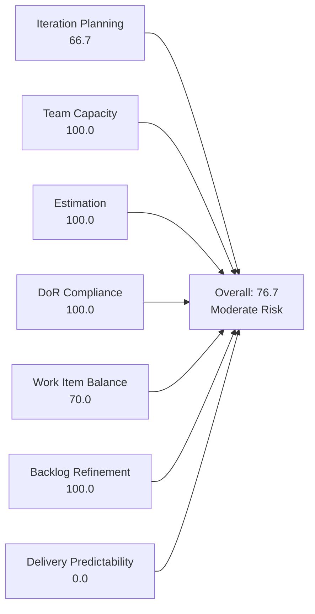
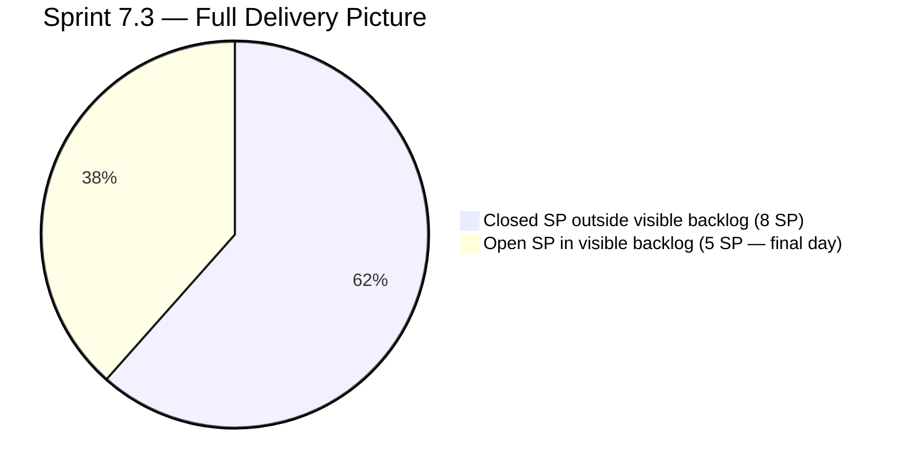
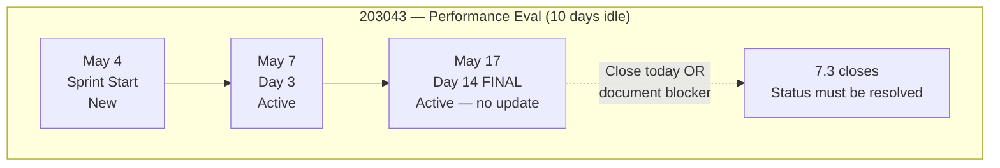
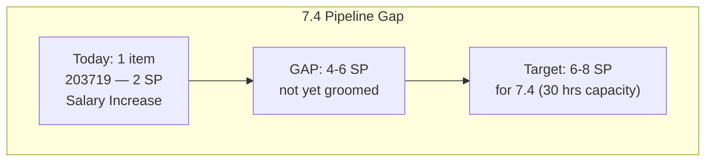
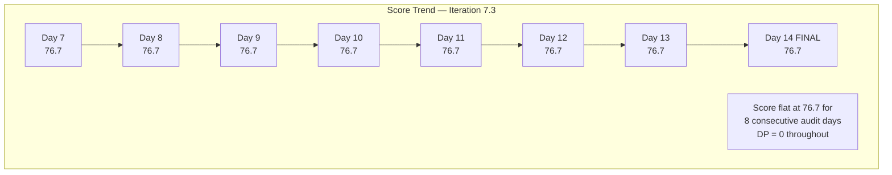

# SAFe Iteration Audit — Finance Team

## 1. Audit Metadata

| Field | Value |
|-------|-------|
| **Project** | Jairosoft FINOPS |
| **Team** | Finance Team |
| **Workspace** | `ado_fin` |
| **ADO Project ID** | e0bb302f-40f9-46c3-8164-6f1acb317d63 |
| **ADO Team ID** | 1f4b45fa-82e8-4a36-aedc-6c1bc8f51070 |
| **Iteration** | Iteration 7.3 |
| **Iteration Start** | 2026-05-04 |
| **Iteration Finish** | 2026-05-17 |
| **Audit Date** | 2026-05-17 (CDT) |
| **Audit Day** | Day 14 of 14 — Sprint Close |
| **Prior Audit** | AUDIT_20260516_0206.md (Day 13, 76.7 — Moderate Risk) |
| **Overall Score** | **76.7 / 100** |
| **Risk Band** | **Moderate Risk** |

---

## 2. Executive Summary

The Finance Team closes Iteration 7.3 at **76.7 / 100 (Moderate Risk)** — unchanged from Day 13 for the third consecutive audit. Both sprint items (203043 and 203677) remain in Active state as of the final sprint day with zero story points closed in the visible backlog.

**Sprint closes today (May 17).** Item 203043 (Signed Annual Performance Evaluation Summary, 2 SP) has not been updated since May 7 — now **10 days idle** — the longest idle streak recorded for an open sprint item this PI. No blocking condition has been documented in ADO. Item 203677 (Attendance Integration, 3 SP) was last updated May 12, now 5 days idle.

**Two paths remain on the final day:**
- If either or both items are closed today, the Delivery Predictability score improves materially (see Section 7.7 for scenario table).
- If neither closes, the sprint ends at 76.7 / 100 with 0 SP delivered in the visible backlog — though 5 items (8 SP) were delivered earlier in the sprint.

**7.4 pipeline risk is critical:** Only 1 item (203719, 2 SP) is staged for Iteration 7.4 against Grace's ~30-hour capacity. The Finance Team must groom and load the next sprint before or immediately after today's sprint close.

---

## 3. Previous Audit Delta

**Prior audit:** AUDIT_20260516_0206.md — Day 13, Score 76.7 / 100 (Moderate Risk)

| Dimension | Day 13 (May 16) | Day 14 (May 17) | Delta | Driver |
|-----------|----------------|----------------|-------|--------|
| Iteration Planning | 66.7 | **66.7** | 0.0 | Backlog unchanged (3 items, 2 in sprint) |
| Team Capacity | 100.0 | **100.0** | 0.0 | Grace configured; no change |
| Estimation | 100.0 | **100.0** | 0.0 | Both sprint items estimated; unchanged |
| DoR Compliance | 100.0 | **100.0** | 0.0 | Both sprint items pass DoR |
| Work Item Balance | 70.0 | **70.0** | 0.0 | User Story monoculture; unchanged |
| Backlog Refinement | 100.0 | **100.0** | 0.0 | All 3 items remain within 45-day freshness window |
| Delivery Predictability | 0.0 | **0.0** | 0.0 | No new closures; both items remain Active |
| **Overall** | **76.7** | **76.7** | **0.0** | Third consecutive day with no movement |

**Key finding (Day 14 — final):** No ADO updates on either sprint item overnight. Item 203043 now carries the team's longest open-sprint idle period at 10 days — the final sprint day will confirm whether this item closes or carries over to 7.4 as an undelivered sprint commitment.

**Iteration 7.3 sprint outcome at close:**
- Visible backlog: 2 items open, 5 SP undelivered
- Outside backlog view: 5 items closed, 8 SP delivered (earlier in sprint)
- Total sprint delivery if no closures today: 8 SP of ~13 SP committed = **61.5% delivery rate**
- Total sprint delivery if both close today: 13 SP of ~13 SP committed = **100% delivery rate**

---

## 4. Current Iteration Snapshot

| Attribute | Value |
|-----------|-------|
| Active Iteration | Iteration 7.3 |
| Sprint Duration | 2026-05-04 to 2026-05-17 (14 days) |
| Audit Day | **Day 14 — Final Day** |
| Current Iteration Root Items (visible backlog) | **2** |
| Total Visible Backlog Root Items | 3 |
| Sprint Load % | 66.7% |
| Total Committed Story Points (visible) | 5 SP |
| Closed Story Points (visible) | 0 SP |
| Closed Items (sprint, outside backlog view) | 5 items / 8 SP |
| Active Team Members (sprint) | 1 (Grace) |
| Capacity Configured | Yes — 3 hrs/day (2 Documentation + 1 Requirements) |
| Days Off | 0 |
| **Days Remaining** | **0 — sprint closes today** |

---

## 5. Work Item Analysis

### 5.1 Current Iteration Items — Visible in Backlog (Iteration 7.3)

| ID | Title | Type | State | Assignee | SP | DoR | Last Changed | Days Idle |
|----|-------|------|-------|----------|----|-----|-------------|-----------|
| 203043 | Signed Annual Performance Evaluation Summary | User Story | Active | Grace | 2 | ✓ | 2026-05-07 | **10 days** |
| 203677 | Attendance Integration | User Story | Active | Grace | 3 | ✓ | 2026-05-12 | 5 days |

**DoR Detail (verified):**
- **203043**: Description — "As a Finance Manager, I want to upload and store the signed annual performance evaluation summaries so that we remain compliant with HR record-keeping policies." (≥30 chars ✓). AC: three criteria — AC1 authorized access, AC2 HR share folder upload, AC3 HR receipt acknowledgment (≥20 chars ✓). **DoR: PASS**
- **203677**: Description — "As the Payroll Preparer, I have to generate payroll based on their attendance to ensure the correct computation of bi-weekly pay." (≥30 chars ✓). AC: system generates payroll from attendance; validated computation report (≥20 chars ✓). **DoR: PASS**

**Untouched sprint items check:**
- 203043: ChangedDate = May 7 > sprint start May 4 → NOT untouched (was updated Day 3)
- 203677: ChangedDate = May 12 > sprint start May 4 → NOT untouched (was updated Day 8)

**Staleness analysis:**
- **203043 (10 days idle):** This item requires uploading a signed document to a shared HR folder and receiving HR acknowledgment. No external system dependency is documented. Ten days of inactivity with no ADO comment is unexplained. The last update (May 7) moved the item to Active state — no further progress has been recorded since. Either (a) the signed document has not yet been obtained from the Finance Manager, (b) the upload has been completed but not recorded in ADO, or (c) the item has been deprioritized without documentation.
- **203677 (5 days idle):** Attendance Integration requires the payroll system to generate computations from attendance data. No technical blocker has been logged. If the integration was not completable within this sprint, the item should be moved to Blocked with a comment before the sprint closes.

### 5.2 Closed Sprint Items — Outside Backlog View

Delivered during Iteration 7.3; not visible in the backlog query; excluded from rubric scoring.

| ID | Title | Type | State | SP | Closed Date (approx.) |
|----|-------|------|-------|----|----------------------|
| 203638 | Submission of Cadac Policy and Program Plan | Spike | Closed | 1 | 2026-05-08 |
| 203665 | AFS Portal Access | Spike | Closed | 2 | 2026-05-12 |
| 203684 | SEC AFS Submission | User Story | Closed | 2 | 2026-05-08 |
| 203704 | Set-up Payment Gateway | Enabler | Closed | 2 | 2026-05-12 |
| 203866 | FTC Payment — 3 invoices overdue | Spike | Closed | 1 | 2026-05-11 |
| **Total** | | | | **8 SP** | |

### 5.3 Backlog Items Outside Iteration 7.3

| ID | Title | Type | Iteration | State | SP | DoR | ChangedDate | Days Ago |
|----|-------|------|-----------|-------|----|-----|-------------|----------|
| 203719 | Salary Increase Implementation | User Story | 7.4 | New | 2 | Partial | 2026-05-04 | 13 |

**DoR assessment for 203719:** Description is adequate (employee perspective, old-vs-new salary, effective date, bank deposit verification — ≥30 chars ✓). Acceptance Criteria covers only the "Four-Eyes" rule (one verification step). AC is technically ≥20 non-whitespace chars and passes the minimum threshold but is substantively thin for sprint planning. Item is minimally DoR-compliant.

**Critical pipeline concern:** Only 1 item (2 SP) is staged for Iteration 7.4. Grace's capacity = 3 hrs/day × 10 working days = 30 hrs. At standard velocity, this represents 6–8 SP of realistic throughput. The 7.4 pipeline is severely underloaded and needs 4–6 additional items before sprint planning.

---

## 6. SAFe Compliance Scorecard

| Dimension | Score | Evidence | Notes |
|-----------|-------|----------|-------|
| Iteration Planning | 66.7 | 2 of 3 backlog items in Iteration 7.3 | Lean, focused sprint; 1 item staged for 7.4 |
| Team Capacity | 100.0 | Grace: 3 hrs/day (2 Documentation + 1 Requirements); 0 days off | Fully configured; single contributor |
| Estimation | 100.0 | 203043 = 2 SP; 203677 = 3 SP; 2/2 estimated | All visible sprint items estimated |
| DoR Compliance | 100.0 | Both items: Description ≥30 chars ✓; AC ≥20 chars ✓ | Full DoR maintained on both sprint items at close |
| Work Item Balance | 70.0 | User Story 2/2 = 100%; dominant type >60% → −30; no Spikes | Finance ops structurally produces User Story items; not a process failure |
| Backlog Refinement | 100.0 | All 3 items changed within 45 days; 0 stale ≥90d; 0 stale ≥180d; 0 untouched items | Oldest: 203719 (May 4 = 13 days); excellent hygiene |
| Delivery Predictability | 0.0 | 0 of 5 committed SP closed (visible); both items Active at sprint close | 8 SP closed earlier in sprint outside backlog view; structural measurement gap |
| **Overall** | **76.7** | (66.7+100+100+100+70+100+0) / 7 = 536.7/7 | **Moderate Risk — sprint closes at this score unless items close today** |

---

## 7. Dimension Findings

### 7.1 Iteration Planning — 66.7 (Moderate Risk)

Two of three visible backlog items are assigned to Iteration 7.3. The third (203719) is staged for 7.4. The 66.7% ratio is appropriate for a lean, focused sprint — acceptable under the rubric.

**Structural concern at close:** The Finance Team's 7.4 pipeline is critically thin (1 item, 2 SP). The planning ratio for 7.4 cannot be computed yet, but the current evidence predicts a severe underload. At least 4–6 groomed items must be added to the 7.4 backlog before sprint planning.

### 7.2 Team Capacity — 100.0 (Low Risk)

Grace is configured at 3 hrs/day with no days off recorded for Iteration 7.3. Capacity is fully configured and appropriately reflects the 7.3 sprint scope.

**Persistent structural risk:** Bus factor = 1. All Finance Team deliverables — payroll processing, SEC filings, AFS submissions, BIR compliance, payment gateway operations — depend on a single contributor. No backup or escalation path is documented. This finding has appeared in every Finance Team audit.

### 7.3 Estimation — 100.0 (Low Risk)

Both sprint items are estimated (2 SP + 3 SP). Estimation is complete and unchanged.

### 7.4 DoR Compliance — 100.0 (Low Risk)

Both active sprint items maintain full DoR compliance on the final sprint day. Description and Acceptance Criteria are present and meet minimum character thresholds. The items were DoR-compliant at sprint planning and remain so at close.

### 7.5 Work Item Balance — 70.0 (Moderate Risk)

Both sprint items are User Stories (100% share), triggering the dominant-type −30 penalty. Finance operations inherently produce User Story items (document management, payroll, government filings) — this penalty reflects the nature of the work, not a planning deficiency. Score would be 100.0 if at least one Spike or Defect were included in the sprint mix, but adding artificial work types to meet this criterion would not be appropriate.

### 7.6 Backlog Refinement — 100.0 (Low Risk)

All three visible backlog items have ChangedDate values within the 45-day freshness window (oldest: 203719, May 4 = 13 days). No items are stale at 90 or 180 days. Neither sprint item qualifies as "untouched" (both were changed after the May 4 sprint start).

**Note on 203043 staleness:** The item was changed on Day 3 (May 7) and has been silent since. It does not breach the untouched threshold (changed after sprint start) and does not affect the Backlog Refinement score. However, if the item carries over to 7.4 without being updated, it will breach the untouched threshold in the next sprint, creating a refinement penalty.

### 7.7 Delivery Predictability — 0.0 (Critical)

`committed_story_points = 5`; `closed_story_points = 0`. Both items remain Active at sprint close. Formula returns 0.0.

**Scenarios for final sprint day:**

| Scenario | Closed SP (visible) | DP Score | Overall Score | Risk Band |
|----------|--------------------|---------|-----------|----|
| Both items close (2+3=5 SP) | 5 | 100.0 | **95.2** | Low Risk |
| Only 203043 closes (2 SP) | 2 | 40.0 | **82.4** | Low Risk |
| Only 203677 closes (3 SP) | 3 | 60.0 | **88.1** | Low Risk |
| Neither closes (0 SP) | 0 | 0.0 | **76.7** | Moderate Risk |

**Contextual delivery:** 5 items (8 SP) were closed earlier in the sprint outside the visible backlog. If neither item closes today, total sprint delivery = 8 of ~13 committed SP = **61.5% delivery rate** (High Risk by operational standards, despite the Moderate rubric score). If both items close, total delivery = 13/13 SP = **100%** (Low Risk).

---

## 8. Risks and Bottlenecks

| Risk | Severity | Description |
|------|----------|-------------|
| 203043 — 10 days idle at sprint close | **Critical** | Performance evaluation upload has no system dependency; 10 days of silence on a simple task with no documented blocker is the longest idle period recorded this PI; item likely carries to 7.4 undelivered |
| 203677 — 5 days idle, possible system dependency | **High** | Attendance Integration requires payroll system capability; no confirmation or blocker logged; may carry to 7.4 without explanation |
| Thin 7.4 pipeline (1 item, 2 SP) | **Critical** | Grace has ~30 hrs capacity in 7.4; only 203719 is staged; sprint will be severely underloaded without immediate backlog grooming |
| Bus Factor = 1 | **High** | Grace is the sole Finance Team contributor; all operations halt without her; no documented backup |
| 203719 thin AC | **Moderate** | Salary Increase Implementation AC covers only the Four-Eyes verification step; minimally DoR-compliant but not robust for sprint execution |
| Sprint delivery rate | **Moderate** | If neither item closes today, 7.3 ends at 61.5% delivery (8/13 SP); two straight PI cycles with delivery rates below 75% would be a concerning trend |

---

## 9. Prioritized Recommendations

1. **Resolve item 203043 (Performance Evaluation Summary) status today — final opportunity.** Today is the last day. This item has no documented system dependency. If the signed document exists: upload it to the HR share folder, notify HR, log the receipt, and close the item. If the document is not yet signed: add an ADO comment today explaining the blocker, move the item to 7.4, and escalate to the Finance Manager. Do not allow the item to carry over silently — it needs a documented resolution path regardless of outcome.

2. **Resolve item 203677 (Attendance Integration) status today.** Two outcomes are acceptable: (a) system capability confirmed → validate the computation output, close the item; (b) system not ready → move to Blocked with a specific comment describing the integration gap, escalate to a technical owner, and carry to 7.4 with a clear scope definition for what "done" looks like technically.

3. **Groom 4–6 Finance Team backlog items for Iteration 7.4 immediately.** The 7.4 pipeline has only 203719 (2 SP). Candidate items for grooming: BIR quarterly filing (due Q2), payroll cycle documentation update, EGOV government payment processing for May–June obligations, financial reporting improvements, CADAC certification renewal, or FTC follow-up payments. Target a 7.4 commitment of 6–8 SP to appropriately utilize Grace's 30-hour capacity.

4. **Strengthen 203719 Acceptance Criteria before 7.4 sprint planning.** Current AC covers only the Four-Eyes verification step. Before sprint planning, add: (a) payslip generated for first payroll cycle confirms the new salary amount; (b) effective date in the payroll system matches the signed letter; (c) bank deposit amount matches the agreed new salary; (d) HR personnel file updated with the signed salary increase letter. This moves the item from minimally DoR-compliant to sprint-ready.

5. **Document a Finance Team backup coverage plan before 7.4 sprint start.** Define and record in `ado_fin/CLAUDE.md` under a `Contingency` section: named backup contacts for (a) payroll processing, (b) SEC/BIR/AFS compliance filings, (c) government payment processing, and (d) payment gateway management. This is the fourth consecutive audit where bus-factor risk has appeared without documented mitigation.

6. **Conduct an Iteration 7.3 retrospective today or at 7.4 kickoff.** The sprint delivered 8 SP early but stalled on the final two items for 5–10 days. The retrospective should address: what prevented 203043 from being completed given its apparent simplicity; whether the payroll system integration was in-scope given the technical dependency risk; and how the team can avoid late-sprint stalls in 7.4.

---

## 10. Evidence Gaps and Limitations

| Gap | Impact on Scoring |
|-----|------------------|
| 5 closed sprint items (8 SP) not in visible backlog | Delivery Predictability scores 0.0 instead of a contextual 61.5–100% depending on today's closures |
| 203043 — no ADO update since May 7 | Cannot determine whether a blocking condition exists; 10-day silence may indicate escalation is needed or that the item was completed without ADO update |
| 203677 — payroll system integration status unconfirmed | Technical dependency on payroll generation capability not verified; potential hidden blocker not documented |
| Single-contributor team | All rubric dimensions reflect one individual's workload; team-level diagnostic aggregation has limited meaning |

**Closing note:** The Finance Team's Day 14 score of 76.7 (Moderate Risk) is the third consecutive audit at this exact level — a sign of stability in planning, capacity, and DoR practices, offset entirely by the Delivery Predictability gap. If both open items close today before the sprint officially ends, the team would score 95.2 (Low Risk) — a materially better reflection of the team's actual sprint performance. The audit recommends prioritizing item closures immediately.

---

## Appendix — Score Visualization

