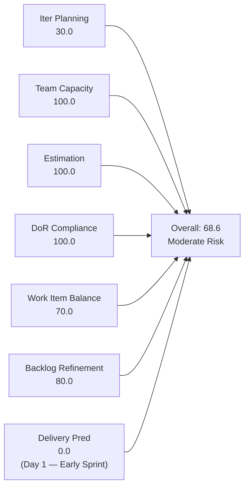
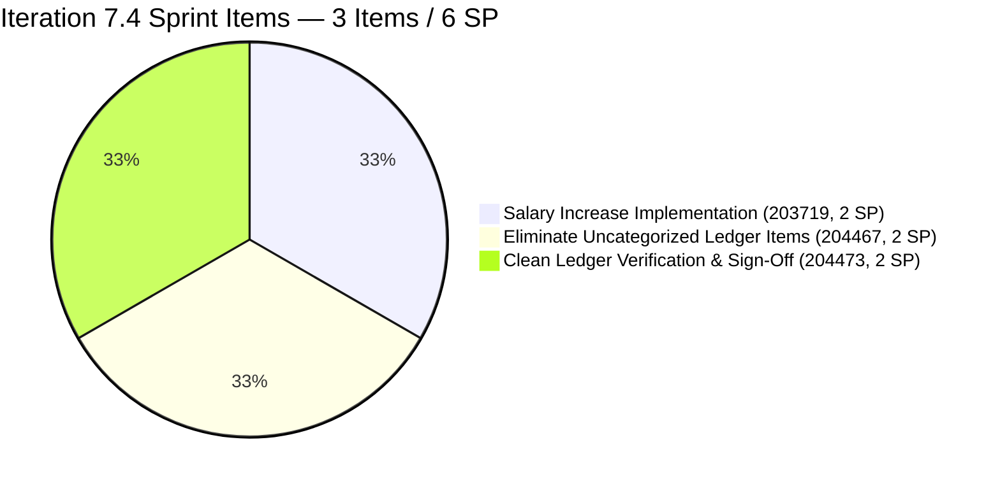
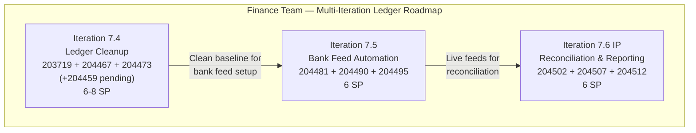
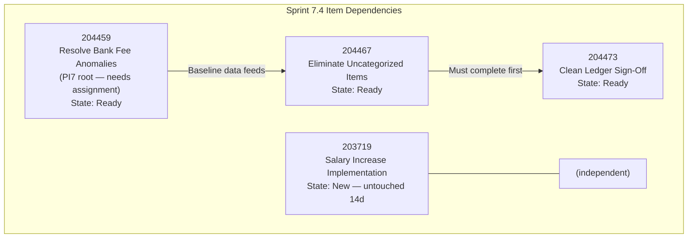
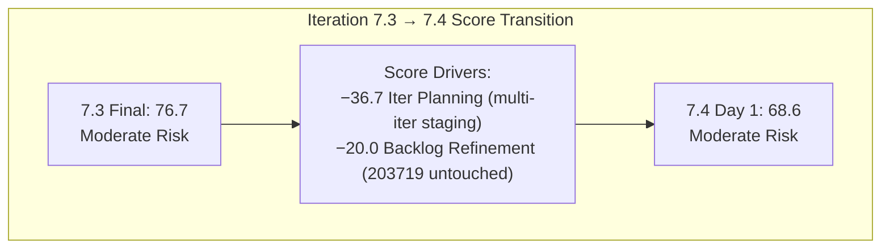

# SAFe Iteration Audit — Finance Team

## 1. Audit Metadata

| Field | Value |
|-------|-------|
| **Project** | Jairosoft FINOPS |
| **Team** | Finance Team |
| **Workspace** | `ado_fin` |
| **ADO Project ID** | e0bb302f-40f9-46c3-8164-6f1acb317d63 |
| **ADO Team ID** | 1f4b45fa-82e8-4a36-aedc-6c1bc8f51070 |
| **Iteration** | Iteration 7.4 |
| **Iteration Start** | 2026-05-18 |
| **Iteration Finish** | 2026-05-31 |
| **Audit Date** | 2026-05-18 (CDT) |
| **Audit Day** | Day 1 of 14 — Sprint Open |
| **Prior Audit** | AUDIT_20260517_0205.md (Day 14, Iteration 7.3, 76.7 — Moderate Risk) |
| **Overall Score** | **68.6 / 100** |
| **Risk Band** | **Moderate Risk** |

---

## 2. Executive Summary

The Finance Team opens Iteration 7.4 at **68.6 / 100 (Moderate Risk)** — a decrease from 7.3's 76.7 close score, driven primarily by a lower Iteration Planning ratio (30.0 vs. 66.7) and a Backlog Refinement penalty triggered by an untouched item.

**This is an exceptionally well-structured sprint** from a quality standpoint: all three sprint items are estimated, all three pass full DoR requirements, and capacity is correctly configured. Grace's work is well-described and ready for execution.

**Primary concern is sprint underloading.** Only 3 items (6 SP) are assigned to Iteration 7.4 against Grace's ~20-hour sprint capacity (2 hrs/day × 10 working days). This represents approximately **30% capacity utilization** — the team has room for 3–5 additional sprint items.

**Backlog structure:** The 10-item visible backlog is intelligently organized across a multi-iteration roadmap: 3 items in 7.4 (ledger cleanup phase), 3 items in 7.5 (bank feed automation phase), and 3 items in 7.6/IP sprint (reconciliation and reporting phase). This reflects mature PI-level planning. However, item 204459 (Resolve Historical Bank Fee Anomalies) is currently at the PI7 root path without a sub-iteration assignment — it likely belongs in 7.4 and should be reassigned.

**Untouched item flag:** Item 203719 (Salary Increase Implementation) was last changed on May 4 — 14 days before the sprint start. At 1/3 = 33.3% of the current sprint, this exceeds the 30% untouched threshold and triggers a −20 Backlog Refinement penalty. This item needs a status update today.

**Delivery Predictability is 0.0** — expected for Day 1. The team's 7.3 sprint closed with 0 visible SP delivered (both open items remained Active), though 8 SP were delivered earlier. Improving early-sprint closure cadence is a key 7.4 improvement target.

---

## 3. Previous Audit Delta

**Prior audit:** AUDIT_20260517_0205.md — Iteration 7.3, Day 14 Final, Score 76.7 / 100 (Moderate Risk)

| Dimension | 7.3 Day 14 | 7.4 Day 1 | Delta | Driver |
|-----------|-----------|----------|-------|--------|
| Iteration Planning | 66.7 | **30.0** | −36.7 | Only 3 of 10 visible items in 7.4; rest staged for 7.5/7.6 |
| Team Capacity | 100.0 | **100.0** | 0.0 | Grace configured; no change |
| Estimation | 100.0 | **100.0** | 0.0 | All sprint items estimated |
| DoR Compliance | 100.0 | **100.0** | 0.0 | All sprint items DoR-compliant |
| Work Item Balance | 70.0 | **70.0** | 0.0 | User Story monoculture; structural; unchanged |
| Backlog Refinement | 100.0 | **80.0** | −20.0 | 203719 untouched 14 days (33.3% of sprint > 30% threshold: −20) |
| Delivery Predictability | 0.0 | **0.0** | 0.0 | Day 1 — no closures (early-sprint); 7.3 also closed at 0.0 |
| **Overall** | **76.7** | **68.6** | **−8.1** | Sprint transition; planning ratio and refinement penalty drive decrease |

**Key finding:** The score decrease from 76.7 to 68.6 reflects two structural changes: (1) the team deliberately staged only 3 items for 7.4 as part of a multi-iteration roadmap, reducing the planning ratio; (2) item 203719 was not updated since early May, creating a refinement penalty at sprint open. Both are addressable.

**7.3 close status for open items:**
- 203043 (Signed Performance Evaluation) — carried forward to 7.4; check whether this was resolved or remains open
- 203677 (Attendance Integration) — carried forward to 7.4; check whether this was resolved or remains open

Note: These items from 7.3 are not currently visible in the 7.4 backlog query (they may have been closed or moved). If still open, they should appear in the visible backlog. This is an evidence gap noted in Section 10.

---

## 4. Current Iteration Snapshot

| Attribute | Value |
|-----------|-------|
| Active Iteration | Iteration 7.4 |
| Sprint Duration | 2026-05-18 to 2026-05-31 (14 days) |
| Audit Day | **Day 1 — Sprint Open** |
| Current Iteration Root Items (visible backlog) | **3** |
| Total Visible Backlog Root Items | 10 |
| Sprint Load % | **30.0%** |
| Total Committed Story Points | **6 SP** |
| Closed Story Points | 0 SP (Day 1) |
| Active Team Members | 1 (Grace) |
| Capacity Configured | Yes — 2 hrs/day (1 Documentation + 1 Requirements) |
| Days Off | 0 |
| Items in 7.5 (next sprint) | 3 (204481, 204490, 204495) |
| Items in 7.6 IP Sprint | 3 (204502, 204507, 204512) |
| Unscheduled items | 1 (204459 — at PI7 root) |

---

## 5. Work Item Analysis

### 5.1 Current Iteration Items — Iteration 7.4 (3 items)

| ID | Title | Type | State | SP | DoR | Last Changed | Notes |
|----|-------|------|-------|----|-----|-------------|-------|
| 203719 | Salary Increase Implementation | User Story | New | 2 | ✓ | 2026-05-04 | **Untouched 14 days — needs update** |
| 204467 | Eliminate Uncategorized Items in the Ledger | User Story | Ready | 2 | ✓ | 2026-05-18 | Phase 2 of ledger cleanup |
| 204473 | Clean Ledger Verification & Iteration Sign-Off | User Story | Ready | 2 | ✓ | 2026-05-18 | Phase 3 — depends on 204467 |

**DoR Detail (verified):**
- **203719:** Description — "As an employee, I want to receive a formal, signed salary increase letter that explicitly states my old vs. new pay and the effective date, so that I have a hard copy record for my own personal files and can verify that my next bank deposit matches the agreed amount." (≥30 chars ✓). AC: "The Four-Eyes Rule: No salary change is entered into the payroll spreadsheet without a second person verifying the data against the signed letter." (≥20 chars ✓). **DoR: PASS** (minimally compliant — AC is substantively thin; see recommendations)
- **204467:** Description — well-formed Given/When/Then story (As a Financial Analyst, I want to review uncategorized asset and expense lists...) (≥30 chars ✓). AC — Given/When/Then format with zero-balance criterion (≥20 chars ✓). **DoR: PASS**
- **204473:** Description — Given/When/Then story (As a FinOps Lead, I want to perform a final review...) (≥30 chars ✓). AC — dependencies on 204467 stated, sign-off criterion clear (≥20 chars ✓). **DoR: PASS**

**Dependency note:** 204473 (Ledger Sign-Off) explicitly depends on 204467 (Eliminate Uncategorized Items) being completed first. These items should be sequenced accordingly and 204473 should not be committed to the sprint unless 204467 has reasonable probability of early closure.

### 5.2 Item at PI7 Root — Needs Iteration Assignment

| ID | Title | Type | Iter | State | SP | Changed |
|----|-------|------|------|-------|----|---------|
| 204459 | Resolve Historical Bank Fee & Transaction Anomalies | User Story | PI7 (root) | Ready | 2 | 2026-05-18 |

**This item appears to belong in Iteration 7.4.** Its content (identify, audit, and correct historical bank fee discrepancies) directly precedes the 7.4 scope (eliminating uncategorized items and verifying the ledger). Assigning it to Iteration 7.4 would bring the sprint to 4 items (8 SP) and improve the planning ratio from 30.0 to 40.0 — more appropriate for the sprint's ledger cleanup theme. This item passed DoR: Description and AC both adequate.

### 5.3 Multi-Iteration Roadmap (Finance Ledger Digitization)

| Iteration | Items | Theme | SP |
|-----------|-------|-------|----|
| 7.4 | 203719, 204467, 204473 (+204459 pending) | Ledger Cleanup & Salary | 6 (8 with 204459) |
| 7.5 | 204481, 204490, 204495 | Bank Feed Automation | 6 |
| 7.6 (IP) | 204502, 204507, 204512 | Reconciliation & Reporting | 6 |

The Finance Team has planned a coherent 3-sprint roadmap for QuickBooks PH implementation. The structured iteration roadmap is excellent SAFe planning practice. Each sprint builds on the prior phase's deliverables.

### 5.4 Staleness Assessment — Full Backlog

| ID | Title | Changed | Days Ago | Stale? |
|----|-------|---------|----------|--------|
| 203719 | Salary Increase Implementation | 2026-05-04 | 14 | Fresh (within 45d) |
| 204459 | Resolve Historical Bank Fee Anomalies | 2026-05-18 | 0 | Fresh |
| 204467 | Eliminate Uncategorized Items | 2026-05-18 | 0 | Fresh |
| 204473 | Clean Ledger Verification & Sign-Off | 2026-05-18 | 0 | Fresh |
| 204481 | Establish & Authenticate Real-Time Bank Feeds | 2026-05-18 | 0 | Fresh |
| 204490 | Define Automated Transaction Categorization Rules | 2026-05-18 | 0 | Fresh |
| 204495 | Clean Feed Validation & Automation Freeze | 2026-05-18 | 0 | Fresh |
| 204502 | Complete Full-Month Ledger Reconciliation | 2026-05-18 | 0 | Fresh |
| 204507 | Generate & Configure Clean P&L Dashboards | 2026-05-18 | 0 | Fresh |
| 204512 | Final Feature Audit, UAT, and Sign-Off | 2026-05-18 | 0 | Fresh |

**All 10 items are within the 45-day freshness window.** 203719 at 14 days is the oldest item. No stale ≥90d or ≥180d items exist.

**Untouched analysis:** 203719 was changed May 4 — 14 days before the sprint start. At 1/3 = 33.3% of current_iteration_root_items, this exceeds the >30% threshold and triggers the −20 Backlog Refinement penalty.

---

## 6. SAFe Compliance Scorecard

| Dimension | Score | Evidence | Notes |
|-----------|-------|----------|-------|
| Iteration Planning | 30.0 | 3 of 10 visible backlog items in Iteration 7.4 | Intentional multi-iter roadmap; 7 items staged for 7.5/7.6; 1 unscheduled |
| Team Capacity | 100.0 | Grace: 2 hrs/day (1 Documentation + 1 Requirements); 0 days off | Fully configured; single contributor |
| Estimation | 100.0 | 203719=2 SP; 204467=2 SP; 204473=2 SP; 3/3 estimated | All sprint items carry estimates |
| DoR Compliance | 100.0 | All 3 items: Description ≥30 chars ✓; AC ≥20 chars ✓ | Full DoR maintained at sprint open |
| Work Item Balance | 70.0 | User Story 3/3 = 100% (dominant >60%: −30); no Spikes | Finance ops inherently User Story-heavy; structural |
| Backlog Refinement | 80.0 | 10/10 fresh within 45d; 0 stale ≥90d; 0 stale ≥180d; untouched=1/3=33.3% >30% → −20 | 203719 unchanged since May 4; penalty applied |
| Delivery Predictability | 0.0 | committed_sp=6; closed_sp=0; Day 1 | **Early-sprint — low delivery expected; Day 1 of 14-day sprint** |
| **Overall** | **68.6** | (30.0+100+100+100+70+80+0) / 7 = 480/7 | **Moderate Risk — strong quality metrics; underloaded sprint and planning ratio drive score** |

---

## 7. Dimension Findings

### 7.1 Iteration Planning — 30.0 (High Risk)

Three of 10 visible backlog items are in Iteration 7.4. The 30.0% planning ratio is the lowest score for this team this PI and falls into the High Risk band for this dimension individually. However, the low ratio reflects deliberate multi-iteration roadmapping — 7 items are intentionally staged for 7.5 and 7.6 as part of a structured QuickBooks implementation plan.

**Recommendation:** Assign 204459 (Resolve Historical Bank Fee Anomalies) to Iteration 7.4. This item is at the PI7 root path, logically precedes the 7.4 cleanup work, and is ready (State=Ready, full DoR, SP estimated). Adding it raises the planning ratio to 40.0% and brings sprint commitment to 8 SP — still below Grace's capacity but more appropriate.

**Capacity utilization:** Grace's 2 hrs/day × 10 working days = 20 hours capacity. At 6 SP (3 items), the sprint is utilizing approximately 30% of available capacity. Even with 204459 added (8 SP, 4 items), the sprint would be at ~40% utilization. Additional items from the 7.5 pipeline (if they can be pulled forward) could be considered if the team's pace allows.

### 7.2 Team Capacity — 100.0 (Low Risk)

Grace is configured at 2 hrs/day (1 Documentation + 1 Requirements activity) with no days off in Iteration 7.4. Capacity is appropriately configured and consistent with prior sprints.

**Bus factor risk (persistent):** All Finance Team operations — payroll processing, QuickBooks implementation, BIR/SEC compliance, EGOV payments — depend solely on Grace. No backup is documented. This risk has appeared in every Finance Team audit without mitigation.

### 7.3 Estimation — 100.0 (Low Risk)

All three sprint items are estimated at 2 SP each, totaling 6 committed story points. Estimation is consistent and complete. The uniform 2 SP estimate for all 7.4 items suggests they may all be similar in scope — appropriate for structured ledger cleanup stories.

### 7.4 DoR Compliance — 100.0 (Low Risk)

All three sprint items maintain full DoR compliance at sprint open. Description and Acceptance Criteria are present and meet minimum character thresholds. Item 204467 and 204473 use exemplary Given/When/Then format with measurable criteria. Item 203719's AC is minimally compliant (one verification criterion) but technically passes the 20-character threshold.

**203719 AC improvement opportunity:** The Salary Increase Implementation currently has AC covering only the Four-Eyes review step. Before this item is marked Ready, add: (a) payslip generated for first payroll cycle confirms new salary amount; (b) bank deposit in first cycle matches the signed letter; (c) effective date in payroll system matches the signed letter. This makes the AC fully testable.

### 7.5 Work Item Balance — 70.0 (Moderate Risk)

All three sprint items are User Stories (100%), triggering the −30 dominant-type penalty. Finance operations structurally produce User Story items. The −30 penalty is expected and does not represent a planning deficiency. Score floor for User Story monoculture without Spikes is 70.0.

### 7.6 Backlog Refinement — 80.0 (Low Risk)

Base score = 100.0 (all 10 items fresh). Penalty applied: 203719 was changed May 4 — 14 days before sprint start. With 1/3 current iteration items untouched = 33.3%, the >30% threshold is exceeded, triggering a −20 penalty.

**Corrective action:** Grace should add an ADO comment to 203719 (Salary Increase Implementation) today documenting: (a) current status of the signed salary increase letter; (b) which employees are affected; (c) target payroll cycle for implementation. This will update the ChangedDate and eliminate the untouched penalty in tomorrow's audit.

**7.5/7.6 items are pristine:** All 7 items for future iterations were created today (May 18) with full DoR content. These items demonstrate excellent forward planning.

### 7.7 Delivery Predictability — 0.0 (Early-Sprint — Expected)

**Early-sprint annotation:** Day 1 of the 14-day sprint. No story points have been closed. The 0.0 score is expected.

**7.3 delivery context:** In Iteration 7.3, the final two sprint items (203043 and 203677) remained Active at sprint close with 0 visible SP delivered. The overall contextual delivery was 8 of ~13 SP (61.5%). The 7.4 sprint should aim for earlier closure cadence: items 204467 and 204473 have clear, measurable completion criteria and should target closure in the first week.

**7.4 delivery scenarios (Day 1 projections):**

| Scenario | Closed SP | DP Score | Overall | Band |
|----------|-----------|---------|---------|------|
| All 3 items close | 6 | 100.0 | **92.9** | Low Risk |
| 2 items close (204467+204473) | 4 | 66.7 | **79.5** | Moderate Risk |
| 1 item closes | 2 | 33.3 | **67.1** | Moderate Risk |
| 0 items close | 0 | 0.0 | **68.6** | Moderate Risk |

---

## 8. Risks and Bottlenecks

| Risk | Severity | Description |
|------|----------|-------------|
| Sprint underloading (6 SP vs. 20-hr capacity) | **High** | 3 items at 6 SP represents ~30% capacity utilization; Grace has capacity for 3–5 additional items; 204459 should be added |
| 203719 untouched since May 4 | **High** | Salary Increase Implementation has no update for 14 days; unknown current status; needed today to remove Backlog Refinement penalty |
| 7.3 carry-forward items (203043, 203677) status unknown | **Moderate** | Prior sprint left 2 items Active at close; their resolution is not visible in the 7.4 backlog; may have been closed (good) or quietly abandoned (risk) |
| 204459 unscheduled (PI7 root) | **Moderate** | Logically belongs in 7.4; currently excluded from planning ratio and sprint scope |
| 204473 depends on 204467 | **Low** | Ledger Sign-Off cannot proceed until Uncategorized Items are eliminated; sequencing must be enforced |
| Bus factor = 1 | **High** | Grace is the sole Finance Team contributor; no backup for payroll, BIR, SEC compliance, or QuickBooks implementation |

---

## 9. Prioritized Recommendations

1. **Assign 204459 (Resolve Historical Bank Fee & Transaction Anomalies) to Iteration 7.4 today.** This item is at PI7 root, is in Ready state, has full DoR, and logically precedes the 7.4 ledger cleanup work. Adding it raises sprint commitment to 8 SP, improves the planning ratio to 40.0, and better utilizes Grace's capacity.

2. **Update 203719 (Salary Increase Implementation) with a status comment today.** This item has been untouched since May 4 and is triggering a −20 Backlog Refinement penalty. Add a comment documenting: which employees are receiving salary increases, whether signed letters have been issued, the target payroll cycle for implementation, and any pending approvals. Also strengthen the AC (see Section 7.4 findings).

3. **Verify and document the resolution of 7.3 carry-forward items (203043 and 203677).** These two items were left Active at the close of Iteration 7.3. Before sprint planning, confirm whether they were: (a) closed after the audit — document which date; (b) moved to 7.4 — add them to the 7.4 sprint scope; (c) quietly dropped — close them with an explanation. If these items represent 5 SP of unresolved work from 7.3, the 7.4 sprint is even more underloaded than the backlog suggests.

4. **Sequence 204467 before 204473 in sprint planning.** 204473 (Ledger Sign-Off) explicitly depends on 204467 (Eliminate Uncategorized Items) being complete. Assign them sequential priority in the sprint board and do not mark 204473 Active until 204467 is closed.

5. **Target first item closure by Day 5.** In 7.3, both open sprint items went 10+ and 5 days idle before sprint close. In 7.4, the 204467/204473 pair has clear, measurable acceptance criteria (zero balance in uncategorized accounts; Finance Manager sign-off). Set a checkpoint at Day 5: if 204467 is not yet in progress, identify and document the blocker immediately rather than waiting until sprint close.

6. **Document a Finance Team backup coverage plan in `ado_fin/CLAUDE.md`.** This is the fifth consecutive audit where bus-factor risk has appeared. Define backup contacts for: (a) payroll processing in Grace's absence; (b) EGOV government payment processing; (c) BIR/SEC compliance deadlines; (d) QuickBooks PH configuration access.

---

## 10. Evidence Gaps and Limitations

| Gap | Impact on Scoring |
|-----|------------------|
| 203043 and 203677 (7.3 carry-forward) not visible in backlog | Cannot determine if these items were resolved or quietly deferred; potential for unrecorded 5 SP of incomplete work |
| 204459 at PI7 root, not PI7\\Iteration 7.4 | Item excluded from current_iteration_root_items; Iteration Planning scores 30.0 instead of potential 40.0 |
| Grace's 2 hrs/day capacity vs. sprint scope | Rubric scores capacity configuration (pass/fail), not capacity utilization rate; sprint may be chronically underloaded without triggering a rubric penalty |
| 203719 AC — single criterion | Item passes DoR minimum (≥20 chars) but is not substantively ready for sprint execution; rubric treats this as fully compliant |

**Score interpretation:** The 68.6 Moderate Risk score slightly understates the Finance Team's structural planning quality. The team's multi-iteration PI roadmap, full DoR compliance, and estimation discipline are excellent. The score is depressed by the low planning ratio (structural choice, not a quality failure) and the 203719 untouched penalty (correctable today). Addressing both would push the score toward 80+ in the next audit.

---

## Appendix — Score Visualization

