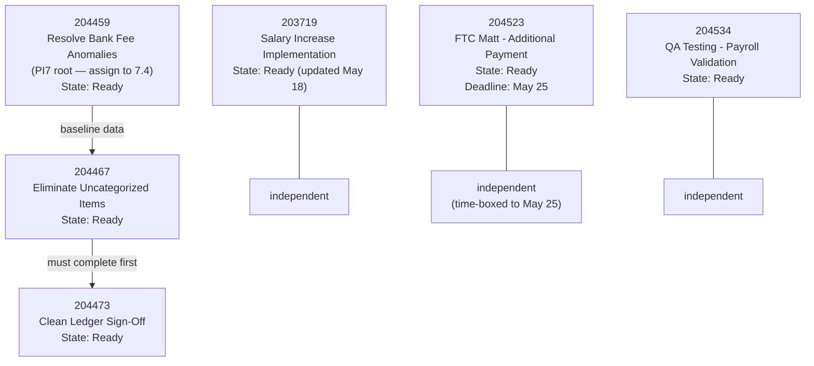
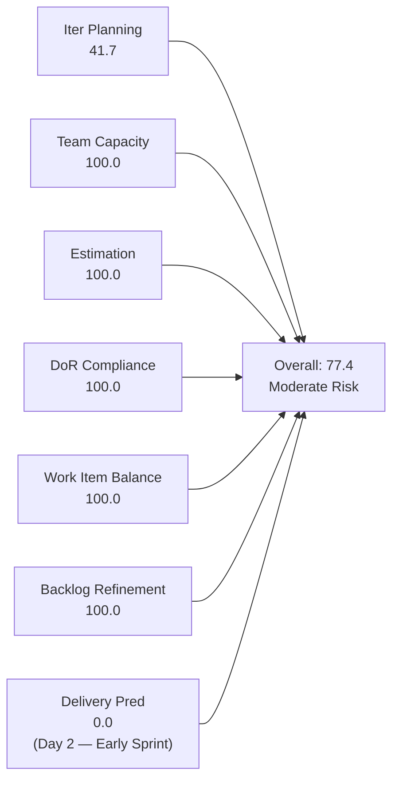
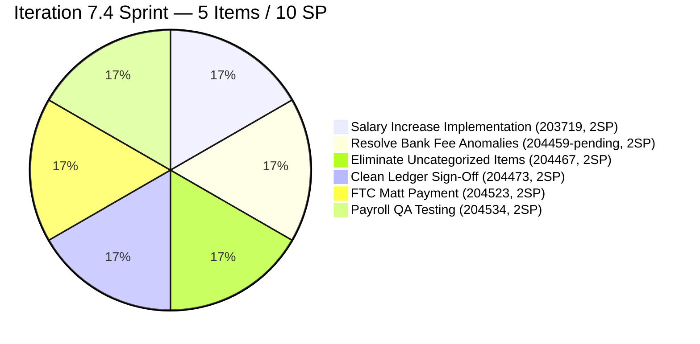
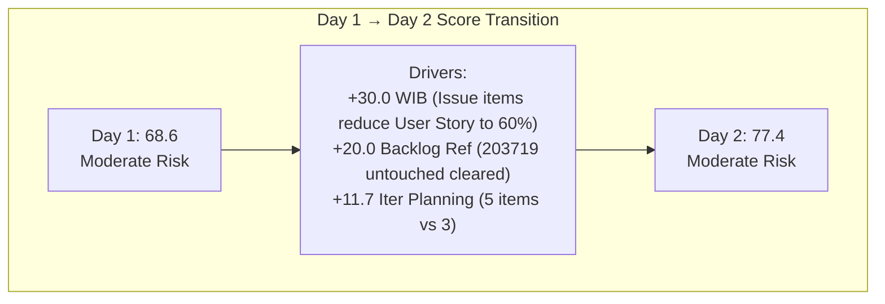
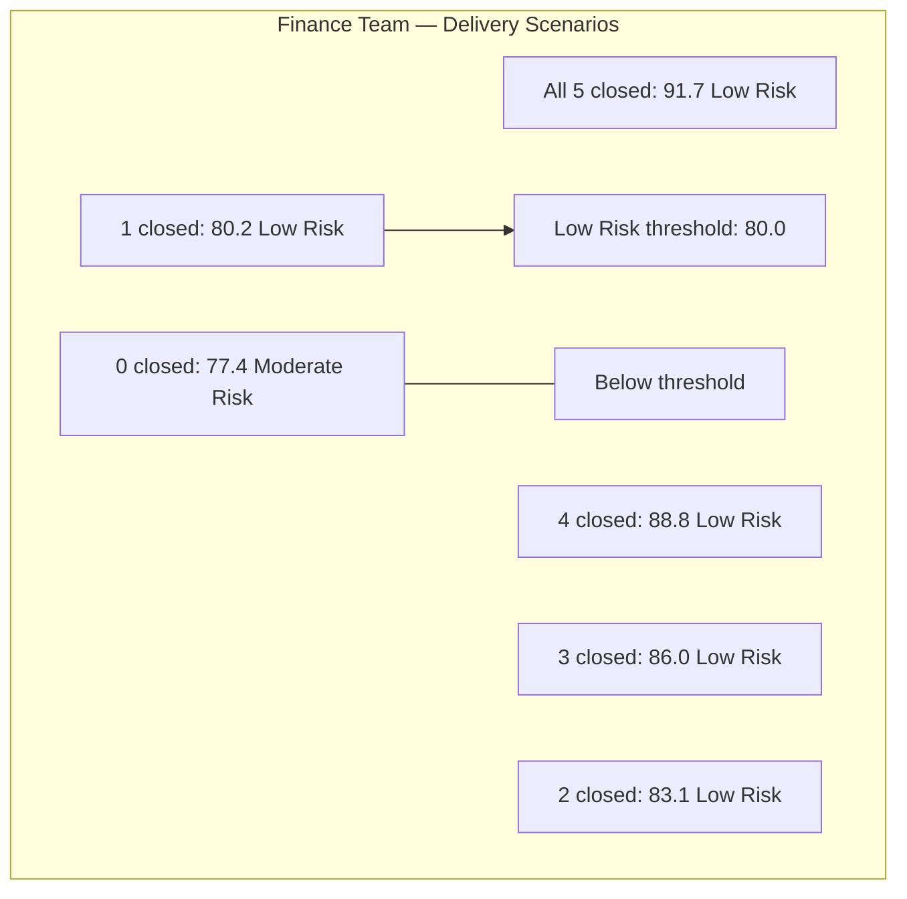

# SAFe Iteration Audit — Finance Team

## 1. Audit Metadata

| Field | Value |
|-------|-------|
| **Project** | Jairosoft FINOPS |
| **Team** | Finance Team |
| **Workspace** | `ado_fin` |
| **ADO Project ID** | e0bb302f-40f9-46c3-8164-6f1acb317d63 |
| **ADO Team ID** | 1f4b45fa-82e8-4a36-aedc-6c1bc8f51070 |
| **Iteration** | Iteration 7.4 |
| **Iteration Start** | 2026-05-18 |
| **Iteration Finish** | 2026-05-31 |
| **Audit Date** | 2026-05-19 (CDT) |
| **Audit Day** | Day 2 of 14 |
| **Prior Audit** | AUDIT_20260518_0900.md (Day 1, Iteration 7.4, 68.6 — Moderate Risk) |
| **Overall Score** | **77.4 / 100** |
| **Risk Band** | **Moderate Risk** |

---

## 2. Executive Summary

The Finance Team rises to **77.4 / 100 (Moderate Risk)** on Day 2 of Iteration 7.4 — an improvement of +8.8 from yesterday's 68.6. This significant gain is driven by two material changes confirmed in today's ADO evidence:

1. **Two new items (204523 and 204534) have been added to Iteration 7.4.** These Issue-type work items were not visible in yesterday's backlog audit. Both are assigned to Grace, both have adequate DoR, and both carry 2 SP each. This raises the active iteration count from 3 to **5 items**, committed SP from 6 to **10 SP**, and the Iteration Planning ratio from 30.0 to **41.7**.

2. **Item 203719 (Salary Increase Implementation) has been updated.** Yesterday this item was flagged as unchanged since May 4, triggering a −20 Backlog Refinement penalty. Today's ADO data confirms it was updated on 2026-05-18 — the penalty is cleared and Backlog Refinement now scores **100.0**.

**The sprint is now better-structured** but still moderately underloaded. With 5 items (10 SP) against Grace's ~20-hour sprint capacity (2 hrs/day × 10 working days), the team is at approximately 50% utilization. Item 204459 (Resolve Historical Bank Fee & Transaction Anomalies) remains at the PI7 root path and could be pulled into 7.4 to further improve the planning ratio and sprint value.

**Work Item Balance improves to 100.0** — the two new Issue items (204523, 204534) diversify the type mix so that no single type exceeds the 60% dominant threshold (User Story: 3/5 = 60.0%, which does not exceed the strict >60% threshold).

**Delivery Predictability is 0.0** — expected on Day 2 with no closures yet.

---

## 3. Previous Audit Delta

**Prior audit:** AUDIT_20260518_0900.md — Iteration 7.4, Day 1, Score 68.6 / 100 (Moderate Risk)

| Dimension | Day 1 | Day 2 | Delta | Driver |
|-----------|-------|-------|-------|--------|
| Iteration Planning | 30.0 | **41.7** | +11.7 | 204523 + 204534 added to 7.4; 5 of 12 visible items now in sprint |
| Team Capacity | 100.0 | **100.0** | 0.0 | Grace configured; no change |
| Estimation | 100.0 | **100.0** | 0.0 | All 5 sprint items estimated at 2 SP each |
| DoR Compliance | 100.0 | **100.0** | 0.0 | All 5 items pass Description + AC thresholds |
| Work Item Balance | 70.0 | **100.0** | +30.0 | User Story 3/5 = 60.0% — does not exceed >60% threshold; no dominant penalty |
| Backlog Refinement | 80.0 | **100.0** | +20.0 | 203719 updated May 18; untouched penalty cleared |
| Delivery Predictability | 0.0 | **0.0** | 0.0 | Day 2 — no closures yet (early-sprint) |
| **Overall** | **68.6** | **77.4** | **+8.8** | Two new items + 203719 update resolve Day 1 penalties |

**Key finding:** The 8.8-point jump from Day 1 to Day 2 reflects real team activity — Grace added sprint scope and resolved the untouched item flag within the first day of the sprint. This is healthy sprint planning behavior.

---

## 4. Current Iteration Snapshot

| Attribute | Value |
|-----------|-------|
| Active Iteration | Iteration 7.4 |
| Sprint Duration | 2026-05-18 to 2026-05-31 (14 days) |
| Audit Day | **Day 2** |
| Current Iteration Root Items | **5** |
| Total Visible Backlog Root Items | **12** |
| Sprint Load % | **41.7%** |
| Total Committed Story Points | **10 SP** |
| Closed Story Points | 0 SP |
| Active Team Members | 1 (Grace) |
| Capacity Configured | Yes — 2 hrs/day (1 Documentation + 1 Requirements); 0 days off |
| Items at PI7 Root (unscheduled) | 1 (204459) |
| Items in 7.5 | 3 (204481, 204490, 204495) |
| Items in 7.6 IP Sprint | 3 (204502, 204507, 204512) |

---

## 5. Work Item Analysis

### 5.1 Current Iteration Items — Iteration 7.4 (5 items)

| ID | Title | Type | State | SP | DoR | Changed | Notes |
|----|-------|------|-------|----|-----|---------|-------|
| 203719 | Salary Increase Implementation | User Story | Ready | 2 | ✓ | 2026-05-18 | Updated Day 1 — untouched flag cleared |
| 204467 | Eliminate Uncategorized Items in the Ledger | User Story | Ready | 2 | ✓ | 2026-05-18 | Phase 2 of ledger cleanup |
| 204473 | Clean Ledger Verification & Iteration Sign-Off | User Story | Ready | 2 | ✓ | 2026-05-18 | Depends on 204467 |
| 204523 | FTC Matt for the additional Payment | Issue | Ready | 2 | ✓ | 2026-05-18 | NEW — payment collection item |
| 204534 | QA Testing | Issue | Ready | 2 | ✓ | 2026-05-18 | NEW — payroll validation item |

**Total committed: 10 SP across 5 items (3 User Stories + 2 Issues)**

**DoR verification for new items:**
- **204523:** Description — "As discussed with Matt, he assured that he will send additional payment before the 25th." (86 chars ✓). AC — "Received the additional payment" (31 chars ✓). **DoR: PASS** — minimally compliant; AC is thin.
- **204534:** Description — "As the Payroll Preparer, I need to validate if the automated computation is correct" (81 chars ✓). AC — "AC1. Must be same total with the manual computation" (51 chars ✓). **DoR: PASS**.

**Notes on new items:**
- 204523 (FTC Matt payment): This is a receivables/collections item, distinct from the QuickBooks ledger work. It appears to track an outstanding payment from a client named Matt. The 2 SP estimate and Ready state are appropriate. The May 25 deadline mentioned in the description creates a mid-sprint urgency point.
- 204534 (QA Testing): This item tracks payroll validation — confirming automated payroll computation against manual totals. Scope is well-bounded. The title "QA Testing" is generic; consider renaming to "Payroll Automation QA Testing" for clarity.

### 5.2 Item at PI7 Root — Needs Iteration Assignment

| ID | Title | Type | Iter | State | SP | Changed |
|----|-------|------|------|-------|----|---------|
| 204459 | Resolve Historical Bank Fee & Transaction Anomalies | User Story | PI7 (root) | Ready | 2 | 2026-05-18 |

This item logically precedes the 7.4 ledger cleanup work. Assigning it to 7.4 would raise sprint commitment to 12 SP (6 items) and improve the planning ratio to 50.0%. Its Description and Acceptance Criteria are well-formed (Given/When/Then with zero-variance criterion).

### 5.3 Multi-Iteration Roadmap (Finance Ledger Digitization)

| Iteration | Items | Theme | SP |
|-----------|-------|-------|----|
| 7.4 | 203719, 204523, 204534, 204467, 204473 (+204459 pending) | Ledger Cleanup, Payroll, Collections | 10 (12 with 204459) |
| 7.5 | 204481, 204490, 204495 | Bank Feed Automation | 6 |
| 7.6 (IP) | 204502, 204507, 204512 | Reconciliation & Reporting | 6 |

The roadmap structure is maintained from Day 1. The addition of 204523 and 204534 adds operational work items alongside the QuickBooks implementation stream — this reflects the team's dual mandate (operations + digital transformation).

### 5.4 Dependency Chain

---

## 6. SAFe Compliance Scorecard

| Dimension | Score | Evidence | Notes |
|-----------|-------|----------|-------|
| Iteration Planning | **41.7** | 5 of 12 visible backlog items in Iteration 7.4 | Multi-iter roadmap; 204459 (PI7 root) + 7 items in 7.5/7.6 not yet in 7.4 |
| Team Capacity | **100.0** | Grace: 2 hrs/day (Documentation + Requirements); 0 days off | Fully configured; single contributor |
| Estimation | **100.0** | All 5 sprint items at 2 SP each; committed_sp=10 | Uniform estimates reflect similar-scope ledger stories |
| DoR Compliance | **100.0** | 5 of 5 items: Description ≥30 chars ✓; AC ≥20 chars ✓ | 204523 and 204534 minimally compliant; recommend AC strengthening |
| Work Item Balance | **100.0** | User Story: 3/5 = 60.0% (does not exceed >60%); Issue: 2/5 = 40%; no Spikes | Two Issue types bring diversity; no dominant-type penalty triggered |
| Backlog Refinement | **100.0** | 12/12 fresh within 45d; 0 stale ≥90d; 0 stale ≥180d; 0/5 untouched | 203719 updated May 18 — Day 1 penalty resolved |
| Delivery Predictability | **0.0** | committed_sp=10; closed_sp=0; Day 2 | **Early-sprint — low delivery expected; Day 2 of 14-day sprint** |
| **Overall** | **77.4** | (41.7+100+100+100+100+100+0) / 7 = 541.7/7 | **Moderate Risk — strong quality metrics; planning ratio is the primary score driver** |

---

## 7. Dimension Findings

### 7.1 Iteration Planning — 41.7 (High Risk — Dimension Level)

5 of 12 visible backlog items are in Iteration 7.4, up from 3/10 on Day 1 (ratio improved from 30.0 to 41.7). The improvement reflects active sprint management — Grace added two new sprint items on the first day.

The score remains in the High Risk band for this dimension individually, driven by the deliberate multi-iteration roadmap (7 items staged for 7.5/7.6) and the unscheduled 204459 at PI7 root. However, this is a structural characteristic of mature PI planning, not a failure.

**Path to improvement:** Assigning 204459 to 7.4 would raise the ratio to 50.0 (6/12). Pulling one 7.5 item forward if Grace finishes 7.4 scope early would push toward 58.3 (7/12). A 50+ Iteration Planning score combined with the team's strong quality dimensions would push the overall score past 80 (Low Risk).

### 7.2 Team Capacity — 100.0 (Low Risk)

Grace is configured at 2 hrs/day with no days off. Capacity is maintained from Day 1. With 10 SP committed and ~20 hours available, Grace is at approximately 50% capacity utilization — an improvement over yesterday's 30% but still has capacity for 204459.

**Persistent bus factor risk:** All Finance Team operations depend on Grace. No backup documentation exists.

### 7.3 Estimation — 100.0 (Low Risk)

All 5 sprint items are estimated at 2 SP each, yielding 10 committed story points. The uniform 2 SP distribution is reasonable for the scope of items: each is a bounded, well-defined financial task (sign-off, categorization, payroll validation, payment collection).

### 7.4 DoR Compliance — 100.0 (Low Risk)

All 5 items pass the DoR threshold (Description ≥30 chars + AC ≥20 chars). The two new Issue items (204523, 204534) pass minimally:

- **204523 AC improvement:** "Received the additional payment" is a binary criterion but lacks specificity. Recommended update: "Grace confirms receipt of payment from Matt (amount: [specify], method: [bank transfer/GCash]), enters the transaction in the accounting system, and files the payment receipt. Payment is reconciled against the outstanding balance before May 25."
- **204534 AC improvement:** "Must be same total with the manual computation" is a valid but narrow criterion. Add: "Variance between automated computation and manual baseline is exactly zero. If variance exists, root cause is identified and documented before payroll submission."

### 7.5 Work Item Balance — 100.0 (Low Risk)

The two Issue items reduce the User Story concentration from 100% (Day 1) to 60.0% — precisely at the boundary of the >60% dominant-type penalty. Since the formula applies the penalty only when dominant share **strictly exceeds** 60%, the score is 100 (no penalties applied).

This is the first time the Finance Team has scored 100.0 on Work Item Balance. The mix of User Stories (3) and Issues (2) with no Spikes represents the team's most diverse sprint type distribution.

### 7.6 Backlog Refinement — 100.0 (Low Risk)

All 12 visible backlog items are fresh (changed within 45 days). No stale items exist. The key change from Day 1: item 203719 (Salary Increase Implementation) was updated on May 18, clearing the untouched penalty that reduced this dimension to 80.0 yesterday.

No current iteration items are untouched (all 5 changed May 18). Excellent refinement posture.

### 7.7 Delivery Predictability — 0.0 (Early-Sprint)

**Early-sprint annotation:** Day 2 of a 14-day sprint. No items closed.

**7.4 delivery projections:**

| Scenario | Closed SP | DP Score | Overall | Band |
|----------|-----------|---------|---------|------|
| All 5 items close | 10 | 100.0 | **91.7** | Low Risk |
| 4 items close (excl. 203719) | 8 | 80.0 | **88.8** | Low Risk |
| 3 items close (ledger pair) | 6 | 60.0 | **86.0** | Low Risk |
| 2 items close | 4 | 40.0 | **83.1** | Low Risk |
| 1 item closes | 2 | 20.0 | **80.2** | Low Risk |

**Key finding:** Even with only 1 item closed, the Finance Team's overall score crosses into Low Risk (≥80) territory. The team is on the cusp of its best sprint close score ever, pending any delivery activity. Closing items early in the sprint is the highest-leverage action for the final score.

---

## 8. Risks and Bottlenecks

| Risk | Severity | Description |
|------|----------|-------------|
| Iteration Planning ratio at 41.7 | **Moderate** | Only 5 of 12 items in active sprint; 204459 unscheduled at PI7 root; intentional roadmap staging but limits planning score |
| 204523 payment deadline May 25 | **High** | FTC Matt payment expected before May 25 — this is an external dependency not controlled by the team; if payment doesn't arrive, the item cannot close |
| 204473 depends on 204467 | **Moderate** | Ledger sign-off cannot proceed until uncategorized items are eliminated; sequencing must be enforced |
| Bus factor = 1 | **High** | Grace is the sole Finance Team contributor; no backup documentation for payroll, BIR, QuickBooks, or collections |
| 204523 and 204534 thin AC | **Low** | Both new Issue items have minimally compliant but not substantively complete acceptance criteria; risk of scope creep or disputed closure |

---

## 9. Prioritized Recommendations

1. **Assign 204459 (Resolve Historical Bank Fee & Transaction Anomalies) to Iteration 7.4 today.** This item is at PI7 root, is Ready, has full DoR, logically precedes the 7.4 cleanup work, and Grace has remaining capacity. Adding it brings commitment to 12 SP (50% planning ratio, 6 items) and creates a better-sequenced ledger sprint.

2. **Start item 204467 (Eliminate Uncategorized Items) today and target closure by Day 7.** This is the prerequisite for 204473 (Ledger Sign-Off). The earlier 204467 closes, the more time Grace has to verify the clean ledger and secure sign-off within the sprint window.

3. **Chase the 204523 payment (FTC Matt) before May 25.** This item's closure depends on Matt sending an additional payment before May 25. By Day 5 (May 22), send a reminder/confirmation to Matt and document the expected payment date in the ADO item comment. If payment has not arrived by May 22, flag this to Ramon as an external dependency risk.

4. **Strengthen the AC for 204523 and 204534.** Both items pass the DoR minimum but have thin acceptance criteria. See Section 7.4 for specific recommended AC text for each item. Update before items move to Active state.

5. **Rename 204534 (QA Testing) to "Payroll Automation QA Testing."** The generic title creates ambiguity in sprint boards and report tooling. The updated title aligns with the specific validation scope described in the item description.

6. **Set a Day 5 delivery checkpoint.** The team has a 100% achievable sprint if all 5 items close. Set a checkpoint at Day 5: if no items have been closed, identify and document the specific blocker for each item. Ledger items (204467, 204473) have clear, measurable completion criteria and should be closeable within the first week.

---

## 10. Evidence Gaps and Limitations

| Gap | Impact on Scoring |
|-----|------------------|
| 204459 at PI7 root, not PI7\\Iteration 7.4 | Item excluded from current_iteration_root_items; planning ratio scores 41.7 instead of potential 50.0 |
| 204523 external dependency (Matt's payment) | Cannot assess likelihood of closure from ADO evidence; item may remain open at sprint close if payment is delayed |
| Grace's 2 hrs/day vs. sprint scope | Rubric scores capacity configuration only; sprint is lightly loaded at ~50% utilization even with new items |
| 203719 AC — single Four-Eyes criterion | Item passes DoR minimum but is not substantively complete for execution; see Section 7.4 |

**Score interpretation:** The 77.4 Moderate Risk score represents a meaningful day-over-day improvement and reflects the Finance Team's best Day 2 score this PI. The team is close to the 80.0 Low Risk threshold — any delivery activity during the sprint will push the score into Low Risk territory. The Iteration Planning dimension (41.7) is the only structural drag; it reflects deliberate multi-sprint roadmapping, not a planning failure. Adding 204459 to the sprint and closing items early are the two actions most likely to produce a Low Risk close score.

---

## Appendix — Score Visualization

