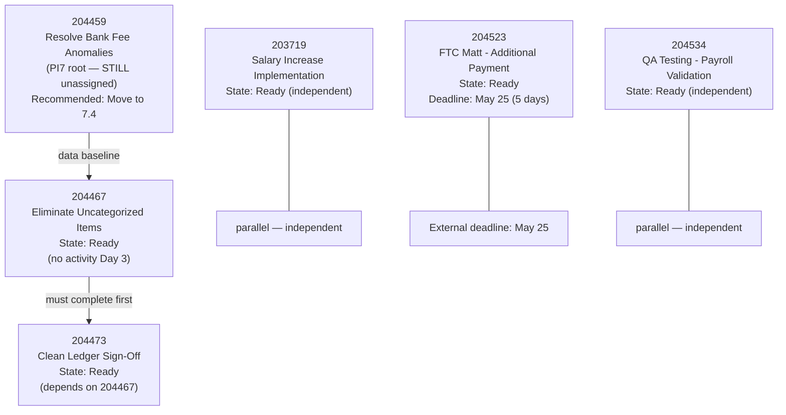
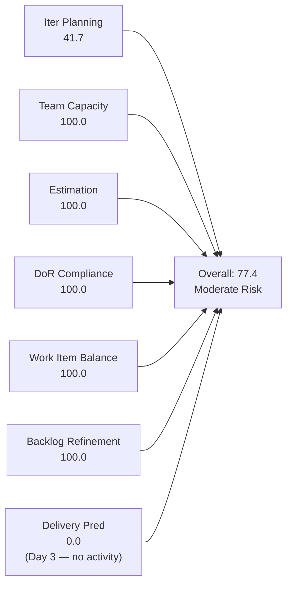
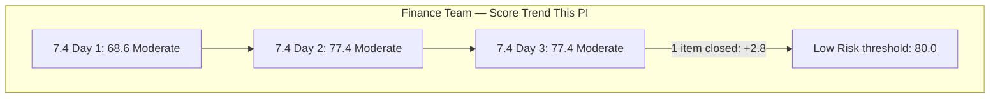
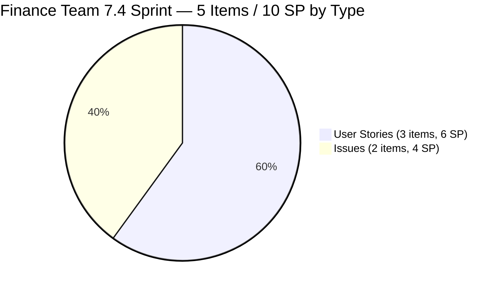
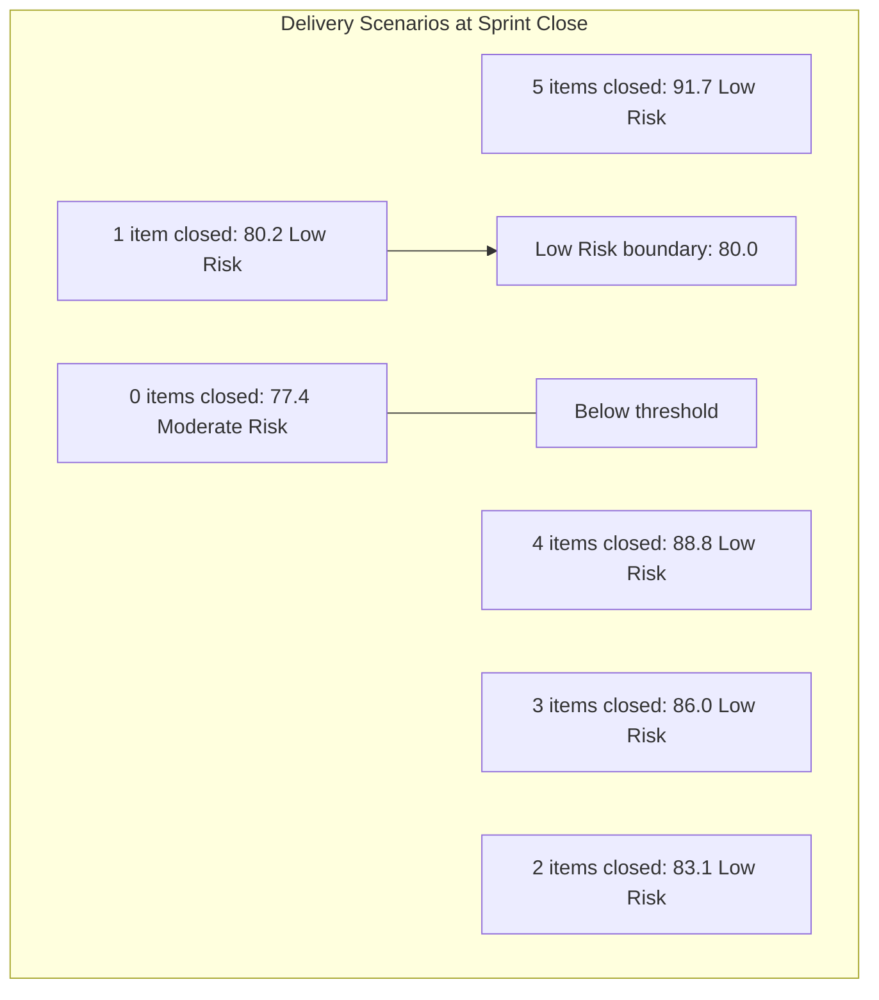

# SAFe Iteration Audit — Finance Team

## 1. Audit Metadata

| Field | Value |
|-------|-------|
| **Project** | Jairosoft FINOPS |
| **Team** | Finance Team |
| **Workspace** | `ado_fin` |
| **ADO Project ID** | e0bb302f-40f9-46c3-8164-6f1acb317d63 |
| **ADO Team ID** | 1f4b45fa-82e8-4a36-aedc-6c1bc8f51070 |
| **Iteration** | Iteration 7.4 |
| **Iteration Start** | 2026-05-18 |
| **Iteration Finish** | 2026-05-31 |
| **Audit Date** | 2026-05-20 (CDT) |
| **Audit Day** | Day 3 of 14 |
| **Prior Audit** | AUDIT_20260519_0205.md (Day 2, Iteration 7.4, 77.4 — Moderate Risk) |
| **Overall Score** | **77.4 / 100** |
| **Risk Band** | **Moderate Risk** |

---

## 2. Executive Summary

The Finance Team holds at **77.4 / 100 (Moderate Risk)** on Day 3 of Iteration 7.4 — unchanged from Day 2. No structural changes were detected in today's ADO evidence pull: the same 5 sprint items remain in Iteration 7.4, no new items have been added, no items have been closed, and item 204459 (Resolve Historical Bank Fee & Transaction Anomalies) remains at the PI7 root path without iteration assignment.

**The sprint is structurally stable but activity-quiet on Day 3.** All 5 sprint items are in Ready state with no state transitions since May 18. Grace has not yet moved any item to Active or In Progress. With a 10-working-day sprint window (May 18–31), Day 3 without any item activation is not yet alarming — but the Day 5 checkpoint is approaching.

**Key open actions from Day 2 remain unaddressed:**
- 204459 still at PI7 root — assigning it to 7.4 would improve Iteration Planning from 41.7 to 50.0
- 204523 AC still thin ("Received the additional payment") — the FTC Matt payment deadline is May 25 (5 days away)
- 204534 title ("QA Testing") still generic — no rename to "Payroll Automation QA Testing"

**The path to Low Risk (≥80) at sprint close requires at least one item closed.** At the current 10 SP committed / 5-item sprint, closing even 1 item pushes the overall score to 80.2 — just above the Low Risk threshold. Grace's sprint is structurally well-positioned for a strong close.

---

## 3. Previous Audit Delta

**Prior audit:** AUDIT_20260519_0205.md — Iteration 7.4, Day 2, Score 77.4 / 100 (Moderate Risk)

| Dimension | Day 2 | Day 3 | Delta | Driver |
|-----------|-------|-------|-------|--------|
| Iteration Planning | 41.7 | **41.7** | 0.0 | No new items added; 204459 still at PI7 root |
| Team Capacity | 100.0 | **100.0** | 0.0 | Grace configured; no change |
| Estimation | 100.0 | **100.0** | 0.0 | All 5 sprint items at 2 SP |
| DoR Compliance | 100.0 | **100.0** | 0.0 | All 5 items pass Description + AC thresholds |
| Work Item Balance | 100.0 | **100.0** | 0.0 | 3 US + 2 Issues = 60.0% US (no dominant penalty) |
| Backlog Refinement | 100.0 | **100.0** | 0.0 | All 12 items fresh; 0 stale; 0 untouched |
| Delivery Predictability | 0.0 | **0.0** | 0.0 | Day 3 — no closures; no state transitions observed |
| **Overall** | **77.4** | **77.4** | **0.0** | No structural change from Day 2 |

**Key finding:** The Finance Team's Day 3 evidence is a flat mirror of Day 2. This is acceptable on Day 3 of a 14-day sprint but Grace should activate at least one item today to begin establishing delivery momentum.

---

## 4. Current Iteration Snapshot

| Attribute | Value |
|-----------|-------|
| Active Iteration | Iteration 7.4 |
| Sprint Duration | 2026-05-18 to 2026-05-31 (14 days) |
| Audit Day | **Day 3** |
| Current Iteration Root Items | **5** |
| Total Visible Backlog Root Items | **12** |
| Sprint Load % | **41.7%** |
| Total Committed Story Points | **10 SP** |
| Closed Story Points | 0 SP |
| Active Items | 0 |
| Active Team Members | 1 (Grace) |
| Capacity Configured | Yes — 2 hrs/day (1 Documentation + 1 Requirements); 0 days off |
| Items at PI7 Root (unscheduled) | 1 (204459) |
| Items in 7.5 | 3 (204481, 204490, 204495) |
| Items in 7.6 IP Sprint | 3 (204502, 204507, 204512) |

---

## 5. Work Item Analysis

### 5.1 Current Iteration Items — Iteration 7.4 (5 items, unchanged)

| ID | Title | Type | State | SP | DoR | Changed | Notes |
|----|-------|------|-------|----|-----|---------|-------|
| 203719 | Salary Increase Implementation | User Story | Ready | 2 | ✓ | 2026-05-18 | Day 3 — no activity since May 18 |
| 204467 | Eliminate Uncategorized Items in the Ledger | User Story | Ready | 2 | ✓ | 2026-05-18 | Prerequisite for 204473 |
| 204473 | Clean Ledger Verification & Iteration Sign-Off | User Story | Ready | 2 | ✓ | 2026-05-18 | Depends on 204467 |
| 204523 | FTC Matt for the additional Payment | Issue | Ready | 2 | ✓ | 2026-05-18 | May 25 payment deadline approaching |
| 204534 | QA Testing | Issue | Ready | 2 | ✓ | 2026-05-18 | Rename recommended |

**Total committed: 10 SP across 5 items (3 User Stories + 2 Issues) — unchanged**

### 5.2 Item at PI7 Root — Still Unscheduled (Day 3)

| ID | Title | Type | Iter | State | SP | Changed |
|----|-------|------|------|-------|----|---------|
| 204459 | Resolve Historical Bank Fee & Transaction Anomalies | User Story | PI7 (root) | Ready | 2 | 2026-05-18 |

This item has been at PI7 root for 3 sprint days without being assigned to 7.4. The Day 2 recommendation to assign it remains unactioned. Adding it to 7.4 would raise committed SP to 12 and Iteration Planning to 50.0 (6/12).

### 5.3 FTC Matt Payment — 5 Days to Deadline

Item 204523 (FTC Matt for the additional Payment) has an externally-committed deadline: Matt assured payment before May 25. Today is May 20 — 5 days remain. Grace should confirm payment status with Matt today (Day 3) to establish whether the item will close within the sprint window. If payment is delayed beyond May 25, this item will carry over to 7.5 and reduce Delivery Predictability.

### 5.4 Sprint Dependency Chain

### 5.5 Sprint Delivery Scenarios (Updated for Day 3)

| Scenario | Closed SP | DP Score | Overall | Band |
|----------|-----------|---------|---------|------|
| All 5 items close | 10 | 100.0 | **91.7** | Low Risk |
| 4 items close | 8 | 80.0 | **88.8** | Low Risk |
| 3 items close | 6 | 60.0 | **86.0** | Low Risk |
| 2 items close | 4 | 40.0 | **83.1** | Low Risk |
| 1 item closes | 2 | 20.0 | **80.2** | Low Risk |
| 0 items close | 0 | 0.0 | **77.4** | Moderate Risk |

**Closing even 1 item crosses into Low Risk territory.** The team remains on the cusp of its best sprint close score this PI.

---

## 6. SAFe Compliance Scorecard

| Dimension | Score | Evidence | Notes |
|-----------|-------|----------|-------|
| Iteration Planning | **41.7** | 5 of 12 visible backlog items in Iteration 7.4 | 204459 at PI7 root; 7 items in 7.5/7.6 roadmap; deliberate multi-sprint staging |
| Team Capacity | **100.0** | Grace: 2 hrs/day (Documentation + Requirements); 0 days off | Fully configured; single contributor; ~50% utilization at 10 SP |
| Estimation | **100.0** | All 5 sprint items at 2 SP each; committed_sp = 10 | Uniform estimates; consistent with bounded ledger story scope |
| DoR Compliance | **100.0** | 5 of 5 items: Description ≥30 chars ✓; AC ≥20 chars ✓ | 204523 and 204534 minimally compliant; AC strengthening recommended |
| Work Item Balance | **100.0** | User Story 3/5 = 60.0% (not strictly >60%); Issue 2/5 = 40%; no Spikes | Boundary condition holds; no dominant-type penalty |
| Backlog Refinement | **100.0** | 12/12 fresh within 45d; 0 stale ≥90d; 0 stale ≥180d; 0/5 untouched | All 12 items changed ≥ May 18; perfect refinement posture |
| Delivery Predictability | **0.0** | committed_sp=10; closed_sp=0; Day 3 | Day 3 of 14-day sprint — no state transitions; no closures yet |
| **Overall** | **77.4** | (41.7+100+100+100+100+100+0) / 7 = 541.7/7 | **Moderate Risk — Day 3 baseline; quality excellent; planning ratio is the structural constraint** |

---

## 7. Dimension Findings

### 7.1 Iteration Planning — 41.7 (High Risk — Dimension Level)

5 of 12 items in 7.4 — unchanged from Day 2. Item 204459 remains at PI7 root for the third consecutive day. Assigning 204459 to 7.4 is the single most impactful action available today that does not require external coordination. It would raise Iteration Planning to 50.0 (6/12) and push the overall score to 79.6 — just below Low Risk threshold.

### 7.2 Team Capacity — 100.0 (Low Risk)

Grace configured at 2 hrs/day with no days off. Sprint utilization at approximately 50% (10 SP against ~20-hour sprint window). There is headroom for 204459 and potentially one more item if Grace's pace permits.

### 7.3 Estimation — 100.0 (Low Risk)

All 5 sprint items estimated at 2 SP. No new items to evaluate. Consistent with Day 2.

### 7.4 DoR Compliance — 100.0 (Low Risk)

All 5 items pass DoR. Item 204523 AC remains "Received the additional payment" — minimally compliant at 31 chars but thin in execution guidance. The Day 2 recommendation to strengthen AC for 204523 and 204534 has not yet been actioned. Updating these before the items move to Active is the advised approach.

### 7.5 Work Item Balance — 100.0 (Low Risk)

Work item type distribution unchanged: 3 User Stories + 2 Issues = 60.0% User Story, exactly at the boundary. Score maintained at 100.0.

### 7.6 Backlog Refinement — 100.0 (Low Risk)

All 12 visible backlog items are fresh (changed within 45 days). No stale items. No untouched sprint items. Consistent with Day 2.

### 7.7 Delivery Predictability — 0.0 (Day 3)

No items closed. No state transitions observed — all 5 sprint items remain in Ready state. While Day 3 without a state change is still within the normal sprint ramp-up window, Day 4 should see at least one item moved to Active. The ledger prerequisite chain (204459 → 204467 → 204473) means 204467 cannot close until 204459's work is integrated — another reason to assign 204459 to 7.4 today.

**Delivery milestone:** The FTC Matt payment (204523) has a May 25 deadline (Day 8 of the sprint). If payment is received by May 25, this item can be closed on Day 8, contributing 2 SP to Delivery Predictability (80.0 delivery rate → 80.0 DP score if only this item closes, pushing overall above Low Risk).

---

## 8. Risks and Bottlenecks

| Risk | Severity | Description |
|------|----------|-------------|
| 204523 payment deadline May 25 (Day 8) | **High** | FTC Matt additional payment expected before May 25; no status update in ADO since May 18; Grace should confirm by today |
| Zero item activity on Day 3 | **Moderate** | All 5 sprint items in Ready state with no changes since May 18; Day 5 is the checkpoint threshold for no-closure alert |
| 204459 unassigned at PI7 root | **Moderate** | Three days without scheduling; impacts planning ratio and creates data gap for 204467 prerequisite work |
| 204473 dependency on 204467 | **Moderate** | Sign-off cannot proceed until ledger categorization is complete; Grace should start 204467 first |
| 204523 and 204534 thin AC | **Low** | Both minimally compliant; risk of disputed closure if AC is ambiguous when item is submitted for review |
| Bus factor = 1 | **High** | Grace is the sole Finance Team contributor; no backup documentation for payroll, BIR, QuickBooks, or collections |

---

## 9. Prioritized Recommendations

1. **Assign 204459 (Resolve Historical Bank Fee & Transaction Anomalies) to Iteration 7.4 today.** Three days have passed since this was first recommended. The item is Ready, has full DoR, is assigned to Grace, and logically precedes the 7.4 ledger cleanup work. Adding it: (a) raises Iteration Planning from 41.7 to 50.0, (b) creates the correct data sequence for 204467, and (c) uses Grace's available sprint capacity. Action takes less than 1 minute in ADO.

2. **Activate item 204467 (Eliminate Uncategorized Items) today.** With 204459 either assigned or not, 204467 is the next logical item to begin. Grace should move it to Active today to begin QuickBooks categorization work. This item must complete before 204473 (Sign-Off) can begin.

3. **Contact FTC Matt today to confirm May 25 payment status.** Item 204523 has an external dependency on a client payment. With 5 days remaining to the deadline, today is the appropriate day to send a confirmation message and document Matt's response in the ADO item comment. If payment is uncertain, flag to Ramon by Day 5.

4. **Strengthen AC for 204523 and 204534 before moving to Active.** See Day 2 audit for recommended AC text. Both items are currently in Ready state — this is the ideal time to improve AC before execution begins. The update prevents disputed closures and maintains DoR quality for future sprint reviews.

5. **Rename 204534 from "QA Testing" to "Payroll Automation QA Testing."** Generic title creates ambiguity in ADO boards and reporting. The rename takes under 30 seconds.

6. **Set Day 5 delivery checkpoint.** If no items are in Active state by May 22 (Day 5), hold a 15-minute sync to identify and document blockers for each item. Grace's sprint has 100% achievable delivery based on scope and capacity.

---

## 10. Evidence Gaps and Limitations

| Gap | Impact on Scoring |
|-----|------------------|
| 204459 at PI7 root, not Iteration 7.4 | Item excluded from current_iteration_root_items; planning ratio 41.7 instead of potential 50.0 |
| 204523 external dependency (Matt's payment) | Cannot assess likelihood of closure from ADO evidence; item may remain open if payment is delayed |
| Grace's 2 hrs/day vs. sprint scope | Sprint lightly loaded at ~50% utilization; rubric scores configuration only |
| No activity on any sprint item since May 18 | ADO ChangedDates show all 5 items last updated May 18; no Day 3 activity is observable in evidence |

**Score interpretation:** The 77.4 Moderate Risk score is stable and reflects the Finance Team's best sprint entry posture this PI. The structural gap is the 41.7 Iteration Planning dimension — a function of the deliberate multi-sprint roadmap. The team is well-positioned for a Low Risk sprint close if Grace begins delivery work by Day 4–5. Assigning 204459 today and closing even 1 item by Day 8 would push the final score above 80.

---

## Appendix — Score Visualization

