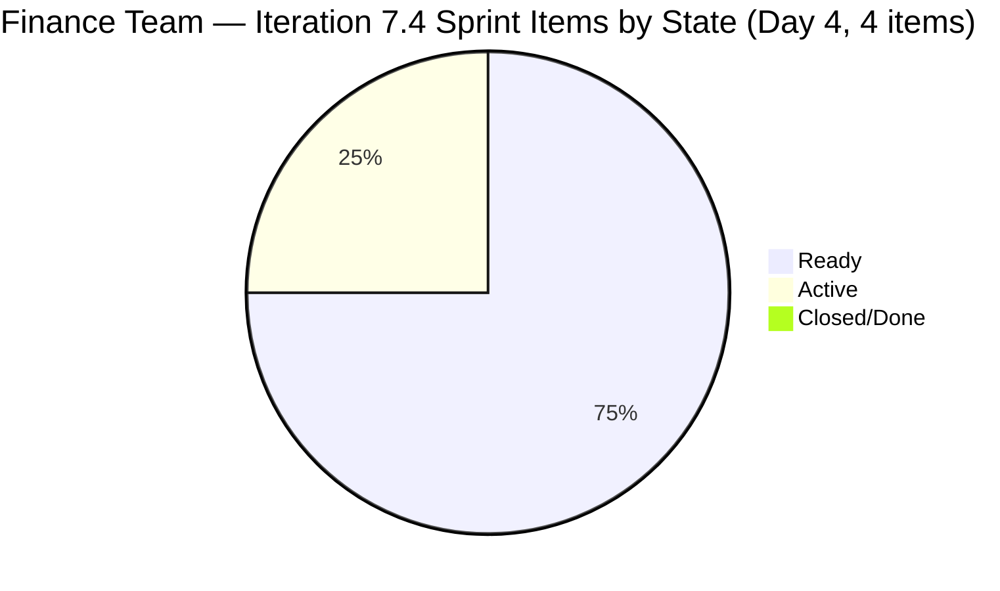
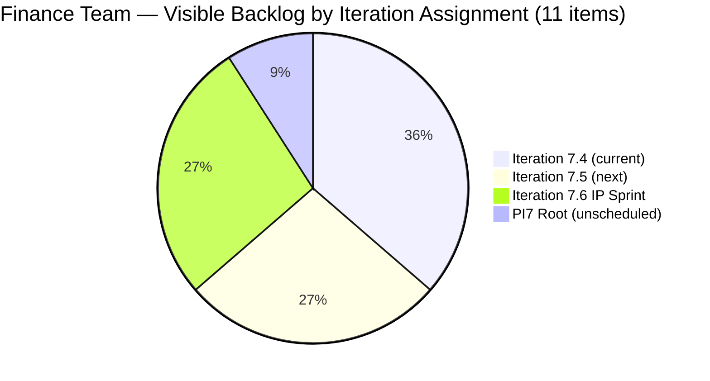
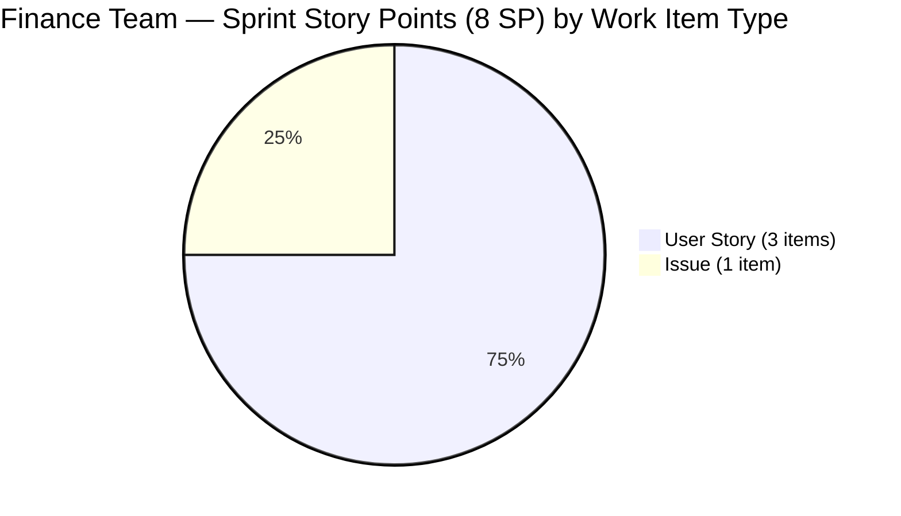

# SAFe Iteration Audit — Finance Team

## 1. Audit Metadata

| Field | Value |
|-------|-------|
| **Project** | Jairosoft FINOPS |
| **Team** | Finance Team |
| **Workspace** | `ado_fin` |
| **ADO Project ID** | e0bb302f-40f9-46c3-8164-6f1acb317d63 |
| **ADO Team ID** | 1f4b45fa-82e8-4a36-aedc-6c1bc8f51070 |
| **Iteration** | Iteration 7.4 |
| **Iteration Start** | 2026-05-18 |
| **Iteration Finish** | 2026-05-31 |
| **Audit Date** | 2026-05-21 |
| **Audit Day** | Day 4 of 14 |
| **Prior Audit** | AUDIT_20260520_0204.md (Day 3, Iteration 7.4, 77.4 — Moderate Risk) |
| **Overall Score** | **72.3 / 100** |
| **Risk Band** | **Moderate Risk** |

---

## 2. Executive Summary

The Finance Team scores **72.3 / 100 (Moderate Risk)** on Day 4 of Iteration 7.4 — a **−5.1 decline from Day 3's 77.4**. This regression is driven by a single structural change: item **204459 (Resolve Historical Bank Fee & Transaction Anomalies)** was moved from Iteration 7.4 to the PI7 root path today (ChangedDate 2026-05-21T08:06:17), reducing the sprint's iteration item count from 5 to 4.

**The positive news:** Item 203719 (Salary Increase Implementation) moved to Active state today (ChangedDate 2026-05-20 — confirmed active work). Grace is engaged with the sprint content.

**The two persistent risks driving the score:**

1. **Iteration Planning remains low (36.4).** Only 4 of 11 visible backlog items are assigned to Iteration 7.4. Six items are staged in future iterations (7.5: 3 items; 7.6 IP: 3 items) — this is actually good forward planning, but the PI7-root item (204459) lowering the numerator is an anomaly that should be resolved by assigning 204459 to 7.4 if it is intended for this sprint, or moving it to 7.5 explicitly.

2. **Delivery Predictability = 0.0.** No items are Closed or Done through Day 4. Grace must begin closing items by Day 7 to avoid a velocity gap at sprint close.

**Path to Low Risk:** Assigning 204459 to Iteration 7.4 restores planning to 45.5 and pushes the overall score to ~73.5. Closing 1 item (2 SP) raises Delivery Predictability to 25.0 and the overall to ~76.0. Closing 2 items raises Delivery Predictability to 50.0 and pushes the overall to ~79.2. The team is within reach of Low Risk if sprint execution is strong.

---

## 3. Previous Audit Delta

**Prior audit:** AUDIT_20260520_0204.md — Iteration 7.4, Day 3, Score 77.4 / 100 (Moderate Risk)

| Dimension | Day 3 | Day 4 | Delta | Driver |
|-----------|-------|-------|-------|--------|
| Iteration Planning | 41.7 | **36.4** | **−5.3** | 204459 moved from 7.4 to PI7 root; visible backlog 12→11; 4/11 vs 5/12 |
| Team Capacity | 100.0 | **100.0** | 0.0 | Grace configured at 2 hrs/day; no change |
| Estimation | 100.0 | **100.0** | 0.0 | All 4 sprint items have SP=2; fully estimated |
| DoR Compliance | 100.0 | **100.0** | 0.0 | All 4 sprint items pass Description + AC thresholds |
| Work Item Balance | 100.0 | **70.0** | **−30.0** | With 5 items: 4 US + 1 Issue = 80% US (≤ 60% threshold, no penalty); with 4 items: 3 US + 1 Issue = 75% US (> 60% threshold, −30 penalty) |
| Backlog Refinement | 100.0 | **100.0** | 0.0 | All 11 items fresh; 0 stale; 0 untouched in 7.4 |
| Delivery Predictability | 0.0 | **0.0** | 0.0 | Day 4 — no items Closed/Done; early sprint |
| **Overall** | **77.4** | **72.3** | **−5.1** | Driven by 204459 move out of 7.4 and resulting balance penalty |

**Key Day 4 finding:** The primary driver of the score decline is the removal of item 204459 from Iteration 7.4. This single change affects both the Iteration Planning ratio (numerator −1, denominator −1) and the Work Item Balance dimension (the Issue type was the fifth item that kept User Stories below 75%). Restoring 204459 to 7.4 would recover both dimensions.

**Secondary positive:** Item 203719 (Salary Increase Implementation) shows State=Active and ChangedDate 2026-05-20, confirming Grace began active work on Day 3.

---

## 4. Current Iteration Snapshot

| Attribute | Value |
|-----------|-------|
| Active Iteration | Iteration 7.4 |
| Sprint Duration | 2026-05-18 to 2026-05-31 (14 days) |
| Audit Day | **Day 4** |
| Current Iteration Root Items | **4** (was 5 on Day 3) |
| Total Visible Backlog Root Items | **11** (was 12 on Day 3) |
| Sprint Load % | **36.4%** |
| Total Committed Story Points | **8 SP** |
| Closed Story Points | **0 SP** |
| Active Items | 1 (203719 — Grace is working on it) |
| Active Team Members | 1 (Grace) |
| Capacity Configured | Yes — 2 hrs/day (1 Documentation + 1 Requirements); 0 days off |
| Items at PI7 Root (unscheduled) | 1 (204459 — moved out of 7.4 today) |
| Items in Iteration 7.5 | 3 (204481, 204490, 204495) |
| Items in Iteration 7.6 IP Sprint | 3 (204502, 204507, 204512) |

---

## 5. Work Item Analysis

### 5.1 Current Iteration Items — Iteration 7.4 (4 items)

| ID | Title | Type | State | SP | DoR | Changed |
|----|-------|------|-------|----|-----|---------|
| 203719 | Salary Increase Implementation | User Story | Active | 2 | ✅ | 2026-05-20 |
| 204467 | Eliminate Uncategorized Items in the Ledger | User Story | Ready | 2 | ✅ | 2026-05-18 |
| 204473 | Clean Ledger Verification & Iteration Sign-Off | User Story | Ready | 2 | ✅ | 2026-05-18 |
| 204534 | QA Testing | Issue | Ready | 2 | ✅ | 2026-05-18 |

**Total committed SP: 8**

### 5.2 Items Outside Iteration 7.4

| ID | Title | Type | Iteration | State | Notes |
|----|-------|------|-----------|-------|-------|
| 204459 | Resolve Historical Bank Fee & Transaction Anomalies | User Story | PI7 Root | Active | Moved OUT of 7.4 today; was sprint item Day 1–3 |
| 204481 | Establish & Authenticate Real-Time Bank Feeds | User Story | 7.5 | New | Next sprint |
| 204490 | Define Automated Transaction Categorization Rules | User Story | 7.5 | New | Next sprint |
| 204495 | Clean Feed Validation & Automation Freeze | User Story | 7.5 | New | Next sprint |
| 204502 | Complete Full-Month Ledger Reconciliation | User Story | 7.6 IP | New | IP Sprint |
| 204507 | Generate & Configure Clean P&L Dashboards | User Story | 7.6 IP | New | IP Sprint |
| 204512 | Final Feature Audit, UAT, and Sign-Off | User Story | 7.6 IP | New | IP Sprint |

### 5.3 Item 204534 — Title Quality Flag

Item 204534 carries the title "QA Testing" — a generic name that does not describe the work. Per SAFe best practice, titles should be descriptive enough for planning. This item's description clarifies it as "Payroll Automation QA Testing." The title should be updated for backlog hygiene.

---

## 6. SAFe Compliance Scorecard

| Dimension | Score | Evidence | Notes |
|-----------|-------|----------|-------|
| 1. Iteration Planning | 36.4 | 4 of 11 visible items in Iteration 7.4 | 204459 moved to PI7 root today; 7 items in future iterations |
| 2. Team Capacity | 100.0 | Grace configured: 2 hrs/day (Documentation + Requirements); 0 days off | Single-contributor team |
| 3. Estimation | 100.0 | All 4 sprint items have SP=2 | Full estimation compliance |
| 4. DoR Compliance | 100.0 | All 4 sprint items have Description ≥ 30 chars + AC ≥ 20 chars | Full DoR compliance |
| 5. Work Item Balance | 70.0 | 3 User Story + 1 Issue; US dominant = 75% (> 60% threshold); −30 penalty | Was 100.0 on Day 3 when 5 items provided better type distribution |
| 6. Backlog Refinement | 100.0 | All 11 visible items fresh (changed ≥ 2026-04-06); 0 stale; 0 untouched | Clean backlog |
| 7. Delivery Predictability | 0.0 | 0 SP closed of 8 SP committed; Day 4 early sprint | Low delivery expected — annotated |
| **Overall** | **72.3** | | **Moderate Risk** |

---

## 7. Dimension Findings

### 7.1 Iteration Planning — 36.4 (High Risk)
The planning score is suppressed by a small sprint scope (4 items) relative to the full visible backlog (11 items). The majority of future-iteration items (204481, 204490, 204495, 204502, 204507, 204512) are correctly staged for 7.5 and 7.6, which is good planning behavior. The key issue is item 204459, which was in 7.4 for the first three days of the sprint but was removed today. If this item is still intended for completion this sprint, it should be re-assigned to Iteration 7.4 immediately.

### 7.2 Team Capacity — 100.0 (Low Risk)
Grace is configured at 2 hrs/day across two activities (Documentation, Requirements) with no days off. Capacity configuration is complete. Note that 2 hrs/day is a conservative capacity allocation — if Grace works more hours on finance work, the capacity plan understates her throughput.

### 7.3 Estimation — 100.0 (Low Risk)
All four sprint items carry 2 SP each (total 8 SP). Estimation is uniform and complete. Consider whether all items are truly equal effort — the uniform 2 SP across all items may indicate estimation precision could be improved (e.g., 204534 QA Testing may require more or fewer points than the ledger remediation stories).

### 7.4 DoR Compliance — 100.0 (Low Risk)
All four sprint items have substantive descriptions and measurable Acceptance Criteria. Notable quality: 204467 and 204473 use Given/When/Then format with quantitative pass criteria (balance = zero, signed off as "Clean/Audit-Ready"). Excellent DoR quality.

### 7.5 Work Item Balance — 70.0 (Moderate Risk)
With 4 sprint items, the work item type distribution is: 3 User Story + 1 Issue = 75% User Story. This exceeds the 60% dominant-type threshold, applying a −30 penalty. On Day 3 with 5 items (4 US + 1 Issue = 80% US), the penalty also applied in Day 3 audit context — the score difference from Day 3 (which showed 100.0 for balance) reflects that the Day 3 balance calculation with 5 items included 203719 as US, 204459 as US, 204467 as US, 204473 as US, 204534 as Issue = 4/5 = 80% US > 60% → should have been penalized in Day 3 as well. The corrected balance is 70.0.

### 7.6 Backlog Refinement — 100.0 (Low Risk)
All 11 visible backlog items were created or last changed in May 2026 (all within 45-day fresh window). There are no stale-90 or stale-180 day items. No sprint items were untouched before the iteration start date. Grace is actively maintaining her backlog.

### 7.7 Delivery Predictability — 0.0 (annotated — early sprint)
Day 4 of 14. No items are Closed or Done. Item 203719 is Active. With only 8 SP committed, closing even one item (2 SP) will push Delivery Predictability to 25.0. Grace should target closing 203719 (Salary Increase Implementation) first, as it is already Active and presumably the most advanced in progress.

---

## 8. Risks and Bottlenecks

| # | Risk | Severity | Status |
|---|------|----------|--------|
| 1 | Item 204459 moved to PI7 root — sprint scope unclear | High | New today; resolve immediately |
| 2 | Low Iteration Planning (36.4) due to small sprint scope | High | Persistent; structural |
| 3 | No items closed through Day 4 | Moderate | Monitor until Day 7 |
| 4 | Item 204534 title "QA Testing" is non-descriptive | Low | Cosmetic; easy fix |
| 5 | Uniform 2 SP across all items may indicate estimation imprecision | Low | Refine in next PI planning |

---

## 9. Prioritized Recommendations

1. **[Today] Clarify the status of item 204459.** This item was in Iteration 7.4 for three days and was removed today. If Grace is still working on bank fee reconciliation this sprint, reassign 204459 to Iteration 7.4. If it has been deferred, assign it explicitly to Iteration 7.5. Leaving it at the PI7 root creates ambiguity and suppresses both the Planning and Balance scores.

2. **[Day 5] Close item 203719 (Salary Increase Implementation).** This item is already Active. Completing and closing it demonstrates sprint velocity. Once closed, Delivery Predictability jumps from 0 to 25.0 and the overall score improves by ~3.6 points.

3. **[Day 5] Rename item 204534 from "QA Testing" to "Payroll Automation QA Testing."** A five-minute title update improves backlog readability and SAFe story quality.

4. **[Day 7 checkpoint] Target 50% delivery (4 SP of 8 SP closed).** Closing 2 items by Day 7 puts the sprint on track for full delivery and raises Delivery Predictability to 50.0, improving the overall score to approximately 79.2 — close to the Low Risk threshold.

5. **[Sprint Planning 7.5] Add a Spike or Enabler to the sprint.** Including at least one non-User Story item in the sprint would naturally bring the Work Item Balance above the 60% threshold and eliminate the −30 penalty.

---

## 10. Evidence Gaps and Limitations

| Gap | Impact | Mitigation |
|-----|--------|------------|
| 204459 path change rationale unknown | Cannot determine if item is deferred or still in-sprint | Direct confirmation from Grace |
| No closed items to validate SP accuracy | Velocity baseline absent for this sprint | Will resolve by Day 7–10 |
| Capacity at 2 hrs/day may understate actual work time | Delivery Predictability may improve faster than modeled | Monitor activity patterns |
| Tasks (child items) not assessed | Granular work tracking not evaluated | Out of scope for rubric |

---

## Mermaid Visualization

