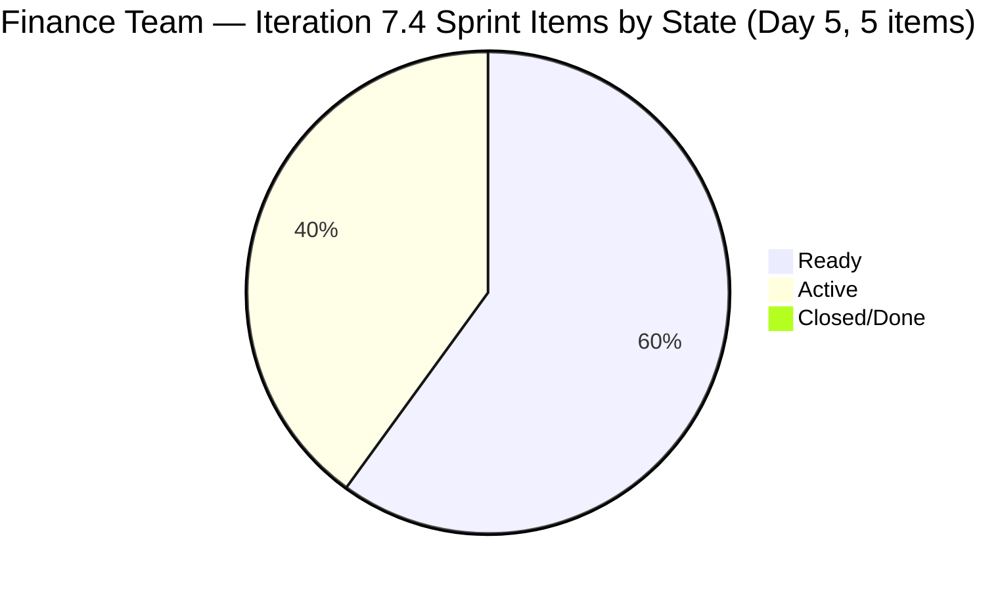
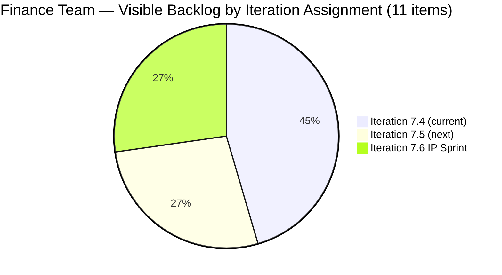
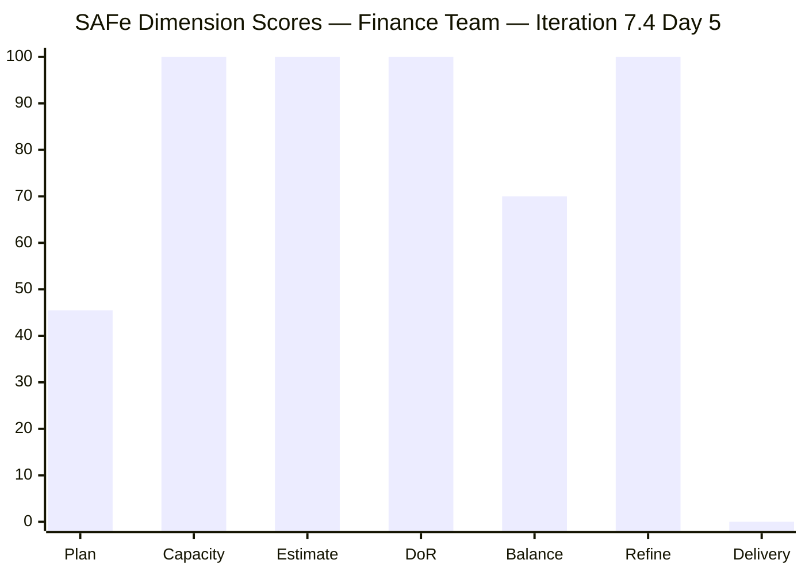

# SAFe Iteration Audit — Finance Team

## 1. Audit Metadata

| Field | Value |
|-------|-------|
| **Project** | Jairosoft FINOPS |
| **Team** | Finance Team |
| **Workspace** | `ado_fin` |
| **ADO Project ID** | e0bb302f-40f9-46c3-8164-6f1acb317d63 |
| **ADO Team ID** | 1f4b45fa-82e8-4a36-aedc-6c1bc8f51070 |
| **Iteration** | Iteration 7.4 |
| **Iteration Start** | 2026-05-18 |
| **Iteration Finish** | 2026-05-31 |
| **Audit Date** | 2026-05-22 (PHT) |
| **Audit Day** | Day 5 of 14 |
| **Prior Audit** | AUDIT_20260521_0900.md (Day 4, Iteration 7.4, 72.3 — Moderate Risk) |
| **Overall Score** | **73.6 / 100** |
| **Risk Band** | **Moderate Risk** |

---

## 2. Executive Summary

The Finance Team improves to **73.6 / 100 (Moderate Risk)** on Day 5 of Iteration 7.4 — a **+1.3 gain from Day 4's 72.3**. The improvement is driven by the restoration of item **204459 (Resolve Historical Bank Fee & Transaction Anomalies)** back to Iteration 7.4, reversing yesterday's scope reduction. Today's confirmed sprint contains **5 items / 10 SP**, with two items in Active state.

**Key Day 5 development:** Item 204459 returned to Iteration 7.4 with a fresh ChangedDate of 2026-05-21T23:41, confirming Grace actively engaged with this item overnight. Both 203719 (Salary Increase Implementation) and 204459 are now Active — the sprint has two items simultaneously in progress, which is positive execution momentum.

**Score driver summary:**
- Iteration Planning recovered from 36.4 → **45.5** (5 of 11 items now in 7.4 vs. 4 of 11 yesterday).
- Work Item Balance remains penalized: 4 US + 1 Issue = 80% User Story → -30 penalty → **70.0** (unchanged).
- Delivery Predictability remains **0.0** (early sprint, Day 5 — annotated).

**Path to Low Risk:** Closing 1 item (2 SP) raises Delivery Predictability to 20.0 and the overall to ~76.5. Closing 2 items (4 SP) raises it to 40.0 and the overall to ~79.5. Closing all 5 items would put the team at ~89.4 — firmly Low Risk. The sprint commitment is right-sized for Grace's 2 hrs/day capacity.

---

## 3. Previous Audit Delta

**Prior audit:** AUDIT_20260521_0900.md — Iteration 7.4, Day 4, Score 72.3 / 100 (Moderate Risk)

| Dimension | Day 4 | Day 5 | Delta | Driver |
|-----------|-------|-------|-------|--------|
| Iteration Planning | 36.4 | **45.5** | **+9.1** | 204459 restored to 7.4; 5/11 vs 4/11 |
| Team Capacity | 100.0 | **100.0** | 0.0 | Grace at 2 hrs/day; no change |
| Estimation | 100.0 | **100.0** | 0.0 | All 5 sprint items have SP=2; full compliance |
| DoR Compliance | 100.0 | **100.0** | 0.0 | All 5 sprint items pass Description + AC |
| Work Item Balance | 70.0 | **70.0** | 0.0 | 4 US + 1 Issue = 80% US > 60%; -30 penalty unchanged |
| Backlog Refinement | 100.0 | **100.0** | 0.0 | All 11 items fresh; 0 stale; 0 untouched |
| Delivery Predictability | 0.0 | **0.0** | 0.0 | Day 5 — no items Closed/Done; early sprint |
| **Overall** | **72.3** | **73.6** | **+1.3** | Driven by 204459 restoration to Iteration 7.4 |

**Key Day 5 findings:**
- Item 204459 (Resolve Historical Bank Fee & Transaction Anomalies) moved back to Iteration 7.4 (ChangedDate 2026-05-21T23:41). It is now Active and in-sprint.
- Both 203719 and 204459 are Active — Grace is running two parallel work streams.
- Items 204467, 204473, 204534 remain Ready — these are downstream items waiting for 204459 resolution.
- The 7.5 items (204481, 204490, 204495) and 7.6 IP items (204502, 204507, 204512) are unchanged.

---

## 4. Current Iteration Snapshot

| Attribute | Value |
|-----------|-------|
| Active Iteration | Iteration 7.4 |
| Sprint Duration | 2026-05-18 to 2026-05-31 (14 days) |
| Audit Day | **Day 5** |
| Current Iteration Root Items | **5** |
| Total Visible Backlog Root Items | **11** |
| Sprint Load % | **45.5%** |
| Total Committed Story Points | **10 SP** |
| Closed Story Points | **0 SP** |
| Active Items | 2 (203719, 204459) |
| Ready Items | 3 (204467, 204473, 204534) |
| Active Team Members | 1 (Grace) |
| Capacity Configured | Yes — 2 hrs/day (1 Documentation + 1 Requirements); 0 days off |
| Items in Iteration 7.5 | 3 (204481, 204490, 204495) |
| Items in Iteration 7.6 IP | 3 (204502, 204507, 204512) |

---

## 5. Work Item Analysis

### 5.1 Current Iteration Items — Iteration 7.4 (5 items)

| ID | Title | Type | State | SP | DoR | Changed |
|----|-------|------|-------|----|-----|---------|
| 203719 | Salary Increase Implementation | User Story | Active | 2 | ✅ | 2026-05-20 |
| 204459 | Resolve Historical Bank Fee & Transaction Anomalies | User Story | Active | 2 | ✅ | 2026-05-21 |
| 204467 | Eliminate Uncategorized Items in the Ledger | User Story | Ready | 2 | ✅ | 2026-05-18 |
| 204473 | Clean Ledger Verification & Iteration Sign-Off | User Story | Ready | 2 | ✅ | 2026-05-18 |
| 204534 | QA Testing | Issue | Ready | 2 | ✅ | 2026-05-18 |

**Total committed SP: 10**

### 5.2 Items Outside Iteration 7.4

| ID | Title | Type | Iteration | State | Notes |
|----|-------|------|-----------|-------|-------|
| 204481 | Establish & Authenticate Real-Time Bank Feeds | User Story | 7.5 | New | Next sprint |
| 204490 | Define Automated Transaction Categorization Rules | User Story | 7.5 | New | Next sprint |
| 204495 | Clean Feed Validation & Automation Freeze | User Story | 7.5 | New | Next sprint |
| 204502 | Complete Full-Month Ledger Reconciliation | User Story | 7.6 IP | New | IP Sprint |
| 204507 | Generate & Configure Clean P&L Dashboards | User Story | 7.6 IP | New | IP Sprint |
| 204512 | Final Feature Audit, UAT, and Sign-Off | User Story | 7.6 IP | New | IP Sprint |

### 5.3 Item Quality Flags

**Item 204534 — Title "QA Testing":** Generic title does not describe the work. The description clarifies this is "Payroll Automation QA Testing." Recommend updating the title to "Payroll Automation QA Testing" for backlog clarity. Persists from prior audits.

**Item 203719 — Dependency awareness:** Salary Increase Implementation (Active) involves a payroll change. Item 204473 (Clean Ledger Verification & Sign-Off) depends on items 204459 and 204467 being completed first (as stated in its AC: "Given Stories 1 and 2 are fully completed"). Grace should manage this dependency chain explicitly.

---

## 6. SAFe Compliance Scorecard

| Dimension | Score | Evidence | Notes |
|-----------|-------|----------|-------|
| 1. Iteration Planning | 45.5 | 5 of 11 visible items in Iteration 7.4 | 6 items correctly staged in 7.5 and 7.6 IP; planning score improves with good backlog sequencing |
| 2. Team Capacity | 100.0 | Grace configured: 2 hrs/day (Documentation + Requirements); 0 days off | Single-contributor team; fully configured |
| 3. Estimation | 100.0 | All 5 sprint items have SP=2 | Full estimation compliance; uniform points warrant review |
| 4. DoR Compliance | 100.0 | All 5 sprint items pass Description ≥ 30 chars + AC ≥ 20 chars | High-quality Given/When/Then acceptance criteria |
| 5. Work Item Balance | 70.0 | 4 US + 1 Issue; US dominant = 80% (> 60% threshold); -30 penalty | Would reach 100 if an additional non-US type were added |
| 6. Backlog Refinement | 100.0 | All 11 visible items changed ≥ 2026-05-18; 0 stale; 0 untouched | All items created and managed in May 2026 |
| 7. Delivery Predictability | 0.0 | 0 SP closed of 10 SP committed; Day 5 — early sprint | Low delivery expected — annotated; 2 items Active |
| **Overall** | **73.6** | | **Moderate Risk** |

---

## 7. Dimension Findings

### 7.1 Iteration Planning — 45.5 (High Risk)
With 5 items in the current sprint and 6 items staged in future iterations, the planning ratio is structurally limited by intentional backlog sequencing. Items in 7.5 and 7.6 represent a well-structured release roadmap (bank feeds → automation → reporting → sign-off) rather than poor planning. The score penalizes this forward-planning behavior, which is noted as a limitation of the metric in this context. Assigning additional items from 7.5 to 7.4 would inflate the ratio but overload the sprint.

### 7.2 Team Capacity — 100.0 (Low Risk)
Grace is configured at 2 hrs/day with no days off for this sprint. The 10 SP commitment over 14 days at 2 hrs/day is achievable, though tight. Grace's 5 Active/Ready items are appropriately sequenced (203719 and 204459 must finish before 204467 and 204473 can begin).

### 7.3 Estimation — 100.0 (Low Risk)
All five sprint items carry 2 SP each (total 10 SP). While uniform estimates indicate complete compliance, the consistency may suggest estimation is not yet discriminating between varying complexity levels. For example, 204534 (QA validation) and 204473 (sign-off) may inherently require different effort than 204459 (historical anomaly resolution). Consider using relative sizing in sprint planning for 7.5.

### 7.4 DoR Compliance — 100.0 (Low Risk)
All five sprint items pass DoR thresholds. The Given/When/Then acceptance criteria across 204459, 204467, and 204473 are especially strong — they include quantitative pass/fail criteria (zero unexplained variances, zero uncategorized balance, signed-off as "Clean/Audit-Ready"). These represent the best-quality acceptance criteria in the Finance backlog to date.

### 7.5 Work Item Balance — 70.0 (Moderate Risk)
With 5 sprint items, 4 are User Stories and 1 is an Issue (204534). User Story share at 80% exceeds the 60% dominant-type threshold, applying the -30 penalty. Adding a second Issue, Defect, or Spike to the sprint (e.g., a research Spike for QuickBooks automation setup) would reduce User Story share and eliminate the penalty. This is a medium-term planning action for Iteration 7.5.

### 7.6 Backlog Refinement — 100.0 (Low Risk)
All 11 visible backlog items were created or updated in May 2026. The backlog is fully fresh — no 45-day, 90-day, or 180-day stale items exist. All sprint items were last changed on or after 2026-05-18. Grace's iterative backlog management has kept the pipeline clean and well-sequenced. This is exemplary backlog hygiene.

### 7.7 Delivery Predictability — 0.0 (annotated — early sprint, Day 5)
No items are Closed or Done. Two items (203719, 204459) are Active. At 10 SP committed, a single closure (2 SP) delivers Delivery Predictability = 20.0, raising the overall score to ~76.5. Two closures = 40.0, overall ~79.5. Full delivery = 100.0, overall ~89.4.

**Sprint closure sequence:** Grace should close in dependency order:
1. 203719 (Salary Increase) — independent; close as soon as signed salary letters are issued and payroll verified.
2. 204459 (Bank Fee Anomalies) — close when zero unexplained variances confirmed.
3. 204467 (Eliminate Uncategorized) — depends on 204459; close when uncategorized balance = zero.
4. 204473 (Sign-Off) — depends on 204467; close at iteration review.
5. 204534 (QA Testing) — close after payroll automation validation is complete.

---

## 8. Risks and Bottlenecks

| # | Risk | Severity | Status |
|---|------|----------|--------|
| 1 | Iteration Planning score (45.5) structurally limited by backlog sequencing | Moderate | Persistent; acceptable given roadmap structure |
| 2 | No items closed through Day 5 | Moderate | Monitor until Day 7; two items Active |
| 3 | 204473 depends on 204459 + 204467 — dependency chain requires ordered delivery | Moderate | Must be managed explicitly |
| 4 | Item 204534 title "QA Testing" remains non-descriptive | Low | Cosmetic; persists from prior audits |
| 5 | Uniform 2 SP across all items may indicate estimation imprecision | Low | Recommendation for 7.5 planning |

---

## 9. Prioritized Recommendations

1. **[Day 6] Close item 203719 (Salary Increase Implementation).** This item is Active and nearing completion (salary letters and payroll verification). Closing it (2 SP) moves Delivery Predictability from 0.0 to 20.0 and the overall score from 73.6 to ~76.5. This is the highest-leverage single action available.

2. **[Day 7] Target 40% delivery checkpoint.** Closing both 203719 and 204459 by Day 7 delivers 4 of 10 SP = 40.0 Delivery Predictability and an overall score of ~79.5 — approaching the Low Risk threshold. Grace should plan to complete bank fee anomaly resolution by Day 7.

3. **[Day 7] Rename item 204534 from "QA Testing" to "Payroll Automation QA Testing."** Persists as a recommendation from three prior audits. Five-minute fix; improves backlog readability and audit traceability.

4. **[Sprint Planning 7.5] Introduce a Spike or second Issue type.** One non-User Story item in the sprint (e.g., a Spike for QuickBooks bank feed setup research or a Defect for a data anomaly) would bring User Story share below 60% and eliminate the Work Item Balance penalty.

5. **[Sprint Planning 7.5] Vary story point estimates.** Explore whether the 7.5 stories (bank feeds, automation rules, validation freeze) are truly equal-effort at 2 SP each. The bank feed authentication (204481) likely requires more setup effort than the freeze validation (204495). Differentiating points improves planning accuracy and sprint load management.

---

## 10. Evidence Gaps and Limitations

| Gap | Impact | Mitigation |
|-----|--------|------------|
| 204459 path change reversal rationale not confirmed | May move again if scope changes | Monitor ChangedDate daily through Day 7 |
| No closed items to validate SP calibration | Velocity baseline absent for PI7 | Will resolve by Day 7–10 with first closures |
| Grace's actual work hours may exceed 2 hrs/day configured capacity | Delivery may outpace capacity model | Monitor throughput; revise capacity for 7.5 |
| Item dependency order (204473 depends on 204459, 204467) not tracked in ADO links | Risk of sign-off attempt before prerequisites complete | Verify dependency management in sprint review |
| Tasks (child items) not assessed | Granular tracking not evaluated | Out of scope for rubric |

---

## Mermaid Visualizations

