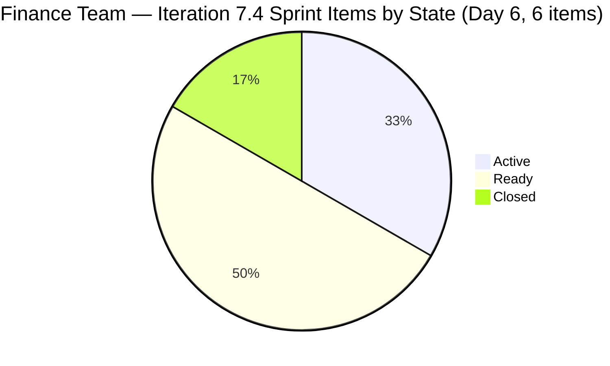
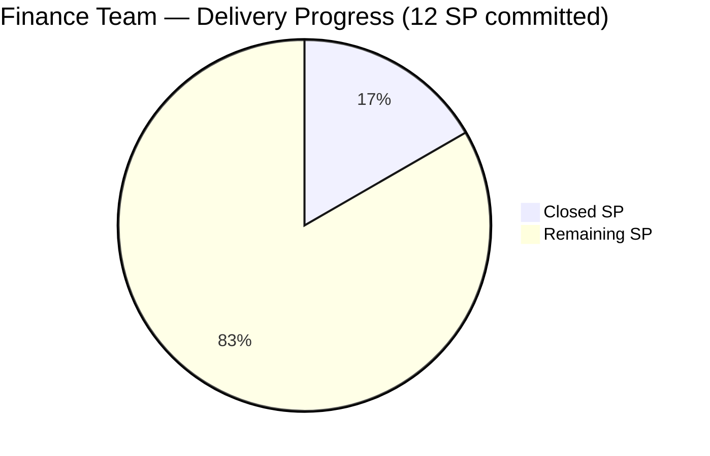
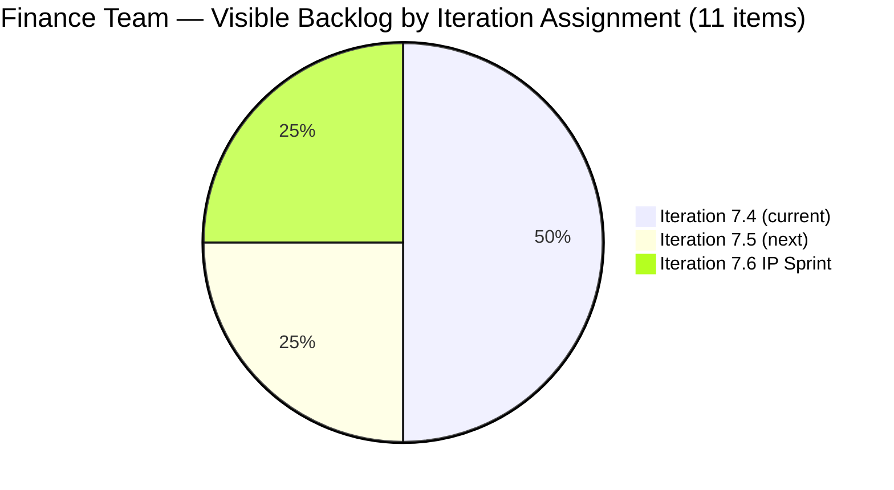

# SAFe Iteration Audit — Finance Team

## 1. Audit Metadata

| Field | Value |
|-------|-------|
| **Project** | Jairosoft FINOPS |
| **Team** | Finance Team |
| **Workspace** | `ado_fin` |
| **ADO Project ID** | e0bb302f-40f9-46c3-8164-6f1acb317d63 |
| **ADO Team ID** | 1f4b45fa-82e8-4a36-aedc-6c1bc8f51070 |
| **Iteration** | Iteration 7.4 |
| **Iteration Start** | 2026-05-18 |
| **Iteration Finish** | 2026-05-31 |
| **Audit Date** | 2026-05-23 (PHT) |
| **Audit Day** | Day 6 of 14 |
| **Prior Audit** | AUDIT_20260522_0900.md (Day 5, Iteration 7.4, 73.6 — Moderate Risk) |
| **Overall Score** | **77.3 / 100** |
| **Risk Band** | **Moderate Risk** |

---

## 2. Executive Summary

The Finance Team improves to **77.3 / 100 (Moderate Risk)** on Day 6 of Iteration 7.4 — a **+3.7 gain from Day 5's 73.6**. This is the largest single-day score gain in the current sprint. Two drivers contributed:

1. **New sprint item discovered: Item 204523** ("FTC Matt for the additional Payment") is confirmed in the Iteration 7.4 backlog as an **Issue type, Closed state, 2 SP** — changed 2026-05-20T13:46. This item was not captured in prior audits. Its inclusion raises the sprint count from 5 to **6 items / 12 SP** and registers **2 SP closed**.

2. **Delivery Predictability activates** at **16.7** (2 SP closed of 12 SP committed). This breaks the zero-delivery streak and is the primary score driver today.

**Sprint health is positive:** Grace has two Active items (203719, 204459) and has closed one item this sprint. The dependency chain (204459 → 204467 → 204473) remains intact, and 204523 demonstrates that ad hoc operational items are being completed and closed same-day.

**Path to Low Risk:** Closing one more item (2 SP) raises Delivery Predictability to 33.3 and the overall score to ~79.6. Closing two more items (4 SP) → Delivery = 50.0, overall ~81.8 (Low Risk). Full delivery = 100.0, overall ~89.4.

---

## 3. Previous Audit Delta

**Prior audit:** AUDIT_20260522_0900.md — Iteration 7.4, Day 5, Score 73.6 / 100 (Moderate Risk)

| Dimension | Day 5 | Day 6 | Delta | Driver |
|-----------|-------|-------|-------|--------|
| Iteration Planning | 45.5 | **54.5** | **+9.0** | Sprint grew from 5 to 6 items; 6/11 vs. 5/11 |
| Team Capacity | 100.0 | **100.0** | 0.0 | Grace at 2 hrs/day; unchanged |
| Estimation | 100.0 | **100.0** | 0.0 | All 6 sprint items have SP=2 |
| DoR Compliance | 100.0 | **100.0** | 0.0 | All 6 sprint items pass Description + AC |
| Work Item Balance | 70.0 | **70.0** | 0.0 | 4 US + 2 Issues = 66.7% US > 60%; -30 penalty |
| Backlog Refinement | 100.0 | **100.0** | 0.0 | All 11 items fresh; 0 stale; 0 untouched |
| Delivery Predictability | 0.0 | **16.7** | **+16.7** | Item 204523 Closed (2 SP of 12 SP committed) |
| **Overall** | **73.6** | **77.3** | **+3.7** | Driven by first sprint closure + 204523 inclusion |

**Key Day 6 findings:**
- **Item 204523** ("FTC Matt for the additional Payment") confirmed in Iteration 7.4, Closed state, 2 SP. Closed on 2026-05-20T13:46. Not captured in Day 5 audit — first appearance in the sprint backlog today.
- Sprint now contains **6 root items / 12 SP** (was 5 items / 10 SP).
- Items 203719 and 204459 remain Active; items 204467, 204473, 204534 remain Ready.
- Visible backlog remains at 11 items.

---

## 4. Current Iteration Snapshot

| Attribute | Value |
|-----------|-------|
| Active Iteration | Iteration 7.4 |
| Sprint Duration | 2026-05-18 to 2026-05-31 (14 days) |
| Audit Day | **Day 6** |
| Current Iteration Root Items | **6** |
| Total Visible Backlog Root Items | **11** |
| Sprint Load % | **54.5%** |
| Total Committed Story Points | **12 SP** |
| Closed Story Points | **2 SP** (item 204523) |
| Active Items | 2 (203719, 204459) |
| Ready Items | 3 (204467, 204473, 204534) |
| Closed Items | 1 (204523) |
| Active Team Members | 1 (Grace) |
| Capacity Configured | Yes — 2 hrs/day (1 Documentation + 1 Requirements); 0 days off |
| Items in Iteration 7.5 | 3 (204481, 204490, 204495) |
| Items in Iteration 7.6 IP | 3 (204502, 204507, 204512) |

---

## 5. Work Item Analysis

### 5.1 Current Iteration Items — Iteration 7.4 (6 items)

| ID | Title | Type | State | SP | DoR | Changed |
|----|-------|------|-------|----|-----|---------|
| 203719 | Salary Increase Implementation | User Story | Active | 2 | ✅ | 2026-05-20 |
| 204459 | Resolve Historical Bank Fee & Transaction Anomalies | User Story | Active | 2 | ✅ | 2026-05-21 |
| 204467 | Eliminate Uncategorized Items in the Ledger | User Story | Ready | 2 | ✅ | 2026-05-18 |
| 204473 | Clean Ledger Verification & Iteration Sign-Off | User Story | Ready | 2 | ✅ | 2026-05-18 |
| 204523 | FTC Matt for the additional Payment | Issue | **Closed** | 2 | ✅ | 2026-05-20 |
| 204534 | QA Testing | Issue | Ready | 2 | ✅ | 2026-05-18 |

**Total committed SP: 12 | Closed SP: 2**

#### DoR check — Item 204523
- Description: "As discussed with Matt, he assured that he will send additional payment before the 25th" → ~81 non-whitespace chars ✅
- Acceptance Criteria: "Received the additional payment" → ~31 non-whitespace chars ✅
- DoR: Pass ✅

### 5.2 Items Outside Iteration 7.4

| ID | Title | Type | Iteration | State | Notes |
|----|-------|------|-----------|-------|-------|
| 204481 | Establish & Authenticate Real-Time Bank Feeds | User Story | 7.5 | New | Next sprint |
| 204490 | Define Automated Transaction Categorization Rules | User Story | 7.5 | New | Next sprint |
| 204495 | Clean Feed Validation & Automation Freeze | User Story | 7.5 | New | Next sprint |
| 204502 | Complete Full-Month Ledger Reconciliation | User Story | 7.6 IP | New | IP Sprint |
| 204507 | Generate & Configure Clean P&L Dashboards | User Story | 7.6 IP | New | IP Sprint |
| 204512 | Final Feature Audit, UAT, and Sign-Off | User Story | 7.6 IP | New | IP Sprint |

### 5.3 Item Quality Flags

**Item 204534 — Title "QA Testing":** Generic title. Description clarifies this is "Payroll Automation QA Testing." Recommend renaming. Persists from prior audits.

**Item 204523 — Context:** The closure of "FTC Matt for the additional Payment" on May 20 demonstrates Grace's responsiveness to client follow-up obligations. The item has an informal description style (single sentence), but it passes DoR thresholds.

**Dependency chain still active:**
- 203719 must close before 204473 review is meaningful
- 204459 must close before 204467 can start
- 204467 must close before 204473 (Sign-Off) proceeds

---

## 6. SAFe Compliance Scorecard

| Dimension | Score | Evidence | Notes |
|-----------|-------|----------|-------|
| 1. Iteration Planning | 54.5 | 6 of 11 visible items in Iteration 7.4 | 5 items in 7.5 and 7.6 represent planned future roadmap |
| 2. Team Capacity | 100.0 | Grace: 2 hrs/day (Documentation + Requirements); 0 days off | Single-contributor team; fully configured |
| 3. Estimation | 100.0 | All 6 sprint items have SP=2 (including Closed 204523) | Full compliance; uniform points persist |
| 4. DoR Compliance | 100.0 | All 6 sprint items pass Description ≥ 30 chars + AC ≥ 20 chars | 204523 passes despite brief description |
| 5. Work Item Balance | 70.0 | 4 US + 2 Issues = US dominant at 66.7% (> 60%); -30 penalty | Work Item Balance unchanged from Day 5 |
| 6. Backlog Refinement | 100.0 | All 11 visible items changed ≥ 2026-05-18; 0 stale; 0 untouched | 204523 changed 2026-05-20 — well within window |
| 7. Delivery Predictability | 16.7 | 2 SP closed (204523) of 12 SP committed | First delivery of sprint; positive trajectory |
| **Overall** | **77.3** | | **Moderate Risk** |

---

## 7. Dimension Findings

### 7.1 Iteration Planning — 54.5 (High Risk)
Sprint grew from 5 to 6 items with the addition of 204523. Planning ratio improves from 45.5 to 54.5 (6/11). The 5 items in 7.5 and 7.6 represent intentional roadmap sequencing — the scoring penalty reflects the structural sequencing rather than poor planning execution. This is consistent with prior audits.

### 7.2 Team Capacity — 100.0 (Low Risk)
Grace remains configured at 2 hrs/day with no days off. The 12 SP commitment over 14 days at 2 hrs/day is tight but achievable. The first closure (204523) on Day 2 of the sprint confirms active engagement.

### 7.3 Estimation — 100.0 (Low Risk)
All 6 sprint items carry 2 SP each. Item 204523 (Closed) also has 2 SP, confirming the estimation was applied before closure. The uniform 2 SP pattern persists — noted again as a recommendation for 7.5 planning to use relative sizing.

### 7.4 DoR Compliance — 100.0 (Low Risk)
All six sprint items pass DoR thresholds. Item 204523 uses an informal one-sentence description but clears the character threshold. The acceptance criteria ("Received the additional payment") is concise but binary and verifiable. No DoR failures.

### 7.5 Work Item Balance — 70.0 (Moderate Risk)
With 4 User Stories and 2 Issues (204523 + 204534), the US share is 66.7% — above the 60% dominant-type threshold, maintaining the -30 penalty. The additional Issue (204523) improved the balance from the Day 5 configuration (4 US + 1 Issue = 80%). Adding a third non-US type in 7.5 would eliminate the penalty.

### 7.6 Backlog Refinement — 100.0 (Low Risk)
All 11 visible backlog items remain fresh. Item 204523's last change was 2026-05-20, well within the 45-day freshness window. No stale, 90-day, or 180-day items detected. All sprint items were changed on or after the iteration start date.

### 7.7 Delivery Predictability — 16.7 (Moderate Risk)
The Finance Team has its first sprint closure: item 204523 (FTC Matt, 2 SP) closed on 2026-05-20. Delivery Predictability = 2/12 × 100 = 16.7. This is the first non-zero Delivery Predictability score in Iteration 7.4 for this team.

**Delivery trajectory:**
| Scenario | SP Closed | Delivery % | Estimated Overall |
|----------|-----------|-----------|-------------------|
| Current (Day 6) | 2 | 16.7 | 77.3 |
| +1 item closed (e.g., 203719) | 4 | 33.3 | 79.6 |
| +2 items closed | 6 | 50.0 | 81.8 (Low Risk) |
| Full delivery (6 items) | 12 | 100.0 | 89.4 |

Grace should target closing 203719 (Salary Increase) by Day 7 as the first priority.

---

## 8. Risks and Bottlenecks

| # | Risk | Severity | Status |
|---|------|----------|--------|
| 1 | Iteration Planning score (54.5) structurally limited by backlog sequencing | Moderate | Acceptable; intentional roadmap staging |
| 2 | Delivery Predictability at 16.7 — first closure achieved but 83% SP uncommitted | Moderate | Positive trajectory; second closure needed |
| 3 | 204473 depends on 204459 + 204467 — dependency chain requires ordered delivery | Moderate | Must be managed explicitly |
| 4 | Item 204534 title "QA Testing" remains non-descriptive | Low | Cosmetic; persists from Day 3–6 |
| 5 | Uniform 2 SP across all items may indicate estimation imprecision | Low | Recommendation for 7.5 planning |

---

## 9. Prioritized Recommendations

1. **[Day 7] Close item 203719 (Salary Increase Implementation).** This item is Active and nearing completion (salary letters issued, payroll verification pending). Closing 2 SP raises Delivery Predictability from 16.7 to 33.3 and the overall score from 77.3 to ~79.6. This is the highest-leverage action available.

2. **[Day 7] Target the 40% delivery checkpoint.** Closing both 203719 and 204459 by Day 8 delivers 6 of 12 SP = 50.0 Delivery Predictability and an estimated overall of ~81.8 — Low Risk territory.

3. **[Day 7] Rename item 204534 from "QA Testing" to "Payroll Automation QA Testing."** This recommendation has persisted through five consecutive audits. Five-minute fix; improves traceability.

4. **[Sprint Planning 7.5] Introduce a Spike or second non-US type.** A research Spike (e.g., QuickBooks bank feed setup) or an additional Defect would reduce User Story share below 60% and eliminate the Work Item Balance penalty.

5. **[Sprint Planning 7.5] Vary story point estimates.** The 7.5 stories (bank feeds, automation, validation) likely differ in complexity. Apply relative sizing to improve planning accuracy.

---

## 10. Evidence Gaps and Limitations

| Gap | Impact | Mitigation |
|-----|--------|------------|
| Item 204523 not captured in prior audits | Day 5 closure date was 2026-05-20 — delivery happened on Day 2; audit was delayed | Monitor sprint for any other items closed prior to audit window |
| No closed items for 203719 or 204459 to validate SP calibration | Velocity baseline for primary sprint stories absent | Will resolve with next closure |
| Grace's actual work hours may exceed configured 2 hrs/day | Delivery may outpace capacity model | Monitor throughput; revise capacity for 7.5 |
| Item dependency order not tracked in ADO links | Risk of out-of-order closure | Verify during sprint review |
| Tasks (child items) not assessed | Granular tracking not evaluated | Out of scope for rubric |

---

## Mermaid Visualizations







```mermaid
bar
    title SAFe Dimension Scores — Finance Team — Iteration 7.4 Day 6
    x-axis [Plan, Capacity, Estimate, DoR, Balance, Refine, Delivery]
    y-axis 0 --> 100
    bar [54.5, 100, 100, 100, 70, 100, 16.7]
```
