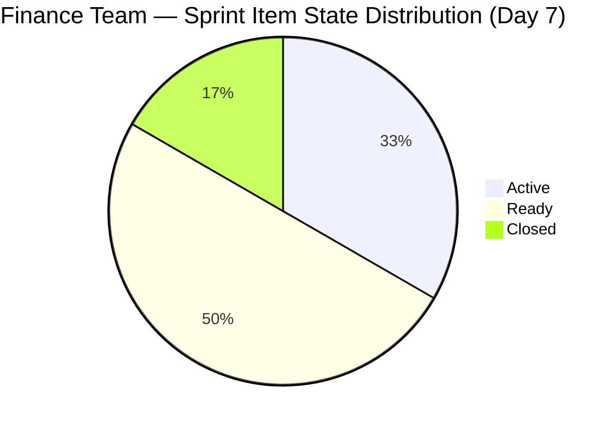
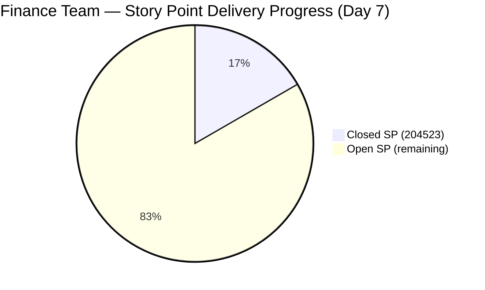
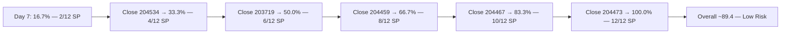

# SAFe Iteration Audit — Finance Team

## 1. Audit Metadata

| Field | Value |
|-------|-------|
| **Project** | Jairosoft FINOPS |
| **Team** | Finance Team |
| **Workspace** | `ado_fin` |
| **ADO Project ID** | e0bb302f-40f9-46c3-8164-6f1acb317d63 |
| **ADO Team ID** | 1f4b45fa-82e8-4a36-aedc-6c1bc8f51070 |
| **Iteration** | Iteration 7.4 |
| **Iteration Start** | 2026-05-18 |
| **Iteration Finish** | 2026-05-31 |
| **Audit Date** | 2026-05-24 (PHT) |
| **Audit Day** | Day 7 of 14 |
| **Prior Audit** | AUDIT_20260523_0900.md (Day 6, Iteration 7.4, 77.3 — Moderate Risk) |
| **Overall Score** | **77.3 / 100** |
| **Risk Band** | **Moderate Risk** |

---

## 2. Executive Summary

The Finance Team holds at **77.3 / 100 (Moderate Risk)** on Day 7 of Iteration 7.4. All dimension scores are structurally unchanged from Day 6. No new closures have been detected since item 204523 ("FTC Matt for the additional Payment") closed on 2026-05-20.

**Sprint midpoint status:** 2 SP closed of 12 SP committed (16.7% delivery). Grace has two Active items (203719, 204459) and three items in Ready state (204467, 204473, 204534). The sprint's dependency chain remains intact: 204459 → 204467 → 204473 must complete in sequence.

**Path to Low Risk remains clear:** Closing one additional item (2 SP) raises Delivery Predictability to 33.3 and overall to ~79.6 (borderline Low Risk). Closing two more items (4 SP total additional) → Delivery = 50.0, overall ~81.8 (Low Risk band). Grace has 7 days remaining to complete 5 open items.

**Key structural weakness:** Iteration Planning remains at 54.5 — only 6 of 11 visible backlog items are in the current sprint. Three items are pre-committed to Iteration 7.5 (204481, 204490, 204495) and three to the IP Sprint (204502, 204507, 204512), leaving them visible but unactionable in 7.4. This is a planning structure concern rather than a team performance issue.

---

## 3. Previous Audit Delta

**Prior audit:** AUDIT_20260523_0900.md — Iteration 7.4, Day 6, Score 77.3 / 100 (Moderate Risk)

| Dimension | Day 6 | Day 7 | Delta | Driver |
|-----------|-------|-------|-------|--------|
| Iteration Planning | 54.5 | **54.5** | 0.0 | 6/11 items; no new scope |
| Team Capacity | 100.0 | **100.0** | 0.0 | Grace at 2 hrs/day; unchanged |
| Estimation | 100.0 | **100.0** | 0.0 | All 6 sprint items have SP=2 |
| DoR Compliance | 100.0 | **100.0** | 0.0 | All 6 sprint items pass Description + AC |
| Work Item Balance | 70.0 | **70.0** | 0.0 | 4 US + 2 Issues; US = 66.7% > 60% → −30 |
| Backlog Refinement | 100.0 | **100.0** | 0.0 | All 11 items fresh; 0 stale; 0 untouched |
| Delivery Predictability | 16.7 | **16.7** | 0.0 | No new closures since 2026-05-20 |
| **Overall** | **77.3** | **77.3** | **0.0** | Stable — awaiting Grace's next closure |

**Key Day 7 observations:**
- No new item changes detected since Day 6.
- Item 203719 (Salary Increase Implementation) and 204459 (Resolve Historical Bank Fee Anomalies) remain Active.
- Item 204534 (QA Testing) remains Ready — this is a potential quick-close candidate if validation can be run.

---

## 4. Current Iteration Snapshot

| Attribute | Value |
|-----------|-------|
| Active Iteration | Iteration 7.4 |
| Sprint Duration | 2026-05-18 to 2026-05-31 (14 days) |
| Audit Day | **Day 7 (Sprint Midpoint)** |
| Current Iteration Root Items | **6** |
| Total Visible Backlog Root Items | **11** |
| Sprint Load % | **54.5%** |
| Total Committed Story Points | **12 SP** |
| Closed Story Points | **2 SP** (item 204523) |
| Active Items | 2 (203719, 204459) |
| Ready Items | 3 (204467, 204473, 204534) |
| Closed Items | 1 (204523) |
| Active Team Members | 1 (Grace) |
| Capacity Configured | Yes — 2 hrs/day; 0 days off |
| Items Queued in 7.5 | 3 (204481, 204490, 204495) |
| Items Queued in IP Sprint | 3 (204502, 204507, 204512) |
| Remaining Days | **7** |

---

## 5. Work Item Analysis

### Current Iteration Root Items (6 items, 12 SP)

| ID | Title | Type | State | SP | ChangedDate |
|----|-------|------|-------|----|-------------|
| 203719 | Salary Increase Implementation | User Story | Active | 2 | 2026-05-20 |
| 204459 | Resolve Historical Bank Fee & Transaction Anomalies | User Story | Active | 2 | 2026-05-21 |
| 204467 | Eliminate Uncategorized Items in the Ledger | User Story | Ready | 2 | 2026-05-18 |
| 204473 | Clean Ledger Verification & Iteration Sign-Off | User Story | Ready | 2 | 2026-05-18 |
| 204523 | FTC Matt for the additional Payment | Issue | **Closed** | 2 | 2026-05-20 |
| 204534 | QA Testing | Issue | Ready | 2 | 2026-05-18 |

### State Distribution

| State | Count | % |
|-------|-------|---|
| Active | 2 | 33.3% |
| Ready | 3 | 50.0% |
| Closed | 1 | 16.7% |

### Work Item Type Distribution

| Type | Count | % |
|------|-------|---|
| User Story | 4 | 66.7% |
| Issue | 2 | 33.3% |

### Dependency Chain

```
204459 (Resolve Bank Anomalies — Active)
  → 204467 (Eliminate Uncategorized Items — Ready)
    → 204473 (Clean Ledger Verification — Ready)
```

This sequential dependency means 204467 cannot meaningfully start until 204459 is resolved. Similarly 204473 depends on 204467 completion. Grace should prioritize closing 204459 to unlock the downstream items.

---

## 6. SAFe Compliance Scorecard

| Dimension | Score | Evidence | Notes |
|-----------|-------|----------|-------|
| Iteration Planning | 54.5 | 6 of 11 visible backlog items in sprint | 6 items pre-assigned to 7.5/IP — structural |
| Team Capacity | 100.0 | Grace configured at 2 hrs/day; 0 days off | Sole contributor; bus factor risk |
| Estimation | 100.0 | All 6 sprint items have SP = 2 | Flat estimation; all items uniformly sized |
| DoR Compliance | 100.0 | All 6 items have substantive Description + AC | Excellent item quality |
| Work Item Balance | 70.0 | 4 US + 2 Issue; dominant US = 66.7% > 60% → −30 | No Spike types; Issues are mixed-type work |
| Backlog Refinement | 100.0 | All 11 visible items changed ≥ 2026-05-18; 0 stale; 0 untouched | Clean backlog |
| Delivery Predictability | 16.7 | 2 SP closed (204523) of 12 SP committed | 1 closure so far; 5 open items |
| **Overall** | **77.3** | Average of 7 dimensions | **Moderate Risk** |

---

## 7. Dimension Findings

### Iteration Planning (54.5)
Six of eleven visible backlog items are in Iteration 7.4. The other five are correctly pre-planned: three in Iteration 7.5 (204481, 204490, 204495 — likely the automation phase referenced in 204473's AC) and three in the IP Sprint (204502, 204507, 204512). This forward-planning into subsequent iterations is a positive signal, but it suppresses the Iteration Planning score by keeping backlog items visible while not actionable in 7.4. A remediation option would be to use a separate backlog view or ensure only items with 7.4 iteration paths are counted in visible scope.

### Team Capacity (100.0)
Grace is configured at 2 hours per day (1 Documentation + 1 Requirements activity) with zero days off. Capacity is aligned to her workload. The 2-hour daily ceiling is significantly lower than the Admin Team (5 hrs/day), which may explain the lower total SP commitment (12 vs. 48). This is not a compliance failure but a risk if Grace's actual daily effort exceeds what's formally tracked.

### Estimation (100.0)
All six sprint items carry 2 Story Points — an unusually uniform distribution. While this ensures full estimation coverage, identical point sizing across items of varying complexity (salary implementation vs. QA testing vs. ledger verification) may indicate insufficient estimation rigor. Consider range-based estimation (1–3 SP) in future sprints.

### DoR Compliance (100.0)
All six items have well-structured descriptions and acceptance criteria using Gherkin-style Given/When/Then format. This is the Finance Team's consistent strength. Item 204534 (QA Testing) has a brief but valid description and AC that meets the thresholds.

### Work Item Balance (70.0)
Four User Stories and two Issues. The 66.7% User Story share triggers the dominant-type penalty (−30). Issue-typed items (204523, 204534) are used for operational/ad hoc work items, which is appropriate. However, the penalty reflects the lack of Defect or Enabler type diversity. This is an acceptable structural constraint for a finance operations team.

### Backlog Refinement (100.0)
All 11 visible backlog items have been modified within the current sprint period (2026-05-18 onward). No items cross the 90-day or 180-day staleness thresholds. All six sprint items were modified on or after the iteration start date (0 untouched). This dimension remains at maximum.

### Delivery Predictability (16.7)
One item closed (204523, 2 SP) of 12 SP committed = 16.7%. The closure occurred on Day 3 (2026-05-20). No additional closures detected through Day 7. With 7 days remaining, Grace has time to close all five remaining open items for full 100% delivery, but the dependency chain on 204459 → 204467 → 204473 means three of the five items are sequentially gated. 

**Recommended closure sequence:**
1. 204534 (QA Testing — Ready, 2 SP) — can close independently
2. 203719 (Salary Increase Implementation — Active, 2 SP) — in progress
3. 204459 (Resolve Bank Anomalies — Active, 2 SP) — in progress, unlocks chain
4. 204467 (Eliminate Uncategorized Items — Ready, 2 SP) — gate on 204459
5. 204473 (Clean Ledger Sign-Off — Ready, 2 SP) — gate on 204467

---

## 8. Risks and Bottlenecks

| Risk | Severity | Status |
|------|----------|--------|
| Sequential dependency chain (204459 → 204467 → 204473) | High | Active — 204459 still in progress |
| Only 16.7% delivery at sprint midpoint | Moderate | Active — 1 of 6 items closed |
| Iteration Planning penalty (6/11 = 54.5%) | Moderate | Structural — 5 items in future iterations |
| Single contributor (Grace) bus factor | Moderate | Persistent — no backup identified |
| Uniform 2 SP estimation (all items same size) | Low | Informational — may mask complexity |

---

## 9. Prioritized Recommendations

1. **[HIGH] Prioritize closing 204534 (QA Testing) independently:** This item has no dependencies and is in Ready state. Closing it today adds 2 SP (total closed = 4 SP, Delivery = 33.3%, overall ~79.6 — near Low Risk threshold).

2. **[HIGH] Accelerate resolution of 204459 (Bank Anomalies):** This is the blocker for the 204467 → 204473 chain. Grace should target this for closure by Day 9 to leave sufficient time for downstream items.

3. **[MEDIUM] Review Iteration Planning structure:** Pre-assigning items to 7.5 and IP Sprint suppresses the planning score. Consider whether those items should remain in the backlog view or be moved to a future iteration board to clarify 7.4's true scope.

4. **[LOW] Diversify story point estimation:** Uniform 2 SP across all items does not reflect varying complexity. Introduce 1 SP for quick verification tasks and 3 SP for complex remediation work in 7.5 planning.

---

## 10. Evidence Gaps and Limitations

- **Backlog count discrepancy:** The visible backlog API returned 11 items, consistent with prior audits. Items 204481, 204490, 204495, 204502, 204507, 204512 are assigned to future iterations and appear in the backlog scope but are not in Iteration 7.4 — this is correct behavior and has been consistently applied.
- **Item 204523 closure date:** Confirmed closed 2026-05-20T13:46. This was first captured in the Day 6 audit after not appearing in Days 1–5. No ADO evidence explains why it appeared late; it may have been created and closed in the same day before the Day 5 audit ran.
- **Capacity granularity:** Grace's 2 hrs/day allocation is tracked by ADO category (Documentation + Requirements) but actual daily effort may differ. No time-tracking data is available to validate.
- **Delivery floor:** If all remaining items close in the final 3 days, Delivery Predictability would reach 100.0 (overall = 89.4), but this requires resolving the sequential dependency chain within 7 days.

---

## Mermaid Diagrams

### Score Breakdown — Day 7





### Delivery Path to Low Risk


