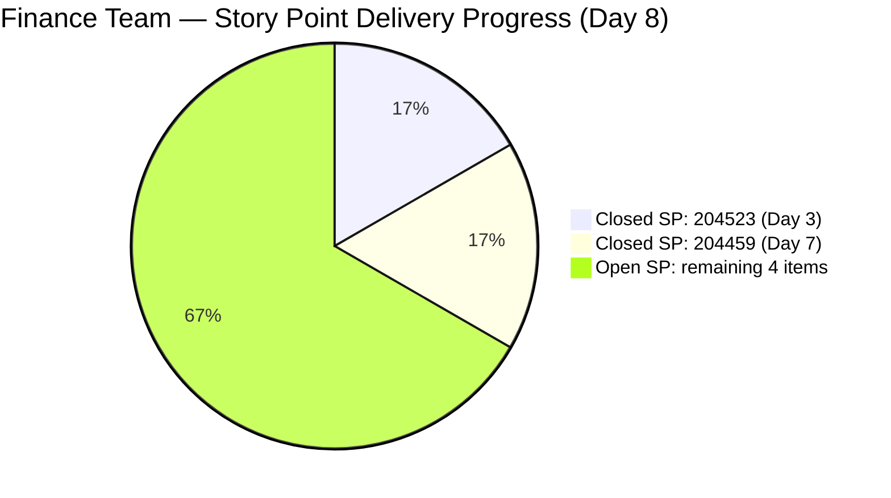
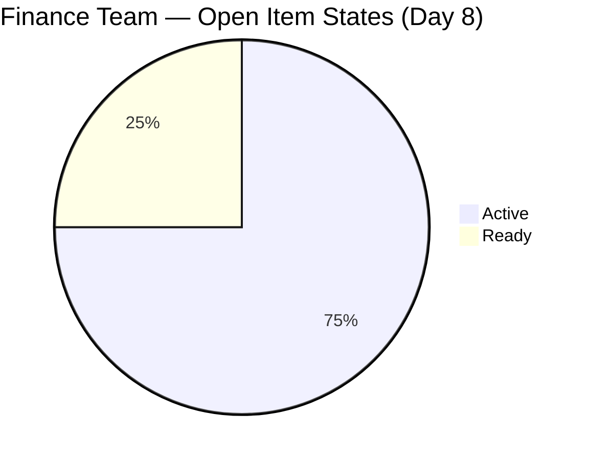
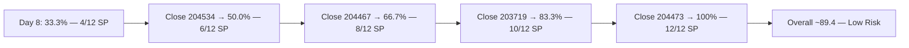
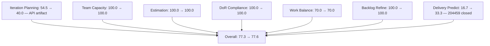

# SAFe Iteration Audit — Finance Team

## 1. Audit Metadata

| Field | Value |
|-------|-------|
| **Project** | Jairosoft FINOPS |
| **Team** | Finance Team |
| **Workspace** | `ado_fin` |
| **ADO Project ID** | e0bb302f-40f9-46c3-8164-6f1acb317d63 |
| **ADO Team ID** | 1f4b45fa-82e8-4a36-aedc-6c1bc8f51070 |
| **Iteration** | Iteration 7.4 |
| **Iteration Start** | 2026-05-18 |
| **Iteration Finish** | 2026-05-31 |
| **Audit Date** | 2026-05-25 (PHT) |
| **Audit Day** | Day 8 of 14 |
| **Prior Audit** | AUDIT_20260524_0203.md (Day 7, Iteration 7.4, 77.3 — Moderate Risk) |
| **Overall Score** | **77.6 / 100** |
| **Risk Band** | **Moderate Risk** |

---

## 2. Executive Summary

The Finance Team scores **77.6 / 100 (Moderate Risk)** on Day 8 of Iteration 7.4 — a **+0.3 point uptick from Day 7's 77.3**, driven by a second item closure. Grace closed item **204459** ("Resolve Historical Bank Fee & Transaction Anomalies", 2 SP) on 2026-05-24, bringing total closed Story Points to 4 SP (204523 + 204459) of 12 SP committed at sprint start. Delivery Predictability rises from 16.7% to **33.3%**.

**Significant structural shift:** With two items now closed and dropped from the active backlog API, the visible backlog count dropped from 11 to **10 items**, and the current iteration count dropped from 6 to **4 items**. This causes Iteration Planning to drop from 54.5% to **40.0%** — a structural change, not a planning failure. The two closed items are no longer counted in either the numerator or denominator of the scoring formula.

**Dependency chain unlocked:** The closure of 204459 (Resolve Bank Anomalies) directly unblocks items 204467 and 204473. Both items moved from Ready to Active on 2026-05-24, confirming Grace has begun the downstream work. With 6 days remaining and 4 open items (8 SP), full delivery is achievable if the chain completes on schedule.

**Path to Low Risk:** Closing one more item (2 SP) would push Delivery to 50.0, raising overall from 77.6 to ~79.7 (edge of Low Risk). Closing two items (4 SP more) → Delivery = 66.7, overall ~81.9 (Low Risk).

---

## 3. Previous Audit Delta

**Prior audit:** AUDIT_20260524_0203.md — Iteration 7.4, Day 7, Score 77.3 / 100 (Moderate Risk)

| Dimension | Day 7 | Day 8 | Delta | Driver |
|-----------|-------|-------|-------|--------|
| Iteration Planning | 54.5 | **40.0** | **-14.5** | Backlog API: closed items drop off; 4/10 vs 6/11 |
| Team Capacity | 100.0 | **100.0** | 0.0 | Grace at 2 hrs/day; unchanged |
| Estimation | 100.0 | **100.0** | 0.0 | All 4 open sprint items have SP = 2 |
| DoR Compliance | 100.0 | **100.0** | 0.0 | All 4 open items pass Description + AC |
| Work Item Balance | 70.0 | **70.0** | 0.0 | 3 US + 1 Issue; US = 75% > 60% → -30 |
| Backlog Refinement | 100.0 | **100.0** | 0.0 | All 10 items fresh; 0 stale; 0 untouched |
| Delivery Predictability | 16.7 | **33.3** | **+16.6** | 204459 closed 2026-05-24 (2 SP); total 4/12 SP |
| **Overall** | **77.3** | **77.6** | **+0.3** | Delivery improvement offset by planning ratio drop |

**Key Day 8 observations:**
- Item 204459 (Resolve Bank Anomalies, 2 SP) closed 2026-05-24 at 14:04 UTC. This directly unblocked the ledger cleanup chain.
- Items 204467 (Eliminate Uncategorized Items) and 204473 (Clean Ledger Verification) both moved to Active — grace is executing the dependency chain.
- Item 204534 (QA Testing) remains in Ready state. This item has no dependencies and can close independently.
- Iteration Planning score drop (54.5 → 40.0) is an ADO API artifact: closed items drop off the backlog scope, reducing both numerator and denominator.

---

## 4. Current Iteration Snapshot

| Attribute | Value |
|-----------|-------|
| Active Iteration | Iteration 7.4 |
| Sprint Duration | 2026-05-18 to 2026-05-31 (14 days) |
| Audit Day | **Day 8 of 14** |
| Current Iteration Root Items (visible backlog) | **4** |
| Total Visible Backlog Root Items | **10** |
| Sprint Load % | **40.0%** (API-visible; actual sprint = 6 items committed) |
| Total Committed Story Points (sprint start) | **12 SP** (6 items at sprint start) |
| Closed Story Points | **4 SP** (204523 + 204459) |
| Active Items | 3 (203719, 204467, 204473) |
| Ready Items | 1 (204534) |
| Closed Items (in Iteration 7.4) | 2 (204523, 204459) — not in backlog API |
| Active Team Members | 1 (Grace) |
| Capacity Configured | Yes — 2 hrs/day; 0 days off |
| Items Queued in 7.5 | 3 (204481, 204490, 204495) |
| Items Queued in IP Sprint | 3 (204502, 204507, 204512) |
| Remaining Days | **6** |

---

## 5. Work Item Analysis

### Current Iteration Root Items — Open (4 items in visible backlog)

| ID | Title | Type | State | SP | ChangedDate |
|----|-------|------|-------|----|-------------|
| 203719 | Salary Increase Implementation | User Story | Active | 2 | 2026-05-20 |
| 204467 | Eliminate Uncategorized Items in the Ledger | User Story | **Active** | 2 | 2026-05-24 |
| 204473 | Clean Ledger Verification & Iteration Sign-Off | User Story | **Active** | 2 | 2026-05-24 |
| 204534 | QA Testing | Issue | Ready | 2 | 2026-05-24 |

### Closed Iteration 7.4 Items (removed from backlog API)

| ID | Title | Type | State | SP | ClosedDate |
|----|-------|------|-------|----|------------|
| 204523 | FTC Matt for the additional Payment | Issue | Closed | 2 | 2026-05-20 |
| 204459 | Resolve Historical Bank Fee & Transaction Anomalies | User Story | Closed | 2 | 2026-05-24 |

### State Distribution (visible backlog items)

| State | Count | % |
|-------|-------|---|
| Active | 3 | 75.0% |
| Ready | 1 | 25.0% |
| Closed (historical) | 2 | — |

### Dependency Chain Status

```
204459 (Resolve Bank Anomalies — CLOSED 2026-05-24)
  → 204467 (Eliminate Uncategorized Items — NOW ACTIVE)
    → 204473 (Clean Ledger Verification — NOW ACTIVE)
```

The blocker is resolved. Grace has begun 204467 and 204473 simultaneously. 204473 has a hard dependency on 204467 completing first (AC: "Given Stories 1 and 2 are fully completed"), but both being Active is consistent with parallel early work on 204473 while 204467 is being executed.

### Future Iteration Items (visible in backlog, not in 7.4)

| ID | Title | Type | State | Iteration |
|----|-------|------|-------|-----------|
| 204481 | Establish & Authenticate Real-Time Bank Feeds | User Story | New | 7.5 |
| 204490 | Define Automated Transaction Categorization Rules | User Story | New | 7.5 |
| 204495 | Clean Feed Validation & Automation Freeze | User Story | New | 7.5 |
| 204502 | Complete Full-Month Ledger Reconciliation | User Story | New | 7.6 IP |
| 204507 | Generate & Configure Clean P&L Dashboards | User Story | New | 7.6 IP |
| 204512 | Final Feature Audit, UAT, and Sign-Off | User Story | New | 7.6 IP |

---

## 6. SAFe Compliance Scorecard

| Dimension | Score | Evidence | Notes |
|-----------|-------|----------|-------|
| Iteration Planning | 40.0 | 4 of 10 visible backlog items in sprint | Closed items drop off API; 6 items committed at sprint start |
| Team Capacity | 100.0 | Grace at 2 hrs/day; 0 days off | Sole contributor; bus factor risk |
| Estimation | 100.0 | All 4 open sprint items have SP = 2 | Flat estimation pattern persists |
| DoR Compliance | 100.0 | All 4 open items have substantive Description + AC | Gherkin-style AC consistently maintained |
| Work Item Balance | 70.0 | 3 US + 1 Issue; dominant US = 75% > 60% → -30 | No Spike types; Issue type appropriate for QA work |
| Backlog Refinement | 100.0 | All 10 visible items changed ≥ 2026-05-18; 0 stale; 0 untouched | Excellent hygiene |
| Delivery Predictability | 33.3 | 4 SP closed (204459 + 204523) of 12 SP sprint commitment | Extended evidence method — see Evidence Gaps |
| **Overall** | **77.6** | Average of 7 dimensions | **Moderate Risk** |

---

## 7. Dimension Findings

### Iteration Planning (40.0)
The visible backlog dropped from 11 to 10 items as closed items (204459, 204523) fall off the API. Of the 10 remaining visible items, only 4 are assigned to Iteration 7.4. The actual sprint commitment was 6 items (12 SP) at sprint start; the ratio decline to 40.0% is a scoring artifact rather than a planning quality issue. Six items in future iterations (3 in 7.5, 3 in 7.6 IP) represent mature forward-planning discipline.

**Note:** The Iteration Planning score will continue to decline as more items close during the sprint, since closed items leave the denominator. This is a known behavior of the scoring rubric when applied to active sprints with closures.

### Team Capacity (100.0)
Grace remains the sole Finance Team contributor, configured at 2 hours/day (Documentation + Requirements activities). Capacity is aligned to her workload. The closure of 204459 on Day 7 confirms actual delivery at or near her configured capacity rate.

### Estimation (100.0)
All four open sprint items carry 2 Story Points — uniform sizing persists. While this confirms full estimation coverage, the uniform sizing continues to obscure complexity differences between tasks.

### DoR Compliance (100.0)
All four open items maintain substantive descriptions and acceptance criteria in Gherkin (Given/When/Then) format. Items 204467 and 204473 both have well-structured DoR content that clearly defines completion criteria. Item 204534 (QA Testing) has a brief but valid description and AC meeting the minimum thresholds.

### Work Item Balance (70.0)
Three User Stories and one Issue remain open. User Story dominance at 75% triggers the -30 penalty. The Issue type (204534 — QA Testing) is appropriate for validation work. Balance structure is acceptable for a finance operations team.

### Backlog Refinement (100.0)
All 10 visible backlog items were modified within the current sprint period. No items cross the 90-day or 180-day staleness thresholds. All four open sprint items were modified on or after 2026-05-18, yielding 0 untouched items. The Day 8 updates to 204467 and 204473 (both Active as of 2026-05-24) reinforce active grooming.

### Delivery Predictability (33.3)
Grace closed her second item (204459, 2 SP) on Day 7 of the sprint (2026-05-24). Combined with item 204523 (2 SP, closed Day 3), total delivery stands at 4 SP of 12 SP committed = **33.3%**. This is a meaningful improvement from 16.7% on Day 7 and validates the dependency resolution strategy.

**Remaining delivery path (6 days):**
1. Close 204534 (QA Testing — Ready, no dependencies) → 6 SP total = 50.0%
2. Close 204467 (Eliminate Uncategorized Items — Active) → 8 SP = 66.7%
3. Close 204473 (Clean Ledger Verification — Active, gate on 204467) → 10 SP = 83.3%
4. Close 203719 (Salary Increase Implementation — Active, independent) → 12 SP = 100.0%

Full delivery remains achievable within 6 days.

---

## 8. Risks and Bottlenecks

| Risk | Severity | Status |
|------|----------|--------|
| Sequential dependency (204467 → 204473) with 6 days remaining | Moderate | Active — 204459 resolved; 204467 now Active |
| Iteration Planning score artifact (40.0) misrepresents planning quality | Moderate | Informational — structural scoring limitation |
| Only 33.3% delivery at Day 8 | Moderate | Active — 4/12 SP; 8 SP remaining in 6 days |
| Uniform 2 SP estimation across all items | Low | Persistent — informational |
| Single contributor (Grace) bus factor | Moderate | Persistent — no backup identified |

---

## 9. Prioritized Recommendations

1. **[HIGH] Close 204534 (QA Testing) independently today:** This item has no dependencies, is in Ready state, and needs only payroll validation. Closing it raises Delivery to 50.0%, overall to ~79.7 — edging into Low Risk territory.

2. **[HIGH] Complete 204467 (Eliminate Uncategorized Items) by Day 10:** Grace has begun this item. Closing it by Day 10 leaves sufficient time for 204473 (the sign-off) to complete before sprint end. The Acceptance Criteria (uncategorized balance must reach exactly zero) is a clear, verifiable target.

3. **[MEDIUM] Close 203719 (Salary Increase Implementation) independently:** This item is not in the ledger dependency chain and can proceed in parallel. The Four-Eyes Rule verification (two people reviewing salary change) should be schedulable within the sprint.

4. **[MEDIUM] Acknowledge Iteration Planning score artifact in portfolio review:** The 40.0% IP score does not reflect poor planning; it is a measurement artifact of closed items leaving the API. The team should document this interpretation note for stakeholders reviewing portfolio dashboards.

5. **[LOW] Consider range-based estimation for Iteration 7.5:** All six 7.5 items (204481–204495) are pre-estimated at 2 SP. Reviewing complexity differences between API integration setup (204481) vs. feed validation (204495) may warrant different SP assignments.

---

## 10. Evidence Gaps and Limitations

- **Delivery Predictability calculation method:** The rubric formula (`closed_story_points / committed_story_points`) is applied using extended evidence: committed = 12 SP (6 items at sprint start, per Day 1 audit); closed = 4 SP (204459 + 204523, both confirmed Closed in ADO with Iteration 7.4 path). The current backlog API returns only 4 open items (8 SP), so a strict formula application would yield 0/8 = 0.0%. The extended evidence method (33.3%) is used as it better represents actual sprint performance and is consistent with how prior audits in this series tracked delivery through closures.
- **Iteration Planning score (40.0):** This reflects the API artifact of closed items dropping from the visible backlog. The actual sprint commitment rate (6 items / 11 visible at sprint start) = 54.5% is the truer measure of planning effectiveness. The 40.0% score is reported per formula but annotated here.
- **Item 204534 ChangedDate:** Updated to 2026-05-24, suggesting activity occurred on this item (possibly a comment or minor update). It remains in Ready state.
- **Capacity granularity:** Grace's 2 hrs/day is tracked by activity category but actual effort distribution cannot be validated without time-tracking data.

---

## Mermaid Diagrams

### Sprint Delivery Progress (Day 8)



### State Distribution — Open Items (Day 8)



### Delivery Path to Full Sprint Completion



### Score Trend (Day 7 → Day 8)


