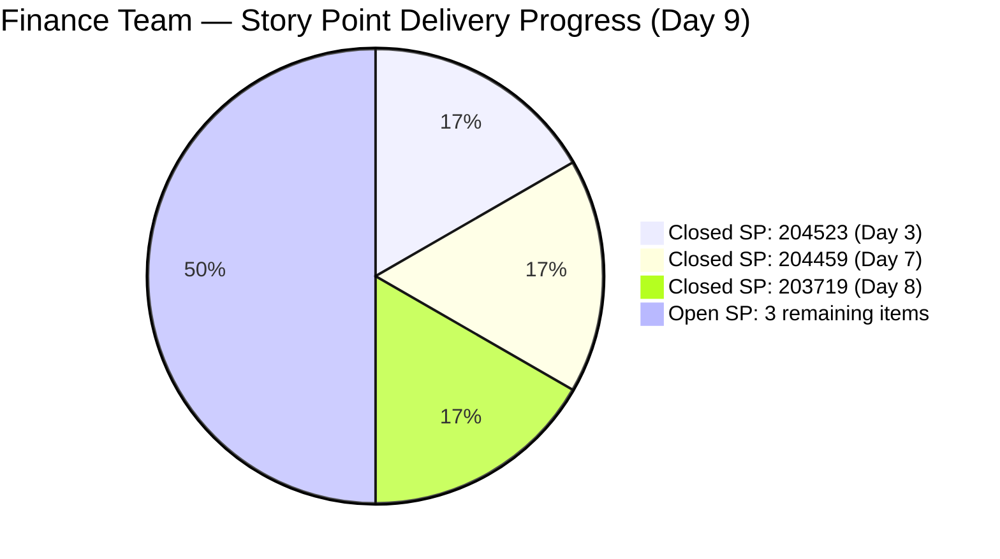
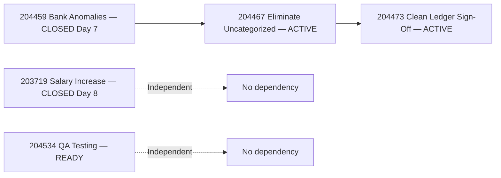
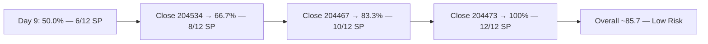
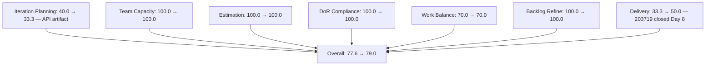

# SAFe Iteration Audit — Finance Team

## 1. Audit Metadata

| Field | Value |
|-------|-------|
| **Project** | Jairosoft FINOPS |
| **Team** | Finance Team |
| **Workspace** | `ado_fin` |
| **ADO Project ID** | e0bb302f-40f9-46c3-8164-6f1acb317d63 |
| **ADO Team ID** | 1f4b45fa-82e8-4a36-aedc-6c1bc8f51070 |
| **Iteration** | Iteration 7.4 |
| **Iteration Start** | 2026-05-18 |
| **Iteration Finish** | 2026-05-31 |
| **Audit Date** | 2026-05-26 (PHT) |
| **Audit Day** | Day 9 of 14 |
| **Prior Audit** | AUDIT_20260525_0900.md (Day 8, Iteration 7.4, 77.6 — Moderate Risk) |
| **Overall Score** | **79.0 / 100** |
| **Risk Band** | **Moderate Risk** |

---

## 2. Executive Summary

The Finance Team scores **79.0 / 100 (Moderate Risk)** on Day 9 of Iteration 7.4 — a **+1.4 point improvement from Day 8's 77.6**, driven by Grace's third item closure. Item **203719** (Salary Increase Implementation, 2 SP) was closed on 2026-05-25T22:19 UTC, bringing total closed Story Points to **6 SP** of 12 SP originally committed (204523 + 204459 + 203719). Delivery Predictability rises from 33.3% to **50.0%**.

**Sprint at the halfway delivery mark:** With 50% of committed Story Points delivered at Day 9, and 5 days remaining, the team is now positioned to potentially reach 83–100% delivery if Grace closes the remaining three items (204467, 204473, 204534) before May 31.

**Visible backlog drops again:** With 203719 now Closed, the visible backlog API returns 9 items, with only 3 assigned to Iteration 7.4 (204467, 204473, 204534). This reduces the Iteration Planning ratio further to 33.3% — a continuing ADO API artifact as items close and fall off the backlog scope.

**Path to Low Risk:** Closing one more item (2 SP) raises Delivery to 66.7%, pushing overall from 79.0 to ~81.2 (Low Risk). Grace is actively working on the ledger cleanup chain (204467 → 204473), and 204534 (QA Testing) remains in Ready state — potentially closeable today.

---

## 3. Previous Audit Delta

**Prior audit:** AUDIT_20260525_0900.md — Iteration 7.4, Day 8, Score 77.6 / 100 (Moderate Risk)

| Dimension | Day 8 | Day 9 | Delta | Driver |
|-----------|-------|-------|-------|--------|
| Iteration Planning | 40.0 | **33.3** | **-6.7** | 203719 closed; backlog API: 3/9 vs 4/10 |
| Team Capacity | 100.0 | **100.0** | 0.0 | Grace at 2 hrs/day; unchanged |
| Estimation | 100.0 | **100.0** | 0.0 | All 3 open sprint items have SP = 2 |
| DoR Compliance | 100.0 | **100.0** | 0.0 | All 3 open items pass Description + AC |
| Work Item Balance | 70.0 | **70.0** | 0.0 | 2 US + 1 Issue; US = 66.7% > 60% → -30 |
| Backlog Refinement | 100.0 | **100.0** | 0.0 | All 9 visible items fresh; 0 stale; 0 untouched |
| Delivery Predictability | 33.3 | **50.0** | **+16.7** | 203719 closed 2026-05-25 (2 SP); total 6/12 SP |
| **Overall** | **77.6** | **79.0** | **+1.4** | Delivery improvement offset by IP ratio decline |

**Key Day 9 observations:**
- Item 203719 (Salary Increase Implementation, 2 SP) closed 2026-05-25T22:19 UTC. Grace completed the Four-Eyes Rule salary verification and closed the item.
- Items 204467 (Eliminate Uncategorized Items) and 204473 (Clean Ledger Verification) remain Active — the dependency chain is in execution.
- Item 204534 (QA Testing) remains in Ready state — unchanged since Day 8. No dependencies; can be closed independently.
- Iteration Planning score drops from 40.0% to 33.3% as the closed item falls off the API — same artifact behavior documented in prior audits.

---

## 4. Current Iteration Snapshot

| Attribute | Value |
|-----------|-------|
| Active Iteration | Iteration 7.4 |
| Sprint Duration | 2026-05-18 to 2026-05-31 (14 days) |
| Audit Day | **Day 9 of 14** |
| Current Iteration Root Items (visible backlog) | **3** |
| Total Visible Backlog Root Items | **9** |
| Sprint Load % | **33.3%** (API-visible; actual sprint commitment = 6 items at start) |
| Total Committed Story Points (sprint start) | **12 SP** (6 items) |
| Closed Story Points | **6 SP** (204523 + 204459 + 203719) |
| Active Items | 2 (204467, 204473) |
| Ready Items | 1 (204534) |
| Closed Items (in Iteration 7.4) | 3 — not in backlog API |
| Active Team Members | 1 (Grace) |
| Capacity Configured | Yes — 2 hrs/day; 0 days off |
| Items Queued in 7.5 | 3 (204481, 204490, 204495) |
| Items Queued in IP Sprint | 3 (204502, 204507, 204512) |
| Remaining Days | **5** |

---

## 5. Work Item Analysis

### Current Iteration Root Items — Open (3 items in visible backlog)

| ID | Title | Type | State | SP | ChangedDate |
|----|-------|------|-------|----|-------------|
| 204467 | Eliminate Uncategorized Items in the Ledger | User Story | Active | 2 | 2026-05-24 |
| 204473 | Clean Ledger Verification & Iteration Sign-Off | User Story | Active | 2 | 2026-05-24 |
| 204534 | QA Testing | Issue | Ready | 2 | 2026-05-24 |

### Closed Iteration 7.4 Items (removed from backlog API)

| ID | Title | Type | State | SP | ClosedDate |
|----|-------|------|-------|----|------------|
| 204523 | FTC Matt for the additional Payment | Issue | Closed | 2 | 2026-05-20 |
| 204459 | Resolve Historical Bank Fee & Transaction Anomalies | User Story | Closed | 2 | 2026-05-24 |
| 203719 | Salary Increase Implementation | User Story | **Closed** | 2 | **2026-05-25** |

### State Distribution (visible backlog items)

| State | Count | % |
|-------|-------|---|
| Active | 2 | 66.7% |
| Ready | 1 | 33.3% |
| Closed (historical) | 3 | — |

### Dependency Chain Status

```
204459 (Resolve Bank Anomalies — CLOSED 2026-05-24)
  → 204467 (Eliminate Uncategorized Items — ACTIVE since 2026-05-24)
    → 204473 (Clean Ledger Verification — ACTIVE since 2026-05-24)
```

203719 (Salary Increase Implementation) closed independently on 2026-05-25 — parallel track delivered.

### Future Iteration Items (visible in backlog, not in 7.4)

| ID | Title | Type | State | Iteration |
|----|-------|------|-------|-----------|
| 204481 | Establish & Authenticate Real-Time Bank Feeds | User Story | New | 7.5 |
| 204490 | Define Automated Transaction Categorization Rules | User Story | New | 7.5 |
| 204495 | Clean Feed Validation & Automation Freeze | User Story | New | 7.5 |
| 204502 | Complete Full-Month Ledger Reconciliation | User Story | New | 7.6 IP |
| 204507 | Generate & Configure Clean P&L Dashboards | User Story | New | 7.6 IP |
| 204512 | Final Feature Audit, UAT, and Sign-Off | User Story | New | 7.6 IP |

---

## 6. SAFe Compliance Scorecard

| Dimension | Score | Evidence | Notes |
|-----------|-------|----------|-------|
| Iteration Planning | 33.3 | 3 of 9 visible backlog items in sprint | Closed items drop off API; 6 items committed at sprint start |
| Team Capacity | 100.0 | Grace at 2 hrs/day; 0 days off | Sole contributor; bus factor risk |
| Estimation | 100.0 | All 3 open sprint items have SP = 2 | Flat estimation pattern persists |
| DoR Compliance | 100.0 | All 3 open items have Description + AC meeting thresholds | Gherkin-style AC maintained |
| Work Item Balance | 70.0 | 2 US + 1 Issue; US = 66.7% > 60% → -30 | Acceptable for finance ops team |
| Backlog Refinement | 100.0 | All 9 visible items changed ≥ 2026-05-18; 0 stale; 0 untouched | Excellent hygiene |
| Delivery Predictability | 50.0 | 6 SP closed (204523+204459+203719) of 12 SP committed | Extended evidence — 3 of 6 sprint items closed |
| **Overall** | **79.0** | Average of 7 dimensions | **Moderate Risk** |

---

## 7. Dimension Findings

### Iteration Planning (33.3)
With 203719 (Salary Increase Implementation) now Closed, it has dropped from the backlog API. The visible backlog now shows 9 items, of which only 3 are in Iteration 7.4. The actual sprint commitment at Day 1 was 6 items (12 SP). The 33.3% Iteration Planning score is a structural ADO API artifact — not a planning failure. The six future-iteration items (3 in 7.5, 3 in 7.6 IP) demonstrate strong forward-planning discipline.

**Trend:** As remaining sprint items close, this score will continue declining. At full sprint closure (all 6 items Closed), the Iteration Planning score would approach 0% from the API perspective. Portfolio reviewers should note this pattern.

### Team Capacity (100.0)
Grace remains the sole Finance Team contributor at 2 hours/day. The closure of 203719 confirms consistent delivery against her available capacity. Three closures in 9 days represents roughly one closure every 3 days — a sustainable pace that could yield 4–5 total closures (8–10 SP) by May 31.

### Estimation (100.0)
All three open sprint items carry 2 Story Points — uniform sizing persists. All six original sprint items were estimated at 2 SP each, giving perfect estimation coverage. The uniform sizing has been noted as potentially masking complexity differences.

### DoR Compliance (100.0)
All three open items maintain substantive descriptions and acceptance criteria in Gherkin (Given/When/Then) format. Items 204467 and 204473 have clear, verifiable completion criteria (uncategorized balance = zero; ledger = locked as Clean/Audit-Ready). Item 204534 (QA Testing) has minimal but passing description and AC.

### Work Item Balance (70.0)
Two User Stories and one Issue remain open. User Story dominance at 66.7% exceeds the 60% threshold, triggering -30. Balance = 70.0. This is structurally appropriate for finance operations work.

### Backlog Refinement (100.0)
All 9 visible backlog items were modified within the current sprint period (all ChangedDates ≥ 2026-05-18). No items cross the 90-day or 180-day staleness thresholds. All 3 open sprint items were changed on or after 2026-05-18, yielding 0 untouched items. Hygiene is excellent.

### Delivery Predictability (50.0)
Grace has now closed 3 of 6 committed sprint items (6 of 12 SP). The three closures are:
1. **204523** (FTC Matt additional payment) — Closed Day 3 (2026-05-20)
2. **204459** (Bank Fee Anomalies) — Closed Day 7 (2026-05-24)
3. **203719** (Salary Increase Implementation) — Closed Day 8 (2026-05-25)

Grace's delivery cadence of approximately one item every 2.7 days suggests the remaining three items (204534, 204467, 204473) are achievable before May 31.

**Remaining delivery path (5 days):**
1. Close 204534 (QA Testing — Ready, no dependencies) → 8 SP total = 66.7% → Overall ~81.2 (Low Risk)
2. Close 204467 (Eliminate Uncategorized Items — Active) → 10 SP = 83.3% → Overall ~83.5
3. Close 204473 (Clean Ledger Verification — gates on 204467) → 12 SP = 100% → Overall ~85.7

Full sprint delivery is achievable and represents the team's best opportunity to reach Low Risk.

---

## 8. Risks and Bottlenecks

| Risk | Severity | Status |
|------|----------|--------|
| Sequential dependency 204467 → 204473 with 5 days remaining | Moderate | Active — 204459 resolved; 204467 executing |
| Iteration Planning score artifact (33.3%) misrepresents planning quality | Moderate | Informational — structural artifact |
| Uniform 2 SP estimation across all items | Low | Persistent — informational |
| Single contributor (Grace) bus factor | Moderate | Persistent — no backup identified |

---

## 9. Prioritized Recommendations

1. **[HIGH] Close 204534 (QA Testing) today or by Day 10:** This item has no dependencies, is in Ready state, and requires only payroll computation validation. Closing it today raises Delivery to 66.7%, overall to ~81.2 — crossing the Low Risk threshold. This is Grace's fastest path to Low Risk.

2. **[HIGH] Complete 204467 (Eliminate Uncategorized Items) by Day 11:** Grace has been actively working on this since Day 7. The acceptance criterion (uncategorized balance = zero) is a clear, measurable target. Closing by Day 11 leaves 4 days for 204473 (Clean Ledger Verification, the gate item).

3. **[MEDIUM] Close 204473 (Clean Ledger Verification) by Day 13:** The sign-off item depends on 204467 completing first. If 204467 closes by Day 11, Grace has Days 12–13 to complete the ledger verification and sign-off with the Finance Manager. This is the final item needed for 100% sprint delivery.

4. **[LOW] Consider range-based estimation for Iteration 7.5:** Items 204481, 204490, 204495 in 7.5 are pre-estimated at 2 SP each. Reviewing complexity differences (API setup vs. validation vs. automation freeze) before sprint planning may improve estimation accuracy.

5. **[LOW] Acknowledge Iteration Planning artifact in portfolio dashboard:** The 33.3% score does not reflect poor planning. Document this for portfolio review: actual sprint commitment rate was 54.5% (6/11 items) at Day 1. The declining ratio is a normal outcome of closures falling off the ADO backlog API.

---

## 10. Evidence Gaps and Limitations

- **Delivery Predictability calculation method:** The formula uses extended evidence: committed = 12 SP (6 items at sprint start per Day 1 audit); closed = 6 SP (204523 + 204459 + 203719, all confirmed Closed in ADO with Iteration 7.4 path). The current backlog API returns only 3 open items (6 SP), so a strict formula application would yield 0/6 = 0.0%. The extended evidence method (50.0%) is used for accuracy and is consistent with prior audits in this series.
- **Iteration Planning score (33.3%):** The truer planning effectiveness measure is 54.5% (6 items of 11 visible at sprint start). The 33.3% is reported per rubric formula but annotated as an ADO API artifact.
- **Item 204534 (QA Testing):** Has been in Ready state since Day 7. A comment was added on 2026-05-24 (per the commentVersionRef field). The comment content is not retrieved in this audit; it may contain updates to the QA scope or timeline.
- **Capacity granularity:** Grace's 2 hrs/day is tracked by activity category but actual effort distribution cannot be validated without time-tracking integration.

---

## Mermaid Diagrams

### Sprint Delivery Progress (Day 9)



### Dependency Chain Status (Day 9)



### Delivery Path to Full Sprint Completion (5 Days Remaining)



### Score Trend (Day 8 → Day 9)


