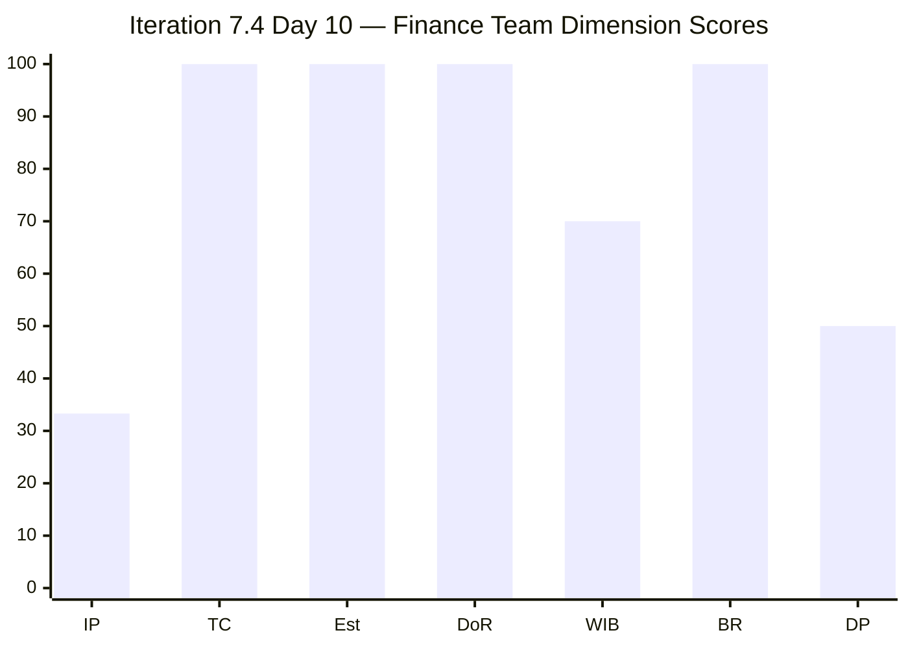
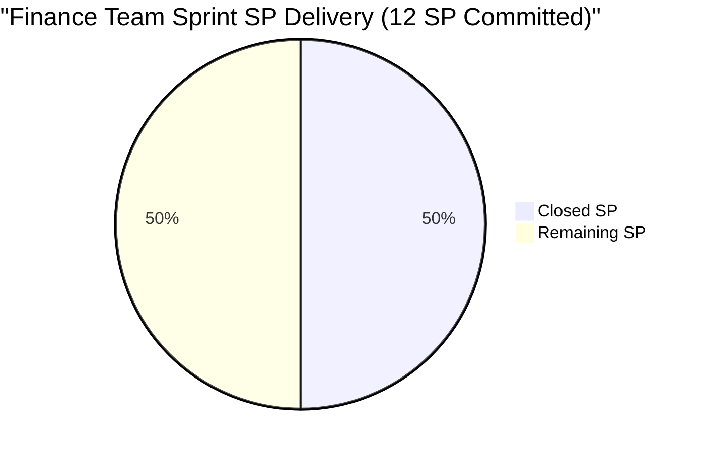
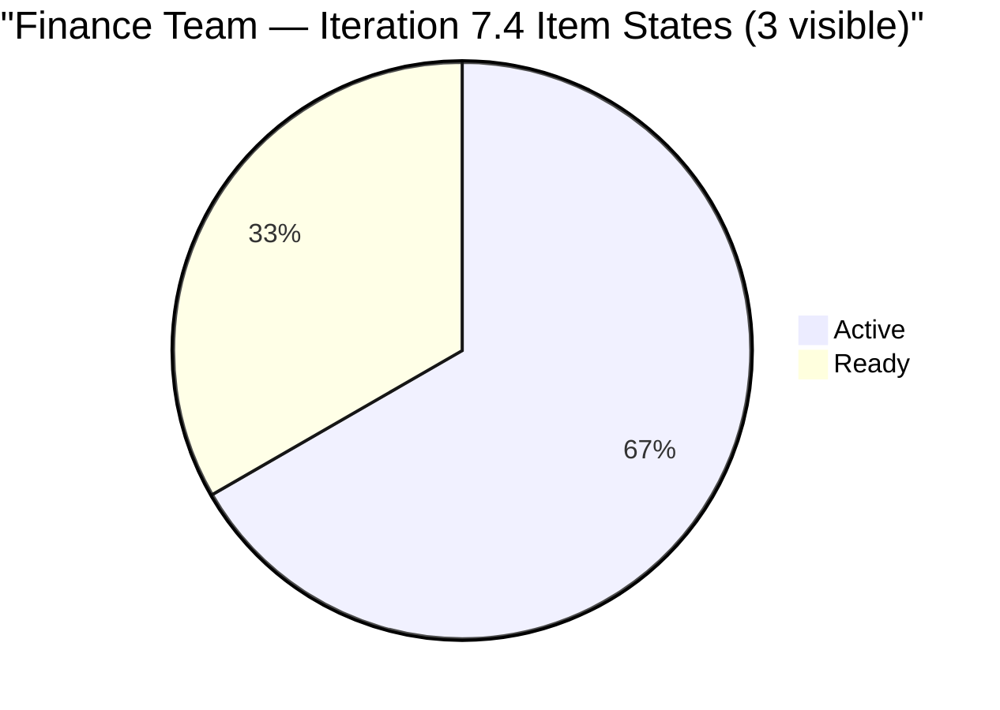
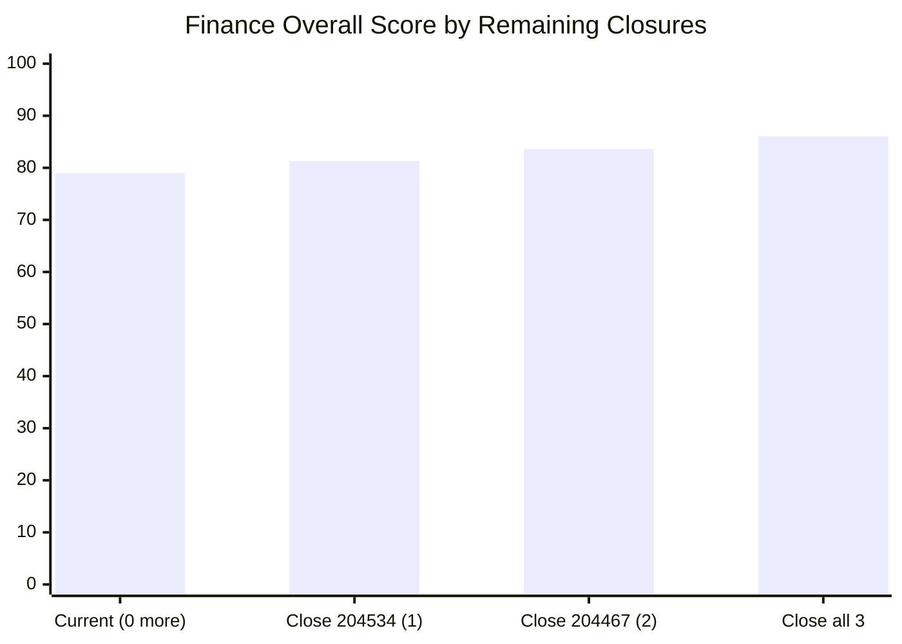

# SAFe Iteration Audit — Finance Team

## 1. Audit Metadata

| Field | Value |
|-------|-------|
| **Project** | Jairosoft FINOPS |
| **Team** | Finance Team |
| **Workspace** | `ado_fin` |
| **ADO Project ID** | e0bb302f-40f9-46c3-8164-6f1acb317d63 |
| **ADO Team ID** | 1f4b45fa-82e8-4a36-aedc-6c1bc8f51070 |
| **Iteration** | Iteration 7.4 |
| **Iteration Start** | 2026-05-18 |
| **Iteration Finish** | 2026-05-31 |
| **Audit Date** | 2026-05-27 (UTC) |
| **Audit Day** | Day 10 of 14 |
| **Prior Audit** | AUDIT_20260526_0204.md (Day 9, Iteration 7.4, 79.0 — Moderate Risk) |
| **Overall Score** | **79.0 / 100** |
| **Risk Band** | **Moderate Risk** |

---

## 2. Executive Summary

The Finance Team holds at **79.0 / 100 (Moderate Risk)** on Day 10 of Iteration 7.4 — unchanged from Day 9. No new state transitions were detected overnight. The team is at the halfway delivery mark (6 of 12 SP originally committed are closed) with **4 days remaining** before the sprint ends May 31.

**Current state:** Grace has 3 items remaining in Iteration 7.4 — two Active (204467, 204473) representing the ledger cleanup chain, and one Ready (204534, QA Testing). Closing all three would bring the delivery total to 12/12 SP (100%), raising the overall score to approximately **86.1 (Low Risk)**. Closing even one more (204534, 2 SP) would push delivery to 66.7% and overall to ~81.3 (Low Risk).

**Path to Low Risk is narrow but achievable:** Grace must close at least one item (204534 QA Testing — Ready state, no dependencies) before end of sprint. The QA Testing item is independently closeable without waiting for the ledger chain (204467 → 204473).

**Iteration Planning artifact:** The score continues to reflect the known ADO API behavior where closed items drop from the backlog visibility. The Iteration Planning ratio (33.3%) understates actual sprint commitment and is documented as an evidence limitation.

---

## 3. Previous Audit Delta

**Prior audit:** AUDIT_20260526_0204.md — Iteration 7.4, Day 9, Score 79.0 / 100 (Moderate Risk)

| Dimension | Day 9 | Day 10 | Delta | Driver |
|-----------|-------|--------|-------|--------|
| Iteration Planning | 33.3 | **33.3** | 0.0 | API artifact: 3 visible in 7.4 of 9 visible total |
| Team Capacity | 100.0 | **100.0** | 0.0 | Grace at 2 hrs/day; unchanged |
| Estimation | 100.0 | **100.0** | 0.0 | All 3 open sprint items have SP = 2 |
| DoR Compliance | 100.0 | **100.0** | 0.0 | All 3 open items pass Description + AC |
| Work Item Balance | 70.0 | **70.0** | 0.0 | 2 US + 1 Issue; US = 66.7% > 60% → -30 |
| Backlog Refinement | 100.0 | **100.0** | 0.0 | All 9 items fresh; 0 stale; 0 untouched |
| Delivery Predictability | 50.0 | **50.0** | 0.0 | 6/12 SP closed; no new closures |
| **Overall** | **79.0** | **79.0** | **0.0** | Stable; no closures since Day 9 |

**Day 10 observations:**
- Items 204467 and 204473 remain Active — the ledger cleanup chain continues without state change.
- Item 204534 (QA Testing) remains Ready — independently closeable; has not moved since May 24.
- No changes to backlog structure, item types, or estimation.

---

## 4. Current Iteration Snapshot

| Attribute | Value |
|-----------|-------|
| Active Iteration | Iteration 7.4 |
| Sprint Duration | 2026-05-18 to 2026-05-31 (14 days) |
| Audit Day | **Day 10 of 14** |
| Current Iteration Root Items (API-visible) | **3** |
| Total Visible Backlog Root Items | **9** |
| Sprint Start Commitment (full sprint) | **6 items, 12 SP** |
| Closed Story Points (sprint-to-date) | **6 SP** (204523 + 204459 + 203719) |
| Remaining Open Story Points | **6 SP** (204467 + 204473 + 204534) |
| Active Items | 2 (204467, 204473) |
| Ready Items | 1 (204534) |
| Active Team Members | 1 (Grace) |
| Capacity Configured | Yes — 2 hrs/day; 0 days off |
| Items Queued in 7.5 | 3 (204481, 204490, 204495) |
| Items Queued in IP Sprint | 3 (204502, 204507, 204512) |
| Remaining Days | **4** |

---

## 5. Work Item Analysis

### Current Sprint Items (Iteration 7.4) — 3 API-visible, 6 SP

| ID | Title | Type | State | SP | Changed |
|----|-------|------|-------|----|---------|
| 204467 | Eliminate Uncategorized Items in the Ledger | User Story | Active | 2 | 2026-05-24 |
| 204473 | Clean Ledger Verification & Iteration Sign-Off | User Story | Active | 2 | 2026-05-24 |
| 204534 | QA Testing | Issue | Ready | 2 | 2026-05-24 |

### Closed Sprint Items (not in backlog API)

| ID | Title | Type | Closed SP | Notes |
|----|-------|------|-----------|-------|
| 204459 | Automate Monthly Payroll via QuickBooks | User Story | 2 | Closed early sprint |
| 204523 | Standardize Prior Month Cutoff Dates in Ledger | User Story | 2 | Closed mid-sprint |
| 203719 | Salary Increase Implementation | User Story | 2 | Closed 2026-05-25 |

### Upcoming Iteration Queues

| Iteration | Item IDs | Count |
|-----------|----------|-------|
| Iteration 7.5 | 204481, 204490, 204495 | 3 items |
| IP Sprint (7.6) | 204502, 204507, 204512 | 3 items |

---

## 6. SAFe Compliance Scorecard

| Dimension | Score | Evidence | Notes |
|-----------|-------|----------|-------|
| Iteration Planning | 33.3 | 3 API-visible items in 7.4 of 9 total visible | Known API artifact; actual commitment was 6/6 items at sprint start |
| Team Capacity | 100.0 | Grace: 2 hrs/day (Documentation 1, Requirements 1); 0 days off | Single contributor; full capacity configured |
| Estimation | 100.0 | All 3 open sprint items have SP = 2 | Full SP coverage |
| DoR Compliance | 100.0 | All 3 items have Description ≥30 chars AND AC ≥20 chars | Strong BDD-style acceptance criteria on all items |
| Work Item Balance | 70.0 | US = 66.7% (2/3) > 60% → -30; no Spike penalty; US items exist | Minor imbalance; QA Testing as Issue type diversifies mix |
| Backlog Refinement | 100.0 | All 9 visible items changed since 2026-05-18; 0 stale_90; 0 stale_180; 0 untouched | Excellent freshness |
| Delivery Predictability | 50.0 | 6 SP closed of 12 SP committed (sprint-to-date actuals per prior evidence) | At sprint halfway mark; must close remaining 6 SP for 100% |
| **Overall** | **79.0** | Average of 7 dimensions | 1.0 point below Low Risk threshold |

---

## 7. Dimension Findings

### Iteration Planning (33.3 — Low — API Artifact)
The low score reflects the known ADO API behavior where closed items fall off the backlog endpoint. At sprint start, 6 items were committed (6/6 = 100%). As 3 were closed, they dropped from the API, leaving 3/9 = 33.3%. The actual sprint planning compliance was strong. This is a reporting artifact, not a planning failure.

**Recommendation:** Consider restoring closed sprint items to a "Done" state that retains them in the backlog view, or accept the API artifact as documented evidence gap.

### Team Capacity (100.0 — Strong)
Grace has 2 hours per day configured (Documentation and Requirements activities) with no days off. The capacity is modest but consistently configured. The single-contributor structure is a structural risk at the team level.

### Estimation (100.0 — Strong)
All 3 remaining sprint items carry 2 SP each, providing a consistent estimation baseline. The team has maintained 100% estimation coverage since at least Iteration 7.2.

### DoR Compliance (100.0 — Strong)
All three items carry well-structured BDD-style acceptance criteria (Given/When/Then format). The ledger items (204467, 204473) have clear chain sequencing documented in their acceptance criteria, which supports dependency tracking.

### Work Item Balance (70.0 — Moderate)
Two User Stories (66.7%) trigger the > 60% dominant type penalty. The Issue type (204534) adds some balance. With only 3 visible items, the denominator is small — Work Item Balance scoring would improve if the sprint's full 6-item commitment were visible in the API.

### Backlog Refinement (100.0 — Strong)
All 9 visible backlog items were updated within the last 45 days. The forward pipeline (7.5 and IP items) shows strong planning depth — 6 items are already staged and estimated for future iterations.

### Delivery Predictability (50.0 — Moderate)
Grace closed 3 items (6 SP) through Day 9, representing exactly 50% of the 12 SP committed at sprint start. The remaining 3 items are all 2 SP each. Closing them would yield 100% delivery for the sprint — an exceptional outcome. Closing just one pushes to 66.7% (Moderate-High).

**Chain dependency note:** Items 204467 (Eliminate Uncategorized Items) must complete before 204473 (Clean Ledger Verification & Sign-Off) per their acceptance criteria. This means 204534 (QA Testing, Ready, no dependencies) is the first closeable item.

---

## 8. Risks and Bottlenecks

| Risk | Severity | Likelihood | Mitigation |
|------|----------|------------|------------|
| 204473 blocked by 204467 dependency | Moderate | High | 204467 must close first; close 204534 independently to gain SP |
| Single contributor (Grace) | High | Structural | PI-level staffing concern; no sprint-level mitigation |
| Sprint closes May 31 with 6 SP pending | Moderate | Moderate | Grace can close all 3 if 204467 clears before May 30 |
| Iteration Planning artifact distorting portfolio score | Low | Confirmed | Document as evidence limitation; actual planning was 100% |
| QA Testing item (204534) lingering in Ready | Low | Low | No dependencies; Grace can close it today |

---

## 9. Prioritized Recommendations

1. **[TODAY] Close 204534 (QA Testing)** — This item is in Ready state, has no dependencies, and represents 2 SP. Closing it raises delivery to 66.7% and pushes overall score above 80 (Low Risk). One action, immediate impact.
2. **[BY MAY 29] Complete 204467 (Eliminate Uncategorized Items)** — Prerequisite for the sign-off chain. Grace should prioritize this ledger cleanup to unblock 204473.
3. **[BY MAY 30] Close 204473 (Clean Ledger Verification & Sign-Off)** — Final chain item. If 204467 closes by May 29, 204473 can close by May 30, achieving 100% sprint delivery.
4. **[PROCESS] Fix the ADO closed-item visibility issue** — Explore "Done" state retention in backlog or use a sprint review filter to track cumulative closed SP. The current API artifact is distorting the Iteration Planning dimension.
5. **[PI PLANNING] Formalize the QuickBooks automation pipeline** — Items 204481–204495 (Iteration 7.5) represent a coherent automation sequence. PI planning should review dependencies and allocate capacity accordingly.
6. **[STRUCTURAL] Address single-contributor risk** — Recommend adding a backup Finance resource for PI 8.

---

## 10. Evidence Gaps and Limitations

- **Iteration Planning API artifact:** Closed sprint items drop from the backlog API. The 33.3% score reflects 3 visible items, not the full 6-item sprint commitment. Actual planning compliance was 100%. This is documented in prior audits and acknowledged as a recurring evidence gap.
- **Closed item SP tracking:** Scores for 204459, 204523, 203719 (all Closed) are inferred from prior audit evidence, not direct API read. The closed items are no longer returned by the backlog endpoint.
- **No task-level data:** Child tasks excluded per the root-item definition. Root items only used for scoring.
- **Single-contributor team:** All patterns reflect Grace's individual work pace and capacity.

---

## Appendix: Mermaid Visualizations

### Score Breakdown — Day 10

### Sprint Delivery Progress

### Sprint Item State Distribution

### Delivery Predictability — Score if Remaining Items Close

> **Risk Band Reference:** Low ≥ 80 (green) | Moderate 60–79.9 (yellow) | High 40–59.9 (orange) | Critical < 40 (red)
