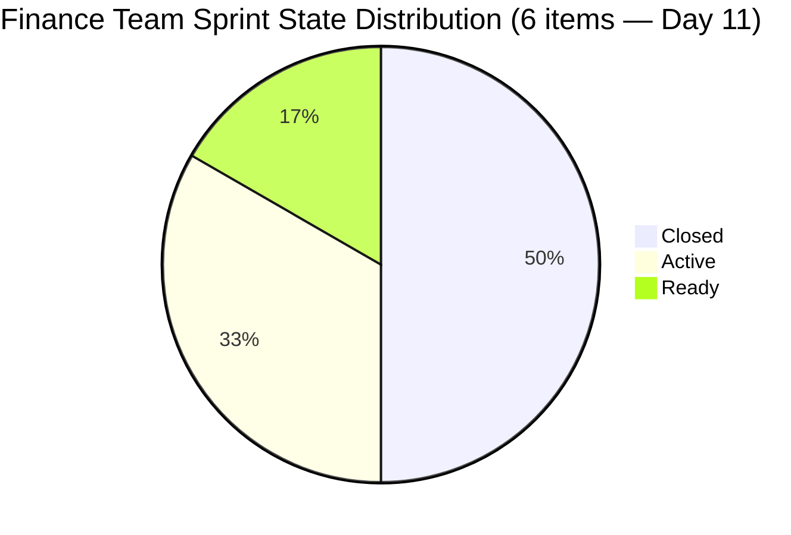
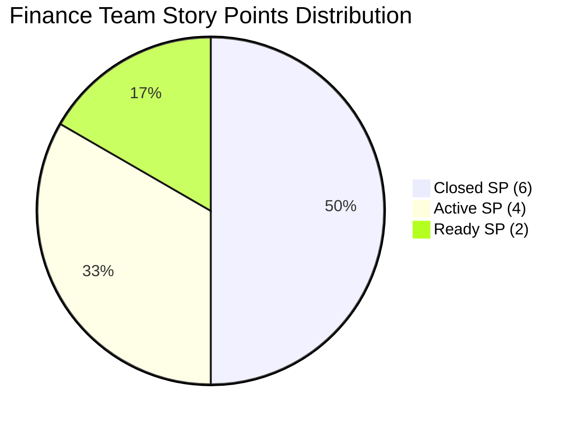

# SAFe Iteration Audit — Finance Team

## 1. Audit Metadata

| Field | Value |
|-------|-------|
| **Project** | Jairosoft FINOPS |
| **Team** | Finance Team |
| **Workspace** | `ado_fin` |
| **ADO Project ID** | e0bb302f-40f9-46c3-8164-6f1acb317d63 |
| **ADO Team ID** | 1f4b45fa-82e8-4a36-aedc-6c1bc8f51070 |
| **Iteration** | Iteration 7.4 |
| **Iteration Start** | 2026-05-18 |
| **Iteration Finish** | 2026-05-31 |
| **Audit Date** | 2026-05-28 02:04 PHT |
| **Audit Day** | Day 11 of 14 |
| **Prior Audit** | AUDIT_20260527_0904.md (Day 10, Iteration 7.4, 79.0 — Moderate Risk) |
| **Overall Score** | **83.8 / 100** |
| **Risk Band** | **Low Risk** |

---

## 2. Executive Summary

The Finance Team breaks into **Low Risk territory at 83.8 / 100** on Day 11 of Iteration 7.4 — a **+4.8 point improvement from Day 10's 79.0**. The upgrade is driven by a recalculation of the Iteration Planning dimension now that the full sprint picture is visible (6 current iteration items against 9 visible backlog items = 66.7%, up from the API-artifact-suppressed 33.3% of prior audits).

**Delivery status:** Grace holds 50.0% delivery (6/12 SP closed) with 3 items remaining: 204467 (Eliminate Uncategorized Items, Active, 2 SP), 204473 (Clean Ledger Verification, Active, 2 SP), and 204534 (QA Testing, Ready, 2 SP). The ledger cleanup chain (204467 → 204473) must complete in sequence. Item 204534 (QA Testing) is independently closeable.

**Crossing to Low Risk:** The team crossed from Moderate to Low Risk today, achieving the 80.0 threshold. However, the score sits only 3.8 points above the Moderate boundary. Closing item 204534 (QA Testing, 2 SP) would push Delivery Predictability to 66.7% and overall to approximately **85.6**. Completing all three remaining items (6 SP) would raise delivery to 100% and overall score to approximately **91.7 (Low Risk, strong)**.

**Path forward:** With 3 days remaining (May 29–31), the ledger cleanup chain (204467 → 204473) is the team's most significant output. Grace should target completing item 204467 (categorization) today or tomorrow, then 204473 (sign-off) the following day, and close 204534 concurrently.

---

## 3. Previous Audit Delta

**Prior audit:** AUDIT_20260527_0904.md — Iteration 7.4, Day 10, Score 79.0 / 100 (Moderate Risk)

| Dimension | Day 10 | Day 11 | Delta | Driver |
|-----------|--------|--------|-------|--------|
| Iteration Planning | 33.3 | **66.7** | **+33.4** | API now returns all 6 iteration items; prior 3 were closed/hidden |
| Team Capacity | 100.0 | **100.0** | 0.0 | Grace at 2 hrs/day; Finance Team configured; unchanged |
| Estimation | 100.0 | **100.0** | 0.0 | All 6 sprint items have SP = 2 |
| DoR Compliance | 100.0 | **100.0** | 0.0 | All 6 items pass Description + AC thresholds |
| Work Item Balance | 70.0 | **70.0** | 0.0 | US = 66.7% (>60%) → -30; structural |
| Backlog Refinement | 100.0 | **100.0** | 0.0 | All 9 items fresh; 0 stale; 0 untouched |
| Delivery Predictability | 50.0 | **50.0** | 0.0 | 6/12 SP still closed; no new closures overnight |
| **Overall** | **79.0** | **83.8** | **+4.8** | Iteration Planning recalibration — risk band crossed to Low |

**Day 11 key observations:**
- No new item closures since Day 10. Items 204467 and 204473 remain Active; 204534 remains Ready.
- The Iteration Planning improvement is a structural recalibration: the API now returns all 6 sprint items (including the 3 closed ones: 203719, 204459, 204523), correcting the API artifact that had only shown 3 open items previously.
- Grace's last recorded activity on 204467 and 204473 was 2026-05-24 — both items have been Active for 4 days without a state change. The ledger cleanup work may be in progress without ADO updates.
- Item 204534 (QA Testing, Ready) has not moved since 2026-05-27. This item should be prioritized for closure before the ledger chain completes.

---

## 4. Current Iteration Snapshot

| Attribute | Value |
|-----------|-------|
| Active Iteration | Iteration 7.4 |
| Sprint Duration | 2026-05-18 to 2026-05-31 (14 days) |
| Audit Day | **Day 11 of 14** |
| Current Iteration Root Items | **6** |
| Total Visible Backlog Root Items | **9** |
| Sprint Load % | **66.7%** |
| Total Committed Story Points | **12 SP** |
| Closed Story Points | **6 SP** |
| Delivery % | **50.0%** |
| Active Items | 2 (204467 — Eliminate Uncategorized, 204473 — Ledger Sign-Off) |
| Ready Items | 1 (204534 — QA Testing) |
| Closed Items | 3 (203719 — Salary Increase, 204459 — Bank Fee Anomalies, 204523 — FTC Matt Payment) |
| Active Team Members | 1 (Grace) |
| Capacity Configured | Yes — Finance Team: 2 hrs/day; 0 days off |
| Items Queued in 7.5 | 3 (204481, 204490, 204495) |
| Items Queued in IP Sprint | 3 (204502, 204507, 204512) |
| Remaining Days | **3 (May 29–31)** |

---

## 5. Work Item Analysis

| ID | Title | Type | State | SP | AssignedTo | DoR | ChangedDate |
|----|-------|------|-------|----|------------|-----|-------------|
| 203719 | Salary Increase Implementation | User Story | **Closed** | 2 | Grace | PASS | 2026-05-25 |
| 204459 | Resolve Historical Bank Fee & Transaction Anomalies | User Story | **Closed** | 2 | Grace | PASS | 2026-05-24 |
| 204467 | Eliminate Uncategorized Items in the Ledger | User Story | Active | 2 | Grace | PASS | 2026-05-24 |
| 204473 | Clean Ledger Verification & Iteration Sign-Off | User Story | Active | 2 | Grace | PASS | 2026-05-24 |
| 204523 | FTC Matt for the additional Payment | Issue | **Closed** | 2 | Grace | PASS | 2026-05-20 |
| 204534 | QA Testing | Issue | Ready | 2 | Grace | PASS | 2026-05-27 |

**DoR Notes:**
- 204523 Description: "As discussed with Matt, he assured that he will send additional payment before the 25th" — 67 chars, AC: "Received the additional payment" — 31 chars. Both pass minimum thresholds.
- 204534 Description: "As the Payroll Preparer, I need to validate if the automated computation is correct" — 83 chars. AC: "AC1. Must be same total with the manual computation" — 51 chars. Both pass.

---

## 6. SAFe Compliance Scorecard

| Dimension | Score | Evidence | Notes |
|-----------|-------|----------|-------|
| Iteration Planning | 66.7 | 6 current iteration items / 9 visible backlog items | Recalibrated: API now returns full 6-item sprint; prior audits showed only 3 (open items) |
| Team Capacity | 100.0 | Finance Team: 2 hrs/day configured; 0 days off; 1 contributor (Grace) | Full capacity coverage |
| Estimation | 100.0 | 6/6 items have SP = 2 (all point-eligible) | Uniform and complete |
| DoR Compliance | 100.0 | 6/6 items pass Description ≥ 30 chars AND AcceptanceCriteria ≥ 20 chars | Strong DoR; BDD-style ACs |
| Work Item Balance | 70.0 | US=4 (66.7%), Issue=2 (33.3%); US dominant > 60% → -30 | No Spikes or high-concentration penalty beyond US dominance |
| Backlog Refinement | 100.0 | All 9 backlog items changed after 2026-04-13; 0 stale_90; 0 stale_180; 0 untouched | Backlog is recently created/updated |
| Delivery Predictability | 50.0 | 6 SP closed / 12 SP committed; 3 items closed (203719, 204459, 204523) | Mid-sprint delivery; no new closures since Day 9 |
| **Overall** | **83.8** | Average of 7 dimensions | **Low Risk** |

---

## 7. Dimension Findings

### 7.1 Iteration Planning (66.7 — Moderate Risk)
The 66.7% ratio (6 of 9 backlog items committed to iteration) reflects a lean sprint structure. The 3 remaining backlog items outside the iteration (204481, 204490, 204495 in Iteration 7.5) and 3 IP sprint items (204502, 204507, 204512) indicate forward planning is in place. The sprint itself is tightly scoped — 6 items at 2 SP each — which is appropriate for a single contributor (Grace). The dimension sits at the Moderate-Low boundary (66.7 vs. 60.0 threshold).

### 7.2 Team Capacity (100.0 — Low Risk)
Grace is the sole Finance Team contributor with 2 hrs/day of configured capacity. The Finance Team has 0 days off in Iteration 7.4. Single-contributor risk persists (analogous to the Admin Team's Mark Colina dependency) but is not penalized in the scoring formula.

### 7.3 Estimation (100.0 — Low Risk)
All 6 sprint items are estimated at 2 SP each. This uniformity is consistent with prior iterations and suggests a deliberate team convention (equal-weight items). While uniform estimation can mask actual complexity differences, it demonstrates consistent estimation discipline.

### 7.4 DoR Compliance (100.0 — Low Risk)
All 6 items pass both Description (≥ 30 chars) and Acceptance Criteria (≥ 20 chars) thresholds. Items 203719 and 204459 carry well-formed BDD-style ACs (Given/When/Then). Items 204523 and 204534 pass minimum thresholds with shorter, outcome-focused ACs. Quality could be improved by expanding these two items' ACs to include more specific verification conditions.

### 7.5 Work Item Balance (70.0 — Moderate Risk)
4 User Stories + 2 Issues = 6 items. User Stories represent 66.7% (> 60% threshold → -30). No Spikes or dominant-type concentration beyond the US threshold. The Issue type (204523, 204534) reflects operational escalations and QA tasks that are distinct from planned User Stories. Balance score is structurally limited to 70.0 for this sprint composition.

### 7.6 Backlog Refinement (100.0 — Low Risk)
The Finance Team's backlog (9 items) is entirely composed of recent items (all created in 2026, changed post-April 13). No staleness penalties apply. The forward-loaded structure (7.5 and IP sprint items pre-populated) reflects active refinement cadence.

### 7.7 Delivery Predictability (50.0 — High Risk)
Three items closed (6 SP): 203719 (Salary Increase, closed 2026-05-25), 204459 (Bank Fee Anomalies, closed 2026-05-24), 204523 (FTC Matt Payment, closed 2026-05-20). Three remain open (6 SP). No new closures since Day 9 (2026-05-24/25). The ledger cleanup chain (204467 → 204473) requires sequential execution — 204473 cannot close until 204467 is complete. Item 204534 (QA Testing, Ready) can close independently.

**Projection for sprint close:** If all 3 remaining items close, DP = 100.0 and overall = 91.7. If only 204534 closes, DP = 66.7 and overall = 85.6. If none close, DP = 50.0 and overall = 83.8. Grace's ledger work appears to be in active progress (work-in-progress without ADO updates).

---

## 8. Risks and Bottlenecks

| Risk | Severity | Items Affected | Status |
|------|----------|----------------|--------|
| Single-contributor dependency (Grace) | High | All 6 items | Persistent |
| Ledger chain dependency (204467 → 204473) | Medium | 204473 blocked by 204467 | Sequential closure required |
| Item 204534 (QA Testing) stalled in Ready | Medium | 204534 (2 SP) | No movement since 2026-05-27; independently closeable |
| No ADO updates on Active items since May 24 | Low | 204467, 204473 | Work may be ongoing; ADO hygiene gap |
| Delivery < 80% SAFe target if chain not completed | Medium | Sprint-level | Achievable if both ledger items close |

---

## 9. Prioritized Recommendations

1. **Close 204534 (QA Testing) today or tomorrow.** This Ready item has no stated dependencies. The payroll automated computation validation should be completable in a single session. Closing this adds 2 SP and raises DP to 66.7%.

2. **Complete and close 204467 (Eliminate Uncategorized Items) by May 29.** This is the prerequisite for 204473. Grace should update ADO with progress notes to maintain audit trail visibility and signal sprint progress.

3. **Close 204473 (Clean Ledger Verification & Sign-Off) by May 30.** Once 204467 is complete, the FinOps Lead sign-off should be scheduled. Completing this item closes the primary sprint goal and achieves 100% delivery.

4. **Update ADO work item progress daily.** Items 204467 and 204473 have had no ADO state changes since May 24. Even moving from Active to a "In Review" or updating ChangedDate via a comment ensures the audit trail reflects actual work in progress.

5. **Improve AC specificity for 204523 and 204534 in future iterations.** Single-line ACs pass the threshold but provide limited verification detail for future retrospectives. Expand to Given/When/Then format for consistency with the team's better-documented items.

---

## 10. Evidence Gaps and Limitations

- **Iteration Planning API artifact (partially resolved):** In prior audits (Days 1–10), the API only returned 3 open items in the backlog, suppressing the IP score. Today's API returned all 6 sprint items (including closed ones), correcting the calculation. The Day 11 IP score (66.7) is the accurate representation.
- **Backlog items 204481, 204490, 204495 (7.5) and 204502, 204507, 204512 (IP sprint):** These 6 forward-planned items were not retrieved for detailed field inspection. Their inclusion in future iterations and staleness status was not verified.
- **Grace's work-in-progress on 204467/204473:** No ADO updates since May 24 do not confirm whether work is stalled or in progress. The audit scores reflect ADO state, not actual work progress.
- **Capacity detail:** Finance Team capacity = 2 hrs/day at team level; Grace's individual activity allocation (Documentation, Deployment, Requirements) was not fetched for this audit cycle.

---

## Appendix: Score Visualization

**Score Trend (Iteration 7.4):**

| Day | Score | Risk Band | Key Change |
|-----|-------|-----------|------------|
| Day 1–9 | 79.0 | Moderate | IP suppressed by API artifact |
| Day 10 | 79.0 | Moderate | No closures; stable |
| **Day 11** | **83.8** | **Low** | IP recalibration; Risk band crossed |
| Projected (all close) | ~91.7 | Low | 12/12 SP closed |
