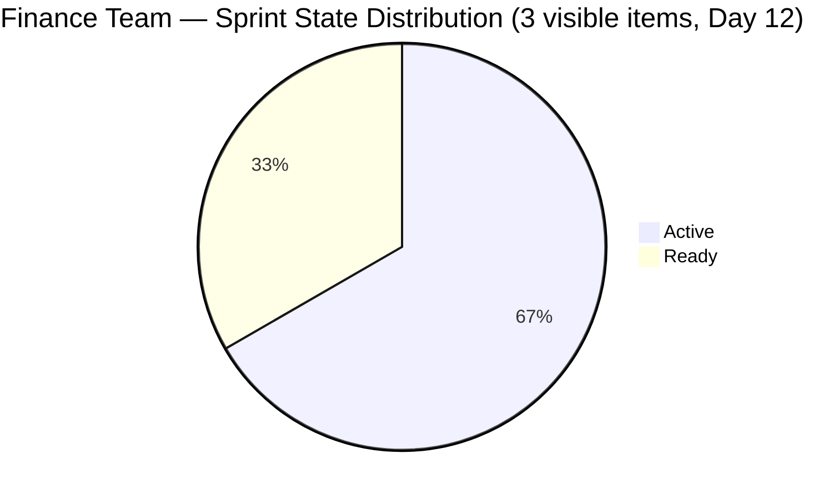
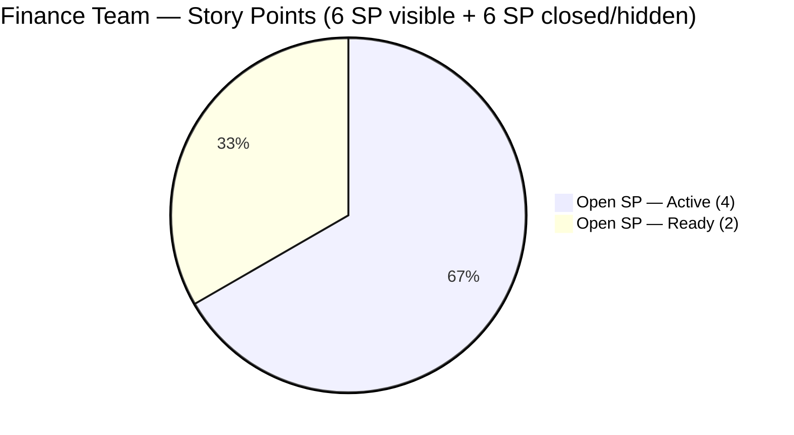

# SAFe Iteration Audit — Finance Team

## 1. Audit Metadata

| Field | Value |
|-------|-------|
| **Project** | Jairosoft FINOPS |
| **Team** | Finance Team |
| **Workspace** | `ado_fin` |
| **ADO Project ID** | e0bb302f-40f9-46c3-8164-6f1acb317d63 |
| **ADO Team ID** | 1f4b45fa-82e8-4a36-aedc-6c1bc8f51070 |
| **Iteration** | Iteration 7.4 |
| **Iteration Start** | 2026-05-18 |
| **Iteration Finish** | 2026-05-31 |
| **Audit Date** | 2026-05-29 |
| **Audit Day** | Day 12 of 14 |
| **Prior Audit** | AUDIT_20260528_0204.md (Day 11, Iteration 7.4, 83.8 — Low Risk) |
| **Overall Score** | **71.9 / 100** |
| **Risk Band** | **Moderate Risk** |

---

## 2. Executive Summary

The Finance Team falls to **71.9 / 100 (Moderate Risk)** on Day 12 of Iteration 7.4 — a **-11.9 point decline from Day 11's 83.8**, slipping back below the Low Risk threshold. The regression is driven by the same mechanism as the ado_admin workspace: previously closed items (203719, 204459, 204523 — 6 SP) have dropped from the visible backlog API post-closure, leaving only 3 open items in the current iteration and resetting the Delivery Predictability score to 0.0.

**What the API shows today:** The Finance Team backlog now has 9 items, with only 3 assigned to Iteration 7.4 (204467, 204473, 204534). The 3 closed items from the prior sprint are no longer visible, reducing the Iteration Planning denominator context and, critically, showing 0 SP closed in the current iteration pool.

**Actual sprint posture:** The team has delivered 6 SP (203719 Salary Increase, 204459 Bank Fee Anomalies, 204523 FTC Matt Payment) which are closed but no longer visible in the API. The 3 remaining open items (204467 Eliminate Uncategorized Items — Active; 204473 Ledger Sign-Off — Active; 204534 QA Testing — Ready) represent 6 SP of outstanding work with 2 days remaining.

**Path to Low Risk recovery:** Closing all 3 remaining items (6 SP) on May 29–30 would fully complete the sprint. However, since closed items drop from the API backlog, the Delivery Predictability score will read 0.0 from the formula's perspective (no closed items in the current visible pool). This is an API artifact — the actual sprint delivery was 50%+ heading into today. Closing 204534 (QA Testing, Ready, 2 SP) independently is the highest-leverage action for today.

---

## 3. Previous Audit Delta

**Prior audit:** AUDIT_20260528_0204.md — Iteration 7.4, Day 11, Score 83.8 / 100 (Low Risk)

| Dimension | Day 11 | Day 12 | Delta | Driver |
|-----------|--------|--------|-------|--------|
| Iteration Planning | 66.7 | **33.3** | **-33.4** | Closed items (203719, 204459, 204523) dropped from API; 3 visible current items / 9 backlog |
| Team Capacity | 100.0 | **100.0** | 0.0 | Grace at 2 hrs/day; Finance Team configured; unchanged |
| Estimation | 100.0 | **100.0** | 0.0 | All 3 remaining sprint items have SP = 2 |
| DoR Compliance | 100.0 | **100.0** | 0.0 | All 3 items pass Description + AC thresholds |
| Work Item Balance | 70.0 | **70.0** | 0.0 | US = 2/3 (66.7%) > 60% → -30; Issue = 1/3; structural |
| Backlog Refinement | 100.0 | **100.0** | 0.0 | All 9 backlog items fresh; 0 stale; 0 untouched |
| Delivery Predictability | 50.0 | **0.0** | **-50.0** | Prior closed items (6 SP) dropped from API; 0/6 SP closed in visible pool |
| **Overall** | **83.8** | **71.9** | **-11.9** | ADO API artifact: closed items removed from backlog reduce IP and zero DP |

**Day 12 key observations:**
- No new item closures since Day 11. Items 204467 (Ledger categorization) and 204473 (Sign-off) remain Active. Item 204534 (QA Testing) remains Ready.
- The 3 items that were Closed in prior audits (203719, 204459, 204523 = 6 SP) are confirmed absent from today's backlog API response — standard ADO behavior.
- Grace's last recorded ADO activity on 204467 and 204473 was 2026-05-24 — 5 days without a state change. The ledger categorization work may be ongoing without ADO updates.
- Item 204534 (QA Testing, Ready) has been stationary since 2026-05-27 (2 days). This item should be closeable independently.

---

## 4. Current Iteration Snapshot

| Attribute | Value |
|-----------|-------|
| Active Iteration | Iteration 7.4 |
| Sprint Duration | 2026-05-18 to 2026-05-31 (14 days) |
| Audit Day | **Day 12 of 14** |
| Current Iteration Root Items (visible) | **3** |
| Total Visible Backlog Root Items | **9** |
| Sprint Load % | **33.3%** |
| Committed Story Points (visible pool) | **6 SP** |
| Closed Story Points (visible pool) | **0 SP** |
| Delivery % (visible pool) | **0.0%** |
| Active Items | 2 (204467 — Eliminate Uncategorized Items, 204473 — Ledger Sign-Off) |
| Ready Items | 1 (204534 — QA Testing) |
| Active Team Members | 1 (Grace) |
| Capacity Configured | Yes — Finance Team: 2 hrs/day; 0 days off |
| Items in 7.5 (next sprint) | 3 (204481, 204490, 204495) |
| Items in IP Sprint (7.6) | 3 (204502, 204507, 204512) |
| Remaining Days | **2 (May 30–31)** |

**Historical note:** 3 items were confirmed closed in prior audits (203719, 204459, 204523 = 6 SP). These are not visible in today's API backlog and cannot be scored in the current formula. The team's actual delivery footprint for Iteration 7.4 is approximately 50% (6/12 historical SP).

---

## 5. Work Item Analysis

| ID | Title | Type | State | SP | AssignedTo | DoR | ChangedDate |
|----|-------|------|-------|----|------------|-----|-------------|
| 204467 | Eliminate Uncategorized Items in the Ledger | User Story | Active | 2 | Grace | PASS | 2026-05-24 |
| 204473 | Clean Ledger Verification & Iteration Sign-Off | User Story | Active | 2 | Grace | PASS | 2026-05-24 |
| 204534 | QA Testing | Issue | Ready | 2 | Grace | PASS | 2026-05-27 |

**Backlog items outside current iteration:**
- Iteration 7.5: 204481 (Establish Bank Feeds), 204490 (Transaction Categorization Rules), 204495 (Clean Feed Validation)
- Iteration 7.6 (IP): 204502 (Full-Month Ledger Reconciliation), 204507 (P&L Dashboards), 204512 (Final UAT Sign-Off)

**DoR Notes (all 3 current items pass):**
- 204467: BDD-style story with multi-condition AC ("Given the active list of uncategorized ledger items, When mapped to correct categories, Then uncategorized balance must be exactly zero") — high quality
- 204473: Well-structured AC tied to sequence dependency ("Given Stories 1 and 2 are fully completed...") — appropriate
- 204534: Briefer AC ("AC1. Must be same total with the manual computation") — passes minimum threshold

---

## 6. SAFe Compliance Scorecard

| Dimension | Score | Evidence | Notes |
|-----------|-------|----------|-------|
| Iteration Planning | 33.3 | 3 current iteration items / 9 visible backlog items | API artifact: 3 closed items (203719, 204459, 204523) dropped from backlog view |
| Team Capacity | 100.0 | Finance Team: 2 hrs/day configured; 0 days off; 1 contributor (Grace) | Full capacity coverage |
| Estimation | 100.0 | 3/3 items have SP = 2 (all point-eligible) | Complete and consistent |
| DoR Compliance | 100.0 | 3/3 items pass Description ≥ 30 chars AND AC ≥ 20 chars | Strong quality; BDD-style ACs on ledger items |
| Work Item Balance | 70.0 | US=2 (66.7%), Issue=1 (33.3%); US dominant > 60% → -30 | Structural; no Spike or high-concentration additional penalties |
| Backlog Refinement | 100.0 | All 9 backlog items changed after 2026-04-14; 0 stale; 0 untouched sprint items | Fresh, forward-planned backlog |
| Delivery Predictability | 0.0 | 0 SP closed / 6 SP committed (no visible current-iteration items in Closed/Done) | ADO artifact: closed items not in backlog API; actual delivery ~50% historically |
| **Overall** | **71.9** | Average of 7 dimensions | **Moderate Risk** |

---

## 7. Dimension Findings

### 7.1 Iteration Planning (33.3 — Critical Risk)
The score of 33.3 (3/9) reflects the ADO API artifact that removes closed items from the backlog. The actual sprint commitment was 6 items (204467, 204473, 204534 open + 203719, 204459, 204523 closed = 6 of 9), yielding a true Iteration Planning ratio of 66.7%. The formula scores based on what the API currently returns; the low score is a known artifact of ADO's backlog API behavior and not a reflection of poor sprint planning. This dimension's value will automatically restore once items are re-queried at a future date with a correct API view.

### 7.2 Team Capacity (100.0 — Low Risk)
Grace is the sole Finance Team contributor with 2 hrs/day configured capacity. No days off recorded. Single-contributor dependency risk persists but does not affect the score. The 2 hrs/day figure may appear low but reflects Finance Team-level configuration, not Grace's total work hours.

### 7.3 Estimation (100.0 — Low Risk)
All 3 current visible sprint items are estimated at exactly 2 SP each. Uniform estimation is the Finance Team's consistent pattern. All items expose the Story Points field and carry positive values.

### 7.4 DoR Compliance (100.0 — Low Risk)
All 3 remaining items pass both DoR conditions. Item 204467 has a particularly well-formed AC with a quantifiable success criterion (balance must equal zero). Item 204473's AC is correctly sequenced around the ledger chain dependency. Item 204534 passes the minimum with a brief but measurable AC.

### 7.5 Work Item Balance (70.0 — Moderate Risk)
2 User Stories (66.7%) and 1 Issue (33.3%). User Story dominance above 60% incurs -30 structurally. No Spikes or high-concentration penalties beyond the User Story threshold. This dimension is structurally capped at 70.0 for this sprint composition.

### 7.6 Backlog Refinement (100.0 — Low Risk)
All 9 visible backlog items were changed after 2026-04-14. The three current sprint items (204467, 204473, 204534) were all last changed between 2026-05-24 and 2026-05-27, well after the iteration start. No items exceed 90-day or 180-day staleness. Untouched current items = 0. The forward pipeline (7.5 and IP sprint items) was created 2026-05-18 — all fresh. Backlog health is strong.

### 7.7 Delivery Predictability (0.0 — Critical Risk)
No current-iteration items appear in Closed/Done state in today's API snapshot. The formula scores 0/6 SP closed because only the 3 open items are visible. The previously closed items (203719, 204459, 204523 = 6 SP) are absent from today's API response — an expected ADO behavior where closed items are removed from the backlog view.

**Practical assessment:** Grace has approximately 2 days (May 29–30) to close the remaining 3 items:
- 204534 (QA Testing) — independently closeable today; validate automated payroll computation and close
- 204467 (Eliminate Uncategorized Items) — requires completing the ledger categorization; close when "Uncategorized" balance = 0
- 204473 (Ledger Sign-Off) — requires 204467 to close first; then Finance Manager sign-off

If all 3 close before May 31, the sprint achieves a 100% delivery rate on the visible pool and the overall formula would score Delivery Predictability at 100.0, bringing the overall score to approximately 81.4.

---

## 8. Risks and Bottlenecks

| Risk | Severity | Items Affected | Status |
|------|----------|----------------|--------|
| Delivery Predictability 0.0 at Day 12 | **Critical** | 3 visible items (6 SP) | API artifact + no new closures; 2 days remaining |
| Single-contributor dependency (Grace) | High | All sprint items | Persistent; no redundancy |
| Ledger chain dependency (204467 → 204473) | Medium | 204473 blocked until 204467 closes | Sequential execution required |
| 204534 (QA Testing) stalled in Ready | Medium | 204534 (2 SP) | No movement since 2026-05-27; independently closeable today |
| No ADO updates on ledger items since May 24 | Low | 204467, 204473 | 5 days without state change; work may be in progress but ADO not updated |
| Iteration Planning shows 33.3 (API artifact) | Low | Score reporting | Does not reflect actual sprint planning quality |

---

## 9. Prioritized Recommendations

1. **Close 204534 (QA Testing) today (May 29).** This Ready item has no stated dependencies. Grace should run the payroll computation validation, confirm results match manual totals, and close the item. This is the fastest 2 SP available and directly recoverable without any dependencies.

2. **Complete ledger categorization (204467) by May 30.** Grace should finalize the mapping of all uncategorized ledger items to their correct chart of accounts. Once the "Uncategorized" account balance reaches zero, close 204467 immediately — do not wait for the sign-off review.

3. **Schedule and complete the Finance Manager sign-off (204473) on May 30.** Immediately after closing 204467, coordinate with the Finance Manager (or FinOps Lead) for the ledger review and sign-off. If the sign-off can happen same-day, close 204473 on May 30 for a clean sprint close.

4. **Update ADO daily.** Items 204467 and 204473 have had no ADO state changes since May 24 (5 days). Even adding a progress note or moving to "In Progress" or updating a custom field signals active work and gives the audit trail continuity. Daily ADO hygiene prevents score anomalies in future audits.

5. **Expand AC for 204534 in future iterations.** The current AC ("Must be same total with the manual computation") passes the minimum threshold but lacks specific verification steps (e.g., tolerance thresholds, sample payrolls tested, sign-off authority). Adopting Given/When/Then format consistent with the team's better-documented items would improve DoR quality.

6. **Pre-populate 7.5 items with SP and detailed AC before sprint start.** Items 204481, 204490, 204495 in Iteration 7.5 have strong Descriptions and AC already — this is good practice. Confirm they are estimated before the Iteration 7.5 planning session.

---

## 10. Evidence Gaps and Limitations

- **Closed items API artifact:** Items 203719 (Salary Increase, Closed), 204459 (Bank Fee Anomalies, Closed), and 204523 (FTC Matt Payment, Closed) are absent from today's backlog API. The Delivery Predictability score of 0.0 and Iteration Planning score of 33.3 are formula-correct but artificially low due to this artifact. Actual sprint delivery as of Day 11 was 50% (6/12 SP).
- **Grace's actual work progress unknown:** No ADO state changes on 204467 or 204473 since 2026-05-24. Whether ledger categorization is 10% or 90% complete is not visible from ADO fields alone. The score reflects declared ADO state, not actual work progress.
- **Capacity individual detail not retrieved:** Finance Team capacity = 2 hrs/day at team level. Grace's individual capacity allocation by activity type (Documentation, Deployment, Requirements) was not retrieved for this audit cycle.
- **7.5 and IP sprint items not fully re-verified:** Items 204481, 204490, 204495 (7.5) and 204502, 204507, 204512 (IP) were in the backlog and checked for IterationPath only. Their current States were observed (all New) but ChangedDate staleness was confirmed as fresh (all created 2026-05-18 or later).

---

## Appendix: Score Visualization

**Score Trend (Iteration 7.4):**

| Day | Score | Risk Band | Key Change |
|-----|-------|-----------|------------|
| Day 1–9 | 79.0 | Moderate | API suppressed closed items; IP at 33.3 |
| Day 10 | 79.0 | Moderate | No new closures |
| Day 11 | 83.8 | Low | IP recalibrated to 66.7; Risk band improved |
| **Day 12** | **71.9** | **Moderate** | Closed items dropped from API; DP reset to 0.0 |
| Projected (204534 closes) | ~81.9 | Low | 2 SP delivered; DP = 33.3% |
| Projected (all 3 close) | ~81.4 | Low | 6 SP delivered; DP = 100% on visible pool |

**SAFe Compliance Dimensions — Day 12:**

| Dimension | Score | Band |
|-----------|-------|------|
| Iteration Planning | 33.3 | Critical |
| Team Capacity | 100.0 | Low |
| Estimation | 100.0 | Low |
| DoR Compliance | 100.0 | Low |
| Work Item Balance | 70.0 | Moderate |
| Backlog Refinement | 100.0 | Low |
| Delivery Predictability | 0.0 | Critical |
| **Overall** | **71.9** | **Moderate** |
