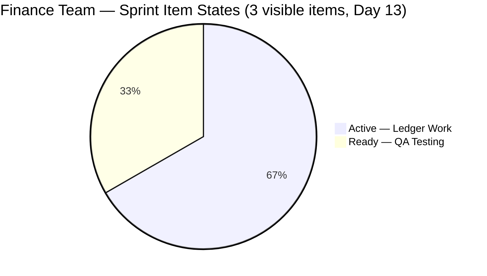
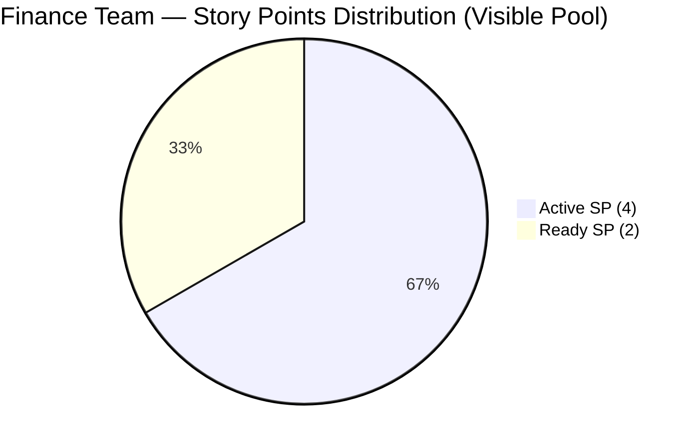

# SAFe Iteration Audit — Finance Team

## 1. Audit Metadata

| Field | Value |
|-------|-------|
| **Project** | Jairosoft FINOPS |
| **Team** | Finance Team |
| **Workspace** | `ado_fin` |
| **ADO Project ID** | e0bb302f-40f9-46c3-8164-6f1acb317d63 |
| **ADO Team ID** | 1f4b45fa-82e8-4a36-aedc-6c1bc8f51070 |
| **Iteration** | Iteration 7.4 |
| **Iteration Start** | 2026-05-18 |
| **Iteration Finish** | 2026-05-31 |
| **Audit Date** | 2026-05-30 |
| **Audit Day** | Day 13 of 14 |
| **Prior Audit** | AUDIT_20260529_0900.md (Day 12, Iteration 7.4, 71.9 — Moderate Risk) |
| **Overall Score** | **71.9 / 100** |
| **Risk Band** | **Moderate Risk** |

---

## 2. Executive Summary

The Finance Team holds at **71.9 / 100 (Moderate Risk)** on Day 13 of Iteration 7.4 — **unchanged from Day 12**, as no ADO state transitions were recorded overnight. The score reflects the same structural condition: three open items in the current iteration (204467, 204473, 204534), all estimated and DoR-compliant, with 0 SP closed in the visible backlog pool.

**Sprint close position:** With 1 day remaining (May 31), Grace needs to close all three remaining items (6 SP) to achieve 100% Delivery Predictability on the visible pool. The dependency chain is 204467 → 204473 → close, with 204534 closeable independently. If all three close, the overall score rises to approximately 81.4 (Low Risk).

**Structural observation (Iteration Planning at 33.3):** Three items closed in prior days (203719, 204459, 204523 = 6 SP) remain absent from the backlog API — standard ADO behavior. The Iteration Planning score of 33.3 (3/9) is a formula artifact of ADO's closed-item suppression, not a reflection of poor sprint planning. The actual sprint commitment was 6 items.

**Items with no ADO update in 6+ days:** 204467 and 204473 (both last changed 2026-05-24 — 6 days ago). Grace may be working on the ledger categorization, but the ADO state is not reflecting progress. The sprint closes tomorrow.

---

## 3. Previous Audit Delta

**Prior audit:** AUDIT_20260529_0900.md — Iteration 7.4, Day 12, Score 71.9 / 100 (Moderate Risk)

| Dimension | Day 12 | Day 13 | Delta | Driver |
|-----------|--------|--------|-------|--------|
| Iteration Planning | 33.3 | **33.3** | 0.0 | 3 visible items / 9 backlog; closed items still absent from API |
| Team Capacity | 100.0 | **100.0** | 0.0 | Grace: 2 hrs/day; Finance Team configured; unchanged |
| Estimation | 100.0 | **100.0** | 0.0 | All 3 items have SP = 2; unchanged |
| DoR Compliance | 100.0 | **100.0** | 0.0 | All 3 items pass Description + AC; unchanged |
| Work Item Balance | 70.0 | **70.0** | 0.0 | US=2 (66.7%), Issue=1 (33.3%); structural |
| Backlog Refinement | 100.0 | **100.0** | 0.0 | All 9 items fresh; 0 stale; no changes |
| Delivery Predictability | 0.0 | **0.0** | 0.0 | No closures; 0/6 SP in visible pool |
| **Overall** | **71.9** | **71.9** | **0.0** | No ADO changes recorded overnight |

**Day 13 key observations:**
- No state changes on any of the three current iteration items since yesterday.
- 204534 (QA Testing, Ready) remains in Ready state — it has been in this state since 2026-05-27 (3 days). This item has no dependencies and should be closeable today.
- 204467 (Eliminate Uncategorized Items, Active) last changed 2026-05-24. No progress logged for 6 days.
- 204473 (Ledger Sign-Off, Active) last changed 2026-05-24. Depends on 204467 completing first.
- The 9-item backlog (204467, 204473, 204481, 204490, 204495, 204502, 204507, 204512, 204534) is unchanged since yesterday.

---

## 4. Current Iteration Snapshot

| Attribute | Value |
|-----------|-------|
| Active Iteration | Iteration 7.4 |
| Sprint Duration | 2026-05-18 to 2026-05-31 (14 days) |
| Audit Day | **Day 13 of 14** |
| Current Iteration Root Items (visible) | **3** |
| Total Visible Backlog Root Items | **9** |
| Sprint Load % | **33.3%** |
| Committed Story Points (visible pool) | **6 SP** |
| Closed Story Points (visible pool) | **0 SP** |
| Delivery % (visible pool) | **0.0%** |
| Active Items | 2 (204467 — Uncategorized Items, 204473 — Ledger Sign-Off) |
| Ready Items | 1 (204534 — QA Testing) |
| Active Team Members | 1 (Grace) |
| Capacity Configured | Yes — Finance Team: 2 hrs/day; 0 days off |
| Items in 7.5 (next sprint) | 3 (204481, 204490, 204495) |
| Items in IP Sprint (7.6) | 3 (204502, 204507, 204512) |
| Remaining Days | **1 (May 31)** |

**Historical note:** 3 items were confirmed closed in prior days (203719, 204459, 204523 = 6 SP). These are not visible in today's backlog API. The team's actual iteration-to-date delivery footprint is approximately 50% (6 of 12 historical SP).

---

## 5. Work Item Analysis

| ID | Title | Type | State | SP | AssignedTo | DoR | ChangedDate |
|----|-------|------|-------|----|------------|-----|-------------|
| 204467 | Eliminate Uncategorized Items in the Ledger | User Story | Active | 2 | Grace | PASS | 2026-05-24 |
| 204473 | Clean Ledger Verification & Iteration Sign-Off | User Story | Active | 2 | Grace | PASS | 2026-05-24 |
| 204534 | QA Testing | Issue | Ready | 2 | Grace | PASS | 2026-05-27 |

**DoR Quality Notes (all pass):**
- 204467: BDD-style "Given uncategorized items / When mapped / Then uncategorized balance = zero" — highly specific and measurable AC. PASS.
- 204473: Sequenced AC ("Given Stories 1 and 2 fully completed...") — appropriate dependency chain. PASS.
- 204534: Brief but measurable ("AC1. Must be same total with the manual computation"). Passes minimum threshold.

**Backlog pipeline (outside current iteration):**
- Iteration 7.5: 204481 (Bank Feeds), 204490 (Categorization Rules), 204495 (Feed Validation) — all New, all with strong BDD ACs.
- IP Sprint (7.6): 204502 (Full Reconciliation), 204507 (P&L Dashboards), 204512 (Final UAT) — all New.

---

## 6. SAFe Compliance Scorecard

| Dimension | Score | Evidence | Notes |
|-----------|-------|----------|-------|
| Iteration Planning | 33.3 | 3 current items / 9 visible backlog | API artifact: 3 closed items (203719, 204459, 204523) removed from backlog view |
| Team Capacity | 100.0 | Finance Team: 2 hrs/day; 0 days off; 1 contributor (Grace) | Full capacity coverage; bus factor 1 |
| Estimation | 100.0 | 3/3 items have SP = 2 | Complete, consistent estimation |
| DoR Compliance | 100.0 | 3/3 items pass Description ≥ 30 chars AND AC ≥ 20 chars | Strong quality; BDD-style ACs on ledger items |
| Work Item Balance | 70.0 | US=2 (66.7%), Issue=1 (33.3%); US > 60% → -30 | Structural; no additional penalties |
| Backlog Refinement | 100.0 | All 9 items changed after 2026-04-15; 0 stale; 0 untouched | Forward pipeline fresh; all items active |
| Delivery Predictability | 0.0 | 0 SP closed / 6 SP committed (visible pool) | ADO artifact: closed items not visible; 1 day remaining |
| **Overall** | **71.9** | Average of 7 dimensions | **Moderate Risk** |

---

## 7. Dimension Findings

### 7.1 Iteration Planning (33.3 — Critical Risk)
The 33.3 score (3/9) is an ADO API artifact. The actual sprint commitment was 6 items. Three closed items (203719, 204459, 204523) dropped from the backlog view — standard ADO behavior. The true Iteration Planning ratio at sprint peak was 6/9 = 66.7%. This dimension will not self-correct within this audit cycle; it restores only when the formula context is reset at the start of a new iteration.

### 7.2 Team Capacity (100.0 — Low Risk)
Grace is the sole Finance Team contributor with 2 hrs/day configured. No days off. The 2 hrs/day figure reflects team-level capacity configuration, not Grace's total daily working hours. Individual activity breakdown (Deployment, Documentation, Requirements) was not retrieved for this audit. Single-contributor risk persists.

### 7.3 Estimation (100.0 — Low Risk)
All three remaining sprint items carry exactly 2 SP each. Estimation is complete and consistent across the visible pool.

### 7.4 DoR Compliance (100.0 — Low Risk)
All three items pass both DoR conditions. Item 204467 has a particularly strong AC with a binary, measurable outcome (uncategorized balance = zero). Item 204473's sequenced AC is appropriate for a dependent close step. Item 204534 meets the minimum with a measurable manual computation validation.

### 7.5 Work Item Balance (70.0 — Moderate Risk)
2 User Stories (66.7%) + 1 Issue (33.3%). User Story dominance above 60% incurs -30. No Spike or other concentration penalties. Structurally fixed at 70.0 for this sprint composition.

### 7.6 Backlog Refinement (100.0 — Low Risk)
All 9 visible backlog items were last changed between 2026-05-18 and 2026-05-27. No items cross the 90-day stale threshold (cutoff: 2026-03-01). No stale_180 items. The three current sprint items were last changed on 2026-05-24 and 2026-05-27 — both after the iteration start date. Untouched current items = 0. Backlog health is strong with a well-prepared forward pipeline in 7.5 and IP sprint.

### 7.7 Delivery Predictability (0.0 — Critical Risk)
No current-iteration items appear in Closed or Done state in today's API snapshot. The visible pool is 6 SP (3 items at SP=2 each) with 0 closed.

**Sprint close plan — 1 day remaining:**
- **204534 (QA Testing, Ready, 2 SP):** Independently closeable. Grace should validate payroll computation totals match manual calculation and close today (May 30). No dependencies.
- **204467 (Eliminate Uncategorized Items, Active, 2 SP):** Requires completing the ledger categorization to reduce the "Uncategorized" account balance to zero. Close when the AC condition is met.
- **204473 (Ledger Sign-Off, Active, 2 SP):** Requires 204467 closed first, then Finance Manager sign-off during end-of-iteration sync. Close on May 30 or May 31.

If all 3 close: DP = 6/6 = 100%, overall score rises to approximately 81.4 (Low Risk).

---

## 8. Risks and Bottlenecks

| Risk | Severity | Items Affected | Status |
|------|----------|----------------|--------|
| 0 SP closed at Day 13 — 1 day remaining | **Critical** | 6 SP (3 items) | No closures recorded since prior sprint deliveries |
| 204467 + 204473 with no ADO update for 6 days | **High** | 204467, 204473 | Last changed 2026-05-24; work may be in progress but not reflected |
| Ledger chain dependency (204467 → 204473) | **High** | 204473 | Cannot close sign-off until categorization completes |
| 204534 (QA Testing) stalled in Ready for 3 days | Medium | 204534 (2 SP) | Independently closeable; no progress since 2026-05-27 |
| Single-contributor (Grace) — no redundancy | Medium | All 3 items | Persistent bus factor risk |
| Iteration Planning 33.3 — API artifact | Low | Score reporting | Actual planning was 66.7%; low score will not recover in this iteration |

---

## 9. Prioritized Recommendations

1. **Close 204534 (QA Testing) today (May 30).** This is the highest-leverage, lowest-dependency action available. Grace should run the payroll computation validation, confirm totals match manual calculation, and close the item before EOD May 30. This captures 2 SP and restores partial DP.

2. **Complete ledger categorization (204467) by May 30.** Grace should finalize the mapping of all uncategorized ledger items to their correct chart of accounts. The acceptance condition is binary: "Uncategorized" account balance = zero. Close 204467 the moment the condition is met — do not wait for the sign-off review.

3. **Schedule Finance Manager sign-off (204473) for May 30 or May 31 EOD.** Immediately after closing 204467, coordinate with the Finance Manager for the ledger review. If sign-off can happen on May 30, close 204473 same day. This completes the sprint at 6/6 SP (100% DP) and recovers the Low Risk band.

4. **Update ADO daily — both 204467 and 204473 are 6 days stale.** Even if the ledger work is progressing, ADO must reflect that progress. Update the state (e.g., move to "In Progress" or add a comment with a percentage estimate) to give the audit trail continuity and signal active work to stakeholders.

5. **Before sprint close, confirm 7.5 items are estimated.** Items 204481, 204490, 204495 in Iteration 7.5 are all in New state. Confirm SP estimates are entered before the Iteration 7.4 retrospective so the next sprint opens with full estimation coverage.

6. **Strengthen AC on 204534 for future iterations.** The current AC ("Must be same total with the manual computation") passes the minimum but lacks specificity (which payrolls, which periods, what tolerance). Consider expanding to Given/When/Then format consistent with the ledger items for audit quality.

---

## 10. Evidence Gaps and Limitations

- **Closed items API artifact (major):** Items 203719 (Salary Increase, Closed), 204459 (Bank Fee Anomalies, Closed), and 204523 (FTC Matt Payment, Closed) are absent from today's backlog API. The Delivery Predictability score of 0.0 and Iteration Planning score of 33.3 are formula-correct but reflect the artifact of ADO's closed-item suppression. Actual sprint delivery as of Day 11 was approximately 50% (6 of 12 SP).
- **Grace's actual work progress on 204467 and 204473 is unknown.** No ADO state changes since 2026-05-24 (6 days). The work may be substantially complete but not reflected in ADO. The score reflects declared ADO state only.
- **Capacity individual detail not retrieved.** Finance Team capacity = 2 hrs/day at team level. Grace's individual capacity breakdown by activity (Deployment, Documentation, Requirements) was not queried for this audit.
- **7.5 and IP sprint item states confirmed as New.** All six pipeline items (204481, 204490, 204495, 204502, 204507, 204512) remain in New state — no unexpected state changes. ChangedDates range from 2026-05-18 to 2026-05-18; all are fresh.

---

## Appendix: Score Visualization

**Score Trend (Iteration 7.4):**

| Day | Score | Risk Band | Key Change |
|-----|-------|-----------|------------|
| Day 11 | 83.8 | Low | 3 closures (6 SP); DP = 50%; best score this iteration |
| Day 12 | 71.9 | Moderate | Closed items dropped from API; DP reset to 0.0 |
| **Day 13** | **71.9** | **Moderate** | No changes; all dimensions locked |
| Projected (204534 closes) | ~76.1 | Moderate | 2 SP delivered; DP = 33.3% |
| Projected (all 3 close) | ~81.4 | Low | 6 SP delivered; DP = 100%; Low Risk restored |

**SAFe Compliance Dimensions — Day 13:**

| Dimension | Score | Band |
|-----------|-------|------|
| Iteration Planning | 33.3 | Critical |
| Team Capacity | 100.0 | Low |
| Estimation | 100.0 | Low |
| DoR Compliance | 100.0 | Low |
| Work Item Balance | 70.0 | Moderate |
| Backlog Refinement | 100.0 | Low |
| Delivery Predictability | 0.0 | Critical |
| **Overall** | **71.9** | **Moderate** |
