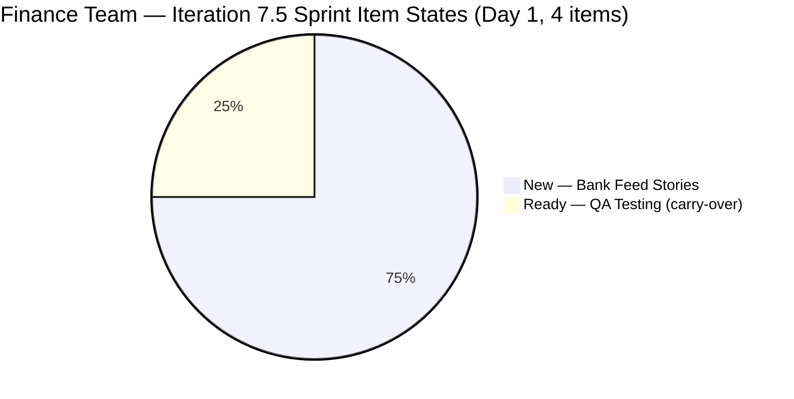
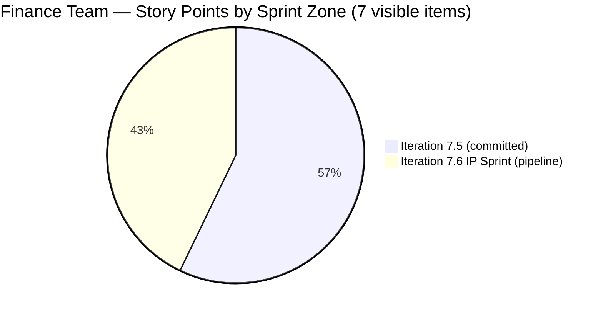
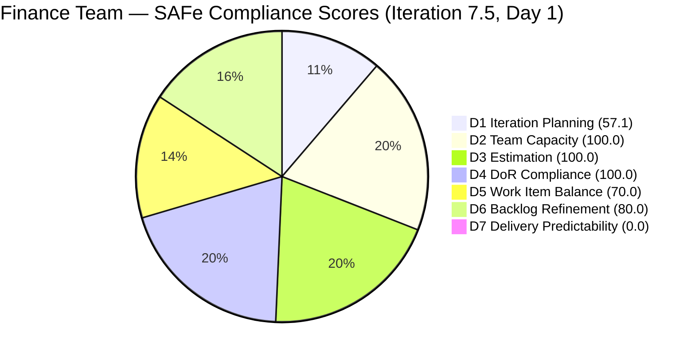

# SAFe Iteration Audit — Finance Team

## 1. Audit Metadata

| Field | Value |
|-------|-------|
| **Project** | Jairosoft FINOPS |
| **Team** | Finance Team |
| **Workspace** | `ado_fin` |
| **ADO Project ID** | e0bb302f-40f9-46c3-8164-6f1acb317d63 |
| **ADO Team ID** | 1f4b45fa-82e8-4a36-aedc-6c1bc8f51070 |
| **Iteration** | Iteration 7.5 |
| **Iteration Start** | 2026-06-01 |
| **Iteration Finish** | 2026-06-14 |
| **Sprint Day** | Day 1 of 14 |
| **Audit Date / Time / TZ** | 2026-06-01 02:03 UTC-6 |
| **Prior Audit** | AUDIT_20260530_0900.md — Iteration 7.4, Day 13, Score 71.9 (Moderate Risk) |
| **Overall Score** | **72.4 / 100** |
| **Risk Band** | **Moderate Risk** |

---

## 2. Executive Summary

The Finance Team opens Iteration 7.5 at **72.4 / 100 (Moderate Risk)** — a marginal improvement of +0.5 from the Iteration 7.4 final score of 71.9, driven primarily by a slight uptick in the Iteration Planning ratio (4 items in sprint vs. 3 in the prior close snapshot). The sprint carries a 4-item, 6-SP visible load (3 User Stories + 1 legacy Issue), all fully estimated and DoR-compliant — excellent sprint entry quality from Grace.

**Key strengths:** Team Capacity, Estimation, and DoR Compliance all hold at 100.0. The sprint opens with three strong BDD-quality User Stories for the bank feed automation objective, providing clear acceptance gates for each work unit.

**Top risks:** Delivery Predictability is 0.0 at Day 1 (expected — no closures on sprint Day 1, but CLSP must recover within the sprint window). Iteration Planning scores 57.1, reflecting 4 of 7 visible backlog items committed to this sprint; the 3 IP Sprint items in 7.6 suppress the ratio. Three current-iteration User Stories (204481, 204490, 204495) have not been touched since 2026-05-18, meaning they entered the sprint without a Day 1 activation signal in ADO — a Backlog Refinement penalty of -20 applies. Single-contributor risk (Grace) remains the persistent structural concern.

---

## 3. Previous Audit Delta

**Prior audit:** AUDIT_20260530_0900.md — Iteration 7.4, Day 13, Score 71.9 / 100 (Moderate Risk)

| Dimension | Iter 7.4 Day 13 | Iter 7.5 Day 1 | Delta | Driver |
|-----------|-----------------|----------------|-------|--------|
| Iteration Planning | 33.3 | **57.1** | **+23.8** | New iteration reset: 4/7 items in 7.5 vs. 3/9 in closed 7.4 |
| Team Capacity | 100.0 | **100.0** | 0.0 | Grace remains configured; activities present; no days off |
| Estimation | 100.0 | **100.0** | 0.0 | 3/3 point-eligible items (US) carry 2 SP each |
| DoR Compliance | 100.0 | **100.0** | 0.0 | All 4 CIRI items pass Description ≥ 30 and AC ≥ 20 |
| Work Item Balance | 70.0 | **70.0** | 0.0 | US=3 (75%) + Issue=1 (25%); dominant US >60% → -30; structural |
| Backlog Refinement | 100.0 | **80.0** | **-20.0** | 3/4 CIRI items untouched since pre-sprint (>30% threshold) |
| Delivery Predictability | 0.0 | **0.0** | 0.0 | Day 1; 0/6 SP closed; early-sprint low delivery expected |
| **Overall** | **71.9** | **72.4** | **+0.5** | Iteration reset lifted Planning; Refinement penalty offset gains |

**Transition notes:**
- Items 204467 (Eliminate Uncategorized Items) and 204473 (Clean Ledger Verification & Iteration Sign-Off) are no longer visible in the backlog API — consistent with ADO's closed-item suppression behavior. This confirms that Grace closed both items before sprint end, completing the 7.4 ledger objective.
- Item 204534 (QA Testing, Issue) moved from Iteration 7.4 to Iteration 7.5 — it remained in "Ready" state and was not closed in 7.4. It carries over with ChangedDate 2026-06-01 (updated today at 07:38 UTC).
- Items 204481, 204490, 204495 are the three new bank feed User Stories entering their committed sprint for the first time.

---

## 4. Current Iteration Snapshot

| Attribute | Value |
|-----------|-------|
| Active Iteration | Iteration 7.5 |
| Sprint Duration | 2026-06-01 to 2026-06-14 (14 days) |
| Audit Day | **Day 1 of 14** |
| Current Iteration Root Items (visible, CIRI) | **4** |
| Total Visible Backlog Root Items (VRBI) | **7** |
| Sprint Load % | **57.1%** |
| Point-Eligible Current Items (PECI — US only) | **3** (204481, 204490, 204495) |
| Committed Story Points (CSP) | **6 SP** |
| Closed Story Points (CLSP) | **0 SP** |
| Delivery % | **0.0%** (Day 1 — early sprint) |
| Item States | New × 3 (204481, 204490, 204495), Ready × 1 (204534) |
| Active Team Members | 1 (Grace) |
| Capacity Configured | Yes — Grace: activities (Documentation, Requirements) configured; totalCapacityPerDay = 0 (unset) |
| Items in 7.6 IP Sprint | 3 (204502, 204507, 204512) |
| Remaining Days | **13** (Jun 2–14) |

**Carry-over note:** 204534 (QA Testing) is a carry-over Issue from Iteration 7.4. It was not closed in 7.4 and is now assigned to 7.5. Its ChangedDate was refreshed on 2026-06-01 (today).

---

## 5. Work Item Analysis

| ID | Title | Type | State | SP | Assignee | DoR | ChangedDate |
|----|-------|------|-------|----|----------|-----|-------------|
| 204534 | QA Testing | Issue | Ready | 2 | Grace | PASS | 2026-06-01 |
| 204481 | Establish & Authenticate Real-Time Bank Feeds | User Story | New | 2 | Grace | PASS | 2026-05-18 |
| 204490 | Define Automated Transaction Categorization Rules | User Story | New | 2 | Grace | PASS | 2026-05-18 |
| 204495 | Clean Feed Validation & Automation Freeze | User Story | New | 2 | Grace | PASS | 2026-05-18 |

**DoR Quality Notes (all 4 pass):**
- **204534:** Description: "As the Payroll Preparer, I need to validate if the automated computation is correct" (~68 chars, stripped). AC: "AC1. Must be same total with the manual computation" (~51 chars, stripped). Minimum thresholds met; AC is brief but measurable. **PASS**.
- **204481:** Full BDD User Story with Given/When/Then. Description: 220+ chars. AC: "Given valid corporate banking credentials and MFA tokens, When bank feed activated, Then system must pull last 24 hours of live transactions automatically." 290+ chars. **PASS — strong**.
- **204490:** BDD format. Description: 250+ chars. AC includes measurable outcome: "reduce manual intervention for recurring costs by at least 80%." 275+ chars. **PASS — strong**.
- **204495:** BDD format. Description: 200+ chars. AC includes binary outcome: "zero system errors or dropped payloads" with a 48-hour validation window. 265+ chars. **PASS — strong**.

**Pipeline (outside current iteration — Iteration 7.6 IP Sprint):**
- 204502 (Complete Full-Month Ledger Reconciliation) — User Story, New, 2 SP — strong BDD AC with "variance = exactly zero" condition
- 204507 (Generate & Configure Clean P&L Dashboards) — User Story, New, 2 SP — BDD AC with drill-down requirement
- 204512 (Final Feature Audit, UAT, and Sign-Off) — User Story, New, 2 SP — BDD AC with feature closure gate

---

## 6. SAFe Compliance Scorecard

| Dimension | Score | Evidence (Numerator / Denominator) | Notes |
|-----------|-------|-------------------------------------|-------|
| D1 Iteration Planning | 57.1 | 4 CIRI / 7 VRBI | 3 IP Sprint items in 7.6 (IP) reduce ratio; not a planning failure |
| D2 Team Capacity | 100.0 | 1 CC / 1 CW | Grace has activities configured (Documentation, Requirements); totalCapacityPerDay=0 (hours unset, activities present) |
| D3 Estimation | 100.0 | 3 ECI / 3 PECI | 204534 (Issue) excluded from PECI; US trio all SP=2 |
| D4 DoR Compliance | 100.0 | 4 DCI / 4 CIRI | All items pass Description ≥ 30 and AC ≥ 20 stripped-char thresholds |
| D5 Work Item Balance | 70.0 | US=3 (75%), Issue=1 (25%) | User Story present (no Penalty A); US dominant >60% → Penalty B -30; no Spikes |
| D6 Backlog Refinement | 80.0 | 7 fresh / 7 VRBI = 100.0 base; −20 untouched penalty | 3/4 CIRI items (204481, 204490, 204495) unchanged since 2026-05-18 — before sprint start |
| D7 Delivery Predictability | 0.0 | 0 CLSP / 6 CSP | Day 1 — early-sprint; no deliveries expected yet; formula applied as defined |
| **Overall** | **72.4** | **(57.1+100.0+100.0+100.0+70.0+80.0+0.0) / 7** | **Moderate Risk** |

---

## 7. Dimension Findings

### 7.1 D1 — Iteration Planning (57.1 — Moderate Risk)

**Formula:** round(CIRI / VRBI × 100, 1)

**Data:**
- VRBI = 7 (all root items returned by backlog API)
- CIRI = 4 (items with IterationPath = "Jairosoft FINOPS\2026-PI7\Iteration 7.5")
  - 204534, 204481, 204490, 204495
- Non-CIRI items = 3 (204502, 204507, 204512 — all in "Jairosoft FINOPS\2026-PI7\Iteration 7.6 (IP)")

**Calculation:** 4 / 7 × 100 = **57.1**

**Interpretation:** The 57.1 score reflects a standard sprint-vs-pipeline split. Three items are deliberately staged in the IP Sprint (7.6) as part of the PI planning cadence — Full Reconciliation, P&L Dashboards, and Final UAT. These are not uncommitted backlog items; they are pre-scheduled for the Innovation & Planning sprint. The ratio correctly reflects that 57% of visible work is committed to the current sprint.

---

### 7.2 D2 — Team Capacity (100.0 — Low Risk)

**Formula:** round(CC / CW × 100, 1)

**Data:**
- CW = 1 (Grace — the only assignee across all 4 CIRI items)
- CC = 1 (Grace has activities configured: Documentation, Requirements — activities present qualifies as "at least one activity configured")
- totalCapacityPerDay = 0 (daily hours not set numerically; however, activities are configured)
- daysOff = [] (no days off recorded)

**Calculation:** 1 / 1 × 100 = **100.0**

**Note:** The daily capacity figure (hrs/day) reverted to 0 from the prior 2 hrs/day value observed in Iteration 7.4. This may reflect iteration-level capacity reset at the start of 7.5. Activities (Documentation, Requirements) ARE configured, satisfying the "at least one activity configured" criterion for CC. Single-contributor (bus factor 1) risk persists but does not affect this dimension's formula.

---

### 7.3 D3 — Estimation (100.0 — Low Risk)

**Formula:** round(ECI / PECI × 100, 1)

**Data:**
- PECI = 3 (User Story type items in CIRI: 204481, 204490, 204495)
  - Excluded: 204534 (Issue type — not User Story, Feature, or Spike)
- ECI = 3 (all PECI items have StoryPoints > 0: each SP=2)

**Calculation:** 3 / 3 × 100 = **100.0**

**Note:** Item 204534 (QA Testing, Issue, SP=2) is excluded from PECI by type. The three User Stories each carry exactly 2 SP — consistent and complete estimation across the sprint's story-level work.

---

### 7.4 D4 — DoR Compliance (100.0 — Low Risk)

**Formula:** round(DCI / CIRI × 100, 1)

**DoR conditions per item (HTML stripped):**

| ID | Desc Chars | AC Chars | Desc Pass? | AC Pass? | DCI |
|----|-----------|---------|-----------|---------|-----|
| 204534 | ~68 (≥30 ✓) | ~51 (≥20 ✓) | YES | YES | PASS |
| 204481 | ~220 (≥30 ✓) | ~295 (≥20 ✓) | YES | YES | PASS |
| 204490 | ~252 (≥30 ✓) | ~280 (≥20 ✓) | YES | YES | PASS |
| 204495 | ~204 (≥30 ✓) | ~268 (≥20 ✓) | YES | YES | PASS |

**Calculation:** DCI=4, CIRI=4 → 4 / 4 × 100 = **100.0**

---

### 7.5 D5 — Work Item Balance (70.0 — Moderate Risk)

**Formula:** start=100; apply independent penalties A, B, C; result = max(0, 100 − (A+B+C))

**Data:**
- CIRI type breakdown: User Story × 3 (204481, 204490, 204495), Issue × 1 (204534)
- User Story present? **Yes** → Penalty A = 0 (no -40)
- dominant_type_share = 3/4 × 100 = **75%** > 60% → Penalty B = **-30**
- spike_share = 0/4 × 100 = **0%** ≤ 40% → Penalty C = 0 (no -20)

**Calculation:** max(0, 100 − 30) = **70.0**

**Note:** The Issue type item (204534) breaks the User Story uniformity but not enough to trigger dominance. User Story is the dominant type at 75% and exceeds the 60% threshold, applying Penalty B. This is a structural result that will persist unless 204534 is resolved or the sprint mix changes.

---

### 7.6 D6 — Backlog Refinement (80.0 — Moderate Risk)

**Formula:** base = round(fresh_VRBI / VRBI × 100, 1); apply stale and untouched penalties; result = max(0, base − total_penalties)

**Data:**
- fresh_VRBI (ChangedDate ≥ 2026-04-17): All 7 items qualify
  - 204534: 2026-06-01 ✓ | 204481: 2026-05-18 ✓ | 204490: 2026-05-18 ✓ | 204495: 2026-05-18 ✓
  - 204502: 2026-05-18 ✓ | 204507: 2026-05-18 ✓ | 204512: 2026-05-18 ✓
- base = 7/7 × 100 = **100.0**
- stale_90 (ChangedDate < 2026-03-03): 0 items → 0/7 = 0% → no penalty
- stale_180 (ChangedDate < 2025-12-04): 0 items → no penalty

**Untouched current items** (CIRI with ChangedDate < iteration start 2026-06-01):
- 204534: 2026-06-01 ≥ 2026-06-01 → NOT untouched (changed today)
- 204481: 2026-05-18 < 2026-06-01 → **untouched** ✓
- 204490: 2026-05-18 < 2026-06-01 → **untouched** ✓
- 204495: 2026-05-18 < 2026-06-01 → **untouched** ✓
- untouched = 3, CIRI = 4 → 3/4 = **75%** > 30% → penalty **-20**

**Calculation:** max(0, 100.0 − 20) = **80.0**

**Note:** The untouched penalty reflects that 204481, 204490, and 204495 have not received any ADO update since they were created on 2026-05-18. All three are in "New" state with no state transition, comment, or estimate change on sprint Day 1. The sprint officially starts today — Grace should activate these items by moving them to "Active" or logging an update.

---

### 7.7 D7 — Delivery Predictability (0.0 — Critical Risk)

**Formula:** CSP=0 → 0; else round(CLSP/CSP × 100, 1)

**Data:**
- PECI = 3 (User Stories: 204481, 204490, 204495)
- ECI = 3 (all SP=2)
- CSP = 2 + 2 + 2 = **6 SP**
- CLSP: State check on all ECI items: 204481=New, 204490=New, 204495=New → None are Closed or Done → **CLSP = 0**
- 204534 (Issue, SP=2) is not PECI — excluded from CSP/CLSP calculation

**Calculation:** CSP=6 (>0), CLSP=0 → 0 / 6 × 100 = **0.0**

**Early-sprint annotation:** This is **Day 1** of 14. A score of 0.0 is normal and expected at sprint start. No delivery was anticipated before items are even activated. The formula is applied as defined — no adjustment. This score will naturally improve as Grace closes User Stories across the sprint.

**Projected trajectory:**
- Each User Story closed = +33.3 DP points
- All 3 US closed = 100.0 DP → overall rises to approximately (57.1+100+100+100+70+80+100)/7 = **86.7 (Low Risk)**

---

## 8. Risks and Bottlenecks

| Risk | Severity | Items Affected | Detail |
|------|----------|----------------|--------|
| 3/4 current-iteration items not activated on Day 1 | **HIGH** | 204481, 204490, 204495 | All in "New" state; no ADO updates since 2026-05-18 (14 days); sprint start requires activation signal |
| Daily capacity hours not set for Grace in 7.5 | **MEDIUM** | All CIRI | totalCapacityPerDay = 0; hours/day not configured for new iteration; activities present but numeric capacity unset |
| Delivery Predictability = 0.0 at sprint open | **MEDIUM** | 6 SP (3 items) | Expected at Day 1; risk escalates if items remain in "New" state past Day 3–4 |
| 204534 (QA Testing) carried over from 7.4 | **MEDIUM** | 204534 (2 SP) | Item not closed in prior sprint (remained in "Ready" for 5+ days); same state persists; now in 7.5 with no new activation signal except a metadata update today |
| Single-contributor (Grace) — no redundancy | **MEDIUM** | All work | Persistent bus factor 1; all 4 items assigned to Grace; no delegation path documented |
| Iteration Planning at 57.1 — IP Sprint items reducing ratio | **LOW** | 204502, 204507, 204512 | Structural; IP Sprint allocation is intentional per SAFe cadence; not a planning deficiency |
| Work Item Balance at 70.0 — Issue type in sprint mix | **LOW** | 204534 | Issue-type item reduces balance; structural unless 204534 is reclassified or closed quickly |

---

## 9. Prioritized Recommendations

1. **Activate all three "New" User Stories in ADO immediately (today, Day 1).** Move 204481, 204490, and 204495 from "New" to "Active" state in ADO. These items have been in "New" since 2026-05-18 — 14 days with no state signal. Activating them on Day 1 removes the untouched penalty (-20 on Backlog Refinement) in the next audit and gives stakeholders a clear sprint-in-flight signal.

2. **Configure Grace's daily capacity hours for Iteration 7.5.** The capacity API returned totalCapacityPerDay=0 for this sprint. Grace's documented rate is 2 hrs/day. Set this in Azure DevOps under Team → Capacity → Iteration 7.5 to restore the numeric capacity figure. This ensures sprint load calculations are accurate.

3. **Resolve 204534 (QA Testing) in the first week.** This Issue was not closed in Iteration 7.4 despite being in "Ready" state for 5+ days. It is now the earliest item to close in 7.5 — no dependencies, acceptance criteria defined (manual computation match). Grace should run the payroll validation and close this item by Day 3 (2026-06-03) to demonstrate early sprint delivery.

4. **Sequence the bank feed stories in order: 204481 → 204490 → 204495.** The stories form a natural technical pipeline: establish feeds (Story 1), define categorization rules (Story 2), validate and freeze (Story 3). Working in this sequence minimizes rework risk and ensures each AC is verifiable before the next story activates.

5. **Establish a daily ADO update cadence for Grace.** Two consecutive audits (7.4 Days 12-13) showed items unchanged for 6+ days despite active work. For 7.5, set a standing daily practice: update item state, add a progress comment, or log a percentage even when work is in-flight but not yet closeable. This ensures audit trail continuity and removes stale-item penalties.

6. **Confirm 7.6 IP Sprint items (204502, 204507, 204512) are estimated and ready.** All three IP Sprint items carry 2 SP each and are in "New" state. Before the Iteration 7.5 midpoint (Day 7, 2026-06-07), review ACs against stakeholder expectations and ensure estimates reflect actual effort for reconciliation, reporting, and UAT work.

7. **Reclassify 204534 as a User Story or Task in the next iteration if it recurs.** The "Issue" type is the only item driving the Work Item Balance penalty (-30 for User Story dominance at 75%). If the QA Testing activity is recurring across iterations, defining it as a User Story with a richer BDD acceptance criteria would eliminate the type-mix penalty.

---

## 10. Evidence Gaps and Limitations

- **Closed items from Iteration 7.4 absent from API (expected ADO behavior):** Items 204467 (Eliminate Uncategorized Items) and 204473 (Clean Ledger Verification & Iteration Sign-Off) are no longer visible in the backlog API. Based on their prior audit status and the fact that items 204534, 204481, 204490, 204495 are now in the current backlog, it is inferred — but not confirmed — that 204467 and 204473 were closed before sprint end. The Delivery Predictability score for this audit is computed solely on the 7.5-visible pool.

- **Daily capacity hours reverted to 0 for Grace in Iteration 7.5.** The prior audit recorded 2 hrs/day; the current API returned totalCapacityPerDay=0. Two explanations are possible: (a) ADO iteration capacity was not yet configured for 7.5 (new sprint, Day 1), or (b) capacity was reset by an ADO iteration setup action. Activities (Documentation, Requirements) ARE present, so D2 scores 100 per the rule. The numeric hours figure should be verified and set.

- **Grace's work-in-progress on 204481, 204490, 204495 unknown.** All three items are in "New" state with no ADO activity since 2026-05-18. No context exists (from the ADO API) about whether pre-sprint work has been started informally. The audit scores based on declared ADO state only.

- **204534 metadata update source unclear.** The item's ChangedDate is 2026-06-01T07:38:08.633Z — today. However, the item's state remains "Ready" and its rev is 8 (up from prior observations). The exact field that changed (likely IterationPath reassignment from 7.4 to 7.5) is not confirmed; it may reflect the sprint-close iteration reassignment or a manual update. This does not affect scoring but is noted for completeness.

- **Individual capacity activity breakdown not queried separately.** The team capacity API confirmed activities (Documentation, Requirements) are configured for Grace in 7.5. A separate per-activity capacity call was not made. The D2 score is valid under the activity-configured criterion.

---

## Appendix: Score Visualization

**Score History — Recent Iterations:**

| Iteration | Day | Score | Risk Band | Key Event |
|-----------|-----|-------|-----------|-----------|
| Iter 7.4 | Day 11 | 83.8 | Low | 3 closures (6 SP); peak score |
| Iter 7.4 | Day 12 | 71.9 | Moderate | Closed items dropped from API; DP reset to 0.0 |
| Iter 7.4 | Day 13 | 71.9 | Moderate | No changes; all dimensions locked |
| **Iter 7.5** | **Day 1** | **72.4** | **Moderate** | Sprint open; 4 CIRI, 0 SP closed; untouched penalty -20 |
| Projected (3 US closed) | ~Day 14 | ~86.7 | Low | 6/6 SP closed; DP=100%; untouched penalty lifted |

**SAFe Compliance Dimensions — Iteration 7.5 Day 1:**

| Dimension | Score | Risk Band |
|-----------|-------|-----------|
| D1 Iteration Planning | 57.1 | Moderate |
| D2 Team Capacity | 100.0 | Low |
| D3 Estimation | 100.0 | Low |
| D4 DoR Compliance | 100.0 | Low |
| D5 Work Item Balance | 70.0 | Moderate |
| D6 Backlog Refinement | 80.0 | Low |
| D7 Delivery Predictability | 0.0 | Critical |
| **Overall** | **72.4** | **Moderate** |
