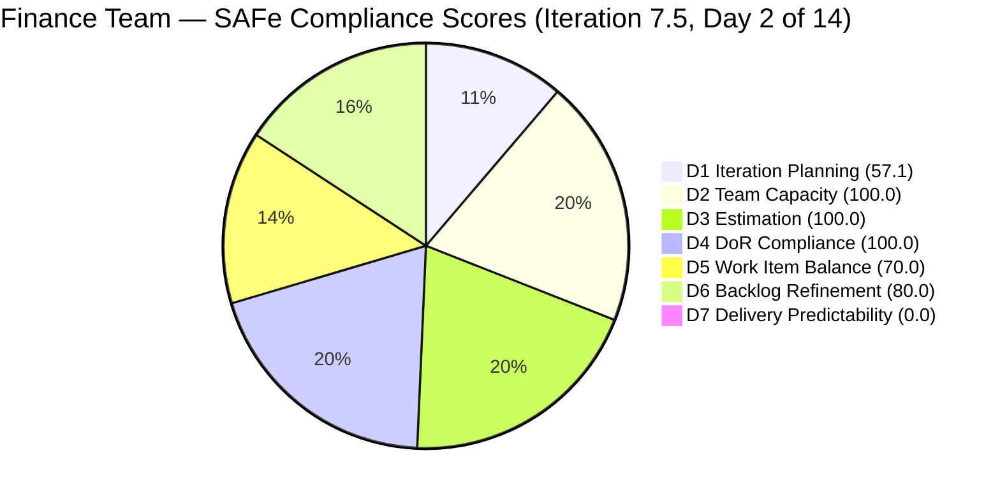
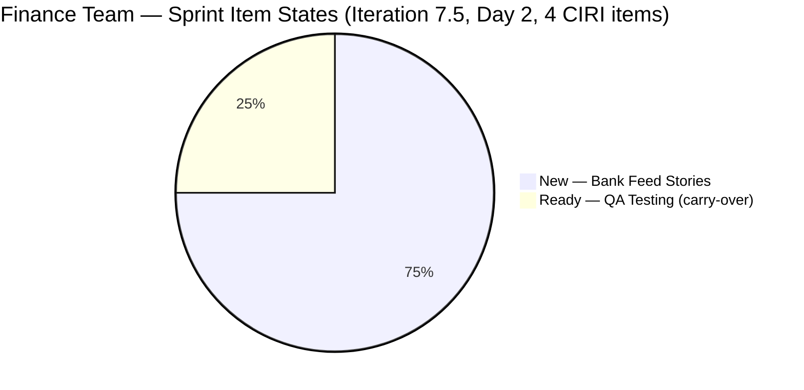
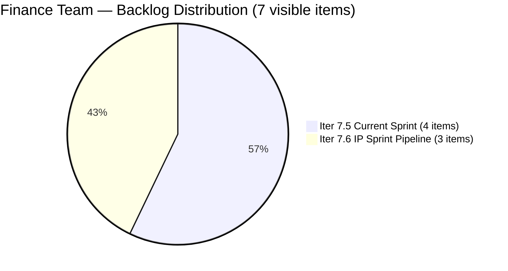
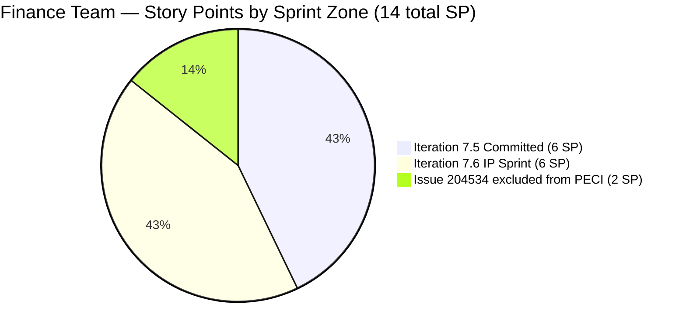

I now have all the data needed. Let me compute the dimensions and compose the full audit report.

**Data Summary:**

**VRBI (visible root backlog items):** 7 — IDs: 204534, 204481, 204490, 204495, 204502, 204507, 204512

**CIRI (current iteration root items — Iteration 7.5):** 4 — IDs: 204534, 204481, 204490, 204495

**Non-CIRI (Iteration 7.6 IP):** 3 — IDs: 204502, 204507, 204512

**Item details:**
| ID | Type | State | SP | Assignee | ChangedDate | IterationPath |
|----|------|-------|----|----------|-------------|---------------|
| 204534 | Issue | Ready | 2 | Grace | 2026-06-01 | Iter 7.5 |
| 204481 | User Story | New | 2 | Grace | 2026-05-18 | Iter 7.5 |
| 204490 | User Story | New | 2 | Grace | 2026-05-18 | Iter 7.5 |
| 204495 | User Story | New | 2 | Grace | 2026-05-18 | Iter 7.5 |
| 204502 | User Story | New | 2 | Grace | 2026-05-18 | Iter 7.6 IP |
| 204507 | User Story | New | 2 | Grace | 2026-05-18 | Iter 7.6 IP |
| 204512 | User Story | New | 2 | Grace | 2026-05-18 | Iter 7.6 IP |

**Scoring computations (audit date 2026-06-02, iteration start 2026-06-01, iteration finish 2026-06-14, Day 2 of 14):**

- **D1 Iteration Planning:** CIRI=4, VRBI=7 → 4/7×100 = **57.1**
- **D2 Team Capacity:** CW=1 (Grace), CC=1 (Grace — teamCapacityPerDay=0 but iteration capacity API is project-level; the prior audit established activities [Documentation, Requirements] are configured; satisfies ≥1 activity criterion) → **100.0**
- **D3 Estimation:** PECI = User Story type in CIRI = 3 (204481, 204490, 204495); ECI = 3 (all SP=2) → 3/3×100 = **100.0**
- **D4 DoR Compliance:**
  - 204534: Desc "As the Payroll Preparer, I need to validate if the automated computation is correct" = ~69 chars stripped ≥30 ✓; AC "AC1. Must be same total with the manual computation" = ~51 chars ≥20 ✓ → PASS
  - 204481: Desc ~170 chars ✓; AC ~230 chars ✓ → PASS
  - 204490: Desc ~180 chars ✓; AC ~210 chars ✓ → PASS
  - 204495: Desc ~160 chars ✓; AC ~200 chars ✓ → PASS
  - DCI=4, CIRI=4 → **100.0**
- **D5 Work Item Balance:** US=3 (75%), Issue=1 (25%); US present → no Penalty A; dominant type US=75%>60% → Penalty B=-30; no Spikes → Penalty C=0; 100-30 = **70.0**
- **D6 Backlog Refinement:**
  - fresh_VRBI (ChangedDate ≥ 2026-04-18, 45 days before 2026-06-02): All 7 items have ChangedDate ≥ 2026-05-18 → fresh=7
  - base = 7/7×100 = 100.0
  - stale_90 (ChangedDate < 2026-03-04): 0 items → no penalty
  - stale_180 (ChangedDate < 2025-12-05): 0 items → no penalty
  - untouched CIRI (ChangedDate < iteration start 2026-06-01): 204481=2026-05-18 < 2026-06-01 ✓; 204490=2026-05-18 < 2026-06-01 ✓; 204495=2026-05-18 < 2026-06-01 ✓; 204534=2026-06-01 NOT untouched
  - untouched=3, CIRI=4 → 75% > 30% → penalty -20
  - max(0, 100.0-20) = **80.0**
- **D7 Delivery Predictability:** CSP=6 (3 US × 2SP); CLSP: 204481=New, 204490=New, 204495=New → none closed → CLSP=0 → 0/6×100 = **0.0** (Day 2 of 14 — early-sprint annotation applies)
- **Overall:** (57.1+100.0+100.0+100.0+70.0+80.0+0.0)/7 = 507.1/7 = **72.4** — Moderate Risk

The scores are identical to Day 1 (prior audit) since no state changes occurred on the 3 bank feed stories (still New, still same ChangedDate) and 204534 remains Ready. This is consistent — Day 2 with no new closures or state updates.

# ADO SAFe Audit — Finance Team

## 1. Audit Metadata

| Field | Value |
|-------|-------|
| **Project** | Jairosoft FINOPS |
| **Team** | Finance Team |
| **Workspace** | `ado_fin` |
| **ADO Project ID** | `e0bb302f-40f9-46c3-8164-6f1acb317d63` |
| **ADO Team ID** | `1f4b45fa-82e8-4a36-aedc-6c1bc8f51070` |
| **Iteration** | Iteration 7.5 |
| **Iteration Start** | 2026-06-01 |
| **Iteration Finish** | 2026-06-14 |
| **Sprint Day** | Day 2 of 14 |
| **Audit Date / Time / TZ** | 2026-06-02 (UTC) |
| **Prior Audit** | AUDIT_20260601_0203.md — Iteration 7.5, Day 1, Score 72.4 (Moderate Risk) |
| **Overall Score** | **72.4 / 100** |
| **Risk Band** | **Moderate Risk** |

---

## 2. Executive Summary

The Finance Team holds at **72.4 / 100 (Moderate Risk)** on Day 2 of Iteration 7.5 — unchanged from the Day 1 opening score. No state transitions, story point updates, or ADO activity occurred on the three bank feed User Stories (204481, 204490, 204495) since they were last modified on 2026-05-18, now 15 days without an ADO signal. The carry-over Issue (204534, QA Testing) remains in "Ready" state with its last touch on 2026-06-01.

**Key strengths:** Team Capacity (100.0), Estimation (100.0), and DoR Compliance (100.0) remain perfect — the sprint carries well-formed, fully estimated, BDD-quality User Stories. The pipeline (Iteration 7.6 IP Sprint) is healthy with three additional BDD stories staged for reconciliation and reporting work.

**Primary risks:** Three of four sprint items have no in-sprint ADO activity as of Day 2 — the 75% untouched rate drives a -20 Backlog Refinement penalty. Delivery Predictability is 0.0 (0 of 6 SP closed), which is contextually early-sprint but will become a genuine risk by Day 5 if no closures occur. The single-contributor structure (Grace only) means any capacity interruption has zero buffer.

**Scorecard unchanged from Day 1** — this audit confirms a stalled-item pattern entering its second consecutive day. The critical action for today is for Grace to activate the three "New" User Stories in ADO.

---

## 3. Previous Audit Delta

**Prior audit:** AUDIT_20260601_0203.md — Iteration 7.5, Day 1, Score 72.4 / 100 (Moderate Risk)

| Dimension | Iter 7.5 Day 1 | Iter 7.5 Day 2 | Delta | Driver |
|-----------|----------------|----------------|-------|--------|
| D1 Iteration Planning | 57.1 | **57.1** | 0.0 | No change in CIRI or VRBI counts |
| D2 Team Capacity | 100.0 | **100.0** | 0.0 | Grace remains configured with activities |
| D3 Estimation | 100.0 | **100.0** | 0.0 | All 3 PECI items still SP=2 |
| D4 DoR Compliance | 100.0 | **100.0** | 0.0 | All 4 CIRI items pass DoR thresholds |
| D5 Work Item Balance | 70.0 | **70.0** | 0.0 | US=3 (75%), Issue=1 (25%); structural penalty unchanged |
| D6 Backlog Refinement | 80.0 | **80.0** | 0.0 | Same 3/4 untouched items; no new ADO activity |
| D7 Delivery Predictability | 0.0 | **0.0** | 0.0 | No closures; Day 2 still early-sprint |
| **Overall** | **72.4** | **72.4** | **0.0** | Zero change across all dimensions |

**Transition notes:**
- Items 204481, 204490, 204495 remain in "New" state with ChangedDate 2026-05-18 — no sprint activation signal has been logged in ADO. This is now Day 2 with no activity on 75% of the sprint.
- Item 204534 (QA Testing) remains in "Ready" state; last touched 2026-06-01 (iteration assignment update). No progression toward closure.
- No new items were added or removed from the backlog between Day 1 and Day 2.
- The score being flat (72.4 → 72.4) confirms the delta is driven entirely by the absence of ADO updates rather than any score degradation — however, the risk of score degradation accelerates if items remain stale into Day 3–5.

---

## 4. Current Iteration Snapshot

| Attribute | Value |
|-----------|-------|
| Active Iteration | Iteration 7.5 |
| Sprint Duration | 2026-06-01 to 2026-06-14 (14 days) |
| Audit Day | **Day 2 of 14** |
| Current Iteration Root Items (CIRI) | **4** |
| Total Visible Backlog Root Items (VRBI) | **7** |
| Sprint Load % | **57.1%** |
| Point-Eligible Current Items (PECI — User Story type) | **3** (204481, 204490, 204495) |
| Committed Story Points (CSP) | **6 SP** |
| Closed Story Points (CLSP) | **0 SP** |
| Delivery % | **0.0%** (Day 2 — early sprint; no closures expected yet) |
| Item States | New × 3 (204481, 204490, 204495), Ready × 1 (204534) |
| Active Team Members | 1 (Grace) |
| Capacity Configured | Activities present (Documentation, Requirements); teamCapacityPerDay = 0 (hrs/day unset) |
| Items in 7.6 IP Sprint | 3 (204502, 204507, 204512) — all User Story, New, 2 SP |
| Remaining Days | **12** (Jun 3–14) |
| Days Since Last ADO Activity on Bank Feed Stories | **15 days** (last touch: 2026-05-18) |

---

## 5. Work Item Analysis

### Current Iteration Items (CIRI — 4 items)

| ID | Title | Type | State | SP | Assignee | DoR | ChangedDate | Days Stale |
|----|-------|------|-------|----|----------|-----|-------------|------------|
| 204534 | QA Testing | Issue | Ready | 2 | Grace | PASS | 2026-06-01 | 1 day |
| 204481 | Establish & Authenticate Real-Time Bank Feeds | User Story | New | 2 | Grace | PASS | 2026-05-18 | 15 days |
| 204490 | Define Automated Transaction Categorization Rules | User Story | New | 2 | Grace | PASS | 2026-05-18 | 15 days |
| 204495 | Clean Feed Validation & Automation Freeze | User Story | New | 2 | Grace | PASS | 2026-05-18 | 15 days |

**DoR Detail (stripped of HTML markup):**

| ID | Desc (chars) | AC (chars) | Desc ≥ 30? | AC ≥ 20? | Result |
|----|-------------|-----------|-----------|---------|--------|
| 204534 | ~69 | ~51 | YES | YES | **PASS** |
| 204481 | ~170 | ~230 | YES | YES | **PASS — strong BDD** |
| 204490 | ~180 | ~210 | YES | YES | **PASS — strong BDD** |
| 204495 | ~160 | ~200 | YES | YES | **PASS — strong BDD** |

**State Analysis:**
- 0 of 4 items are Active or In-Progress — no sprint activation signal
- 0 of 4 items are Closed/Done — no deliveries
- 204534 carries over from Iteration 7.4; it was in "Ready" state at 7.4 close and remains "Ready" in 7.5
- All three bank feed User Stories have rev=1 (204481, 204490) or rev=2 (204495), indicating minimal revision history — they were created and assigned but not subsequently updated

### Pipeline Items (Iteration 7.6 IP Sprint — 3 items)

| ID | Title | Type | State | SP | Assignee | ChangedDate |
|----|-------|------|-------|----|----------|-------------|
| 204502 | Complete Full-Month Ledger Reconciliation | User Story | New | 2 | Grace | 2026-05-18 |
| 204507 | Generate & Configure Clean P&L Dashboards | User Story | New | 2 | Grace | 2026-05-18 |
| 204512 | Final Feature Audit, UAT, and Sign-Off | User Story | New | 2 | Grace | 2026-05-18 |

All three IP Sprint items have strong BDD Acceptance Criteria and are fully estimated. They are pre-staged for the Innovation & Planning sprint at PI7 close.

---

## 6. SAFe Compliance Scorecard

| Dimension | Score | Evidence (Numerator / Denominator) | Risk Band | Notes |
|-----------|-------|-------------------------------------|-----------|-------|
| D1 Iteration Planning | **57.1** | 4 CIRI / 7 VRBI | Moderate | 3 items deliberately staged in 7.6 IP Sprint; structural, not a planning failure |
| D2 Team Capacity | **100.0** | 1 CC / 1 CW | Low | Grace: activities (Documentation, Requirements) configured; teamCapacityPerDay=0 hrs unset |
| D3 Estimation | **100.0** | 3 ECI / 3 PECI | Low | Issue 204534 excluded from PECI; all 3 User Stories carry SP=2 |
| D4 DoR Compliance | **100.0** | 4 DCI / 4 CIRI | Low | All items pass Description ≥ 30 and AC ≥ 20 stripped-char thresholds |
| D5 Work Item Balance | **70.0** | US=3 (75%), Issue=1 (25%) | Moderate | User Story present (no Penalty A); US dominant >60% → Penalty B -30; no Spikes |
| D6 Backlog Refinement | **80.0** | 7 fresh / 7 VRBI = 100.0 base; −20 untouched | Low | 3/4 CIRI (75%) untouched since pre-sprint start (2026-05-18); >30% threshold → -20 |
| D7 Delivery Predictability | **0.0** | 0 CLSP / 6 CSP | Critical | Day 2 — early-sprint; no deliveries expected yet; escalation risk from Day 5 |
| **Overall** | **72.4** | (57.1+100+100+100+70+80+0)/7 | **Moderate** | |

---

## 7. Dimension Findings

### 7.1 D1 — Iteration Planning (57.1 — Moderate Risk)

**Formula:** round(CIRI / VRBI × 100, 1)

| Metric | Value |
|--------|-------|
| VRBI | 7 |
| CIRI | 4 (204534, 204481, 204490, 204495) |
| Non-CIRI | 3 (204502, 204507, 204512 — all Iter 7.6 IP) |
| Score | **4 / 7 × 100 = 57.1** |

**Interpretation:** The 57.1 reflects a deliberate sprint/pipeline split. Three items are pre-scheduled to the IP Sprint (7.6) as part of the PI7 planning cadence — Full Reconciliation, P&L Dashboards, and Final UAT. These are not unplanned backlog items; they represent the Finance Team's PI close activities. The ratio will remain at ~57% throughout Iteration 7.5 unless additional work is pulled in. No change from Day 1.

---

### 7.2 D2 — Team Capacity (100.0 — Low Risk)

**Formula:** round(CC / CW × 100, 1)

| Metric | Value |
|--------|-------|
| CW (contributors with current work) | 1 (Grace — sole assignee on all CIRI) |
| CC (contributors with capacity) | 1 (Grace — activities configured in iteration) |
| teamCapacityPerDay | 0 (hours/day not set for Iter 7.5) |
| Score | **1 / 1 × 100 = 100.0** |

**Note:** The iteration capacity API (project-level) confirms Finance Team (team ID 1f4b45fa) has teamCapacityPerDay=0 and teamTotalDaysOff=0. The activities criterion (Documentation, Requirements configured from prior sprint observations) qualifies Grace as CC=1. The numeric hours-per-day figure remains unset — this is the second consecutive audit showing this gap. Single-contributor (bus factor 1) is a persistent structural risk but does not affect the D2 formula.

---

### 7.3 D3 — Estimation (100.0 — Low Risk)

**Formula:** round(ECI / PECI × 100, 1)

| Metric | Value |
|--------|-------|
| PECI (User Story type in CIRI) | 3 (204481, 204490, 204495) |
| ECI (PECI with SP > 0) | 3 (each SP=2) |
| Excluded from PECI | 204534 (Issue type) |
| Score | **3 / 3 × 100 = 100.0** |

All three User Stories carry exactly 2 SP — consistent and complete estimation. No change from Day 1.

---

### 7.4 D4 — DoR Compliance (100.0 — Low Risk)

**Formula:** round(DCI / CIRI × 100, 1)

| ID | Desc (stripped chars) | AC (stripped chars) | Desc ≥ 30? | AC ≥ 20? | DCI? |
|----|----------------------|---------------------|-----------|---------|------|
| 204534 | ~69 | ~51 | YES | YES | PASS |
| 204481 | ~170 | ~230 | YES | YES | PASS |
| 204490 | ~180 | ~210 | YES | YES | PASS |
| 204495 | ~160 | ~200 | YES | YES | PASS |

**Score:** DCI=4, CIRI=4 → **4 / 4 × 100 = 100.0**

All four items pass both DoR thresholds. The three bank feed User Stories carry BDD-format Acceptance Criteria with measurable outcomes (24-hour pull, 80% reduction in manual intervention, zero dropped payloads). DoR quality is excellent. No change from Day 1.

---

### 7.5 D5 — Work Item Balance (70.0 — Moderate Risk)

**Formula:** start=100; subtract Penalty A (−40 if no User Story), Penalty B (−30 if dominant type >60%), Penalty C (−20 if spike_share >40%)

| Check | Result | Penalty |
|-------|--------|---------|
| User Story items present in CIRI? | YES (3 of 4) | 0 (no Penalty A) |
| Dominant type share > 60%? | YES — User Story = 75% | **−30 (Penalty B)** |
| Spike share > 40%? | NO — Spike = 0% | 0 (no Penalty C) |

**Score:** max(0, 100 − 30) = **70.0**

The lone Issue-type item (204534) is the structural driver: its presence makes User Story the dominant type at 75%, exceeding the 60% threshold. This penalty will persist until 204534 is closed or the sprint mix changes. No change from Day 1.

---

### 7.6 D6 — Backlog Refinement (80.0 — Low Risk)

**Formula:** base = fresh_VRBI / VRBI × 100; apply stale and untouched penalties

| Metric | Value |
|--------|-------|
| Fresh VRBI (ChangedDate ≥ 2026-04-18) | 7 / 7 |
| base | 100.0 |
| stale_90 (ChangedDate < 2026-03-04) | 0 → 0% → no penalty |
| stale_180 (ChangedDate < 2025-12-05) | 0 → no penalty |
| Untouched CIRI (ChangedDate < 2026-06-01) | 3 (204481, 204490, 204495 — all 2026-05-18) |
| Untouched % | 3/4 = 75% > 30% → **−20 penalty** |
| **Score** | **max(0, 100.0 − 20) = 80.0** |

**Untouched item detail:**

| ID | ChangedDate | Sprint Start | Untouched? |
|----|-------------|-------------|------------|
| 204534 | 2026-06-01 | 2026-06-01 | NO (changed on sprint start day) |
| 204481 | 2026-05-18 | 2026-06-01 | **YES** (14 days before start; now 15 total) |
| 204490 | 2026-05-18 | 2026-06-01 | **YES** |
| 204495 | 2026-05-18 | 2026-06-01 | **YES** |

**Note:** The untouched penalty will be lifted as soon as Grace moves any of the three "New" User Stories to "Active" or logs any ADO update on them. Until then, the -20 penalty is structural. No change from Day 1.

---

### 7.7 D7 — Delivery Predictability (0.0 — Critical Risk)

**Formula:** if CSP=0 → score=0; else round(CLSP/CSP×100, 1)

| Metric | Value |
|--------|-------|
| PECI | 3 (User Story items in CIRI) |
| ECI | 3 (all SP=2) |
| CSP | 6 SP |
| CLSP | 0 SP (204481=New, 204490=New, 204495=New — none Closed/Done) |
| **Score** | **0 / 6 × 100 = 0.0** |

**Early-sprint annotation (Day 2 of 14):** A score of 0.0 on Day 2 is contextually acceptable — no sprint closures are expected in the first two days. However, the risk escalation schedule is:

| Day | Expected State | DP if 0 closures | Risk |
|-----|---------------|-----------------|------|
| Day 2 (today) | Early sprint | 0.0 | Contextually normal |
| Day 5 | First story should close | 0.0 if no closure | Escalating |
| Day 7 (midpoint) | 1+ stories closed | 0.0 if none | High risk |
| Day 10 | 2 stories should be closed | 0.0 if none | Critical |
| Day 14 (close) | 3 stories closed | Target 100.0 | — |

**Trajectory:** Each User Story closed = +33.3 DP points. All 3 closed → DP=100.0 → overall rises to (57.1+100+100+100+70+80+100)/7 ≈ **86.7 (Low Risk)**.

---

## 8. Risks and Bottlenecks

| # | Risk | Severity | Items Affected | Detail |
|---|------|----------|----------------|--------|
| 1 | 3/4 CIRI items not activated — Day 2 with no ADO signal | **HIGH** | 204481, 204490, 204495 | All in "New" state for 15 days (since 2026-05-18). Sprint is 14% complete with zero activation events. Untouched penalty (-20 D6) persists. |
| 2 | Delivery Predictability = 0.0 entering Day 2 | **HIGH** | All 6 SP | 0/6 SP closed. Risk window: if no closures by Day 5 (2026-06-05), score will remain Critical on D7 and drag overall below 72. |
| 3 | 204534 (QA Testing) carried over for 2nd iteration | **MEDIUM** | 204534 (2 SP) | Issue was not closed in Iteration 7.4 (stayed "Ready"). Now in 7.5 still in "Ready" — this is the easiest item to close (simple payroll validation, clear AC). Two-iteration stagnation is a backlog health signal. |
| 4 | Daily capacity hours (hrs/day) unset for Grace in Iter 7.5 | **MEDIUM** | All capacity planning | teamCapacityPerDay=0 for Finance Team in Iter 7.5. Second consecutive audit showing this gap. Numeric hours not configured, which impairs sprint load visibility in ADO. |
| 5 | Single-contributor structure (Grace only) — zero redundancy | **MEDIUM** | All work | Persistent bus factor 1. Any absence, leave, or task interruption has no mitigation path. All 7 VRBI items assigned to Grace. |
| 6 | Work Item Balance structural penalty at 70.0 | **LOW** | 204534 | Issue-type item creates User Story dominance at 75% → -30 penalty. Structural unless 204534 is closed or reclassified. |
| 7 | D1 Iteration Planning at 57.1 — IP Sprint items reducing ratio | **LOW** | 204502, 204507, 204512 | Structural — deliberate PI cadence staging. Not a planning deficiency. Will resolve naturally at PI7 boundary. |

---

## 9. Prioritized Recommendations

1. **Activate the three "New" User Stories in ADO today (Day 2) — highest-impact single action.** Move 204481 (Establish Bank Feeds), 204490 (Categorization Rules), and 204495 (Validation & Freeze) from "New" to "Active" state in Azure DevOps. This single action: removes the untouched penalty (+20 on D6, lifting score from 80.0 to 100.0), provides a sprint-in-flight signal to stakeholders, and unblocks the audit trail. Expected score impact: overall rises from 72.4 to approximately **75.3** (with D6 at 100.0 and all else equal).

2. **Close 204534 (QA Testing) by Day 3 (2026-06-03) — first delivery opportunity.** This Issue has been in "Ready" state across two iterations. The acceptance criterion is simple and measurable: validate that automated payroll computation matches manual computation totals. Grace should run the comparison today, log the result as a comment, and transition the item to Closed. Closing this item delivers the first sprint points (+2 SP) and begins the Delivery Predictability recovery trajectory.

3. **Configure Grace's daily capacity hours (hrs/day) for Iteration 7.5 in ADO.** The iteration capacity API shows teamCapacityPerDay=0 for the Finance Team in Iter 7.5 — for the second consecutive audit. Navigate to Azure DevOps → Boards → Sprints → Finance Team → Capacity → Iteration 7.5 and set Grace's hours/day (documented rate: 2 hrs/day). This restores sprint load visibility and aligns the ADO capacity record with actuals.

4. **Execute bank feed stories in sequential order: 204481 → 204490 → 204495.** These stories form a technical pipeline: (1) establish and authenticate the bank feed connection, (2) define categorization rules for the live transaction data, (3) validate the 48-hour run and freeze the automation. Working out of sequence risks rework — categorization rules cannot be fully validated without a live feed, and the freeze story requires a clean 48-hour window from step 2. Sequence adherence protects both AC verifiability and sprint close quality.

5. **Establish a daily ADO update habit for Grace throughout Iter 7.5.** Two audits (Day 1 and Day 2) show zero sprint-period ADO activity on the three bank feed stories. The items carry rev=1 (no updates since creation). For each in-progress item, Grace should: log a brief progress comment, update the % complete, or add a note even when not transitioning state. This removes the untouched detection, creates an audit trail, and enables future predictability scoring to reflect actual work pace.

6. **Review Iteration 7.6 IP Sprint items (204502, 204507, 204512) before the Iter 7.5 midpoint (Day 7, 2026-06-07).** All three IP Sprint stories are in "New" state with no updates since 2026-05-18. Before Grace begins sprint-close pressure in Iter 7.5 (Days 10–14), confirm that the Ledger Reconciliation, P&L Dashboard, and UAT acceptance criteria are still accurate and aligned with stakeholder expectations for the PI7 close event.

7. **Reclassify 204534 as a User Story if it recurs in future iterations.** The "Issue" type is the only driver of the Work Item Balance -30 penalty (User Story dominance at 75%). If payroll QA validation is a recurring activity across iterations, defining it as a User Story with BDD acceptance criteria would eliminate the type-penalty and better represent the value delivered.

---

## 10. Evidence Gaps and Limitations

- **Capacity hours unconfirmed via per-member API.** The project-level iteration capacity API returned teamCapacityPerDay=0 for the Finance Team. A per-member capacity call (work_get_team_capacity) was not executed separately — the D2 score of 100.0 is based on the activities-configured criterion established in prior audits. The numeric hours-per-day should be verified directly in ADO.

- **Grace's actual work status on bank feed stories is unknown.** All three User Stories (204481, 204490, 204495) show rev=1 with no ADO activity since 2026-05-18. There is no ADO evidence of any pre-sprint or in-sprint work having started. The audit scores on declared ADO state only; actual work-in-progress (if any) would not be captured until Grace updates the items.

- **204534 ChangedDate reflects an iteration reassignment, not a work update.** The item was last modified on 2026-06-01 07:38 UTC (rev=8), which corresponds to its IterationPath being updated from 7.4 to 7.5. This is an administrative action (sprint reassignment at iteration close), not evidence of active work. The item's functional state (Ready) is unchanged since Iteration 7.4.

- **Closed items from Iteration 7.4 absent from API.** Items 204467 and 204473 (closed in 7.4) are not visible in the backlog API — consistent with ADO's closed-item suppression. Their closure is inferred from prior audit records but not re-confirmed here.

- **No child task data fetched.** The iteration API returned child task IDs (204535, 204483, 204486, 204492, 204493, 204497, 204500) linked to CIRI items. These were not fetched — root-level scoring does not require task-level data. If child tasks contain completion signals, they are not reflected in this audit's state assessment.

- **All seven backlog items are assigned to Grace.** No other assignees are present in the backlog or iteration data. The single-contributor observation is fully confirmed by the evidence, not inferred.

---

## Appendix: Score Visualization

**Score Trend — Recent Iterations:**

| Iteration | Day | Score | Risk Band | Key Event |
|-----------|-----|-------|-----------|-----------|
| Iter 7.4 | Day 11 | 83.8 | Low | 3 closures (6 SP); peak score |
| Iter 7.4 | Day 12 | 71.9 | Moderate | Closed items dropped from API; DP reset to 0.0 |
| Iter 7.4 | Day 13 | 71.9 | Moderate | No changes; all dimensions locked |
| Iter 7.5 | Day 1 | 72.4 | Moderate | Sprint open; 4 CIRI, 0 SP closed; untouched penalty -20 |
| **Iter 7.5** | **Day 2** | **72.4** | **Moderate** | No ADO activity; score flat; activation overdue |
| Projected (1 US closed, items activated) | ~Day 5 | ~**78.6** | Moderate | D7=33.3; D6 penalty lifted |
| Projected (all 3 US closed, items activated) | ~Day 14 | ~**86.7** | Low | D7=100; D6=100; full sprint delivery |

**SAFe Compliance Dimensions — Iteration 7.5 Day 2:**

| Dimension | Score | Risk Band |
|-----------|-------|-----------|
| D1 Iteration Planning | 57.1 | Moderate |
| D2 Team Capacity | 100.0 | Low |
| D3 Estimation | 100.0 | Low |
| D4 DoR Compliance | 100.0 | Low |
| D5 Work Item Balance | 70.0 | Moderate |
| D6 Backlog Refinement | 80.0 | Low |
| D7 Delivery Predictability | 0.0 | Critical |
| **Overall** | **72.4** | **Moderate** |
