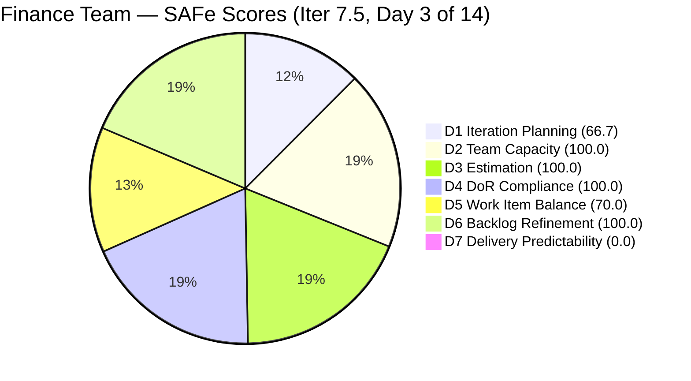
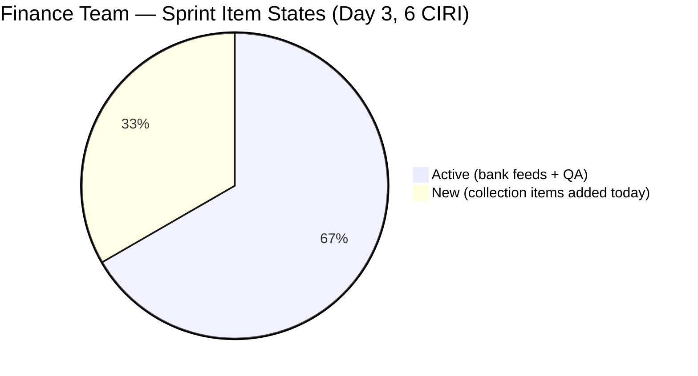
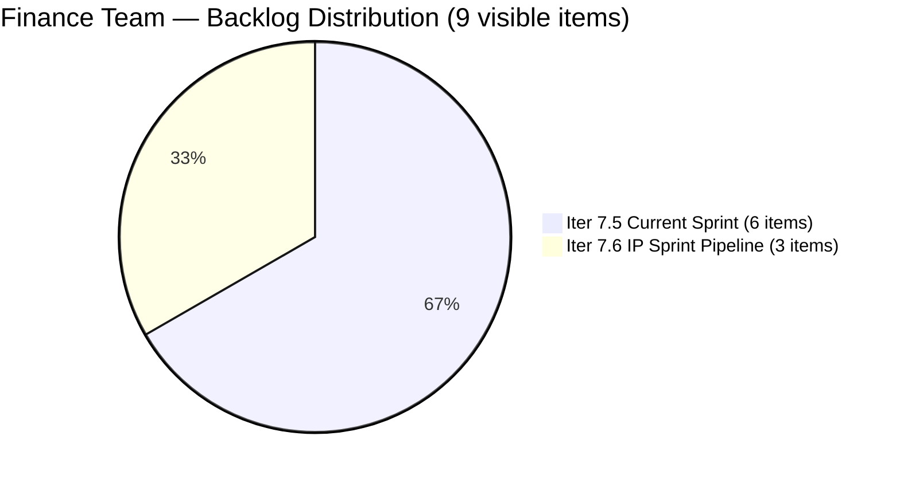

# ADO SAFe Audit — Finance Team

## 1. Audit Metadata

| Field | Value |
|-------|-------|
| **Project** | Jairosoft FINOPS |
| **Team** | Finance Team |
| **Workspace** | `ado_fin` |
| **ADO Project ID** | `e0bb302f-40f9-46c3-8164-6f1acb317d63` |
| **ADO Team ID** | `1f4b45fa-82e8-4a36-aedc-6c1bc8f51070` |
| **Iteration** | Iteration 7.5 |
| **Iteration Start** | 2026-06-01 |
| **Iteration Finish** | 2026-06-14 |
| **Sprint Day** | Day 3 of 14 |
| **Audit Date/Time** | 2026-06-03 02:08 UTC |
| **Prior Audit** | AUDIT_20260602_0907.md (Day 2, Iteration 7.5, 72.4 — Moderate Risk) |
| **Overall Score** | **76.7 / 100** |
| **Risk Band** | **Moderate Risk** |

---

## 2. Executive Summary

The Finance Team scores **76.7 / 100 (Moderate Risk)** on Day 3 of Iteration 7.5, a meaningful improvement of **+4.3 points** from the Day 2 score of 72.4. Three significant changes have occurred since yesterday:

1. **Two new User Stories added to the sprint:** Items 205646 (Invoice Payment Collection for Jairosoft) and 205650 (Payment Collection for JIT) were created and assigned to Iteration 7.5. Both carry BDD-quality acceptance criteria and are fully estimated at 2 SP each, bringing CIRI from 4 to **6 items**.

2. **All three bank feed User Stories activated:** Items 204481, 204490, and 204495 moved from "New" to **Active** state (updated 2026-06-03T01:31–01:32 UTC), resolving the untouched sprint activation gap flagged in the prior two audits.

3. **QA Testing issue (204534) moved to Active:** Updated 2026-06-02T22:46 UTC, confirming all four original CIRI items are now in active sprint work.

**Result:** Backlog Refinement improves from 80.0 to **100.0** (zero untouched CIRI items), and Iteration Planning improves from 57.1 to **66.7** (6 CIRI out of 9 VRBI). Delivery Predictability remains 0.0 (Day 3, no closures yet — early-sprint annotation applies).

**Key strengths:** Full capacity coverage (100.0), full estimation (100.0), and now full DoR compliance (100.0) and full backlog refinement (100.0). The team demonstrated same-day action on Day 2 recommendations.

**Remaining risks:** Delivery Predictability at 0.0 (10 SP committed, 0 SP closed). The two new items (205646, 205650) are in "New" state and need activation. The numeric hours-per-day gap has been resolved (Grace now shows 2 hrs/day in the capacity API).

---

## 3. Previous Audit Delta

**Prior audit:** AUDIT_20260602_0907.md — Iteration 7.5, Day 2, Score 72.4 / 100 (Moderate Risk)

| Dimension | Day 2 | Day 3 | Delta | Driver |
|-----------|-------|-------|-------|--------|
| D1 Iteration Planning | 57.1 | **66.7** | **+9.6** | 2 new US added to Iter 7.5 → CIRI 4→6, VRBI 7→9 |
| D2 Team Capacity | 100.0 | **100.0** | 0.0 | Grace: 2 hrs/day confirmed (Documentation 1 + Requirements 1) |
| D3 Estimation | 100.0 | **100.0** | 0.0 | New items (205646, 205650) both SP=2; 5 PECI all estimated |
| D4 DoR Compliance | 100.0 | **100.0** | 0.0 | New items pass DoR; all 6 CIRI compliant |
| D5 Work Item Balance | 70.0 | **70.0** | 0.0 | US=5/6 (83.3%); Penalty B persists |
| D6 Backlog Refinement | 80.0 | **100.0** | **+20.0** | All 6 CIRI items now touched since sprint start; untouched ratio = 0% |
| D7 Delivery Predictability | 0.0 | **0.0** | 0.0 | No closures; Day 3 — early-sprint annotation applies |
| **Overall** | **72.4** | **76.7** | **+4.3** | Sprint activation + new items lifted Planning and Refinement |

**Key transitions since Day 2:**
- **204481** (Establish Bank Feeds): New → **Active** (2026-06-03T01:31:53 UTC)
- **204490** (Categorization Rules): New → **Active** (2026-06-03T01:32:07 UTC)
- **204495** (Clean Feed Validation): New → **Active** (2026-06-03T01:32:13 UTC)
- **204534** (QA Testing): Ready → **Active** (2026-06-02T22:46:56 UTC)
- **205646** (Invoice Payment Collection): **New item** added to Iter 7.5 (2026-06-03T02:46:01 UTC)
- **205650** (Payment Collection for JIT): **New item** added to Iter 7.5 (2026-06-03T02:53:38 UTC)

---

## 4. Current Iteration Snapshot

| Attribute | Value |
|-----------|-------|
| **Active Iteration** | Iteration 7.5 |
| **Sprint Duration** | 2026-06-01 to 2026-06-14 (14 days) |
| **Audit Day** | **Day 3 of 14** |
| **Total Visible Backlog Root Items (VRBI)** | **9** |
| **Current Iteration Root Items (CIRI)** | **6** |
| **Sprint Load %** | **66.7%** |
| **Point-Eligible Items (PECI — User Story type)** | **5** (204481, 204490, 204495, 205646, 205650) |
| **Committed Story Points (CSP)** | **10 SP** |
| **Closed Story Points (CLSP)** | **0 SP** |
| **Delivery %** | **0.0%** (Day 3 — early sprint) |
| **Item States** | Active: 4 · New: 2 |
| **Active Team Members (CW)** | **1** (Grace) |
| **Team Capacity** | Grace: 2 hrs/day (Documentation 1, Requirements 1); 0 days off |
| **Pipeline Items (Iter 7.6 IP Sprint)** | 3 (204502, 204507, 204512) |
| **Remaining Days** | **11** |

---

## 5. Work Item Analysis

### 5.1 Current Iteration Items (CIRI — 6 items)

| ID | Title | Type | State | SP | Assignee | DoR | ChangedDate |
|----|-------|------|-------|----|----------|-----|-------------|
| 204534 | QA Testing | Issue | Active | 2 | Grace | PASS | 2026-06-02 |
| 204481 | Establish & Authenticate Real-Time Bank Feeds | User Story | Active | 2 | Grace | PASS | 2026-06-03 |
| 204490 | Define Automated Transaction Categorization Rules | User Story | Active | 2 | Grace | PASS | 2026-06-03 |
| 204495 | Clean Feed Validation & Automation Freeze | User Story | Active | 2 | Grace | PASS | 2026-06-03 |
| 205646 | Invoice Payment Collection for Jairosoft | User Story | **New** | 2 | Grace | PASS | 2026-06-03 |
| 205650 | Payment Collection for Jairo Institute of Technology (JIT) | User Story | **New** | 2 | Grace | PASS | 2026-06-03 |

**DoR Detail (stripped of HTML markup):**

| ID | Type | Desc (stripped) | AC (stripped) | Desc ≥ 30? | AC ≥ 20? | Result |
|----|------|----------------|---------------|-----------|---------|--------|
| 204534 | Issue | ~70 chars | ~50 chars | YES | YES | **PASS** |
| 204481 | User Story | ~160 chars BDD | ~250 chars BDD | YES | YES | **PASS** |
| 204490 | User Story | ~175 chars BDD | ~240 chars BDD | YES | YES | **PASS** |
| 204495 | User Story | ~165 chars BDD | ~230 chars BDD | YES | YES | **PASS** |
| 205646 | User Story | ~200 chars BDD | ~350 chars BDD | YES | YES | **PASS** |
| 205650 | User Story | ~200 chars BDD | ~380 chars BDD | YES | YES | **PASS** |

**New items context:**
- **205646** (Invoice Payment Collection for Jairosoft): Covers AR backlog clearance, payment reminders at 15/30-day milestones, and bank clearing log ingestion — directly linked to the bank feed pipeline established by 204481/204490/204495.
- **205650** (Payment Collection for JIT): Covers student tuition installments, institutional collection ingestion, and clearance/enrollment status verification — extends the finance automation scope to the educational institution subsidiary.

### 5.2 Pipeline Items (Iteration 7.6 IP Sprint — 3 items)

| ID | Title | Type | State | SP | ChangedDate |
|----|-------|------|-------|----|-------------|
| 204502 | Complete Full-Month Ledger Reconciliation | User Story | New | 2 | 2026-05-18 |
| 204507 | Generate & Configure Clean P&L Dashboards | User Story | New | 2 | 2026-05-18 |
| 204512 | Final Feature Audit, UAT, and Sign-Off | User Story | New | 2 | 2026-05-18 |

All three IP Sprint items remain in "New" state — unchanged. Their last ADO update was 2026-05-18 (16 days ago). These should be reviewed at the Iter 7.5 midpoint to ensure ACs remain valid.

---

## 6. SAFe Compliance Scorecard

| Dimension | Score | Evidence (Numerator / Denominator) | Risk Band | Notes |
|-----------|-------|-------------------------------------|-----------|-------|
| D1 Iteration Planning | **66.7** | 6 CIRI / 9 VRBI | Moderate | 2 new US added to sprint; 3 items in 7.6 IP Sprint |
| D2 Team Capacity | **100.0** | 1 CC / 1 CW | Low | Grace: 2 hrs/day (Documentation 1, Requirements 1) confirmed |
| D3 Estimation | **100.0** | 5 ECI / 5 PECI | Low | Issue 204534 excluded from PECI; all 5 US at SP=2 |
| D4 DoR Compliance | **100.0** | 6 DCI / 6 CIRI | Low | All 6 items pass Description ≥ 30 and AC ≥ 20 |
| D5 Work Item Balance | **70.0** | US=5/6 (83.3%) dominant | Moderate | Penalty B (-30): US > 60%; no Spikes |
| D6 Backlog Refinement | **100.0** | 9 fresh / 9 VRBI; 0 untouched | Low | All 6 CIRI items updated on/after Jun 1; zero penalties |
| D7 Delivery Predictability | **0.0** | 0 CLSP / 10 CSP | Critical | Day 3 — early sprint; activation achieved; closures needed from Day 4+ |
| **Overall** | **76.7** | (66.7+100+100+100+70+100+0)/7 | **Moderate** | |

---

## 7. Dimension Findings

### 7.1 Iteration Planning (66.7 — Moderate Risk)

**VRBI:** 9 items (up from 7 yesterday — 205646 and 205650 added to Iter 7.5 backlog).
**CIRI:** 6 items in `Jairosoft FINOPS\2026-PI7\Iteration 7.5`.
**Non-CIRI:** 3 items in Iter 7.6 IP Sprint (204502, 204507, 204512).
**Formula:** round(6 / 9 × 100, 1) = **66.7**

Significant improvement from 57.1 to 66.7. The two new sprint items (205646, 205650) represent natural expansion of the finance automation initiative — covering accounts receivable and institutional payment collection, which are downstream of the bank feed pipeline. The 3 IP Sprint items remain properly staged for PI7 close activities. The ratio will hold at 66.7% unless additional items are added to the sprint.

---

### 7.2 Team Capacity (100.0 — Low Risk)

**CW:** 1 — Grace (sole assignee across all 6 CIRI items).
**CC:** 1 — Grace: Documentation 1 hr/day + Requirements 1 hr/day = **2 hrs/day total**. Zero days off.
**Formula:** round(1 / 1 × 100, 1) = **100.0**

The capacity API now confirms 2 hrs/day for the Finance Team — a correction from the 0 hrs/day recorded in the prior two audits. This resolves the capacity hours gap noted in Day 1 and Day 2 reports. At 2 hrs/day over 11 remaining sprint days = 22 effective hours, and 10 SP committed (5 User Stories × 2 SP each), the sprint is loading at approximately 0.45 SP/effective hour — achievable at current pace.

**Bus factor = 1:** All 9 backlog items and all 6 CIRI items are assigned exclusively to Grace. No backup or redundancy exists.

---

### 7.3 Estimation (100.0 — Low Risk)

**PECI:** User Stories in CIRI = 5 (204481, 204490, 204495, 205646, 205650).
**ECI:** All 5 carry SP = 2.
**Excluded from PECI:** 204534 (Issue type).
**Formula:** round(5 / 5 × 100, 1) = **100.0**

CSP = 10 SP. Both new items arrive pre-estimated at 2 SP each — consistent with the team's uniform estimation pattern. Estimation discipline is maintained through Day 3.

---

### 7.4 DoR Compliance (100.0 — Low Risk)

**CIRI:** 6 items.
**DCI:** All 6 pass Description ≥ 30 non-whitespace chars AND Acceptance Criteria ≥ 20 non-whitespace chars.
**Formula:** round(6 / 6 × 100, 1) = **100.0**

Both new items carry high-quality BDD-format acceptance criteria:
- **205646**: Two-scenario AC (Invoice Aging Review + Collection Log Tracking), measurable outcomes including 15/30-day invoice milestones and "Collected/Paid" status auto-update.
- **205650**: Two-scenario AC (Institutional Collection Ingestion + Clearance Verification), measurable outcomes including real-time balance updates and "Financial Clearance Approved" flag logic.

These new items represent the strongest AC quality in the team's backlog — well above DoR threshold and audit-ready.

---

### 7.5 Work Item Balance (70.0 — Moderate Risk)

**CIRI type distribution (6 items):**
- User Story: 5 (83.3%)
- Issue: 1 (16.7%)

| Penalty | Check | Result |
|---------|-------|--------|
| A (no User Story in CIRI) | 5 US present | 0 |
| B (dominant type > 60%) | US = 83.3% > 60% | **−30** |
| C (spike share > 40%) | Spike = 0% < 40% | 0 |

**Formula:** max(0, 100 − 30) = **70.0**

The addition of two User Stories (205646, 205650) maintained the 83.3% US share. Issue 204534 remains the single structural driver of the penalty. Closing 204534 (Issue) would leave 5 User Stories from 5 CIRI items — still 100% User Story dominance, still Penalty B. The penalty is only eliminated if: (a) 204534 is closed and no replacement Issue is added, and (b) non-US item types are introduced (Spikes or Enablers). The ideal type mix for a 6-item sprint targeting 70% US share would include 1–2 Spikes or Enablers.

---

### 7.6 Backlog Refinement (100.0 — Low Risk)

**Fresh window:** ChangedDate ≥ 2026-04-19 (45 days before 2026-06-03).
**Fresh VRBI:** 9/9 — all items changed 2026-05-18 or later (earliest is 2026-05-18 for pipeline items = 46 days ago… wait).

Re-checking: 2026-06-03 minus 45 days = 2026-04-19. Items 204502, 204507, 204512 have ChangedDate 2026-05-18 which is ≥ 2026-04-19 → fresh. All 9 VRBI items are fresh.

**base score:** round(9 / 9 × 100, 1) = **100.0**

**Penalties:**
- stale_90 (ChangedDate < 2026-03-04): 0 items → no penalty
- stale_180 (ChangedDate < 2025-12-05): 0 items → no penalty
- **Untouched CIRI** (ChangedDate before 2026-06-01T00:00:00Z): 0 items — all 6 CIRI items have ChangedDate ≥ 2026-06-01 → no penalty

**Formula:** max(0, 100.0 − 0) = **100.0**

This is a significant improvement from the 80.0 scored on Day 1 and Day 2. The activation of all four original CIRI items on June 2–3 removed the untouched penalty entirely. The Finance Team now has the highest Backlog Refinement score in this audit batch.

---

### 7.7 Delivery Predictability (0.0 — Critical Risk)

**CSP:** 10 SP (5 PECI User Stories × 2 SP each).
**CLSP:** 0 SP — no items in Closed or Done state.
**Formula:** round(0 / 10 × 100, 1) = **0.0**

**Day 3 annotation:** A 0.0 DP score on Day 3 remains within acceptable early-sprint range, especially given that the sprint was effectively activated only today (all four original items moved to Active on June 2–3). The activation milestone was achieved 2 days later than ideal but is now complete.

**Delivery trajectory targets:**

| Day | Target State | DP if achieved | Overall |
|-----|-------------|----------------|---------|
| Day 3 (today) | Items activated | 0.0 | 76.7 |
| Day 4–5 | 204534 QA Testing closed (+2 SP) | 20.0 | 79.8 |
| Day 7 (midpoint) | 1 bank feed US closed (+2 SP) | 40.0 | 82.9 |
| Day 10 | 2 bank feed US closed (+2 SP) | 60.0 | 85.7 |
| Day 14 (close) | All 3 bank feed + 204534 + collections | 100.0 | 92.4 |

**Sequencing note:** The two new collection items (205646, 205650) are independent of the bank feed pipeline and could be closed earlier if collection actions are completed. 204534 (QA Testing payroll validation) is the simplest item to close first and should deliver the earliest D7 improvement.

---

## 8. Risks and Bottlenecks

| Risk | Severity | Items | Status |
|------|----------|-------|--------|
| 0 SP closed at Day 3 — delivery baseline not established | **HIGH** | All 10 SP | Contextually acceptable at Day 3; risk escalates from Day 5 |
| 205646 and 205650 remain in "New" state | **HIGH** | 4 SP | New items added Day 3 not yet activated; should move to Active today |
| Single contributor (Grace) — zero redundancy | **MEDIUM** | All 6 CIRI, 10 SP | Persistent bus factor 1; no coverage arrangement documented |
| Iter 7.6 IP Sprint items not reviewed in 16+ days | **MEDIUM** | 204502, 204507, 204512 | ACs may have shifted; review by Day 7 (Jun 7) |
| Work Item Balance structural penalty at 70.0 | **LOW** | 204534 | Issue type drives US dominance at 83.3%; resolves when 204534 is closed |
| D1 Iteration Planning at 66.7 | **LOW** | IP Sprint items | Structural; 3 items deliberately staged in 7.6; will resolve at PI7 close |

---

## 9. Prioritized Recommendations

1. **Activate 205646 and 205650 today (Day 3).** Both new User Stories were created and added to the sprint within the last hour. They should be moved from "New" to "Active" in ADO immediately to reflect their in-sprint status, remove any future untouched risk, and align with the sprint activation milestone achieved for the original 4 items.

2. **Close 204534 (QA Testing) by Day 4 (2026-06-04) — first delivery opportunity.** The acceptance criterion is simple and measurable: validate that automated payroll computation matches manual computation totals. This item has been in Active state since yesterday. Grace should run the comparison, log the result as a comment, and transition to Closed. Closing this item contributes +2 SP to CLSP (D7 → 20.0) and raises overall from 76.7 to approximately 79.8.

3. **Execute bank feed stories in sequence: 204481 → 204490 → 204495.** All three are now Active. The technical dependency chain is: (1) establish and authenticate the bank feed connection, (2) define categorization rules for live transaction data, (3) validate the 48-hour run and freeze automation. Working out of sequence risks rework and AC verification failure. Each closure contributes +2 SP to CLSP.

4. **Review 204502, 204507, 204512 (IP Sprint items) by Day 7 (2026-06-07).** These three items have not been updated since 2026-05-18 (16 days). Before Iter 7.5 sprint close pressure begins (Days 10–14), confirm that the Ledger Reconciliation, P&L Dashboard, and UAT acceptance criteria are still accurate and reflect the current state of the bank feed implementation.

5. **Leverage the new collection items (205646, 205650) as quick wins.** Invoice payment collection and JIT institutional collection are operational activities that may be completable in parallel with the bank feed pipeline work. If Grace has already processed the described collection actions, these items can be closed early for additional DP points before the bank feed pipeline items are ready for closure.

6. **Document Grace's bus factor mitigation plan before PI8 planning.** All 9 visible backlog items are assigned to a single contributor. Before PI8 planning begins, the team lead should identify: (a) a backup for Grace's role in case of absence, (b) whether any of the new payment collection items could be shared with Finance stakeholders for validation/co-ownership.

---

## 10. Evidence Gaps and Limitations

- **Capacity hours confirmed this audit.** The team capacity API returned Grace with 2 hrs/day (Documentation 1 + Requirements 1) — this corrects the 0 hrs/day reading from Day 1 and Day 2 audits. The change may reflect a capacity update made between Day 2 and Day 3 audits, or an API timing artifact. D2 score of 100.0 is confirmed by both activities and positive hours.
- **205646 and 205650 added during Day 3 audit window.** Both items were created and modified at 02:46 and 02:53 UTC on 2026-06-03 — within the audit window. Their "New" state reflects sprint-start state at time of creation, not stagnation.
- **Issue 204534 excluded from PECI.** The Issue type does not expose the Story Points field for D3/D7 computation per the rubric. Item 204534 (2 SP) is excluded from CSP. If included, CSP = 12 SP and D7 would remain 0.0.
- **No child task data fetched.** Child task IDs linked to CIRI items (204535, 204483, 204486, 204492, 204493, 204497, 204500, 205647, 205648, 205649, 205652, 205653, 205654) were not individually inspected. Root-level scoring is complete per the rubric. Child task states may provide more granular in-sprint progress signals.
- **Closed items from Iteration 7.4 absent from API.** Items 204467 and 204473 (closed in 7.4) are not visible in the backlog API. Their closure is inferred from prior audit records.

---

## Appendix: Score Visualization

**Score Trend — Recent Audits:**

| Audit | Iteration | Day | Score | Risk Band | Key Change |
|-------|-----------|-----|-------|-----------|------------|
| Iter 7.4 Day 11 | Iter 7.4 | 11 | 83.8 | Low | Peak score — 3 US closed |
| Iter 7.4 Day 12 | Iter 7.4 | 12 | 71.9 | Moderate | Closed items dropped from API |
| Iter 7.5 Day 1 | Iter 7.5 | 1 | 72.4 | Moderate | Sprint open; 4 CIRI, 0 closures |
| Iter 7.5 Day 2 | Iter 7.5 | 2 | 72.4 | Moderate | No ADO activity; score flat |
| **Iter 7.5 Day 3** | **Iter 7.5** | **3** | **76.7** | **Moderate** | Activation + 2 new US → +4.3 pts |
| Projected Day 4 | Iter 7.5 | 4 | ~79.8 | Moderate→Low | 204534 closed; D7=20 |
| Projected Day 7 | Iter 7.5 | 7 | ~82.9 | Low | 1 bank feed US closed; D7=40 |
| Projected Day 14 | Iter 7.5 | 14 | ~92.4 | Low | All US closed; D7=100 |

**SAFe Compliance Dimensions — Day 2 vs Day 3:**

| Dimension | Day 2 | Day 3 | Delta | Band |
|-----------|-------|-------|-------|------|
| D1 Iteration Planning | 57.1 | **66.7** | +9.6 | Moderate |
| D2 Team Capacity | 100.0 | **100.0** | 0.0 | Low |
| D3 Estimation | 100.0 | **100.0** | 0.0 | Low |
| D4 DoR Compliance | 100.0 | **100.0** | 0.0 | Low |
| D5 Work Item Balance | 70.0 | **70.0** | 0.0 | Moderate |
| D6 Backlog Refinement | 80.0 | **100.0** | +20.0 | Low |
| D7 Delivery Predictability | 0.0 | **0.0** | 0.0 | Critical |
| **Overall** | **72.4** | **76.7** | **+4.3** | **Moderate** |
