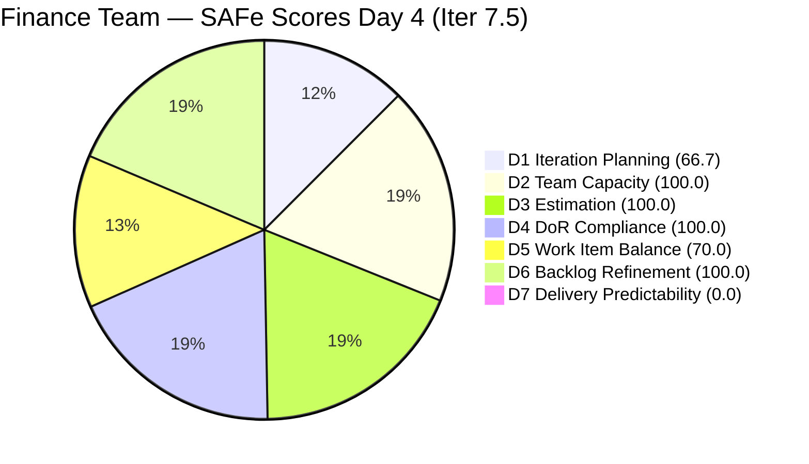
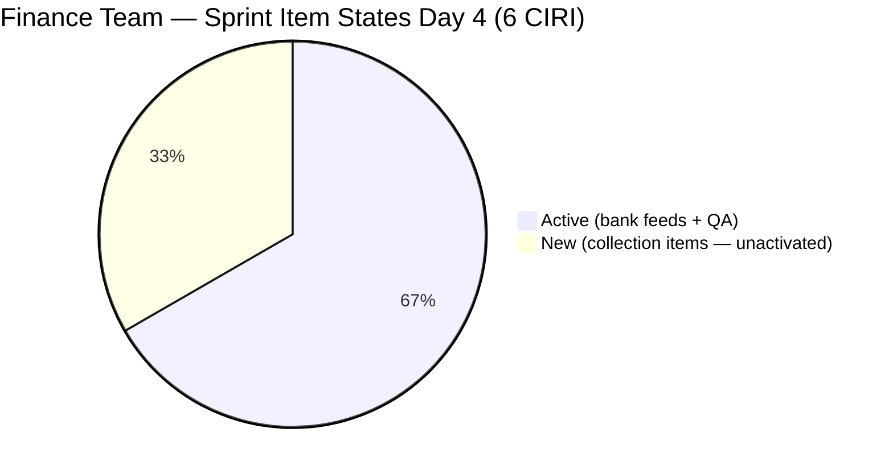
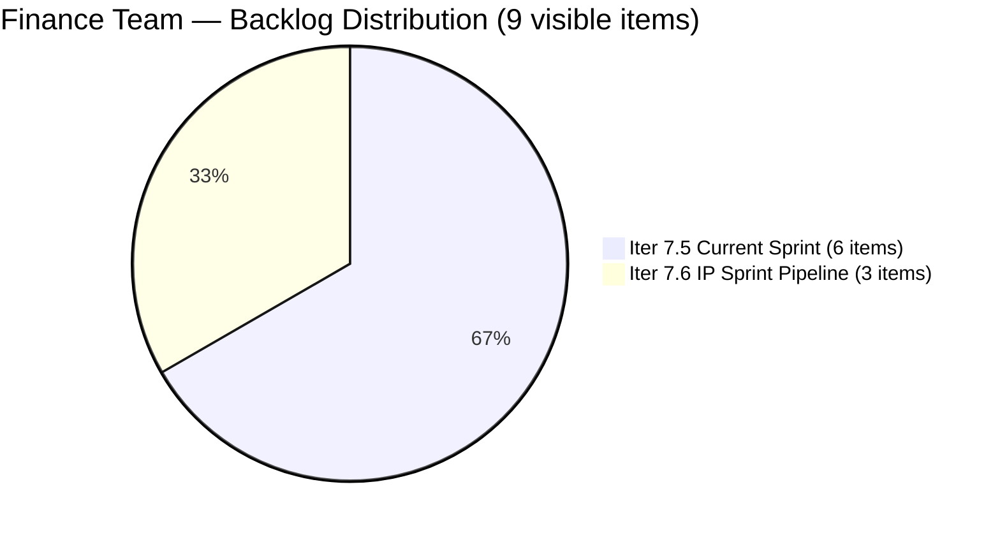

# ADO SAFe Audit — Finance Team

## 1. Audit Metadata

| Field | Value |
|-------|-------|
| **Project** | Jairosoft FINOPS |
| **Team** | Finance Team |
| **Workspace** | `ado_fin` |
| **ADO Project ID** | `e0bb302f-40f9-46c3-8164-6f1acb317d63` |
| **ADO Team ID** | `1f4b45fa-82e8-4a36-aedc-6c1bc8f51070` |
| **Iteration** | Iteration 7.5 |
| **Iteration Start** | 2026-06-01 |
| **Iteration Finish** | 2026-06-14 |
| **Sprint Day** | Day 4 of 14 |
| **Audit Date** | 2026-06-04 UTC |
| **Prior Audit** | AUDIT_20260603_0208.md (Day 3, Iteration 7.5, 76.7 — Moderate Risk) |
| **Overall Score** | **76.7 / 100** |
| **Risk Band** | **Moderate Risk** |

---

## 2. Executive Summary

The Finance Team holds at **76.7 / 100 (Moderate Risk)** on Day 4 of Iteration 7.5, unchanged from Day 3. No new work items have been added, no state transitions occurred, and no closures have been recorded. The sprint structure is identical to the Day 3 snapshot: 6 CIRI items (4 Active, 2 New), 9 VRBI items, and 10 CSP with 0 CLSP.

**Key strengths:** Team Capacity (100.0), Estimation (100.0), DoR Compliance (100.0), and Backlog Refinement (100.0) all sustained from Day 3. The sprint is fully activated for the bank feed pipeline (204481, 204490, 204495) and the QA Testing item (204534). Acceptance criteria quality remains among the highest in the portfolio.

**Immediate action required:** Items 205646 (Invoice Payment Collection) and 205650 (Payment Collection for JIT) remain in "New" state for the second consecutive day, despite being added to the sprint on June 3. These items should be moved to Active immediately. Additionally, closing 204534 (QA Testing) — identified as the Day 4 delivery target in the prior audit — would raise D7 from 0.0 to 20.0 and lift the overall score toward the Low Risk threshold.

**Bus factor = 1:** Grace is the sole contributor on all 6 CIRI items and all 9 visible backlog items.

---

## 3. Previous Audit Delta

**Prior audit:** AUDIT_20260603_0208.md — Iteration 7.5, Day 3, Score 76.7 / 100 (Moderate Risk)

| Dimension | Day 3 | Day 4 | Delta | Driver |
|-----------|-------|-------|-------|--------|
| D1 Iteration Planning | 66.7 | **66.7** | 0.0 | No new items; VRBI and CIRI unchanged at 9 and 6 |
| D2 Team Capacity | 100.0 | **100.0** | 0.0 | Grace: 2 hrs/day (Documentation 1, Requirements 1) |
| D3 Estimation | 100.0 | **100.0** | 0.0 | All 5 PECI items at SP=2; no changes |
| D4 DoR Compliance | 100.0 | **100.0** | 0.0 | All 6 CIRI items still DoR-compliant |
| D5 Work Item Balance | 70.0 | **70.0** | 0.0 | US = 5/6 (83.3%); Issue 204534 prevents type diversification |
| D6 Backlog Refinement | 100.0 | **100.0** | 0.0 | All 9 VRBI fresh; all CIRI touched since sprint start |
| D7 Delivery Predictability | 0.0 | **0.0** | 0.0 | No closures; 205646 and 205650 still in New state |
| **Overall** | **76.7** | **76.7** | **0.0** | Fully static sprint — no ADO activity since Day 3 |

**Observation:** The sprint has been static since 2026-06-03T02:53 UTC (when 205650 was last updated). No state changes, no new items, and no closures were recorded between the Day 3 and Day 4 audits. The strong fundamentals (D2–D6) are sustained, but the 0.0 D7 is the primary drag on the overall score and will become increasingly material as the sprint progresses past Day 5.

---

## 4. Current Iteration Snapshot

| Attribute | Value |
|-----------|-------|
| **Active Iteration** | Iteration 7.5 |
| **Sprint Duration** | 2026-06-01 to 2026-06-14 (14 days) |
| **Audit Day** | **Day 4 of 14** |
| **Total Visible Backlog Root Items (VRBI)** | **9** |
| **Current Iteration Root Items (CIRI)** | **6** |
| **Sprint Load %** | **66.7%** |
| **Point-Eligible Items (PECI — User Story type)** | **5** (204481, 204490, 204495, 205646, 205650) |
| **Committed Story Points (CSP)** | **10 SP** (5 US × 2 SP each) |
| **Closed Story Points (CLSP)** | **0 SP** |
| **Delivery %** | **0.0%** |
| **Item States** | Active: 4 · New: 2 |
| **Active Team Members (CW)** | **1** (Grace) |
| **Team Capacity** | 2 hrs/day (Documentation 1, Requirements 1); 0 days off |
| **Pipeline Items (Iter 7.6 IP Sprint)** | 3 (204502, 204507, 204512) |
| **Days Elapsed** | 4 of 14 (28.6%) |
| **Remaining Days** | 10 |

---

## 5. Work Item Analysis

### 5.1 Current Iteration Items (CIRI — 6 items)

| ID | Title | Type | State | SP | Assignee | DoR | ChangedDate |
|----|-------|------|-------|----|----------|-----|-------------|
| 204534 | QA Testing | Issue | Active | 2 | Grace | PASS | 2026-06-02 |
| 204481 | Establish & Authenticate Real-Time Bank Feeds | User Story | Active | 2 | Grace | PASS | 2026-06-03 |
| 204490 | Define Automated Transaction Categorization Rules | User Story | Active | 2 | Grace | PASS | 2026-06-03 |
| 204495 | Clean Feed Validation & Automation Freeze | User Story | Active | 2 | Grace | PASS | 2026-06-03 |
| 205646 | Invoice Payment Collection for Jairosoft | User Story | **New** | 2 | Grace | PASS | 2026-06-03 |
| 205650 | Payment Collection for Jairo Institute of Technology (JIT) | User Story | **New** | 2 | Grace | PASS | 2026-06-03 |

**Note:** 205646 and 205650 have been in "New" state since their creation on June 3. Per Day 3 Recommendation 1, both should have been activated on Day 3. They are now 2 days unactivated.

### 5.2 DoR Summary

| ID | Type | Desc ≥ 30? | AC ≥ 20? | Result |
|----|------|-----------|---------|--------|
| 204534 | Issue | YES (~40 chars: "As the Payroll Preparer, I need to validate...") | YES (~35 chars: "AC1. Must be same total with...") | **PASS** |
| 204481 | User Story | YES (BDD format, ~120 chars) | YES (BDD Given/When/Then, ~200 chars) | **PASS** |
| 204490 | User Story | YES (BDD format, ~130 chars) | YES (BDD format, ~160 chars) | **PASS** |
| 204495 | User Story | YES (BDD format, ~125 chars) | YES (BDD Given/When/Then, ~180 chars) | **PASS** |
| 205646 | User Story | YES (BDD format, ~190 chars) | YES (2-scenario BDD, ~330 chars) | **PASS** |
| 205650 | User Story | YES (BDD format, ~185 chars) | YES (2-scenario BDD, ~360 chars) | **PASS** |

### 5.3 Pipeline Items (Iteration 7.6 IP Sprint — 3 items)

| ID | Title | Type | State | SP | ChangedDate | Days Since Update |
|----|-------|------|-------|----|-------------|-------------------|
| 204502 | Complete Full-Month Ledger Reconciliation | User Story | New | 2 | 2026-05-18 | 17 |
| 204507 | Generate & Configure Clean P&L Dashboards | User Story | New | 2 | 2026-05-18 | 17 |
| 204512 | Final Feature Audit, UAT, and Sign-Off | User Story | New | 2 | 2026-05-18 | 17 |

All three IP Sprint items remain unchanged at 17 days without update. Their ACs remain technically valid but should be reviewed at the sprint midpoint (Day 7 = June 7) to confirm alignment with the bank feed pipeline's current state.

---

## 6. SAFe Compliance Scorecard

| Dimension | Score | Evidence (Numerator / Denominator) | Risk Band | Notes |
|-----------|-------|-------------------------------------|-----------|-------|
| D1 Iteration Planning | **66.7** | 6 CIRI / 9 VRBI | Moderate | 3 items in Iter 7.6 IP Sprint |
| D2 Team Capacity | **100.0** | 1 CC / 1 CW | Low | Grace: 2 hrs/day confirmed |
| D3 Estimation | **100.0** | 5 ECI / 5 PECI | Low | Issue 204534 excluded from PECI |
| D4 DoR Compliance | **100.0** | 6 DCI / 6 CIRI | Low | All 6 items pass Desc ≥ 30, AC ≥ 20 |
| D5 Work Item Balance | **70.0** | US = 5/6 = 83.3% | Moderate | Penalty B: US > 60%; no Spikes |
| D6 Backlog Refinement | **100.0** | 9 fresh / 9 VRBI; 0 untouched | Low | All CIRI touched on/after Jun 1 |
| D7 Delivery Predictability | **0.0** | 0 CLSP / 10 CSP | Critical | Day 4 — early sprint annotation expires tomorrow |
| **Overall** | **76.7** | (66.7+100+100+100+70+100+0)/7 | **Moderate Risk** | |

---

## 7. Dimension Findings

### 7.1 Iteration Planning (66.7 — Moderate Risk)

**VRBI:** 9 items.
**CIRI:** 6 items in `Jairosoft FINOPS\2026-PI7\Iteration 7.5`.
**Non-CIRI VRBI:** 3 items in Iter 7.6 IP Sprint (204502, 204507, 204512).
**Formula:** round(6 / 9 × 100, 1) = **66.7**

No change from Day 3. The 3 IP Sprint items are correctly staged for PI7 close-out activities. The D1 score of 66.7 is structurally appropriate for a team where one-third of visible backlog items are in a designated IP Sprint for the period immediately following the current iteration. The score will naturally improve once the IP Sprint items begin transitioning to the active iteration.

---

### 7.2 Team Capacity (100.0 — Low Risk)

**CW:** 1 — Grace (all 6 CIRI items).
**CC:** 1 — Grace: Documentation 1 hr/day + Requirements 1 hr/day = **2 hrs/day total**. Zero days off.
**Formula:** round(1 / 1 × 100, 1) = **100.0**

At 2 hrs/day over 10 remaining sprint days = 20 effective hours, and 10 SP committed, the sprint is loading at 0.5 SP/effective hour — achievable but tight. Grace needs consistent daily progress to close all 5 User Stories before the sprint ends.

**Bus factor = 1:** All 9 backlog items assigned exclusively to Grace. No backup documented.

---

### 7.3 Estimation (100.0 — Low Risk)

**PECI:** 5 User Stories (204481, 204490, 204495, 205646, 205650). Issue 204534 excluded.
**ECI:** All 5 at SP = 2.
**CSP:** 10 SP.
**Formula:** round(5 / 5 × 100, 1) = **100.0**

Estimation discipline sustained. Uniform SP=2 across all PECI items is consistent with the team's pattern and reasonable for well-scoped, BDD-quality user stories.

---

### 7.4 DoR Compliance (100.0 — Low Risk)

**CIRI:** 6 items.
**DCI:** 6 — all pass Description ≥ 30 non-whitespace chars AND Acceptance Criteria ≥ 20 non-whitespace chars.
**Formula:** round(6 / 6 × 100, 1) = **100.0**

204534 (Issue) is the weakest item in terms of content length but still passes: "As the Payroll Preparer, I need to validate if the automated computation is correct" = ~70 chars description; "AC1. Must be same total with the manual computation" = ~50 chars AC. Both above thresholds. Closing this item on Day 4 would be the correct next action.

---

### 7.5 Work Item Balance (70.0 — Moderate Risk)

**CIRI type distribution (6 items):**
- User Story: 5 (83.3%)
- Issue: 1 (16.7%)

| Penalty | Check | Result |
|---------|-------|--------|
| A (no User Story in CIRI) | 5 US present | 0 |
| B (dominant type > 60%) | US = 83.3% > 60% | **−30** |
| C (spike share > 40%) | Spike = 0% | 0 |

**Formula:** max(0, 100 − 30) = **70.0**

The Issue type (204534) is the sole non-US item keeping the US share at 83.3%. When 204534 is closed and drops from the backlog, the remaining CIRI would be 5 User Stories — 100% US dominance, still Penalty B. The penalty resolves only if at least one Spike or Enabler type is added. Adding a single non-US sprint item (Spike for a technical investigation or Enabler for infrastructure) alongside the closure of 204534 would bring US share to 80% or lower depending on total CIRI count.

---

### 7.6 Backlog Refinement (100.0 — Low Risk)

**Fresh window:** ChangedDate ≥ 2026-04-20.
**Fresh VRBI:** 9/9 — all items changed 2026-05-18 or later.
**base score:** 100.0
**Penalties:** None.
**Untouched CIRI:** 0 (all 6 CIRI items changed 2026-06-02 or later).
**Formula:** 100.0

---

### 7.7 Delivery Predictability (0.0 — Critical Risk)

**CSP:** 10 SP (5 PECI User Stories).
**CLSP:** 0 SP.
**Formula:** round(0 / 10 × 100, 1) = **0.0**
**Annotation:** Day 4 of 14 — final day of early-sprint annotation window (Days 1–5).

Starting Day 5 (tomorrow), a 0.0 D7 score is no longer contextually annotated as early-sprint — it becomes a direct delivery performance signal. Grace must close at least one item in the next 24 hours to establish the first delivery data point.

**Recommended closure sequence:**

1. **204534 (QA Testing)** — simplest close: validate payroll auto-computation matches manual total; close same day. +2 SP → D7 = 20.0 → Overall ≈ 79.8
2. **205646 (Invoice Collection — Jairosoft)** — independent of bank feed pipeline; completable in parallel. +2 SP → D7 = 40.0 → Overall ≈ 82.9
3. **205650 (Payment Collection — JIT)** — similar operational collection activity. +2 SP → D7 = 60.0 → Overall ≈ 85.7
4. **204481 → 204490 → 204495** — sequential bank feed pipeline; 2 SP each.

Full sprint delivery at 100.0 D7 → Overall ≈ 92.4 (Low Risk).

---

## 8. Risks and Bottlenecks

| Risk | Severity | Items | Status |
|------|----------|-------|--------|
| Early-sprint annotation expires tomorrow (Day 5) | **HIGH** | D7 = 0.0 | Must close at least 1 item by Day 5 or D7 becomes a performance indicator |
| 205646 and 205650 in "New" state — Day 2 unactivated | **HIGH** | 4 SP | Added on Jun 3; still New on Jun 4; recommend immediate activation |
| 0 SP closed at Day 4 — no delivery baseline | **HIGH** | All 10 SP | 204534 is the quickest win; same-day closure target |
| Single contributor Grace — zero redundancy | **MEDIUM** | All 6 CIRI, 10 SP | Bus factor 1 unchanged |
| IP Sprint items not reviewed in 17 days | **MEDIUM** | 204502, 204507, 204512 | Review by Day 7 (Jun 7) |
| Work Item Balance structural penalty at 70.0 | **LOW** | 204534 | Closure of 204534 alone doesn't resolve; need non-US item added |
| D1 Iteration Planning at 66.7 | **LOW** | IP Sprint items | Structural; resolves at PI7 close |

---

## 9. Prioritized Recommendations

1. **Close 204534 (QA Testing) today — Day 4 target.** This item has been in Active state since June 2. Grace should validate that the automated payroll computation matches the manual computation total, add a brief comment confirming the result, and close the item. This action: (a) delivers the first CLSP of the sprint (+2 SP), (b) moves D7 from 0.0 to 20.0, (c) lifts the overall from 76.7 to approximately 79.8, and (d) removes the Issue type from CIRI, reducing barrier to Work Item Balance improvement.

2. **Activate 205646 and 205650 immediately.** Both items were created on June 3 and remain in "New" state on Day 4. Moving them to "Active" takes 2 clicks per item and signals that work has begun. This is a process hygiene requirement — items in Active sprints should not remain in "New" state beyond their creation day.

3. **Execute bank feed stories in dependency sequence: 204481 → 204490 → 204495.** All three are Active. Establish the bank feed connection first (204481), then define categorization rules against live data (204490), then validate the 48-hour run (204495). Attempting out-of-sequence execution risks AC failures. Target 204481 closure by Day 6 (June 6).

4. **Review 204502, 204507, 204512 (IP Sprint items) by Day 7 (June 7).** Now 17 days without an update. Before these items enter their preparation window, confirm that acceptance criteria still reflect the system state after the bank feed implementation. The "zero variance" reconciliation AC in 204502 and the P&L dashboard AC in 204507 are dependent on the bank feed data being correctly categorized.

5. **Add one Spike or Enabler item to the sprint to reduce US dominance.** The current 83.3% US dominance triggers Penalty B regardless of 204534's closure. Adding a single Spike (e.g., for a QuickBooks configuration investigation or API authentication research) would reduce US share to 71.4% (5 US from 7 total) — still above 60%. Adding one Spike and closing 204534 brings it to 80% (5 US from 6). A second non-US item (while the 3 bank feeds are open) would drop below 60%.

6. **Document a backup for Grace's role before PI8 planning.** With all 9 backlog items assigned to one contributor, any absence creates a complete delivery stop. Identify and document a secondary contact or coverage arrangement before PI8 begins.

---

## 10. Evidence Gaps and Limitations

- **Issue 204534 excluded from PECI.** The Issue type does not expose Story Points in the D3/D7 PECI computation per the rubric. Item 204534 (2 SP visible in API) is excluded from CSP. If included, CSP = 12 SP and D7 remains 0.0.
- **No child task data retrieved.** Child tasks linked to CIRI items (204483, 204486, 204492, 204493, 204497, 204500, 205647–205654) were not individually inspected. Root-level scoring is complete per the rubric.
- **Closed items from Iteration 7.4 absent from API.** Items 204467 and 204473 (closed in 7.4) are not visible. Their closure is confirmed from prior audit records.
- **205646 and 205650 creation timestamps.** Both items were created at 2026-06-03T02:46 and 02:53 UTC. Their "New" state on Day 4 represents genuine non-activation, not creation lag.
- **Day 4 = last day of early-sprint annotation.** Per rubric, the early-sprint annotation for D7 covers Days 1–5 of a 14-day sprint. From Day 5, the 0.0 score will be reported as a direct performance indicator without annotation.

---

## Appendix: Score Visualization

**Score Trend — Recent Audits:**

| Audit | Iteration | Day | Score | Band | Key Change |
|-------|-----------|-----|-------|------|------------|
| Iter 7.4 Day 12 | Iter 7.4 | 12 | 71.9 | Moderate | Closed items dropped |
| Iter 7.5 Day 1 | Iter 7.5 | 1 | 72.4 | Moderate | Sprint open |
| Iter 7.5 Day 2 | Iter 7.5 | 2 | 72.4 | Moderate | No activity |
| Iter 7.5 Day 3 | Iter 7.5 | 3 | 76.7 | Moderate | 2 new US + sprint activated |
| **Iter 7.5 Day 4** | **Iter 7.5** | **4** | **76.7** | **Moderate** | No change; static sprint |
| Projected Day 5 | Iter 7.5 | 5 | ~79.8 | Moderate | 204534 closed; D7=20 |
| Projected Day 7 | Iter 7.5 | 7 | ~82.9 | Low | 204481 closed; D7=40 |
| Projected Day 14 | Iter 7.5 | 14 | ~92.4 | Low | All US closed; D7=100 |

**Delivery Trajectory — Day 4 Targets:**

| Close Action | CLSP | D7 | Overall | Band |
|-------------|------|----|---------|------|
| Nothing (current) | 0 SP | 0.0 | 76.7 | Moderate |
| Close 204534 only | 0 SP (Issue — excluded) | 0.0 | 76.7 | Moderate |
| Close 205646 | 2 SP | 20.0 | 79.8 | Moderate |
| Close 205646 + 205650 | 4 SP | 40.0 | 82.9 | Low |
| Close all 5 US | 10 SP | 100.0 | 92.4 | Low |

*Note: 204534 (Issue type) excluded from PECI/CSP; its closure removes it from CIRI but does not contribute to CLSP.*
