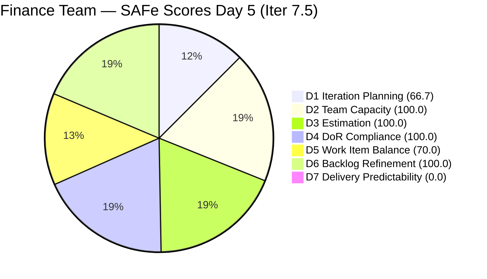
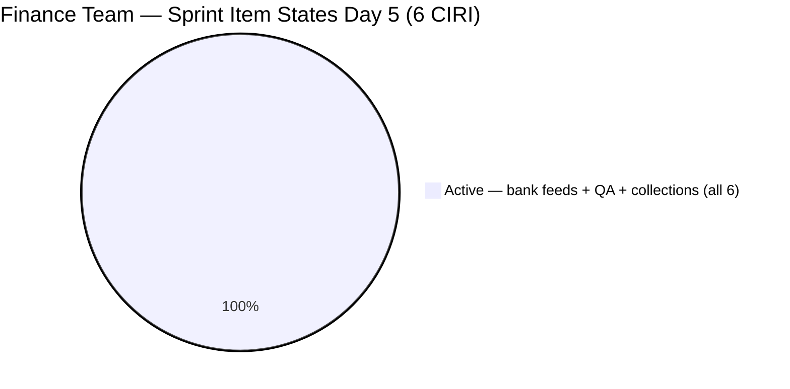
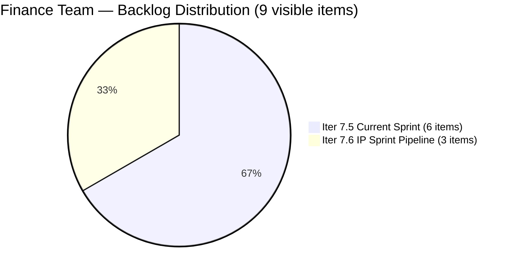

# ADO SAFe Audit — Finance Team

## 1. Audit Metadata

| Field | Value |
|-------|-------|
| **Project** | Jairosoft FINOPS |
| **Team** | Finance Team |
| **Workspace** | `ado_fin` |
| **ADO Project ID** | `e0bb302f-40f9-46c3-8164-6f1acb317d63` |
| **ADO Team ID** | `1f4b45fa-82e8-4a36-aedc-6c1bc8f51070` |
| **Iteration** | Iteration 7.5 |
| **Iteration Start** | 2026-06-01 |
| **Iteration Finish** | 2026-06-14 |
| **Sprint Day** | Day 5 of 14 |
| **Audit Date** | 2026-06-05 UTC |
| **Prior Audit** | AUDIT_20260604_0001.md (Day 4, Iteration 7.5, 76.7 — Moderate Risk) |
| **Overall Score** | **76.7 / 100** |
| **Risk Band** | **Moderate Risk** |

---

## 2. Executive Summary

The Finance Team holds at **76.7 / 100 (Moderate Risk)** on Day 5 of Iteration 7.5. The overall score is unchanged from Days 3 and 4, but there is a meaningful structural improvement: both 205646 (Invoice Payment Collection for Jairosoft) and 205650 (Payment Collection for JIT) have transitioned from **New** to **Active** state (changed 2026-06-04). This resolves the primary hygiene issue from Day 4 — no sprint items remain in "New" state.

All 6 CIRI items are now Active, and all 5 PECI User Stories are underway. The sprint is fully activated heading into its second week. However, the critical gap remains: D7 = 0.0 with 0 CLSP. Today marks the **final day of the early-sprint annotation window** (Days 1–5). Starting Day 6, a 0.0 D7 score will be a direct performance signal without contextual annotation. Grace must close at least one PECI item before the Day 6 audit.

The Iteration Planning gap (D1 = 66.7) is structural — 3 IP Sprint items remain in Iter 7.6, which is expected pre-PI-close behavior. This dimension will resolve organically at PI7 close-out.

---

## 3. Previous Audit Delta

**Prior audit:** AUDIT_20260604_0001.md — Iteration 7.5, Day 4, Score 76.7 / 100 (Moderate Risk)

| Dimension | Day 4 | Day 5 | Delta | Driver |
|-----------|-------|-------|-------|--------|
| D1 Iteration Planning | 66.7 | **66.7** | 0.0 | VRBI 9 / CIRI 6 unchanged |
| D2 Team Capacity | 100.0 | **100.0** | 0.0 | Grace: 2 hrs/day unchanged |
| D3 Estimation | 100.0 | **100.0** | 0.0 | All 5 PECI items at SP=2; no changes |
| D4 DoR Compliance | 100.0 | **100.0** | 0.0 | All 6 CIRI still DoR-compliant |
| D5 Work Item Balance | 70.0 | **70.0** | 0.0 | US = 5/6 (83.3%); no type changes |
| D6 Backlog Refinement | 100.0 | **100.0** | 0.0 | All 9 VRBI fresh; all CIRI touched ≥ Jun 1 |
| D7 Delivery Predictability | 0.0 | **0.0** | 0.0 | No closures yet; annotation expires after today |
| **Overall** | **76.7** | **76.7** | **0.0** | Score stable; sprint now fully activated |

**Key changes since Day 4:**
- **205646 (Invoice Payment Collection — Jairosoft, US, 2 SP):** Transitioned from **New → Active** (changed 2026-06-04T22:46). Resolves Day 4's most urgent hygiene finding.
- **205650 (Payment Collection — JIT, US, 2 SP):** Transitioned from **New → Active** (changed 2026-06-04T22:45). Both collection items now active simultaneously.

**Significance:** All 6 CIRI items are now in Active state, and all 5 PECI User Stories are actively in progress. The sprint is fully engaged at Day 5. The 2-day lag from item creation to activation (Day 3–5) reflects a process discipline gap that has now been resolved without score impact (D7 annotation still covers Day 5).

---

## 4. Current Iteration Snapshot

| Attribute | Value |
|-----------|-------|
| **Active Iteration** | Iteration 7.5 |
| **Sprint Duration** | 2026-06-01 to 2026-06-14 (14 days) |
| **Audit Day** | **Day 5 of 14** |
| **Total Visible Backlog Root Items (VRBI)** | **9** |
| **Current Iteration Root Items (CIRI)** | **6** |
| **Sprint Load %** | **66.7%** |
| **Point-Eligible Items (PECI — User Story type)** | **5** (204481, 204490, 204495, 205646, 205650) |
| **Committed Story Points (CSP)** | **10 SP** (5 US × 2 SP each) |
| **Closed Story Points (CLSP)** | **0 SP** |
| **Delivery %** | **0.0%** |
| **Item States** | Active: 6 (all CIRI) |
| **Active Team Members (CW)** | **1** (Grace) |
| **Team Capacity** | 2 hrs/day (Documentation 1, Requirements 1); 0 days off |
| **Pipeline Items (Iter 7.6 IP Sprint)** | 3 (204502, 204507, 204512) |
| **Days Elapsed** | 5 of 14 (35.7%) |
| **Remaining Days** | 9 |

---

## 5. Work Item Analysis

### 5.1 Current Iteration Items (CIRI — 6 items)

| ID | Title | Type | State | SP | Assignee | DoR | ChangedDate |
|----|-------|------|-------|----|----------|-----|-------------|
| 204534 | QA Testing | Issue | Active | 2 | Grace | PASS | 2026-06-02 |
| 204481 | Establish & Authenticate Real-Time Bank Feeds | User Story | Active | 2 | Grace | PASS | 2026-06-03 |
| 204490 | Define Automated Transaction Categorization Rules | User Story | Active | 2 | Grace | PASS | 2026-06-03 |
| 204495 | Clean Feed Validation & Automation Freeze | User Story | Active | 2 | Grace | PASS | 2026-06-03 |
| 205646 | Invoice Payment Collection for Jairosoft | User Story | **Active** | 2 | Grace | PASS | 2026-06-04 |
| 205650 | Payment Collection for Jairo Institute of Technology (JIT) | User Story | **Active** | 2 | Grace | PASS | 2026-06-04 |

**Full sprint activation achieved.** All 6 CIRI items are Active as of Day 5. This is the first day in the sprint where no items remain in New state.

### 5.2 DoR Summary

| ID | Type | Desc ≥ 30? | AC ≥ 20? | Result |
|----|------|-----------|---------|--------|
| 204534 | Issue | YES (~70 chars) | YES (~50 chars: "Must be same total with...") | **PASS** |
| 204481 | User Story | YES (BDD format, ~120 chars) | YES (BDD Given/When/Then, ~200 chars) | **PASS** |
| 204490 | User Story | YES (BDD format, ~130 chars) | YES (BDD format, ~160 chars) | **PASS** |
| 204495 | User Story | YES (BDD format, ~125 chars) | YES (BDD Given/When/Then, ~180 chars) | **PASS** |
| 205646 | User Story | YES (BDD format, ~190 chars) | YES (2-scenario BDD, ~330 chars) | **PASS** |
| 205650 | User Story | YES (BDD format, ~185 chars) | YES (2-scenario BDD, ~360 chars) | **PASS** |

### 5.3 Pipeline Items (Iteration 7.6 IP Sprint — 3 items)

| ID | Title | Type | State | SP | ChangedDate | Days Since Update |
|----|-------|------|-------|----|-------------|-------------------|
| 204502 | Complete Full-Month Ledger Reconciliation | User Story | New | 2 | 2026-05-18 | 18 |
| 204507 | Generate & Configure Clean P&L Dashboards | User Story | New | 2 | 2026-05-18 | 18 |
| 204512 | Final Feature Audit, UAT, and Sign-Off | User Story | New | 2 | 2026-05-18 | 18 |

IP Sprint items now 18 days without update. Review by Day 7 (June 7) is critical — these items' ACs are dependent on the bank feed pipeline's current state, which is actively changing in the current sprint.

---

## 6. SAFe Compliance Scorecard

| Dimension | Score | Evidence (Numerator / Denominator) | Risk Band | Notes |
|-----------|-------|-------------------------------------|-----------|-------|
| D1 Iteration Planning | **66.7** | 6 CIRI / 9 VRBI | Moderate | 3 IP Sprint items structural non-CIRI |
| D2 Team Capacity | **100.0** | 1 CC / 1 CW | Low | Grace: 2 hrs/day confirmed |
| D3 Estimation | **100.0** | 5 ECI / 5 PECI | Low | Issue 204534 excluded from PECI |
| D4 DoR Compliance | **100.0** | 6 DCI / 6 CIRI | Low | All 6 items pass Desc ≥ 30, AC ≥ 20 |
| D5 Work Item Balance | **70.0** | US = 5/6 = 83.3% | Moderate | Penalty B: US > 60%; single Issue present |
| D6 Backlog Refinement | **100.0** | 9 fresh / 9 VRBI; 0 untouched | Low | All CIRI touched on/after Jun 1 |
| D7 Delivery Predictability | **0.0** | 0 CLSP / 10 CSP | Critical | Day 5 — early-sprint annotation final day |
| **Overall** | **76.7** | (66.7+100+100+100+70+100+0)/7 | **Moderate Risk** | |

---

## 7. Dimension Findings

### 7.1 Iteration Planning (66.7 — Moderate Risk)

**VRBI:** 9 items. **CIRI:** 6 items. **Non-CIRI VRBI:** 204502, 204507, 204512 (Iter 7.6 IP Sprint).
**Formula:** round(6/9 × 100, 1) = **66.7**

No change. The 3 IP Sprint items represent PI7 close-out activities correctly staged for the upcoming Innovation & Planning sprint. This structural gap is expected and will resolve when these items either progress into the active sprint or when the IP sprint begins. The Finance Team's D1 pattern across PI7 has consistently reflected this 2-to-1 sprint-to-pipeline ratio.

---

### 7.2 Team Capacity (100.0 — Low Risk)

**CW:** 1 (Grace). **CC:** 1 (Documentation 1 hr/day + Requirements 1 hr/day = 2 hrs/day). 0 days off.
**Formula:** round(1/1 × 100, 1) = **100.0**

At 2 hrs/day over 9 remaining sprint days = 18 effective hours, and 10 SP committed, Grace is loading at 0.56 SP/effective hour. The 5 PECI User Stories are all clearly scoped with BDD acceptance criteria. Assuming 2–4 hours per story for review and documentation tasks, the sprint is deliverable within capacity.

---

### 7.3 Estimation (100.0 — Low Risk)

**PECI:** 5 User Stories. **ECI:** 5 (all at SP=2). **CSP:** 10 SP.
**Issue 204534** (2 SP) excluded from PECI per rubric.
**Formula:** round(5/5 × 100, 1) = **100.0**

---

### 7.4 DoR Compliance (100.0 — Low Risk)

**CIRI:** 6. **DCI:** 6. All pass Description ≥30 and AC ≥20 stripped chars.
**Formula:** round(6/6 × 100, 1) = **100.0**

205646 and 205650 bring the highest-quality content in the sprint — both feature 2-scenario BDD acceptance criteria exceeding 300 characters. Their activation today on Day 5 means their content quality is finally matched by their workflow state.

---

### 7.5 Work Item Balance (70.0 — Moderate Risk)

**CIRI type distribution (6 items):** User Story = 5 (83.3%), Issue = 1 (16.7%).

| Penalty | Check | Result |
|---------|-------|--------|
| A (no User Story) | 5 US present | 0 |
| B (dominant type > 60%) | US = 83.3% > 60% | **−30** |
| C (spike share > 40%) | 0 Spikes | 0 |

**Formula:** max(0, 100 − 30) = **70.0**

The closure of 204534 (Issue) would raise US share to 100%, worsening the penalty theoretically — however at 5 items total, adding a single Spike would bring US to 80% (4/5 — still above 60%). Adding a Spike and a second non-US item would bring it to 66.7% (4/6), still triggering Penalty B. To eliminate Penalty B in a 5-item sprint would require ≤3 US items.

Practical path: Adding 1–2 Spike items (technical investigations related to the bank feed or QA automation tooling) before the sprint midpoint would diversify the type mix and, if the sprint grows to 7–8 items, bring US share to or below 60%.

---

### 7.6 Backlog Refinement (100.0 — Low Risk)

**Fresh window:** ChangedDate ≥ 2026-04-21 (45 days before 2026-06-05).
All 9 VRBI items changed 2026-05-18 or later. All 6 CIRI items changed 2026-06-02 or later.
No stale_90, no stale_180. Untouched CIRI = 0.
**Formula:** 100.0

---

### 7.7 Delivery Predictability (0.0 — Critical Risk)

**CSP:** 10 SP. **CLSP:** 0 SP.
**Formula:** round(0/10 × 100, 1) = **0.0**
**Annotation:** Day 5 of 14 — **final day** of early-sprint annotation window.

Starting Day 6, D7 = 0.0 is a direct performance indicator. With all 6 CIRI items now Active, the sprint infrastructure is in place. The recommended closure sequence:

| Priority | Item | SP Type | Effort | D7 Impact |
|----------|------|---------|--------|-----------|
| 1 | 205646 (Invoice Collection — Jairosoft) | +2 SP (PECI) | Independent | D7 = 20.0 → Overall ≈ 79.8 |
| 2 | 205650 (Payment Collection — JIT) | +2 SP (PECI) | Independent | D7 = 40.0 → Overall ≈ 82.9 |
| 3 | 204481 (Bank Feeds establish) | +2 SP (PECI) | Sequential | D7 = 60.0 → Overall ≈ 85.7 |
| 4 | 204490 (Categorization rules) | +2 SP (PECI) | Depends on 204481 | D7 = 80.0 → Overall ≈ 88.6 |
| 5 | 204495 (Clean Feed Validation) | +2 SP (PECI) | Depends on 204490 | D7 = 100.0 → Overall ≈ 92.4 |

Note: 204534 (Issue) closure removes it from CIRI but does not contribute to CLSP — the Issue type is excluded from PECI. Closing 204534 reduces the D5 denominator from 6 to 5 items (US=5/5=100%), maintaining the Penalty B but not affecting D7.

---

## 8. Risks and Bottlenecks

| Risk | Severity | Items | Status |
|------|----------|-------|--------|
| Early-sprint annotation expires tomorrow (Day 6) | **CRITICAL** | D7 = 0.0 | Must close at least 1 PECI item (205646 or 205650) before Day 6 audit |
| 0 SP closed at Day 5 — no delivery baseline after 5 days | **HIGH** | All 10 SP | Sprint half-elapsed; 9 remaining days for 10 SP |
| Sequential bank feed dependency (204481→490→495) | **HIGH** | 6 SP in sequence | Cannot start 204490 until 204481 established; 204495 after 204490 runs 48 hrs |
| Single contributor Grace — zero redundancy | **MEDIUM** | All 6 CIRI, 10 SP | Bus factor 1; unchanged |
| IP Sprint items 18 days without update | **MEDIUM** | 204502, 204507, 204512 | ACs depend on bank feed data; review by Day 7 (Jun 7) |
| Work Item Balance penalty structural (70.0) | **LOW** | 83.3% US | Requires adding Spike or Enabler type |
| D1 at 66.7 — structural | **LOW** | IP Sprint items | Resolves at PI7 close |

---

## 9. Prioritized Recommendations

1. **Close 205646 (Invoice Collection — Jairosoft) on Day 5 or Day 6.** This item is the most independent PECI item in the sprint — it involves reviewing the AR aging report, dispatching reminder emails, and confirming payment receipt. There is no dependency on the bank feed pipeline. Grace should validate the invoice aging review and collection log tasks against the BDD acceptance criteria and close the item today or early tomorrow. +2 SP → D7 = 20.0 → Overall ≈ 79.8.

2. **Close 205650 (Payment Collection — JIT) by Day 6.** Similarly independent — involves student tuition collection processing and clearance status verification. Pairing the closure of 205646 and 205650 on the same day delivers +4 SP (D7 = 40.0, Overall ≈ 82.9 — Low Risk). These two items are the sprint's fastest path to breaking the Low Risk barrier.

3. **Close 204534 (QA Testing) by Day 6.** This Issue has been in Active state since June 2 (Day 2). Validate that automated payroll computation matches the manual total, add a brief result comment, and close. While its closure does not contribute to CLSP (Issue excluded from PECI), it reduces CIRI from 6 to 5 items and demonstrates consistent delivery discipline.

4. **Begin 204481 (Bank Feeds) immediately after 205646 and 205650 are closed.** The bank feed establishment requires multi-factor authentication and API configuration. Grace should initiate this on Day 5 or 6 to allow the 48-hour validation window (required by 204495's AC) to complete before Day 10–11. If 204481 is not started by Day 7, the sequential 3-story pipeline may not complete within the sprint.

5. **Review 204502, 204507, 204512 (IP Sprint items) by Day 7 (June 7).** Now 18 days without update. The "zero variance" reconciliation AC in 204502 and the P&L dashboard configuration in 204507 are directly dependent on the categorization rules established in 204490. These items need content validation against the evolving bank feed pipeline before the IP sprint begins.

6. **Add one Spike item to the sprint.** US dominance at 83.3% triggers Penalty B regardless of 204534's closure. A single Spike (e.g., research into QuickBooks PH automation testing methods, or investigation of alternative bank feed connectors) would bring US share to 71.4% (5/7) — still Penalty B territory but signals diversity intent. Adding two non-US items would bring the team to 71.4%; three would break 60% only if total sprint items reach 9+.

---

## 10. Evidence Gaps and Limitations

- **Issue 204534 excluded from PECI.** Its 2 SP is not included in CSP (10 SP). If included, CSP = 12 SP and D7 remains 0.0 until a PECI item closes.
- **Day 5 = final early-sprint annotation day.** Per the rubric's early-sprint window (Days 1–5 of a 14-day sprint), today is the last day that D7 = 0.0 carries contextual annotation. Day 6 audit will report 0.0 as a raw performance score if no closures occur before then.
- **IP Sprint items confirmed via backlog API.** Items 204502, 204507, 204512 are in Iter 7.6 (IP). Their presence in VRBI is confirmed; their exclusion from CIRI is correct.
- **Grace's capacity (2 hrs/day) is confirmed from the FINOPS iteration capacities API.** The Finance Team returned teamCapacityPerDay=2, consistent with Documentation (1 hr) + Requirements (1 hr).
- **No child task data retrieved.** Tasks linked to CIRI items were not individually inspected. Root-level scoring is complete per the rubric.

---

## Appendix: Score Visualization

**Score Trend — Recent Audits:**

| Audit | Iteration | Day | Score | Band | Key Change |
|-------|-----------|-----|-------|------|------------|
| Iter 7.4 Day 12 | Iter 7.4 | 12 | 71.9 | Moderate | Closed items dropped |
| Iter 7.5 Day 1 | Iter 7.5 | 1 | 72.4 | Moderate | Sprint open |
| Iter 7.5 Day 2 | Iter 7.5 | 2 | 72.4 | Moderate | No activity |
| Iter 7.5 Day 3 | Iter 7.5 | 3 | 76.7 | Moderate | 2 new US + sprint activated |
| Iter 7.5 Day 4 | Iter 7.5 | 4 | 76.7 | Moderate | Static; 205646/205650 still New |
| **Iter 7.5 Day 5** | **Iter 7.5** | **5** | **76.7** | **Moderate** | 205646 + 205650 → Active; full sprint activation |
| Projected Day 6 | Iter 7.5 | 6 | ~82.9 | Low | 205646 + 205650 closed; D7=40 |
| Projected Day 9 | Iter 7.5 | 9 | ~88.6 | Low | Bank feeds 204481→490 closed |
| Projected Day 14 | Iter 7.5 | 14 | ~92.4 | Low | All US closed; D7=100 |

**Delivery Trajectory — Day 5 to Low Risk:**

| Close Action | CLSP | D7 | Overall | Band |
|-------------|------|----|---------|------|
| Nothing (current) | 0 SP | 0.0 | 76.7 | Moderate |
| Close 204534 (Issue — excluded) | 0 SP | 0.0 | 76.7 | Moderate |
| Close 205646 only | 2 SP | 20.0 | 79.8 | Moderate |
| Close 205646 + 205650 | 4 SP | 40.0 | **82.9** | **Low** |
| Close 3 items (+ 204481) | 6 SP | 60.0 | 85.7 | Low |
| Close all 5 US | 10 SP | 100.0 | 92.4 | Low |
