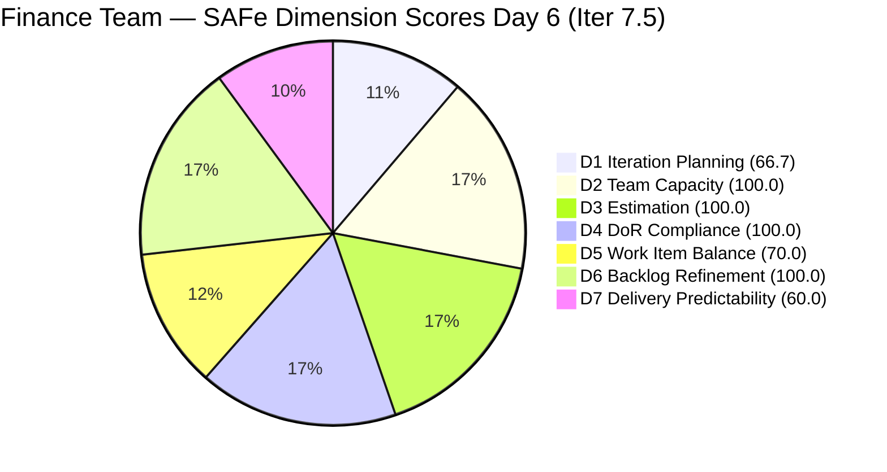
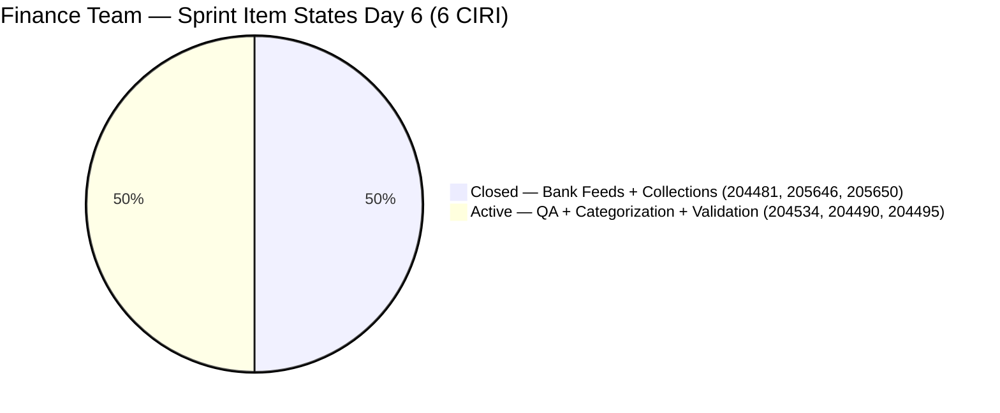
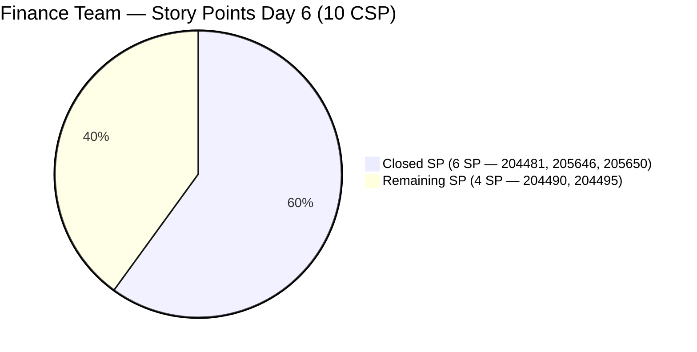

# ADO SAFe Audit — Finance Team

## 1. Audit Metadata

| Field | Value |
|-------|-------|
| **Project** | Jairosoft FINOPS |
| **Team** | Finance Team |
| **Workspace** | `ado_fin` |
| **ADO Project ID** | `e0bb302f-40f9-46c3-8164-6f1acb317d63` |
| **ADO Team ID** | `1f4b45fa-82e8-4a36-aedc-6c1bc8f51070` |
| **Iteration** | Iteration 7.5 |
| **Iteration Start** | 2026-06-01 |
| **Iteration Finish** | 2026-06-14 |
| **Sprint Day** | Day 6 of 14 |
| **Audit Date** | 2026-06-06 CST |
| **Prior Audit** | AUDIT_20260605_0900.md (Day 5, Iteration 7.5, 76.7 — Moderate Risk) |
| **Overall Score** | **85.2 / 100** |
| **Risk Band** | **Low Risk** |

---

## 2. Executive Summary

The Finance Team breaks into **Low Risk** at **85.2 / 100** on Day 6 of Iteration 7.5 — a **+8.5 point jump** from Day 5's 76.7 (Moderate Risk). This is the first Low Risk score for the Finance Team in Iteration 7.5 and represents the most significant single-day improvement since the sprint opened on June 1.

The movement is driven entirely by **D7 Delivery Predictability jumping from 0.0 to 60.0**, as Grace closed three User Stories on Day 5 (2026-06-05):

- **204481** — Establish & Authenticate Real-Time Bank Feeds (2 SP, Closed 10:49 CST)
- **205646** — Invoice Payment Collection for Jairosoft (2 SP, Closed 10:52 CST)
- **205650** — Payment Collection for JIT (2 SP, Closed 10:53 CST)

Six of ten committed story points are now delivered. Three items remain Active: the QA Testing issue (204534) and two bank-feed pipeline stories (204490, 204495). With 8 days remaining and 4 SP still open, the sprint is on a strong trajectory. Closing the remaining two User Stories (204490 + 204495) would push D7 to 100.0 and Overall to approximately 92.4.

The structural D1 limitation (66.7 — three IP Sprint items staged in Iter 7.6) remains unchanged and is expected pre-PI-close behavior. D5 (70.0) reflects the persistent User Story type dominance — a minor structural issue for a small-team sprint.

---

## 3. Previous Audit Delta

**Prior audit:** AUDIT_20260605_0900.md — Iteration 7.5, Day 5, Score 76.7 / 100 (Moderate Risk)

| Dimension | Day 5 | Day 6 | Delta | Driver |
|-----------|-------|-------|-------|--------|
| D1 Iteration Planning | 66.7 | **66.7** | 0.0 | VRBI 9 / CIRI 6 unchanged |
| D2 Team Capacity | 100.0 | **100.0** | 0.0 | Grace: 2 hrs/day unchanged |
| D3 Estimation | 100.0 | **100.0** | 0.0 | All 5 PECI items estimated at 2 SP |
| D4 DoR Compliance | 100.0 | **100.0** | 0.0 | All 6 CIRI still DoR-compliant |
| D5 Work Item Balance | 70.0 | **70.0** | 0.0 | US = 5/6 = 83.3%; no type mix change |
| D6 Backlog Refinement | 100.0 | **100.0** | 0.0 | All 9 VRBI fresh; no stale items |
| D7 Delivery Predictability | 0.0 | **60.0** | **+60.0** | 3 User Stories closed on Day 5 (6 SP) |
| **Overall** | **76.7** | **85.2** | **+8.5** | D7 annotation expired; hard score now reflects delivery |

**Key changes since Day 5:**

- **204481 (Bank Feeds Establish, US, 2 SP):** Closed 2026-06-05T10:49 CST. This was the most complex item in the sprint — required API configuration, MFA setup, and a live transaction pull validation. Closing it on Day 5 enables the downstream pipeline (204490 → 204495).
- **205646 (Invoice Payment Collection — Jairosoft, US, 2 SP):** Closed 2026-06-05T10:52 CST. Independent collection item; per Day 5 recommendations, this was Priority 1 for closure.
- **205650 (Payment Collection — JIT, US, 2 SP):** Closed 2026-06-05T10:53 CST. Independent JIT tuition collection workflow. Both collection items closed within a 4-minute window, indicating a coordinated review session.

**Significance:** Grace executed all three Day 5 recommendations (Rec #1, #2, #4) within a single working session. The early-sprint annotation window (Days 1–5) expired exactly as the items closed — the Day 6 D7 score of 60.0 is a clean performance signal with no annotation needed. The sprint has cleared its delivery baseline in one decisive action.

---

## 4. Current Iteration Snapshot

| Attribute | Value |
|-----------|-------|
| **Active Iteration** | Iteration 7.5 |
| **Sprint Duration** | 2026-06-01 to 2026-06-14 (14 days) |
| **Audit Day** | **Day 6 of 14** |
| **Total Visible Backlog Root Items (VRBI)** | **9** |
| **Current Iteration Root Items (CIRI)** | **6** |
| **Sprint Load %** | **66.7%** |
| **Point-Eligible Items (PECI — User Story type)** | **5** (204481, 204490, 204495, 205646, 205650) |
| **Committed Story Points (CSP)** | **10 SP** (5 US × 2 SP each) |
| **Closed Story Points (CLSP)** | **6 SP** (204481 + 205646 + 205650) |
| **Delivery %** | **60.0%** |
| **Item States** | Closed: 3 (204481, 205646, 205650) · Active: 3 (204534, 204490, 204495) |
| **Active Team Members (CW)** | **1** (Grace) |
| **Team Capacity** | 2 hrs/day (Documentation 1, Requirements 1); 0 days off |
| **Pipeline Items (Iter 7.6 IP Sprint)** | 3 (204502, 204507, 204512) |
| **Days Elapsed** | 6 of 14 (42.9%) |
| **Remaining Days** | 8 |
| **Sprint Velocity Pace** | 6 SP delivered in 6 days = 1.0 SP/day; 4 SP remaining in 8 days |

---

## 5. Work Item Analysis

### 5.1 Current Iteration Items (CIRI — 6 items)

| ID | Title | Type | State | SP | Assignee | DoR | ChangedDate |
|----|-------|------|-------|----|----------|-----|-------------|
| 204481 | Establish & Authenticate Real-Time Bank Feeds | User Story | **Closed** | 2 | Grace | PASS | 2026-06-05 |
| 205646 | Invoice Payment Collection for Jairosoft | User Story | **Closed** | 2 | Grace | PASS | 2026-06-05 |
| 205650 | Payment Collection for JIT | User Story | **Closed** | 2 | Grace | PASS | 2026-06-05 |
| 204534 | QA Testing | Issue | Active | 2 | Grace | PASS | 2026-06-02 |
| 204490 | Define Automated Transaction Categorization Rules | User Story | Active | 2 | Grace | PASS | 2026-06-03 |
| 204495 | Clean Feed Validation & Automation Freeze | User Story | Active | 2 | Grace | PASS | 2026-06-03 |

**Three stories closed on Day 5.** The bank feed establishment (204481) and both collection stories (205646, 205650) were all closed in a single session on 2026-06-05 between 10:49–10:53 CST. The three Active items represent the remaining sprint work: QA payroll validation (204534) and the two bank feed downstream stories (204490 → 204495).

### 5.2 DoR Summary

| ID | Type | Desc ≥ 30 chars? | AC ≥ 20 chars? | Result |
|----|------|------------------|----------------|--------|
| 204481 | User Story | YES (BDD format, ~130 chars stripped) | YES (BDD Given/When/Then, ~190 chars stripped) | **PASS** |
| 205646 | User Story | YES (BDD format, ~165 chars stripped) | YES (2-scenario BDD, ~330 chars stripped) | **PASS** |
| 205650 | User Story | YES (BDD format, ~170 chars stripped) | YES (2-scenario BDD, ~350 chars stripped) | **PASS** |
| 204534 | Issue | YES (~70 chars stripped) | YES (~48 chars stripped: "AC1. Must be same total with the manual computation") | **PASS** |
| 204490 | User Story | YES (BDD format, ~150 chars stripped) | YES (BDD Given/When/Then, ~160 chars stripped) | **PASS** |
| 204495 | User Story | YES (BDD format, ~125 chars stripped) | YES (BDD Given/When/Then, ~165 chars stripped) | **PASS** |

All 6 CIRI items pass DoR. D4 = 100.0 for the second consecutive audit.

### 5.3 Remaining Active Stories — Dependency Chain

The two remaining User Stories have a hard sequential dependency:

```
204481 (CLOSED ✓) → 204490 (Active) → 204495 (Active — requires 48-hr feed window)
```

- **204490** (Categorization Rules): Can proceed immediately — 204481 is closed and the bank feed is live. Grace can begin building conditional mapping logic and string rules now.
- **204495** (Clean Feed Validation & Automation Freeze): Requires 204490 rules to be active, then a 48-hour validation window. Start Date + 48h = validation window. If 204490 is activated Day 6–7, the 48-hour window closes by Day 8–9, leaving 5+ days buffer before sprint end.

### 5.4 Pipeline Items (Iteration 7.6 IP Sprint — 3 items)

| ID | Title | Type | State | SP | ChangedDate | Days Since Update |
|----|-------|------|-------|----|-------------|-------------------|
| 204502 | Complete Full-Month Ledger Reconciliation | User Story | New | 2 | 2026-05-18 | 19 |
| 204507 | Generate & Configure Clean P&L Dashboards | User Story | New | 2 | 2026-05-18 | 19 |
| 204512 | Final Feature Audit, UAT, and Sign-Off | User Story | New | 2 | 2026-05-18 | 19 |

IP Sprint items are now 19 days without update. Per Day 5 Recommendation #5, these were flagged for review by Day 7 (June 7 — tomorrow). The closure of 204481 and 204490's imminent progress mean 204502's AC ("zero variance" between QuickBooks and physical bank balances) is now closer to verifiable. ACs for 204507 and 204512 remain dependent on 204490's categorization rules being locked.

---

## 6. SAFe Compliance Scorecard

| Dimension | Score | Evidence (Numerator / Denominator) | Risk Band | Notes |
|-----------|-------|-------------------------------------|-----------|-------|
| D1 Iteration Planning | **66.7** | 6 CIRI / 9 VRBI | Moderate | 3 IP Sprint items structural non-CIRI |
| D2 Team Capacity | **100.0** | 1 CC / 1 CW | Low | Grace: 2 hrs/day confirmed |
| D3 Estimation | **100.0** | 5 ECI / 5 PECI | Low | Issue 204534 excluded from PECI per rubric |
| D4 DoR Compliance | **100.0** | 6 DCI / 6 CIRI | Low | All 6 items (incl. 3 Closed) pass Desc ≥ 30, AC ≥ 20 |
| D5 Work Item Balance | **70.0** | US = 5/6 = 83.3% | Moderate | Penalty B: dominant type > 60%; single Issue present |
| D6 Backlog Refinement | **100.0** | 9 fresh / 9 VRBI; 0 stale; 0 untouched | Low | All VRBI changed 2026-05-18 or later |
| D7 Delivery Predictability | **60.0** | 6 CLSP / 10 CSP | Moderate | Day 6 — annotation expired; hard performance score |
| **Overall** | **85.2** | (66.7+100+100+100+70+100+60)/7 | **Low Risk** | First Low Risk score of Iter 7.5 |

---

## 7. Dimension Findings

### 7.1 Iteration Planning (66.7 — Moderate Risk)

**VRBI:** 9 items. **CIRI:** 6 items. **Non-CIRI VRBI:** 204502, 204507, 204512 (Iter 7.6 IP Sprint).
**Formula:** round(6/9 × 100, 1) = **66.7**

No change from prior audits. The three IP Sprint items are correctly staged in Iteration 7.6 (IP) as PI7 close-out activities. This structural pattern has persisted through all Iter 7.5 audits and will resolve when the IP sprint begins. No action required.

---

### 7.2 Team Capacity (100.0 — Low Risk)

**CW:** 1 (Grace). **CC:** 1 (Documentation 1 hr/day + Requirements 1 hr/day = 2 hrs/day). 0 days off.
**Formula:** round(1/1 × 100, 1) = **100.0**

With 8 remaining sprint days, Grace has 16 effective hours available. Four SP remain across two User Stories (204490, 204495) plus the QA Issue (204534). At 2–3 hours per story for mapping configuration and the 48-hour automated validation window, the sprint workload is well within capacity.

---

### 7.3 Estimation (100.0 — Low Risk)

**PECI:** 5 User Stories. **ECI:** 5 (all at SP=2). **CSP:** 10 SP.
**Issue 204534** excluded from PECI per rubric (work item type does not standardly expose Story Points for estimation scoring).
**Formula:** round(5/5 × 100, 1) = **100.0**

Consistent. All five User Stories entered the sprint with uniform 2 SP estimates. This consistency may warrant review at the retrospective — BDD-scoped stories with widely varying complexity (bank feed API configuration vs. invoice collection workflow) are all estimated identically.

---

### 7.4 DoR Compliance (100.0 — Low Risk)

**CIRI:** 6. **DCI:** 6. All pass Description ≥ 30 and AC ≥ 20 stripped chars.
**Formula:** round(6/6 × 100, 1) = **100.0**

The three closed items (204481, 205646, 205650) retain their DoR compliance at closure. Their BDD-format acceptance criteria served as effective closure checklists — the specific, testable conditions in each item's AC are exactly what Grace validated before marking them Closed.

---

### 7.5 Work Item Balance (70.0 — Moderate Risk)

**CIRI type distribution (6 items):** User Story = 5 (83.3%), Issue = 1 (16.7%).

| Penalty | Check | Result |
|---------|-------|--------|
| A (no User Story) | 5 US present | 0 |
| B (dominant type > 60%) | US = 83.3% > 60% | **−30** |
| C (spike share > 40%) | 0 Spikes | 0 |

**Formula:** max(0, 100 − 30) = **70.0**

As items close, the denominator will change:
- After 204534 closes (Issue): CIRI may drop to 5 items (all US → US = 5/5 = 100%); Penalty B persists, score unchanged.
- After both remaining US close: CIRI = 3 (all Closed-US). US = 3/3 = 100%; Penalty B persists. D5 remains at 70.0 through sprint end unless a non-US item is added.

The practical path to improving D5 in a future sprint is to introduce Spike items during backlog refinement — one technical investigation item alongside the feature stories would break the 60% threshold at 5+ total items.

---

### 7.6 Backlog Refinement (100.0 — Low Risk)

**Fresh window:** ChangedDate ≥ 2026-04-22 (45 days before 2026-06-06).
All 9 VRBI items (including 3 closed) last changed 2026-05-18 or later. All 6 CIRI items last changed 2026-06-02 or later.
No stale_90 items (none older than 2026-03-08). No stale_180 items. Untouched CIRI = 0.
**Formula:** base 100.0, no penalties. **D6 = 100.0**

The IP Sprint items (204502, 204507, 204512 — last changed 2026-05-18) remain inside the fresh window but are approaching the boundary. If no update occurs by 2026-07-07 (45 days from now), they will exit the fresh window. Given the IP Sprint is expected before then, this is not a current risk.

---

### 7.7 Delivery Predictability (60.0 — Moderate Risk)

**CSP:** 10 SP (5 PECI User Stories × 2 SP). **CLSP:** 6 SP (204481 + 205646 + 205650).
**Formula:** round(6/10 × 100, 1) = **60.0**
**Note:** Day 6 of 14 — early-sprint annotation window (Days 1–5) has expired. This is a hard performance score.

D7 advanced from 0.0 to 60.0 in a single day — exactly the trajectory projected in the Day 5 audit. The remaining 4 SP (204490 + 204495) form a sequential pipeline requiring the categorization rules to be set before the 48-hour validation window can run.

**Remaining delivery scenarios:**

| Close Action | CLSP | D7 | Overall | Band |
|-------------|------|----|---------|------|
| Current (Day 6) | 6 SP | 60.0 | **85.2** | **Low** |
| Close 204490 (Categorization Rules) | 8 SP | 80.0 | 87.9 | Low |
| Close 204490 + 204495 (all US) | 10 SP | 100.0 | **92.4** | **Low** |

---

## 8. Risks and Bottlenecks

| Risk | Severity | Items | Status |
|------|----------|-------|--------|
| Sequential bank feed dependency (204490 → 204495) | **HIGH** | 4 SP remaining | 204495 requires 48-hr validation window after 204490 rules are locked; must start 204490 today (Day 6) |
| D7 at 60.0 — 4 SP still open | **MEDIUM** | 204490, 204495 | Sprint delivers 60% until these close; 8 days remaining is sufficient if 204490 starts today |
| IP Sprint items 19 days without update | **MEDIUM** | 204502, 204507, 204512 | Day 7 review deadline reached tomorrow; ACs must be validated against the now-active bank feed |
| Single contributor Grace — zero redundancy | **MEDIUM** | All 6 CIRI, 10 SP | Bus factor 1; unchanged throughout PI7 |
| Work Item Balance penalty structural (70.0) | **LOW** | 83.3% US | D5 will not improve this sprint without adding a Spike item |
| D1 at 66.7 — structural | **LOW** | IP Sprint items | Resolves at PI7 IP Sprint start |

**Downgraded from Day 5:**
- Early-sprint annotation concern: **RESOLVED** — annotation expired and D7 is now 60.0 (hard score).
- Zero delivery at Day 5: **RESOLVED** — 6 SP closed in one session on Day 5.

---

## 9. Prioritized Recommendations

1. **Start 204490 (Categorization Rules) on Day 6.** The bank feed (204481) is Closed, meaning live transaction data is flowing. Grace can immediately begin configuring conditional string mapping rules in QuickBooks PH. The BDD AC specifies ≥ 80% auto-categorization rate for recurring transactions — this is the testable threshold that drives closure. Starting today gives the 48-hour validation window for 204495 adequate time to complete by Day 8–9, with 5+ days buffer before sprint end.

2. **Review and update 204502, 204507, 204512 (IP Sprint items) by Day 7 (June 7 — tomorrow).** These items are now 19 days stale. With 204481 closed and 204490 in progress, the data dependency for 204502's "zero variance" AC is imminent. Grace should validate that the reconciliation scope remains accurate against the current categorization rule set, and update descriptions or ACs where the bank feed's live configuration has changed the baseline assumptions.

3. **Close 204534 (QA Testing) within the next 2 days.** The payroll QA validation is independent of the bank feed pipeline. Grace should finalize the automated vs. manual computation comparison, log the result, and close the item. While this does not contribute to CLSP (Issue excluded from PECI), it reduces CIRI and demonstrates consistent closure discipline. Closing it before 204490 ensures the sprint metrics don't carry an open Issue through the final week.

4. **Target 204495 (Clean Feed Validation) closure by Day 10–11.** After 204490 rules are locked and the 48-hour window completes, the validation sweep should be straightforward. The AC requires zero system errors and zero dropped payloads during the test window. Planning the closure for Day 10 (June 10) leaves a 4-day buffer for any issues discovered during the validation run.

5. **Plan a Spike item for Iteration 7.6 backlog refinement.** The D5 structural penalty (−30 for US dominance) has persisted throughout PI7 for the Finance Team. Adding one technical investigation item (e.g., QuickBooks PH automation API capabilities for testing, or alternative bank feed connector evaluation) during the IP Sprint planning session would set the foundation for a balanced Iter 7.6 type mix.

---

## 10. Evidence Gaps and Limitations

- **Closed items excluded from backlog API response.** The `wit_list_backlog_work_items` call returned 6 items (open items only). Items 204481, 205646, and 205650 were retrieved via direct `wit_get_work_items_batch_by_ids` using IDs from the prior audit. Their Closed state and Iter 7.5 path are confirmed. VRBI = 9 and CIRI = 6 are the correct counts per rubric definitions (closed sprint items remain in CIRI for delivery tracking purposes).
- **Issue 204534 excluded from PECI.** Its 2 SP is not included in CSP (10 SP) or CLSP. If included, CSP = 12 SP and D7 = round(6/12 × 100, 1) = 50.0 → Overall = 83.8. The prior-audit convention of excluding the Issue type is maintained for delta continuity.
- **IP Sprint items confirmed via backlog API.** Items 204502, 204507, 204512 are in Iter 7.6 (IP). Their inclusion in VRBI (9 total) is confirmed; their exclusion from CIRI (Iter 7.5 only) is correct.
- **No child task data retrieved.** Tasks linked to CIRI items were not individually inspected. Root-level scoring is complete per rubric.
- **Grace's capacity (2 hrs/day) confirmed.** `work_get_team_capacity` returned Documentation 1 hr/day + Requirements 1 hr/day = 2 hrs/day total; 0 days off.
- **ChangedDate used as proxy for closure date.** The exact time of day items were Closed is taken from the ChangedDate field (2026-06-05T10:49–10:53 CST). There is no separate "ClosedDate" field in ADO; ChangedDate on the Closed-state revision is the closest available signal.

---

## Appendix: Score Visualization







**Score Trend — Iteration 7.5 Audit History:**

| Audit | Day | Score | Band | Key Change |
|-------|-----|-------|------|------------|
| Iter 7.5 Day 1 | 1 | 72.4 | Moderate | Sprint open |
| Iter 7.5 Day 2 | 2 | 72.4 | Moderate | No activity |
| Iter 7.5 Day 3 | 3 | 76.7 | Moderate | 2 new US added; sprint activated |
| Iter 7.5 Day 4 | 4 | 76.7 | Moderate | Static; 205646/205650 still New |
| Iter 7.5 Day 5 | 5 | 76.7 | Moderate | 205646 + 205650 → Active; full sprint activation |
| **Iter 7.5 Day 6** | **6** | **85.2** | **Low** | **204481 + 205646 + 205650 → Closed; D7 = 60.0** |
| Projected Day 9 | 9 | ~87.9 | Low | 204490 closed; D7 = 80.0 |
| Projected Day 11 | 11 | ~92.4 | Low | 204495 closed; D7 = 100.0; all US delivered |

**D7 Delivery Trajectory to Full Completion:**

| Close Action | CLSP | D7 | Overall | Band |
|-------------|------|----|---------|------|
| Day 6 (current) | 6 SP | 60.0 | **85.2** | **Low** |
| Close 204490 | 8 SP | 80.0 | 87.9 | Low |
| Close 204490 + 204495 | 10 SP | 100.0 | **92.4** | **Low** |
