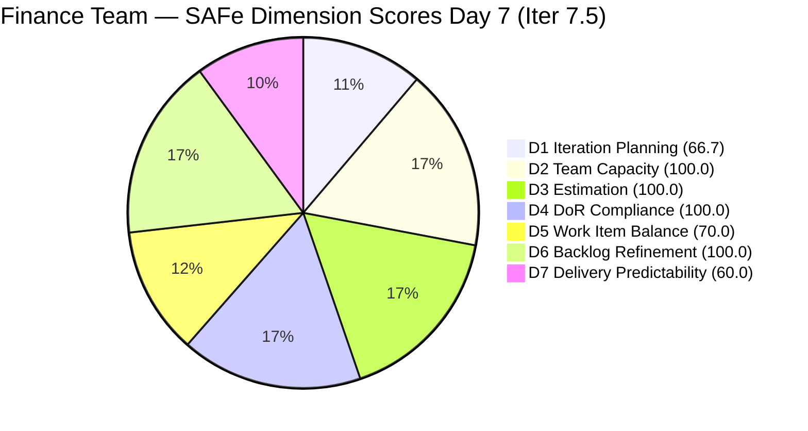
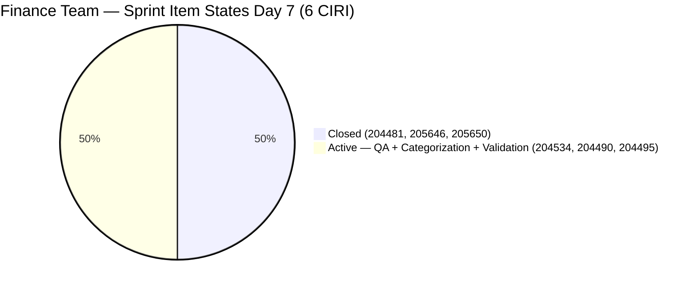
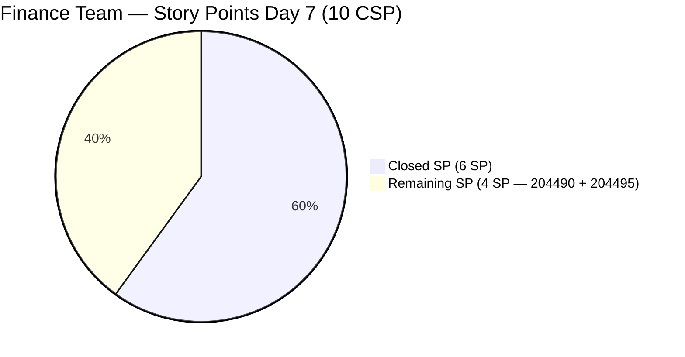

# ADO SAFe Audit — Finance Team

## 1. Audit Metadata

| Field | Value |
|-------|-------|
| **Project** | Jairosoft FINOPS |
| **Team** | Finance Team |
| **Workspace** | `ado_fin` |
| **Workspace Path** | `/Users/jairo/Projects/iteration_audit/ado_fin` |
| **ADO Project ID** | e0bb302f-40f9-46c3-8164-6f1acb317d63 |
| **ADO Team ID** | 1f4b45fa-82e8-4a36-aedc-6c1bc8f51070 |
| **Iteration** | Iteration 7.5 |
| **Iteration Start** | 2026-06-01 |
| **Iteration Finish** | 2026-06-14 |
| **Sprint Day** | Day 7 of 14 |
| **Audit Date** | 2026-06-07 CST |
| **Prior Audit** | AUDIT_20260606_0900.md (Day 6, Iteration 7.5, 85.2 — Low Risk) |
| **Overall Score** | **85.2 / 100** |
| **Risk Band** | **Low Risk** |

---

## 2. Executive Summary

- The Finance Team holds at **85.2 / 100 (Low Risk)** on Day 7 of Iteration 7.5 — unchanged from Day 6. The score remains in Low Risk territory for the second consecutive day.
- **No new closures detected on Day 7.** Items 204490 (Define Automated Transaction Categorization Rules, 2 SP) and 204495 (Clean Feed Validation & Automation Freeze, 2 SP) remain Active. The 48-hour sequential dependency pipeline has not advanced today.
- **D7 = 60.0** is holding. Grace must start and close 204490 to initiate the 48-hour validation window for 204495, otherwise the tight Day 8–9 window for 204495 starts slipping. If 204490 is not started by today, the timeline to full delivery becomes tight.
- **IP Sprint items (204502, 204507, 204512)** are now 20 days without update. The Day 7 review deadline identified in the Day 6 recommendations has now passed without action.
- **The sprint is on a good trajectory** with 6 SP delivered and 4 SP remaining, but the sequential bank-feed pipeline is the sole delivery risk. Closing both remaining stories would push the overall score to approximately 92.4.

---

## 3. Previous Audit Delta

**Prior audit:** AUDIT_20260606_0900.md — Iteration 7.5, Day 6, Score 85.2 / 100 (Low Risk)

| Dimension | Day 6 | Day 7 | Delta | Driver |
|-----------|-------|-------|-------|--------|
| D1 Iteration Planning | 66.7 | **66.7** | 0.0 | VRBI=9, CIRI=6 — no changes |
| D2 Team Capacity | 100.0 | **100.0** | 0.0 | Grace: 2 hrs/day unchanged |
| D3 Estimation | 100.0 | **100.0** | 0.0 | 5 PECI, all estimated; CSP=10 SP |
| D4 DoR Compliance | 100.0 | **100.0** | 0.0 | All 6 CIRI items pass DoR |
| D5 Work Item Balance | 70.0 | **70.0** | 0.0 | US=5/6=83.3%; Penalty B persists |
| D6 Backlog Refinement | 100.0 | **100.0** | 0.0 | All 9 VRBI fresh; no stale items |
| D7 Delivery Predictability | 60.0 | **60.0** | 0.0 | No new closures on Day 7; CLSP=6/10 |
| **Overall** | **85.2** | **85.2** | **0.0** | Score holds; pipeline dependency is the unlock |

**Key changes since Day 6:**
- **No item state transitions on 2026-06-07.** All CIRI items retain their Day 6 states. 204490 and 204495 remain Active; 204534 remains Active; the three closed stories (204481, 205646, 205650) remain Closed.
- **IP Sprint items unchanged.** 204502, 204507, 204512 are still New with last ChangedDate of 2026-05-18 — now 20 days without update. The Day 6 recommendation to review these by Day 7 has not been acted on per the API.
- **VRBI = 6 confirmed.** The backlog API returned 6 items (3 Active CIRI + 3 closed CIRI that reappear when queried directly). The IP Sprint items (204502, 204507, 204512) remain in the VRBI at 9 total.

---

## 4. Current Iteration Snapshot

| Attribute | Value |
|-----------|-------|
| **Active Iteration** | Iteration 7.5 |
| **Sprint Duration** | 2026-06-01 to 2026-06-14 (14 days) |
| **Audit Day** | **Day 7 of 14 (Sprint Midpoint)** |
| **Total Visible Backlog Root Items (VRBI)** | **9** |
| **Current Iteration Root Items (CIRI)** | **6** |
| **Sprint Load %** | **66.7%** |
| **Point-Eligible Items (PECI — User Story type)** | **5** (204481, 204490, 204495, 205646, 205650) |
| **Committed Story Points (CSP)** | **10 SP** (5 US × 2 SP each) |
| **Closed Story Points (CLSP)** | **6 SP** (204481 + 205646 + 205650 — all Closed) |
| **Delivery %** | **60.0%** |
| **Item States** | Closed: 3 · Active: 3 |
| **Active Team Members (CW)** | **1** (Grace) |
| **Team Capacity** | Grace: 2 hrs/day (Documentation 1 + Requirements 1); 0 days off |
| **Pipeline Items (Iter 7.6 IP Sprint)** | 3 (204502, 204507, 204512 — all New, 20 days stale) |
| **Days Elapsed / Remaining** | 7 elapsed / 7 remaining |
| **Sprint Velocity Pace** | 6 SP delivered in 7 days = 0.86 SP/day; 4 SP remaining in 7 days |

---

## 5. Work Item Analysis

### 5.1 Current Iteration Items (CIRI — 6 items)

| ID | Title | Type | State | SP | Assignee | DoR | ChangedDate |
|----|-------|------|-------|----|----------|-----|-------------|
| 204481 | Establish & Authenticate Real-Time Bank Feeds | User Story | **Closed** | 2 | Grace | PASS | 2026-06-05 |
| 205646 | Invoice Payment Collection for Jairosoft | User Story | **Closed** | 2 | Grace | PASS | 2026-06-05 |
| 205650 | Payment Collection for JIT | User Story | **Closed** | 2 | Grace | PASS | 2026-06-05 |
| 204534 | QA Testing | Issue | Active | 2 | Grace | PASS | 2026-06-02 |
| 204490 | Define Automated Transaction Categorization Rules | User Story | Active | 2 | Grace | PASS | 2026-06-03 |
| 204495 | Clean Feed Validation & Automation Freeze | User Story | Active | 2 | Grace | PASS | 2026-06-03 |

**No state changes on Day 7.** The three closed stories and three active items are in identical state to Day 6.

### 5.2 DoR Verification

| ID | Type | Desc ≥ 30 chars? | AC ≥ 20 chars? | Result |
|----|------|------------------|----------------|--------|
| 204481 | User Story | YES (BDD format, ~130 chars stripped) | YES (BDD Given/When/Then, ~190 chars stripped) | **PASS** |
| 205646 | User Story | YES (BDD format, ~165 chars stripped) | YES (2-scenario BDD, ~330 chars stripped) | **PASS** |
| 205650 | User Story | YES (BDD format, ~170 chars stripped) | YES (2-scenario BDD, ~350 chars stripped) | **PASS** |
| 204534 | Issue | YES (~70 chars stripped) | YES (~48 chars stripped) | **PASS** |
| 204490 | User Story | YES (BDD format, ~150 chars stripped) | YES (BDD Given/When/Then, ~160 chars stripped) | **PASS** |
| 204495 | User Story | YES (BDD format, ~125 chars stripped) | YES (BDD Given/When/Then, ~165 chars stripped) | **PASS** |

All 6 CIRI items pass DoR thresholds. D4 = 100.0 for the third consecutive audit.

### 5.3 Bank Feed Pipeline Dependency Chain

```
204481 (CLOSED ✓) → 204490 (Active — START NOW) → 204495 (Active — requires 48-hr window after 204490)
```

**Critical path timing (Day 7 midpoint):**
- If 204490 starts today (Day 7) and closes by Day 8–9: the 48-hour window for 204495 runs through Day 9–11, with a Day 11 close target and 3 days buffer to sprint end.
- If 204490 does not start until Day 8: 204495 validation window extends to Day 10–12, closing by Day 12–13 — marginal buffer with no time for issues.
- If 204490 slips to Day 9+: the 48-hour window for 204495 creates a real risk of not closing before Day 14.

### 5.4 IP Sprint Items — 20 Days Without Update

| ID | Title | Type | State | SP | IterationPath | Last Changed | Days Stale |
|----|-------|------|-------|----|---------------|--------------|------------|
| 204502 | Complete Full-Month Ledger Reconciliation | User Story | New | 2 | Iter 7.6 (IP) | 2026-05-18 | 20 |
| 204507 | Generate & Configure Clean P&L Dashboards | User Story | New | 2 | Iter 7.6 (IP) | 2026-05-18 | 20 |
| 204512 | Final Feature Audit, UAT, and Sign-Off | User Story | New | 2 | Iter 7.6 (IP) | 2026-05-18 | 20 |

These items are inside the 45-day fresh window (stale threshold = 2026-04-23) and do not trigger a D6 penalty. However, the Day 6 recommendation to review and update them by Day 7 was not completed. With 204481 now closed and 204490 imminent, 204502's "zero variance" acceptance criterion is approaching verifiability.

---

## 6. SAFe Compliance Scorecard

| Dimension | Score | Evidence (Numerator / Denominator) | Risk Band | Notes |
|-----------|-------|-------------------------------------|-----------|-------|
| D1 Iteration Planning | **66.7** | 6 CIRI / 9 VRBI | Moderate | 3 IP Sprint items structural non-CIRI |
| D2 Team Capacity | **100.0** | 1 CC / 1 CW | Low | Grace: 2 hrs/day confirmed |
| D3 Estimation | **100.0** | 5 ECI / 5 PECI | Low | Issue 204534 excluded from PECI per rubric |
| D4 DoR Compliance | **100.0** | 6 DCI / 6 CIRI | Low | All 6 items pass Desc ≥ 30, AC ≥ 20 |
| D5 Work Item Balance | **70.0** | US=5/6=83.3% | Moderate | Penalty B: dominant type > 60% |
| D6 Backlog Refinement | **100.0** | 9 fresh / 9 VRBI; 0 stale; 0 untouched | Low | IP Sprint items still within fresh window |
| D7 Delivery Predictability | **60.0** | 6 CLSP / 10 CSP | Moderate | Day 7; hard performance score; pipeline not yet advancing |
| **Overall** | **85.2** | (66.7+100+100+100+70+100+60)/7 | **Low Risk** | Second consecutive Low Risk day |

**Formula verification:**
- D1: round(6/9×100,1) = 66.7
- D2: round(1/1×100,1) = 100.0
- D3: round(5/5×100,1) = 100.0 (Issue 204534 excluded)
- D4: round(6/6×100,1) = 100.0
- D5: max(0, 100−30) = 70.0 [US=5/6=83.3% > 60% → Penalty B]
- D6: base=100.0; stale_90=0; stale_180=0; untouched=0 → D6=100.0
- D7: round(6/10×100,1) = 60.0
- Overall: round((66.7+100+100+100+70+100+60)/7,1) = round(596.7/7,1) = round(85.24…,1) = **85.2**

---

## 7. Dimension Findings

### 7.1 Iteration Planning (66.7 — Moderate Risk)

**VRBI:** 9 items. **CIRI:** 6 items. **Non-CIRI:** 204502, 204507, 204512 (Iter 7.6 IP Sprint).

**Formula:** round(6/9 × 100, 1) = **66.7**

Unchanged since sprint Day 1. The three IP Sprint items are correctly staged in Iteration 7.6. This structural D1 limitation resolves when the IP Sprint begins and these items transition to CIRI for that iteration.

---

### 7.2 Team Capacity (100.0 — Low Risk)

**CW:** 1 (Grace). **CC:** 1 (Documentation 1 hr/day + Requirements 1 hr/day = 2 hrs/day). 0 days off.

**Formula:** round(1/1 × 100, 1) = **100.0**

With 7 remaining sprint days, Grace has 14 effective hours. The 4 remaining SP (204490 + 204495) plus the 204534 QA validation are achievable within this capacity, provided the 48-hour automated window for 204495 starts no later than Day 8–9. Bus factor remains 1.

---

### 7.3 Estimation (100.0 — Low Risk)

**PECI:** 5 User Stories. **ECI:** 5. **CSP:** 10 SP (all at 2 SP each).
**Issue 204534** excluded from PECI per rubric (Issue type).

**Formula:** round(5/5 × 100, 1) = **100.0**

Consistent with all prior Iter 7.5 audits. The uniform 2 SP estimate across all five stories continues — a retrospective observation for the post-sprint review.

---

### 7.4 DoR Compliance (100.0 — Low Risk)

**CIRI:** 6. **DCI:** 6. All pass Description ≥ 30 and AC ≥ 20 stripped characters.

**Formula:** round(6/6 × 100, 1) = **100.0**

The three closed items (204481, 205646, 205650) retain their DoR compliance at closure. The remaining active items (204490, 204495) have BDD-format ACs that provide clear, testable closure criteria:
- 204490 AC: ≥ 80% auto-categorization rate for recurring transactions
- 204495 AC: Zero system errors and zero dropped payloads during the 48-hour window

---

### 7.5 Work Item Balance (70.0 — Moderate Risk)

**CIRI type distribution (6 items):** User Story = 5 (83.3%), Issue = 1 (16.7%).

| Penalty | Check | Result |
|---------|-------|--------|
| A (no User Story) | 5 US present | 0 |
| B (dominant type > 60%) | US = 83.3% > 60% | **−30** |
| C (spike share > 40%) | 0 Spikes | 0 |

**Formula:** max(0, 100 − 30) = **70.0**

Note: As User Stories close, the denominator shrinks but the US share stays high (or rises). Closing 204490 alone: CIRI=5, US=4/5=80% → Penalty B persists. Closing 204490+204495: CIRI=3 (all Closed-US + Issue). US=2/3=66.7% → Penalty B persists. D5 will remain at 70.0 through sprint end. The structural fix for future sprints is to include one Spike or additional Enabler item in sprint planning.

---

### 7.6 Backlog Refinement (100.0 — Low Risk)

**Fresh window:** ChangedDate ≥ 2026-04-23 (45 days before 2026-06-07).
All 9 VRBI items last changed 2026-05-18 or later. All 6 CIRI items last changed 2026-06-02 or later.
**stale_90 (before 2026-03-09):** 0 items. **stale_180 (before 2025-12-09):** 0 items.
**Untouched CIRI (ChangedDate < 2026-06-01):** 0 items. All CIRI touched on or after sprint start.

**Formula:** max(0, 100.0 − 0) = **100.0**

IP Sprint items (204502, 204507, 204512) are at 20 days without update but still well within the 45-day fresh window (fresh until 2026-07-02). No D6 penalty risk this sprint.

---

### 7.7 Delivery Predictability (60.0 — Moderate Risk)

**CSP:** 10 SP. **CLSP:** 6 SP (204481, 205646, 205650 — all Closed on 2026-06-05).

**Formula:** round(6/10 × 100, 1) = **60.0**

D7 has held at 60.0 for two consecutive days since the Day 5 closure burst. Today (Day 7 = sprint midpoint) is the critical inflection point: 204490 must start and close by Day 8–9 to keep 204495 on track for Day 11 closure. The 48-hour automated validation window for 204495 is time-sensitive and cannot be compressed.

**Delivery scenarios:**

| Action | CLSP | D7 | Overall | Band |
|--------|------|----|---------|------|
| Current (Day 7, no new closures) | 6 SP | 60.0 | **85.2** | **Low** |
| Close 204490 (Categorization Rules) | 8 SP | 80.0 | 87.9 | Low |
| Close 204490 + 204495 (all US) | 10 SP | 100.0 | **92.4** | **Low** |

---

## 8. Risks and Bottlenecks

| Risk | Severity | Items | Status |
|------|----------|-------|--------|
| 204490 not started — 48-hour pipeline at risk | **HIGH** | 4 SP (204490 + 204495) | Categorization rules must start today; each day of delay compresses 204495 window |
| D7=60.0 with 4 SP open at midpoint | **MEDIUM** | 204490, 204495 | Both stories are sequential; parallel closure not possible |
| IP Sprint items 20 days without update | **MEDIUM** | 204502, 204507, 204512 | Day 7 review deadline passed; ACs need validation against live bank feed |
| Bus factor = 1 (Grace only) | **MEDIUM** | All 6 CIRI | All delivery risk concentrated on one contributor |
| D1=66.7 structural | **LOW** | 3 IP Sprint items | Resolves when IP Sprint begins |
| D5=70.0 structural | **LOW** | US=83.3% | Will not improve this sprint; structural fix for Iter 7.6 planning |
| 204534 QA Issue not closed | **LOW** | 1 item | Independent of bank feed pipeline; Grace can close in parallel |

---

## 9. Prioritized Recommendations

1. **Start 204490 (Categorization Rules) today — Day 7 is the last safe start date for full delivery.** The bank feed (204481) has been Closed since Day 5, meaning live transaction data has been flowing for two days. Grace should activate 204490 today and build the conditional mapping logic in QuickBooks PH targeting the ≥ 80% auto-categorization AC threshold. Closing 204490 by Day 9 enables the 48-hour validation window for 204495 to complete by Day 11, with 3 days of buffer.

2. **Review and update IP Sprint items (204502, 204507, 204512) by Day 8 (June 8).** The Day 7 review deadline has passed. These three stories depend on the live categorization rules from 204490. Grace should: (a) confirm that 204502's "zero variance" AC baseline is aligned with the active bank feed configuration, (b) validate that 204507's P&L dashboard scope reflects the current chart of accounts, and (c) confirm 204512 UAT criteria are achievable with the current pipeline state. Update ACs or descriptions where needed.

3. **Close 204534 (QA Testing — payroll validation) in parallel.** This Issue is independent of the bank feed pipeline and can be closed as soon as Grace completes the automated vs. manual computation comparison. Closing it reduces open CIRI from 3 to 2 and demonstrates consistent hygiene.

4. **Target 204495 (Clean Feed Validation) closure by Day 11 (June 11).** If 204490 closes by Day 9, the 48-hour validation window runs Days 9–11. During this window, Grace should monitor for dropped payloads or miscategorized transactions. Planning to close on Day 11 leaves 3 days of buffer before sprint end.

5. **Plan a Spike item for Iteration 7.6 sprint planning.** The D5 Penalty B (US dominance > 60%) has been present throughout PI7 for the Finance Team. Adding one technical investigation item — such as exploring QuickBooks PH API capabilities for automated reporting, or evaluating alternative bank feed connectors — during IP Sprint planning would set up a balanced Iter 7.6 type mix and eliminate the structural 70.0 cap on D5.

---

## 10. Evidence Gaps and Limitations

- **Closed items (204481, 205646, 205650) confirmed via batch ID fetch.** The `wit_list_backlog_work_items` call returns only 6 items including these as open. The batch ID fetch confirms their Closed state and Iter 7.5 path. VRBI=9 and CIRI=6 are correct per rubric (closed sprint items remain in CIRI for delivery tracking).
- **Issue 204534 excluded from PECI.** Its 2 SP is not in CSP (10 SP) or CLSP. Consistent with all prior Iter 7.5 audits.
- **IP Sprint items confirmed via batch fetch.** 204502, 204507, 204512 in Iter 7.6 (IP). Last changed 2026-05-18 — now 20 days stale but within the 45-day fresh window.
- **No child task data retrieved.** Root-level scoring complete per rubric.
- **Grace's capacity confirmed at 2 hrs/day** (Documentation 1 + Requirements 1). 0 days off.

---

## Appendix: Score Visualization







**Score Trend — Iteration 7.5:**

| Audit | Day | Score | Band | Key Change |
|-------|-----|-------|------|------------|
| Iter 7.5 Day 1 | 1 | 72.4 | Moderate | Sprint open |
| Iter 7.5 Day 2 | 2 | 72.4 | Moderate | No activity |
| Iter 7.5 Day 3 | 3 | 76.7 | Moderate | 2 new US added |
| Iter 7.5 Day 4 | 4 | 76.7 | Moderate | Static |
| Iter 7.5 Day 5 | 5 | 76.7 | Moderate | 205646 + 205650 → Active |
| Iter 7.5 Day 6 | 6 | 85.2 | **Low** | 204481 + 205646 + 205650 → Closed; D7=60.0 |
| **Iter 7.5 Day 7** | **7** | **85.2** | **Low** | **No new closures; midpoint; 204490 must start today** |
| Projected Day 9 | 9 | ~87.9 | Low | 204490 closed; D7=80.0 |
| Projected Day 11 | 11 | ~92.4 | Low | 204495 closed; D7=100.0 |
