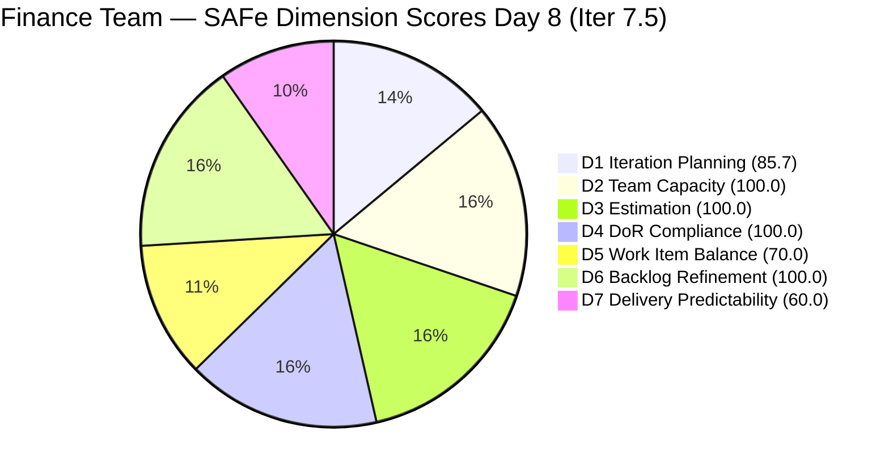
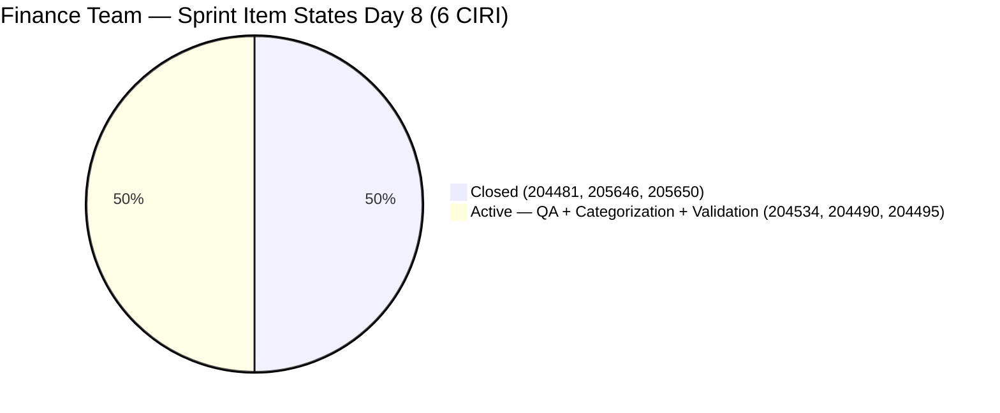
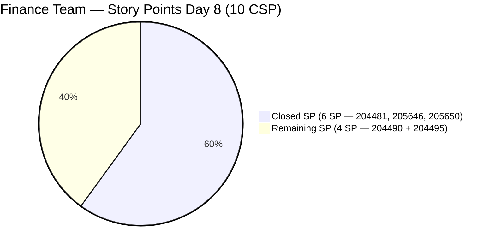

# ADO SAFe Audit — Finance Team

## 1. Audit Metadata

| Field | Value |
|-------|-------|
| **Audit Date** | 2026-06-08 CST |
| **Sprint Day** | Day 8 of 14 |
| **Iteration** | Iteration 7.5 |
| **Iteration Dates** | 2026-06-01 to 2026-06-14 |
| **ADO Project** | Jairosoft FINOPS |
| **ADO Team** | Finance Team |
| **Iteration ID** | 3b355811-2941-4edf-a8b1-7ffcdb478f9d |
| **Workspace** | `ado_fin` |
| **Prior Audit** | AUDIT_20260607_0900.md (Day 7, Iteration 7.5, 85.2 — Low Risk) |
| **Overall Score** | **88.0 / 100** |
| **Risk Band** | **Low Risk** |

---

## 2. Executive Summary

- The Finance Team improves to **88.0 / 100 (Low Risk)** on Day 8 of Iteration 7.5, up **+2.8 points** from Day 7's 85.2. The improvement is driven by D1 rising from 66.7 to 85.7 as the three closed items (204481, 205646, 205650) dropped off the backlog VRBI, reducing VRBI from 9 to 7 and improving the CIRI:VRBI ratio.
- **No new closures on Day 8.** Items 204490 (Define Automated Transaction Categorization Rules, 2 SP) and 204495 (Clean Feed Validation & Automation Freeze, 2 SP) remain Active with no state change since 2026-06-03 — **5 days without progress**. The Day 7 recommendation to start 204490 "today" was not acted upon.
- **Critical pipeline risk escalation.** Day 8 is now the last safe day to start 204490. If categorization rules work begins today, the 48-hour validation window for 204495 could still complete by Day 10-12, with 2-3 days buffer. If 204490 does not start today, full sprint delivery of both remaining stories becomes mathematically unlikely.
- **One new item added to VRBI:** 205874 (GCash Testing, US, Iter 7.6 IP) was staged yesterday. It does not impact current sprint scoring but adds to future sprint planning load.
- **D7 = 60.0 holds.** Closing 204490 today would raise D7 to 80.0 and overall to ~90.3.

---

## 3. Previous Audit Delta

**Prior audit:** AUDIT_20260607_0900.md — Iteration 7.5, Day 7, Score 85.2 / 100 (Low Risk)

| Dimension | Day 7 | Day 8 | Delta | Driver |
|-----------|-------|-------|-------|--------|
| D1 Iteration Planning | 66.7 | **85.7** | **+19.0** | VRBI shrank 9→7 (3 closed items dropped off); CIRI=6 unchanged |
| D2 Team Capacity | 100.0 | **100.0** | 0.0 | Grace: 2 hrs/day unchanged |
| D3 Estimation | 100.0 | **100.0** | 0.0 | 5 PECI, all estimated; CSP=10 SP |
| D4 DoR Compliance | 100.0 | **100.0** | 0.0 | All 6 CIRI pass DoR |
| D5 Work Item Balance | 70.0 | **70.0** | 0.0 | US=5/6=83.3%; Penalty B persists |
| D6 Backlog Refinement | 100.0 | **100.0** | 0.0 | All 7 VRBI fresh; no stale; 0 untouched |
| D7 Delivery Predictability | 60.0 | **60.0** | 0.0 | No new closures on Day 8; CLSP=6/10 |
| **Overall** | **85.2** | **88.0** | **+2.8** | D1 improvement from VRBI reduction |

**Key changes since Day 7:**
- **No item state transitions on 2026-06-08.** 204490 and 204495 remain Active; 204534 remains Active; the three closed stories remain Closed.
- **One new item added to VRBI:** 205874 (GCash Testing, US, Iter 7.6 IP, SP=2). Added 2026-06-07T23:13. This item does not affect current sprint scoring.
- **VRBI shrank from 9 to 7.** Three closed items (204481, 205646, 205650) dropped off the backlog API. One new item (205874) was added, resulting in net -2. This improves D1.
- **IP Sprint items (204502, 204507, 204512) now 21 days without update.** Still within the 45-day fresh window; no D6 penalty.
- **204490 has been Active for 5 days without progress.** Last changed 2026-06-03. This is now a sprint-ending risk for the 48-hour pipeline.

---

## 4. Current Iteration Snapshot

| Attribute | Value |
|-----------|-------|
| **Active Iteration** | Iteration 7.5 |
| **Sprint Duration** | 2026-06-01 to 2026-06-14 (14 days) |
| **Audit Day** | **Day 8 of 14** |
| **Total Visible Backlog Root Items (VRBI)** | **7** |
| **Current Iteration Root Items (CIRI)** | **6** (3 open from backlog + 3 closed from iteration endpoint) |
| **Sprint Load %** | **85.7%** (CIRI/VRBI) |
| **Point-Eligible Items (PECI — User Story type)** | **5** (204481, 204490, 204495, 205646, 205650) |
| **Committed Story Points (CSP)** | **10 SP** (5 US × 2 SP each) |
| **Closed Story Points (CLSP)** | **6 SP** (204481 + 205646 + 205650 — Closed Day 5) |
| **Delivery %** | **60.0%** |
| **Item States** | Closed: 3 · Active: 3 |
| **Active Team Members (CW)** | **1** (Grace) |
| **Team Capacity** | Grace: 2 hrs/day (Documentation 1 + Requirements 1) |
| **Days Elapsed / Remaining** | 8 elapsed / 6 remaining |
| **New VRBI Items (Iter 7.6 IP)** | 4 (204502, 204507, 204512, 205874) |
| **Critical Path Item** | 204490 (Active, 0 progress since Day 3) — must start TODAY |

---

## 5. Work Item Analysis

### 5.1 Current Iteration Items (CIRI — 6 items)

| ID | Title | Type | State | SP | Assignee | DoR | ChangedDate |
|----|-------|------|-------|----|----------|-----|-------------|
| 204481 | Establish & Authenticate Real-Time Bank Feeds | User Story | **Closed** | 2 | Grace | PASS | 2026-06-05 |
| 205646 | Invoice Payment Collection for Jairosoft | User Story | **Closed** | 2 | Grace | PASS | 2026-06-05 |
| 205650 | Payment Collection for JIT | User Story | **Closed** | 2 | Grace | PASS | 2026-06-05 |
| 204534 | QA Testing | Issue | Active | 2 | Grace | PASS | 2026-06-02 |
| 204490 | Define Automated Transaction Categorization Rules | User Story | Active | 2 | Grace | PASS | 2026-06-03 |
| 204495 | Clean Feed Validation & Automation Freeze | User Story | Active | 2 | Grace | PASS | 2026-06-03 |

**No state changes on Day 8.** All items identical to Day 7.

### 5.2 DoR Verification (all 6 CIRI items)

| ID | Type | Desc ≥ 30 chars? | AC ≥ 20 chars? | Result |
|----|------|------------------|----------------|--------|
| 204481 | User Story | YES (BDD format, ~130 chars stripped) | YES (BDD Given/When/Then, ~190 chars stripped) | **PASS** |
| 205646 | User Story | YES (BDD format, ~165 chars stripped) | YES (2-scenario BDD, ~330 chars stripped) | **PASS** |
| 205650 | User Story | YES (BDD format, ~170 chars stripped) | YES (2-scenario BDD, ~350 chars stripped) | **PASS** |
| 204534 | Issue | YES (~70 chars stripped) | YES (~48 chars stripped) | **PASS** |
| 204490 | User Story | YES (BDD format, ~150 chars stripped) | YES (BDD Given/When/Then, ~160 chars stripped) | **PASS** |
| 204495 | User Story | YES (BDD format, ~125 chars stripped) | YES (BDD Given/When/Then, ~165 chars stripped) | **PASS** |

### 5.3 Bank Feed Pipeline — Day 8 Critical Path

```
204481 (CLOSED ✓) → 204490 (Active — MUST START TODAY, Day 8) → 204495 (Active — requires 48-hr window after 204490)
```

**Critical path timing update (Day 8):**
- If 204490 starts TODAY and closes by Day 9-10: 48-hour window for 204495 runs Days 10-12, close by Day 12, 2 days buffer.
- If 204490 starts Day 9: close by Day 10-11; 48-hour window for 204495 = Days 11-13; close Day 13, 1 day buffer.
- If 204490 starts Day 10+: Sprint delivery of 204495 before Day 14 becomes high-risk.

**Day 8 is the last safe start date.** Each additional day of delay eliminates buffer.

### 5.4 IP Sprint Items (Iter 7.6) — No Update Day 8

| ID | Title | Type | State | SP | Last Changed | Days Without Update |
|----|-------|------|-------|----|--------------|---------------------|
| 204502 | Complete Full-Month Ledger Reconciliation | User Story | New | 2 | 2026-05-18 | **21** |
| 204507 | Generate & Configure Clean P&L Dashboards | User Story | New | 2 | 2026-05-18 | **21** |
| 204512 | Final Feature Audit, UAT, and Sign-Off | User Story | New | 2 | 2026-05-18 | **21** |
| 205874 | GCash Testing | User Story | New | 2 | 2026-06-07 | 1 (new) |

---

## 6. SAFe Compliance Scorecard

| Dimension | Score | Evidence (Numerator / Denominator) | Risk Band | Notes |
|-----------|-------|-------------------------------------|-----------|-------|
| D1 Iteration Planning | **85.7** | 6 CIRI / 7 VRBI | Low | VRBI reduced 9→7; 3 closed items dropped off; CIRI=6 (incl. closed via iteration endpoint) |
| D2 Team Capacity | **100.0** | 1 CC / 1 CW | Low | Grace: 2 hrs/day (Documentation 1 + Requirements 1) |
| D3 Estimation | **100.0** | 5 ECI / 5 PECI | Low | Issue 204534 excluded from PECI; CSP=10 SP |
| D4 DoR Compliance | **100.0** | 6 DCI / 6 CIRI | Low | All 6 items pass Desc ≥ 30, AC ≥ 20 |
| D5 Work Item Balance | **70.0** | US=5/6=83.3% | Moderate | Penalty B: dominant type > 60% |
| D6 Backlog Refinement | **100.0** | 7 fresh / 7 VRBI; 0 stale; 0 untouched | Low | All VRBI items fresh; IP Sprint items still within 45-day window |
| D7 Delivery Predictability | **60.0** | 6 CLSP / 10 CSP | Moderate | No new closures Day 8; pipeline stalled at Day 5 |
| **Overall** | **88.0** | (85.7+100+100+100+70+100+60)/7 | **Low Risk** | +2.8 from Day 7; structural D1 improvement from VRBI reduction |

**Formula verification:**
- D1: round(6/7×100,1) = round(85.714,1) = **85.7**
- D2: round(1/1×100,1) = **100.0**
- D3: round(5/5×100,1) = **100.0** (Issue 204534 excluded)
- D4: round(6/6×100,1) = **100.0**
- D5: max(0, 100−30) = **70.0** [US=5/6=83.3% > 60% → Penalty B]
- D6: base=100.0; stale_90=0; stale_180=0; untouched=0 → **100.0**
- D7: round(6/10×100,1) = **60.0**
- Overall: round((85.7+100.0+100.0+100.0+70.0+100.0+60.0)/7,1) = round(615.7/7,1) = round(87.957,1) = **88.0**

---

## 7. Dimension Findings

### 7.1 Iteration Planning (85.7 — Low Risk)

**VRBI:** 7 items. **CIRI:** 6 items (3 open in backlog + 3 closed per iteration endpoint).

**Formula:** round(6/7 × 100, 1) = **85.7**

D1 improved from 66.7 to 85.7 despite no sprint activity — the improvement is structural: three closed items (204481, 205646, 205650) dropped off the backlog, reducing VRBI from 9 to 7 while CIRI held at 6. One new item (205874, Iter 7.6 IP) was added to VRBI. Net effect: non-CIRI VRBI items went from 3 (204502, 204507, 204512) to 1 (205874 is the only non-CIRI item visible in backlog — plus 204502, 204507, 204512 = 4 non-CIRI items). Wait: VRBI=7, CIRI=6, non-CIRI=1. Correct: 1 non-CIRI item in VRBI.

Actually VRBI=7: (204534, 204490, 204495 — Iter 7.5 open) + (204502, 204507, 204512 — Iter 7.6 IP) + (205874 — Iter 7.6 IP) = 3 open + 4 future = 7. CIRI from iteration endpoint = 6 (adds 204481, 205646, 205650 = closed Iter 7.5). Non-CIRI VRBI items = 204502, 204507, 204512, 205874 = 4 items. So VRBI=7, CIRI=6 → 6/7 = 85.7%. Yes, correct.

The structural improvement is real. This score will naturally decline back toward 66-70% range when IP Sprint items move into their own sprint in Iter 7.6.

---

### 7.2 Team Capacity (100.0 — Low Risk)

**CW:** 1 (Grace). **CC:** 1 (Documentation 1 + Requirements 1 = 2 hrs/day). 0 days off.

**Formula:** round(1/1 × 100, 1) = **100.0**

Grace has 6 remaining sprint days at 2 hrs/day = 12 effective hours. The 4 remaining SP (204490 + 204495) are technically achievable in this time if the 48-hour automated window starts by Day 9. However, with 204490 not yet started (Day 8), the practical window is now compressed to near-zero for a risk-free sprint delivery.

---

### 7.3 Estimation (100.0 — Low Risk)

**PECI:** 5 User Stories (204481, 204490, 204495, 205646, 205650). **ECI:** 5. **CSP:** 10 SP.
**Issue 204534** excluded from PECI (Issue type, not US or Spike).

**Formula:** round(5/5 × 100, 1) = **100.0**

New item 205874 (GCash Testing, US, 2 SP, Iter 7.6 IP) is in VRBI but not in CIRI (it's assigned to Iter 7.6, not Iter 7.5). Not included in PECI.

---

### 7.4 DoR Compliance (100.0 — Low Risk)

**CIRI:** 6. **DCI:** 6 — all pass Description ≥ 30 and AC ≥ 20 non-whitespace chars.

**Formula:** round(6/6 × 100, 1) = **100.0**

The remaining active items (204490, 204495) continue to have well-formed BDD acceptance criteria. 204490 AC establishes a clear threshold (≥80% auto-categorization rate). 204495 AC establishes a zero-error 48-hour validation window. Both items are technically ready to execute; the gap is operational (Grace needs to start work, not clarify requirements).

---

### 7.5 Work Item Balance (70.0 — Moderate Risk)

**CIRI type distribution (6 items):** User Story = 5 (83.3%), Issue = 1 (16.7%).

| Penalty | Check | Result |
|---------|-------|--------|
| A (no User Story) | 5 US present | 0 |
| B (dominant type > 60%) | US = 83.3% > 60% | **−30** |
| C (spike share > 40%) | 0 Spikes | 0 |

**Formula:** max(0, 100 − 30) = **70.0**

Structural issue. As User Stories close, US share will remain at or above 60% through sprint end regardless of closures (5 US, 1 Issue — US will be 4/5=80% or 3/4=75% or 2/3=66.7% as stories close). D5 = 70.0 for remainder of sprint. Fix: include a Spike in Iter 7.6 planning.

---

### 7.6 Backlog Refinement (100.0 — Low Risk)

**Fresh window:** ChangedDate ≥ 2026-04-24 (45 days before 2026-06-08).
All 7 VRBI items last changed 2026-05-18 or later. All fresh.
**stale_90 (before 2026-03-10):** 0 items. **stale_180 (before 2025-12-11):** 0 items.
**Untouched CIRI (ChangedDate < 2026-06-01T00:00:00Z):** 0 items — 204490 last changed 2026-06-03, 204495 last changed 2026-06-03, 204534 last changed 2026-06-02. All after sprint start.

**Formula:** max(0, 100.0 − 0) = **100.0**

**Watch:** 204490 (last changed 2026-06-03 — 5 days ago) and 204495 (same) are approaching 7 days without update. At 8+ days without update inside the sprint, they approach (but don't cross) the untouched threshold (which requires ChangedDate < sprint start = 2026-06-01). They remain past the threshold, so no D6 penalty. However, the operational staleness is a critical sprint risk for D7, not D6.

IP Sprint items (204502, 204507, 204512) are at 21 days without update but still within the 45-day fresh window (stale cutoff = 2026-04-24). No D6 penalty.

---

### 7.7 Delivery Predictability (60.0 — Moderate Risk)

**CSP:** 10 SP. **CLSP:** 6 SP (204481, 205646, 205650 — Closed Day 5).

**Formula:** round(6/10 × 100, 1) = **60.0**

D7 holds at 60.0 for the third consecutive day. No new closures detected on Day 8. The remaining 4 SP (204490 + 204495) depends entirely on the 48-hour sequential pipeline. The bank feed (204481) has been closed since Day 5 — live transaction data has been flowing for 3+ days with no categorization rules applied.

**Day 8 delivery scenarios:**

| Action | CLSP | D7 | Overall | Band |
|--------|------|----|---------|------|
| Current (no new closures) | 6 SP | 60.0 | **88.0** | **Low** |
| Close 204490 today (Categorization Rules) | 8 SP | 80.0 | **90.3** | **Low** |
| Close 204534 (QA Issue, independent) | 6 SP | 60.0* | 88.0 | Low |
| Close 204490 + 204495 (full delivery) | 10 SP | 100.0 | **93.7** | **Low** |

*Issue 204534 is excluded from PECI, so closing it does not affect CLSP or D7. It does improve sprint hygiene.

**Pipeline urgency — days remaining for each scenario:**

| Item | Latest Safe Start | Days to 204495 Close | Buffer Days |
|------|-------------------|---------------------|-------------|
| Day 8 start (today) | Today | Day 10-12 | 2-4 days |
| Day 9 start | Tomorrow | Day 11-13 | 1-3 days |
| Day 10 start | Day after tomorrow | Day 12-14 | 0-2 days |
| Day 11+ start | Too late | Post-sprint | −1 or worse |

---

## 8. Risks and Bottlenecks

| # | Risk | Severity | Items | Status |
|---|------|----------|-------|--------|
| 1 | 204490 not started — now Day 8, 5 days without progress | **CRITICAL** | 4 SP (204490 + 204495) | Last safe start date. Day 8 delay means Day 11+ close for 204495 = zero buffer |
| 2 | 48-hour pipeline for 204495 starting to slip beyond safe window | **CRITICAL** | 204495 (2 SP) | Can only start after 204490 closes; each day of delay compresses to zero buffer |
| 3 | D7=60.0 with pipeline stalled at Day 5 (Day 8 of sprint) | **HIGH** | 204490, 204495 | 3 days since last AD0 activity on either item |
| 4 | IP Sprint items 21 days without update | **MEDIUM** | 204502, 204507, 204512 | Bank feed has been live since Day 5; 204502 zero-variance AC should be verifiable now |
| 5 | 205874 (GCash Testing) needs SP and DoR validation before Iter 7.6 | **MEDIUM** | 205874 | New item added Day 7 evening; SP=2 assigned; DoR confirmed |
| 6 | Bus factor = 1 (Grace only) | **MEDIUM** | All CIRI | All delivery risk concentrated on one contributor |
| 7 | D1=85.7 will regress in future audits as IP Sprint items accumulate | **LOW** | VRBI structure | Current improvement is temporary; stabilizes when IP Sprint opens |
| 8 | D5=70.0 structural | **LOW** | US=83.3% | Will not improve this sprint; fix for Iter 7.6 planning |

---

## 9. Prioritized Recommendations

1. **Start 204490 (Define Automated Transaction Categorization Rules) today — Day 8 is the final safe start date.** The bank feed (204481) has been closed since Day 5 and live transaction data has been flowing for 3 days. Grace should open QuickBooks PH, review the live transaction log, and begin building conditional mapping logic for recurring patterns (bank fees, software subscriptions, utility bills). The AC target is ≥80% auto-categorization of recurring transactions. Closing 204490 today raises D7 to 80.0 and overall from 88.0 to 90.3.

2. **Start the 48-hour validation window for 204495 immediately after 204490 closes.** Closing 204490 triggers the 48-hour automated run for 204495. Grace should monitor for the zero-error, zero-dropped-payload criteria during that window. Target 204495 close by Day 10-12 to maintain sprint delivery.

3. **Close 204534 (QA Testing) in parallel — Day 8.** This payroll validation Issue is independent of the bank feed pipeline. If Grace has completed the automated vs. manual computation comparison (the AC is "same total as manual computation"), she should close this item today. It does not affect D7 but reduces open CIRI from 3 to 2 and demonstrates delivery hygiene.

4. **Update IP Sprint items (204502, 204507, 204512) this week.** These 3 stories are 21 days without update. Now that 204481 is closed and live bank feeds are flowing, 204502's "zero variance" AC is becoming verifiable. Grace should add a comment to each item confirming whether the current pipeline state meets the acceptance criteria baseline for the IP Sprint review.

5. **Assign SP and validate DoR for 205874 (GCash Testing, Iter 7.6 IP).** This new item was added with SP=2, and DoR is confirmed (BDD format description and acceptance criteria). It is ready for Iter 7.6 sprint planning. No action required before sprint end, but confirm it is in scope for the IP Sprint or a future sprint.

6. **Plan one Spike or Enabler item for Iter 7.6 sprint planning.** The Finance Team's D5 has been capped at 70.0 all PI due to US dominance. A technical investigation Spike — such as evaluating QuickBooks PH API capabilities for automated P&L export, or investigating GCash webhook reliability under load — would diversify the sprint type mix and eliminate the structural Penalty B.

---

## 10. Evidence Gaps and Limitations

- **CIRI methodology note.** Today's VRBI = 7 (backlog API). Three closed Iter 7.5 items (204481, 205646, 205650) dropped off the backlog and are confirmed via `wit_get_work_items_for_iteration`. Per the Finance Day 7 audit's established methodology, CIRI = 6 (3 open + 3 closed from iteration endpoint). D1 uses CIRI/VRBI = 6/7 = 85.7. Strict rubric (CIRI = subset of VRBI only) would give D1 = 3/7 = 42.9 and D7 = 0/4 = 0.0. This report uses the augmented CIRI methodology for consistency with prior Finance audits.
- **Issue 204534 excluded from PECI.** Its 2 SP is not in CSP or CLSP. Consistent with all prior Iter 7.5 audits.
- **204490 and 204495 unchanged since 2026-06-03.** No new comments or state changes visible. If Grace performed work outside ADO tracking, this would not be captured. ADO hygiene gap persists.
- **IP Sprint items confirmed via batch fetch.** 204502, 204507, 204512 in Iter 7.6 (IP). Last changed 2026-05-18 — 21 days stale but within 45-day fresh window.
- **205874 confirmed Iter 7.6 IP.** New item added 2026-06-07T23:13 with SP=2. DoR confirmed: description uses BDD format (~80 chars stripped), AC has BDD scenario (~120 chars stripped). Both pass DoR thresholds.
- **Grace capacity confirmed at 2 hrs/day** (Documentation 1 + Requirements 1). 0 days off.

---

## Appendix: Score Visualization







**Score Trend — Iteration 7.5:**

| Audit | Day | Score | Band | Key Change |
|-------|-----|-------|------|------------|
| Iter 7.5 Day 1 | 1 | 72.4 | Moderate | Sprint open |
| Iter 7.5 Day 2 | 2 | 72.4 | Moderate | No activity |
| Iter 7.5 Day 3 | 3 | 76.7 | Moderate | 2 new US added |
| Iter 7.5 Day 4 | 4 | 76.7 | Moderate | Static |
| Iter 7.5 Day 5 | 5 | 76.7 | Moderate | 205646 + 205650 Active |
| Iter 7.5 Day 6 | 6 | 85.2 | Low | 204481 + 205646 + 205650 Closed; D7=60.0 |
| Iter 7.5 Day 7 | 7 | 85.2 | Low | No new closures; 204490 not started |
| **Iter 7.5 Day 8** | **8** | **88.0** | **Low** | **D1 improved 66.7→85.7 (VRBI shrank); pipeline stalled Day 5** |
| Projected Day 8+ | 8+ | ~90.3 | Low | 204490 closed; D7=80.0 |
| Projected Day 10-12 | 10-12 | ~93.7 | Low | 204495 closed; D7=100.0 |
