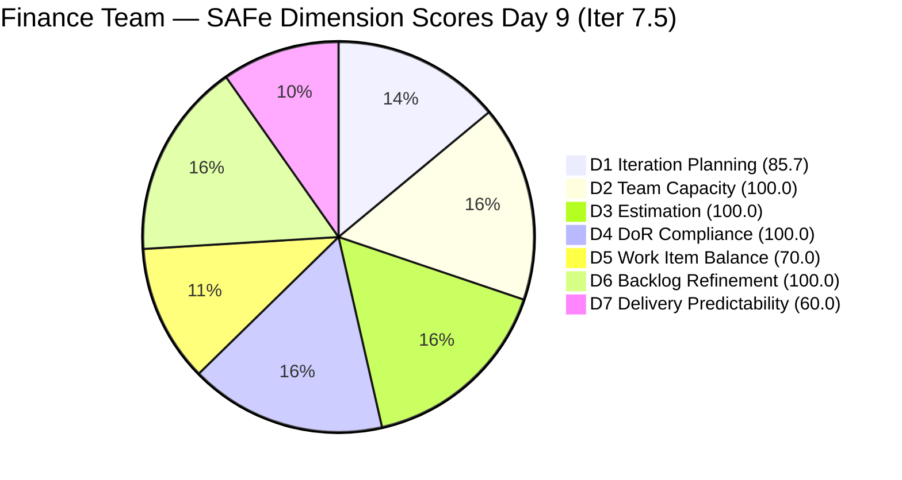
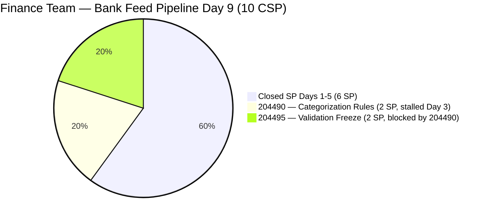
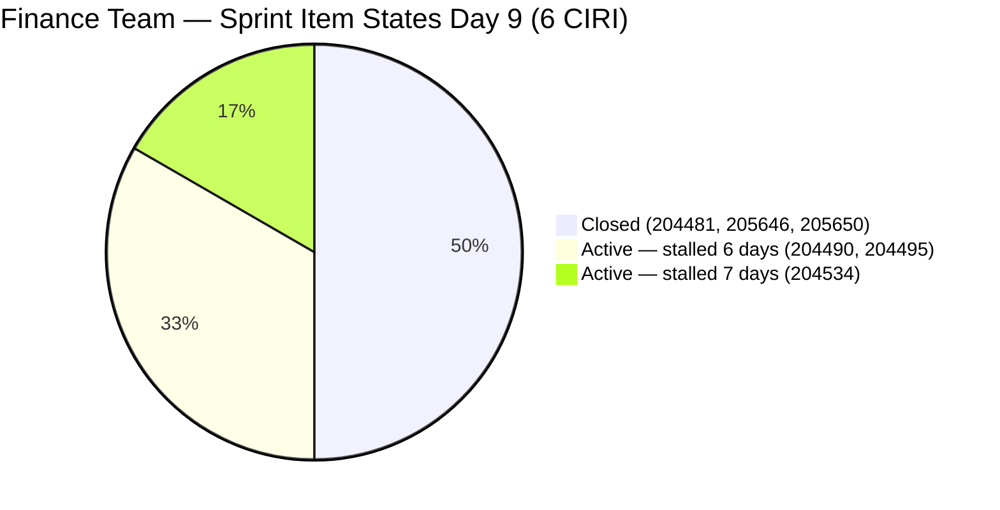

# ADO SAFe Audit — Finance Team

## 1. Audit Metadata

| Field | Value |
|-------|-------|
| **Audit Date** | 2026-06-09 CST |
| **Sprint Day** | Day 9 of 14 |
| **Iteration** | Iteration 7.5 |
| **Iteration Dates** | 2026-06-01 to 2026-06-14 |
| **ADO Project** | Jairosoft FINOPS |
| **ADO Project ID** | e0bb302f-40f9-46c3-8164-6f1acb317d63 |
| **ADO Team** | Finance Team |
| **ADO Team ID** | 1f4b45fa-82e8-4a36-aedc-6c1bc8f51070 |
| **Iteration ID** | 3b355811-2941-4edf-a8b1-7ffcdb478f9d |
| **Workspace** | `ado_fin` |
| **Prior Audit** | AUDIT_20260608_0900.md (Day 8, Iteration 7.5, 88.0 — Low Risk) |
| **Overall Score** | **88.0 / 100** |
| **Risk Band** | **Low Risk** |

---

## 2. Executive Summary

- The Finance Team holds at **88.0 / 100 (Low Risk)** on Day 9 of Iteration 7.5 — unchanged from Day 8. No new item transitions, no new VRBI additions, and no changes to the CIRI composition.
- **Critical pipeline escalation — Day 9.** Item 204490 (Define Automated Transaction Categorization Rules, 2 SP) has now been Active for **6 days without progress** (last changed 2026-06-03). Day 8's audit identified this as "the last safe start date." Day 9 has now crossed that threshold: starting 204490 today means 204495's 48-hour validation window can only complete by Day 11-13, leaving at most 1-3 days of buffer before the sprint ends on Day 14.
- **If 204490 is not started today (Day 9), full sprint delivery of 204495 becomes high-risk.** Each day of further delay reduces buffer to near zero and risks post-sprint slip for the bank feed categorization work.
- **D7 = 60.0 is the team's primary risk.** Three days have passed since the last closure (Day 5). The pipeline is stalled at the categorization rules step despite live bank feed data being available since Day 5. The bank feed (204481) has been running for 4 days — live transaction data is accumulating without categorization rules applied.
- **Structural issues remain:** D5 = 70.0 (US dominance, structural cap for sprint), D1 = 85.7 (temporary improvement from VRBI reduction, will normalize in Iter 7.6).

---

## 3. Previous Audit Delta

**Prior audit:** AUDIT_20260608_0900.md — Iteration 7.5, Day 8, Score 88.0 / 100 (Low Risk)

| Dimension | Day 8 | Day 9 | Delta | Driver |
|-----------|-------|-------|-------|--------|
| D1 Iteration Planning | 85.7 | **85.7** | 0.0 | VRBI unchanged at 7; CIRI unchanged at 6 |
| D2 Team Capacity | 100.0 | **100.0** | 0.0 | Grace: 2 hrs/day unchanged |
| D3 Estimation | 100.0 | **100.0** | 0.0 | 5 PECI, all estimated; CSP=10 SP |
| D4 DoR Compliance | 100.0 | **100.0** | 0.0 | All 6 CIRI pass DoR |
| D5 Work Item Balance | 70.0 | **70.0** | 0.0 | US=5/6=83.3%; Penalty B persists |
| D6 Backlog Refinement | 100.0 | **100.0** | 0.0 | All 7 VRBI fresh; no stale; 0 untouched |
| D7 Delivery Predictability | 60.0 | **60.0** | 0.0 | No new closures Day 9; pipeline stalled Day 5 |
| **Overall** | **88.0** | **88.0** | **0.0** | Static day; no ADO activity detected |

**Key changes since Day 8:**
- **No changes detected.** Items 204490 and 204495 remain Active with last changed 2026-06-03. 204534 remains Active with last changed 2026-06-02. No new VRBI items added. No state transitions.
- **Pipeline inactivity window extends to 6 days.** 204490 has had no ADO activity since 2026-06-03T01:32. 204495 same. If work is happening outside ADO, it is not tracked.

---

## 4. Current Iteration Snapshot

| Attribute | Value |
|-----------|-------|
| **Active Iteration** | Iteration 7.5 |
| **Sprint Duration** | 2026-06-01 to 2026-06-14 (14 days) |
| **Audit Day** | **Day 9 of 14** |
| **Total Visible Backlog Root Items (VRBI)** | **7** |
| **Current Iteration Root Items (CIRI)** | **6** (3 open from backlog + 3 closed from iteration endpoint) |
| **Sprint Load %** | **85.7%** (CIRI/VRBI) |
| **Point-Eligible Items (PECI — User Story type)** | **5** (204481, 204490, 204495, 205646, 205650) |
| **Committed Story Points (CSP)** | **10 SP** |
| **Closed Story Points (CLSP)** | **6 SP** (204481 + 205646 + 205650 — Closed Day 5) |
| **Delivery %** | **60.0%** |
| **Item States** | Closed: 3 · Active: 3 |
| **Active Team Members (CW)** | **1** (Grace) |
| **Team Capacity** | Grace: 2 hrs/day (Documentation 1 + Requirements 1) |
| **Days Elapsed / Remaining** | 9 elapsed / 5 remaining |
| **New VRBI Items (Iter 7.6 IP)** | 4 (204502, 204507, 204512, 205874) |
| **Critical Path Item** | 204490 (Active, 0 progress since Day 3) — **6 days stalled** |
| **Pipeline Status** | CRITICALLY DELAYED — Day 9 is last viable start date for 204490 |

---

## 5. Work Item Analysis

### 5.1 Current Iteration Items (CIRI — 6 items)

| ID | Title | Type | State | SP | Assignee | DoR | ChangedDate |
|----|-------|------|-------|----|----------|-----|-------------|
| 204481 | Establish & Authenticate Real-Time Bank Feeds | User Story | **Closed** | 2 | Grace | PASS | 2026-06-05 |
| 205646 | Invoice Payment Collection for Jairosoft | User Story | **Closed** | 2 | Grace | PASS | 2026-06-05 |
| 205650 | Payment Collection for JIT | User Story | **Closed** | 2 | Grace | PASS | 2026-06-05 |
| 204534 | QA Testing | Issue | Active | 2 | Grace | PASS | 2026-06-02 |
| 204490 | Define Automated Transaction Categorization Rules | User Story | **Active** | 2 | Grace | PASS | **2026-06-03 (6 days ago)** |
| 204495 | Clean Feed Validation & Automation Freeze | User Story | **Active** | 2 | Grace | PASS | **2026-06-03 (6 days ago)** |

**No state changes detected on Day 9.** Pipeline status: identical to Day 8.

### 5.2 Bank Feed Pipeline — Day 9 Status (CRITICAL)

```
204481 (CLOSED ✓ Day 5) → 204490 (Active — STALLED 6 DAYS) → 204495 (Active — WAITING)
                                        ↑
                               MUST START TODAY (Day 9)
                               Last viable start date
```

**Critical path timing analysis (Day 9):**

| Start Date | 204490 Target Close | 204495 Window | 204495 Close | Buffer |
|------------|---------------------|---------------|--------------|--------|
| Day 9 (today) | Day 10-11 | Days 11-13 | Day 13 | **1 day** |
| Day 10 | Day 11-12 | Days 12-14 | Day 14 | **0 days** |
| Day 11+ | Day 12-13 | Day 13-15 | **Post-sprint** | **Slip** |

Starting 204490 on Day 9 leaves 1 day of buffer for 204495 to close by sprint end. Any further delay means 204495 must close on Day 14 (the last day) with zero tolerance for issues, or slips to a future sprint.

The bank feed (204481) has been closed for 4 days. Live transaction data has been accumulating since June 5 without categorization rules applied — the uncategorized transaction backlog is growing daily.

### 5.3 DoR Verification (unchanged from Day 8)

All 6 CIRI items confirmed passing DoR: Desc ≥ 30 chars, AC ≥ 20 chars. 204490 and 204495 use well-formed BDD acceptance criteria. Requirements are clear — the gap is execution, not readiness.

### 5.4 IP Sprint Items (Iter 7.6) — No Update Day 9

| ID | Title | Type | State | SP | Last Changed | Days Without Update |
|----|-------|------|-------|----|--------------|---------------------|
| 204502 | Complete Full-Month Ledger Reconciliation | User Story | New | 2 | 2026-05-18 | **22** |
| 204507 | Generate & Configure Clean P&L Dashboards | User Story | New | 2 | 2026-05-18 | **22** |
| 204512 | Final Feature Audit, UAT, and Sign-Off | User Story | New | 2 | 2026-05-18 | **22** |
| 205874 | GCash Testing | User Story | New | 2 | 2026-06-07 | 2 |

**Watch:** 204502, 204507, 204512 are at 22 days without update — approaching the 45-day stale window (current cutoff: 2026-04-25). They cross the window at 45 days from 2026-05-18, which is 2026-07-02. No D6 penalty today.

---

## 6. SAFe Compliance Scorecard

| Dimension | Score | Evidence (Numerator / Denominator) | Risk Band | Notes |
|-----------|-------|-------------------------------------|-----------|-------|
| D1 Iteration Planning | **85.7** | 6 CIRI / 7 VRBI | Low | VRBI unchanged; CIRI=6 (3 open + 3 closed via iteration endpoint) |
| D2 Team Capacity | **100.0** | 1 CC / 1 CW | Low | Grace: 2 hrs/day (Documentation 1 + Requirements 1) |
| D3 Estimation | **100.0** | 5 ECI / 5 PECI | Low | Issue 204534 excluded from PECI; CSP=10 SP |
| D4 DoR Compliance | **100.0** | 6 DCI / 6 CIRI | Low | All 6 items pass Desc ≥ 30, AC ≥ 20 |
| D5 Work Item Balance | **70.0** | US=5/6=83.3% | Moderate | Penalty B: dominant type > 60%; structural |
| D6 Backlog Refinement | **100.0** | 7 fresh / 7 VRBI; 0 stale; 0 untouched | Low | All VRBI items fresh; 0 untouched CIRI |
| D7 Delivery Predictability | **60.0** | 6 CLSP / 10 CSP | Moderate | No new closures Day 9; pipeline stalled since Day 5 |
| **Overall** | **88.0** | (85.7+100+100+100+70+100+60)/7 | **Low Risk** | Static; identical to Day 8 |

**Formula verification:**
- D1: round(6/7×100,1) = **85.7**
- D2: round(1/1×100,1) = **100.0**
- D3: round(5/5×100,1) = **100.0** (Issue 204534 excluded)
- D4: round(6/6×100,1) = **100.0**
- D5: max(0, 100−30) = **70.0** [US=5/6=83.3% > 60% → Penalty B]
- D6: base=100.0; stale_90=0; stale_180=0; untouched=0 → **100.0**
- D7: round(6/10×100,1) = **60.0**
- Overall: round((85.7+100.0+100.0+100.0+70.0+100.0+60.0)/7,1) = round(615.7/7,1) = **88.0**

---

## 7. Dimension Findings

### 7.1 Iteration Planning (85.7 — Low Risk)

**VRBI:** 7 items. **CIRI:** 6 items (3 open + 3 closed per iteration endpoint).

**Formula:** round(6/7 × 100, 1) = **85.7**

Unchanged from Day 8. No new VRBI additions. The single non-CIRI VRBI item remains the Iter 7.6 IP cluster (204502, 204507, 204512 = 3 items) + 205874 (1 item) = 4 non-CIRI items. Wait: VRBI = 7 total = 3 open Iter 7.5 + 4 future = 7. CIRI = 6 (augmented). D1 = 6/7 = 85.7.

This score will regress in Iter 7.6 when the IP Sprint opens and the 4 IP items become the new sprint's CIRI.

### 7.2 Team Capacity (100.0 — Low Risk)

**CW:** 1 (Grace). **CC:** 1 (Documentation 1 + Requirements 1 = 2 hrs/day). 0 days off.

**Formula:** round(1/1 × 100, 1) = **100.0**

Grace has 5 remaining sprint days at 2 hrs/day = 10 effective hours. The 4 open SP (204490 + 204495) requires: 204490 work + 48-hour automated validation window for 204495. The 48-hour window for 204495 is automated (system-driven, not manual labor), so Grace's capacity constraint is primarily for 204490 setup work. If Grace spends 2 hours today on 204490, closing by Day 10, the 48-hour window for 204495 runs Days 10-12, targeting close by Day 12-13 with 1-2 days buffer.

### 7.3 Estimation (100.0 — Low Risk)

**PECI:** 5 User Stories. **ECI:** 5. **CSP:** 10 SP.
Issue 204534 (2 SP) excluded from PECI per consistent methodology.

**Formula:** round(5/5 × 100, 1) = **100.0**

### 7.4 DoR Compliance (100.0 — Low Risk)

**CIRI:** 6. **DCI:** 6 — all pass. Confirmed from Day 8 batch fetch. No changes to any CIRI item's Description or AC fields detected.

**Formula:** round(6/6 × 100, 1) = **100.0**

### 7.5 Work Item Balance (70.0 — Moderate Risk)

**CIRI type distribution (6 items):** User Story = 5 (83.3%), Issue = 1 (16.7%).

| Penalty | Check | Result |
|---------|-------|--------|
| A (no User Story) | 5 US present | 0 |
| B (dominant type > 60%) | US = 83.3% > 60% | **−30** |
| C (spike share > 40%) | 0 Spikes | 0 |

**Formula:** max(0, 100 − 30) = **70.0**

Locked for the sprint. As US close, US share stays above 60%: 4/5=80%, 3/4=75%, 2/3=66.7%. D5 structural cap = 70.0 for all remaining sprint days. Fix: add one Spike or Enabler to Iter 7.6 planning.

### 7.6 Backlog Refinement (100.0 — Low Risk)

**Fresh window:** ChangedDate ≥ 2026-04-25 (45 days before 2026-06-09).
All 7 VRBI items last changed 2026-05-18 (IP Sprint items) or later. All fresh.
**Untouched CIRI:** 0 items — 204490 last changed 2026-06-03, 204495 last changed 2026-06-03, 204534 last changed 2026-06-02. All after sprint start date (2026-06-01).

**Formula:** max(0, 100.0 − 0) = **100.0**

**Watch:** 204490 (6 days without update) and 204495 (6 days without update) are approaching a practical operational staleness threshold. They do not trigger the untouched CIRI penalty (ChangedDate < sprint start) because their last updates were on Days 2-3. However, 6 days of inactivity on the critical pipeline is a strong operational signal.

IP Sprint items (204502, 204507, 204512) at 22 days without update — still within the 45-day fresh window (threshold: 2026-04-25). No D6 penalty. Stale_90 cutoff = 2026-03-11 — all items are well within the window.

### 7.7 Delivery Predictability (60.0 — Moderate Risk)

**CSP:** 10 SP. **CLSP:** 6 SP (204481, 205646, 205650 — Closed Day 5).

**Formula:** round(6/10 × 100, 1) = **60.0**

Day 9 of 14. D7 holds at 60.0 for the fourth consecutive day (Days 6-9). No new closures. The 48-hour sequential pipeline for 204495 requires 204490 to close first — and 204490 has not been started.

**Day 9 delivery scenarios:**

| Action | CLSP | D7 | Overall | Band |
|--------|------|----|---------|------|
| Current (no new closures) | 6 SP | 60.0 | **88.0** | **Low** |
| Close 204490 today | 8 SP | 80.0 | **90.3** | **Low** |
| Close 204534 (independent QA) | 6 SP | 60.0 | 88.0 | Low |
| Close 204490 + 204495 (full delivery) | 10 SP | 100.0 | **93.7** | **Low** |

*204534 is excluded from PECI (Issue type) — closing it does not affect D7 or CLSP.*

**Sprint close scenarios:**

| Scenario | By Day | Score | Notes |
|----------|--------|-------|-------|
| 204490 starts Day 9, closes Day 10 | Day 12 close for 204495 | ~93.7 | Best case; 2-day buffer |
| 204490 starts Day 10, closes Day 11 | Day 13 close for 204495 | ~93.7 | 1-day buffer |
| 204490 starts Day 11+ | Post-sprint for 204495 | ~88.0-90.3 | Sprint miss |

---

## 8. Risks and Bottlenecks

| # | Risk | Severity | Items | Status |
|---|------|----------|-------|--------|
| 1 | 204490 stalled 6 days — Day 9 is last viable start date | **CRITICAL** | 4 SP (204490 + 204495) | 6 days without ADO update since 2026-06-03 |
| 2 | 48-hour pipeline for 204495 cannot start until 204490 closes | **CRITICAL** | 2 SP (204495) | Zero-tolerance close window from Day 9 start |
| 3 | D7=60.0 with pipeline stalled Day 5 → Day 9 (4 days) | **HIGH** | 204490, 204495 | No progress visible in ADO |
| 4 | Bank feed live 4 days without categorization rules | **HIGH** | 204490 | Uncategorized transactions accumulating since June 5 |
| 5 | IP Sprint items 22 days without update | **MEDIUM** | 204502, 204507, 204512 | Bank feed has been live — 204502 zero-variance AC may now be verifiable |
| 6 | 204534 (QA Testing) 7 days Active without update | **MEDIUM** | 204534 | Payroll validation Issue; independent of bank feed pipeline |
| 7 | Bus factor = 1 (Grace only) | **MEDIUM** | All CIRI | All delivery risk concentrated on one contributor |
| 8 | D5=70.0 structural | **LOW** | US=83.3% | Fix for Iter 7.6 planning (add 1 Spike) |

---

## 9. Prioritized Recommendations

1. **Start 204490 (Define Automated Transaction Categorization Rules) immediately — today is Day 9, the last viable start date.** The bank feed has been closed since Day 5, and 4 days of live transaction data (June 5-9) has accumulated without categorization rules. Grace should open QuickBooks PH, review the live transaction log (June 5-9), identify the 3-5 highest-frequency recurring patterns (bank fees, software subscriptions, utility bills), build the conditional mapping rules, and validate that auto-categorization rate meets the ≥80% AC threshold. Close 204490 today or by Day 10 to preserve the pipeline window. Closing 204490 today immediately raises D7 from 60.0 to 80.0 and overall from 88.0 to 90.3.

2. **Begin the 48-hour validation window for 204495 immediately after 204490 closes.** Once 204490 is closed, 204495's automated 48-hour validation run begins. Grace should configure monitoring for the zero-error, zero-dropped-payload criteria. If 204490 closes Day 9: target 204495 close on Day 11-12. If 204490 closes Day 10: target 204495 close on Day 12-13. Closing both completes D7=100.0 and overall=93.7.

3. **Close 204534 (QA Testing) independently — Day 9.** This payroll validation Issue is independent of the bank feed pipeline. If Grace has completed automated vs. manual computation comparison (AC: "same total as manual computation"), close this item today. It reduces open CIRI from 3 to 2 and demonstrates delivery hygiene, though it does not affect CLSP or D7 (Issue type excluded from PECI).

4. **Update IP Sprint items (204502, 204507, 204512) with a status comment.** These 3 items are at 22 days without update. Now that 204481 is closed and live bank feeds have been running for 4 days, 204502's zero-variance AC is beginning to be verifiable. Grace should add a progress comment to each item confirming whether the current pipeline state is on track for IP Sprint review.

5. **Add a Spike or Enabler to Iter 7.6 sprint planning to resolve D5 structural cap.** The Finance Team has had D5=70.0 all PI7 due to User Story dominance. A technical Spike — evaluating QuickBooks PH API for automated P&L export, or investigating GCash webhook reliability — would drop US share below 60% and recover D5 to 100.0, adding approximately 4.3 points to the overall score.

---

## 10. Evidence Gaps and Limitations

- **CIRI methodology (augmented).** CIRI=6 includes 3 closed Iter 7.5 items confirmed via iteration endpoint (204481, 205646, 205650). Strict backlog-only CIRI = 3 (204534, 204490, 204495). D1 under strict rubric = 3/7 = 42.9, D7 = 0/4 = 0.0, Overall ≈ 64.7. This report uses augmented methodology for consistency with prior Finance audits.
- **Issue 204534 excluded from PECI** per consistent methodology (Issue type, not US or Spike).
- **204490 and 204495 unchanged since 2026-06-03.** If Grace performed work outside ADO (locally, in QuickBooks PH directly) without updating ADO, it would not be captured. ADO hygiene gap.
- **IP Sprint item staleness confirmed.** 204502, 204507, 204512 confirmed at 22 days without update via batch fetch.
- **Grace capacity confirmed at 2 hrs/day** (Documentation 1 + Requirements 1). No days off.

---

## Appendix: Score Visualization







**Score Trend — Iteration 7.5:**

| Audit | Day | Score | Band | Key Change |
|-------|-----|-------|------|------------|
| Iter 7.5 Day 1 | 1 | 72.4 | Moderate | Sprint open |
| Iter 7.5 Day 2 | 2 | 72.4 | Moderate | No activity |
| Iter 7.5 Day 3 | 3 | 76.7 | Moderate | 2 new US added |
| Iter 7.5 Day 4 | 4 | 76.7 | Moderate | Static |
| Iter 7.5 Day 5 | 5 | 76.7 | Moderate | 205646 + 205650 Active |
| Iter 7.5 Day 6 | 6 | 85.2 | Low | 204481 + 205646 + 205650 Closed; D7=60.0 |
| Iter 7.5 Day 7 | 7 | 85.2 | Low | No new closures; 204490 not started |
| Iter 7.5 Day 8 | 8 | 88.0 | Low | D1 improved 66.7→85.7 (VRBI shrank) |
| **Iter 7.5 Day 9** | **9** | **88.0** | **Low** | **Static; 204490 stalled Day 6; pipeline critical** |
| Projected Day 9-10 | 9-10 | ~90.3 | Low | 204490 closed; D7=80.0 |
| Projected Day 11-13 | 11-13 | ~93.7 | Low | 204495 closed; D7=100.0 |
