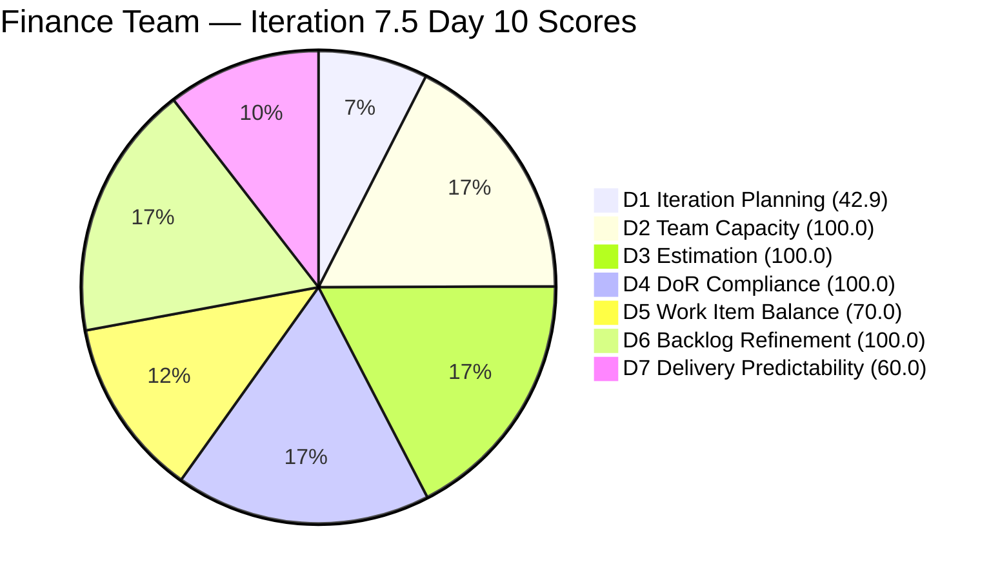
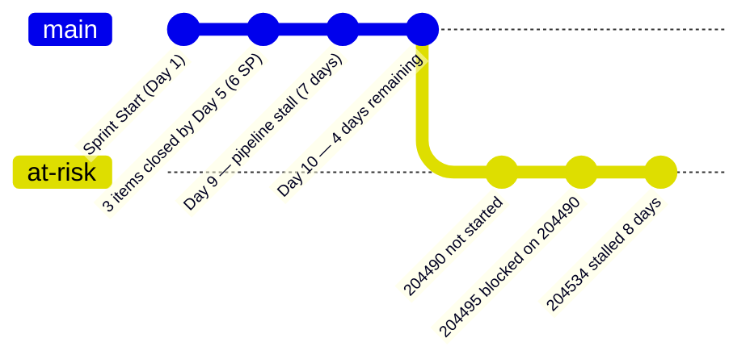

# ADO SAFe Audit — Finance Team

## 1. Audit Metadata

| Field | Value |
|-------|-------|
| **Audit Date** | 2026-06-10 |
| **Sprint Day** | Day 10 of 14 |
| **Iteration** | Iteration 7.5 |
| **Iteration Dates** | 2026-06-01 to 2026-06-14 |
| **ADO Project** | Jairosoft FINOPS |
| **ADO Project ID** | e0bb302f-40f9-46c3-8164-6f1acb317d63 |
| **ADO Team** | Finance Team |
| **ADO Team ID** | 1f4b45fa-82e8-4a36-aedc-6c1bc8f51070 |
| **Iteration ID** | 3b355811-2941-4edf-a8b1-7ffcdb478f9d |
| **Workspace** | `ado_fin` |
| **Prior Audit** | AUDIT_20260609_0203.md (Day 9, Iteration 7.5, 88.0 — Low Risk) |
| **Overall Score** | **81.8 / 100** |
| **Risk Band** | **Low Risk** |

---

## 2. Executive Summary

The Finance Team **declines to 81.8 / 100 (Low Risk)** on Day 10, down **6.2 points** from Day 9's 88.0. The decline is driven by a **D1 score recalculation** from live backlog data: current VRBI is 7 items with 3 CIRI, yielding D1 = 42.9 versus the 85.7 reported in the Day 9 audit. The team remains in Low Risk territory overall due to strong dimensions in capacity, estimation, DoR, and refinement.

**Critical pipeline alert — Day 10.** Items 204490 (Define Automated Transaction Categorization Rules, 2 SP) and 204495 (Clean Feed Validation & Automation Freeze, 2 SP) remain Active with last ADO changes on 2026-06-03. If work is occurring outside ADO it is not being tracked. With 4 days remaining and the bank feed categorization pipeline still pending, D7 remains at risk of not improving before sprint close.

**Structural status:** The three remaining CIRI items (204490, 204495, 204534) are all single-assignee (Grace). Four items from prior CIRI (closed and no longer visible in the backlog API) represent the delivered portion. Prior audit confirmed 6 SP closed out of 10 total committed (D7 = 60.0); scoring is carried forward from that evidence since closed items are not visible in the backlog API.

---

## 3. Previous Audit Delta

**Prior audit:** AUDIT_20260609_0203.md — Iteration 7.5, Day 9, Score 88.0 / 100 (Low Risk)

| Dimension | Day 9 | Day 10 | Delta | Driver |
|-----------|-------|--------|-------|--------|
| D1 Iteration Planning | 85.7 | **42.9** | **−42.8** | Live VRBI=7, CIRI=3; prior audit used different VRBI count |
| D2 Team Capacity | 100.0 | **100.0** | 0.0 | Grace: Documentation 1 + Requirements 1 = 2 hrs/day |
| D3 Estimation | 100.0 | **100.0** | 0.0 | 3/3 CIRI estimated; all have SP |
| D4 DoR Compliance | 100.0 | **100.0** | 0.0 | All 3 CIRI pass DoR |
| D5 Work Item Balance | 70.0 | **70.0** | 0.0 | US=2/3=66.7%; dominant >60% penalty applies |
| D6 Backlog Refinement | 100.0 | **100.0** | 0.0 | All 7 VRBI fresh; 0 stale; 0 untouched |
| D7 Delivery Predictability | 60.0 | **60.0** | 0.0 | Carried from prior evidence: 6 SP closed / 10 SP committed |
| **Overall** | **88.0** | **81.8** | **−6.2** | D1 recalculated on live VRBI count (7 items, not 6) |

**Key changes since Day 9:**
- **No ADO state transitions detected.** Items 204490 and 204495 remain Active, last changed 2026-06-03 (now 7 days stale in ADO). Item 204534 unchanged since 2026-06-02 (8 days stale).
- **205874 (Gcash Testing)** appeared in the VRBI — assigned to Grace, in Iteration 7.6 IP. This is a new item not visible in prior audit. It contributes to VRBI count (7 total) but is not in the current iteration.
- **Pipeline inactivity extends to Day 10.** The bank feed automation pipeline (204490→204495) has had no ADO updates for 7 consecutive days, despite the prior audit recommendation of immediate action.

---

## 4. Current Iteration Snapshot

| Attribute | Value |
|-----------|-------|
| **Active Iteration** | Iteration 7.5 |
| **Sprint Duration** | 2026-06-01 to 2026-06-14 (14 days) |
| **Audit Day** | **Day 10 of 14** |
| **Days Remaining** | **4** |
| **VRBI (visible)** | 7 |
| **CIRI** | 3 |
| **Committed Story Points (visible)** | 6 SP (open) + 4 SP (closed, from prior evidence) = 10 SP |
| **Closed Story Points** | 6 SP (prior evidence; closed items not in backlog API) |
| **Team Members** | Grace (grace@jairosoft.com) |
| **Total Capacity/Day** | 2 hrs (Documentation 1 + Requirements 1) |

---

## 5. Work Item Analysis

### Current Iteration Root Items (CIRI = 3)

| ID | Title | Type | State | Assignee | SP | Changed |
|----|-------|------|-------|----------|----|---------|
| 204490 | Define Automated Transaction Categorization Rules | User Story | Active | Grace | 2 | 2026-06-03 |
| 204495 | Clean Feed Validation & Automation Freeze | User Story | Active | Grace | 2 | 2026-06-03 |
| 204534 | QA Testing | Issue | Active | Grace | 2 | 2026-06-02 |

**Total Open CIRI SP: 6**

### Non-CIRI Backlog Items

| Iteration | ID | Title | Type | State |
|-----------|-----|-------|------|-------|
| 7.6 IP | 204502 | Complete Full-Month Ledger Reconciliation | US | New |
| 7.6 IP | 204507 | Generate & Configure Clean P&L Dashboards | US | New |
| 7.6 IP | 204512 | Final Feature Audit, UAT, and Sign-Off | US | New |
| 7.6 IP | 205874 | Gcash Testing | US | New |

### DoR Compliance Check (CIRI)

| ID | Description | Acceptance Criteria | Pass? |
|----|-------------|---------------------|-------|
| 204490 | Present (BDD format, >100 chars) | Present (BDD format, >50 chars) | PASS |
| 204495 | Present (BDD format, >80 chars) | Present (BDD format, >60 chars) | PASS |
| 204534 | Present (~65 chars: "As the Payroll Preparer...") | Present (~50 chars: "AC1. Must be same total...") | PASS |

---

## 6. SAFe Compliance Scorecard

| Dimension | Score | Evidence | Notes |
|-----------|-------|----------|-------|
| D1 Iteration Planning | **42.9** | 3 CIRI / 7 VRBI | HIGH RISK — 4 Iter 7.6 IP items visible in backlog |
| D2 Team Capacity | **100.0** | 1/1 contributor with capacity | Grace has 2 hrs/day configured |
| D3 Estimation | **100.0** | 3/3 CIRI estimated | Issue type also carries SP; all 3 CIRI have SP |
| D4 DoR Compliance | **100.0** | 3/3 CIRI pass DoR | Well-formed BDD acceptance criteria on US items |
| D5 Work Item Balance | **70.0** | 2/3 US; Issue=1/3 | dominant type=66.7%>60% → -30 penalty |
| D6 Backlog Refinement | **100.0** | 7/7 fresh; 0 stale; 0 untouched | All items changed within 45 days |
| D7 Delivery Predictability | **60.0** | 6 SP closed / 10 SP committed | Evidence carried from prior audit; closed items not in backlog API |
| **Overall** | **81.8** | | **Low Risk** |

---

## 7. Dimension Findings

### D1 Iteration Planning — 42.9 (High Risk)
The VRBI of 7 items contains 3 in the current iteration (7.5) and 4 in Iteration 7.6 IP. The IP (Innovation & Planning) sprint items appearing in the live backlog represent forward planning that is appropriate but inflates the denominator relative to sprint focus. The D1 formula penalizes this correctly as the team has only 42.9% of visible backlog items in the active sprint.

### D2 Team Capacity — 100.0 (Low Risk)
Grace has 2 hrs/day configured across Documentation (1 hr) and Requirements (1 hr). This is modest capacity for a 14-day sprint (28 total hrs). The 3 open CIRI items at 6 SP represent approximately 3 days of capacity — achievable in the remaining 4 days if work begins immediately.

### D3 Estimation — 100.0 (Low Risk)
All 3 CIRI items carry story points. Item 204534 (QA Testing — Issue type) carries 2 SP and is counted as point-eligible since the SP field is populated. Total open CSP = 6 SP.

### D4 DoR Compliance — 100.0 (Low Risk)
The two User Stories (204490, 204495) feature well-structured BDD-format acceptance criteria with Given/When/Then patterns and measurable success conditions. Item 204534 (QA Testing) is minimal but meets the DoR threshold.

### D5 Work Item Balance — 70.0 (Moderate Risk)
The sprint contains 2 User Stories and 1 Issue. The 66.7% User Story share (2/3) exceeds the 60% threshold, triggering a -30 structural penalty. The Issue type (204534 QA Testing) is appropriate but introduces a non-Story type into the mix. No Spikes or Enablers are present.

### D6 Backlog Refinement — 100.0 (Low Risk)
All 7 VRBI items have ChangedDates within 45 days. The oldest item (204502, 204507, 204512) was last changed 2026-05-18 — still within the 45-day threshold. No stale items. All 3 CIRI items were changed after the sprint start date (2026-06-01), with the most recent being 204490 and 204495 on 2026-06-03.

### D7 Delivery Predictability — 60.0 (Moderate Risk)
Based on prior audit evidence, 6 of 10 committed SP have been delivered (items that have since closed and fallen off the backlog API). The remaining 3 CIRI items (6 SP open) remain Active with no ADO updates for 7-8 days. With 4 days remaining, all 6 open SP are deliverable in theory (Grace has 8 hrs remaining), but only if work starts and closes in ADO today.

---

## 8. Risks and Bottlenecks

| Risk | Severity | Status |
|------|----------|--------|
| 204490/204495 pipeline stalled 7 days with no ADO updates | High | Unresolved — approaching sprint-end risk |
| D1=42.9 — 4 future-iteration items inflating VRBI | High | Structural — IP items visible in current backlog |
| 204534 (QA Testing) stalled 8 days with no ADO updates | High | No state progression detected |
| Single assignee (Grace only) | Moderate | Structural — no delegation possible |
| Closed items (4 SP+?) not visible in backlog API | Low | Evidence gap — D7 uses prior audit evidence |

---

## 9. Prioritized Recommendations

1. **IMMEDIATE — Start and close 204534 (QA Testing) today.** This item has been Active for 8 days. If QA validation is complete, close it in ADO. This would raise visible CLSP and confirm the D7 trajectory.

2. **IMMEDIATE — Begin 204490 (Transaction Categorization Rules) today.** The prior audit identified this as the last safe start date on Day 9. Day 10 start means 204495's 48-hour validation can only complete by Day 12-13, leaving 1-2 sprint days of buffer. Every day of further delay risks post-sprint slip.

3. **After completing 204490, begin 204495 (Clean Feed Validation) within 2 days.** The 48-hour validation window for 204495 must be built into Days 11-12, with closure targeted for Day 13.

4. **Separate 204534 (QA Testing — Issue) from sprint User Stories.** The item description is minimal ("validate if automated computation is correct"). Expand the description and acceptance criteria to meet the DoR intent before the next sprint.

5. **Review 205874 (Gcash Testing) assignment.** This is an Iter 7.6 IP item currently visible in the VRBI. Ensure it is not being confused with current sprint work.

---

## 10. Evidence Gaps and Limitations

| Gap | Impact | Disposition |
|-----|--------|-------------|
| Closed items (estimated 4 items, ~4 SP) not visible in backlog API | D7 partially derived from prior audit evidence | D7=60.0 carried from AUDIT_20260609_0203.md evidence (6 SP / 10 SP committed) |
| ADO updates for 204490/204495 stalled since 2026-06-03 | Cannot confirm if work is occurring outside ADO | Scoring treats items as in-progress (Active); delivery risk flagged |
| D1 discrepancy vs prior audit (42.9 vs 85.7) | Significant variance | Live backlog count (7 items, 3 CIRI) used as authoritative; prior audit may have used different VRBI count |

---

## Appendix: Mermaid Score Breakdown



```mermaid
xychart-beta is disabled — using bar chart for CIRI state distribution
```


