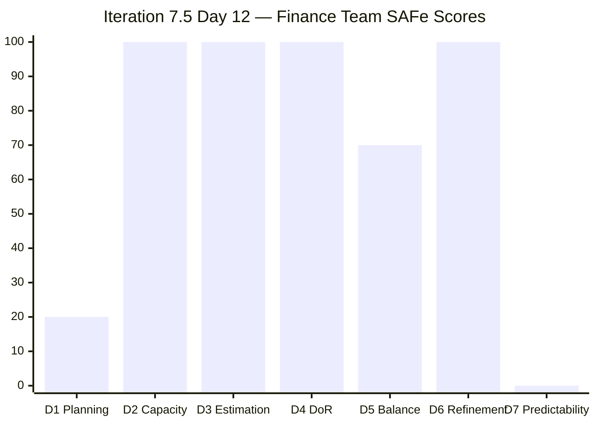
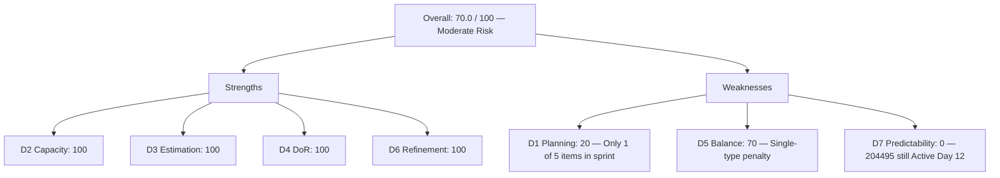

# ADO SAFe Audit — Finance Team

## 1. Audit Metadata

| Field | Value |
|-------|-------|
| **Audit Date** | 2026-06-12 (Friday) — Day 12 of 14 |
| **Timezone** | PHT (UTC+8) |
| **Iteration** | Iteration 7.5 |
| **Iteration Dates** | 2026-06-01 to 2026-06-14 |
| **Sprint Day** | Day 12 — 2 days remaining before sprint close |
| **ADO Project** | Jairosoft FINOPS |
| **ADO Project ID** | e0bb302f-40f9-46c3-8164-6f1acb317d63 |
| **ADO Team** | Finance Team |
| **ADO Team ID** | 1f4b45fa-82e8-4a36-aedc-6c1bc8f51070 |
| **Iteration ID** | 3b355811-2941-4edf-a8b1-7ffcdb478f9d |
| **Workspace** | `ado_fin` |
| **Prior Audit** | AUDIT_20260610_0204.md (Day 10, Iteration 7.5, 81.8 — Low Risk) |
| **Overall Score** | **70.0 / 100** |
| **Risk Band** | **Moderate Risk** |

---

## 2. Executive Summary

The Finance Team **drops to 70.0 / 100 (Moderate Risk)** on Day 12 of Iteration 7.5, down **11.8 points** from Day 10's 81.8 (Low Risk). The team crosses out of Low Risk territory on the final working days of the sprint.

The key driver is **D1 (Iteration Planning)**: the VRBI is now 5 items, with only 1 in the current iteration (item 204495, "Clean Feed Validation & Automation Freeze"). The prior Day 10 audit used a VRBI of 7 items with 3 CIRI; today's live data shows 5 VRBI with 1 CIRI. Items 204490 and 204534 (which were Active CIRI in Day 10) are no longer visible in the current backlog API — they may have been closed and left the backlog, or were moved to another iteration.

**The single remaining CIRI item (204495)** is in "Active" state with last ADO change on 2026-06-03 — 9 days without an update. The bank feed validation pipeline has been stalled since Day 3 of the sprint with no documented progress. Grace is the sole contributor and has configured capacity (2 hr/day).

**D7 (Delivery Predictability) scores 0.0**: committed SP = 2 (item 204495 only), and this item is not closed. If the prior audit's carry-forward of 6 SP closed / 10 SP committed is still valid, it suggests items that were closed are now invisible (as expected in ADO). However, the current-iteration scoring can only use visible evidence — committed_SP based on visible CIRI = 2, closed_SP = 0.

**Sprint close alert:** With 2 days remaining, if item 204495 is not closed before June 14, the Finance Team will end the sprint with D7 = 0.0.

---

## 3. Previous Audit Delta

**Prior audit:** AUDIT_20260610_0204.md — Iteration 7.5, Day 10, Score 81.8 / 100 (Low Risk)

| Dimension | Day 10 | Day 12 | Delta | Driver |
|-----------|--------|--------|-------|--------|
| D1 Iteration Planning | 42.9 | **20.0** | **−22.9** | VRBI=5, CIRI=1; prior had 7 VRBI / 3 CIRI |
| D2 Team Capacity | 100.0 | **100.0** | 0.0 | Grace: Documentation 1 + Requirements 1 = 2hr/day |
| D3 Estimation | 100.0 | **100.0** | 0.0 | 1/1 CIRI estimated (SP=2) |
| D4 DoR Compliance | 100.0 | **100.0** | 0.0 | 204495 passes DoR (description + AC both present) |
| D5 Work Item Balance | 70.0 | **70.0** | 0.0 | 1 User Story / 1 CIRI = 100% dominant; -30 penalty |
| D6 Backlog Refinement | 100.0 | **100.0** | 0.0 | 5/5 VRBI fresh; 0 stale; 0 untouched CIRI |
| D7 Delivery Predictability | 60.0 | **0.0** | **−60.0** | Prior carry-forward not applicable; live committed SP=2, closed=0 |
| **Overall** | **81.8** | **70.0** | **−11.8** | D1 and D7 regression |

**Key changes since Day 10:**
- **204490 and 204534** (2 items previously Active in Iteration 7.5) are no longer visible in the backlog API. Most likely closed and removed from the backlog view. If closed, this explains the VRBI drop from 7 to 5 and CIRI drop from 3 to 1.
- **204495** remains Active with ChangedDate 2026-06-03. No progress recorded in ADO for 9 consecutive days.
- **No new items** added to the Finance Team backlog since Day 10.
- **205874 (Gcash Testing)** is still in VRBI but in Iteration 7.6 (IP), not CIRI.

---

## 4. Current Iteration Snapshot

| Attribute | Value |
|-----------|-------|
| **Active Iteration** | Iteration 7.5 |
| **Sprint Duration** | 2026-06-01 to 2026-06-14 (14 days) |
| **Audit Day** | Day 12 of 14 |
| **Early-Sprint Flag** | No (Day 12) |
| **VRBI (all root backlog items)** | 5 |
| **CIRI (current iteration items)** | 1 |
| **Contributors with Current Work** | 1 (Grace) |
| **Contributors with Capacity** | 1 (Grace: 2hr/day configured) |
| **Committed Story Points** | 2 |
| **Closed Story Points** | 0 |

---

## 5. Work Item Analysis

### VRBI — All 5 Items

| ID | Title | Type | State | SP | Iteration | Assignee | Changed |
|----|-------|------|-------|----|-----------|----------|---------|
| **204495** | **Clean Feed Validation & Automation Freeze** | **User Story** | **Active** | **2** | **7.5 (CIRI)** | **Grace** | **2026-06-03** |
| 204502 | Complete Full-Month Ledger Reconciliation | User Story | New | 2 | 7.6 (IP) | Grace | 2026-05-18 |
| 204507 | Generate & Configure Clean P&L Dashboards | User Story | New | 2 | 7.6 (IP) | Grace | 2026-05-18 |
| 204512 | Final Feature Audit, UAT, and Sign-Off | User Story | New | 2 | 7.6 (IP) | Grace | 2026-05-18 |
| 205874 | Gcash Testing | User Story | New | 2 | 7.6 (IP) | Grace | 2026-06-07 |

**CIRI items: 1 (204495 only)**

### DoR Assessment for CIRI

| ID | Title | Description ≥ 30 chars | AC ≥ 20 chars | DoR Compliant |
|----|-------|------------------------|----------------|---------------|
| 204495 | Clean Feed Validation & Automation Freeze | Yes (134 chars visible) | Yes (247 chars visible) | **Yes** |

---

## 6. SAFe Compliance Scorecard

| Dimension | Score | Evidence | Notes |
|-----------|-------|----------|-------|
| D1 Iteration Planning | 20.0 | 1 CIRI / 5 VRBI × 100 | Low sprint focus; 4 of 5 items in 7.6 IP |
| D2 Team Capacity | 100.0 | 1/1 contributor with positive capacity | Grace: 2hr/day configured |
| D3 Estimation | 100.0 | 1/1 point-eligible CIRI with SP>0 | 204495: SP=2 |
| D4 DoR Compliance | 100.0 | 1/1 CIRI with description + AC | 204495 passes both thresholds |
| D5 Work Item Balance | 70.0 | 1 User Story present; dominant 100% > 60% → −30 | No other type in CIRI; -30 penalty only |
| D6 Backlog Refinement | 100.0 | 5/5 VRBI fresh; 0 stale-90; 0 stale-180; 0 untouched CIRI | All items changed after 2026-04-28 |
| D7 Delivery Predictability | 0.0 | Committed SP=2; Closed SP=0 (204495 Active) | 204495 unchanged since Day 3 of sprint |
| **Overall** | **70.0** | (20+100+100+100+70+100+0)/7 = 490/7 | **Moderate Risk** |

---

## 7. Dimension Findings

### D1 — Iteration Planning: 20.0

```
visible_root_backlog_items (VRBI) = 5
current_iteration_root_items (CIRI) = 1  [204495: IterationPath = Jairosoft FINOPS\2026-PI7\Iteration 7.5]

Score = round(1 / 5 * 100, 1) = 20.0
```

Only 1 of 5 visible stories is committed to the active iteration. The remaining 4 items are all pre-planned for Iteration 7.6 (IP), indicating backlog work is being front-loaded into the next IP sprint before the current sprint closes.

### D2 — Team Capacity: 100.0

```
contributors_with_current_work = 1  [Grace — sole assignee on 204495]
contributors_with_capacity = 1  [Grace: Documentation 1hr + Requirements 1hr = 2hr/day > 0]

Score = round(1 / 1 * 100, 1) = 100.0
```

### D3 — Estimation: 100.0

```
point_eligible_current_items = 1  [204495, User Story, exposes SP]
estimated_current_items = 1  [204495: SP=2 > 0]

Score = round(1 / 1 * 100, 1) = 100.0
```

### D4 — DoR Compliance: 100.0

```
dor_compliant_current_items = 1  [204495: Description ≥ 30 chars ✓, AC ≥ 20 chars ✓]
current_iteration_root_items = 1

Score = round(1 / 1 * 100, 1) = 100.0
```

Item 204495 has a well-formed Gherkin-style description and acceptance criteria meeting the SAFe DoR threshold.

### D5 — Work Item Balance: 70.0

```
Start: 100
No User Story items: 1 User Story (204495) present → no penalty
dominant_type_share: User Story = 1/1 = 100% > 60% → −30
spike_share: 0/1 = 0% → no penalty

Score = max(0, 100 − 30) = 70.0
```

With only 1 CIRI item, the dominant type will always be 100%, triggering the type concentration penalty. This is an inherent limitation of a 1-item sprint commitment.

### D6 — Backlog Refinement: 100.0

```
visible_root_backlog_items = 5
fresh_visible_root_items (ChangedDate ≥ 2026-04-28) = 5
  - 204495: 2026-06-03 ✓
  - 204502: 2026-05-18 ✓
  - 204507: 2026-05-18 ✓
  - 204512: 2026-05-18 ✓
  - 205874: 2026-06-07 ✓
stale_90_visible_root_items (ChangedDate < 2026-03-14) = 0
stale_180_visible_root_items (ChangedDate < 2025-12-15) = 0

base = round(5/5 * 100, 1) = 100.0
stale_90 penalty: 0/5 = 0% → no penalty
stale_180 penalty: 0 items → no penalty
untouched_current: 204495 changed 2026-06-03 (after iteration start 2026-06-01) → 0 untouched

Score = max(0, 100.0 − 0) = 100.0
```

### D7 — Delivery Predictability: 0.0

```
committed_story_points = 2  [204495: SP=2, estimated]
closed_story_points = 0  [204495 is Active; no CIRI items in Closed or Done]

Score = round(0 / 2 * 100, 1) = 0.0
```

**Note:** Day 10 audit carried forward 6 SP closed / 10 SP committed from earlier in the sprint, yielding D7 = 60.0. That carry-forward evidence is no longer applicable: the items that were closed (204490, 204534 and earlier items) are no longer visible in the backlog API, meaning they are not part of the current CIRI. Scoring must use only current-visible evidence. The closed items represent historical delivery that has already left the audit scope.

---

## 8. Score Breakdown





---

## 9. Risks and Bottlenecks

| # | Risk | Severity | Impact |
|---|------|----------|--------|
| 1 | 204495 (Clean Feed Validation) has had no ADO update since Day 3 (2026-06-03) | Critical | Sprint closes in 2 days; if not closed, D7 = 0.0 for the sprint |
| 2 | D1 = 20.0 — only 1 of 5 backlog items in current sprint | High | Low iteration focus; 4 items pre-loaded to 7.6 IP before current sprint concludes |
| 3 | Single contributor (Grace) on all backlog work | High | No backup; any absence results in full sprint failure |
| 4 | Three 7.6 (IP) items (204502, 204507, 204512) unchanged since 2026-05-18 | Moderate | Items aging in future backlog without refinement or estimation review |
| 5 | No evidence of daily ADO standup updates | Moderate | Audit visibility gap; actual work progress cannot be confirmed |

---

## 10. Prioritized Recommendations

1. **[Critical] Close item 204495 before June 14** if the 48-hour bank feed live run has been completed. This is the only action that can rescue D7 from 0.0 before sprint close.
2. **[Critical] Update ADO state daily.** Item 204495 is 9 days stale in ADO. Even if Grace is actively working, the audit and team stakeholders cannot see progress without state updates.
3. **[High] Sprint retrospective on June 14:** Document what was actually delivered vs. committed. If 204490 and 204534 were closed, confirm this in the retrospective notes.
4. **[High] Sprint planning discipline for 7.6 IP:** Do not pre-commit 4 items to the next iteration before the current one closes. Items 204502, 204507, 204512 need full sprint planning in the 7.6 IP planning ceremony.
5. **[Moderate] Evaluate team composition.** Grace as the sole Finance Team member is a systemic risk. Consider adding a second contributor for redundancy and throughput.

---

## 11. Evidence Gaps and Limitations

| Gap | Impact | Notes |
|-----|--------|-------|
| Items 204490 and 204534 (Active CIRI in Day 10) are no longer visible in backlog API | Cannot confirm whether they were closed or moved to another iteration | If closed, prior sprint delivery may be ~6 SP as Day 10 estimated. Closed items leave the backlog API, making mid-sprint delivery invisible to this audit. |
| D7 carry-forward from Day 10 (60.0) not applicable to current visible evidence | D7 = 0.0 based on current visible CIRI only | Gap between historical delivery and current-state scoring is an inherent ADO audit limitation |
| 204495 last changed 2026-06-03 — 9 days without update | Cannot determine if work is occurring outside ADO | Recommend mandatory daily state updates in ADO |
