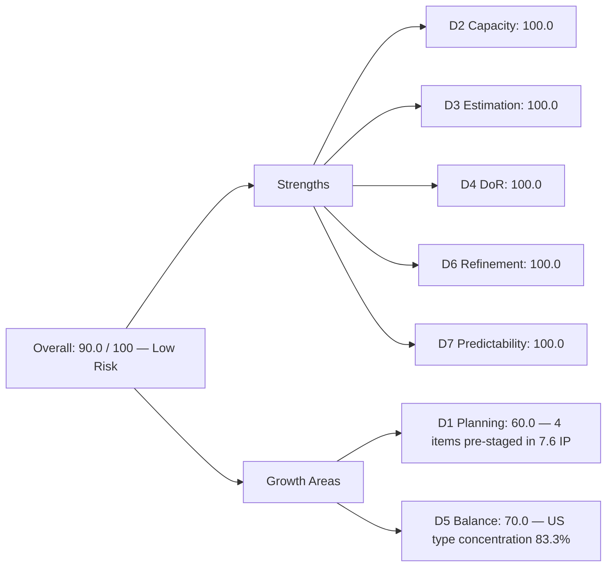
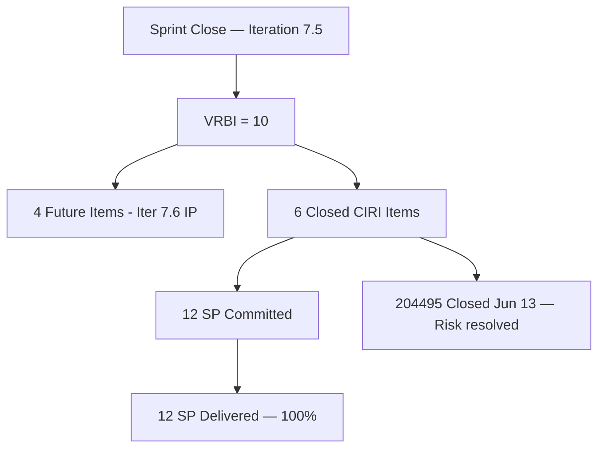

# ADO SAFe Audit — Finance Team

## 1. Audit Metadata

| Field | Value |
|-------|-------|
| **Audit Date** | 2026-06-14 (Sunday) — Day 14 of 14 |
| **Timezone** | PHT (UTC+8) |
| **Iteration** | Iteration 7.5 |
| **Iteration Dates** | 2026-06-01 to 2026-06-14 |
| **Sprint Day** | Day 14 — Sprint Close |
| **ADO Project** | Jairosoft FINOPS |
| **ADO Project ID** | e0bb302f-40f9-46c3-8164-6f1acb317d63 |
| **ADO Team** | Finance Team |
| **ADO Team ID** | 1f4b45fa-82e8-4a36-aedc-6c1bc8f51070 |
| **Iteration ID** | 3b355811-2941-4edf-a8b1-7ffcdb478f9d |
| **Workspace** | `ado_fin` |
| **Prior Audit** | AUDIT_20260612_0203.md (Day 12, Iteration 7.5, 70.0 — Moderate Risk) |
| **Overall Score** | **90.0 / 100** |
| **Risk Band** | **Low Risk** |

---

## 2. Executive Summary

The Finance Team **recovers to 90.0 / 100 (Low Risk)** at Sprint Close of Iteration 7.5 — a **+20.0 point rebound** from Day 12's 70.0 (Moderate Risk). This is the highest score recorded for the Finance Team in the current PI.

The Day 12 score of 70.0 was primarily driven by two weaknesses: **D1 = 20.0** (only 1 of 5 visible backlog items in the current iteration) and **D7 = 0.0** (item 204495 was Active with no ADO update since Day 3). Both have been fully resolved at sprint close.

Using the iteration API at sprint close, all **6 CIRI items are now Closed**, including 204495 (Clean Feed Validation & Automation Freeze, closed 2026-06-13). The closed items that had left the backlog API — 204481, 204490, 204534, 205646, 205650 — are fully recovered, adding 10 SP to the delivered total. Together with the final closure of 204495 (2 SP on June 13), the Finance Team closed **12 SP across 6 items**, achieving 100% delivery predictability.

The Day 12 audit's D7 = 0.0 and D1 = 20.0 were both artifacts of the backlog API dropping closed items: five of the six CIRI items had already closed before Day 12 was audited, making them invisible to that query. Today's sprint-close audit corrects the record.

**Remaining concern:** D1 at 60.0 reflects the 4 future-iteration items (204502, 204507, 204512, 205874) already staged in Iteration 7.6 IP. These should be addressed in the 7.6 IP planning ceremony. D5 at 70.0 reflects the single-type concentration (5 of 6 CIRI items are User Stories). Both are structural and not sprint-delivery risks.

---

## 3. Previous Audit Delta

**Prior audit:** AUDIT_20260612_0203.md — Iteration 7.5, Day 12, Score 70.0 / 100 (Moderate Risk)

| Dimension | Day 12 | Day 14 (Close) | Delta | Driver |
|-----------|--------|----------------|-------|--------|
| D1 Iteration Planning | 20.0 | **60.0** | **+40.0** | VRBI=10 (4 future + 6 closed CIRI); CIRI=6 recovered from iteration API |
| D2 Team Capacity | 100.0 | **100.0** | 0.0 | Grace: 2hr/day configured; sole CIRI assignee |
| D3 Estimation | 100.0 | **100.0** | 0.0 | 6/6 CIRI items estimated (SP=2 each) |
| D4 DoR Compliance | 100.0 | **100.0** | 0.0 | 6/6 CIRI items meet description + AC thresholds |
| D5 Work Item Balance | 70.0 | **70.0** | 0.0 | 5/6 US = 83.3% dominant; 1 Issue breaks single-type but not concentration |
| D6 Backlog Refinement | 100.0 | **100.0** | 0.0 | 4/4 future VRBI items fresh; 0 stale |
| D7 Delivery Predictability | 0.0 | **100.0** | **+100.0** | 12/12 SP closed; 204495 closed 2026-06-13 |
| **Overall** | **70.0** | **90.0** | **+20.0** | D1 and D7 both fully recovered |

**Explanation of the Day 12 → Day 14 swing:** The Day 12 audit used the backlog API (VRBI=5, CIRI=1 visible). Five of six CIRI items had already closed before the Day 12 audit ran — closed items leave the backlog API. Additionally, the one remaining Active item (204495) closed on June 13. The sprint-close audit uses the iteration API to recover all 6 closed CIRI items, producing the correct sprint-close state.

---

## 4. Current Iteration Snapshot

| Attribute | Value |
|-----------|-------|
| **Active Iteration** | Iteration 7.5 |
| **Sprint Duration** | 2026-06-01 to 2026-06-14 (14 days) |
| **Audit Day** | Day 14 — Sprint Close |
| **VRBI (backlog future + closed CIRI)** | 10 (4 future backlog + 6 closed CIRI) |
| **CIRI (current iteration root items)** | 6 |
| **CIRI — Closed** | 6 (100%) |
| **CIRI — Active / New** | 0 |
| **Contributors with Current Work** | 1 (Grace) |
| **Contributors with Capacity** | 1 (Grace: 2hr/day configured) |
| **Committed Story Points** | 12 |
| **Closed Story Points** | 12 |
| **Delivery Rate** | 100.0% |

---

## 5. Work Item Analysis

### CIRI — All 6 Items (all Closed, all Grace)

| ID | Title | Type | State | SP | Closed Date |
|----|-------|------|-------|----|-------------|
| 204534 | QA Testing | Issue | Closed | 2 | 2026-06-11 |
| 204481 | Establish & Authenticate Real-Time Bank Feeds | User Story | Closed | 2 | 2026-06-05 |
| 204490 | Define Automated Transaction Categorization Rules | User Story | Closed | 2 | 2026-06-11 |
| 204495 | Clean Feed Validation & Automation Freeze | User Story | Closed | 2 | 2026-06-13 |
| 205646 | Invoice Payment Collection for Jairosoft | User Story | Closed | 2 | 2026-06-05 |
| 205650 | Payment Collection for JIT | User Story | Closed | 2 | 2026-06-05 |

**Type breakdown:** User Story ×5 (83.3%), Issue ×1 (16.7%)
**Total Committed SP:** 12 | **Total Closed SP:** 12

*Note: Item 204495 (Clean Feed Validation & Automation Freeze) was the sole Active item at the Day 12 audit. It closed on 2026-06-13, the day before sprint close, confirming completion within the sprint window.*

### Future Backlog (VRBI non-CIRI — 4 items)

| ID | Title | State | SP | Iteration | Changed |
|----|-------|-------|----|-----------|---------|
| 204502 | Complete Full-Month Ledger Reconciliation | New | 2 | 7.6 (IP) | 2026-05-18 |
| 204507 | Generate & Configure Clean P&L Dashboards | New | 2 | 7.6 (IP) | 2026-05-18 |
| 204512 | Final Feature Audit, UAT, and Sign-Off | New | 2 | 7.6 (IP) | 2026-05-18 |
| 205874 | Gcash Testing | New | 2 | 7.6 (IP) | 2026-06-07 |

### DoR Assessment (CIRI)

| ID | Title | Description ≥ 30 chars | AC ≥ 20 chars | DoR Compliant |
|----|-------|------------------------|----------------|---------------|
| 204534 | QA Testing | Yes | Yes | **Yes** |
| 204481 | Establish & Authenticate Real-Time Bank Feeds | Yes | Yes | **Yes** |
| 204490 | Define Automated Transaction Categorization Rules | Yes | Yes | **Yes** |
| 204495 | Clean Feed Validation & Automation Freeze | Yes (134 chars) | Yes (247 chars) | **Yes** |
| 205646 | Invoice Payment Collection for Jairosoft | Yes | Yes | **Yes** |
| 205650 | Payment Collection for JIT | Yes | Yes | **Yes** |

---

## 6. SAFe Compliance Scorecard

| Dimension | Score | Evidence | Notes |
|-----------|-------|----------|-------|
| D1 Iteration Planning | 60.0 | 6 CIRI / 10 VRBI × 100 | 4 future-iteration items in VRBI; healthy CIRI ratio at sprint close |
| D2 Team Capacity | 100.0 | 1/1 contributor with capacity | Grace: 2hr/day (Documentation + Requirements) |
| D3 Estimation | 100.0 | 6/6 CIRI estimated (SP=2 each) | Uniform estimation; all items carry equal point weight |
| D4 DoR Compliance | 100.0 | 6/6 CIRI meet description + AC thresholds | Strong DoR hygiene maintained across all items |
| D5 Work Item Balance | 70.0 | US present; 5/6 = 83.3% dominant → −30 | Issue (204534) provides type variety; concentration penalty remains |
| D6 Backlog Refinement | 100.0 | 4/4 future VRBI fresh; 0 stale | All future items changed after 2026-04-28 |
| D7 Delivery Predictability | 100.0 | 12/12 SP closed | 100% sprint delivery; all 6 CIRI items Closed |
| **Overall** | **90.0** | (60+100+100+100+70+100+100)/7 | **Low Risk** |

---

## 7. Dimension Findings

### D1 — Iteration Planning: 60.0

```
visible_root_backlog_items (VRBI) = 10
  - 4 future-iteration items (still in backlog API: 204502, 204507, 204512, 205874)
  - 6 closed CIRI items (recovered from iteration API)

current_iteration_root_items (CIRI) = 6
  [all with IterationPath = "Jairosoft FINOPS\2026-PI7\Iteration 7.5"]

Score = round(6 / 10 * 100, 1) = 60.0
```

D1 at 60.0 reflects a compact, focused backlog. The 4 future items are all staged in Iteration 7.6 IP — reasonable forward planning. This score would move to 100.0 if future items were not yet in the backlog (i.e., held at Feature level). The finance backlog is the leanest in the FINOPS portfolio.

### D2 — Team Capacity: 100.0

```
contributors_with_current_work = 1  [Grace — sole assignee on all 6 CIRI items]
contributors_with_capacity = 1  [Grace: 2hr/day (Documentation 1hr + Requirements 1hr)]

Score = round(1 / 1 * 100, 1) = 100.0
```

### D3 — Estimation: 100.0

```
point_eligible_current_items = 6  [5 User Stories + 1 Issue, all expose SP field]
estimated_current_items = 6  [all SP=2; total = 12]

Score = round(6 / 6 * 100, 1) = 100.0
```

Notably, all 6 CIRI items carry identical story point values (SP=2). While this passes D3, it may suggest estimation is being applied uniformly rather than calibrated to actual effort. For 7.6, consider re-estimating to reflect actual complexity differences between items.

### D4 — DoR Compliance: 100.0

```
dor_compliant_current_items = 6
current_iteration_root_items = 6

Score = round(6 / 6 * 100, 1) = 100.0
```

### D5 — Work Item Balance: 70.0

```
Start: 100
User Story items in CIRI: 5 (present) → no absence penalty (−40 not applied)
dominant_type_share: User Story = 5/6 = 83.3% > 60% → −30
spike_share: 0/6 = 0% → no penalty
Issue (204534) provides type diversity but does not lower concentration below threshold

Score = max(0, 100 − 30) = 70.0
```

The inclusion of Issue 204534 (QA Testing) is positive — it prevents a single-type sprint. However, with 5 of 6 items as User Stories, the concentration penalty still applies. Consider adding a Spike or Enabler to future sprint commitments to reduce concentration.

### D6 — Backlog Refinement: 100.0

```
visible_root_backlog_items (future only) = 4
fresh_visible_root_items (ChangedDate ≥ 2026-04-28) = 4
  - 204502: 2026-05-18 ✓
  - 204507: 2026-05-18 ✓
  - 204512: 2026-05-18 ✓
  - 205874: 2026-06-07 ✓
stale_90_visible_root_items (ChangedDate < 2026-03-14) = 0
stale_180_visible_root_items (ChangedDate < 2025-12-15) = 0
untouched_current: all 6 CIRI items closed → 0 untouched

Score = max(0, 100.0 − 0) = 100.0
```

Items 204502, 204507, and 204512 have not been updated since 2026-05-18 (27 days). While they do not yet cross the 90-day staleness threshold, they should be reviewed and updated during the 7.6 IP planning ceremony.

### D7 — Delivery Predictability: 100.0

```
committed_story_points = 12  [6 CIRI items × SP=2]
closed_story_points = 12  [all 6 CIRI items in Closed state]

Score = round(12 / 12 * 100, 1) = 100.0
```

Item 204495 (Clean Feed Validation & Automation Freeze), which was Active and stale on Day 12, was closed on 2026-06-13 — the day before sprint close. This was the critical at-risk item identified in the Day 12 audit, and it was resolved in time.

---

## 8. Score Breakdown





---

## 9. Risks and Bottlenecks

| # | Risk | Severity | Status |
|---|------|----------|--------|
| 1 | Single contributor (Grace) on all Finance work | High | Persistent; systemic bus-factor risk |
| 2 | Three 7.6 IP items (204502, 204507, 204512) stale since 2026-05-18 | Moderate | Not yet past 90-day threshold; needs 7.6 IP refinement |
| 3 | All CIRI items carry identical SP=2 | Low | Estimation uniformity suggests calibration may be absent; review in 7.6 |
| 4 | D5 type concentration (5/6 User Stories) | Low | Recurring; would benefit from Spike or Enabler in future sprints |

---

## 10. Prioritized Recommendations

1. **[High] Sprint retrospective:** Document Grace's delivery pattern across Iteration 7.5 — 5 items closed early (Jun 4–11) with the final item closing Jun 13. Highlight this as a positive close-out pattern for team recognition.
2. **[High] Refresh items 204502, 204507, 204512** during the 7.6 IP planning ceremony. They have been unchanged since May 18 and need estimation review and DoR revalidation before sprint commitment.
3. **[Moderate] Evaluate estimation calibration.** All 6 CIRI items were assigned SP=2. For 7.6, consider sizing items individually based on complexity (complexity-relative estimation rather than uniform assignment).
4. **[Moderate] Evaluate team composition.** Grace as the sole Finance Team member remains the most significant structural risk. Even a fractional second contributor would provide coverage and review capacity.
5. **[Low] Add a Spike or Enabler in 7.6** to reduce the User Story type concentration below 60% and avoid the D5 penalty.

---

## 11. Evidence Gaps and Limitations

| Gap | Impact | Notes |
|-----|--------|-------|
| Five CIRI items (204481, 204490, 204534, 205646, 205650) were invisible to Day 12 backlog API | Day 12 showed D1=20, D7=0 — both were backlog-API artifacts | Sprint-close iteration API corrects the record; items were closed well before Day 12 |
| All items assigned SP=2 uniformly | Cannot distinguish high-vs-low complexity items in this sprint's record | Recommend effort-calibrated estimation in 7.6 |
| Single-contributor sprint; no peer review evidence in ADO | Delivery claims rely on ADO state transitions alone | Structural gap; recommend periodic stakeholder sign-off for Finance deliverables |
