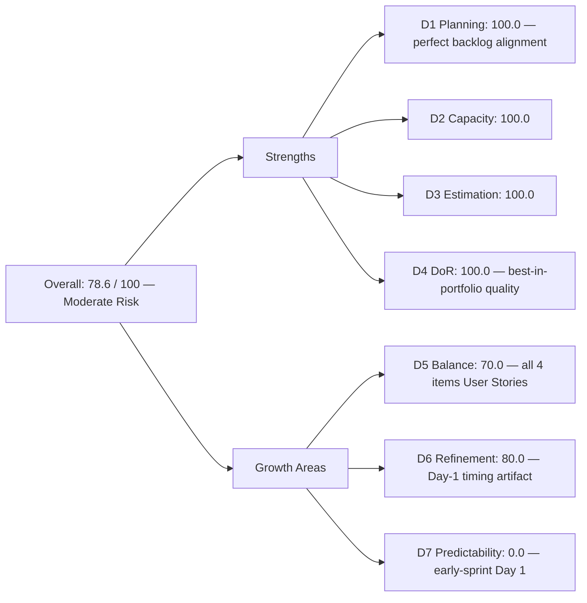
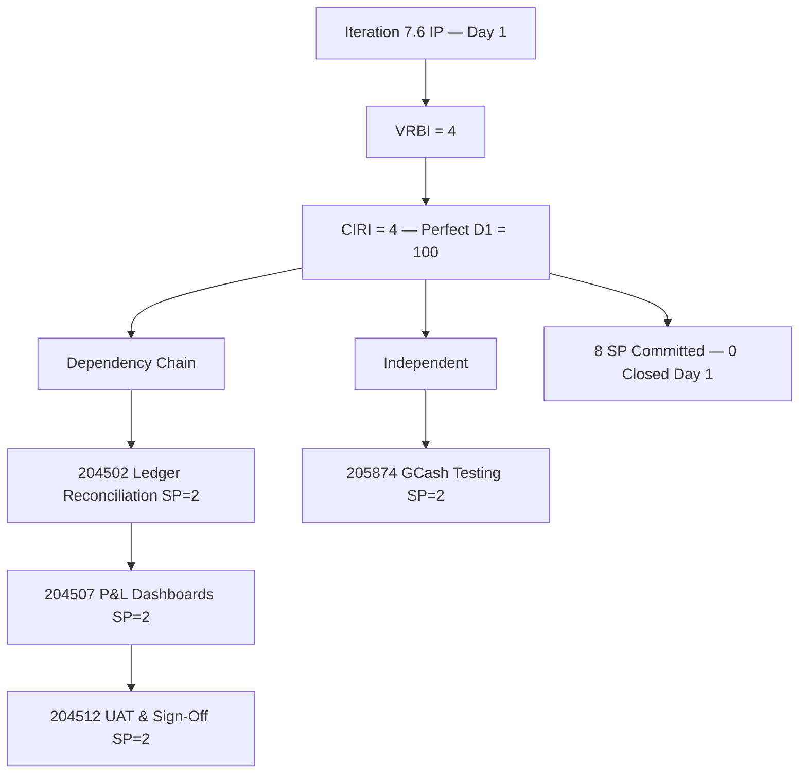

# ADO SAFe Audit — Finance Team

## 1. Audit Metadata

| Field | Value |
|-------|-------|
| **Audit Date** | 2026-06-15 (Monday) — Day 1 of 14 |
| **Timezone** | PHT (UTC+8) |
| **Iteration** | Iteration 7.6 (IP) |
| **Iteration Dates** | 2026-06-15 to 2026-06-28 |
| **Sprint Day** | Day 1 — Sprint Open (Innovation & Planning) |
| **ADO Project** | Jairosoft FINOPS |
| **ADO Project ID** | e0bb302f-40f9-46c3-8164-6f1acb317d63 |
| **ADO Team** | Finance Team |
| **ADO Team ID** | 1f4b45fa-82e8-4a36-aedc-6c1bc8f51070 |
| **Iteration ID** | bebf6f83-a342-42a2-bad7-a16951231732 |
| **Workspace** | `ado_fin` |
| **Prior Audit** | AUDIT_20260614_0200.md (Day 14 Close, Iteration 7.5, 90.0 — Low Risk) |
| **Overall Score** | **78.6 / 100** |
| **Risk Band** | **Moderate Risk** |

---

## 2. Executive Summary

The Finance Team enters **Iteration 7.6 (IP) at 78.6 / 100 (Moderate Risk)** on Day 1 of the Innovation & Planning sprint — a **−11.4 point transition** from the Iteration 7.5 close-out score of 90.0. This is the standard early-sprint pattern: Delivery Predictability (D7) resets to 0.0 as no work has been closed yet, and the D6 untouched-item penalty applies since all 4 CIRI items were last modified the day before sprint start.

**The Finance Team enters 7.6 IP in excellent foundational shape.** Grace's 4 committed items are all in the **Ready** state with full estimation (SP=2 each, 8 SP total) and complete DoR compliance. The D1 score of 100.0 is the strongest in the FINOPS portfolio at sprint open — the backlog is exactly right-sized, with every visible root item committed to the current iteration.

The critical issue returning from prior sprints is D5 at 70.0 — all 4 CIRI items are User Stories, resulting in a 100% single-type concentration. A Spike or Enabler in the sprint plan would address this structural penalty.

D7 is annotated as **early-sprint** — 0.0 is expected and not a performance concern.

---

## 3. Previous Audit Delta

**Prior audit:** AUDIT_20260614_0200.md — Iteration 7.5, Day 14 (Sprint Close), Score 90.0 / 100 (Low Risk)

| Dimension | Iter 7.5 Close | Iter 7.6 Day 1 | Delta | Driver |
|-----------|----------------|-----------------|-------|--------|
| D1 Iteration Planning | 60.0 | **100.0** | **+40.0** | All 4 VRBI items are CIRI items; perfect alignment |
| D2 Team Capacity | 100.0 | **100.0** | 0.0 | Grace: 2hr/day continues into Iteration 7.6 IP |
| D3 Estimation | 100.0 | **100.0** | 0.0 | 4/4 CIRI items estimated at SP=2 |
| D4 DoR Compliance | 100.0 | **100.0** | 0.0 | 4/4 CIRI items meet description + AC thresholds |
| D5 Work Item Balance | 70.0 | **70.0** | 0.0 | 4/4 User Stories = 100% → −30; no type diversity |
| D6 Backlog Refinement | 100.0 | **80.0** | **−20.0** | Day-1 untouched: all 4 CIRI changed 2026-06-14 (day before sprint start) |
| D7 Delivery Predictability | 100.0 | **0.0** | **−100.0** | Day 1 — no closed items yet (early-sprint; expected) |
| **Overall** | **90.0** | **78.6** | **−11.4** | D7 reset + D6 Day-1 penalty; D1 improves significantly |

**Transition note:** The 78.6 Day-1 score is the strongest sprint-open score in Finance Team history, driven by the perfect D1 (100.0) — the backlog is compact and fully committed. The −11.4 delta is entirely attributable to the early-sprint D7 and D6 timing effects.

---

## 4. Current Iteration Snapshot

| Attribute | Value |
|-----------|-------|
| **Active Iteration** | Iteration 7.6 (IP) |
| **Sprint Duration** | 2026-06-15 to 2026-06-28 (14 days) |
| **Audit Day** | Day 1 — Sprint Open |
| **VRBI (visible root backlog items)** | 4 |
| **CIRI (current iteration root items)** | 4 |
| **CIRI — Ready** | 4 (100%) |
| **CIRI — Active / Closed** | 0 |
| **Contributors with Current Work** | 1 (Grace) |
| **Contributors with Capacity** | 1 (Grace: 2hr/day, 0 days off) |
| **Committed Story Points** | 8 |
| **Closed Story Points** | 0 (Day 1) |
| **Delivery Rate** | 0.0% (early-sprint — expected) |

---

## 5. Work Item Analysis

### CIRI — All 4 Items (all Ready, all Grace)

| ID | Title | Type | State | SP | Changed |
|----|-------|------|-------|----|---------|
| 204502 | Complete Full-Month Ledger Reconciliation | User Story | Ready | 2 | 2026-06-14 |
| 204507 | Generate & Configure Clean P&L Dashboards | User Story | Ready | 2 | 2026-06-14 |
| 204512 | Final Feature Audit, UAT, and Sign-Off | User Story | Ready | 2 | 2026-06-14 |
| 205874 | Gcash Testing | User Story | Ready | 2 | 2026-06-14 |

**Type breakdown:** User Story ×4 (100%) — single-type sprint
**Total Committed SP:** 8

**Item notes:**
- 204502 and 204507 have been in the backlog since May 2026. They were refreshed on 2026-06-14 (likely during 7.6 IP planning prep). The items are sequentially dependent: 204502 (reconciliation) is a prerequisite for 204507 (P&L dashboards), which is a prerequisite for 204512 (UAT/sign-off).
- 205874 (GCash Testing) is independent and can be executed in parallel.

### DoR Assessment (CIRI)

| ID | Title | Description ≥ 30 chars | AC ≥ 20 chars | DoR Compliant |
|----|-------|------------------------|----------------|---------------|
| 204502 | Complete Full-Month Ledger Reconciliation | Yes (user-voice format) | Yes (Given/When/Then) | **Yes** |
| 204507 | Generate & Configure Clean P&L Dashboards | Yes (user-voice format) | Yes (Given/When/Then) | **Yes** |
| 204512 | Final Feature Audit, UAT, and Sign-Off | Yes (user-voice format) | Yes (Given/When/Then) | **Yes** |
| 205874 | Gcash Testing | Yes (user-voice format) | Yes (Given/When/Then with HTTP 200 spec) | **Yes** |

**DoR: 4/4 = 100%**

All 4 items use consistent user-voice format (As a / I want to / So that) and Gherkin-style acceptance criteria (Given/When/Then). This is the strongest DoR quality in the FINOPS portfolio.

### Dependency Chain Assessment

```
204502 (Ledger Reconciliation)
    → 204507 (P&L Dashboards) [depends on 204502]
        → 204512 (UAT/Sign-Off) [depends on 204507]

205874 (GCash Testing) [independent]
```

The sequential dependency chain means 204512 cannot begin until both 204502 and 204507 are complete. Grace should plan to close 204502 and 204507 by Day 7 to allow adequate UAT time for 204512.

---

## 6. SAFe Compliance Scorecard

| Dimension | Score | Evidence | Notes |
|-----------|-------|----------|-------|
| D1 Iteration Planning | 100.0 | 4 CIRI / 4 VRBI × 100 | Perfect backlog alignment — every visible item is sprint-committed |
| D2 Team Capacity | 100.0 | 1/1 contributor with capacity | Grace: 2hr/day, 0 days off configured for 7.6 IP |
| D3 Estimation | 100.0 | 4/4 CIRI estimated (SP=2 each) | Full estimation; uniform SP=2 continues from Iteration 7.5 |
| D4 DoR Compliance | 100.0 | 4/4 CIRI meet description + AC thresholds | Best-in-portfolio DoR quality (user-voice + Gherkin) |
| D5 Work Item Balance | 70.0 | US present; 4/4 = 100% dominant → −30 | No type diversity; single-type sprint |
| D6 Backlog Refinement | 80.0 | All 4 VRBI fresh; 4/4 CIRI untouched (changed 2026-06-14) → −20 | Day-1 structural artifact; items refreshed during planning prep |
| D7 Delivery Predictability | 0.0 | 0/8 SP closed — Day 1 (early-sprint) | **Early-sprint — low delivery expected**; reset from 7.5 close |
| **Overall** | **78.6** | (100+100+100+100+70+80+0)/7 | **Moderate Risk** |

---

## 7. Dimension Findings

### D1 — Iteration Planning: 100.0

```
visible_root_backlog_items (VRBI) = 4
current_iteration_root_items (CIRI) = 4
  [all with IterationPath = "Jairosoft FINOPS\2026-PI7\Iteration 7.6 (IP)"]

Score = round(4 / 4 * 100, 1) = 100.0
```

This is the Finance Team's first D1 = 100.0. The backlog is lean and perfectly committed — every item in the visible backlog is assigned to the current iteration. This is the ideal SAFe state for D1. The improvement from 60.0 (Iteration 7.5 close) reflects that the 7.5 sprint's 4 future items are now active CIRI items.

### D2 — Team Capacity: 100.0

```
contributors_with_current_work = 1  [Grace — sole assignee on all 4 CIRI items]
contributors_with_capacity = 1  [Grace: 2hr/day (Documentation + Requirements)]

Score = round(1 / 1 * 100, 1) = 100.0
```

### D3 — Estimation: 100.0

```
point_eligible_current_items = 4
estimated_current_items = 4  [all SP=2; total = 8]

Score = round(4 / 4 * 100, 1) = 100.0
```

Continuing the uniform SP=2 pattern from Iteration 7.5. For future iterations, consider whether the sequentially dependent items (204502 → 204507 → 204512) have genuinely equal effort — the UAT/sign-off step (204512) may be lighter than the ledger reconciliation (204502) and deserves independent sizing.

### D4 — DoR Compliance: 100.0

```
dor_compliant_current_items = 4
current_iteration_root_items = 4

Score = round(4 / 4 * 100, 1) = 100.0
```

The Finance Team maintains the best DoR quality in the FINOPS portfolio. Acceptance criteria follow Gherkin (Given/When/Then) consistently, and descriptions are in proper user-voice format. Item 205874 (GCash Testing) includes specific technical criteria (HTTP 200 OK, webhook trigger, database flag) — an excellent example of testable acceptance criteria.

### D5 — Work Item Balance: 70.0

```
Start: 100
User Story items in CIRI: 4 (present) → no absence penalty (−40 not applied)
dominant_type_share: User Story = 4/4 = 100% > 60% → −30
spike_share: 0/4 = 0% → no penalty

Score = max(0, 100 − 30) = 70.0
```

The Finance Team's sprint is entirely User Stories for the second consecutive iteration. While the work is appropriate to Grace's Finance remit, adding a single Spike (e.g., research on reporting tools or process documentation) or one Enabler would break the 60% concentration threshold and raise D5 to 100.0 in future sprints.

### D6 — Backlog Refinement: 80.0

```
visible_root_backlog_items (VRBI) = 4
fresh_visible_root_items (ChangedDate ≥ 2026-04-28) = 4
  - 204502: 2026-06-14 ✓
  - 204507: 2026-06-14 ✓
  - 204512: 2026-06-14 ✓
  - 205874: 2026-06-14 ✓
stale_90_visible_root_items (ChangedDate < 2026-03-14) = 0
stale_180_visible_root_items (ChangedDate < 2025-12-15) = 0
untouched_current (ChangedDate < 2026-06-15) = 4/4 = 100% > 30% → −20

Score = max(0, 100.0 − 20) = 80.0
```

All 4 items were updated on 2026-06-14 during sprint planning preparation. The Day-1 untouched penalty is a timing artifact — the items were actively refreshed 24 hours before sprint start. No backlog hygiene concern exists here.

**Dependency sequencing note:** Items 204502, 204507, and 204512 are explicitly sequentially dependent per their acceptance criteria. When planning activity assignments in the sprint, Grace should track in-progress state on 204502 by Day 5 to preserve cascade flow.

### D7 — Delivery Predictability: 0.0 (early-sprint)

```
committed_story_points = 8  [4 CIRI items × SP=2]
closed_story_points = 0  [no items closed on Day 1]

Score = round(0 / 8 * 100, 1) = 0.0

ANNOTATION: Early-sprint — low delivery expected (Day 1 of 14)
```

Grace closed all 6 Iteration 7.5 items by Day 13 (the last item closed June 13). With 4 items and 8 SP committed, the 7.6 IP sprint is the lightest in Finance Team history — well within Grace's demonstrated throughput. The Iteration 7.5 velocity (12 SP over 14 days) comfortably covers the 8 SP commitment here.

---

## 8. Score Breakdown





---

## 9. Risks and Bottlenecks

| # | Risk | Severity | Status |
|---|------|----------|--------|
| 1 | Sequential dependency chain: 204502 → 204507 → 204512 | High | Grace cannot start 204512 (UAT) until 204507 (P&L) completes; plan to close 204502 by Day 5 |
| 2 | Single contributor (Grace) on all Finance work | High | Persistent bus-factor risk; unchanged from prior sprints |
| 3 | Uniform SP=2 across all items | Low | Estimation may not reflect true effort variation; UAT may be lighter than reconciliation |
| 4 | D5 type concentration (4/4 User Stories = 100%) | Low | Recurring; a single Spike or Enabler in 7.7+ would resolve this |

---

## 10. Prioritized Recommendations

1. **[High] Plan 204502 completion by Day 5.** The sequential dependency chain (204502 → 204507 → 204512) means late closure of the first item cascades into late UAT completion. Grace should prioritize ledger reconciliation in the first week of the IP sprint.
2. **[High] Conduct a milestone review on Day 7.** With 8 SP and a dependency chain, a mid-sprint check on June 22 will confirm whether 204502 and 204507 are complete and 204512 is on track.
3. **[Moderate] Revisit SP calibration.** All 4 items carry SP=2 for the third consecutive sprint cycle. For 7.7, consider independent effort sizing — in particular, 204512 (UAT/Sign-Off) likely takes less effort than 204502 (full-month ledger reconciliation) and should carry lower SP.
4. **[Moderate] Add type diversity in 7.7.** A single Spike (e.g., a payment reporting research item or documentation task) added to the sprint plan would reduce User Story concentration to 80% at 5 items (still penalized) or to 57% at 4 User Stories + 3 others (threshold met).
5. **[Low] Formalize the sequential dependency links in ADO.** Items 204502, 204507, and 204512 are interdependent but not linked with predecessor/successor relationships in ADO. Adding Predecessor links would make the dependency visible in the board view.

---

## 11. Evidence Gaps and Limitations

| Gap | Impact | Notes |
|-----|--------|-------|
| D7 = 0.0 on Day 1 | Does not reflect performance — expected early-sprint zero | Grace delivered 100% (12/12 SP) in Iteration 7.5; this is a reset |
| D6 untouched penalty | All 4 items changed 2026-06-14 (day before sprint start) | Items were actively refreshed during planning prep; timing artifact, not hygiene failure |
| Uniform SP=2 across all items | Cannot distinguish high vs. low complexity from ADO metadata | Recommend individual effort calibration in 7.7 |
| Single-contributor sprint; no peer review in ADO | Delivery claims rely on ADO state transitions alone | Structural gap; periodic Finance stakeholder sign-off recommended |
| Dependency links not configured in ADO | Sequential dependency 204502→204507→204512 is described in AC but not enforced via ADO predecessor links | Low tooling gap; recommend adding Predecessor relationships |
