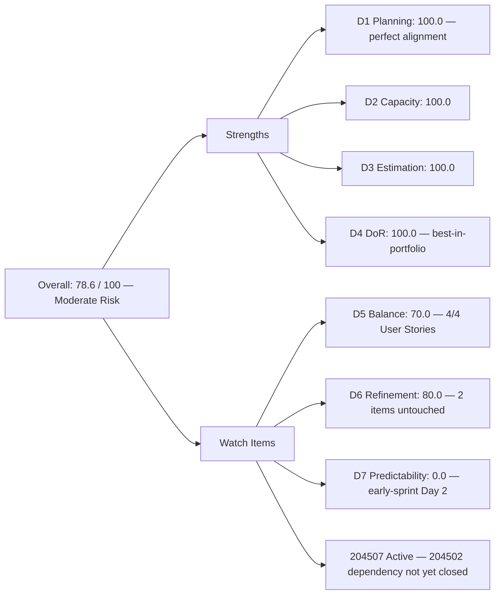
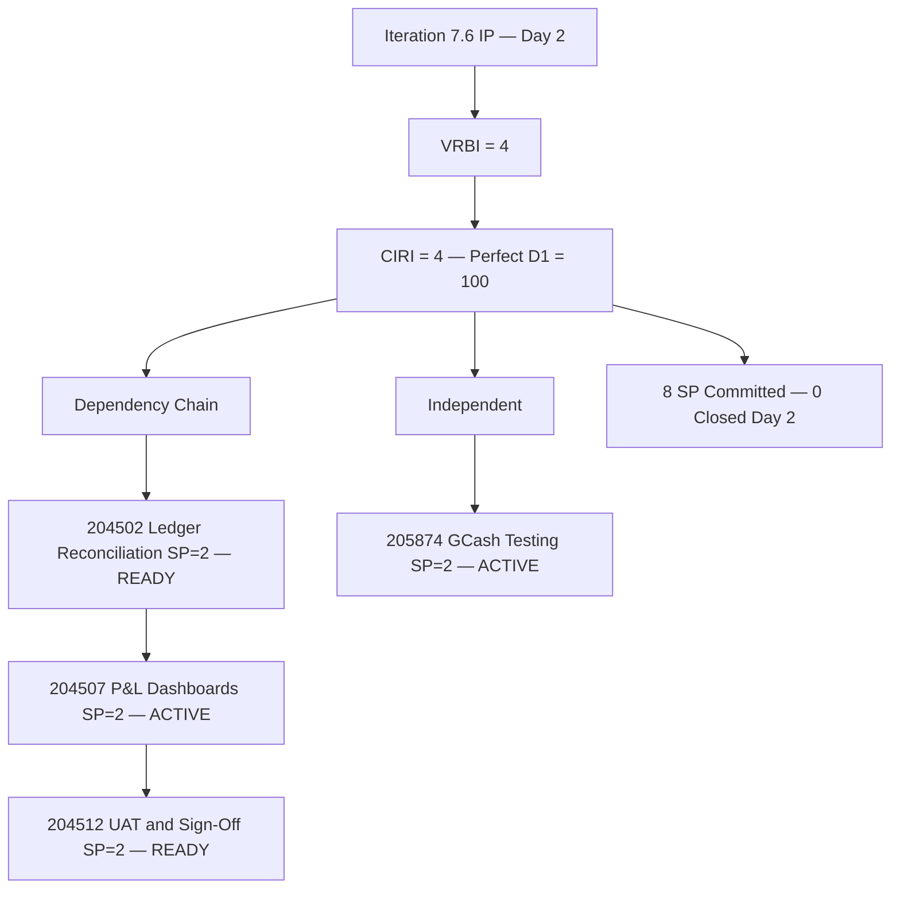
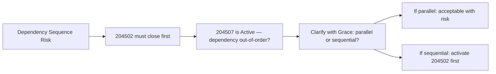

# ADO SAFe Audit — Finance Team

## 1. Audit Metadata

| Field | Value |
|-------|-------|
| **Audit Date** | 2026-06-16 (Tuesday) — Day 2 of 14 |
| **Timezone** | PHT (UTC+8) |
| **Iteration** | Iteration 7.6 (IP) |
| **Iteration Dates** | 2026-06-15 to 2026-06-28 |
| **Sprint Day** | Day 2 — Sprint Active |
| **ADO Project** | Jairosoft FINOPS |
| **ADO Project ID** | e0bb302f-40f9-46c3-8164-6f1acb317d63 |
| **ADO Team** | Finance Team |
| **ADO Team ID** | 1f4b45fa-82e8-4a36-aedc-6c1bc8f51070 |
| **Iteration ID** | bebf6f83-a342-42a2-bad7-a16951231732 |
| **Workspace** | `ado_fin` |
| **Prior Audit** | AUDIT_20260615_0200.md (Day 1 Open, Iteration 7.6 IP, 78.6 — Moderate Risk) |
| **Overall Score** | **78.6 / 100** |
| **Risk Band** | **Moderate Risk** |

---

## 2. Executive Summary

The Finance Team holds steady at **78.6 / 100 (Moderate Risk)** on Day 2 of Iteration 7.6 (IP) — **no change in overall score** from yesterday's Day 1 open. This stability masks meaningful in-sprint progress: Grace has moved two items to Active state as of this morning (2026-06-16), demonstrating that sprint work is underway at the expected pace.

**Day 2 activation is excellent.** Item 204507 (Generate & Configure Clean P&L Dashboards) transitioned to Active at 08:04 today, and 205874 (GCash Testing) transitioned to Active at 08:03 today. Grace is actively working two of the four sprint items simultaneously by Day 2 — ahead of the Day 3–5 benchmark flagged in yesterday's audit.

**Key concern: dependency chain sequencing.** Item 204507 (P&L Dashboards) has been set Active, but the prescribed dependency chain calls for 204502 (Ledger Reconciliation) to close first before P&L dashboards can be configured. The fact that 204507 is Active while 204502 remains in Ready state warrants monitoring — either the items are being worked in parallel (valid if the ledger is substantially complete), or the dependency chain is being bypassed.

**D7 remains 0.0 on Day 2** (no items Closed or Done), which is fully expected at this stage. The sprint backlog is unchanged (4 items, 8 SP). No new items have been added.

---

## 3. Previous Audit Delta

**Prior audit:** AUDIT_20260615_0200.md — Iteration 7.6 IP, Day 1, Score 78.6 / 100 (Moderate Risk)

| Dimension | Day 1 | Day 2 | Delta | Driver |
|-----------|-------|-------|-------|--------|
| D1 Iteration Planning | 100.0 | **100.0** | 0.0 | VRBI = CIRI = 4; no changes to backlog |
| D2 Team Capacity | 100.0 | **100.0** | 0.0 | Grace: 2hr/day, 0 days off — unchanged |
| D3 Estimation | 100.0 | **100.0** | 0.0 | 4/4 estimated at SP=2; no change |
| D4 DoR Compliance | 100.0 | **100.0** | 0.0 | All 4 items DoR-compliant; no change |
| D5 Work Item Balance | 70.0 | **70.0** | 0.0 | 4/4 User Stories = 100%; structural penalty persists |
| D6 Backlog Refinement | 80.0 | **80.0** | 0.0 | 2 items now touched (Jun 16); 2 remain untouched (Jun 14) → 50% > 30% → −20 |
| D7 Delivery Predictability | 0.0 | **0.0** | 0.0 | No items Closed/Done — Day 2; early-sprint expected |
| **Overall** | **78.6** | **78.6** | **0.0** | Score stable; in-sprint activation is positive leading indicator |

**Significant changes since Day 1:**
- **204507** (Generate & Configure Clean P&L Dashboards): State Ready → **Active** (2026-06-16 08:04)
- **205874** (GCash Testing): State Ready → **Active** (2026-06-16 08:03)
- **204502** and **204512**: Remain in Ready state, last changed 2026-06-14

---

## 4. Current Iteration Snapshot

| Attribute | Value |
|-----------|-------|
| **Active Iteration** | Iteration 7.6 (IP) |
| **Sprint Duration** | 2026-06-15 to 2026-06-28 (14 days) |
| **Audit Day** | Day 2 |
| **VRBI (visible root backlog items)** | 4 |
| **CIRI (current iteration root items)** | 4 |
| **CIRI — Ready** | 2 (204502, 204512) |
| **CIRI — Active** | 2 (204507, 205874) |
| **CIRI — Closed/Done** | 0 |
| **Contributors with Current Work** | 1 (Grace) |
| **Contributors with Capacity** | 1 (Grace: 2hr/day, 0 days off) |
| **Committed Story Points** | 8 |
| **Closed Story Points** | 0 (Day 2 — early-sprint) |
| **Delivery Rate** | 0.0% — early-sprint (annotated) |

---

## 5. Work Item Analysis

### CIRI — All 4 Items (all Grace)

| ID | Title | Type | State | SP | Changed |
|----|-------|------|-------|----|---------|
| 204502 | Complete Full-Month Ledger Reconciliation | User Story | Ready | 2 | 2026-06-14 |
| 204507 | Generate & Configure Clean P&L Dashboards | User Story | **Active** | 2 | **2026-06-16** |
| 204512 | Final Feature Audit, UAT, and Sign-Off | User Story | Ready | 2 | 2026-06-14 |
| 205874 | Gcash Testing | User Story | **Active** | 2 | **2026-06-16** |

**Type breakdown:** User Story ×4 (100%) — single-type sprint (unchanged)
**Total Committed SP:** 8

### Dependency Chain Assessment

```
204502 (Ledger Reconciliation) — Still READY
    → 204507 (P&L Dashboards) — ACTIVE ← WATCH: out-of-sequence activation
        → 204512 (UAT/Sign-Off) — Still READY

205874 (GCash Testing) — ACTIVE [independent; no dependency concern]
```

**Flag:** 204507 is Active while its stated prerequisite (204502 — Ledger Reconciliation) remains in Ready state. Per the dependency chain documented in yesterday's audit and Grace's own AC ("Given a fully reconciled ledger from Story 1, When the dashboard widgets are activated…"), this warrants a clarification from Grace. It is possible that:
1. The ledger reconciliation is substantively complete and 204502 closure in ADO is pending; or
2. Both items are being worked in parallel during the IP sprint (acceptable if the team accepts the dependency risk)

Either way, the sequence must be resolved before 204512 (UAT/Sign-Off) begins.

### DoR Assessment (CIRI — unchanged from Day 1)

| ID | Title | Desc ≥ 30 | AC ≥ 20 | Compliant |
|----|-------|-----------|---------|-----------|
| 204502 | Complete Full-Month Ledger Reconciliation | Yes (user-voice) | Yes (Given/When/Then) | **Yes** |
| 204507 | Generate & Configure Clean P&L Dashboards | Yes (user-voice) | Yes (Given/When/Then) | **Yes** |
| 204512 | Final Feature Audit, UAT, and Sign-Off | Yes (user-voice) | Yes (Given/When/Then) | **Yes** |
| 205874 | GCash Testing | Yes (user-voice) | Yes (Given/When/Then + HTTP 200) | **Yes** |

**DoR: 4/4 = 100%** — no change from Day 1.

---

## 6. SAFe Compliance Scorecard

| Dimension | Score | Evidence | Notes |
|-----------|-------|----------|-------|
| D1 Iteration Planning | 100.0 | 4 CIRI / 4 VRBI × 100 | Perfect backlog alignment — unchanged from Day 1 |
| D2 Team Capacity | 100.0 | 1/1 contributor with capacity | Grace: 2hr/day, 0 days off for Iteration 7.6 IP |
| D3 Estimation | 100.0 | 4/4 CIRI estimated (SP=2 each) | Unchanged from Day 1 |
| D4 DoR Compliance | 100.0 | 4/4 CIRI meet description + AC thresholds | Best-in-portfolio DoR quality; unchanged |
| D5 Work Item Balance | 70.0 | US=4/4=100% > 60% → −30 | Structural; requires type diversification in 7.7 |
| D6 Backlog Refinement | 80.0 | All 4 VRBI fresh; 204502 + 204512 untouched (Jun 14) = 50% > 30% → −20 | 204507 + 205874 now touched (Jun 16); 2/4 untouched |
| D7 Delivery Predictability | 0.0 | 0/8 SP closed — Day 2 (early-sprint) | **Early-sprint — low delivery expected**; 204507 + 205874 in Active |
| **Overall** | **78.6** | (100+100+100+100+70+80+0)/7 | **Moderate Risk** |

---

## 7. Dimension Findings

### D1 — Iteration Planning: 100.0

```
visible_root_backlog_items (VRBI) = 4
current_iteration_root_items (CIRI) = 4
  [all with IterationPath = "Jairosoft FINOPS\2026-PI7\Iteration 7.6 (IP)"]

Score = round(4 / 4 * 100, 1) = 100.0
```

Perfect backlog alignment maintained from Day 1. The Finance backlog is the leanest in the FINOPS portfolio — every visible item is committed to the current sprint. No new items were added and no items were removed.

### D2 — Team Capacity: 100.0

```
contributors_with_current_work = 1  [Grace — sole assignee on all 4 CIRI items]
contributors_with_capacity = 1  [Grace: 2hr/day (Documentation + Requirements) — team ID 1f4b45fa]

Score = round(1 / 1 * 100, 1) = 100.0
```

Capacity confirmed unchanged from Day 1. Grace's 2hr/day allocation for IP ceremonies and work items is appropriate for the 4-item, 8-SP sprint load.

### D3 — Estimation: 100.0

```
point_eligible_current_items = 4
estimated_current_items = 4  [all SP=2; total committed = 8 SP]

Score = round(4 / 4 * 100, 1) = 100.0
```

No change. All items maintain SP=2 uniform estimation.

### D4 — DoR Compliance: 100.0

```
dor_compliant_current_items = 4
current_iteration_root_items = 4

Score = round(4 / 4 * 100, 1) = 100.0
```

The Finance Team continues to maintain the highest DoR quality in the FINOPS portfolio. The user-voice format (As a/I want to/So that) and Gherkin AC (Given/When/Then) pattern is consistent across all 4 items.

### D5 — Work Item Balance: 70.0

```
Start: 100
User Story items in CIRI: 4 (present) → no absence penalty (−40 not applied)
dominant_type_share: User Story = 4/4 = 100% > 60% → −30
spike_share: 0/4 = 0% → no penalty

Score = max(0, 100 − 30) = 70.0
```

All 4 sprint items are User Stories — the same single-type concentration as Iteration 7.5. This is a structural pattern for the Finance Team. Adding one Spike or Enabler to the sprint plan in Iteration 7.7 would reduce US concentration to 75% at 3+1 (still penalized) or break the threshold entirely at 2+2. Given Grace's Finance remit, a documentation Spike (e.g., "Research QuickBooks reporting feature options") would be a natural fit.

### D6 — Backlog Refinement: 80.0

```
visible_root_backlog_items (VRBI) = 4
fresh_visible_root_items (ChangedDate ≥ 2026-05-02) = 4
  - 204502: 2026-06-14 ✓ (fresh)
  - 204507: 2026-06-16 ✓ (touched today)
  - 204512: 2026-06-14 ✓ (fresh)
  - 205874: 2026-06-16 ✓ (touched today)
stale_90_visible_root_items (ChangedDate < 2026-03-18) = 0
stale_180_visible_root_items (ChangedDate < 2025-12-19) = 0

untouched_current_items (ChangedDate < 2026-06-15 sprint start):
  - 204502: 2026-06-14 → untouched
  - 204512: 2026-06-14 → untouched
  Touched on/after Jun 15: 204507 (Jun 16), 205874 (Jun 16) → 2 touched

untouched_count = 2/4 = 50% > 30% → −20

base = round(4/4 * 100, 1) = 100.0
Penalty: −20 (untouched > 30%)
Score = max(0, 100.0 − 20) = 80.0
```

Two of four items have been touched today (204507, 205874) via state transition to Active. The two remaining items (204502, 204512) will naturally receive updated ChangedDates when Grace transitions them to Active or Closed — which should happen within the dependency chain flow. Once 204502 moves to Active, the untouched share drops to 25% (1/4 = 25%) and the −20 penalty is removed, improving D6 to 100.0.

### D7 — Delivery Predictability: 0.0 (early-sprint)

```
committed_story_points = 8  [4 items × SP=2]
closed_story_points = 0  [no items in Closed or Done state]

Score = round(0 / 8 * 100, 1) = 0.0

ANNOTATION: Early-sprint — low delivery expected (Day 2 of 14)
```

No closures by Day 2. With 204507 and 205874 both Active, first closures are expected by Day 5–7 at the latest. Grace's Iteration 7.5 pattern closed all items by Day 13, with most closures occurring in the second week. The IP sprint's lighter load (8 vs 12 SP) should allow earlier delivery. Target: first item closed by Day 5 (June 19).

**Dependency chain risk (repeated):** 204507 being Active while 204502 is still Ready creates a risk that 204512 (UAT) will be blocked later if 204502 is not closed before Day 7. Monitor and escalate if 204502 is not Active by Day 3 (June 17).

---

## 8. Score Breakdown







---

## 9. Risks and Bottlenecks

| # | Risk | Severity | Status |
|---|------|----------|--------|
| 1 | 204507 Active while 204502 (prerequisite) still Ready — dependency chain sequence question | **High** | Clarify with Grace whether ledger reconciliation is substantively complete; if not, 204507 may be premature |
| 2 | 204512 (UAT/Sign-Off) depends on both 204502 and 204507 being complete | **High** | UAT cannot begin until both upstream items close; first closure target: Day 5 (Jun 19) |
| 3 | Single contributor (Grace) on all Finance work | **High** | Persistent bus-factor risk; unchanged from all prior sprints |
| 4 | Uniform SP=2 across all items | Low | Independent sizing recommended for 7.7 — ledger reconciliation likely takes more effort than UAT sign-off |
| 5 | D5 type concentration (4/4 User Stories = 100%) | Low | Recurring; requires one Spike or Enabler in 7.7 sprint plan to resolve |

---

## 10. Prioritized Recommendations

1. **[High] Clarify 204507 activation relative to 204502 dependency.** Check with Grace whether the Full-Month Ledger Reconciliation (204502) is substantively complete. If yes, close 204502 in ADO immediately. If no, evaluate whether P&L dashboard configuration can truly proceed in parallel. The AC for 204507 states "Given a fully reconciled ledger from Story 1" — this is a hard dependency.
2. **[High] Target first item closure by Day 5 (June 19).** With 8 SP and 12 remaining sprint days, the goal is to close 204502 and 205874 by Day 5–6, leaving adequate time for 204507 and 204512 in the second week.
3. **[Moderate] Activate 204502 in ADO today.** Even if 204507 is being worked in parallel, activating 204502 will reduce the D6 untouched penalty from 50% to 25%, removing the −20 penalty and raising D6 to 100.0 (which would improve overall score to 85.7 — Low Risk) once the first item closes.
4. **[Moderate] Add ADO predecessor links.** The dependency chain (204502 → 204507 → 204512) is documented in AC but not enforced in ADO. Adding predecessor/successor relationships makes the dependency visible on the board and alerts Grace when upstream items are not yet complete.
5. **[Low] Plan type diversification for Iteration 7.7.** A Spike for QuickBooks reporting research or a single Enabler for finance process documentation would break the 100% User Story concentration and raise D5 to 100.0 in 7.7.
6. **[Low] Recalibrate SP for 7.7 planning.** Independent effort sizing for the dependency-chain items (204502, 204507, 204512) will produce more accurate capacity planning. 204512 (UAT) is likely lighter than 204502 (full-month reconciliation) and should carry 1 SP rather than 2.

---

## 11. Evidence Gaps and Limitations

| Gap | Impact | Notes |
|-----|--------|-------|
| D7 = 0.0 on Day 2 | Expected early-sprint zero; Grace's 7.5 record (100% delivery) is the benchmark | First closures expected Day 5–7; re-evaluate at Day 5 checkpoint |
| D6 untouched penalty (2/4 = 50%) | −20 penalty suppresses D6; will resolve when 204502 moves to Active | One state transition by Grace would drop untouched to 25% and eliminate the penalty |
| 204507 out-of-dependency-chain activation | Possible premature start; AC requires completed ledger | Needs verbal confirmation from Grace on parallel vs. sequential approach |
| Uniform SP=2 across all items | Estimation fidelity cannot be verified from SP alone | All items treated as equal effort; recommend independent sizing in 7.7 |
| Single-contributor sprint | No peer review in ADO; delivery evidence relies on state transitions | Periodic Finance stakeholder sign-off recommended for audit readiness |
| Dependency links not configured in ADO | Sequential dependency 204502→204507→204512 not enforced via ADO predecessor links | Low tooling gap; recommend adding predecessor relationships before 7.7 |
