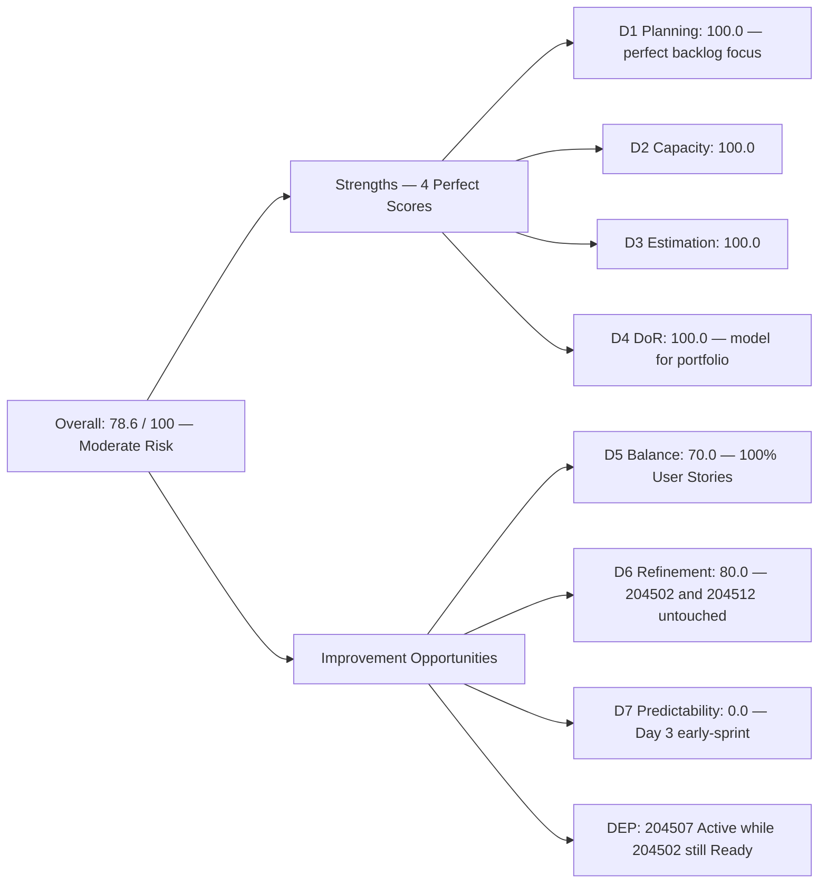
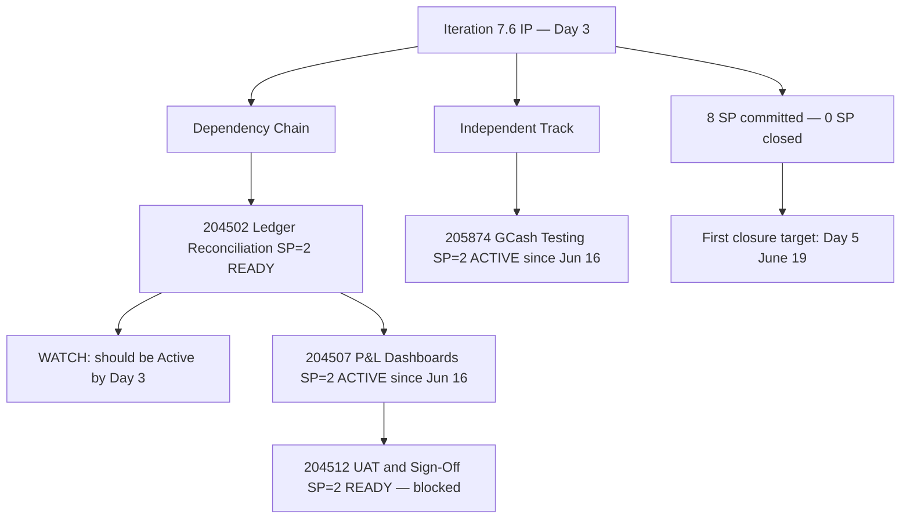
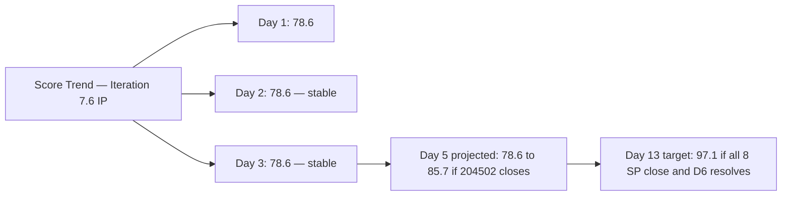

# ADO SAFe Audit — Finance Team

## 1. Audit Metadata

| Field | Value |
|-------|-------|
| **Audit Date** | 2026-06-17 (Wednesday) — Day 3 of 14 |
| **Timezone** | PHT (UTC+8) |
| **Iteration** | Iteration 7.6 (IP) |
| **Iteration Dates** | 2026-06-15 to 2026-06-28 |
| **Sprint Day** | Day 3 — Sprint Active |
| **ADO Project** | Jairosoft FINOPS |
| **ADO Project ID** | e0bb302f-40f9-46c3-8164-6f1acb317d63 |
| **ADO Team** | Finance Team |
| **ADO Team ID** | 1f4b45fa-82e8-4a36-aedc-6c1bc8f51070 |
| **Iteration ID** | bebf6f83-a342-42a2-bad7-a16951231732 |
| **Workspace** | `ado_fin` |
| **Prior Audit** | AUDIT_20260616_0205.md (Day 2, Iteration 7.6 IP, 78.6 — Moderate Risk) |
| **Overall Score** | **78.6 / 100** |
| **Risk Band** | **Moderate Risk** |

---

## 2. Executive Summary

The Finance Team remains at **78.6 / 100 (Moderate Risk)** on Day 3 of Iteration 7.6 (IP) — the score is unchanged from Day 2 (78.6). The backlog is stable: 4 items, 8 SP, all in the current iteration, all DoR-compliant.

**Sprint activation is progressing.** Two items transitioned to Active on Day 2 and remain active through Day 3: 204507 (Generate & Configure Clean P&L Dashboards) and 205874 (GCash Testing). Both were last updated 2026-06-16. Grace is working two concurrent items simultaneously — a positive productivity signal for a single-contributor team.

**The dependency chain concern from Day 2 is now critical.** Item 204507 (P&L Dashboards) has been Active for two days while 204502 (Full-Month Ledger Reconciliation) — its stated prerequisite — remains in Ready state. Grace's acceptance criteria for 204507 explicitly states "Given a fully reconciled ledger from Story 1." If the ledger is not substantively complete, 204507 work may be producing output that requires rework once 204502 is properly closed. Today is the recommended checkpoint: Grace should clarify whether 204502 is effectively complete and close it in ADO, or pause 204507 until 204502 is ready.

**First closures are expected by Day 5 (June 19).** D7 = 0.0 is fully expected at Day 3, but the team should target 204502 and 205874 closure by Day 5–6 to establish velocity and unblock 204512 (UAT/Sign-Off) in the second week.

---

## 3. Previous Audit Delta

**Prior audit:** AUDIT_20260616_0205.md — Iteration 7.6 IP, Day 2, Score 78.6 / 100 (Moderate Risk)

| Dimension | Day 2 | Day 3 | Delta | Driver |
|-----------|-------|-------|-------|--------|
| D1 Iteration Planning | 100.0 | **100.0** | 0.0 | VRBI=CIRI=4 — perfect alignment unchanged |
| D2 Team Capacity | 100.0 | **100.0** | 0.0 | Grace: 2hr/day — unchanged |
| D3 Estimation | 100.0 | **100.0** | 0.0 | 4/4 at SP=2 — unchanged |
| D4 DoR Compliance | 100.0 | **100.0** | 0.0 | 4/4 DoR compliant — unchanged |
| D5 Work Item Balance | 70.0 | **70.0** | 0.0 | 4/4 User Stories = 100% — structural penalty persists |
| D6 Backlog Refinement | 80.0 | **80.0** | 0.0 | 204502 and 204512 still untouched (Jun 14) = 50% → −20 |
| D7 Delivery Predictability | 0.0 | **0.0** | 0.0 | No Closed/Done items — Day 3 early-sprint |
| **Overall** | **78.6** | **78.6** | **0.0** | Score stable; first closures anticipated Day 5–6 |

**Significant changes since Day 2:**
- **No new state transitions or ADO changes** detected on any CIRI item since 2026-06-16
- 204507 and 205874 remain Active (unchanged since 2026-06-16)
- 204502 and 204512 remain Ready (unchanged since 2026-06-14)

**Key action threshold approaching:** Day 3 is the Day 2 audit's recommended checkpoint for 204502 activation. If 204502 is not moved to Active or Closed today, the dependency chain to 204512 (UAT) will compress the second-week schedule.

---

## 4. Current Iteration Snapshot

| Attribute | Value |
|-----------|-------|
| **Active Iteration** | Iteration 7.6 (IP) |
| **Sprint Duration** | 2026-06-15 to 2026-06-28 (14 days) |
| **Audit Day** | Day 3 |
| **VRBI (visible root backlog items)** | 4 |
| **CIRI (current iteration root items)** | 4 |
| **CIRI — Ready** | 2 (204502, 204512) |
| **CIRI — Active** | 2 (204507, 205874) |
| **CIRI — Closed/Done** | 0 |
| **Contributors with Current Work** | 1 (Grace) |
| **Contributors with Capacity** | 1 (Grace: 2hr/day, 0 days off) |
| **Committed Story Points** | 8 |
| **Closed Story Points** | 0 |
| **Delivery Rate** | 0.0% — early-sprint (Day 3 of 14, annotated) |

---

## 5. Work Item Analysis

### CIRI — All 4 Items (all Grace)

| ID | Title | Type | State | SP | Changed |
|----|-------|------|-------|----|---------|
| 204502 | Complete Full-Month Ledger Reconciliation | User Story | Ready | 2 | 2026-06-14 |
| 204507 | Generate & Configure Clean P&L Dashboards | User Story | Active | 2 | 2026-06-16 |
| 204512 | Final Feature Audit, UAT, and Sign-Off | User Story | Ready | 2 | 2026-06-14 |
| 205874 | Gcash Testing | User Story | Active | 2 | 2026-06-16 |

**Type breakdown:** User Story ×4 (100%)
**Total Committed SP:** 8

### Dependency Chain Assessment

```
204502 (Ledger Reconciliation) — READY [Day 3: still inactive — CRITICAL]
    → 204507 (P&L Dashboards) — ACTIVE (Day 2 since Jun 16)
        → 204512 (UAT/Sign-Off) — READY [blocked until above two close]

205874 (GCash Testing) — ACTIVE [independent — no dependency issue]
```

**Escalating flag:** 204507 has been Active for two days (since Jun 16) while 204502 remains in Ready state. The dependency risk is now high: if 204502 requires substantial reconciliation work that uncovers discrepancies, P&L dashboard configuration based on an unreconciled ledger would need to be redone. Grace should assess:
1. Is 204502 substantively complete and the ADO state simply lagging? → Close 204502 today.
2. Is 204507 being scoped in a way that does not require 204502 to be complete first? → Document the parallel approach and add rationale to 204507's description.
3. Is 204502 blocked by missing data or access? → Raise the blocker today.

### DoR Assessment (CIRI — 4 items)

| ID | Title | Desc ≥ 30 | AC ≥ 20 | Compliant |
|----|-------|-----------|---------|-----------|
| 204502 | Complete Full-Month Ledger Reconciliation | Yes (user-voice) | Yes (Given/When/Then: variance = 0) | **Yes** |
| 204507 | Generate & Configure Clean P&L Dashboards | Yes (user-voice) | Yes (Given/When/Then: drill-down) | **Yes** |
| 204512 | Final Feature Audit, UAT, and Sign-Off | Yes (user-voice) | Yes (Given/When/Then: Closed Feature) | **Yes** |
| 205874 | Gcash Testing | Yes (user-voice) | Yes (Given/When/Then: HTTP 200 OK) | **Yes** |

**DoR: 4/4 = 100%** — unchanged from Day 2.

---

## 6. SAFe Compliance Scorecard

| Dimension | Score | Evidence | Notes |
|-----------|-------|----------|-------|
| D1 Iteration Planning | 100.0 | 4 CIRI / 4 VRBI × 100 | Perfect alignment — Finance backlog fully committed to current sprint |
| D2 Team Capacity | 100.0 | 1/1 contributor with capacity | Grace: Documentation 1hr/day + Requirements 1hr/day = 2hr/day total |
| D3 Estimation | 100.0 | 4/4 CIRI estimated (SP=2 each) | Uniform estimation maintained; independent sizing recommended for 7.7 |
| D4 DoR Compliance | 100.0 | 4/4 CIRI meet description + AC | Best-in-portfolio DoR quality; user-voice + Gherkin AC pattern throughout |
| D5 Work Item Balance | 70.0 | US=4/4=100% > 60% → −30 | Structural single-type sprint; one Spike or Enabler in 7.7 resolves this |
| D6 Backlog Refinement | 80.0 | 4/4 VRBI fresh; 204502+204512 untouched (Jun 14) = 2/4 = 50% → −20 | Penalty clears when 204502 transitions to Active or Closed |
| D7 Delivery Predictability | 0.0 | 0/8 SP closed — Day 3 (early-sprint) | **Early-sprint — low delivery expected**; first closures targeted Day 5–6 |
| **Overall** | **78.6** | (100+100+100+100+70+80+0)/7 | **Moderate Risk** |

---

## 7. Dimension Findings

### D1 — Iteration Planning: 100.0

```
visible_root_backlog_items (VRBI) = 4
current_iteration_root_items (CIRI) = 4
  [all with IterationPath = "Jairosoft FINOPS\2026-PI7\Iteration 7.6 (IP)"]

Score = round(4 / 4 × 100, 1) = 100.0
```

Perfect alignment. The Finance Team backlog is entirely focused on the current sprint with zero future-PI items at story level. This is the most compact and well-focused backlog in the FINOPS portfolio — a model for other teams.

### D2 — Team Capacity: 100.0

```
contributors_with_current_work = 1  [Grace — sole assignee on all 4 items]
contributors_with_capacity = 1  [Grace: Documentation 1hr/day + Requirements 1hr/day — team 1f4b45fa]

Score = round(1 / 1 × 100, 1) = 100.0
```

Grace's capacity is properly configured. No change from Day 2.

### D3 — Estimation: 100.0

```
point_eligible_current_items = 4
estimated_current_items = 4  [all SP=2; total committed = 8 SP]

Score = round(4 / 4 × 100, 1) = 100.0
```

All items estimated. The uniform SP=2 across all 4 items warrants re-evaluation in the next sprint — 204502 (full-month reconciliation) almost certainly requires more effort than 204512 (UAT sign-off presentation).

### D4 — DoR Compliance: 100.0

```
dor_compliant_current_items = 4
current_iteration_root_items = 4

Score = round(4 / 4 × 100, 1) = 100.0
```

The Finance Team's user-voice format (As a/I want to/So that) and Gherkin acceptance criteria (Given/When/Then) provide best-in-portfolio documentation quality. This standard should be referenced as a template for other FINOPS teams.

### D5 — Work Item Balance: 70.0

```
Start: 100
User Story items in CIRI: 4 (present) → no −40 absence penalty
dominant_type_share: User Story = 4/4 = 100% > 60% → −30
spike_share: 0/4 = 0% → no penalty

Score = max(0, 100 − 30) = 70.0
```

Single-type sprint for the third consecutive audit period. The Finance Team's remit naturally produces User Stories (financial processes). Adding one IP ceremony Spike (e.g., "Conduct PI7 Team Retrospective and document lessons learned") in 7.6 (IP) is a natural fit that would reduce US concentration to 75% (still penalized at 3/4) but signals the right intent for Iteration 7.7 where a Spike could break the threshold entirely at 2US+1Spike+1Enabler.

### D6 — Backlog Refinement: 80.0

```
visible_root_backlog_items (VRBI) = 4
fresh_visible_root_items (ChangedDate ≥ 2026-05-03) = 4
  - 204502: 2026-06-14 → fresh
  - 204507: 2026-06-16 → fresh (touched Day 2)
  - 204512: 2026-06-14 → fresh
  - 205874: 2026-06-16 → fresh (touched Day 2)
stale_90_visible_root_items (ChangedDate < 2026-03-19) = 0
stale_180_visible_root_items (ChangedDate < 2025-12-20) = 0

untouched_current_items (ChangedDate < 2026-06-15 sprint start):
  - 204502: 2026-06-14 → untouched
  - 204512: 2026-06-14 → untouched

untouched_count = 2/4 = 50% > 30% → −20

base = round(4/4 × 100, 1) = 100.0
Penalty: −20
Score = max(0, 100.0 − 20) = 80.0
```

D6 is one state transition away from resolving to 100.0. If Grace moves 204502 to Active today (which also addresses the dependency chain concern), the untouched count drops to 25% (1/4 = 204512) — still above 30%, so the penalty persists. Once 204512 also transitions to Active, the untouched count reaches 0% and D6 = 100.0. This improvement path is naturally aligned with sprint progress and requires no separate action.

### D7 — Delivery Predictability: 0.0 (early-sprint)

```
committed_story_points = 8  [4 items × SP=2]
closed_story_points = 0

Score = round(0 / 8 × 100, 1) = 0.0

ANNOTATION: Early-sprint — low delivery expected (Day 3 of 14)
```

D7 = 0.0 is expected on Day 3. Grace's Iteration 7.5 delivery record (full completion by Day 13) and the lighter IP sprint load (8 vs prior sprints) support a positive outlook for final D7. Required delivery rate: 8 SP over 11 remaining days = 0.73 SP/day — well within Grace's demonstrated capacity of ~1.0 SP/day.

**Dependency risk for D7:** If 204502 is not closed before 204507, then 204512 (UAT) cannot begin until both predecessors close. This creates a potential end-of-sprint crunch where all closures occur in Days 10–13. Spreading closures earlier (Days 5–8) reduces this risk.

---

## 8. Score Breakdown and Trend







---

## 9. Risks and Bottlenecks

| # | Risk | Severity | Status |
|---|------|----------|--------|
| 1 | 204507 Active while 204502 (prerequisite) still Ready — Day 3 of dependency inversion | **High** | Today is the threshold day; Grace must clarify 204502 status and either close it or document parallel approach |
| 2 | 204512 (UAT) blocked until both 204502 and 204507 close | **High** | If closures slip to Days 8–10, UAT window compresses to Days 11–13 — very tight for a formal sign-off ceremony |
| 3 | 0 SP closed through Day 3 | Moderate | Expected early-sprint; first closures must land by Day 5 or velocity target becomes difficult |
| 4 | Single contributor (Grace) on all Finance items | **High** | Persistent bus-factor risk; if Grace is unavailable any day, sprint completion is at risk |
| 5 | D5 type concentration: 4/4 User Stories (100%) | Low | Structural; add one IP ceremony Spike for 7.7 planning |
| 6 | Uniform SP=2 across all items | Low | Likely underestimates 204502 effort; may produce unrealistic expectations vs. actuals in velocity tracking |

---

## 10. Prioritized Recommendations

1. **[High] Clarify and resolve 204502 dependency today (Day 3).** This was the Day 2 audit's explicit recommendation. With 204507 two days into Active state, Grace should: (a) close 204502 in ADO if the ledger is complete, OR (b) add a comment to 204507 documenting why parallel execution is acceptable. Either action provides audit evidence and unblocks 204512 planning.
2. **[High] Target first item closures by Day 5 (June 19).** With 8 SP and 11 remaining days, closing 204502 and 205874 by Day 5 establishes velocity (4 SP = 50% delivery) and signals mid-sprint health. This also removes the D6 untouched penalty (204502 closure updates its ChangedDate).
3. **[Moderate] Activate 204502 in ADO today.** Even if 204502 is not complete, transitioning it to Active signals active work and reduces the D6 untouched count from 50% to 25% (penalty persists but evidence improves). This requires no code changes — just an ADO state update.
4. **[Moderate] Plan 204512 UAT scheduling now.** Determine when Grace can schedule the UAT presentation with stakeholders. UAT/Sign-Off items typically require calendar coordination — booking a slot in Days 10–12 (June 25–27) now avoids last-day scramble.
5. **[Low] Add predecessor links in ADO.** Configure 204502 as a predecessor to 204507, and both as predecessors to 204512. This makes the dependency visible on the board and provides automatic blocking signals.
6. **[Low] Plan type diversification for 7.7.** A single Spike (e.g., research on QuickBooks forecasting features or cash flow projection tools) would break the 100% User Story concentration and raise D5 toward 100 in the next sprint.

---

## 11. Evidence Gaps and Limitations

| Gap | Impact | Notes |
|-----|--------|-------|
| 204502 state and actual progress unknown | D6 untouched penalty persists; dependency risk accumulates | Cannot determine from ADO state alone whether reconciliation is in progress — requires Grace's status update |
| D7 = 0.0 on Day 3 | Expected early-sprint | Grace's 7.5 record of full delivery is the primary confidence anchor; re-evaluate at Day 5 |
| Uniform SP=2 across all items | Estimation fidelity unverifiable | 204502 likely carries more effort than 204512; velocity and planning accuracy would improve with independent sizing |
| D6 untouched penalty (2/4 = 50%) | Will resolve automatically when 204502 and 204512 transition states | No separate action needed — sprint progress naturally clears this |
| Dependency links not enforced in ADO | Sequencing risk not visible on board | 204502→204507→204512 chain documented in AC only; no ADO predecessor relationship configured |
| Single-contributor sprint | All delivery evidence relies on Grace's ADO updates | No peer review mechanism in Finance Team's current configuration |
