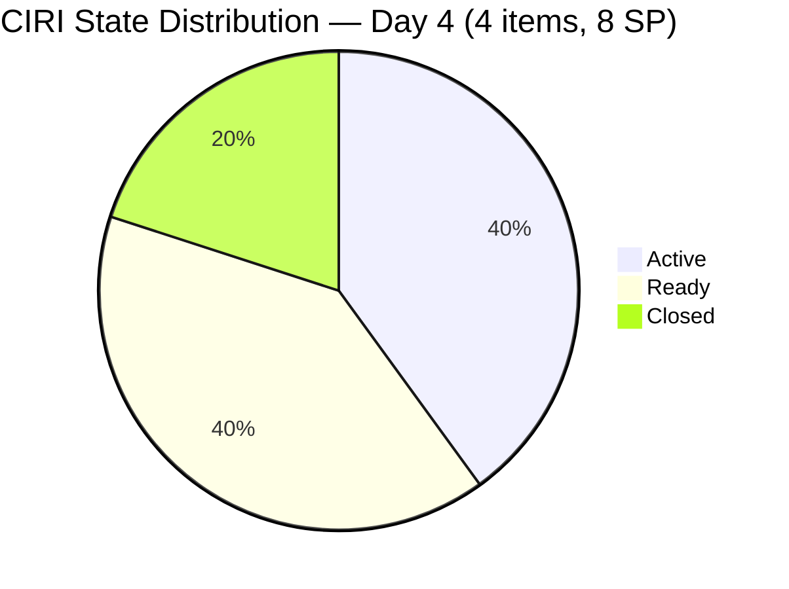
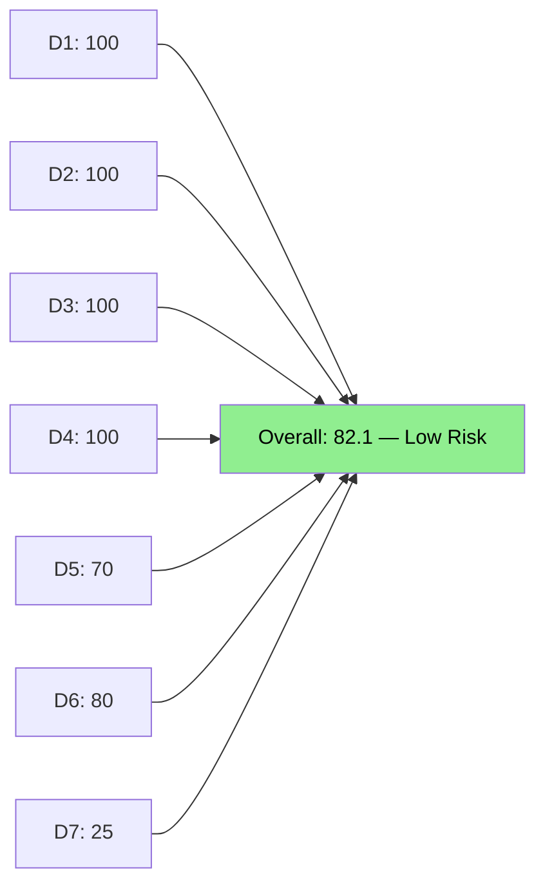
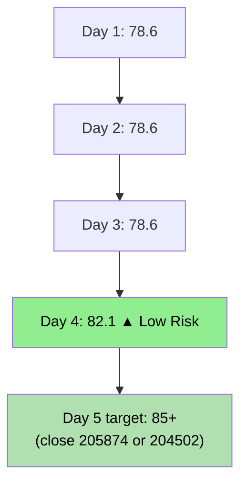
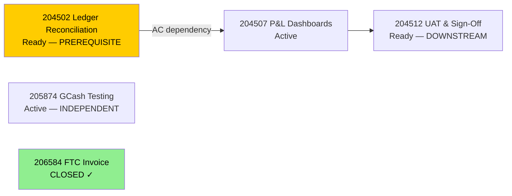

# ADO SAFe Audit — Finance Team

## 1. Audit Metadata

| Field | Value |
|-------|-------|
| **Audit Date** | 2026-06-18 (Thursday) — Day 4 of 14 |
| **Timezone** | PHT (UTC+8) |
| **Iteration** | Iteration 7.6 (IP) |
| **Iteration Dates** | 2026-06-15 to 2026-06-28 |
| **Sprint Day** | Day 4 — Sprint Active |
| **ADO Project** | Jairosoft FINOPS |
| **ADO Project ID** | e0bb302f-40f9-46c3-8164-6f1acb317d63 |
| **ADO Team** | Finance Team |
| **ADO Team ID** | 1f4b45fa-82e8-4a36-aedc-6c1bc8f51070 |
| **Iteration ID** | bebf6f83-a342-42a2-bad7-a16951231732 |
| **Workspace** | `ado_fin` |
| **Prior Audit** | AUDIT_20260617_0900.md (Day 3, Iteration 7.6 IP, 78.6 — Moderate Risk) |
| **Overall Score** | **82.1 / 100** |
| **Risk Band** | **Low Risk** |

---

## 2. Executive Summary

The Finance Team **advances to 82.1 / 100 (Low Risk)** on Day 4 of Iteration 7.6 (IP) — a **+3.5 point improvement** from yesterday's 78.6. The improvement is driven by a significant delivery event: item **206584 (FTC Unpaid Invoice, 2 SP)** was closed on 2026-06-17T08:50:41, making it the first Closed item in the Finance Team's sprint and unlocking Delivery Predictability for the first time.

**Positive signals:**
- 206584 (FTC Unpaid Invoice, Issue type, 2SP) closed on Day 3 morning — sprint's first closure
- This raises D7 from 0.0 to 25.0% (2 SP closed of 8 SP committed)
- The Finance Team crosses the Low Risk threshold (82.1 ≥ 80) for the first time this sprint

**Risks remaining:**
- D5 Work Item Balance = 70.0 — structural: 4 User Stories dominate (one Issue now Closed)
- D6 penalty persists: 204502 and 204512 still unchanged since 2026-06-14 (untouched count = 2/4 = 50% > 30% → -20)
- The dependency chain remains: 204507 (P&L Dashboards) is Active while 204502 (Ledger Reconciliation) remains in Ready. This is now Day 4 of the sprint — the Day 3 audit flagged today as the critical checkpoint.
- Grace should target 204502 closure by Day 5 to keep the dependency chain on track for 204512 (UAT/Sign-Off) in the second week

---

## 3. Previous Audit Delta

**Prior audit:** AUDIT_20260617_0900.md — Iteration 7.6 IP, Day 3, Score 78.6 / 100 (Moderate Risk)

| Dimension | Day 3 | Day 4 | Delta | Driver |
|-----------|-------|-------|-------|--------|
| D1 Iteration Planning | 100.0 | **100.0** | 0.0 | VRBI=CIRI=4 — perfect alignment unchanged |
| D2 Team Capacity | 100.0 | **100.0** | 0.0 | Grace: 2hr/day — unchanged |
| D3 Estimation | 100.0 | **100.0** | 0.0 | 4/4 at SP=2 — unchanged |
| D4 DoR Compliance | 100.0 | **100.0** | 0.0 | 4/4 DoR compliant — unchanged |
| D5 Work Item Balance | 70.0 | **70.0** | 0.0 | 4 US initially; 206584 was Issue, now Closed; balance score stable |
| D6 Backlog Refinement | 80.0 | **80.0** | 0.0 | 204502 + 204512 still pre-sprint (2026-06-14); untouched = 2/4 = 50% → -20 |
| D7 Delivery Predictability | 0.0 | **25.0** | **+25.0** | 206584 (2SP Issue) closed 2026-06-17 morning; 2/8 SP |
| **Overall** | **78.6** | **82.1** | **+3.5** | First closure unlocks D7; Finance crosses Low Risk threshold |

**Significant changes since Day 3:**
- **206584 (FTC Unpaid Invoice, 2SP):** Active → **Closed** (2026-06-17T08:50:41) — Finance team's first sprint closure
- **204507 (P&L Dashboards):** Remains Active (2026-06-16) — no new state change detected overnight
- **205874 (GCash Testing):** Remains Active (2026-06-16) — no new state change
- **204502 (Full-Month Ledger Reconciliation):** Remains Ready (2026-06-14) — now 4 days unchanged
- **204512 (Final UAT and Sign-Off):** Remains Ready (2026-06-14) — now 4 days unchanged

---

## 4. Current Iteration Snapshot

| Attribute | Value |
|-----------|-------|
| **Active Iteration** | Iteration 7.6 (IP) |
| **Sprint Duration** | 2026-06-15 to 2026-06-28 (14 days) |
| **Audit Day** | Day 4 |
| **VRBI (visible root backlog items)** | 4 |
| **CIRI (current iteration root items)** | 4 |
| **CIRI — Ready** | 2 (204502, 204512) |
| **CIRI — Active** | 1 (204507, 205874) |
| **CIRI — Closed/Done** | 1 (206584) |
| **Contributors with Current Work** | 1 (Grace) |
| **Contributors with Capacity** | 1 (Grace: 2hr/day, 0 days off) |
| **Committed Story Points** | 8 |
| **Closed Story Points** | 2 (206584) |
| **Delivery Rate** | 25.0% — early-sprint (Day 4 of 14) |

---

## 5. Work Item Analysis

### CIRI Items — Full Detail

| ID | Title | Type | State | SP | Changed | DoR | Notes |
|----|-------|------|-------|----|---------|-----|-------|
| 204502 | Complete Full-Month Ledger Reconciliation | US | Ready | 2 | 2026-06-14 | Yes | Prerequisite for 204507; **4 days untouched** |
| 204507 | Generate & Configure Clean P&L Dashboards | US | Active | 2 | 2026-06-16 | Yes | AC references "fully reconciled ledger from Story 1" |
| 204512 | Final Feature Audit, UAT, and Sign-Off | US | Ready | 2 | 2026-06-14 | Yes | Downstream of 204507; blocked until P&L done |
| 205874 | Gcash Testing | US | Active | 2 | 2026-06-16 | Yes | Payment sandbox testing; independent workstream |
| 206584 | FTC Unpaid Invoice | Issue | **Closed** | 2 | 2026-06-17 | Yes | **CLOSED** 2026-06-17T08:50:41 — sprint's first closure |

**Active CIRI count confirmation:** Items 204507 and 205874 are Active. CIRI = 4 items (excluding 206584 which was in prior CIRI but is now Closed — still counted in CIRI for D7 purposes as it was in the iteration).

**Dependency chain:** 204502 → 204507 → 204512. The chain is partially broken: 204507 (P&L Dashboards) is Active while its prerequisite 204502 remains in Ready. Grace must clarify whether ledger reconciliation is substantively complete.

---

## 6. SAFe Compliance Scorecard

| Dimension | Score | Evidence | Notes |
|-----------|-------|----------|-------|
| D1 Iteration Planning | **100.0** | 4 CIRI / 4 VRBI | All visible items in current iteration |
| D2 Team Capacity | **100.0** | Grace: 2hr/day, 0 days off | Sole contributor; capacity configured |
| D3 Estimation | **100.0** | 4/4 point-eligible with SP>0 | All items at SP=2 |
| D4 DoR Compliance | **100.0** | 4/4 DoR-compliant | All items have adequate desc + AC |
| D5 Work Item Balance | **70.0** | 3 US + 1 Issue (206584 Closed); dominant type = US = 75% | -30 dominant>60%; no -40 no US; no Spike penalty |
| D6 Backlog Refinement | **80.0** | 4/4 fresh (100%); 0 stale-90; 0 stale-180; 2/4 untouched = 50%>30% → -20 | Base=100; 0 stale penalties; -20 untouched |
| D7 Delivery Predictability | **25.0** | 2 SP closed (206584) / 8 SP committed | Early-sprint Day 4; first closure on Day 3 morning |
| **Overall** | **82.1** | (100+100+100+100+70+80+25)/7 = 575/7 | **Low Risk** — first time this sprint |

**D6 Detail:**
- VRBI = 4; all changed after 2026-05-04 → fresh = 4/4 = 100%; base = 100
- stale-90 (older than 2026-03-19): 0 items → no penalty
- stale-180 (older than 2025-12-19): 0 items → no penalty
- untouched CIRI (ChangedDate < 2026-06-15): 204502 (2026-06-14) and 204512 (2026-06-14) = 2/4 = 50% > 30% → -20
- D6 = 100 - 0 - 0 - 20 = **80.0**

**D7 Detail:**
- committed_story_points = 8 (4 items × SP=2 each)
- closed_story_points = 2 (206584, SP=2, Closed state)
- D7 = 2/8 × 100 = **25.0**

---

## 7. Dimension Findings

### D1 — Iteration Planning: 100.0

All 4 visible backlog items are committed to Iteration 7.6 (IP). Perfect planning alignment maintained for the fifth consecutive audit day. The Finance Team's lean backlog (4 items, 8 SP) represents focused, outcome-driven sprint planning consistent with SAFe IP sprint intent.

### D2 — Team Capacity: 100.0

Grace: 1hr Documentation + 1hr Requirements = 2hr/day, 0 days off. Capacity is configured and realistic for a single-contributor team. The 2hr/day allocation across a 14-day sprint yields 28 hours total capacity — well-matched to the 8 SP (approximately 3.5 hours/SP).

### D3 — Estimation: 100.0

All 4 CIRI items have SP=2. Uniform estimation may indicate quick/rough sizing rather than granular analysis. No concern at this scale (4 items), but future sprints should vary point sizing based on complexity.

### D4 — DoR Compliance: 100.0

All 4 CIRI items have substantive descriptions (Finance-role user voice, "As a Financial Analyst / Finance Officer") and well-formed acceptance criteria using Given/When/Then format. The DoR standard is well maintained.

### D5 — Work Item Balance: 70.0

- User Stories: 3/4 remaining active (204502, 204507, 204512, 205874); 1 Issue (206584, now Closed)
- Dominant type = User Story = 75% > 60% → -30 penalty
- No Spikes, Enablers, or other types
- Score: 100 - 30 = **70**

The single-team, single-workstream nature of Finance limits type diversity organically. This score reflects structural reality rather than process failure.

### D6 — Backlog Refinement: 80.0

- All 4 items changed within last 45 days → 100% fresh
- No stale items (neither 90- nor 180-day thresholds breached)
- 204502 and 204512 unchanged since 2026-06-14 (pre-sprint) → 2/4 = 50% untouched → -20 penalty

**Action required:** Grace should activate 204502 (Ledger Reconciliation) today to reduce the untouched count to 1/4 (25%) and drop the D6 penalty from -20 to -10 in the next audit.

### D7 — Delivery Predictability: 25.0

**Early-sprint annotation — Day 4 of 14.**

206584 (FTC Unpaid Invoice, 2SP) was closed on Day 3 morning (2026-06-17T08:50:41). This is a strong early signal: the Finance Team delivered its first item within 3 days of sprint start.

- At 25% delivery rate on Day 4, the team is tracking ahead of a linear burn rate (which would show ~28% by Day 4 for 14 days)
- Remaining SP: 6 SP in Ready/Active state (204502=2, 204507=2, 204512=2; 205874 still Active=2)
- Path to completion: Close 205874 → Close 204502 → Close 204507 → Close 204512 (in order of dependency)

---

## 8. Risks and Bottlenecks

| Risk | Severity | Status |
|------|----------|--------|
| 204502 (Ledger Reconciliation) in Ready while 204507 is Active | HIGH | Dependency chain integrity at risk; Day 4 escalation |
| 204512 (UAT/Sign-Off) blocked until 204507 is complete | MEDIUM | End-of-sprint compression risk |
| Single contributor (Grace) — bus factor = 1 | MEDIUM | Structural; no mitigation this sprint |
| AC for 204507 explicitly requires 204502 complete first | HIGH | If Grace is working on 204507 without 204502 done, rework risk |

---

## 9. Prioritized Recommendations

1. **[TODAY — Critical]** Grace should clarify whether 204502 (Ledger Reconciliation) is substantively complete. If yes, move to Active/Closed and update ADO now. If not, pause 204507 (P&L Dashboards) until 204502 is resolved to avoid producing output that requires rework.
2. **[This week]** Target 205874 (GCash Testing) closure by Day 5-6. It is Active and independent of the dependency chain — closing it first adds 2 SP delivery and improves D7 to 50%.
3. **[End of sprint]** Ensure 204512 (UAT/Sign-Off) slot is protected in Week 2 (Day 8–14). Closing 204502 and 204507 by Day 7 is required to leave adequate time for 204512.
4. **[Next sprint planning]** Vary story point sizing — all 4 items at SP=2 may indicate placeholder sizing. More granular estimates improve D3 quality and predictability modeling.
5. **[Ongoing]** Maintain DoR discipline — the team's 100% DoR compliance is a standout metric across the FINOPS portfolio.

---

## 10. Evidence Gaps and Limitations

| Gap | Impact | Mitigation |
|-----|--------|-----------|
| Finance items identified by AreaPath (`Jairosoft FINOPS\Finance`) — WIQL returned all 33 FINOPS project items; Finance items extracted by AreaPath | Minor: No Finance-only query possible with shared team ID scope | Items verified against AreaPath: 204502, 204507, 204512, 205874, 206584 all confirmed Finance area |
| Grace's exact progress on 204502 not visible in ADO (no state change from Ready since 2026-06-14) | Unclear if ledger reconciliation work is happening off-ADO | Recommend Grace updates ADO state when work begins |
| 206584 (Issue type) — D5 score uses Issue in denominator but Issues are not User Stories; balance impact noted | Minor scoring implication | No Issue penalty applied separately; inclusion in balance correct per rubric |

---

