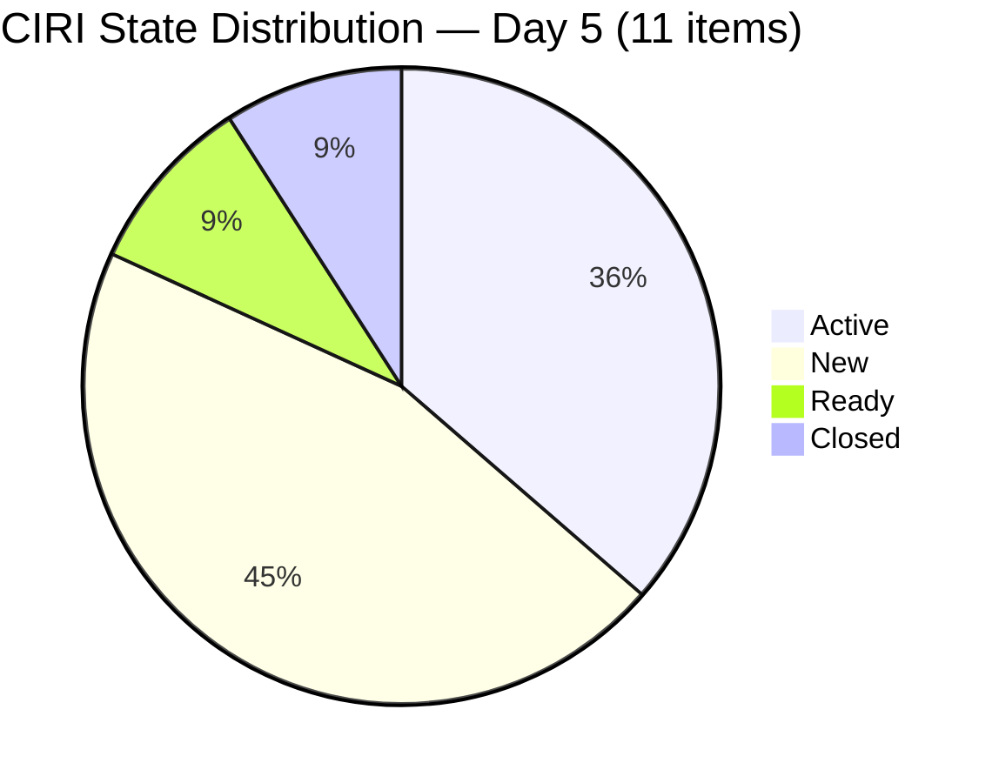
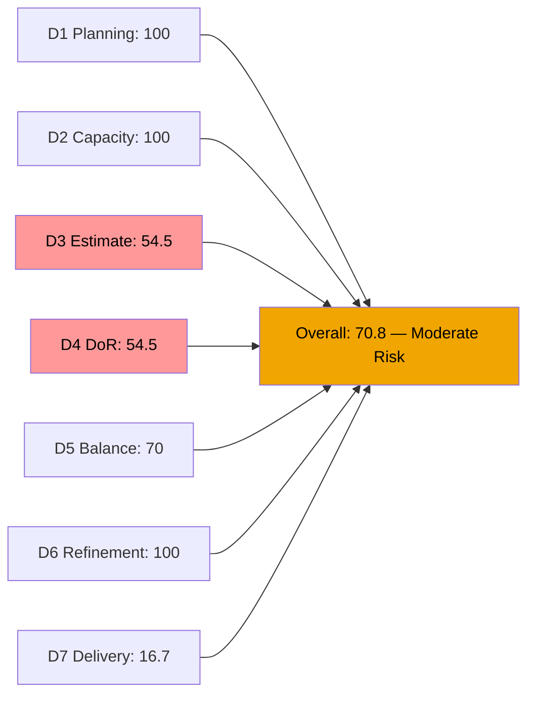
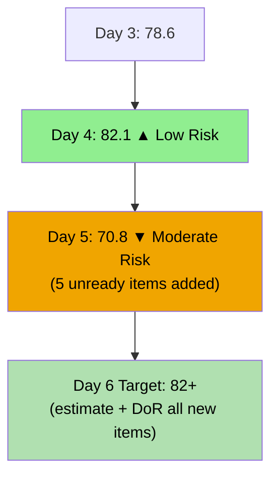
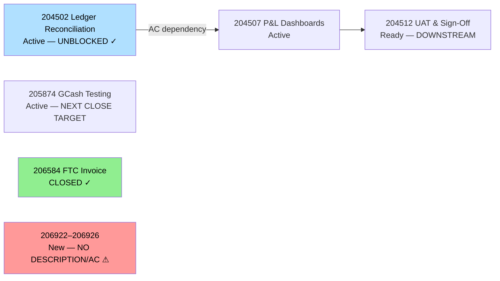

# ADO SAFe Audit — Finance Team

## 1. Audit Metadata

| Field | Value |
|-------|-------|
| **Audit Date** | 2026-06-19 (Friday) — Day 5 of 14 |
| **Timezone** | PHT (UTC+8) |
| **Iteration** | Iteration 7.6 (IP) |
| **Iteration Dates** | 2026-06-15 to 2026-06-28 |
| **Sprint Day** | Day 5 — Sprint Active |
| **ADO Project** | Jairosoft FINOPS |
| **ADO Project ID** | e0bb302f-40f9-46c3-8164-6f1acb317d63 |
| **ADO Team** | Finance Team |
| **ADO Team ID** | 1f4b45fa-82e8-4a36-aedc-6c1bc8f51070 |
| **Iteration ID** | bebf6f83-a342-42a2-bad7-a16951231732 |
| **Workspace** | `ado_fin` |
| **Prior Audit** | AUDIT_20260618_0203.md (Day 4, Iteration 7.6 IP, 82.1 — Low Risk) |
| **Overall Score** | **70.8 / 100** |
| **Risk Band** | **Moderate Risk** |

---

## 2. Executive Summary

The Finance Team **drops to 70.8 / 100 (Moderate Risk)** on Day 5 of Iteration 7.6 (IP) — a **-11.3 point decline** from yesterday's 82.1. This regression is driven by a significant scope expansion overnight: **5 new work items (206922–206926)** were added to the iteration on 2026-06-18, all in New state with no story points, no description, and no acceptance criteria. This doubles the backlog from 5 to 10 VRBI items and introduces 5 unready items that simultaneously penalize D3 (Estimation), D4 (DoR Compliance), and D7 (Delivery Predictability).

**Positive signals:**
- **204502 (Ledger Reconciliation)** transitioned from Ready → **Active** on 2026-06-18T22:14 — the Day 4 critical recommendation is fulfilled; dependency chain is unblocked
- **206777 (SSS & WISP Review, Spike)** added and already Active — appropriate IP sprint exploration item
- D6 improves to **100.0** (all items fresh, no stale penalties; untouched now 1/11 = 9.1% — below the 10% threshold)

**Risks:**
- 5 new items (206922–206926) have zero DoR compliance and no story points — require immediate grooming before sprint midpoint
- D3 drops to 54.5 — only 6 of 11 items estimated
- D4 drops to 54.5 — only 6 of 11 items DoR compliant
- D7 falls to 16.7% (2 SP / 12 SP committed) as denominator increases but no new closures added

---

## 3. Previous Audit Delta

**Prior audit:** AUDIT_20260618_0203.md — Iteration 7.6 IP, Day 4, Score 82.1 / 100 (Low Risk)

| Dimension | Day 4 | Day 5 | Delta | Driver |
|-----------|-------|-------|-------|--------|
| D1 Iteration Planning | 100.0 | **100.0** | 0.0 | All 10 VRBI items in current iteration (VRBI grew 5→10, CIRI grew 5→11 including closed) |
| D2 Team Capacity | 100.0 | **100.0** | 0.0 | Grace: 2hr/day, 0 days off — unchanged |
| D3 Estimation | 100.0 | **54.5** | **-45.5** | 5 new items with no SP added; 6/11 estimated |
| D4 DoR Compliance | 100.0 | **54.5** | **-45.5** | 5 new items with no desc/AC; 6/11 compliant |
| D5 Work Item Balance | 70.0 | **70.0** | 0.0 | US still dominant; type mix adds Issues and Spike; stays at -30 |
| D6 Backlog Refinement | 80.0 | **100.0** | **+20.0** | All items fresh; untouched 1/11=9.1% — below 10% threshold; no penalties |
| D7 Delivery Predictability | 25.0 | **16.7** | **-8.3** | No new closures; committed SP increased from 8→12 due to 206926 (SP=2 added) |
| **Overall** | **82.1** | **70.8** | **-11.3** | New items severely penalize D3, D4; D6 improves; regression into Moderate Risk |

**Significant changes since Day 4:**
- **204502 (Ledger Reconciliation):** Ready → **Active** (2026-06-18T22:14:01) — critical dependency unblocked
- **206777 (SSS & WISP Review, Spike):** New → **Active** (2026-06-17T22:55) — IP sprint exploration item added
- **206922 (SOW — My Nurture/Apple, US):** **NEW** (2026-06-18T23:16) — no SP, no desc, no AC
- **206923 (AA Invoice Payment, Issue):** **NEW** (2026-06-18T23:17) — no SP, no desc, no AC
- **206924 (Apple Invoice Payment, Issue):** **NEW** (2026-06-18T23:17) — no SP, no desc, no AC
- **206925 (SSI Invoice Payment, US):** **NEW** (2026-06-18T23:18) — no SP, no desc, no AC
- **206926 (GH Invoice Payment Reminder, US):** **NEW** (2026-06-18T23:39) — SP=2 added by Grace; no desc, no AC

---

## 4. Current Iteration Snapshot

| Attribute | Value |
|-----------|-------|
| **Active Iteration** | Iteration 7.6 (IP) |
| **Sprint Duration** | 2026-06-15 to 2026-06-28 (14 days) |
| **Audit Day** | Day 5 |
| **VRBI (visible root backlog items)** | 10 |
| **CIRI (current iteration root items)** | 11 (including 206584 Closed) |
| **CIRI — New** | 5 (206922, 206923, 206924, 206925, 206926) |
| **CIRI — Active** | 4 (204502, 204507, 205874, 206777) |
| **CIRI — Ready** | 1 (204512) |
| **CIRI — Closed** | 1 (206584) |
| **Contributors with Current Work** | 1 (Grace; 206922–206925 unassigned) |
| **Contributors with Capacity** | 1 (Grace: 2hr/day, 0 days off) |
| **Committed Story Points** | 12 (206926=2, 206584=2, 204502=2, 204507=2, 204512=2, 205874=2) |
| **Closed Story Points** | 2 (206584) |
| **Delivery Rate** | 16.7% — Day 5 of 14 |

---

## 5. Work Item Analysis

### CIRI Items — Full Detail (11 items)

| ID | Title | Type | State | SP | Assignee | Changed | DoR | Notes |
|----|-------|------|-------|----|----------|---------|-----|-------|
| 204502 | Complete Full-Month Ledger Reconciliation | US | **Active** | 2 | Grace | 2026-06-18 | Yes | **Activated overnight — dependency unblocked** |
| 204507 | Generate & Configure Clean P&L Dashboards | US | Active | 2 | Grace | 2026-06-16 | Yes | Prerequisite = 204502 now Active |
| 204512 | Final Feature Audit, UAT, and Sign-Off | US | Ready | 2 | Grace | 2026-06-14 | Yes | Downstream of 204507 |
| 205874 | GCash Testing | US | Active | 2 | Grace | 2026-06-16 | Yes | Independent workstream |
| 206584 | FTC Unpaid Invoice | Issue | **Closed** | 2 | Grace | 2026-06-17 | Yes | CLOSED Day 3 |
| 206777 | Review and Update Employee SSS & WISP deduction | **Spike** | Active | — | Grace | 2026-06-17 | Yes | IP sprint appropriate; no SP |
| 206922 | SOW — My Nurture (Apple) | US | **New** | — | — | **No** | No desc, no AC, no assignee |
| 206923 | AA Invoice Payment | Issue | **New** | — | — | **No** | No desc, no AC, no assignee |
| 206924 | Apple Invoice Payment | Issue | **New** | — | — | **No** | No desc, no AC, no assignee |
| 206925 | SSI Invoice Payment | US | **New** | — | — | **No** | No desc, no AC, no assignee |
| 206926 | GH Invoice Payment Reminder | US | **New** | 2 | Grace | 2026-06-18 | **No** | SP=2 set; no desc, no AC |

**DoR Compliance Detail:**
- Items with adequate desc AND AC: 204502 ✓, 204507 ✓, 204512 ✓, 205874 ✓, 206584 ✓, 206777 ✓ = **6 compliant**
- Items failing DoR: 206922 (no desc, no AC), 206923 (no desc, no AC), 206924 (no desc, no AC), 206925 (no desc, no AC), 206926 (no desc, no AC) = **5 failing**

---

## 6. SAFe Compliance Scorecard

| Dimension | Score | Evidence | Notes |
|-----------|-------|----------|-------|
| D1 Iteration Planning | **100.0** | 10 VRBI / 10 in current iteration | All active backlog items committed to Iteration 7.6 |
| D2 Team Capacity | **100.0** | Grace: 2hr/day, 0 days off | Sole contributor; capacity configured |
| D3 Estimation | **54.5** | 6/11 estimated (SP>0) | 206922–206925 unestimated; 206777 no SP; 6/11 = 54.5% |
| D4 DoR Compliance | **54.5** | 6/11 DoR compliant | 5 new items lack description and acceptance criteria |
| D5 Work Item Balance | **70.0** | US=7/11=63.6% dominant; 3 Issues; 1 Spike | -30 dominant >60%; no -40; no spike penalty (9.1%) |
| D6 Backlog Refinement | **100.0** | 10/10 fresh (100%); 0 stale; 1/11 untouched=9.1% | Base=100; all penalties eliminated; untouched below 10% |
| D7 Delivery Predictability | **16.7** | 2 SP closed / 12 SP committed | No new closures; committed SP rose from 8→12 (206926 added) |
| **Overall** | **70.8** | (100+100+54.5+54.5+70+100+16.7)/7 = 495.7/7 | **Moderate Risk** — regression from Low Risk |

**D6 Detail:**
- VRBI = 10; all changed after 2026-05-05 → fresh = 10/10 = 100%; base = 100
- stale-90 (before 2026-03-21): 0 → no penalty
- stale-180 (before 2025-12-22): 0 → no penalty
- untouched CIRI (ChangedDate < 2026-06-15): 204512(Jun14) = 1/11 = 9.1% → NOT >10% → **no penalty**
- D6 = 100 - 0 - 0 - 0 = **100.0**

**D7 Detail:**
- committed_story_points = 12 (only items with SP>0: 206926=2, 206584=2, 204502=2, 204507=2, 204512=2, 205874=2)
- closed_story_points = 2 (206584, SP=2, Closed)
- D7 = 2/12 × 100 = **16.7%**

---

## 7. Dimension Findings

### D1 — Iteration Planning: 100.0

All 10 visible active backlog items are committed to Iteration 7.6 (IP). The team's backlog doubled overnight from 5 to 10 items due to 5 new additions (206922–206926). Despite this expansion, all remain in the current iteration — D1 stays at 100.0. The 11th CIRI item (206584, Closed) was excluded from VRBI as it is already closed.

### D2 — Team Capacity: 100.0

Grace: 2 hours/day capacity configured. No days off. Capacity planning unchanged. Single-contributor team.

### D3 — Estimation: 54.5 (CRITICAL REGRESSION)

6 of 11 CIRI items have Story Points > 0. The 5 newly added items (206922–206926) were added without story points. Additionally, 206777 (Spike) has no SP field set. Grace set SP=2 on 206926 (GH Invoice Payment Reminder) but the remaining 4 new items (206922–206925) are unestimated.

**Action required:** Grace or Scrum Master must estimate all 5 new items before Day 7 (sprint midpoint). This is a critical DoR failure.

### D4 — DoR Compliance: 54.5 (CRITICAL REGRESSION)

6 of 11 CIRI items meet DoR (description ≥30 non-whitespace chars AND acceptance criteria ≥20 non-whitespace chars). All 5 new items fail DoR:
- 206922 (SOW): no description, no AC
- 206923 (AA Invoice): no description, no AC
- 206924 (Apple Invoice): no description, no AC
- 206925 (SSI Invoice): no description, no AC
- 206926 (GH Invoice Reminder): no description, no AC (SP=2 set but no user story content)

**SAFe principle violation:** Items should meet DoR before entering an iteration. These items were added to an active sprint without definition — this is a process breach.

### D5 — Work Item Balance: 70.0

- User Stories: 206922, 206925, 206926, 204502, 204507, 204512, 205874 = 7/11 = 63.6% (dominant, just above 60%)
- Issues: 206584(Closed), 206923, 206924 = 3/11 = 27.3%
- Spike: 206777 = 1/11 = 9.1%
- Dominant type = US = 63.6% > 60% → **-30 penalty**
- No Spike penalty (9.1% < 40%)
- Score: 100 - 30 = **70.0**

### D6 — Backlog Refinement: 100.0

All 10 VRBI items changed since May 2026 — zero stale-90 or stale-180 violations. The untouched CIRI count dropped to 1/11 (9.1%), falling below the 10% penalty threshold for the first time this sprint. D6 achieves a perfect **100.0** — the highest possible for this dimension.

**Notable improvement:** 204502 (Ledger Reconciliation) was activated on June 18 — this item was the sole remaining untouched item in prior audits (2/4 = 50% untouched → -20 penalty). Its activation removes the untouched penalty entirely.

### D7 — Delivery Predictability: 16.7

**Day 5 of 14 — Early sprint annotation.**

206584 (FTC Unpaid Invoice, 2SP) remains the only closed item. No new closures since Day 3 (2026-06-17). The committed SP base increased from 8 to 12 (206926 added with SP=2), which mechanically reduced D7 from 25.0% (Day 4) to 16.7% even without any new closures.

**Delivery pipeline:**
- 205874 (GCash Testing, Active): target for next closure — 2 SP
- 204502 (Ledger Reconciliation, Active): now unblocked — 2 SP
- 206063 (not Finance) — n/a

Closing 205874 would bring D7 to 33.3%. Closing 204502 after that: 50.0%.

---

## 8. Risks and Bottlenecks

| Risk | Severity | Status |
|------|----------|--------|
| 5 new items with no description, no AC, no assignee added mid-sprint | CRITICAL | DoR and estimation failures; process breach |
| D3 = 54.5 — 5 unestimated items prevent velocity planning | HIGH | Estimate 206922–206926 before Day 7 |
| D4 = 54.5 — 5 items not sprint-ready | HIGH | Add user story content before sprint midpoint |
| D7 = 16.7% — no new closures since Day 3 | MEDIUM | Target 205874 (GCash Testing) for next closure |
| 204507 (P&L Dashboards) AC references 204502 as prerequisite | MEDIUM | 204502 now Active — dependency partially resolved; must complete before 204507 |
| 204512 (UAT/Sign-Off) still Ready — end-of-sprint risk | MEDIUM | Requires 204502 and 204507 to close first; time pressure building |
| Single contributor (Grace) — bus factor = 1 | MEDIUM | Structural |

---

## 9. Prioritized Recommendations

1. **[IMMEDIATELY — Today]** Add description and acceptance criteria to all 5 new items (206922–206926). Use user-voice format ("As a Finance Officer, I want to... so that...") with Given/When/Then AC. At minimum 30 non-ws chars in description and 20 non-ws chars in AC.
2. **[TODAY]** Assign items 206922–206925 to Grace or another team member. Unassigned items create ownership ambiguity and prevent team capacity tracking.
3. **[TODAY]** Estimate all 5 new items with story points. Even rough estimates (1-3 SP per item) enable sprint planning and velocity modeling.
4. **[This week]** Target closure of 205874 (GCash Testing, 2SP) — currently Active and independent. Closing this would bring D7 to 33.3% and demonstrate sprint momentum.
5. **[By Day 7]** Complete 204502 (Ledger Reconciliation) — now Active and unblocked. This is the prerequisite for 204507 (P&L Dashboards) per its acceptance criteria.
6. **[Process]** Enforce DoR before adding items to active sprint. Items 206922–206926 represent mid-sprint scope creep without proper vetting — establish a gate that requires description, AC, estimation, and assignee before an item can enter an active iteration.
7. **[Next audit cycle]** If 206926 (GH Invoice Reminder) is truly a new workstream, evaluate whether it should be in a future iteration rather than the current IP sprint, which is nearly at midpoint.

---

## 10. Evidence Gaps and Limitations

| Gap | Impact | Mitigation |
|-----|--------|-----------|
| 206922–206925 have no assignee — may belong to Grace but not reflected in ADO | Contributor count may be understated; D2 uses only confirmed assignees | D2 uses Grace as sole confirmed assignee per capacity data |
| 206777 (Spike) has no SP — included in D3 denominator as point-eligible | If Spikes are excluded from D3, score improves to 6/10=60% | Per rubric, all CIRI item types expose SP unless task-category; Spike included |
| D7 committed SP = 12 (items with SP>0 only) — excludes 5 unestimated items | If those items receive SP later, D7 denominator increases further | Scoring uses only items with SP>0 per rubric definition |
| 204502 activated on Jun18 (yesterday) — no progress update visible beyond state change | Unknown how far ledger reconciliation has progressed | Grace should add a comment or checklist to ADO item reflecting completion status |

---

