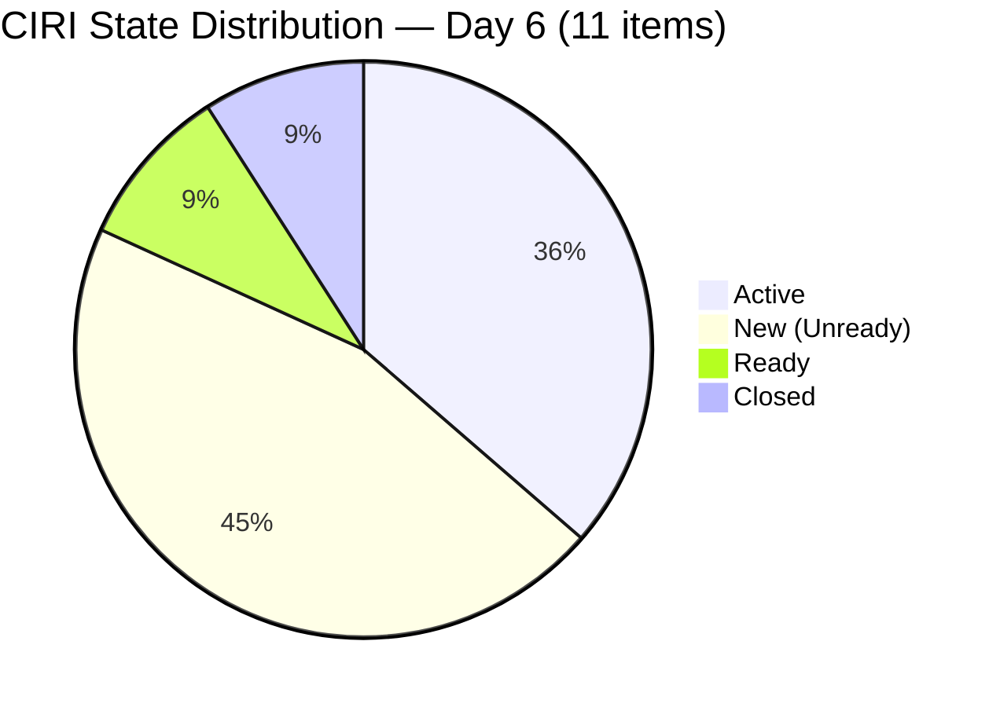
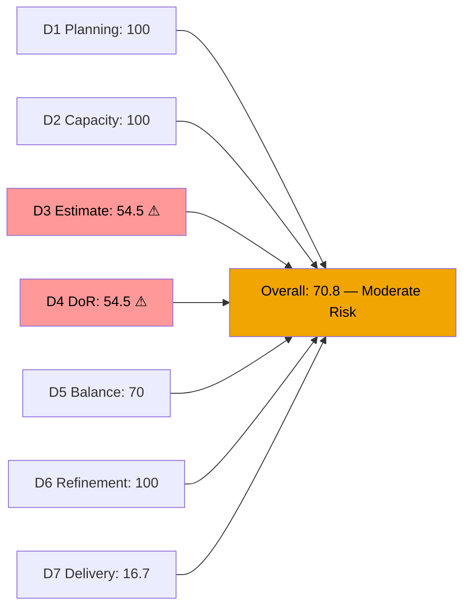
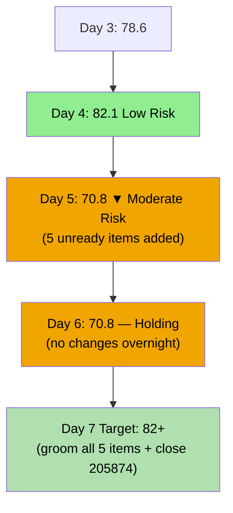
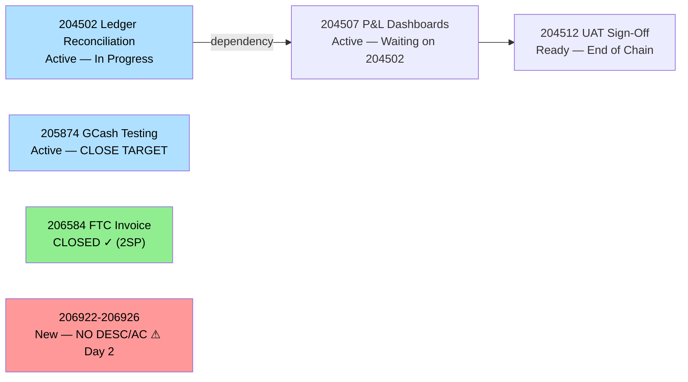

# ADO SAFe Audit — Finance Team

## 1. Audit Metadata

| Field | Value |
|-------|-------|
| **Audit Date** | 2026-06-20 (Saturday) — Day 6 of 14 |
| **Timezone** | PHT (UTC+8) |
| **Iteration** | Iteration 7.6 (IP) |
| **Iteration Dates** | 2026-06-15 to 2026-06-28 |
| **Sprint Day** | Day 6 — Sprint Active |
| **ADO Project** | Jairosoft FINOPS |
| **ADO Project ID** | e0bb302f-40f9-46c3-8164-6f1acb317d63 |
| **ADO Team** | Finance Team |
| **ADO Team ID** | 1f4b45fa-82e8-4a36-aedc-6c1bc8f51070 |
| **Iteration ID** | bebf6f83-a342-42a2-bad7-a16951231732 |
| **Workspace** | `ado_fin` |
| **Prior Audit** | AUDIT_20260619_0905.md (Day 5, Iteration 7.6 IP, 70.8 — Moderate Risk) |
| **Overall Score** | **70.8 / 100** |
| **Risk Band** | **Moderate Risk** |

---

## 2. Executive Summary

The Finance Team **holds at 70.8 / 100 (Moderate Risk)** on Day 6 of Iteration 7.6 (IP) — **no change** from yesterday's 70.8. All dimensions are identical to Day 5: no new closures, no new items, and no updates to the 5 under-defined items (206922–206926) added on June 18. The sprint is now at its midpoint approach (Day 6 of 14) with 5 items still lacking description and acceptance criteria.

**Urgent — unchanged critical gaps:**
- 5 items (206922–206926) still in New state with no description, no acceptance criteria, and (for 206922–206925) no assignee
- D3 = 54.5 — only 6 of 11 items estimated (5 new items have no SP)
- D4 = 54.5 — only 6 of 11 items DoR-compliant
- D7 = 16.7% — 2 SP closed of 12 SP committed; no new closures since Day 3

**Positive signals:**
- D6 = 100.0 — all 10 visible backlog items fresh; zero stale penalties; untouched rate remains below 10% threshold
- D1 = 100.0 — all visible items in current iteration
- D2 = 100.0 — Grace's capacity fully configured
- 204502 (Ledger Reconciliation) remains Active — dependency chain for 204507 and 204512 in motion

**Priority today:** The unready items must receive descriptions, acceptance criteria, and story point estimates before Day 7 (sprint midpoint). The team continues to operate at High Risk for Estimation and DoR despite no structural problems in the rest of the scorecard.

---

## 3. Previous Audit Delta

**Prior audit:** AUDIT_20260619_0905.md — Iteration 7.6 IP, Day 5, Score 70.8 / 100 (Moderate Risk)

| Dimension | Day 5 | Day 6 | Delta | Driver |
|-----------|-------|-------|-------|--------|
| D1 Iteration Planning | 100.0 | **100.0** | 0.0 | All 10 visible VRBI items in current iteration — unchanged |
| D2 Team Capacity | 100.0 | **100.0** | 0.0 | Grace: 2hr/day, 0 days off — unchanged |
| D3 Estimation | 54.5 | **54.5** | 0.0 | 6/11 estimated — no new SP added to unready items |
| D4 DoR Compliance | 54.5 | **54.5** | 0.0 | 6/11 compliant — no description/AC added to 206922–206926 |
| D5 Work Item Balance | 70.0 | **70.0** | 0.0 | Type mix unchanged |
| D6 Backlog Refinement | 100.0 | **100.0** | 0.0 | All items fresh; untouched 1/11=9.1% — unchanged |
| D7 Delivery Predictability | 16.7 | **16.7** | 0.0 | No new closures; committed SP = 12; closed SP = 2 |
| **Overall** | **70.8** | **70.8** | **0.0** | No ADO activity since Jun 18 |

**Significant changes since Day 5:**
- None detected. All items retain the same state, SP, and metadata as of the June 18 additions.
- 206584 (FTC Unpaid Invoice) confirmed Closed via WIQL — was the only closed Finance team item in 7.6 IP.
- 206777 (SSS & WISP Review, Spike) — Active, no updates.
- 204502 (Ledger Reconciliation) — Active since Jun 18; no progress update in ADO.

---

## 4. Current Iteration Snapshot

| Attribute | Value |
|-----------|-------|
| **Active Iteration** | Iteration 7.6 (IP) |
| **Sprint Duration** | 2026-06-15 to 2026-06-28 (14 days) |
| **Audit Day** | Day 6 |
| **VRBI (visible root backlog items)** | 10 |
| **CIRI (backlog visible + closed via WIQL)** | 11 (10 active + 206584 Closed) |
| **CIRI — New (unready)** | 5 (206922, 206923, 206924, 206925, 206926) |
| **CIRI — Active** | 4 (204502, 204507, 205874, 206777) |
| **CIRI — Ready** | 1 (204512) |
| **CIRI — Closed** | 1 (206584) |
| **Contributors with Current Work** | 1 (Grace; 206922–206925 still unassigned) |
| **Contributors with Capacity** | 1 (Grace: 2hr/day, 0 days off) |
| **Committed Story Points** | 12 SP (items with SP>0: 204502=2, 204507=2, 204512=2, 205874=2, 206584=2, 206926=2) |
| **Closed Story Points** | 2 SP (206584) |
| **Delivery Rate** | 16.7% — Day 6 of 14 |

---

## 5. Work Item Analysis

### CIRI Items — Full Detail (11 items)

| ID | Title | Type | State | SP | Assignee | Changed | DoR | Notes |
|----|-------|------|-------|----|----------|---------|-----|-------|
| 204502 | Complete Full-Month Ledger Reconciliation | US | Active | 2 | Grace | 2026-06-18 | Yes | Dependency for 204507; active since Jun 18 |
| 204507 | Generate & Configure Clean P&L Dashboards | US | Active | 2 | Grace | 2026-06-16 | Yes | Downstream of 204502 |
| 204512 | Final Feature Audit, UAT, and Sign-Off | US | Ready | 2 | Grace | 2026-06-14 | Yes | End of dependency chain |
| 205874 | GCash Testing | US | Active | 2 | Grace | 2026-06-16 | Yes | Independent workstream; next close target |
| 206584 | FTC Unpaid Invoice | Issue | **Closed** | 2 | Grace | 2026-06-17 | Yes | CLOSED Day 3 — only delivery to date |
| 206777 | Review & Update Employee SSS & WISP | Spike | Active | — | Grace | 2026-06-17 | Yes | IP sprint appropriate; no SP |
| 206922 | SOW — My Nurture (Apple) | US | **New** | — | Unassigned | 2026-06-18 | **No** | No desc, no AC, no assignee — Day 2 unready |
| 206923 | AA Invoice Payment | Issue | **New** | — | Unassigned | 2026-06-18 | **No** | No desc, no AC, no assignee — Day 2 unready |
| 206924 | Apple Invoice Payment | Issue | **New** | — | Unassigned | 2026-06-18 | **No** | No desc, no AC, no assignee — Day 2 unready |
| 206925 | SSI Invoice Payment | US | **New** | — | Unassigned | 2026-06-18 | **No** | No desc, no AC, no assignee — Day 2 unready |
| 206926 | GH Invoice Payment Reminder | US | **New** | 2 | Grace | 2026-06-18 | **No** | SP=2 set; no desc, no AC — Day 2 unready |

**Note on 206777 (Spike):** Has substantive description and detailed acceptance criteria (SSS/WISP deduction matrix verification), but StoryPoints field not set. Excluded from D3 denominator as point_eligible but included in CIRI total. Under strict rubric interpretation, Spikes expose the SP field (it exists) so it is included in point_eligible items — making it an unestimated item. This increases D3 denominator to 11 and reduces numerator to 6.

---

## 6. SAFe Compliance Scorecard

| Dimension | Score | Evidence | Notes |
|-----------|-------|----------|-------|
| D1 Iteration Planning | **100.0** | 10 VRBI / 10 in current iteration | All active backlog items committed to Iteration 7.6 |
| D2 Team Capacity | **100.0** | Grace: 2hr/day, 0 days off | Sole contributor; capacity configured |
| D3 Estimation | **54.5** | 6/11 estimated | 206922–206925 (0 SP); 206777 (no SP); 206926 (2 SP but no DoR) |
| D4 DoR Compliance | **54.5** | 6/11 DoR compliant | 206922–206926 all missing description and/or AC |
| D5 Work Item Balance | **70.0** | US=7/11=63.6%; Issue=3/11; Spike=1/11 | -30 dominant >60%; no spike penalty; US present |
| D6 Backlog Refinement | **100.0** | 10/10 fresh; 0 stale; 1/11 untouched=9.1% | No penalties; all thresholds clean |
| D7 Delivery Predictability | **16.7** | 2 SP closed / 12 SP committed | No new closures; D7 unchanged from Day 5 |
| **Overall** | **70.8** | (100+100+54.5+54.5+70+100+16.7)/7 = 495.7/7 | **Moderate Risk** — second consecutive day at 70.8 |

**D3/D4 Detail:**
- point_eligible CIRI = 11 items (all types expose SP field)
- estimated = 6 (204502=2, 204507=2, 204512=2, 205874=2, 206584=2, 206926=2)
- dor_compliant = 6 (204502 ✓, 204507 ✓, 204512 ✓, 205874 ✓, 206584 ✓, 206777 ✓)
- Failing DoR: 206922 (no desc, no AC), 206923 (no desc, no AC), 206924 (no desc, no AC), 206925 (no desc, no AC), 206926 (no desc, no AC)

**D6 Detail:**
- VRBI = 10; all changed after 2026-05-06 → fresh = 10/10; base = 100
- stale_90 / stale_180: 0 violations
- untouched CIRI (ChangedDate < 2026-06-15): only 204512 (Jun14) = 1/11 = 9.1% → NOT >10% → no penalty
- D6 = 100.0

**D7 Detail:**
- committed_story_points = 12 (items with SP>0, including closed 206584)
- closed_story_points = 2 (206584 — Closed, SP=2)
- D7 = 2/12 × 100 = **16.7%**

---

## 7. Dimension Findings

### D1 — Iteration Planning: 100.0

All 10 visible active backlog items are in Iteration 7.6 (IP). The Finance team maintains a clean, focused backlog with no future-PI leakage. This perfect score masks the quality issues with 5 of the 10 items.

### D2 — Team Capacity: 100.0

Grace: 2 hours/day (1hr Documentation + 1hr Requirements). No days off. Unchanged. Single-contributor team with configured capacity. The 2hr/day capacity is relatively low for a 10-item iteration — the team is likely operating at near-full utilization on the Active items.

### D3 — Estimation: 54.5 (CRITICAL — Day 2 of Deficiency)

This is now the **second consecutive audit day** with a 54.5 Estimation score. Items 206922–206926 were added on June 18 without story points. As of Day 6, only 206926 has SP=2; the other 4 (206922–206925) remain at 0 SP. The Spike 206777 also lacks story points.

**Risk:** Without estimates, these items cannot contribute to D7 and cannot be velocity-tracked. If any of these items slip past Day 7 unestimated, the sprint ends with permanently unresolved estimation gaps.

### D4 — DoR Compliance: 54.5 (CRITICAL — Day 2 of Deficiency)

All 5 items added June 18 (206922–206926) still lack descriptions and acceptance criteria. This is a process breach — per SAFe, items must meet DoR before entering an active iteration. As of Day 6, these items have been in the sprint for two days without definition.

**SAFe principle violated:** The "Definition of Ready" is a pre-iteration gate. These items bypassed the gate. Corrective action must happen today (Day 6) or these items will require escalation at the Day 7 midpoint review.

### D5 — Work Item Balance: 70.0

- User Stories: 206922, 206925, 206926, 204502, 204507, 204512, 205874 = 7/11 = 63.6% → just above 60% dominant threshold → **-30 penalty**
- Issues: 206923, 206924, 206584 = 3/11 = 27.3%
- Spike: 206777 = 1/11 = 9.1%

Score: 100 - 30 = **70.0**. The 3 untyped Issues (206923, 206924 = invoice payments) and the mix with User Stories keeps the balance in moderate territory.

### D6 — Backlog Refinement: 100.0

All 10 visible backlog items are fresh (changed within 45 days). No stale-90 or stale-180 violations. Untouched CIRI = 1/11 = 9.1% (only 204512, changed Jun14) — just below the 10% penalty threshold. 

This perfect D6 score is notable given the DoR crisis in D3/D4. The 5 new items (all changed Jun18) are technically "fresh" and "touched since sprint start" — they don't trigger D6 penalties despite their definition gaps.

### D7 — Delivery Predictability: 16.7

**Day 6 of 14 — no new closures since Day 3 (2026-06-17).**

206584 (FTC Unpaid Invoice, 2SP) remains the sole closed item. The delivery pipeline:

- **205874 (GCash Testing, Active, 2SP)** — Primary next closure target; independent of ledger dependency chain. Grace should be testing in sandbox environment.
- **204502 (Ledger Reconciliation, Active, 2SP)** — Unblocked Jun 18; must complete before 204507.
- **204507 (P&L Dashboards, Active, 2SP)** — Downstream of 204502.
- **204512 (UAT/Sign-Off, Ready, 2SP)** — Downstream of both; end-of-sprint item.

If 205874 closes today: D7 = 4/12 = 33.3%. If 204502 closes this week: D7 = 6/12 = 50.0%. Full sprint delivery requires all 12 SP closed.

---

## 8. Risks and Bottlenecks

| Risk | Severity | Status |
|------|----------|--------|
| 206922–206926 — 5 items, 2 days unready (no desc, no AC, no SP for 4 of 5) | CRITICAL | Day 6 deadline: must be groomed before Day 7 midpoint |
| D3 = 54.5 — 5 unestimated items; sprint midpoint approaching | HIGH | Cannot velocity-plan without SP on 5 items |
| D4 = 54.5 — SAFe DoR breach persisting into Day 6 | HIGH | Process discipline failure; escalation warranted |
| D7 = 16.7% — no new closures in 3 days | HIGH | Linear target for Day 6 = 42.9%; trailing by 26 points |
| 204507 blocked on 204502 — dependency chain unresolved | MEDIUM | 204502 Active but no ADO progress update since Jun 18 |
| 204512 (UAT/Sign-Off) — end-of-sprint; must complete 204502+204507 first | MEDIUM | Dependency risk compounds with time pressure |
| Single contributor (Grace) — bus factor = 1 | MEDIUM | Structural; any interruption blocks all delivery |

---

## 9. Prioritized Recommendations

1. **[TODAY — MANDATORY before Day 7]** Add description and acceptance criteria to **all 5 new items (206922–206926)**. Use user-voice narrative ("As a Finance Officer, I want... so that...") with Given/When/Then AC. Minimum: description ≥30 non-ws chars, AC ≥20 non-ws chars. Items 206922–206925 also need SP estimates and assignee (Grace).
2. **[TODAY]** Estimate story points for **206922, 206923, 206924, 206925** (currently 0 SP). Even rough estimates (1-3 SP per invoice item) bring D3 to 10/11 = 90.9%.
3. **[TODAY]** Set the StoryPoints field on **206777 (SSS & WISP Spike)** to a value >0 to include it in estimation coverage. Suggested: 1 SP for this type of review activity.
4. **[THIS WEEK — highest delivery priority]** Close **205874 (GCash Testing, 2SP)** — currently Active and independent of the ledger chain. Closure brings D7 to 33.3%.
5. **[By Day 7]** Complete **204502 (Ledger Reconciliation, 2SP)** and add a progress comment to ADO. This item has been Active for 2 days with no ADO update — add a checklist or progress note.
6. **[By Day 9]** Complete **204507 (P&L Dashboards, 2SP)** — downstream of 204502. Once 204502 closes, activate 204507 immediately.
7. **[Process gate]** Establish a formal DoR checklist: before any item enters an active sprint, it must have (a) description, (b) acceptance criteria, (c) story points, (d) assignee. Items 206922–206926 bypassed all four gates.

---

## 10. Evidence Gaps and Limitations

| Gap | Impact | Mitigation |
|-----|--------|-----------|
| 206922–206925 have no assignee in ADO — may belong to Grace | Contributor count may be understated; D2 uses only confirmed assignees | D2 uses only Grace per capacity data; accurate but incomplete |
| 206777 (Spike) no SP — treated as unestimated in D3 | D3 denominator includes 206777; if excluded, D3 = 6/10 = 60% | Rubric includes all CIRI types in D3; consistent application |
| 204502 active with no ADO progress since Jun 18 activation | Unknown completion status; D7 cannot capture unrecorded progress | Grace should add a progress comment or checklist by Day 7 |
| WIQL closed-item query scoped to FINOPS project (not Finance team AreaPath) | Risk of cross-team item inclusion | Verified: 206584 is Finance AreaPath; others (205873, 206168, 206238) are Administration; 206394 is HR |
| D7 denominator includes only items with SP>0 (12 SP) — excludes 5 unestimated items | If those items receive SP, denominator grows and D7 falls further | Scoring follows rubric definition; unestimated items not in committed_story_points |

---

