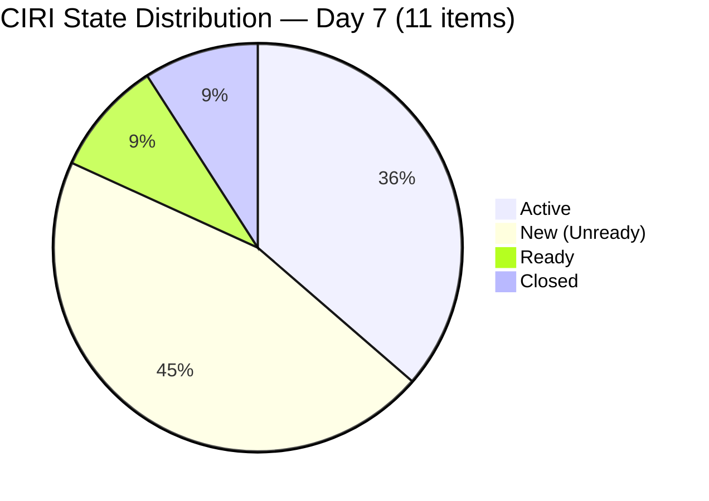
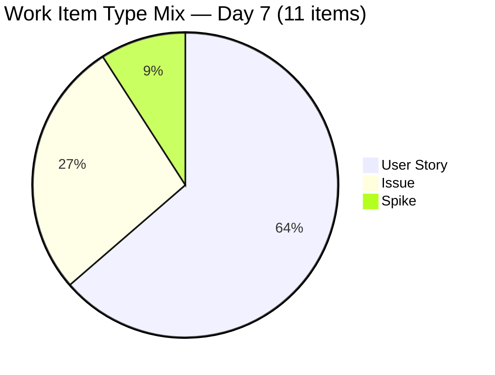
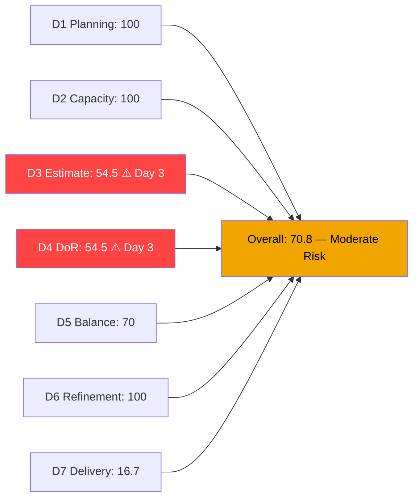
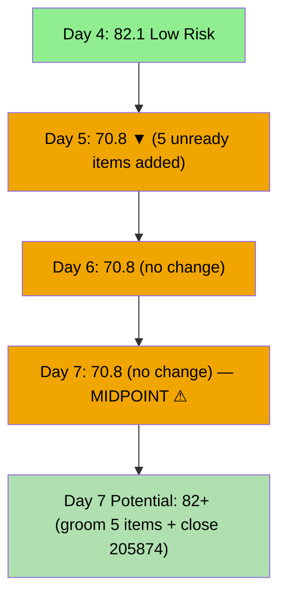
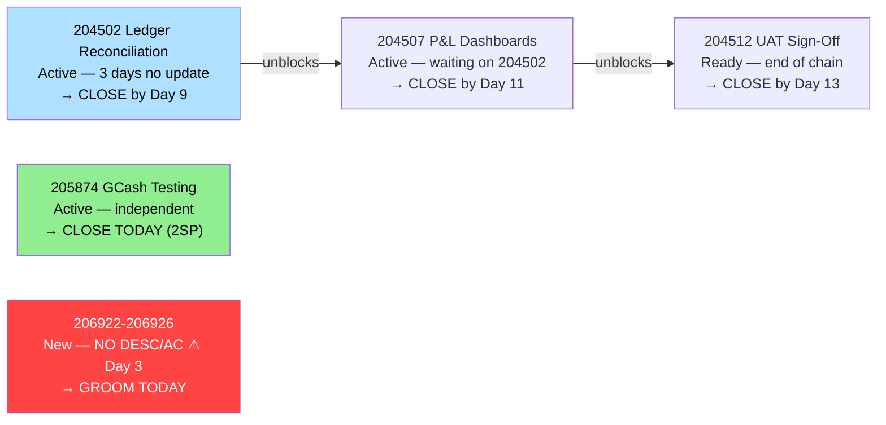

# ADO SAFe Audit — Finance Team

## 1. Audit Metadata

| Field | Value |
|-------|-------|
| **Audit Date** | 2026-06-21 (Sunday) — Day 7 of 14 |
| **Timezone** | PHT (UTC+8) |
| **Iteration** | Iteration 7.6 (IP) |
| **Iteration Dates** | 2026-06-15 to 2026-06-28 |
| **Sprint Day** | Day 7 — Sprint Midpoint |
| **ADO Project** | Jairosoft FINOPS |
| **ADO Project ID** | e0bb302f-40f9-46c3-8164-6f1acb317d63 |
| **ADO Team** | Finance Team |
| **ADO Team ID** | 1f4b45fa-82e8-4a36-aedc-6c1bc8f51070 |
| **Iteration ID** | bebf6f83-a342-42a2-bad7-a16951231732 |
| **Workspace** | `ado_fin` |
| **Prior Audit** | AUDIT_20260620_0905.md (Day 6, Iteration 7.6 IP, 70.8 — Moderate Risk) |
| **Overall Score** | **70.8 / 100** |
| **Risk Band** | **Moderate Risk** |

---

## 2. Executive Summary

The Finance Team **holds at 70.8 / 100 (Moderate Risk)** on Day 7 of Iteration 7.6 (IP) — **no change** from yesterday's 70.8. The sprint has reached its midpoint with zero activity since June 18. Five items (206922–206926) added three days ago remain in New state with no descriptions, no acceptance criteria, and no story points on four of them. This is now a **Day 3 DoR crisis** that has persisted through the sprint midpoint.

**Critical — unchanged Day 3 deficiencies:**
- 5 items (206922–206926) still unready after 3 days — no desc, no AC, and 4 of 5 still have no SP
- D3 = 54.5 — unchanged for the third consecutive day; 5 unestimated items (including Spike 206777)
- D4 = 54.5 — unchanged; SAFe DoR breach persisting into sprint midpoint
- D7 = 16.7% — no new closures since Day 3 (June 17)

**Sprint midpoint position:**
- Linear target for Day 7: 50% delivery (6 SP of 12 committed)
- Actual delivery: 16.7% (2 SP of 12)
- Gap: 4 SP behind linear target
- **If 205874 (GCash Testing, 2SP) closes today:** D7 = 4/12 = 33.3%

**Without immediate action on the 5 unready items, D3 and D4 cannot recover above 54.5 for the remainder of this sprint.** The sprint midpoint is the last practical window for corrective grooming before end-of-sprint pressure makes documentation impossible.

---

## 3. Previous Audit Delta

**Prior audit:** AUDIT_20260620_0905.md — Iteration 7.6 IP, Day 6, Score 70.8 / 100 (Moderate Risk)

| Dimension | Day 6 | Day 7 | Delta | Driver |
|-----------|-------|-------|-------|--------|
| D1 Iteration Planning | 100.0 | **100.0** | 0.0 | All 10 visible items in current iteration — unchanged |
| D2 Team Capacity | 100.0 | **100.0** | 0.0 | Grace: 2hr/day, 0 days off — unchanged |
| D3 Estimation | 54.5 | **54.5** | 0.0 | 6/11 estimated — no new SP on unready items |
| D4 DoR Compliance | 54.5 | **54.5** | 0.0 | 6/11 compliant — 206922–206926 still missing desc/AC |
| D5 Work Item Balance | 70.0 | **70.0** | 0.0 | Type mix unchanged |
| D6 Backlog Refinement | 100.0 | **100.0** | 0.0 | All items fresh; untouched 1/11=9.1% — no penalties |
| D7 Delivery Predictability | 16.7 | **16.7** | 0.0 | No new closures; 2 SP / 12 SP committed — unchanged |
| **Overall** | **70.8** | **70.8** | **0.0** | Zero ADO activity since Jun 18 — sprint midpoint stall |

**Significant changes since Day 6:**
- None detected. All items retain the same state, SP, and metadata as of the June 18 additions.
- 206584 (FTC Unpaid Invoice, 2SP) confirmed Closed via WIQL — sole closed item in 7.6 IP.
- 206777 (SSS & WISP Review, Spike) — still Active, no progress update, no SP assigned.
- 204502 (Ledger Reconciliation) — still Active since Jun 18; no ADO progress comment in 3 days.
- 205874 (GCash Testing) — still Active; primary near-term closure target remains unresolved.

---

## 4. Current Iteration Snapshot

| Attribute | Value |
|-----------|-------|
| **Active Iteration** | Iteration 7.6 (IP) |
| **Sprint Duration** | 2026-06-15 to 2026-06-28 (14 days) |
| **Audit Day** | Day 7 — Sprint Midpoint |
| **VRBI (visible root backlog items)** | 10 |
| **CIRI (active visible + WIQL closed)** | 11 (10 active + 206584 Closed) |
| **CIRI — New (unready)** | 5 (206922, 206923, 206924, 206925, 206926) |
| **CIRI — Active** | 4 (204502, 204507, 205874, 206777) |
| **CIRI — Ready** | 1 (204512) |
| **CIRI — Closed** | 1 (206584) |
| **Contributors with Current Work** | 1 (Grace) |
| **Contributors with Capacity** | 1 (Grace: 2hr/day, 0 days off) |
| **Committed Story Points (SP>0)** | 12 SP (204502=2, 204507=2, 204512=2, 205874=2, 206584=2, 206926=2) |
| **Closed Story Points** | 2 SP (206584) |
| **Delivery Rate** | 16.7% — Day 7 of 14 (linear target: 50.0%) |

**Delivery gap at midpoint:** Linear target = 6 SP (50%). Actual = 2 SP (16.7%). Gap = 4 SP. Remaining 7 days must deliver 10 SP for 100% completion, or 6.4 SP for 70% completion.

---

## 5. Work Item Analysis

### CIRI Items — Full Detail (11 items)

| ID | Title | Type | State | SP | Assignee | Changed | DoR | Notes |
|----|-------|------|-------|----|----------|---------|-----|-------|
| 204502 | Complete Full-Month Ledger Reconciliation | US | Active | 2 | Grace | 2026-06-18 | Yes | Dependency for 204507; 3 days no update |
| 204507 | Generate & Configure Clean P&L Dashboards | US | Active | 2 | Grace | 2026-06-16 | Yes | Downstream of 204502 |
| 204512 | Final Feature Audit, UAT, and Sign-Off | US | Ready | 2 | Grace | 2026-06-14 | Yes | End of dependency chain |
| 205874 | GCash Testing | US | Active | 2 | Grace | 2026-06-16 | Yes | **Independent — primary close target** |
| 206584 | FTC Unpaid Invoice | Issue | **Closed** | 2 | Grace | 2026-06-17 | Yes | CLOSED Day 3 — only delivery to date |
| 206777 | Review & Update Employee SSS & WISP | Spike | Active | — | Grace | 2026-06-17 | Yes | IP sprint appropriate; no SP — unestimated |
| 206922 | SOW — My Nurture (Apple) | US | **New** | — | Unassigned | 2026-06-18 | **No** | **Day 3 unready — no desc, no AC, no SP, no assignee** |
| 206923 | AA Invoice Payment | Issue | **New** | — | Unassigned | 2026-06-18 | **No** | **Day 3 unready — no desc, no AC, no SP, no assignee** |
| 206924 | Apple Invoice Payment | Issue | **New** | — | Unassigned | 2026-06-18 | **No** | **Day 3 unready — no desc, no AC, no SP, no assignee** |
| 206925 | SSI Invoice Payment | US | **New** | — | Unassigned | 2026-06-18 | **No** | **Day 3 unready — no desc, no AC, no SP, no assignee** |
| 206926 | GH Invoice Payment Reminder | US | **New** | 2 | Grace | 2026-06-18 | **No** | SP=2 set; **no desc, no AC — Day 3 unready** |

**DoR Analysis:**
- 206922: No Description field, no AcceptanceCriteria → FAIL
- 206923: No Description field, no AcceptanceCriteria → FAIL
- 206924: No Description field, no AcceptanceCriteria → FAIL
- 206925: No Description field, no AcceptanceCriteria → FAIL
- 206926: No Description field, no AcceptanceCriteria → FAIL (SP=2 but still DoR-failing)
- 206777: Description ≥30 chars ✓; AcceptanceCriteria ≥20 chars ✓ → PASS
- All other 5 items: PASS

---

## 6. SAFe Compliance Scorecard

| Dimension | Score | Evidence | Notes |
|-----------|-------|----------|-------|
| D1 Iteration Planning | **100.0** | 10/10 VRBI in current iteration | All active backlog items in Iteration 7.6 |
| D2 Team Capacity | **100.0** | Grace: 2hr/day, 0 days off | Sole contributor; capacity configured |
| D3 Estimation | **54.5** | 6/11 estimated | 206922–206925 (0 SP); 206777 (no SP); 206926 (2 SP, counted) |
| D4 DoR Compliance | **54.5** | 6/11 DoR compliant | 206922–206926 all missing desc and/or AC — Day 3 |
| D5 Work Item Balance | **70.0** | US=7/11=63.6%; Issue=3/11; Spike=1/11 | -30 dominant >60%; no spike penalty; US present |
| D6 Backlog Refinement | **100.0** | 10/10 fresh; 0 stale; 1/11 untouched=9.1% | No penalties; clean backlog |
| D7 Delivery Predictability | **16.7** | 2 SP closed / 12 SP committed | 206584 only closure; no new closures Day 4-7 |
| **Overall** | **70.8** | (100+100+54.5+54.5+70+100+16.7)/7 = 495.7/7 | **Moderate Risk** — third consecutive day at 70.8 |

**D3 Detail:**
- point_eligible CIRI = 11 (all work item types expose SP field)
- estimated (SP>0): 204502(2), 204507(2), 204512(2), 205874(2), 206584(2), 206926(2) = 6 items
- D3 = 6/11 = **54.5**

**D4 Detail:**
- dor_compliant: 204502 ✓, 204507 ✓, 204512 ✓, 205874 ✓, 206584 ✓, 206777 ✓ = 6 items
- Failing: 206922 (no desc, no AC), 206923 (no desc, no AC), 206924 (no desc, no AC), 206925 (no desc, no AC), 206926 (no desc, no AC)
- D4 = 6/11 = **54.5**

**D6 Detail:**
- VRBI = 10; all changed after 2026-05-07 → fresh = 10/10; base = 100
- stale_90 (before 2026-03-23): 0 → no penalty
- stale_180 (before 2025-12-24): 0 → no penalty
- untouched CIRI (ChangedDate strictly before 2026-06-15): 204512 (Jun14) = 1/11 = 9.1% → NOT >10% → no penalty
- D6 = **100.0**

**D7 Detail:**
- committed_story_points = 12 (items with SP>0: 204502, 204507, 204512, 205874, 206584, 206926)
- closed_story_points = 2 (206584, SP=2)
- D7 = 2/12 × 100 = **16.7%**

---

## 7. Dimension Findings

### D1 — Iteration Planning: 100.0

All 10 visible active backlog items are assigned to Iteration 7.6 (IP). The Finance team maintains perfect iteration commitment — a structural strength that masks the quality failures in D3 and D4. The clean D1 score does not reflect that 5 of the 10 items are not ready for work.

### D2 — Team Capacity: 100.0

Grace: 2 hours/day (1hr Documentation + 1hr Requirements). No days off. Unchanged from Day 1. Single-contributor team with configured capacity. The 2hr/day allocation is appropriate for Grace's focused Finance role but limits throughput — at this rate, Grace can deliver approximately 14 hours of capacity over the remaining 7 days.

### D3 — Estimation: 54.5 (CRITICAL — Day 3 of Deficiency)

Three consecutive audit days with 54.5 Estimation. Items 206922–206925 (4 items) remain at 0 SP. Item 206926 has SP=2. Spike 206777 has no SP. A team cannot measure velocity, plan releases, or prioritize accurately without story point estimates.

**If estimates are added to 206922–206925 (e.g., 1 SP each) and 206777 (1 SP):** D3 = 11/11 = 100.0. This is a 5-minute ADO task per item.

### D4 — DoR Compliance: 54.5 (CRITICAL — Day 3 of Deficiency)

All 5 items added June 18 (206922–206926) still lack descriptions and acceptance criteria at the sprint midpoint. Per SAFe, Definition of Ready is a pre-iteration commitment gate — items must be ready before they enter a sprint. These items bypassed the gate and have now consumed three days without being refined.

**SAFe principle violated:** Sprint midpoint with unready items represents a commitment quality breach. If these items are not groomed by Day 8, they will remain permanently unestimated and non-compliant — damaging D3 and D4 through sprint close.

**What's needed per item:**
- **206922 (SOW — My Nurture):** User-voice description + Given/When/Then AC + SP + assignee (Grace)
- **206923 (AA Invoice Payment):** Description + AC + SP + assignee (Grace)
- **206924 (Apple Invoice Payment):** Description + AC + SP + assignee (Grace)
- **206925 (SSI Invoice Payment):** Description + AC + SP + assignee (Grace)
- **206926 (GH Invoice Payment Reminder):** Description + AC (SP=2 already set; Grace assigned)

### D5 — Work Item Balance: 70.0

User Stories: 206922, 206925, 206926, 204502, 204507, 204512, 205874 = 7/11 = 63.6% → just above 60% → **-30 penalty**. Issues: 206923, 206924, 206584 = 3/11. Spike: 206777 = 1/11. The type distribution is reasonable for a Finance team; the US dominance is structural given the mix of operational and technical work items.

### D6 — Backlog Refinement: 100.0

All 10 visible backlog items are fresh (changed within 45 days). Zero stale-90 or stale-180 violations. The single untouched item (204512, changed Jun 14) sits at 9.1% — just below the 10% penalty threshold. D6 remains at 100.0. This score masks the DoR quality gap: fresh items can still be poorly defined.

### D7 — Delivery Predictability: 16.7 (Day 7 Midpoint — Critical)

**Day 7 midpoint with 16.7% delivery.** Linear target = 50%. Gap = 33 points.

**Delivery pipeline assessment:**

1. **205874 (GCash Testing, 2SP)** — Active since Jun 16. Grace should be running sandbox payment simulations. This is the highest-confidence near-term closure. If Grace closes today: D7 = 4/12 = 33.3%.

2. **204502 (Ledger Reconciliation, 2SP)** — Active since Jun 18. No ADO update in 3 days. Grace must add a progress comment or checklist by today. The month-end reconciliation may already be largely complete.

3. **204507 (P&L Dashboards, 2SP)** — Active, downstream of 204502. Cannot close until 204502 closes.

4. **204512 (UAT Sign-Off, 2SP)** — Ready, end of dependency chain. Must follow 204507.

5. **206922–206925 (Invoice items, 0 SP each)** — Cannot contribute to D7 until SP is assigned. If all 4 receive SP estimates after grooming, D7 denominator grows and D7 may decrease even as more items close.

**Sprint close scenario (all 12 SP committed):** Even if every SP-estimated item closes, D7 = 100% only if all 12 SP close. Current pace (2 SP in 7 days) implies approximately 4 SP total by sprint close — a 33% delivery rate without significant acceleration.

---

## 8. Risks and Bottlenecks

| Risk | Severity | Status |
|------|----------|--------|
| 206922–206926 — 5 items, Day 3 unready (no desc, no AC) | **CRITICAL** | Sprint midpoint crossed; grooming window closing |
| D3 = 54.5 — 3rd consecutive day; 5 items unestimated | **HIGH** | Denominator locked until grooming; velocity unmeasurable |
| D4 = 54.5 — SAFe DoR breach persisting through midpoint | **HIGH** | Process discipline failure; no sign of remediation |
| D7 = 16.7% — no new closures Days 4-7; 4 SP behind linear | **HIGH** | Sprint pace insufficient; cascade required this week |
| 204502 Active 3 days — no progress update in ADO | **MEDIUM** | Unknown completion status; Grace should add comment today |
| 204507 blocked on 204502 — dependency chain unresolved | **MEDIUM** | 4 SP gated on 204502 completion |
| 204512 UAT/Sign-Off — end of dependency chain | **MEDIUM** | Cannot begin until 204502+204507 both close |
| Single contributor (Grace) — bus factor = 1 | **MEDIUM** | Structural; any interruption halts all Finance delivery |
| 206922–206925 unassigned — Grace has no formal ownership | **LOW** | D2 count accurate (Grace is only assigned contributor) |

---

## 9. Prioritized Recommendations

1. **[MANDATORY — Today, Day 7 midpoint]** Groom all 5 unready items (206922–206926). For each: (a) write a user-voice description (≥30 non-whitespace chars), (b) add Given/When/Then acceptance criteria (≥20 non-whitespace chars), (c) assign story points (suggested 1-2 SP each for invoice items), (d) assign to Grace. **This is the last practical grooming opportunity before sprint close pressure begins.** Failure to act today means D3 and D4 remain at 54.5 for the rest of the sprint.

2. **[TODAY — highest delivery priority]** Close **205874 (GCash Testing, 2SP)** — Active for 5 days, independent of the ledger chain. Sandbox testing should be complete. Closure today brings D7 to 33.3% and proves team velocity.

3. **[TODAY]** Add a progress comment to **204502 (Ledger Reconciliation, 2SP)** — Active 3 days without ADO update. Describe current reconciliation status, percentage complete, and expected close date. This visibility is required for dependency planning.

4. **[By Day 9]** Close **204502 (Ledger Reconciliation, 2SP)** — unblock the dependency chain. Once 204502 closes, activate and progress 204507 immediately.

5. **[By Day 11]** Close **204507 (P&L Dashboards, 2SP)** — downstream of 204502. As soon as 204502 is closed, Grace should proceed with P&L dashboard configuration.

6. **[By Day 13]** Close **204512 (Final UAT, 2SP)** — end-of-sprint UAT sign-off. Must follow 204507.

7. **[Today, if SP on 206777]** Set StoryPoints on **206777 (SSS & WISP Spike)** to at least 1 SP. This reduces D3 gap and confirms team commitment to the task.

8. **[Process gate — permanent]** Establish a formal pre-sprint DoR checklist: before any item enters a sprint, it must have (a) description, (b) acceptance criteria, (c) story points, (d) assignee. Items 206922–206926 failed all four gates on June 18 and remain uncorrected 3 days later.

---

## 10. Evidence Gaps and Limitations

| Gap | Impact | Mitigation |
|-----|--------|-----------|
| 206922–206925 unassigned — may belong to Grace but not confirmed | Contributor count understated; D2 uses confirmed assignees only | D2 accurate with Grace; gap is a data quality issue |
| 206777 (Spike) no SP — included in D3 denominator as unestimated | D3 = 6/11 = 54.5; if excluded, D3 = 6/10 = 60% | Rubric includes all CIRI types; consistent application |
| 204502 Active 3 days — no ADO progress since Jun 18 | Unknown completion status; D7 cannot capture unrecorded progress | Grace must add progress comment by Day 7 |
| D7 denominator (12 SP) excludes 4 unestimated items | If 206922–206925 receive SP estimates, denominator grows, D7 may fall | Scoring follows rubric; unestimated items excluded from committed_SP |
| WIQL closed-item query scoped to project level | 206394 (HR team, Jun 17) also returns in closed query | Finance items verified by AreaPath; 206394 excluded |

---

