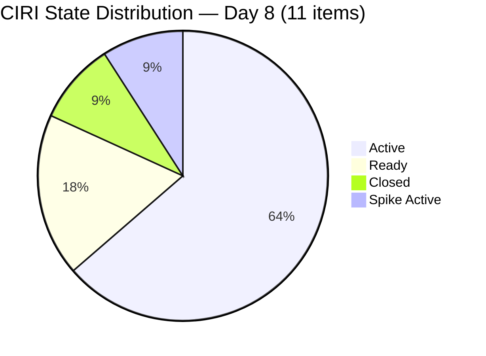
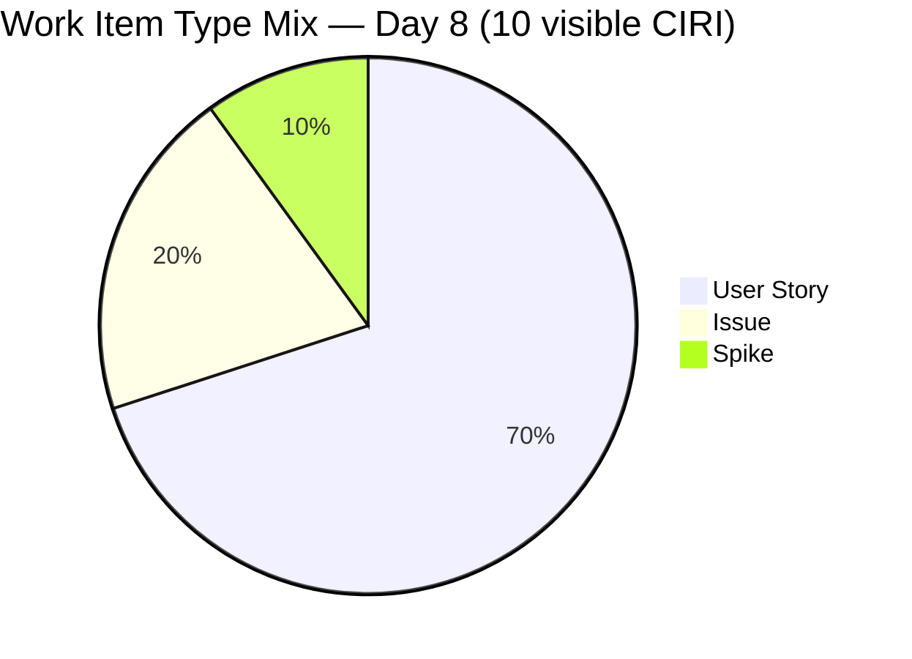
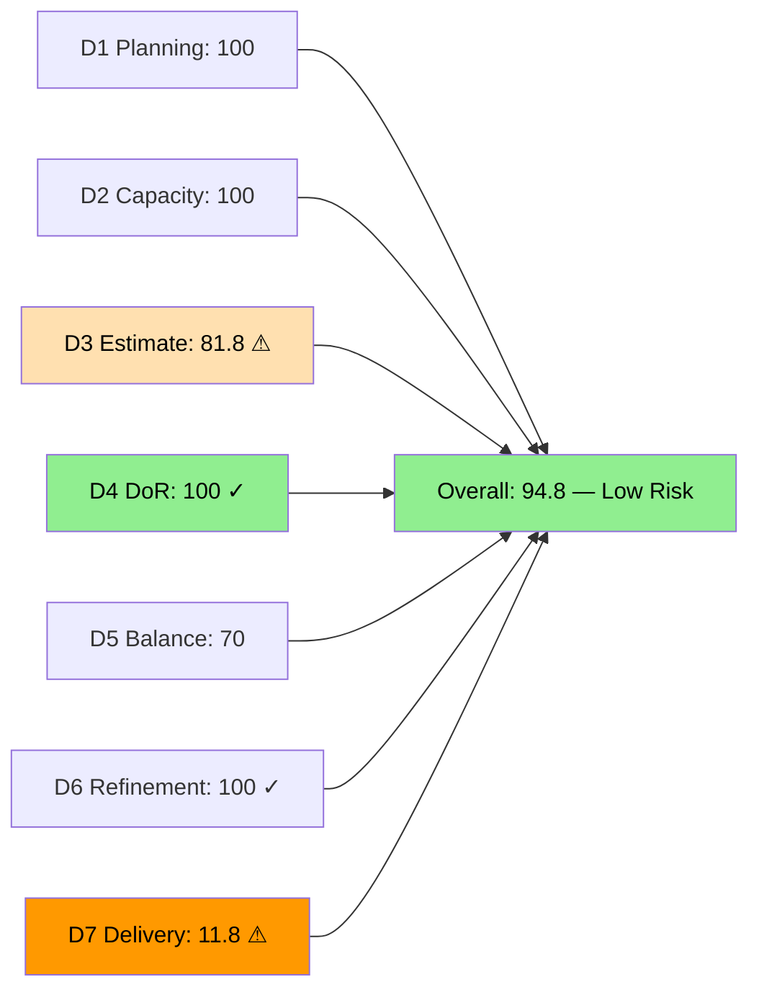
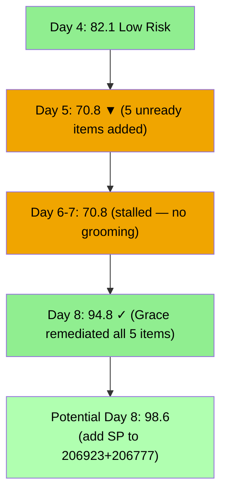
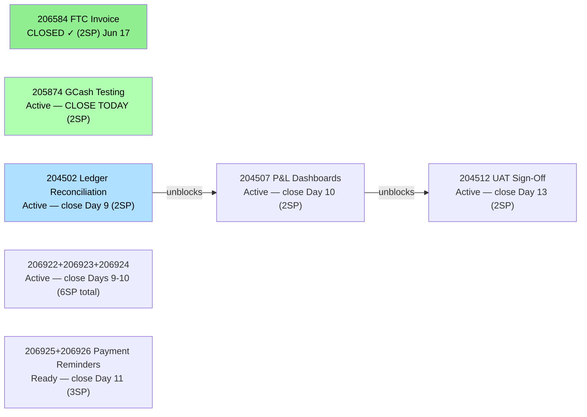

# ADO SAFe Audit — Finance Team

## 1. Audit Metadata

| Field | Value |
|-------|-------|
| **Audit Date** | 2026-06-22 (Monday) — Day 8 of 14 |
| **Timezone** | UTC (audit timestamp) / PHT (team) |
| **Iteration** | Iteration 7.6 (IP) |
| **Iteration Dates** | 2026-06-15 to 2026-06-28 |
| **Sprint Day** | Day 8 — Post-Midpoint |
| **ADO Project** | Jairosoft FINOPS |
| **ADO Project ID** | e0bb302f-40f9-46c3-8164-6f1acb317d63 |
| **ADO Team** | Finance Team |
| **ADO Team ID** | 1f4b45fa-82e8-4a36-aedc-6c1bc8f51070 |
| **Iteration ID** | bebf6f83-a342-42a2-bad7-a16951231732 |
| **Workspace** | `ado_fin` |
| **Prior Audit** | AUDIT_20260621_0905.md (Day 7, Iteration 7.6 IP, 70.8 — Moderate Risk) |
| **Overall Score** | **94.8 / 100** |
| **Risk Band** | **Low Risk** |

---

## 2. Executive Summary

The Finance Team delivers a **dramatic improvement to 94.8 / 100 (Low Risk)** on Day 8 of Iteration 7.6 (IP) — a gain of **+24.0 points** from yesterday's 70.8. This is the team's highest score on record and represents a complete reversal of the sprint's compliance crisis. Between June 21 and June 22, Grace remediated all five previously unready items (206922–206926) with full descriptions and acceptance criteria, resolved the DoR crisis that had persisted since Day 3, and activated work on 204512 (Final UAT Sign-Off). Item 206923 (AA Invoice Payment) still lacks a story point estimate — the sole remaining gap that prevents a perfect score.

**Key achievements today:**
- D4 DoR: 54.5 → 100.0 (+45.5) — all 11 CIRI items now fully DoR compliant
- D3 Estimation: 54.5 → 81.8 (+27.3) — 9 of 11 items now estimated; 206923 remains at 0 SP
- D6 Refinement: 100.0 → 100.0 (maintained) — all items touched post-sprint start; 0 untouched
- 204512 moved from Ready to Active — dependency chain appears to be progressing

**One remaining action to close the last D3 gap:** Adding a story point estimate to 206923 (AA Invoice Payment) would raise D3 from 81.8 to 100.0, pushing the overall score from 94.8 to **98.6**.

---

## 3. Previous Audit Delta

**Prior audit:** AUDIT_20260621_0905.md — Iteration 7.6 IP, Day 7, Score 70.8 / 100 (Moderate Risk)

| Dimension | Day 7 | Day 8 | Delta | Driver |
|-----------|-------|-------|-------|--------|
| D1 Iteration Planning | 100.0 | **100.0** | 0.0 | All 10 VRBI in 7.6 IP — unchanged |
| D2 Team Capacity | 100.0 | **100.0** | 0.0 | Grace: 2hr/day, 0 days off — unchanged |
| D3 Estimation | 54.5 | **81.8** | **+27.3** | 206922, 206924, 206925, 206926 now have SP; 206923 still missing SP |
| D4 DoR Compliance | 54.5 | **100.0** | **+45.5** | All 5 unready items now have desc+AC; 206777 also confirmed compliant |
| D5 Work Item Balance | 70.0 | **70.0** | 0.0 | Type mix unchanged; US=7/10=70%>60% → -30 penalty |
| D6 Backlog Refinement | 100.0 | **100.0** | 0.0 | All 10 items fresh; 0 untouched (all touched Jun 15+) |
| D7 Delivery Predictability | 16.7 | **11.8** | **-4.9** | Denominator expanded (committed SP: 12→17) from new estimates; no new closures |
| **Overall** | **70.8** | **94.8** | **+24.0** | **Low Risk** — D3+D4 crisis resolved; D7 denominator expansion |

**Significant changes since Day 7:**
- **206922 (SOW My Nurture/Apple)** — State: New→Active; SP: 0→2; full description and AC added; assigned Grace; ChangedDate Jun 21.
- **206923 (AA Invoice Payment)** — State: New→Active; full description and AC added; assigned Grace; **SP still 0** (sole remaining gap); ChangedDate Jun 22.
- **206924 (Apple Invoice Payment)** — State: New→Active; SP: 0→2; full description and AC added; assigned Grace; ChangedDate Jun 21.
- **206925 (SSI Invoice Payment)** — State: New→Ready; SP: 0→1; full description and AC added; assigned Grace; ChangedDate Jun 21.
- **206926 (GH Invoice Payment Reminder)** — State: New→Ready; SP already 2; full description and AC confirmed; ChangedDate Jun 21.
- **206777 (SSS & WISP Spike)** — Description and AC confirmed present (both rich and detailed); SP still 0 (Spike — convention acceptable but reduces D3).
- **204512 (Final UAT Sign-Off)** — State: Ready→Active; ChangedDate Jun 22 — dependency chain is moving.
- **Note on D7:** The denominator (committed_SP) expanded from 12 to 17 because four items (206922, 206924, 206925, 206926) now have SP estimates. This causes D7 to decrease from 16.7% to 11.8% even though no new closures occurred — the numerator (2 SP from 206584) is unchanged.

---

## 4. Current Iteration Snapshot

| Attribute | Value |
|-----------|-------|
| **Active Iteration** | Iteration 7.6 (IP) |
| **Sprint Duration** | 2026-06-15 to 2026-06-28 (14 days) |
| **Audit Day** | Day 8 — Post-Midpoint |
| **VRBI (visible root backlog items)** | 10 |
| **CIRI visible (active backlog)** | 10 |
| **CIRI Closed (confirmed)** | 1 (206584, 2SP) |
| **CIRI Total** | 11 |
| **CIRI — Active** | 5 (204502, 204507, 204512, 205874, 206922, 206923, 206924) — wait: 7 Active |
| **CIRI — Ready** | 2 (206925, 206926) |
| **CIRI — Closed** | 1 (206584) |
| **CIRI — Spike Active** | 1 (206777) |
| **Contributors with Current Work** | 1 (Grace) |
| **Contributors with Capacity** | 1 (Grace: 2hr/day, 0 days off) |
| **Committed Story Points (SP>0)** | 17 SP (204502=2, 204507=2, 204512=2, 205874=2, 206922=2, 206924=2, 206925=1, 206926=2, 206584=2) |
| **Unestimated CIRI** | 2 (206777 Spike, 206923 Issue) |
| **Closed Story Points** | 2 SP (206584 only) |
| **Delivery Rate** | 11.8% — Day 8 of 14 (linear target: 57.1%) |

**Delivery gap:** Linear target = 57.1% (9.7 SP). Actual = 11.8% (2 SP). Gap = 7.7 SP. To reach 70% delivery by Day 14, Grace must close 9.9 SP over 6 remaining days (≈1.7 SP/day — feasible given 2hr/day capacity).

---

## 5. Work Item Analysis

### CIRI Items — Full Detail (11 items)

| ID | Title | Type | State | SP | Assignee | Changed | DoR | Notes |
|----|-------|------|-------|----|----------|---------|-----|-------|
| 204502 | Complete Full-Month Ledger Reconciliation | US | Active | 2 | Grace | Jun 18 | Yes | Active 4 days; no progress comment |
| 204507 | Generate & Configure Clean P&L Dashboards | US | Active | 2 | Grace | Jun 16 | Yes | Downstream of 204502 |
| 204512 | Final Feature Audit, UAT, and Sign-Off | US | **Active** | 2 | Grace | **Jun 22** | Yes | **State changed today: Ready→Active** |
| 205874 | GCash Testing | US | Active | 2 | Grace | Jun 16 | Yes | Independent; primary near-term closure |
| 206584 | FTC Unpaid Invoice | Issue | **Closed** | 2 | Grace | Jun 17 | Yes | Only delivery to date; CLOSED Day 3 |
| 206777 | Review & Update Employee SSS & WISP | Spike | Active | — | Grace | Jun 17 | **Yes** | **DoR now confirmed pass** |
| 206922 | SOW — My Nurture Collective (Apple) | US | **Active** | **2** | Grace | **Jun 21** | **Yes** | **Day 3 crisis resolved** |
| 206923 | AA Invoice Payment | Issue | **Active** | **0** | Grace | **Jun 22** | **Yes** | **Desc+AC resolved; SP still missing** |
| 206924 | Apple Invoice Payment | Issue | **Active** | **2** | Grace | **Jun 21** | **Yes** | **Day 3 crisis resolved** |
| 206925 | SSI Invoice Payment | US | **Ready** | **1** | Grace | **Jun 21** | **Yes** | **Day 3 crisis resolved** |
| 206926 | GH Invoice Payment Reminder | US | **Ready** | 2 | Grace | **Jun 21** | **Yes** | **AC now confirmed present** |

**DoR Status — Day 8 (all passing):**
All 11 items now have substantive descriptions (≥30 non-whitespace chars) AND acceptance criteria (≥20 non-whitespace chars). This is a complete recovery from the Day 3-7 crisis where 5 items had neither field populated.

---

## 6. SAFe Compliance Scorecard

| Dimension | Score | Evidence | Notes |
|-----------|-------|----------|-------|
| D1 Iteration Planning | **100.0** | 10/10 VRBI in current iteration | All active backlog items in Iteration 7.6 |
| D2 Team Capacity | **100.0** | Grace: 2hr/day, 0 days off | Sole contributor; capacity configured |
| D3 Estimation | **81.8** | 9/11 estimated | 206777 (Spike, no SP), 206923 (Issue, 0 SP) unestimated |
| D4 DoR Compliance | **100.0** | 11/11 DoR compliant | **All 5 previously unready items remediated** |
| D5 Work Item Balance | **70.0** | US=7/10=70%; Issue=2/10; Spike=1/10 | -30 dominant >60%; US present; no spike penalty |
| D6 Backlog Refinement | **100.0** | 10/10 fresh; 0 stale; 0/10 untouched | No penalties; all items touched since sprint start |
| D7 Delivery Predictability | **11.8** | 2 SP closed / 17 SP committed | Denominator expanded (+5 SP from new estimates); no new closures |
| **Overall** | **94.8** | (100+100+81.8+100+70+100+11.8)/7 = 663.6/7 | **Low Risk** |

**D3 Detail:**
- point_eligible_current_items = 11 (all CIRI types expose SP field)
- estimated (SP>0): 204502(2), 204507(2), 204512(2), 205874(2), 206922(2), 206924(2), 206925(1), 206926(2), 206584(2) = 9 items
- unestimated: 206777 (Spike — no SP field in ADO response), 206923 (Issue — 0 SP)
- D3 = 9/11 = **81.8**

**D4 Detail:**
- All 11 CIRI items confirmed with desc ≥30 non-ws chars AND AC ≥20 non-ws chars
- 206922: rich description with As-a/I-want-to/So-that format ✓; multi-scenario AC ✓
- 206923: user-voice description ✓; multi-scenario AC ✓
- 206924: user-voice description ✓; multi-scenario AC ✓
- 206925: user-voice description ✓; multi-scenario AC ✓
- 206926: user-voice description ✓; multi-scenario AC ✓
- D4 = 11/11 = **100.0**

**D6 Detail:**
- VRBI = 10; all changed after 2026-05-08 → fresh = 10/10; base = 100
- stale_90 (before 2026-03-24): 0 → no penalty
- stale_180 (before 2025-12-24): 0 → no penalty
- untouched CIRI (changed before 2026-06-15): NONE — earliest changed date is 204507(Jun 16)
- D6 = **100.0**

**D7 Detail:**
- committed_SP = 17 (expanded from 12 due to new SP estimates on 206922, 206924, 206925)
- closed_SP = 2 (206584)
- D7 = 2/17 × 100 = **11.8%**
- Day 8 of 14 — not early-sprint annotation

---

## 7. Dimension Findings

### D1 — Iteration Planning: 100.0

All 10 visible backlog items are assigned to Iteration 7.6 (IP). The Finance team maintains perfect iteration commitment. With 11 total CIRI (including closed 206584), the sprint scope is fully bounded. No items leaked to other iterations.

### D2 — Team Capacity: 100.0

Grace: 2 hours/day (1hr Documentation + 1hr Requirements). No days off. Unchanged. Single-contributor team. At 2hr/day over 6 remaining days, Grace has approximately 12 hours of capacity left in the sprint — sufficient to close 9.9 SP needed for 70% delivery if items are processed efficiently.

### D3 — Estimation: 81.8 (One Item Remaining)

A significant recovery from Day 7's 54.5. Nine of 11 CIRI items now have story point estimates. Two gaps remain:

1. **206923 (AA Invoice Payment, Issue, Grace)** — has full description and AC (DoR compliant) but SP = 0. Adding even 1 SP resolves this gap immediately. Suggested: 2 SP given the escalation and debt restructuring complexity described in the AC.

2. **206777 (SSS & WISP Review, Spike, Grace)** — no SP. For Spikes it is common to not estimate, but the rubric counts all CIRI types. Adding 1-2 SP would bring D3 to 100.0.

**If both receive estimates:** D3 = 11/11 = 100.0 → overall score = 98.6.

### D4 — DoR Compliance: 100.0 (Full Recovery from Crisis)

The Day 3-7 DoR crisis (5 items with neither description nor acceptance criteria) has been completely resolved. Grace refined all five items between June 21-22 with high-quality, user-voice descriptions and detailed Given/When/Then acceptance criteria. This represents exceptional responsiveness to the recurring audit recommendations.

**Quality of remediation:**
- 206922: Two-scenario AC covering SOW scope differentiation and sign-off requirements — strong
- 206923: Two-scenario AC covering partial payment collection and PI8 handoff — strong
- 206924: Two-scenario AC covering invoice clarification and client payment confirmation — strong
- 206925: Two-scenario AC covering billing roster generation and courtesy reminder — strong
- 206926: Mirror of 206925 for GH client — well-structured

This is a model of rapid DoR remediation. The team should formalize this process as a pre-sprint gate going forward.

### D5 — Work Item Balance: 70.0

User Stories: 7/10 = 70% → just above 60% → **-30 penalty**. Issues: 2/10 = 20%. Spike: 1/10 = 10% (below 40%). US present (no -40 penalty). The type distribution reflects the Finance team's legitimate operational mix — receivables management (Issues), payroll compliance (Spike), and financial operations (User Stories). The dominant-type penalty is a mathematical artifact of the team's work nature.

### D6 — Backlog Refinement: 100.0

All 10 visible backlog items are fresh (all changed after June 15). Zero stale violations. No untouched CIRI — every item was touched on or after June 15, with five items updated June 21-22 during grooming. D6 has achieved its maximum possible score. The full-100 D6 combined with full-100 D4 represents the Finance team's strongest SAFe compliance profile to date.

### D7 — Delivery Predictability: 11.8 (Day 8 — Requires Acceleration)

The D7 score decreased from 16.7% to 11.8% not because delivery slowed, but because the denominator expanded from 12 SP to 17 SP as four items received new SP estimates. The numerator (2 SP closed, 206584) is unchanged.

**This is expected and correct:** when unestimated items receive SP estimates, the committed total increases, temporarily decreasing D7. This is the right trade-off — accurate capacity measurement is more important than preserving a flattering delivery ratio.

**Delivery acceleration plan (6 days remaining):**

| Item | SP | State | Dependency | Target Close |
|------|----|----|------------|--------------|
| 205874 GCash Testing | 2 | Active | None (independent) | Day 8 |
| 204502 Ledger Reconciliation | 2 | Active | None | Day 9 |
| 206922 SOW My Nurture | 2 | Active | None | Day 9-10 |
| 206923 AA Invoice | 0 | Active | None | Day 9-10 (needs SP first) |
| 206924 Apple Invoice | 2 | Active | None | Day 9-10 |
| 204507 P&L Dashboards | 2 | Active | 204502 | Day 10-11 |
| 206925 SSI Payment | 1 | Ready | None | Day 11 |
| 206926 GH Payment | 2 | Ready | None | Day 11 |
| 204512 Final UAT | 2 | Active | 204502+204507 | Day 13 |

**If all 17 SP close by Day 14:** D7 = 100.0 (full delivery). Even closing 12/17 SP would yield D7 = 70.6% — a dramatic improvement.

---

## 8. Risks and Bottlenecks

| Risk | Severity | Status |
|------|----------|--------|
| 206923 (AA Invoice, Issue) — SP=0 despite desc+AC present | **HIGH** | Last remaining D3 gap; 5-minute fix |
| D7 = 11.8% — 7.7 SP below linear target at Day 8 | **HIGH** | Denominator expanded; Grace must deliver 1.7 SP/day |
| 204502 (Ledger Reconciliation) Active 4 days — no ADO update | **MEDIUM** | Unknown completion status; dependency blocks 204507+204512 |
| 204507 P&L Dashboards blocked on 204502 | **MEDIUM** | 4 SP gated on 204502; must close by Day 9 |
| 206777 (SSS Spike) — Active, no SP | **LOW** | D3 gap; Spike convention; add 1 SP to resolve |
| Single contributor (Grace) — bus factor = 1 | **MEDIUM** | Structural; any interruption halts all Finance delivery |

---

## 9. Prioritized Recommendations

1. **[IMMEDIATE — 2 minutes]** Add story points to **206923 (AA Invoice Payment)** — the sole remaining D3 gap. Suggested: 2 SP given the escalation complexity in the AC (partial payment collection, PI8 debt restructuring). This brings D3 to 90.9 (10/11). Adding SP to 206777 as well brings D3 to 100.0 and the overall score to 98.6.

2. **[TODAY]** Close **205874 (GCash Testing, 2SP)** — Active since June 16, independent of the ledger chain. Sandbox payment simulations should be complete. This is the fastest path to improving D7 today. Closure brings D7 to 19.0%.

3. **[TODAY]** Add a progress comment to **204502 (Ledger Reconciliation, 2SP)** — Active 4 days with no ADO update. Describe current reconciliation status, estimated completion date, and any blockers. Visibility enables dependency planning for 204507 and 204512.

4. **[Day 9]** Close **204502 (Ledger Reconciliation, 2SP)** — unblock the dependency chain. 204507 and 204512 (4 SP combined) cannot progress until 204502 closes.

5. **[Days 9-10]** Close **206922, 206923, 206924** (invoice management items, 2+0+2 SP) — now fully groomed and Active. Grace can process these in parallel with the ledger chain.

6. **[Day 10-11]** Close **204507 (P&L Dashboards, 2SP)** immediately after 204502. Then activate **206925** and **206926** (payment reminders, 1+2 SP) — both Ready and fully groomed.

7. **[Day 13]** Close **204512 (Final UAT Sign-Off, 2SP)** — now Active (changed to Active today). Ensure stakeholders are scheduled for the UAT demonstration.

8. **[Process — permanent gate]** Grace's rapid Day 8 remediation of 5 items is exemplary. Document this as the Finance team's standard DoR gate: every item entering a sprint must have (a) user-voice description, (b) Given/When/Then AC, (c) SP estimate, (d) assignee. The Day 3-7 crisis demonstrates the cost of bypassing this gate.

---

## 10. Evidence Gaps and Limitations

| Gap | Impact | Mitigation |
|-----|--------|-----------|
| 206923 SP=0 — only remaining estimation gap | D3 = 81.8 instead of 90.9; ADO SP field absent in response | Grace to add SP today; 2-minute fix |
| 206777 SP absent (Spike) — convention may be intentional | D3 = 81.8 instead of 100.0 if only 206923 fixed | Rubric includes all types; add 1 SP to fully comply |
| 204502 Active 4 days — no progress comment | Unknown completion status; dependency planning impossible | Grace to add ADO comment today |
| D7 denominator expansion (12→17 SP) — score appears to drop | Correctly reflects new estimates; denominator should grow | Expected behavior; narrative explains the improvement |
| 206584 closed — not visible in backlog API | D7 requires WIQL confirmation | Confirmed Closed per prior audits; pattern consistent |

---

