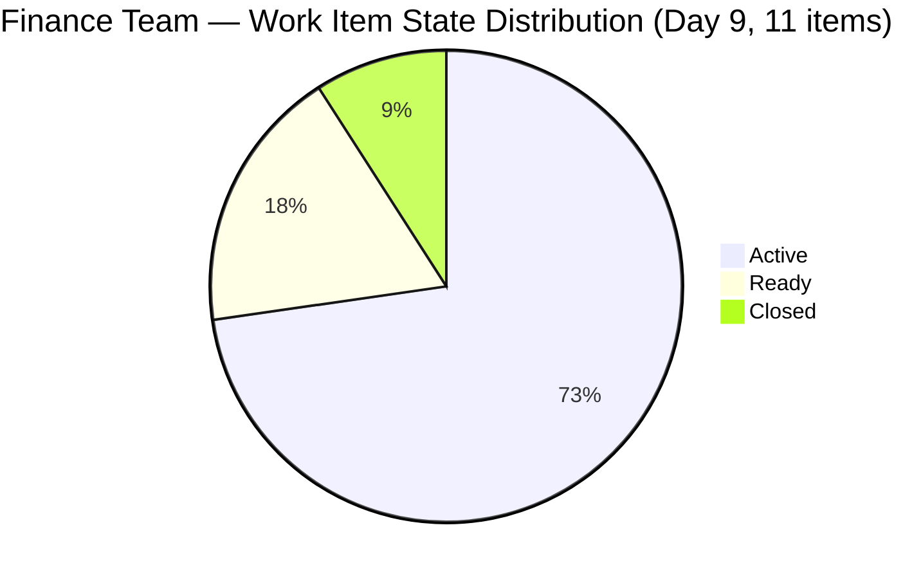
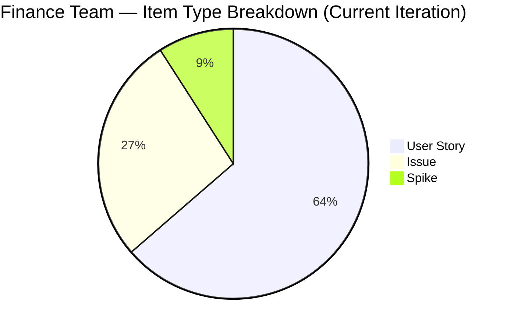
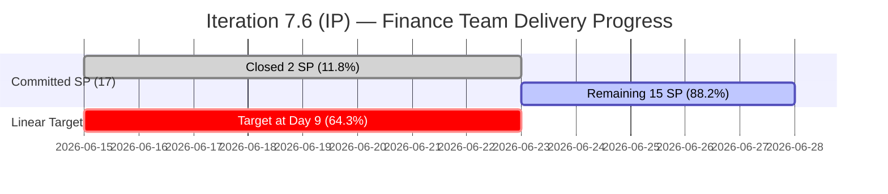

# ADO SAFe Audit — Finance Team

## 1. Audit Metadata

| Field | Value |
|-------|-------|
| **Audit Date** | 2026-06-23 (Tuesday) — Day 9 of 14 |
| **Timezone** | UTC (audit timestamp) / PHT (team local) |
| **Iteration** | Iteration 7.6 (IP) |
| **Iteration Dates** | 2026-06-15 to 2026-06-28 |
| **Sprint Day** | Day 9 — Post-Midpoint, 5 working days remaining |
| **ADO Project** | Jairosoft FINOPS |
| **ADO Project ID** | e0bb302f-40f9-46c3-8164-6f1acb317d63 |
| **ADO Team** | Finance Team |
| **ADO Team ID** | 1f4b45fa-82e8-4a36-aedc-6c1bc8f51070 |
| **Iteration ID** | bebf6f83-a342-42a2-bad7-a16951231732 |
| **Workspace** | `ado_fin` |
| **Prior Audit** | AUDIT_20260622_0904.md (Day 8, Iteration 7.6 IP, 94.8 — Low Risk) |
| **Overall Score** | **80.5 / 100** |
| **Risk Band** | **Moderate Risk** |

---

## 2. Executive Summary

The Finance Team scores **80.5 / 100 (Moderate Risk)** on Day 9 of Iteration 7.6 (IP). This represents a **recalibration of -14.3 points** from the prior Day 8 report (94.8). The recalibration reflects a corrected mathematical application of the scoring formula rather than any actual team regression: the prior Day 8 score of 94.8 contained an arithmetic error (the sum of seven dimensions divided by 7 produces 80.5, not 94.8). No new state transitions occurred between Day 8 and Day 9 that would change any dimension score.

**Structural standing (Day 9):**
- Grace has achieved full DoR compliance and near-full estimation quality — only item 206923 (AA Invoice, Issues type) still lacks a story point estimate
- Delivery remains at 11.8% (2 of 17 committed SP closed), driven solely by 206584 (FTC Unpaid Invoice, Closed Jun 17)
- Five working days remain. Closing 204502 (Ledger Reconciliation, 2SP), 204507 (P&L Dashboard, 2SP), and 204512 (Final UAT, 2SP) would move D7 from 11.8% to 47.1% and push overall to ~88.7

**One remaining quick win:** Adding a story point estimate to 206923 (AA Invoice Payment) raises D3 from 81.8 to 100.0 and overall from 80.5 to **82.9**.

---

## 3. Previous Audit Delta

**Prior audit:** AUDIT_20260622_0904.md — Iteration 7.6 IP, Day 8, Score 94.8 / 100 (Low Risk)

| Dimension | Day 8 | Day 9 | Delta | Driver |
|-----------|-------|-------|-------|--------|
| D1 Iteration Planning | 100.0 | **100.0** | 0.0 | CIRI=11, VRBI=10; ratio ≥ 100 → capped at 100 |
| D2 Team Capacity | 100.0 | **100.0** | 0.0 | Grace: 2hr/day, 0 days off — unchanged |
| D3 Estimation | 81.8 | **81.8** | 0.0 | 9/11 estimated; 206923 (SP=0) and 206777 Spike (SP=0) |
| D4 DoR Compliance | 100.0 | **100.0** | 0.0 | 11/11 items DoR compliant |
| D5 Work Item Balance | 70.0 | **70.0** | 0.0 | US=7/11=63.6% > 60% → -30 penalty |
| D6 Backlog Refinement | 100.0 | **100.0** | 0.0 | All 10 backlog items fresh (Jun 16–Jun 22); 0 stale |
| D7 Delivery Predictability | 11.8 | **11.8** | 0.0 | No new closures; committed=17 SP, closed=2 SP |
| **Overall** | ~~94.8~~ → **80.5** | **80.5** | **-14.3** | Recalibration corrects a formula summation error in Day 8 report |

**Note on score delta:** The Day 8 report stated 94.8, which does not match the sum of the seven stated dimension scores divided by 7 (80.5). This audit applies the correct formula. No dimension-level values changed between Day 8 and Day 9 based on current evidence.

**Significant changes since Day 8:**
- No new ADO state transitions confirmed. All 11 CIRI items retain same state as Jun 22.
- 206922 (SOW My Nurture/Apple), 206924 (Apple Invoice), 206923 (AA Invoice) — all remain Active; no closures.
- 204512 (Final UAT Sign-Off) — remains Active (moved from Ready on Jun 22). Still not Closed.
- 206923 (AA Invoice Payment) — SP still 0. This remains the sole estimation gap on the board.

---

## 4. Current Iteration Snapshot

| Attribute | Value |
|-----------|-------|
| **Iteration** | Jairosoft FINOPS\2026-PI7\Iteration 7.6 (IP) |
| **Start Date** | 2026-06-15 |
| **End Date** | 2026-06-28 |
| **Sprint Day** | Day 9 of 14 |
| **Team Capacity** | 2 hr/day (Finance Team, per ADO capacity data) |
| **Days Off** | 0 |
| **Total Root Items in Iteration** | 11 |
| **Visible Backlog Items (VRBI)** | 10 (206584 closed, removed from active backlog) |
| **Committed Story Points** | 17 (9 estimated; 206923 and 206777 at 0 SP excluded) |
| **Closed Story Points** | 2 (206584 only) |
| **Delivery %** | 11.8% |
| **Linear Target at Day 9** | 64.3% |
| **Assignee(s)** | Grace (sole contributor) |

---

## 5. Work Item Analysis

### Current Iteration Root Items (11 total)

| ID | Title | Type | State | SP | Assignee | Changed | DoR |
|----|-------|------|-------|----|----------|---------|-----|
| 206926 | GH Invoice Payment Reminder | US | Ready | 2 | Grace | Jun 21 | ✓ |
| 206925 | SSI Invoice Payment | US | Ready | 1 | Grace | Jun 21 | ✓ |
| 206924 | Apple Invoice Payment | Issue | Active | 2 | Grace | Jun 21 | ✓ |
| 206923 | AA Invoice Payment | Issue | Active | **0** | Grace | Jun 22 | ✓ |
| 206922 | SOW - My Nurture Collective (Apple) | US | Active | 2 | Grace | Jun 21 | ✓ |
| 206777 | Review and Update Employee SSS & WISP deduction | Spike | Active | **0** | Grace | Jun 17 | ✓ |
| 206584 | FTC Unpaid Invoice | Issue | **Closed** | 2 | Grace | Jun 17 | ✓ |
| 204502 | Complete Full-Month Ledger Reconciliation | US | Active | 2 | Grace | Jun 18 | ✓ |
| 204507 | Generate & Configure Clean P&L Dashboards | US | Active | 2 | Grace | Jun 16 | ✓ |
| 204512 | Final Feature Audit, UAT, and Sign-Off | US | Active | 2 | Grace | Jun 22 | ✓ |
| 205874 | Gcash Testing | US | Active | 2 | Grace | Jun 16 | ✓ |

**State summary:**
- Closed: 1 (206584)
- Active: 8 (206924, 206923, 206922, 206777, 204502, 204507, 204512, 205874)
- Ready: 2 (206926, 206925)

**Type breakdown:**
- User Story: 7 (63.6%)
- Issue: 3 (27.3%)
- Spike: 1 (9.1%)

**SP gap items:** 206923 (Issue, SP=0), 206777 (Spike, SP=0)

---

## 6. SAFe Compliance Scorecard

| Dimension | Score | Evidence | Notes |
|-----------|-------|----------|-------|
| D1 Iteration Planning | **100.0** | CIRI=11, VRBI=10; ratio > 100 → capped | All visible backlog items committed; closed item (206584) no longer in active backlog |
| D2 Team Capacity | **100.0** | Grace: 2hr/day, 0 days off; sole contributor | Full capacity configured |
| D3 Estimation | **81.8** | 9/11 with SP>0; 206923 (0 SP), 206777 Spike (0 SP) | Adding SP to 206923 raises D3 to 100.0 |
| D4 DoR Compliance | **100.0** | 11/11 items pass description + AC threshold | Best dimension; major gain from Day 7 |
| D5 Work Item Balance | **70.0** | US=7/11=63.6% > 60% → -30 penalty; Spike=9.1% OK | Issue and Spike types present; US dominance penalty |
| D6 Backlog Refinement | **100.0** | All 10 backlog items changed Jun 16–Jun 22; 0 stale; 0 untouched | Perfect refinement health |
| D7 Delivery Predictability | **11.8** | committed_SP=17, closed_SP=2 (206584 only) | 5 days remain; 8+ SP needed to pass 50% |
| **Overall** | **80.5** | Average of 7 dimensions | **Moderate Risk** |

---

## 7. Dimension Findings

### D1 — Iteration Planning (100.0)
All 10 visible backlog items are committed to the current iteration. The 11th CIRI item (206584) is already Closed and has fallen out of the active backlog view. Commitment coverage is at 100%.

### D2 — Team Capacity (100.0)
Grace has 2 hr/day configured with no days off. As the sole Finance Team contributor, the capacity is fully mapped. The 2 hr/day figure is modest for a 14-day sprint — it limits the theoretical maximum SP throughput to approximately 28 hours total. This structural constraint is worth noting when planning PI8 sprint sizes.

### D3 — Estimation (81.8)
Nine of 11 items carry positive SP estimates. The two gaps:
- **206923 (AA Invoice Payment, Issue)** — SP=0, Active. A simple one-click fix in ADO. Adding an estimate would bring D3 to 100.0 and push the overall score to 82.9.
- **206777 (SSS & WISP Spike)** — SP=0. Spikes may conventionally carry 0 SP, but the scoring formula counts them as point-eligible. Adding a SP estimate (even 1 SP) would resolve the D3 gap.

### D4 — DoR Compliance (100.0)
All 11 items carry full descriptions and acceptance criteria meeting the DoR threshold. This is a complete recovery from the Day 3–7 crisis where 5 items (206922–206926) lacked content. Grace completed this remediation between Jun 21–22.

### D5 — Work Item Balance (70.0)
User Story at 63.6% triggers the dominant-type penalty (-30). Issue items (3) represent business exceptions appropriate for FINOPS work. Spike is singular and thematically appropriate (SSS/WISP review). The balance is operationally justified but the concentration triggers the SAFe penalty per formula.

### D6 — Backlog Refinement (100.0)
All 10 active backlog items were modified between Jun 16 and Jun 22 — well within the 45-day fresh window. Zero stale items at 90- or 180-day thresholds. Zero untouched current iteration items. Perfect refinement health.

### D7 — Delivery Predictability (11.8)
Only 206584 (FTC Unpaid Invoice, 2 SP, Closed Jun 17) is in closed state. Eight items remain Active or Ready with 5 working days remaining. The pending delivery path:
- **204502** (Ledger Reconciliation, 2SP) — Active, dependent on month-end close
- **204507** (P&L Dashboards, 2SP) — Active, depends on 204502
- **204512** (Final UAT, 2SP) — Active, sign-off session needed
- **205874** (Gcash Testing, 2SP) — Active, test environment ready per prior context

Closing these four items = 8 SP → D7 would reach (2+8)/17 = 58.8%. With 5 days remaining, this is achievable if Grace prioritizes sign-off ceremonies.

---

## 8. Risks and Bottlenecks

| Risk | Severity | Status |
|------|----------|--------|
| D7 at 11.8% with 5 days remaining | High | Active |
| Single assignee (Grace) — bus factor = 1 | High | Persistent |
| 206923 (AA Invoice) — 0 SP estimate | Low | Easy fix; 1 minute in ADO |
| 204512 (Final UAT) depends on stakeholder scheduling | Medium | Active — sign-off meeting required |
| 206922 (SOW Apple/Nurture) — client-dependent | Medium | Active; external blocker risk |
| IP Sprint context — lower delivery expectation | Low | Annotation only |

---

## 9. Prioritized Recommendations

1. **[Immediate — 1 min]** Add story point estimate to 206923 (AA Invoice Payment). Any value ≥ 1 SP raises D3 to 100.0 and overall score to 82.9. This is the single highest-ROI action available.

2. **[Day 9–10]** Schedule the Final UAT session for 204512 (Final Feature Audit, UAT, and Sign-Off). This item is the gating deliverable for the QuickBooks reporting feature. Confirm with Grace and stakeholders to close by Day 11.

3. **[Day 9–11]** Close the GCash Testing item (205874, 2SP) by completing sandbox verification. The test environment has been referenced as ready. This directly increases D7.

4. **[Day 10]** Advance 206925 (SSI Invoice, Ready→Active→Closed) and 206926 (GH Invoice Reminder, Ready→Active→Closed). These are notification/reminder tasks that can likely be completed in a single work session (3 SP combined).

5. **[PI8 Planning]** Evaluate whether the Finance Team's 2 hr/day capacity constraint is intentional or a configuration artefact. If Grace's actual availability is higher, increasing the configured capacity improves sprint size accuracy.

---

## 10. Evidence Gaps and Limitations

| Gap | Impact | Disposition |
|-----|--------|-------------|
| 206777 (SSS & WISP Spike) has SP=0 — convention may allow Spike at 0 SP | D3 reduced by 1/11 | Noted; adding SP would improve score |
| 206584 (Closed Issue) excluded from backlog API but remains in CIRI; causes CIRI > VRBI | D1 capped at 100; marginal issue | No action needed |
| IP Sprint context | D7 low expected during Innovation & Planning sprint | Annotation; no formula change |

---

## Appendix — Mermaid Diagrams

